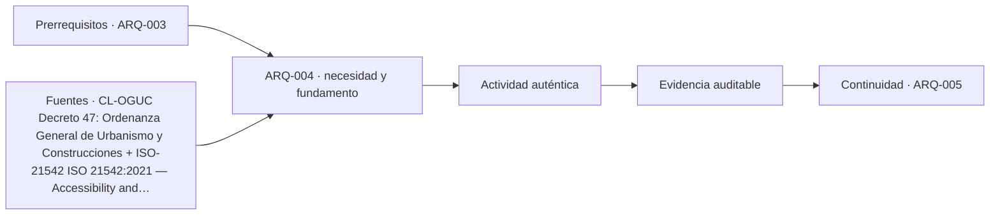

# ARQ-004 · Necesidades, deseos y derechos de quienes habitan

**Parte 01 · Clase redactada, primera edición de estudio · Incorporada en v0.2.0.**

Los casos y cifras son didácticos y originales. No son instrucciones de ejecución de obra ni acreditan habilitación profesional. Revisión externa disciplinar pendiente.

## Pregunta central

¿Cómo transformar lo que una persona pide en requisitos de proyecto sin confundir preferencias, necesidades y obligaciones?

## Qué aprenderás y qué entregarás

Elaborarás un registro que separe declaraciones de usuarios, interpretación de necesidades, alternativas y verificaciones normativas pendientes. Aprenderás a formular requisitos sin imponer prematuramente una solución. El producto será una tabla argumentada para un servicio ficticio de atención comunitaria.

## Pedir una cosa no siempre explica para qué se necesita

“Quiero una sala abierta” expresa una preferencia de organización. Puede estar motivada por supervisión, encuentro, sensación de amplitud o una imagen vista en otra obra. Si supones la motivación, puedes resolver el problema equivocado. La pregunta pedagógica es: ¿qué actividad debe ser posible y qué dificultad se intenta evitar?

Definimos **necesidad** como una condición relevante para realizar una actividad o mantener un bienestar situado; **deseo**, como una preferencia por cierto resultado o solución; y **requisito**, como una condición explícita cuya satisfacción puede comprobarse. Estas definiciones son operativas para aprender a proyectar, no diagnósticos psicológicos. Un deseo no es trivial por definición: puede expresar identidad, pertenencia o experiencias previas que el equipo no ha comprendido.

Un **derecho** pertenece a un marco normativo y de garantías, no a la simple suma de preferencias de un grupo. Su alcance exigible y los deberes concretos requieren identificar jurisdicción, texto aplicable, sujetos y procedimientos. El programa conserva una entrada a la OGUC para la consulta chilena [[CL-OGUC]](#FUENTE-CL-OGUC), pero esta clase no interpreta un caso jurídico ni inventa mínimos legales. La ficha de ISO 21542 identifica una referencia sobre accesibilidad del entorno construido; consultar su catálogo no equivale a disponer de todas sus cláusulas [[ISO-21542]](#FUENTE-ISO-21542).

## Separar cuatro capas evita decisiones falsas

La primera capa es la voz: “al abrir la puerta se escucha la conversación desde la espera”. La segunda es la interpretación: puede existir una dificultad de privacidad. La tercera es el requisito: durante una atención, la conversación no debería quedar expuesta a personas ajenas según un criterio que habrá que definir. La cuarta es la solución: separación espacial, control de accesos, tratamiento acústico u organización diferente.

Si saltas de la voz a “instalar un panel”, cierras opciones antes de comprender la causa. Si el panel impide ver una emergencia o interfiere con un recorrido, has trasladado el problema. Un requisito útil indica quién lo necesita, en qué escenario, cómo se comprobará y quién acuerda el criterio. Evita formulaciones imposibles como “privacidad total en cualquier condición”.

La medición y el testimonio se complementan. Un valor físico puede describir parte del ambiente; el relato explica experiencias y actividades. El CBE investiga la retroalimentación de ocupantes como información sobre desempeño [[USE-CBE]](#FUENTE-USE-CBE). No usamos su cuestionario ni consideramos que unas entrevistas ficticias sean investigación empírica validada.

## Caso trabajado: atención y reunión en un mismo espacio

Supón tres declaraciones inventadas: la administradora desea observar la entrada desde su puesto; quien atiende necesita discreción; y algunas personas esperan acompañadas. El presupuesto es limitado, pero no se conoce aún cuánto cuesta cada alternativa. No hay datos sobre dimensiones reglamentarias ni ocupación permitida.

<table>
<thead>
<tr>
  <th>Declaración</th>
  <th>Interpretación provisional</th>
  <th>Requisito por desarrollar</th>
  <th>Comprobación</th>
</tr>
</thead>
<tbody>
<tr>
  <td>“Necesito ver quién llega”</td>
  <td>Orientación y gestión del acceso</td>
  <td>Identificar llegadas sin interrumpir atención</td>
  <td>Recorrido simulado y revisión del puesto</td>
</tr>
<tr>
  <td>“No quiero que escuchen”</td>
  <td>Privacidad conversacional</td>
  <td>Definir escenarios y criterio de privacidad</td>
  <td>Revisión espacial y evaluación acústica pertinente</td>
</tr>
<tr>
  <td>“Vengo con alguien”</td>
  <td>Acompañamiento</td>
  <td>Considerar uso con acompañantes</td>
  <td>Programa y prueba de disposición</td>
</tr>
</tbody>
</table>

La tabla hace visibles las tensiones sin resolverlas mediante jerarquías personales. Una propuesta posible es separar recepción y atención. Otra es redistribuir muebles y accesos. Una tercera podría separar usos temporalmente, siempre que sea compatible con la necesidad de servicio. Todavía no se afirma cuál cumple: hay que verificarlo.

## Priorizar sin borrar a quienes participan menos

Una votación puede servir para elegir una preferencia compartida, pero no demuestra que una alternativa cumpla obligaciones o atienda a todas las personas. Si la mayoría prefiere un acceso y una persona no puede utilizarlo, el número de votos no elimina la dificultad. Debes registrar quién no estuvo presente, qué escenarios no se discutieron y qué restricciones requieren revisión específica.

Para este ejercicio se propone distinguir condiciones no negociables una vez verificadas, objetivos de desempeño acordados y preferencias abiertas. Esta clasificación no autoriza al estudiante a declarar por sí solo qué es legalmente no negociable. Cuando falta la fuente, la casilla correcta es “pendiente de verificar”, no “no aplica”.

El presupuesto tampoco convierte cualquier renuncia en aceptable. Primero identifica el efecto de reducir una prestación; después examina alternativas de alcance y coordinación. Puede ser necesario reformular el encargo antes de proponer algo que no responde a sus condiciones esenciales.

## Escucha, registro y datos personales

Solicita permiso antes de registrar testimonios, explica el objetivo y conserva solo lo necesario para el ejercicio. No pidas diagnósticos, ingresos ni información íntima para justificar necesidades espaciales si no son indispensables. En un caso real se necesita revisar las obligaciones aplicables al tratamiento de datos. Aquí se trabaja con personas y situaciones inventadas para aprender la estructura del razonamiento.

Distingue una observación del facilitador de una frase textual. No inventes citas para hacer convincente un informe. Cuando dos testimonios discrepan, conserva la diferencia y busca escenarios: quizás describen horas, actividades o posiciones distintas.

## Errores frecuentes

“Todo el mundo prefiere luz natural” es una generalización que omite tareas, deslumbramiento, privacidad y situaciones particulares. “Lo pidió el cliente” tampoco demuestra que la alternativa sea técnicamente adecuada. El error inverso consiste en descartar la experiencia del usuario porque no emplea vocabulario profesional.

Un requisito como “que sea bonito y cómodo” todavía no permite comparar propuestas. Puede abrir la conversación, pero necesita traducción a criterios situados sin fingir que toda cualidad espacial se reduce a una cifra.

## Práctica independiente

Una biblioteca ficticia recibe tres pedidos: “más mesas”, “menos ruido” y “un espacio donde conversar”. Redacta para cada uno una necesidad provisional y una pregunta de comprobación. Propón dos alternativas de organización y declara qué no sabes. No asignes áreas mínimas ni niveles acústicos legales inventados.

Solución razonada

“Más mesas” podría significar insuficiencia de puestos, permanencias largas o distribución poco flexible; hay que observar actividades antes de ampliar. “Menos ruido” requiere localizar fuentes, receptores y escenarios. “Conversar” necesita distinguir encuentro informal, trabajo colectivo y atención.

Una alternativa es separar zonas por actividad; otra es coordinar espacios y gestión de uso. Ambas requieren estudiar relaciones, supervisión y condiciones acústicas. La solución no consiste en prometer silencio y conversación simultáneos en cualquier configuración, sino en hacer explícito el conflicto y diseñar una comprobación.

## Autoevaluación y transferencia

Tu trabajo debe conservar la declaración original, marcar la interpretación como provisional, formular requisitos comprobables y separar la revisión normativa de las preferencias. Si ya elegiste materiales antes de describir la actividad, revisa la secuencia. Si una persona afectada no aparece en el registro, investiga la omisión.

Esta forma de trabajo se transfiere a vivienda, salud, educación y trabajo, pero no sus requisitos particulares. En cada caso cambian usuarios, responsabilidades y fuentes que deben consultarse.

<!-- pedagogia-2026:inicio -->
## Decisión pedagógica y posición curricular

### Por qué existe

Esta clase existe para resolver una necesidad concreta del recorrido: ¿Cómo transformar lo que una persona pide en requisitos de proyecto sin confundir preferencias, necesidades y obligaciones?

### Por qué está exactamente aquí

Ocupa el lugar 4 de la Parte 01. Se estudia después de ARQ-003 · Escalas: objeto, recinto, edificio, barrio y territorio porque usa esa base para responder «¿Cómo transformar lo que una persona pide en requisitos de proyecto sin confundir preferencias, necesidades y obligaciones?». Se ubica antes de ARQ-005 · Ética del encargo y conflictos de interés porque la evidencia producida aquí debe estar disponible para ese paso.

- **Prerrequisitos:** `ARQ-003`
- **Capacidad que introduce:** Elaborarás un registro que separe declaraciones de usuarios, interpretación de necesidades, alternativas y verificaciones normativas pendientes. Aprenderás a formular requisitos sin imponer prematuramente una solución. El producto será una tabla argumentada para un servicio ficticio de atención comunitaria.
- **Clases o experiencias que dependen de ella:** `ARQ-005`

El diagrama permite comprobar una relación que el texto lineal oculta con facilidad: esta clase recibe capacidades previas, toma decisiones apoyadas por fuentes, exige una experiencia y produce evidencia que habilita trabajo posterior. No representa un procedimiento de obra.

## Resultado observable, evidencia y evaluación

1. Identificar y delimitar las condiciones necesarias para responder la pregunta central de necesidades, deseos y derechos de quienes habitan.
2. Producir y comprobar la evidencia declarada por la clase: Elaborarás un registro que separe declaraciones de usuarios, interpretación de necesidades, alternativas y verificaciones normativas pendientes. Aprenderás a formular requisitos sin imponer prematuramente una solución. El producto será una tabla argumentada para un servicio ficticio de atención comunitaria.
3. Justificar una decisión de necesidades, deseos y derechos de quienes habitan mediante fuentes, supuestos, alternativas y límites explícitos.

## Actividad, evidencia y criterio de aceptación

**Actividad:** Una biblioteca ficticia recibe tres pedidos: “más mesas”, “menos ruido” y “un espacio donde conversar”. Redacta para cada uno una necesidad provisional y una pregunta de comprobación. Propón dos alternativas de organización y declara qué no sabes.

**Evidencia mínima:** Elaborarás un registro que separe declaraciones de usuarios, interpretación de necesidades, alternativas y verificaciones normativas pendientes. Aprenderás a formular requisitos sin imponer prematuramente una solución. El producto será una tabla argumentada para un servicio ficticio de atención comunitaria.

**Archivo sugerido:** `evidence/ARQ-004/evidencia.md`.

**Criterio de aceptación:** la entrega se acepta cuando:

- La entrega responde explícitamente a la pregunta: ¿Cómo transformar lo que una persona pide en requisitos de proyecto sin confundir preferencias, necesidades y obligaciones?
- La actividad conserva las fronteras del caso y permite reconstruir el procedimiento: Una biblioteca ficticia recibe tres pedidos: “más mesas”, “menos ruido” y “un espacio donde conversar”. Redacta para cada uno una necesidad provisional y una pregunta de comprobación. Propón dos alternativas de organización y declara qué no sabes.
- Cada afirmación externa puede seguirse hasta una fuente, su alcance consultado y su límite.
- La evidencia deja disponible una entrada comprobable para ARQ-005.
- “Todo el mundo prefiere luz natural” es una generalización que omite tareas, deslumbramiento, privacidad y situaciones particulares. “Lo pidió el cliente” tampoco demuestra que la alternativa sea técnicamente adecuada.

La [rúbrica común](../../docs/RUBRICA_COMUN.md) complementa estos criterios; no los reemplaza. Una entrega puede superar un promedio y continuar pendiente si oculta una condición crítica.

## Trazabilidad de las decisiones

| # | Decisión o fundamento | Fuente utilizada | Aplicación y límite en esta clase |
|---:|---|---|---|
| 1 | Localizador principal para verificar requisitos urbanísticos y de edificación Acceso: Texto consolidado disponible; revisión de marco, no de cada disposición | [CL-OGUC Decreto 47: Ordenanza General de Urbanismo y Construcciones](https://www.bcn.cl/leychile/navegar?idNorma=8201) | Consulta: Alcance consultado no documentado; debe completarse antes de ampliar la conclusión. Límite: Una ficha educativa no reemplaza lectura del artículo vigente, sus modificaciones, transitorios y antecedentes del proyecto. |
| 2 | Accesibilidad y usabilidad del entorno edificado dentro de su alcance Acceso: Ficha pública | [ISO-21542 ISO 21542:2021 — Accessibility and usability of the built…](https://www.iso.org/standard/71860.html) | Consulta: Alcance consultado no documentado; debe completarse antes de ampliar la conclusión. Límite: No usar medidas de referencia como anchos legales; confirmar OGUC y demás requisitos locales. No cubre por sí sola todo el espacio público. |
| 3 | Uso sistemático de retroalimentación de ocupantes para estudiar desempeño. Acceso: Página del proyecto y objetivos; no se extrajo la base de datos ni se replicó su cuestionario. | [USE-CBE Occupant Indoor Environmental Quality Survey and Building…](https://cbe.berkeley.edu/research/occupant-survey-and-building-benchmarking/) | Consulta: Alcance consultado no documentado; debe completarse antes de ampliar la conclusión. Límite: Los registros de uso del programa son sintéticos; no son resultados empíricos del CBE. Las referencias nuevas se consultaron el 21 de septiembre de 2026. Las referencias heredadas conservan en el catálogo su fecha y alcance originales. Las deducciones, casos y criterios docentes se identifican como elaboración de este programa, no como resultados de las instituciones citadas. |

La tabla permite auditar las relaciones; la explicación, el caso y la práctica de la clase siguen siendo la documentación principal.

## Autoevaluación, recuperación y continuidad

### Errores diagnósticos

Antes de avanzar, comprueba si puedes reconstruir cada resultado sin mirar la solución, señalar qué evidencia lo sostiene y nombrar una condición que obligaría a revisar tu decisión. Conserva la primera versión, la objeción recibida y la revisión.

**Conexión siguiente:** La continuidad inmediata es ARQ-005 · Ética del encargo y conflictos de interés; conserva el método y vuelve a verificar datos y límites.
<!-- pedagogia-2026:fin -->

## Fuentes y alcance de uso

- **[[CL-OGUC]](#FUENTE-CL-OGUC) Decreto 47: Ordenanza General de Urbanismo y Construcciones** — BCN / LeyChile.
[https://www.bcn.cl/leychile/navegar?idNorma=8201](https://www.bcn.cl/leychile/navegar?idNorma=8201)
Apoyo: Localizador principal para verificar requisitos urbanísticos y de edificación
Acceso: Texto consolidado disponible; revisión de marco, no de cada disposición Límite: Una ficha educativa no reemplaza lectura del artículo vigente, sus modificaciones, transitorios y antecedentes del proyecto.

- **[[ISO-21542]](#FUENTE-ISO-21542) ISO 21542:2021 — Accessibility and usability of the built environment** — ISO.
[https://www.iso.org/standard/71860.html](https://www.iso.org/standard/71860.html)
Apoyo: Accesibilidad y usabilidad del entorno edificado dentro de su alcance
Acceso: Ficha pública Límite: No usar medidas de referencia como anchos legales; confirmar OGUC y demás requisitos locales. No cubre por sí sola todo el espacio público.

- **[[USE-CBE]](#FUENTE-USE-CBE) Occupant Indoor Environmental Quality Survey and Building Benchmarking** — Center for the Built Environment, University of California, Berkeley.
[https://cbe.berkeley.edu/research/occupant-survey-and-building-benchmarking/](https://cbe.berkeley.edu/research/occupant-survey-and-building-benchmarking/)
Apoyo: Uso sistemático de retroalimentación de ocupantes para estudiar desempeño.
Acceso: Página del proyecto y objetivos; no se extrajo la base de datos ni se replicó su cuestionario. Límite: Los registros de uso del programa son sintéticos; no son resultados empíricos del CBE.

Las referencias nuevas se consultaron el **21 de septiembre de 2026**. Las referencias heredadas conservan en el catálogo su fecha y alcance originales. Las deducciones, casos y criterios docentes se identifican como elaboración de este programa, no como resultados de las instituciones citadas.
