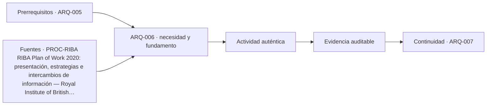

# ARQ-006 · Autores, equipos, profesiones y oficios

**Parte 01 · Clase redactada, primera edición de estudio · Incorporada en v0.2.0.**

Los casos y cifras son didácticos y originales. No son instrucciones de ejecución de obra ni acreditan habilitación profesional. Revisión externa disciplinar pendiente.

## Pregunta central

¿Cómo se organiza un equipo para que una decisión no quede sin responsable ni se apruebe dos veces con criterios contradictorios?

## Qué aprenderás y qué entregarás

Distinguirás profesión, cargo, función y autoridad de decisión. Elaborarás una matriz para un encargo ficticio e identificarás vacíos de coordinación. La matriz no asignará atribuciones legales: describirá qué información produce, revisa o necesita cada función, y qué debe confirmarse contractualmente.

## Profesión, cargo y función

La **profesión** se relaciona con formación y, según el contexto, condiciones de ejercicio. El **cargo** es una posición organizativa: jefe de proyecto, coordinador, inspector o responsable de mantenimiento. La **función** describe una actividad concreta: modelar un encuentro, calcular una estructura, preparar una compra o verificar una entrega. La **autoridad** establece qué puede decidir una persona en ese encargo y bajo qué condiciones.

Una persona puede ocupar varios cargos o funciones, pero eso no elimina la necesidad de comprobar competencia e independencia. Dos personas con el mismo título tampoco tienen necesariamente idéntico alcance de contratación. Evita deducir “puede aprobar todo” a partir de una denominación de cargo.

El programa conserva un catálogo de 80 roles; esa lista es un mapa de estudio, no un organigrama obligatorio. Para cada proyecto hay que seleccionar los actores pertinentes y definir interfaces. El RIBA Plan of Work publica recursos de organización y una matriz de responsabilidades como referencia [[PROC-RIBA]](#FUENTE-PROC-RIBA). La matriz que construiremos es propia y simplificada.

## Producir, revisar y aceptar son acciones diferentes

Producir un documento significa desarrollarlo. Revisarlo significa contrastarlo con criterios definidos. Aceptarlo para un propósito significa autorizar un uso específico de esa información. Ninguna de estas acciones garantiza por sí sola que el objeto construido sea conforme ni que se hayan comprobado todos los riesgos.

Por ejemplo, aceptar un modelo para coordinación no equivale a autorizar su ejecución. Revisar que dos planos coincidan no demuestra que el cálculo estructural sea correcto. La etiqueta “aprobado” sin propósito, alcance, fecha y responsable es demasiado ambigua para organizar trabajo serio.

Proponemos cuatro letras exclusivamente docentes: **P**, produce; **R**, revisa una materia definida; **D**, decide dentro de un alcance; **C**, debe ser consultado. No es una norma ISO ni sustituye contratos. Una persona puede aparecer en varias columnas, pero cualquier independencia necesaria debe analizarse explícitamente.

## Caso trabajado: una puerta y cinco interfaces

En el caso ficticio se plantea cambiar una puerta de una sala. La arquitectura estudia uso y posición; la especialidad correspondiente verifica las materias de seguridad aplicables; el fabricante aporta información del sistema; construcción informa sobre ejecución y tolerancias; mantenimiento explica acceso para reposición y cuidado. El mandante decide sobre objetivos y recursos dentro de sus facultades, no sobre materias que requieran otra aprobación.

<table>
<thead>
<tr>
  <th>Decisión</th>
  <th>P</th>
  <th>R</th>
  <th>C</th>
  <th>D pendiente de confirmar</th>
</tr>
</thead>
<tbody>
<tr>
  <td>Posición y relación con actividades</td>
  <td>Equipo de diseño</td>
  <td>Coordinación de proyecto</td>
  <td>Usuarios y operación</td>
  <td>Responsable del encargo</td>
</tr>
<tr>
  <td>Prestaciones técnicas requeridas</td>
  <td>Especialidad competente</td>
  <td>Revisor definido</td>
  <td>Arquitectura y proveedor</td>
  <td>Según contrato y regulación</td>
</tr>
<tr>
  <td>Compatibilidad con el vano existente</td>
  <td>Equipo técnico del detalle</td>
  <td>Revisión coordinada</td>
  <td>Ejecución y fabricante</td>
  <td>Según procedimiento acordado</td>
</tr>
<tr>
  <td>Plan de mantenimiento</td>
  <td>Operación con antecedentes técnicos</td>
  <td>Coordinación</td>
  <td>Fabricante y usuarios</td>
  <td>Responsable de operación</td>
</tr>
</tbody>
</table>

Las celdas “según…” no son evasión: señalan información todavía no aportada por el caso. Inventar nombres o facultades daría apariencia de organización sin una base real. En un proyecto efectivo estas celdas deberían resolverse antes de usar la matriz como instrumento de gestión.

## La interfaz es una tarea, no un espacio vacío

Si arquitectura define un vano y otro equipo selecciona un sistema de puerta, alguien debe comprobar que dimensiones, holguras, accionamiento, acabados y prestaciones sean compatibles. La frase “lo ve el proveedor” deja sin resolver quién formula requisitos y quién verifica la propuesta recibida.

Una interfaz necesita entrada, salida y criterio. Entrada: geometría y requisitos del vano. Salida: solución coordinada e información de montaje. Criterio: coherencia con las condiciones acordadas y revisión técnica pertinente. Deben registrarse también las exclusiones: lo que no fue evaluado no puede confundirse con conformidad.

Cuando una decisión cambia, pregunta quién recibe el efecto. Un espesor mayor modifica dimensiones útiles; un sentido de apertura altera interacción con mobiliario; una pieza difícil de reemplazar afecta operación. No se requiere que cada actor revise todo, sino que reciba la información que necesita para su responsabilidad.

## Oficios y conocimiento de ejecución

Los oficios aportan conocimiento sobre secuencias, herramientas, accesibilidad de uniones y tolerancias del trabajo. Consultarlos temprano puede revelar que un detalle, aunque dibujable, resulta difícil de ejecutar o inspeccionar. Esto no transfiere automáticamente el diseño al oficio ni exime de especificar correctamente.

Una coordinación respetuosa pregunta cómo se hará y cómo se comprobará, sin convertir experiencia práctica en ensayo formal inexistente. Si un operario advierte que un tornillo no podrá colocarse por falta de espacio, el aviso debe volver al proceso de diseño. “Siempre lo hacemos así” necesita contraste con requisitos y condiciones del caso.

## Competencia e independencia

La capacidad para operar una herramienta no demuestra competencia en todas las decisiones que permite representar. Modelar una viga no equivale a dimensionarla; producir un presupuesto no equivale a validar su factibilidad técnica. El código ARB incluye competencia y colaboración como dimensiones profesionales, usadas aquí en un marco comparado [[ETH-ARB]](#FUENTE-ETH-ARB).

Además, revisar el propio trabajo puede detectar errores, pero no reemplaza una revisión independiente cuando esta sea necesaria. Define qué se revisa, con qué antecedentes y cómo se registran observaciones. Una firma sin criterio conocido no vuelve verificable el proceso.

## Errores frecuentes

El “responsable de todo” puede ser responsable de coordinar, pero no poseer todas las competencias. Una matriz con muchas letras y ninguna decisión clara es decoración administrativa. También es un error llenar una función con una persona disponible sin comprobar si tiene tiempo, recursos y facultades.

El problema inverso aparece cuando nadie decide porque todos figuran como consultados. Consulta no significa veto automático ni autoridad universal. La organización debe establecer cómo se resuelven desacuerdos y qué decisiones requieren escalamiento.

## Práctica independiente

En un proyecto ficticio, el equipo de instalaciones cambia la ubicación de un conducto y avisa solo a quien modela. El nuevo recorrido cruza un elemento cuya función no está identificada. Redacta una incidencia y asigna P, R, C y D provisionalmente. No propongas perforar ni modificar elementos.

Solución razonada

La incidencia debe identificar el cambio, los documentos afectados, la interferencia y la incertidumbre sobre el elemento. Quien propone el recorrido produce una alternativa; la coordinación organiza la revisión; arquitectura, estructuras y otras especialidades pertinentes son consultadas según la interferencia. La autoridad de decisión se confirma en el procedimiento del proyecto.

La acción inmediata es impedir que una modificación no revisada se interprete como instrucción ejecutable y obtener la información faltante. La solución no es ordenar “hacer un agujero pequeño”: el tamaño visual no demuestra irrelevancia estructural o de seguridad.

## Autoevaluación y transferencia

Tu matriz funciona cuando cada entrega tiene propósito, responsable, criterio y destinatarios, y cuando las atribuciones no confirmadas están visibles. Revisa si algún actor aparece solo al final, cuando sus restricciones ya no pueden incorporarse fácilmente.

Traslada el método a diseño, construcción y operación. Cambiarán los actores, pero seguirá siendo necesario diferenciar coordinación, conocimiento técnico, decisión contractual y aprobación regulatoria.

<!-- pedagogia-2026:inicio -->
## Decisión pedagógica y posición curricular

### Por qué existe

Esta clase existe para resolver una necesidad concreta del recorrido: ¿Cómo se organiza un equipo para que una decisión no quede sin responsable ni se apruebe dos veces con criterios contradictorios?

### Por qué está exactamente aquí

Ocupa el lugar 6 de la Parte 01. Se estudia después de ARQ-005 · Ética del encargo y conflictos de interés porque usa esa base para responder «¿Cómo se organiza un equipo para que una decisión no quede sin responsable ni se apruebe dos veces con criterios contradictorios?». Se ubica antes de ARQ-007 · Calidad espacial frente a apariencia fotográfica porque la evidencia producida aquí debe estar disponible para ese paso.

- **Prerrequisitos:** `ARQ-005`
- **Capacidad que introduce:** Distinguirás profesión, cargo, función y autoridad de decisión. Elaborarás una matriz para un encargo ficticio e identificarás vacíos de coordinación. La matriz no asignará atribuciones legales: describirá qué información produce, revisa o necesita cada función, y qué debe confirmarse contractualmente.
- **Clases o experiencias que dependen de ella:** `ARQ-007`

El diagrama permite comprobar una relación que el texto lineal oculta con facilidad: esta clase recibe capacidades previas, toma decisiones apoyadas por fuentes, exige una experiencia y produce evidencia que habilita trabajo posterior. No representa un procedimiento de obra.

## Resultado observable, evidencia y evaluación

1. Identificar y delimitar las condiciones necesarias para responder la pregunta central de autores, equipos, profesiones y oficios.
2. Producir y comprobar la evidencia declarada por la clase: Distinguirás profesión, cargo, función y autoridad de decisión. Elaborarás una matriz para un encargo ficticio e identificarás vacíos de coordinación. La matriz no asignará atribuciones legales: describirá qué información produce, revisa o necesita cada función, y qué debe confirmarse contractualmente.
3. Justificar una decisión de autores, equipos, profesiones y oficios mediante fuentes, supuestos, alternativas y límites explícitos.

## Actividad, evidencia y criterio de aceptación

**Actividad:** En un proyecto ficticio, el equipo de instalaciones cambia la ubicación de un conducto y avisa solo a quien modela. El nuevo recorrido cruza un elemento cuya función no está identificada. Redacta una incidencia y asigna P, R, C y D provisionalmente.

**Evidencia mínima:** Distinguirás profesión, cargo, función y autoridad de decisión. Elaborarás una matriz para un encargo ficticio e identificarás vacíos de coordinación. La matriz no asignará atribuciones legales: describirá qué información produce, revisa o necesita cada función, y qué debe confirmarse contractualmente.

**Archivo sugerido:** `evidence/ARQ-006/evidencia.md`.

**Criterio de aceptación:** la entrega se acepta cuando:

- La entrega responde explícitamente a la pregunta: ¿Cómo se organiza un equipo para que una decisión no quede sin responsable ni se apruebe dos veces con criterios contradictorios?
- La actividad conserva las fronteras del caso y permite reconstruir el procedimiento: En un proyecto ficticio, el equipo de instalaciones cambia la ubicación de un conducto y avisa solo a quien modela. El nuevo recorrido cruza un elemento cuya función no está identificada. Redacta una incidencia y asigna P, R, C y D provisionalmente.
- Cada afirmación externa puede seguirse hasta una fuente, su alcance consultado y su límite.
- La evidencia deja disponible una entrada comprobable para ARQ-007.
- El “responsable de todo” puede ser responsable de coordinar, pero no poseer todas las competencias. Una matriz con muchas letras y ninguna decisión clara es decoración administrativa.

La [rúbrica común](../../docs/RUBRICA_COMUN.md) complementa estos criterios; no los reemplaza. Una entrega puede superar un promedio y continuar pendiente si oculta una condición crítica.

## Trazabilidad de las decisiones

| # | Decisión o fundamento | Fuente utilizada | Aplicación y límite en esta clase |
|---:|---|---|---|
| 1 | Organización del ciclo de proyecto y referencia a una matriz de responsabilidades. Acceso: Página introductoria; no se descargó ni reprodujo el toolbox. | [PROC-RIBA RIBA Plan of Work 2020: presentación, estrategias e…](https://www.riba.org/work/insights-and-resources/riba-plan-of-work/) | Consulta: Alcance consultado no documentado; debe completarse antes de ampliar la conclusión. Límite: Marco británico utilizado comparativamente, no legislación ni contrato chileno. |
| 2 | Competencia, integridad, colaboración y responsabilidad profesional. Acceso: Página oficial del código y sus estándares; no reproducción del código completo. | [ETH-ARB Architects Code: Standards of Conduct and Practice (2025) —…](https://arb.org.uk/architect-information/architects-code-standards-of-conduct-and-practice/) | Consulta: Alcance consultado no documentado; debe completarse antes de ampliar la conclusión. Límite: Aplicación institucional al registro ARB. No se presenta como regulación chilena. Las referencias nuevas se consultaron el 21 de septiembre de 2026. Las referencias heredadas conservan en el catálogo su fecha y alcance originales. Las deducciones, casos y criterios docentes se identifican como elaboración de este programa, no como resultados de las instituciones citadas. |

La tabla permite auditar las relaciones; la explicación, el caso y la práctica de la clase siguen siendo la documentación principal.

## Autoevaluación, recuperación y continuidad

### Errores diagnósticos

Antes de avanzar, comprueba si puedes reconstruir cada resultado sin mirar la solución, señalar qué evidencia lo sostiene y nombrar una condición que obligaría a revisar tu decisión. Conserva la primera versión, la objeción recibida y la revisión.

**Conexión siguiente:** La continuidad inmediata es ARQ-007 · Calidad espacial frente a apariencia fotográfica; conserva el método y vuelve a verificar datos y límites.
<!-- pedagogia-2026:fin -->

## Fuentes y alcance de uso

- **[[PROC-RIBA]](#FUENTE-PROC-RIBA) RIBA Plan of Work 2020: presentación, estrategias e intercambios de información** — Royal Institute of British Architects.
[https://www.riba.org/work/insights-and-resources/riba-plan-of-work/](https://www.riba.org/work/insights-and-resources/riba-plan-of-work/)
Apoyo: Organización del ciclo de proyecto y referencia a una matriz de responsabilidades.
Acceso: Página introductoria; no se descargó ni reprodujo el toolbox. Límite: Marco británico utilizado comparativamente, no legislación ni contrato chileno.

- **[[ETH-ARB]](#FUENTE-ETH-ARB) Architects Code: Standards of Conduct and Practice (2025)** — Architects Registration Board.
[https://arb.org.uk/architect-information/architects-code-standards-of-conduct-and-practice/](https://arb.org.uk/architect-information/architects-code-standards-of-conduct-and-practice/)
Apoyo: Competencia, integridad, colaboración y responsabilidad profesional.
Acceso: Página oficial del código y sus estándares; no reproducción del código completo. Límite: Aplicación institucional al registro ARB. No se presenta como regulación chilena.

Las referencias nuevas se consultaron el **21 de septiembre de 2026**. Las referencias heredadas conservan en el catálogo su fecha y alcance originales. Las deducciones, casos y criterios docentes se identifican como elaboración de este programa, no como resultados de las instituciones citadas.
