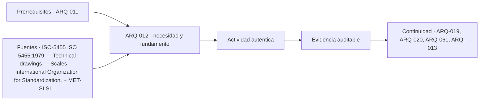

# ARQ-012 · Escalas, cotas, unidades y tolerancias

**Parte 02 · Clase redactada, primera edición de estudio · Incorporada en v0.2.0.**

Los casos y cifras son didácticos y originales. No son instrucciones de ejecución de obra ni acreditan habilitación profesional. Revisión externa disciplinar pendiente.

## Pregunta central

¿Cómo evitar que una escala mal interpretada o una cadena de cotas incoherente se convierta en una decisión equivocada?

## Qué aprenderás y qué entregarás

Convertirás longitudes reales y representadas, comprobarás una cadena de dimensiones y distinguirás dimensión nominal, medición y tolerancia. Entregarás una hoja con cálculos explicados, una incidencia documental y una comprobación independiente. Debes poder leer planta, corte y elevación según ARQ-011.

## Escala: primero iguala unidades

Una representación a escala 1:n utiliza una unidad dibujada por cada n unidades reales. La relación es adimensional: antes de dividir, ambas longitudes deben expresarse en unidades compatibles. Para una longitud real L en metros y un dibujo medido en milímetros:

`longitud en papel = 1000 × L / n`.

Un muro de 6 m a 1:50 ocupa `1000 × 6 / 50 = 120 mm`. A 1:100 ocupa 60 mm. Reducir el denominador aumenta el tamaño del dibujo. Esta relación se deduce de semejanza; la ficha de ISO 5455 identifica la norma de escalas, pero no se atribuyen a su texto completo convenciones que no se hayan consultado [[ISO-5455]](#FUENTE-ISO-5455).

La operación inversa es `L = milímetros en papel × n / 1000`. Una línea de 84 mm a 1:50 representa 4,20 m. La comprobación vuelve a convertir 4,20 m al papel. Si no recuperas 84 mm, revisa unidades o denominador.

## La impresión puede cambiar la escala efectiva

Supón que un dibujo a 1:50 se imprime al 80 % de su tamaño. Una longitud prevista de 120 mm pasa a 96 mm. La escala efectiva es `1:(50/0,8) = 1:62,5`. El texto que dice “1:50” no se modifica necesariamente al imprimir: por eso no prueba que el papel conserve esa escala.

Una barra gráfica impresa con el dibujo permite contrastar la reproducción, siempre que ambos se escalen juntos y no se haya deformado la imagen de forma desigual. Si la reducción horizontal y vertical difieren, ya no existe una única escala uniforme. No midas una fotografía oblicua de un plano como si fuera una copia geométricamente fiel.

En documentación técnica, las cotas y las reglas acordadas del expediente deben resolver las dimensiones; medir el dibujo no es una forma legítima de corregir silenciosamente una contradicción. Si una cota y la geometría discrepan, identifica la incidencia y confirma la información autorizada para el propósito de uso.

## ¿Desde qué cara se mide?

Un recinto puede tener dimensión entre ejes, entre caras estructurales o entre caras terminadas. Son magnitudes diferentes. “Ancho 4 m” es ambiguo si no define referencias. Una capa de acabado cambia el espacio libre sin cambiar necesariamente la distancia entre ejes.

Ejemplo ficticio: dos caras de soporte están separadas 4.000 mm; se adoptan acabados de 15 mm en cada lado. El ancho nominal entre terminaciones sería `4000 - 15 - 15 = 3970 mm`, bajo esas hipótesis. No se deduce una dimensión real de ejecución: faltan variaciones, método y verificación.

## Caso trabajado: cadena de cotas

Un dibujo declara una dimensión exterior de 6.000 mm. La cadena propuesta contiene muro de 200 mm, recinto de 2.500 mm, tabique de 100 mm, segundo recinto de 3.000 mm y muro de 200 mm. La suma es:

`200 + 2500 + 100 + 3000 + 200 = 6000 mm`.

La cadena cierra aritméticamente. Ahora el segundo recinto aparece con 3.050 mm en otra vista: la suma sería 6.050 mm. La diferencia de 50 mm no debe repartirse entre elementos para que “calce”. Primero hay que localizar versión, referencias y posible cambio de diseño.

El cierre aritmético tampoco demuestra que espesores o dimensiones sean adecuados. Una cadena coherente puede describir una solución no revisada técnicamente. El control tiene un alcance concreto: detectar contradicción dimensional entre datos que deberían ser compatibles.

## Tolerancia no es incertidumbre

Una **tolerancia** expresa variación permitida respecto de un requisito definido. La **incertidumbre de medición** caracteriza lo que se conoce sobre un resultado de medida; no es permiso para incumplir. La lectura del NIST ayuda a distinguir medición y evaluación de incertidumbre [[MET-UNC]](#FUENTE-MET-UNC). No adoptes el símbolo ± sin explicar a cuál concepto pertenece.

Para un ejercicio de acumulación, tres piezas tienen longitudes nominales de 1.000 mm y límites de fabricación ficticios de ±2 mm cada una. Sin otros datos, el intervalo extremo de su suma es 3.000 ±6 mm. No uses raíz de suma de cuadrados para reemplazar esos límites por ±3,46 mm: ese cálculo requeriría una interpretación estadística y supuestos adicionales, y no sería el peor caso.

La junta disponible, el comportamiento de montaje y el procedimiento de aceptación pertenecen a un diseño real que aquí no se prescribe. El ejercicio solo muestra por qué sumar dimensiones nominales puede ocultar incompatibilidades de ajuste.

## Estrategia de acotación y control

Define una referencia común antes de acotar. Evita cadenas innecesariamente largas cuando las posiciones críticas puedan referirse a un origen. Al mismo tiempo, no elimines dimensiones que permitan comprender el conjunto. La solución depende del propósito del plano y del sistema de documentación del proyecto.

Incluye unidades, identificadores, revisión y propósito. Una cota sin contexto puede estar correctamente escrita y ser inutilizable. El sistema de unidades debe permanecer consistente; el NIST ofrece una referencia pública del SI [[MET-SI]](#FUENTE-MET-SI). Los espesores y convenciones numéricas de esta clase son datos de ejercicio, no recomendaciones normativas de construcción.

## Práctica independiente

Representa 7,20 m a 1:100 y a 1:50. Después imprime la segunda representación al 90 % y calcula su escala efectiva. Revisa una cadena de 150 + 3.200 + 100 + 2.400 + 150 mm contra un total declarado de 6.000 mm. Finalmente calcula el peor caso de cuatro tramos nominales con límites de ±3 mm cada uno.

Solución razonada

7,20 m se representa con 72 mm a 1:100 y 144 mm a 1:50. Al 90 %, la segunda medida pasa a 129,6 mm; su denominador efectivo es <code>50/0,9 = 55,555…</code>. No debe etiquetarse como 1:50 para medir sin comprobar.

La cadena suma 6.000 mm, por lo que cierra aritméticamente. Eso no demuestra aptitud de los recintos. Los cuatro límites acumulados producen un peor caso de ±12 mm. Se conserva ese resultado como extremo de los límites adoptados, sin presentarlo como desviación estándar.

## Autoevaluación y transferencia

Tu hoja cumple cuando las conversiones son reversibles, las referencias de medida están definidas, las contradicciones se registran y la tolerancia no se confunde con incertidumbre. Debes explicar por qué una impresión reducida puede invalidar una medición aunque el rótulo no cambie.

Transfiere el método a detalles, maquetas y levantamientos. Antes de usar un número, identifica qué representa, cómo se obtuvo y para qué decisión es adecuado.

<!-- pedagogia-2026:inicio -->
## Decisión pedagógica y posición curricular

### Por qué existe

Esta clase existe para resolver una necesidad concreta del recorrido: ¿Cómo evitar que una escala mal interpretada o una cadena de cotas incoherente se convierta en una decisión equivocada?

### Por qué está exactamente aquí

Ocupa el lugar 2 de la Parte 02. Se estudia después de ARQ-011 · Planta, corte y elevación: leer lo que no muestra una fotografía porque usa esa base para responder «¿Cómo evitar que una escala mal interpretada o una cadena de cotas incoherente se convierta en una decisión equivocada?». Se ubica antes de ARQ-013 · Croquis de observación y síntesis porque la evidencia producida aquí debe estar disponible para ese paso.

- **Prerrequisitos:** `ARQ-011`
- **Capacidad que introduce:** Convertirás longitudes reales y representadas, comprobarás una cadena de dimensiones y distinguirás dimensión nominal, medición y tolerancia. Entregarás una hoja con cálculos explicados, una incidencia documental y una comprobación independiente. Debes poder leer planta, corte y elevación según ARQ-011.
- **Clases o experiencias que dependen de ella:** `ARQ-019`, `ARQ-020`, `ARQ-061`, `ARQ-013`

El diagrama permite comprobar una relación que el texto lineal oculta con facilidad: esta clase recibe capacidades previas, toma decisiones apoyadas por fuentes, exige una experiencia y produce evidencia que habilita trabajo posterior. No representa un procedimiento de obra.

## Resultado observable, evidencia y evaluación

1. Identificar y delimitar las condiciones necesarias para responder la pregunta central de escalas, cotas, unidades y tolerancias.
2. Producir y comprobar la evidencia declarada por la clase: Convertirás longitudes reales y representadas, comprobarás una cadena de dimensiones y distinguirás dimensión nominal, medición y tolerancia. Entregarás una hoja con cálculos explicados, una incidencia documental y una comprobación independiente. Debes poder leer planta, corte y elevación según ARQ-011.
3. Justificar una decisión de escalas, cotas, unidades y tolerancias mediante fuentes, supuestos, alternativas y límites explícitos.

## Actividad, evidencia y criterio de aceptación

**Actividad:** Representa 7,20 m a 1:100 y a 1:50. Después imprime la segunda representación al 90 % y calcula su escala efectiva. Revisa una cadena de 150 + 3.200 + 100 + 2.400 + 150 mm contra un total declarado de 6.000 mm.

**Evidencia mínima:** Convertirás longitudes reales y representadas, comprobarás una cadena de dimensiones y distinguirás dimensión nominal, medición y tolerancia. Entregarás una hoja con cálculos explicados, una incidencia documental y una comprobación independiente. Debes poder leer planta, corte y elevación según ARQ-011.

**Archivo sugerido:** `evidence/ARQ-012/evidencia.md`.

**Criterio de aceptación:** la entrega se acepta cuando:

- La entrega responde explícitamente a la pregunta: ¿Cómo evitar que una escala mal interpretada o una cadena de cotas incoherente se convierta en una decisión equivocada?
- La actividad conserva las fronteras del caso y permite reconstruir el procedimiento: Representa 7,20 m a 1:100 y a 1:50. Después imprime la segunda representación al 90 % y calcula su escala efectiva. Revisa una cadena de 150 + 3.200 + 100 + 2.400 + 150 mm contra un total declarado de 6.000 mm.
- Cada afirmación externa puede seguirse hasta una fuente, su alcance consultado y su límite.
- La evidencia deja disponible una entrada comprobable para ARQ-019.
- Tu hoja cumple cuando las conversiones son reversibles, las referencias de medida están definidas, las contradicciones se registran y la tolerancia no se confunde con incertidumbre. Debes explicar por qué una impresión reducida puede invalidar una medición aunque el rótulo no cambie.

La [rúbrica común](../../docs/RUBRICA_COMUN.md) complementa estos criterios; no los reemplaza. Una entrega puede superar un promedio y continuar pendiente si oculta una condición crítica.

## Trazabilidad de las decisiones

| # | Decisión o fundamento | Fuente utilizada | Aplicación y límite en esta clase |
|---:|---|---|---|
| 1 | Identificación bibliográfica del tema y la edición de la norma. Acceso: Ficha oficial de catálogo. NO se consultó el texto normativo completo. | [ISO-5455 ISO 5455:1979 — Technical drawings — Scales — International…](https://www.iso.org/standard/11500.html) | Consulta: Alcance consultado no documentado; debe completarse antes de ampliar la conclusión. Límite: No se reproducen cláusulas ni se certifica conformidad; las convenciones docentes se declaran como tales. |
| 2 | Unidades del SI y comunicación de magnitudes. Acceso: Página institucional de unidades. | [MET-SI SI Units — National Institute of Standards and Technology.](https://www.nist.gov/pml/owm/metric-si/si-units) | Consulta: Alcance consultado no documentado; debe completarse antes de ampliar la conclusión. Límite: Los ejemplos arquitectónicos y operaciones son originales; no se copian tablas extensas. |
| 3 | Modelo de medición; diferencia entre evaluaciones tipo A y B; incertidumbre estándar. Acceso: Resumen técnico oficial basado en NIST TN 1297. | [MET-UNC Essentials of expressing measurement uncertainty: basic…](https://physics.nist.gov/cuu/Uncertainty/basic.html) | Consulta: Alcance consultado no documentado; debe completarse antes de ampliar la conclusión. Límite: Los intervalos conservadores de las clases no se presentan como intervalos estadísticos del 95 %. Las referencias nuevas se consultaron el 21 de septiembre de 2026. Las referencias heredadas conservan en el catálogo su fecha y alcance originales. Las deducciones, casos y criterios docentes se identifican como elaboración de este programa, no como resultados de las instituciones citadas. |

La tabla permite auditar las relaciones; la explicación, el caso y la práctica de la clase siguen siendo la documentación principal.

## Autoevaluación, recuperación y continuidad

### Errores diagnósticos

Antes de avanzar, comprueba si puedes reconstruir cada resultado sin mirar la solución, señalar qué evidencia lo sostiene y nombrar una condición que obligaría a revisar tu decisión. Conserva la primera versión, la objeción recibida y la revisión.

**Conexión siguiente:** La continuidad inmediata es ARQ-013 · Croquis de observación y síntesis; conserva el método y vuelve a verificar datos y límites.
<!-- pedagogia-2026:fin -->

## Fuentes y alcance de uso

- **[[ISO-5455]](#FUENTE-ISO-5455) ISO 5455:1979 — Technical drawings — Scales** — International Organization for Standardization.
[https://www.iso.org/standard/11500.html](https://www.iso.org/standard/11500.html)
Apoyo: Identificación bibliográfica del tema y la edición de la norma.
Acceso: Ficha oficial de catálogo. NO se consultó el texto normativo completo. Límite: No se reproducen cláusulas ni se certifica conformidad; las convenciones docentes se declaran como tales.

- **[[MET-SI]](#FUENTE-MET-SI) SI Units** — National Institute of Standards and Technology.
[https://www.nist.gov/pml/owm/metric-si/si-units](https://www.nist.gov/pml/owm/metric-si/si-units)
Apoyo: Unidades del SI y comunicación de magnitudes.
Acceso: Página institucional de unidades. Límite: Los ejemplos arquitectónicos y operaciones son originales; no se copian tablas extensas.

- **[[MET-UNC]](#FUENTE-MET-UNC) Essentials of expressing measurement uncertainty: basic definitions** — National Institute of Standards and Technology.
[https://physics.nist.gov/cuu/Uncertainty/basic.html](https://physics.nist.gov/cuu/Uncertainty/basic.html)
Apoyo: Modelo de medición; diferencia entre evaluaciones tipo A y B; incertidumbre estándar.
Acceso: Resumen técnico oficial basado en NIST TN 1297. Límite: Los intervalos conservadores de las clases no se presentan como intervalos estadísticos del 95 %.

Las referencias nuevas se consultaron el **21 de septiembre de 2026**. Las referencias heredadas conservan en el catálogo su fecha y alcance originales. Las deducciones, casos y criterios docentes se identifican como elaboración de este programa, no como resultados de las instituciones citadas.
