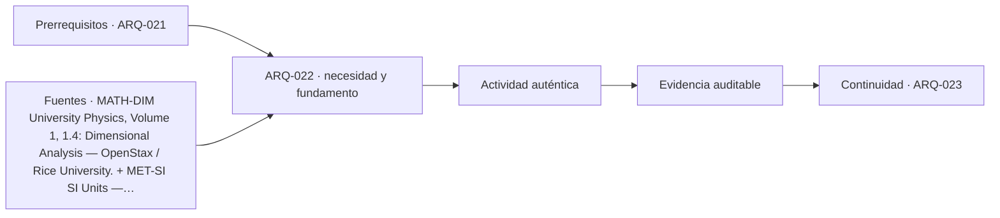

# ARQ-022 · Razón, proporción, porcentaje y semejanza

**Parte 03 · Clase redactada, primera edición de estudio · Incorporada en v0.2.0.**

Los casos y cifras son didácticos y originales. No son instrucciones de ejecución de obra ni acreditan habilitación profesional. Revisión externa disciplinar pendiente.

## Pregunta central

¿Por qué aumentar un porcentaje y después reducir el mismo porcentaje no devuelve necesariamente el valor inicial?

## Qué aprenderás y qué entregarás

Distinguirás razón, proporción, porcentaje y puntos porcentuales. Resolverás cambios sucesivos, escalamiento geométrico y dos interpretaciones de pérdida de material. Entregarás una comparación donde cada porcentaje tenga una base explícita y un control inverso.

## La base es parte del dato

Una razón compara dos cantidades. Si tienen la misma dimensión y unidades compatibles, puede ser adimensional. Una proporción expresa igualdad entre razones. Un porcentaje representa una razón por cada cien, pero necesita indicar respecto de qué cantidad se calcula.

“Subió 10 %” está incompleto si no conocemos el valor inicial o la base. “La superficie aumentó 10 %” no significa que cada longitud aumentó 10 %. El significado de la variable debe preceder al cálculo; el análisis dimensional ayuda a no mezclar longitud, área y volumen [[MATH-DIM]](#FUENTE-MATH-DIM).

Para aumentar una cantidad X en p %, multiplica por `1+p/100`. Para disminuirla, multiplica por `1-p/100`. Estas expresiones se obtienen al sumar o restar la fracción correspondiente de la base X, no son reglas arbitrarias.

## Caso trabajado: dos cambios del 20 %

Una cantidad ficticia vale 100 unidades. Aumenta 20 %: `100×1,20=120`. Luego disminuye 20 % respecto del nuevo valor: `120×0,80=96`. El resultado no es 100 porque la segunda base es 120.

Para volver de 120 a 100, la reducción necesaria es `20/120×100=16,666… %`. Para recuperar 100 desde 80, el aumento es `20/80×100=25 %`. Las operaciones son coherentes cuando se conserva la base de cada variación.

Un control general es multiplicar factores: un aumento p y una disminución p producen `(1+p)(1-p)=1-p²`, usando p como fracción. Para p=0,20 resulta 0,96. No hay contradicción: son cambios porcentuales sobre bases diferentes.

## Porcentajes y puntos porcentuales

Si una fracción pasa de 20 % a 30 %, aumenta 10 puntos porcentuales. Su aumento relativo es `(30-20)/20=50 %`. Ambas descripciones son correctas y responden preguntas distintas. Deben nombrarse para evitar ambigüedad.

En un caso ficticio, una proporción de aberturas respecto de cierta superficie pasa de 0,20 a 0,30. No se concluye por ese dato una mejora de iluminación, energía o ventilación. El cálculo solo describe la relación geométrica definida; el desempeño requiere otros modelos y condiciones.

No combines porcentajes de poblaciones o áreas distintas sin ponderar sus bases. El promedio simple de 50 % y 10 % no representa necesariamente el porcentaje del conjunto. Necesitas conocer los denominadores.

## Promedio ponderado y denominadores

Dos zonas ficticias tienen 10 m² y 90 m². En la primera, el 50 % cumple una condición geométrica del ejercicio; en la segunda, el 10 %. Las áreas correspondientes son 5 m² y 9 m², total 14 m² sobre 100 m²: 14 %, no 30 %.

El promedio simple de los porcentajes daría 30 %, pero asignaría igual peso a zonas de distinto tamaño. La forma general es `porcentaje conjunto = suma de cantidades correspondientes / suma de bases`. Esta operación no convierte la condición elegida en un indicador universal de calidad; solo agrega correctamente la variable definida.

## Semejanza: longitudes, áreas y volúmenes

Si todas las longitudes de una figura semejante se multiplican por k, sus áreas se multiplican por k² y sus volúmenes por k³. Aumentar cada longitud 10 % implica k=1,10: el área aumenta 21 % y el volumen 33,1 %.

Para aumentar el área de una figura semejante 20 %, el factor lineal es `sqrt(1,20)≈1,09545`, es decir cerca de 9,545 % de aumento en cada longitud. No se suma 20 % a cada lado. El resultado supone semejanza geométrica; si solo cambia una dimensión, la relación es otra.

Una sala de 6 m por 4 m tiene 24 m². Multiplicar ambos lados por 1,10 produce 6,6 m por 4,4 m y 29,04 m². La diferencia es 5,04 m², el 21 % de 24. La comprobación directa coincide con el factor cuadrático.

## Dos significados distintos de “8 % de pérdida”

Supón que se necesitan 100 unidades netas. Interpretación A: agregar una reserva equivalente al 8 % de la cantidad neta. La compra calculada sería `100×1,08=108` unidades. Interpretación B: se espera perder el 8 % de lo comprado, por lo que solo se aprovecha el 92 %. Entonces `compra×0,92=100`, y `compra=100/0,92≈108,6957`.

La diferencia aparece porque las bases son distintas. No se puede usar “merma 8 %” sin definir si se refiere a cantidad neta, suministrada o a otra convención. Si se compran unidades indivisibles, el redondeo y el formato de empaque deben tratarse después, explicando su efecto.

Este ejemplo no recomienda un porcentaje de pérdida para ningún material. El valor es inventado; una estimación real requiere sistema, proceso, geometría, proveedor y experiencia documentada.

## Comparar alternativas sin esconder lo absoluto

Una reducción del 50 % puede significar pasar de 2 a 1 unidad, o de 200 a 100. El porcentaje comunica cambio relativo; la cantidad absoluta explica escala. Presenta ambos cuando influyan en una decisión.

Del mismo modo, una mejora aparente por unidad puede coexistir con aumento del total si cambia la cantidad producida o el área. Primero define el límite del sistema y el denominador. No utilices una intensidad favorable para afirmar automáticamente una reducción total.

## Errores frecuentes

Sumar cambios porcentuales sucesivos sin revisar bases, confundir puntos porcentuales con cambio relativo y promediar porcentajes sin pesos son errores distintos. Identifícalos por mecanismo, no solo por resultado numérico.

También es un error convertir una razón geométrica en regla estética universal. Una proporción puede estudiarse como recurso compositivo, pero su presencia no demuestra belleza, funcionalidad ni adecuación cultural. Los criterios de proyecto requieren argumentos situados y no una cifra mágica.

## Práctica independiente

Una cantidad de 200 aumenta 15 % y luego baja 10 %. Calcula el resultado. Una figura semejante duplica su área: calcula el factor lineal. Para obtener 250 unidades netas con una pérdida supuesta del 5 % de lo comprado, calcula la cantidad necesaria. Compara con agregar simplemente 5 % a lo neto.

Solución razonada

<code>200×1,15×0,90=207</code>. El aumento neto es 7 sobre 200, equivalente a 3,5 %. Para duplicar área, el factor lineal es sqrt(2)≈1,4142, no 2. Para la compra, <code>250/0,95≈263,1579</code> unidades; agregar 5 % daría 262,5. No son equivalentes.

El control inverso es <code>263,1579×0,95≈250</code>, sujeto al redondeo mostrado. Si se trata de piezas enteras, habría que redondear según disponibilidad y declarar la cantidad adicional. Ningún cálculo sustituye verificar que el supuesto de pérdida sea pertinente.

## Autoevaluación y transferencia

La evidencia cumple cuando cada porcentaje incluye base y significado, cuando las operaciones pueden invertirse y cuando distingues cambio relativo de cantidad absoluta. Si una comparación omite el denominador, está incompleta.

Aplica estas herramientas a superficies, presupuestos, cantidades, indicadores ambientales y estadísticas de uso. Antes de interpretar una mejora, pregunta qué cambió y respecto de qué.

<!-- pedagogia-2026:inicio -->
## Decisión pedagógica y posición curricular

### Por qué existe

Esta clase existe para resolver una necesidad concreta del recorrido: ¿Por qué aumentar un porcentaje y después reducir el mismo porcentaje no devuelve necesariamente el valor inicial?

### Por qué está exactamente aquí

Ocupa el lugar 2 de la Parte 03. Se estudia después de ARQ-021 · Dimensiones, conversiones y órdenes de magnitud porque usa esa base para responder «¿Por qué aumentar un porcentaje y después reducir el mismo porcentaje no devuelve necesariamente el valor inicial?». Se ubica antes de ARQ-023 · Áreas, volúmenes y cubicaciones porque la evidencia producida aquí debe estar disponible para ese paso.

- **Prerrequisitos:** `ARQ-021`
- **Capacidad que introduce:** Distinguirás razón, proporción, porcentaje y puntos porcentuales. Resolverás cambios sucesivos, escalamiento geométrico y dos interpretaciones de pérdida de material. Entregarás una comparación donde cada porcentaje tenga una base explícita y un control inverso.
- **Clases o experiencias que dependen de ella:** `ARQ-023`

El diagrama permite comprobar una relación que el texto lineal oculta con facilidad: esta clase recibe capacidades previas, toma decisiones apoyadas por fuentes, exige una experiencia y produce evidencia que habilita trabajo posterior. No representa un procedimiento de obra.

## Resultado observable, evidencia y evaluación

1. Identificar y delimitar las condiciones necesarias para responder la pregunta central de razón, proporción, porcentaje y semejanza.
2. Producir y comprobar la evidencia declarada por la clase: Distinguirás razón, proporción, porcentaje y puntos porcentuales. Resolverás cambios sucesivos, escalamiento geométrico y dos interpretaciones de pérdida de material. Entregarás una comparación donde cada porcentaje tenga una base explícita y un control inverso.
3. Justificar una decisión de razón, proporción, porcentaje y semejanza mediante fuentes, supuestos, alternativas y límites explícitos.

## Actividad, evidencia y criterio de aceptación

**Actividad:** Una cantidad de 200 aumenta 15 % y luego baja 10 %. Calcula el resultado. Una figura semejante duplica su área: calcula el factor lineal.

**Evidencia mínima:** Distinguirás razón, proporción, porcentaje y puntos porcentuales. Resolverás cambios sucesivos, escalamiento geométrico y dos interpretaciones de pérdida de material. Entregarás una comparación donde cada porcentaje tenga una base explícita y un control inverso.

**Archivo sugerido:** `evidence/ARQ-022/evidencia.md`.

**Criterio de aceptación:** la entrega se acepta cuando:

- La entrega responde explícitamente a la pregunta: ¿Por qué aumentar un porcentaje y después reducir el mismo porcentaje no devuelve necesariamente el valor inicial?
- La actividad conserva las fronteras del caso y permite reconstruir el procedimiento: Una cantidad de 200 aumenta 15 % y luego baja 10 %. Calcula el resultado. Una figura semejante duplica su área: calcula el factor lineal.
- Cada afirmación externa puede seguirse hasta una fuente, su alcance consultado y su límite.
- La evidencia deja disponible una entrada comprobable para ARQ-023.
- Sumar cambios porcentuales sucesivos sin revisar bases, confundir puntos porcentuales con cambio relativo y promediar porcentajes sin pesos son errores distintos. Identifícalos por mecanismo, no solo por resultado numérico.

La [rúbrica común](../../docs/RUBRICA_COMUN.md) complementa estos criterios; no los reemplaza. Una entrega puede superar un promedio y continuar pendiente si oculta una condición crítica.

## Trazabilidad de las decisiones

| # | Decisión o fundamento | Fuente utilizada | Aplicación y límite en esta clase |
|---:|---|---|---|
| 1 | Consistencia dimensional como comprobación necesaria, no prueba suficiente de corrección. Acceso: Sección del libro web. | [MATH-DIM University Physics, Volume 1, 1.4: Dimensional Analysis —…](https://openstax.org/books/university-physics-volume-1/pages/1-4-dimensional-analysis) | Consulta: Alcance consultado no documentado; debe completarse antes de ampliar la conclusión. Límite: Casos, números y demostraciones didácticas originales; no se reproduce el texto de la sección. |
| 2 | Unidades del SI y comunicación de magnitudes. Acceso: Página institucional de unidades. | [MET-SI SI Units — National Institute of Standards and Technology.](https://www.nist.gov/pml/owm/metric-si/si-units) | Consulta: Alcance consultado no documentado; debe completarse antes de ampliar la conclusión. Límite: Los ejemplos arquitectónicos y operaciones son originales; no se copian tablas extensas. Las referencias nuevas se consultaron el 21 de septiembre de 2026. Las referencias heredadas conservan en el catálogo su fecha y alcance originales. Las deducciones, casos y criterios docentes se identifican como elaboración de este programa, no como resultados de las instituciones citadas. |

La tabla permite auditar las relaciones; la explicación, el caso y la práctica de la clase siguen siendo la documentación principal.

## Autoevaluación, recuperación y continuidad

### Errores diagnósticos

Antes de avanzar, comprueba si puedes reconstruir cada resultado sin mirar la solución, señalar qué evidencia lo sostiene y nombrar una condición que obligaría a revisar tu decisión. Conserva la primera versión, la objeción recibida y la revisión.

**Conexión siguiente:** La continuidad inmediata es ARQ-023 · Áreas, volúmenes y cubicaciones; conserva el método y vuelve a verificar datos y límites.
<!-- pedagogia-2026:fin -->

## Fuentes y alcance de uso

- **[[MATH-DIM]](#FUENTE-MATH-DIM) University Physics, Volume 1, 1.4: Dimensional Analysis** — OpenStax / Rice University.
[https://openstax.org/books/university-physics-volume-1/pages/1-4-dimensional-analysis](https://openstax.org/books/university-physics-volume-1/pages/1-4-dimensional-analysis)
Apoyo: Consistencia dimensional como comprobación necesaria, no prueba suficiente de corrección.
Acceso: Sección del libro web. Límite: Casos, números y demostraciones didácticas originales; no se reproduce el texto de la sección.

- **[[MET-SI]](#FUENTE-MET-SI) SI Units** — National Institute of Standards and Technology.
[https://www.nist.gov/pml/owm/metric-si/si-units](https://www.nist.gov/pml/owm/metric-si/si-units)
Apoyo: Unidades del SI y comunicación de magnitudes.
Acceso: Página institucional de unidades. Límite: Los ejemplos arquitectónicos y operaciones son originales; no se copian tablas extensas.

Las referencias nuevas se consultaron el **21 de septiembre de 2026**. Las referencias heredadas conservan en el catálogo su fecha y alcance originales. Las deducciones, casos y criterios docentes se identifican como elaboración de este programa, no como resultados de las instituciones citadas.
