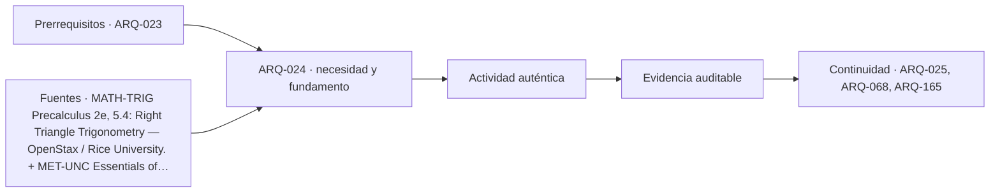

# ARQ-024 · Trigonometría para pendientes, sombras y levantamientos

**Parte 03 · Clase redactada, primera edición de estudio · Incorporada en v0.2.0.**

Los casos y cifras son didácticos y originales. No son instrucciones de ejecución de obra ni acreditan habilitación profesional. Revisión externa disciplinar pendiente.

## Pregunta central

¿Cómo relacionar pendiente, distancia y altura sin confundir grados, porcentajes y longitud inclinada?

## Qué aprenderás y qué entregarás

Resolverás triángulos rectángulos aplicados a pendientes, sombras y observación de alturas. Entregarás un esquema con variables y tres cálculos comprobados. Todos los ángulos y dimensiones son ficticios: no se fijan pendientes reglamentarias ni se dimensionan rampas, cubiertas o sistemas de seguridad reales.

## Dibujar el triángulo antes de elegir fórmula

En un triángulo rectángulo, respecto de un ángulo agudo θ, el cateto opuesto se relaciona con la altura considerada, el adyacente con la proyección horizontal y la hipotenusa con el tramo inclinado. Esas etiquetas dependen del ángulo elegido; no son nombres permanentes de los lados.

Las razones son `sin θ = opuesto/hipotenusa`, `cos θ = adyacente/hipotenusa` y `tan θ = opuesto/adyacente`. OpenStax presenta estas relaciones en su sección de trigonometría de triángulos rectángulos [[MATH-TRIG]](#FUENTE-MATH-TRIG). Las aplicaciones y cifras siguientes son originales.

Si conoces altura h y proyección horizontal d, la tangente conecta directamente los datos: `tan θ=h/d`. La longitud inclinada s se obtiene con `s=sqrt(h²+d²)`. No uses s como denominador de una pendiente definida respecto de distancia horizontal.

## Pendiente porcentual y ángulo

Una pendiente geométrica porcentual se define aquí como `p=100×h/d`, con d>0. Por tanto `p=100×tan θ`, y `θ=arctan(p/100)`. El porcentaje no es un ángulo.

Una pendiente de 10 % corresponde a arctan(0,10)≈5,7106°, no a 10°. Una inclinación de 45° tiene h=d y corresponde a 100 %. Esto no implica que una pendiente de 100 % sea vertical: la vertical tiene proyección horizontal nula y esta definición de porcentaje no admite dividir por cero.

Para una pendiente con signo, define orientación de recorrido: subir y bajar cambian el signo de h. No mezcles valores absolutos con signos sin explicarlo. En los ejemplos usamos magnitudes positivas para aislar la relación geométrica.

## Caso trabajado: un tramo ideal

Un tramo ficticio salva h=0,60 m sobre una proyección horizontal d=7,50 m. La pendiente es `100×0,60/7,50=8 %`. El ángulo es `arctan(0,08)≈4,5739°`. La longitud inclinada es `sqrt(0,60²+7,50²)≈7,5240 m`.

El cálculo muestra que la longitud inclinada es algo mayor que la horizontal. Para cantidades sobre una superficie inclinada, la distinción puede importar. Sin embargo, esta geometría no permite declarar que el tramo sea accesible, seguro o reglamentario. Faltan ancho, descansos, superficie, bordes, uso, contexto y requisitos aplicables.

No utilices el 8 % del ejercicio como recomendación. El valor se eligió por conveniencia matemática, no se tomó de una norma. Este límite es parte de aprender a calcular responsablemente.

## Recuperar una dimensión desconocida

Si se adopta una pendiente geométrica p y una altura h, la proyección es `d=100×h/p`, para p>0. Si h=0,45 m y p=5 %, entonces d=9 m. El control inverso recupera `100×0,45/9=5 %`.

La fórmula puede producir una longitud correcta bajo el modelo y una alternativa inviable por otras restricciones. Un cálculo no decide por sí solo la configuración del proyecto. Sirve para evaluar una relación antes de coordinar las demás.

## Sombras con un modelo solar ideal

Considera un objeto vertical de altura H sobre suelo horizontal, con rayos paralelos en un plano vertical y una altura solar α entre 0° y 90°. La longitud horizontal de sombra es `L=H/tan α`, sin obstáculos adicionales.

Para H=3 m y α=30°, `L≈5,1962 m`. Para α=60°, `L≈1,7321 m`. Al aumentar la altura solar, la sombra se acorta en este modelo. No se introduce una fecha, ciudad o clima real: α es un dato ficticio, no una efeméride consultada.

Si el suelo está inclinado, el objeto no es vertical o hay obstrucciones, la geometría cambia. El modelo tampoco determina por sí solo iluminación interior ni confort. Es una base para formular estudios posteriores con ubicación, orientación y condiciones reales.

## Sensibilidad cerca del horizonte

Cuando α se acerca a cero, tan α disminuye y la longitud ideal de sombra crece mucho. Una pequeña diferencia angular puede producir una variación importante. Esto explica por qué no conviene tratar un ángulo aproximado como exacto, especialmente en condiciones sensibles.

Para H=3 m, una altura de 5° da una sombra ideal cercana a 34,29 m, mientras que a 10° es cerca de 17,01 m. No significa que un lugar real reciba esa sombra sin interrupciones: edificios, relieve y horizonte pueden modificar la situación. La función matemática debe interpretarse dentro de sus hipótesis.

El tratamiento de incertidumbre del NIST recuerda que el resultado depende de sus entradas y del proceso que las obtiene [[MET-UNC]](#FUENTE-MET-UNC). Aquí no asignamos probabilidades: solo observamos sensibilidad del modelo.

## Estimar una altura desde una observación

Supón un instrumento a altura h0 sobre un suelo horizontal y una distancia horizontal d al pie de un objeto vertical. Si el ángulo al punto superior es θ, la altura es `H=h0+d×tan θ`, siempre que el pie y la posición del instrumento compartan el nivel de referencia adoptado.

Con h0=1,50 m, d=12 m y θ=30°, H≈8,4282 m. El cálculo no debe usarse como levantamiento profesional sin método, referencia altimétrica y control apropiados. La distancia inclinada al objeto no puede sustituir d sin transformación.

Si la base está más alta o más baja, agrega la diferencia de niveles con un signo definido. Dibujar el esquema evita sumar la altura del instrumento dos veces o referir el ángulo a la dirección equivocada.

## Grados y radianes en software

Muchos lenguajes evalúan funciones trigonométricas en radianes. La conversión es `radianes=grados×π/180`. Ingresar 30 directamente donde se esperan radianes no representa 30°. Un programa debe declarar la unidad angular en nombres, documentación y comprobaciones.

Prueba valores conocidos: tan(45°)=1 y sin(30°)=0,5. Si el resultado no coincide, revisa unidad o función. El código de ejemplos de esta edición utiliza funciones con parámetros explícitos en grados y rechaza valores fuera del dominio del modelo.

## Práctica independiente

Calcula pendiente, ángulo y longitud inclinada de un tramo con h=0,40 m y d=5 m. Calcula la sombra ideal de un objeto de 2,5 m para α=45°. Estima una altura con h0=1,60 m, d=10 m y θ=45°. Explica una condición que invalidaría cada aplicación.

Solución razonada

La pendiente es 8 %, el ángulo ≈4,5739° y la longitud inclinada sqrt(25,16)≈5,0160 m. La sombra ideal es 2,5 m porque tan(45°)=1. La altura estimada es <code>1,60+10×1=11,60 m</code>.

El tramo no queda validado para un uso real. La sombra requiere suelo horizontal y ausencia de obstrucciones según el modelo. La estimación de altura supone distancia horizontal y referencia de niveles común; un terreno inclinado exige reformular el esquema.

## Autoevaluación y transferencia

Debes identificar lados antes de calcular, distinguir grados de porcentajes y comprobar operaciones inversas. Si el resultado numérico se presenta como autorización de diseño, el alcance está mal formulado.

Esta base prepara el estudio de topografía, clima y estructuras. Las aplicaciones profesionales requieren datos, métodos y revisión propios de cada disciplina, además de la matemática aquí aprendida.

<!-- pedagogia-2026:inicio -->
## Decisión pedagógica y posición curricular

### Por qué existe

Esta clase existe para resolver una necesidad concreta del recorrido: ¿Cómo relacionar pendiente, distancia y altura sin confundir grados, porcentajes y longitud inclinada?

### Por qué está exactamente aquí

Ocupa el lugar 4 de la Parte 03. Se estudia después de ARQ-023 · Áreas, volúmenes y cubicaciones porque usa esa base para responder «¿Cómo relacionar pendiente, distancia y altura sin confundir grados, porcentajes y longitud inclinada?». Se ubica antes de ARQ-025 · Vectores, fuerzas y momentos porque la evidencia producida aquí debe estar disponible para ese paso.

- **Prerrequisitos:** `ARQ-023`
- **Capacidad que introduce:** Resolverás triángulos rectángulos aplicados a pendientes, sombras y observación de alturas. Entregarás un esquema con variables y tres cálculos comprobados. Todos los ángulos y dimensiones son ficticios: no se fijan pendientes reglamentarias ni se dimensionan rampas, cubiertas o sistemas de seguridad reales.
- **Clases o experiencias que dependen de ella:** `ARQ-025`, `ARQ-068`, `ARQ-165`

El diagrama permite comprobar una relación que el texto lineal oculta con facilidad: esta clase recibe capacidades previas, toma decisiones apoyadas por fuentes, exige una experiencia y produce evidencia que habilita trabajo posterior. No representa un procedimiento de obra.

## Resultado observable, evidencia y evaluación

1. Identificar y delimitar las condiciones necesarias para responder la pregunta central de trigonometría para pendientes, sombras y levantamientos.
2. Producir y comprobar la evidencia declarada por la clase: Resolverás triángulos rectángulos aplicados a pendientes, sombras y observación de alturas. Entregarás un esquema con variables y tres cálculos comprobados. Todos los ángulos y dimensiones son ficticios: no se fijan pendientes reglamentarias ni se dimensionan rampas, cubiertas o sistemas de seguridad reales.
3. Justificar una decisión de trigonometría para pendientes, sombras y levantamientos mediante fuentes, supuestos, alternativas y límites explícitos.

## Actividad, evidencia y criterio de aceptación

**Actividad:** Calcula pendiente, ángulo y longitud inclinada de un tramo con h=0,40 m y d=5 m. Calcula la sombra ideal de un objeto de 2,5 m para α=45°. Estima una altura con h0=1,60 m, d=10 m y θ=45°.

**Evidencia mínima:** Resolverás triángulos rectángulos aplicados a pendientes, sombras y observación de alturas. Entregarás un esquema con variables y tres cálculos comprobados. Todos los ángulos y dimensiones son ficticios: no se fijan pendientes reglamentarias ni se dimensionan rampas, cubiertas o sistemas de seguridad reales.

**Archivo sugerido:** `evidence/ARQ-024/evidencia.md`.

**Criterio de aceptación:** la entrega se acepta cuando:

- La entrega responde explícitamente a la pregunta: ¿Cómo relacionar pendiente, distancia y altura sin confundir grados, porcentajes y longitud inclinada?
- La actividad conserva las fronteras del caso y permite reconstruir el procedimiento: Calcula pendiente, ángulo y longitud inclinada de un tramo con h=0,40 m y d=5 m. Calcula la sombra ideal de un objeto de 2,5 m para α=45°. Estima una altura con h0=1,60 m, d=10 m y θ=45°.
- Cada afirmación externa puede seguirse hasta una fuente, su alcance consultado y su límite.
- La evidencia deja disponible una entrada comprobable para ARQ-025.
- Debes identificar lados antes de calcular, distinguir grados de porcentajes y comprobar operaciones inversas. Si el resultado numérico se presenta como autorización de diseño, el alcance está mal formulado.

La [rúbrica común](../../docs/RUBRICA_COMUN.md) complementa estos criterios; no los reemplaza. Una entrega puede superar un promedio y continuar pendiente si oculta una condición crítica.

## Trazabilidad de las decisiones

| # | Decisión o fundamento | Fuente utilizada | Aplicación y límite en esta clase |
|---:|---|---|---|
| 1 | Razones trigonométricas de un triángulo rectángulo. Acceso: Sección web del libro. | [MATH-TRIG Precalculus 2e, 5.4: Right Triangle Trigonometry — OpenStax…](https://openstax.org/books/precalculus-2e/pages/5-4-right-triangle-trigonometry) | Consulta: Alcance consultado no documentado; debe completarse antes de ampliar la conclusión. Límite: No suministra pendientes normativas, latitudes locales ni datos solares del caso; todos se declaran como supuestos. |
| 2 | Modelo de medición; diferencia entre evaluaciones tipo A y B; incertidumbre estándar. Acceso: Resumen técnico oficial basado en NIST TN 1297. | [MET-UNC Essentials of expressing measurement uncertainty: basic…](https://physics.nist.gov/cuu/Uncertainty/basic.html) | Consulta: Alcance consultado no documentado; debe completarse antes de ampliar la conclusión. Límite: Los intervalos conservadores de las clases no se presentan como intervalos estadísticos del 95 %. Las referencias nuevas se consultaron el 21 de septiembre de 2026. Las referencias heredadas conservan en el catálogo su fecha y alcance originales. Las deducciones, casos y criterios docentes se identifican como elaboración de este programa, no como resultados de las instituciones citadas. |

La tabla permite auditar las relaciones; la explicación, el caso y la práctica de la clase siguen siendo la documentación principal.

## Autoevaluación, recuperación y continuidad

### Errores diagnósticos

Antes de avanzar, comprueba si puedes reconstruir cada resultado sin mirar la solución, señalar qué evidencia lo sostiene y nombrar una condición que obligaría a revisar tu decisión. Conserva la primera versión, la objeción recibida y la revisión.

**Conexión siguiente:** La continuidad inmediata es ARQ-025 · Vectores, fuerzas y momentos; conserva el método y vuelve a verificar datos y límites.
<!-- pedagogia-2026:fin -->

## Fuentes y alcance de uso

- **[[MATH-TRIG]](#FUENTE-MATH-TRIG) Precalculus 2e, 5.4: Right Triangle Trigonometry** — OpenStax / Rice University.
[https://openstax.org/books/precalculus-2e/pages/5-4-right-triangle-trigonometry](https://openstax.org/books/precalculus-2e/pages/5-4-right-triangle-trigonometry)
Apoyo: Razones trigonométricas de un triángulo rectángulo.
Acceso: Sección web del libro. Límite: No suministra pendientes normativas, latitudes locales ni datos solares del caso; todos se declaran como supuestos.

- **[[MET-UNC]](#FUENTE-MET-UNC) Essentials of expressing measurement uncertainty: basic definitions** — National Institute of Standards and Technology.
[https://physics.nist.gov/cuu/Uncertainty/basic.html](https://physics.nist.gov/cuu/Uncertainty/basic.html)
Apoyo: Modelo de medición; diferencia entre evaluaciones tipo A y B; incertidumbre estándar.
Acceso: Resumen técnico oficial basado en NIST TN 1297. Límite: Los intervalos conservadores de las clases no se presentan como intervalos estadísticos del 95 %.

Las referencias nuevas se consultaron el **21 de septiembre de 2026**. Las referencias heredadas conservan en el catálogo su fecha y alcance originales. Las deducciones, casos y criterios docentes se identifican como elaboración de este programa, no como resultados de las instituciones citadas.
