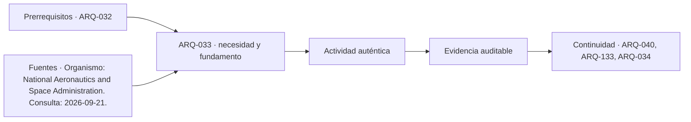

# ARQ-033 · Actividades, relaciones y adyacencias

**Parte 04 · Clase desarrollada · Incorporada en v0.3.0 · 21 de septiembre de 2026.**

Material de estudio con casos originales. Revisión externa especializada pendiente. La numeración organiza conocimientos, no un calendario.

## Pregunta central

¿Cómo transformar una lista de actividades en relaciones espaciales sin dibujar habitaciones demasiado pronto?

## Qué aprenderás y qué entregarás

Diferenciarás actividades, recintos, relaciones y flujos; construirás una matriz de adyacencias con razones explícitas y compararás dos alternativas mediante un indicador sencillo. Entregarás un diagrama de relaciones, una tabla de movimientos y una conclusión que reconozca los límites del cálculo.

El caso corresponde a un centro comunitario ficticio. Las superficies y recorridos son datos de estudio, no mínimos normativos ni una verificación de accesibilidad o evacuación.

## 1. Una actividad no equivale a una habitación

“Biblioteca” puede incluir lectura silenciosa, préstamo, clasificación, consulta, conversación breve, almacenamiento y recepción de materiales. Dibujar un rectángulo llamado biblioteca antes de comprender esas actividades oculta conflictos: algunas necesitan silencio; otras generan tránsito o requieren manipular bultos.

La misma actividad también puede ocupar más de un espacio. Un taller comienza retirando materiales, continúa con trabajo de participantes y termina con limpieza y devolución. Un programa que solo mide la superficie de las mesas deja fuera preparación, almacenaje y mantenimiento.

Empieza por verbos y objetos: llegar, orientarse, esperar, conversar, trabajar, guardar, limpiar. Después identifica quién realiza la acción, con qué elementos, en qué condiciones y qué debe suceder antes o después. El análisis de operaciones y escenarios previo a fijar requisitos tiene un paralelo metodológico en la ingeniería de sistemas [[NASA-DESIGN]](#FUENTE-NASA-DESIGN); aquí se adapta al espacio habitado, sin convertir esa fuente en una norma arquitectónica.

## 2. Relacionar no siempre significa juntar

Dos actividades pueden necesitar contacto directo, cercanía, acceso controlado, separación acústica o independencia completa. Todas son relaciones de proyecto. Una matriz que solo marca “cerca” o “lejos” pierde buena parte del problema.

Considera seis componentes: recepción R, taller T, lectura L, bodega B, atención reservada Q y servicios S. La bodega debe facilitar el traslado de materiales al taller; lectura y taller requieren evaluar conflicto de ruido; atención reservada necesita acceso comprensible desde recepción, pero no exposición de la conversación.

Una relación puede ser satisfecha por organización, horario de uso del edificio, equipamiento o proceso, además de distancia. Si dos actividades ruidosas y silenciosas compartirán recinto en momentos distintos, debes demostrar quién transforma el espacio y cómo se evita superposición no prevista. “Se coordinarán” no es una solución si nadie tiene esa responsabilidad.

## 3. Construir una matriz con significado

Trabajaremos cuatro categorías de relación: **D**, vínculo directo conveniente; **C**, cercanía deseable; **S**, separación o control del conflicto; y **N**, ninguna proximidad especial identificada. Son convenciones del ejercicio, no símbolos normativos.

<table>
<thead>
<tr>
  <th>Par</th>
  <th>Relación inicial</th>
  <th>Razón</th>
  <th>Condición pendiente</th>
</tr>
</thead>
<tbody>
<tr>
  <td>R–L</td>
  <td>C</td>
  <td>Orientación hacia consulta y préstamo.</td>
  <td>Distinguir tránsito de zona silenciosa.</td>
</tr>
<tr>
  <td>R–Q</td>
  <td>C</td>
  <td>Ofrecer una alternativa de atención reservada.</td>
  <td>Verificar privacidad y acceso sin estigma.</td>
</tr>
<tr>
  <td>T–B</td>
  <td>D</td>
  <td>Traslado frecuente de herramientas y materiales.</td>
  <td>Dimensiones de objetos y medios de transporte.</td>
</tr>
<tr>
  <td>T–L</td>
  <td>S</td>
  <td>Posible incompatibilidad entre trabajo sonoro y lectura.</td>
  <td>Estudiar transmisión y uso simultáneo.</td>
</tr>
<tr>
  <td>B–L</td>
  <td>N</td>
  <td>No se ha identificado intercambio frecuente.</td>
  <td>Confirmar si existe colección almacenada en B.</td>
</tr>
<tr>
  <td>R–S</td>
  <td>C</td>
  <td>Orientación hacia servicios.</td>
  <td>Evitar que la espera obstruya el recorrido.</td>
</tr>
</tbody>
</table>

La columna de razón es fundamental. Si cambia el uso de la bodega, quizá cambie su relación con lectura. Sin la razón, las letras se vuelven decisiones rígidas cuyo origen nadie recuerda.

Una matriz simétrica representa la relación espacial entre pares, pero no describe necesariamente la dirección de cada movimiento. Recepción puede enviar información al taller mientras los materiales llegan por otra ruta. Para eso necesitamos un diagrama de flujos.

## 4. Representar recorridos con objetos y frecuencia

Un flujo debe indicar origen, destino, qué o quién se mueve y una unidad de frecuencia. “Mucho tránsito” es difícil de comparar. “Doce traslados de cajas entre taller y bodega por jornada de funcionamiento del caso” permite plantear un análisis, aunque la cifra deba contrastarse.

No sumes automáticamente personas, carros y residuos como si todos exigieran lo mismo. Pueden compartir distancia, pero tener anchos, horarios, condiciones de limpieza o restricciones diferentes. Dos recorridos cortos que se cruzan pueden ser peores operativamente que recorridos un poco más largos y separados.

Para un primer indicador usaremos **recorrido ponderado por viajes**: `J=Σ(nij·dij)`, donde nij es cantidad de viajes entre dos lugares y dij su distancia. La unidad será viaje·metro por periodo. No es tiempo, costo ni riesgo: cada uno necesitaría variables adicionales.

## 5. Caso trabajado: dos organizaciones espaciales

En un periodo ficticio contamos 20 viajes R→T, 12 viajes T→B y 15 viajes R→L. Los viajes ya representan los movimientos que decidimos contar; no añadimos vueltas si no estaban definidas en el registro. Las alternativas A y B ofrecen estas distancias:

<table>
<thead>
<tr>
  <th>Relación</th>
  <th style="text-align:right">Viajes</th>
  <th style="text-align:right">Distancia A</th>
  <th style="text-align:right">A: viajes por distancia</th>
  <th style="text-align:right">Distancia B</th>
  <th style="text-align:right">B: viajes por distancia</th>
</tr>
</thead>
<tbody>
<tr>
  <td>R→T</td>
  <td style="text-align:right">20</td>
  <td style="text-align:right">12 m</td>
  <td style="text-align:right">240</td>
  <td style="text-align:right">6 m</td>
  <td style="text-align:right">120</td>
</tr>
<tr>
  <td>T→B</td>
  <td style="text-align:right">12</td>
  <td style="text-align:right">18 m</td>
  <td style="text-align:right">216</td>
  <td style="text-align:right">4 m</td>
  <td style="text-align:right">48</td>
</tr>
<tr>
  <td>R→L</td>
  <td style="text-align:right">15</td>
  <td style="text-align:right">5 m</td>
  <td style="text-align:right">75</td>
  <td style="text-align:right">10 m</td>
  <td style="text-align:right">150</td>
</tr>
<tr>
  <td>Total</td>
  <td style="text-align:right">47</td>
  <td style="text-align:right">—</td>
  <td style="text-align:right">531</td>
  <td style="text-align:right">—</td>
  <td style="text-align:right">318</td>
</tr>
</tbody>
</table>

B reduce el indicador en `531-318=213 viaje·m`, aproximadamente `213/531×100=40,11 %`. Sin embargo, R→L empeora: su contribución pasa de 75 a 150. La suma no autoriza a ocultar quién asume la diferencia.

Además, supongamos que en B el taller queda abierto hacia lectura, mientras ambas actividades se realizan simultáneamente. Si una condición esencial es permitir lectura sin interferencia inaceptable del taller, B no puede declararse resuelta solo porque su indicador sea menor. Debe reformularse o demostrar cómo controla el conflicto.

## 6. Restricciones y preferencias no se mezclan sin explicación

Una **restricción** define algo que la alternativa debe satisfacer para ser admisible en el problema. Una **preferencia** ayuda a comparar alternativas que ya cumplen las condiciones esenciales. El ahorro de recorridos no compensa automáticamente una ruta inaccesible, una pérdida de privacidad o un incumplimiento de seguridad.

En el ejemplo, primero revisamos los requisitos obligatorios y pendientes de especialidad. Solo después comparamos los indicadores operativos. Si se decide usar varios criterios ponderados, hay que explicar escala, unidades, pesos y sensibilidad. Un número final con tres decimales puede ocultar juicios de valor muy discutibles.

No existe un peso universal para convertir dignidad, distancia y ruido en una sola cifra. A veces la decisión requiere mostrar intercambios de manera explícita y buscar una tercera alternativa, no forzar un ganador matemático.

## 7. Superficies útiles y superficie total

El programa necesita superficies, pero deben tener denominadores claros. Supón que las actividades ocupan `240 m² útiles programados`. Si se adopta para este estudio una proporción de áreas adicionales del 20 % **de la superficie total**, lo útil representa el 80 % del total.

Entonces `A_total=240/0,80=300 m²`, con 60 m² adicionales. Multiplicar 240 por 1,20 entrega 288 m², pero en ese caso los 48 m² añadidos representan el 16,67 % del total, no el 20 %. Ambas operaciones pueden responder a convenciones diferentes; el error está en cambiar la base sin advertirlo.

El porcentaje es solo una hipótesis preliminar. No garantiza que quepan circulaciones, muros, instalaciones y exigencias del proyecto. Más adelante hay que sustituirlo por superficies efectivamente comprobadas en una configuración espacial.

Una tabla de superficies tampoco valida la capacidad de uso. Dos salas con igual área pueden ofrecer posibilidades distintas por proporciones, accesos, obstáculos y disposición de mobiliario.

## 8. Pasar de relaciones a alternativas dibujadas

Dibuja primero nodos y relaciones, sin fingir escala. Después propón dos organizaciones espaciales y somételas a geometría: dimensiones, accesos, recorridos, luz, estructura y servicios. El diagrama de burbujas ayuda a pensar, pero no es un plano ejecutivo.

Revisa también las interfaces. Una bodega contigua al taller puede seguir siendo ineficiente si su puerta queda en el extremo contrario o si el giro necesario para mover una caja no cabe. La cercanía entre centros geométricos no representa siempre la distancia real de recorrido.

Documenta la evolución: relación requerida, alternativa que la satisface, dificultad encontrada y modificación. Así el dibujo conserva el razonamiento, en lugar de convertirse en una forma atractiva cuya funcionalidad se presupone.

## Práctica independiente

**Problema A.** En un segundo caso hay 10 viajes X→Y y 6 viajes Y→Z. La alternativa A tiene distancias de 8 y 10 m; B tiene 11 y 4 m. Calcula el indicador para ambas y explica qué otra información necesitarías antes de decidir.

**Problema B.** Una propuesta utiliza 180 m² útiles y afirma reservar el 25 % de su superficie total para áreas adicionales. Calcula la superficie total coherente con esa afirmación.

**Problema C.** El taller necesita cercanía a bodega, separación de lectura y acceso desde recepción. Explica por qué dibujar los tres recintos en línea no demuestra por sí mismo que esas relaciones estén resueltas.

Solución razonada

En A, el indicador es <code>10×8+6×10=140 viaje·m</code>. En B, <code>10×11+6×4=134 viaje·m</code>. B reduce solo 6 unidades del indicador; no conocemos tipo de carga, accesibilidad, cruces, ruido ni incertidumbre de las frecuencias. La diferencia numérica no basta para una aprobación integral.

En B, lo útil representa el 75 %: <code>180/0,75=240 m²</code>. Quedan 60 m² adicionales. Agregar únicamente el 25 % de 180 daría 225 m² y respondería a otra convención.

En C, la secuencia de rectángulos no revela puertas, recorridos efectivos, transmisión sonora, acceso de objetos ni simultaneidad. Debes comprobar las interfaces y condiciones, no solo la proximidad en el papel.

## Autoevaluación y transferencia

La entrega es sólida cuando cada relación tiene una razón, cada flujo una unidad y cada superficie una definición. Debes distinguir entre un indicador operativo y un requisito que no puede compensarse con ese indicador. Antes de cerrar el programa, explica qué relaciones faltan por observar y cuáles dependen de especialidades todavía no consultadas.

<!-- pedagogia-2026:inicio -->
## Decisión pedagógica y posición curricular

### Por qué existe

Esta clase existe para resolver una necesidad concreta del recorrido: ¿Cómo transformar una lista de actividades en relaciones espaciales sin dibujar habitaciones demasiado pronto?

### Por qué está exactamente aquí

Ocupa el lugar 3 de la Parte 04. Se estudia después de ARQ-032 · Entrevistas, observación y consentimiento porque usa esa base para responder «¿Cómo transformar una lista de actividades en relaciones espaciales sin dibujar habitaciones demasiado pronto?». Se ubica antes de ARQ-034 · Antropometría sin reducir a las personas al promedio porque la evidencia producida aquí debe estar disponible para ese paso.

- **Prerrequisitos:** `ARQ-032`
- **Capacidad que introduce:** Diferenciarás actividades, recintos, relaciones y flujos; construirás una matriz de adyacencias con razones explícitas y compararás dos alternativas mediante un indicador sencillo. Entregarás un diagrama de relaciones, una tabla de movimientos y una conclusión que reconozca los límites del cálculo. El caso corresponde a un centro comunitario ficticio.
- **Clases o experiencias que dependen de ella:** `ARQ-040`, `ARQ-133`, `ARQ-034`

El diagrama permite comprobar una relación que el texto lineal oculta con facilidad: esta clase recibe capacidades previas, toma decisiones apoyadas por fuentes, exige una experiencia y produce evidencia que habilita trabajo posterior. No representa un procedimiento de obra.

## Resultado observable, evidencia y evaluación

1. Identificar y delimitar las condiciones necesarias para responder la pregunta central de actividades, relaciones y adyacencias.
2. Producir y comprobar la evidencia declarada por la clase: Diferenciarás actividades, recintos, relaciones y flujos; construirás una matriz de adyacencias con razones explícitas y compararás dos alternativas mediante un indicador sencillo. Entregarás un diagrama de relaciones, una tabla de movimientos y una conclusión que reconozca los límites del cálculo. El caso corresponde a un centro comunitario ficticio.
3. Justificar una decisión de actividades, relaciones y adyacencias mediante fuentes, supuestos, alternativas y límites explícitos.

## Actividad, evidencia y criterio de aceptación

**Actividad:** Problema A. En un segundo caso hay 10 viajes X→Y y 6 viajes Y→Z. La alternativa A tiene distancias de 8 y 10 m; B tiene 11 y 4 m.

**Evidencia mínima:** Diferenciarás actividades, recintos, relaciones y flujos; construirás una matriz de adyacencias con razones explícitas y compararás dos alternativas mediante un indicador sencillo. Entregarás un diagrama de relaciones, una tabla de movimientos y una conclusión que reconozca los límites del cálculo. El caso corresponde a un centro comunitario ficticio.

**Archivo sugerido:** `evidence/ARQ-033/evidencia.md`.

**Criterio de aceptación:** la entrega se acepta cuando:

- La entrega responde explícitamente a la pregunta: ¿Cómo transformar una lista de actividades en relaciones espaciales sin dibujar habitaciones demasiado pronto?
- La actividad conserva las fronteras del caso y permite reconstruir el procedimiento: Problema A. En un segundo caso hay 10 viajes X→Y y 6 viajes Y→Z. La alternativa A tiene distancias de 8 y 10 m; B tiene 11 y 4 m.
- Cada afirmación externa puede seguirse hasta una fuente, su alcance consultado y su límite.
- La evidencia deja disponible una entrada comprobable para ARQ-040.
- La entrega es sólida cuando cada relación tiene una razón, cada flujo una unidad y cada superficie una definición. Debes distinguir entre un indicador operativo y un requisito que no puede compensarse con ese indicador.

La [rúbrica común](../../docs/RUBRICA_COMUN.md) complementa estos criterios; no los reemplaza. Una entrega puede superar un promedio y continuar pendiente si oculta una condición crítica.

## Trazabilidad de las decisiones

| # | Decisión o fundamento | Fuente utilizada | Aplicación y límite en esta clase |
|---:|---|---|---|
| 1 | Relacionar escenarios, necesidades y requisitos. | [Organismo: National Aeronautics and Space Administration. Consulta:…](https://www.nasa.gov/reference/4-0-system-design-processes/) | Consulta: Alcance consultado no documentado; debe completarse antes de ampliar la conclusión. Límite: Límite no documentado; la fuente no autoriza por sí sola una decisión profesional. |

La tabla permite auditar las relaciones; la explicación, el caso y la práctica de la clase siguen siendo la documentación principal.

## Autoevaluación, recuperación y continuidad

### Errores diagnósticos

Antes de avanzar, comprueba si puedes reconstruir cada resultado sin mirar la solución, señalar qué evidencia lo sostiene y nombrar una condición que obligaría a revisar tu decisión. Conserva la primera versión, la objeción recibida y la revisión.

**Conexión siguiente:** La continuidad inmediata es ARQ-034 · Antropometría sin reducir a las personas al promedio; conserva el método y vuelve a verificar datos y límites.
<!-- pedagogia-2026:fin -->

## Fuentes y alcance de uso

Las referencias identifican apoyos conceptuales. Los escenarios, cifras y soluciones del capítulo son elaboraciones didácticas originales, no datos de una obra ni ejemplos copiados de estas fuentes.

### [[NASA-DESIGN]](#FUENTE-NASA-DESIGN) NASA Systems Engineering Handbook, 4.0: System Design Processes

**Organismo:** National Aeronautics and Space Administration. **Consulta:** 2026-09-21.

[https://www.nasa.gov/reference/4-0-system-design-processes/](https://www.nasa.gov/reference/4-0-system-design-processes/)

**Alcance consultado:** Apartados web sobre expectativas, concepto de operaciones y requisitos.

**Apoyo:** Relacionar escenarios, necesidades y requisitos.

**Límites:** Aplicación a arquitectura elaborada por el programa; no se afirma aval de NASA ni se adopta su procedimiento como norma de construcción.
