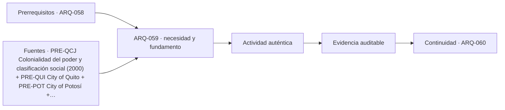

# ARQ-059 · Colonialidad, intercambio y transformaciones urbanas

**Parte 06 · Edición 0.5.0 · Clase desarrollada.**

**Antes de comenzar:** recupera ARQ-058 y las nociones de representación de la Parte 02. El cálculo y la física se apoyan en la Parte 03; los usuarios y programas, en la Parte 04. No hay calendario ni duración obligatoria.

**Alcance:** historia y análisis arquitectónico para estudio. Los casos, datos numéricos y esquemas identificados como ficticios son originales; no son levantamientos de monumentos. No autorizan construcción, diagnóstico ni intervención patrimonial. Revisión externa especializada pendiente.

## Pregunta central

¿Cómo estudiar una transformación urbana colonial sin reducirla a un estilo importado ni atribuir a un plano todo lo que ocurrió con propiedad, trabajo y vida cotidiana?

La evidencia será una lectura comparada de fuentes y un balance de superficies de una unidad territorial ficticia. La clase distingue hechos documentados, marcos interpretativos e hipótesis. No formula un juicio sobre partidos, gobiernos actuales o decisiones electorales.

## 1. Precisar los términos antes de interpretar

«Colonial» puede identificar una relación histórica de dominio, una administración, un período o una clasificación estilística. Esas acepciones no son equivalentes. Un edificio construido durante un período colonial no explica por sí solo cómo se distribuyeron trabajo, recursos o derechos en su entorno.

El término **colonialidad** pertenece a un campo de interpretación distinto del simple fechado de una obra. En el resumen del artículo de Aníbal Quijano, el autor vincula ese concepto con clasificación racial o étnica y organización del poder. [[PRE-QCJ]](#FUENTE-PRE-QCJ) Aquí se presenta como marco teórico atribuido, no como demostración automática de lo sucedido en cualquier ciudad. La ficha y el resumen consultados no sustituyen la lectura completa del artículo.

Para trabajar arquitectónicamente, traducimos las preguntas generales a relaciones investigables: quién encarga, quién construye, cómo se obtiene el suelo, qué redes se transforman, qué conocimientos intervienen y qué documentos permiten afirmarlo. Un concepto puede orientar esas preguntas, pero no proporcionar por adelantado todas las respuestas.

Tampoco «intercambio» significa necesariamente igualdad entre participantes. Puede haber circulación de técnicas junto con relaciones asimétricas de decisión o trabajo. La presencia de un motivo de otra procedencia no demuestra, por sí sola, colaboración voluntaria, imposición o resistencia. Cada atribución necesita evidencia concreta.

## 2. Tres casos que muestran dimensiones distintas

La ficha de Quito describe una trama relacionada con topografía, plazas, edificios religiosos y viviendas con patios, junto con la confluencia de tradiciones indígenas y europeas en artes y oficios. [[PRE-QUI]](#FUENTE-PRE-QUI) Esa información permite estudiar adaptación y participación técnica. No autoriza a concluir que todas las relaciones sociales fueron iguales porque una obra combine formas de varias procedencias.

Potosí exige ampliar la mirada hacia minería, depósitos y conducciones de agua, producción monetaria y barrios. La ficha de UNESCO incluye el trabajo obligatorio descrito como mita en su explicación histórica. [[PRE-POT]](#FUENTE-PRE-POT) No corresponde omitir esa dimensión y presentar el conjunto exclusivamente como riqueza decorativa; tampoco debemos inventar cifras de trabajadores o salarios no consultadas.

Las iglesias de Chiloé se relacionan con tradición de carpintería, prácticas comunitarias y encuentros entre saberes locales y europeos. [[HIS-CHI]](#FUENTE-HIS-CHI) La referencia chilena muestra que estudiar una construcción no termina en reconocer un modelo eclesiástico: también importan materiales, oficio, paisaje y mantenimiento.

Los tres casos responden preguntas diferentes. No son una muestra estadística de toda América ni permiten atribuir un único proceso a todas sus ciudades. Su valor didáctico está en obligarnos a cambiar de escala y a identificar qué dimensión se está documentando.

## 3. La cuadrícula no es un registro de propiedad

Una trama regular puede representarse mediante calles y parcelas, pero su geometría no indica automáticamente quién posee, usa o controla cada espacio. Dos terrenos de igual área pueden tener accesos, recursos y condiciones de tenencia diferentes. La igualdad de forma no demuestra igualdad de derechos.

Para una lectura territorial conviene separar **morfología**, **tenencia** y **uso**. La primera describe configuración; la segunda requiere documentos sobre relaciones con el suelo; la tercera registra actividades en un período. Pueden cambiar a ritmos distintos. Una parcela puede conservar sus límites y cambiar de uso; una propiedad puede dividirse sin modificar de inmediato sus edificaciones.

Un plano de proyecto tampoco prueba ejecución. Puede expresar una disposición deseada, un límite discutido o una regularización posterior. La fecha y el propósito del documento forman parte de su interpretación. Colorear parcelas en una reconstrucción digital no elimina la incertidumbre de sus fuentes.

Por eso, la superposición de planos debe conservar escalas, orientaciones y referencias. Si dos mapas no tienen precisión suficiente, una aparente diferencia de varios metros puede provenir del dibujo y no de una transformación real. Antes de interpretar un desplazamiento como una acción histórica, debemos comprobar que la comparación geométrica sea válida.

## 4. Caso trabajado: un balance territorial que no oculta a sus componentes

Imaginemos una unidad territorial de 100 × 100 m, es decir, **10.000 m²**. No representa Quito, Potosí ni una localidad de Chiloé. En la fase A contiene 1.600 m² de circulación, 1.000 m² de espacio común, 400 m² de reserva de canal, 5.000 m² repartidos entre diez parcelas domésticas iguales y 2.000 m² de un recinto institucional.

La suma es 1.600 + 1.000 + 400 + 5.000 + 2.000 = 10.000 m². Esta comprobación detecta omisiones o doble conteo antes de interpretar el reparto. No demuestra que las categorías fueran históricamente correctas: son datos definidos para el caso.

En la fase B, la circulación ocupa 2.000 m²; el espacio común, 1.600; el canal, 400; las parcelas domésticas, 4.500; y el recinto institucional, 1.500. La suma vuelve a ser 10.000 m². Circulación y espacio común aumentan conjuntamente 1.000 m², mientras las otras dos categorías disminuyen 500 m² cada una.

Si solo calculamos el promedio de parcela doméstica, pasamos de 500 a 450 m²: una reducción del 10 %. Pero el detalle de la fase B indica que cinco parcelas tienen 600 m² y cinco tienen 300 m². El promedio oculta dos cambios distintos: para el primer grupo, un aumento del 20 %; para el segundo, una reducción del 40 %.

<table>
<thead>
<tr>
  <th>Categoría ficticia</th>
  <th style="text-align:right">Fase A, m²</th>
  <th style="text-align:right">Fase B, m²</th>
  <th style="text-align:right">Cambio, m²</th>
</tr>
</thead>
<tbody>
<tr>
  <td>Circulación</td>
  <td style="text-align:right">1.600</td>
  <td style="text-align:right">2.000</td>
  <td style="text-align:right">+400</td>
</tr>
<tr>
  <td>Espacio común</td>
  <td style="text-align:right">1.000</td>
  <td style="text-align:right">1.600</td>
  <td style="text-align:right">+600</td>
</tr>
<tr>
  <td>Reserva de canal</td>
  <td style="text-align:right">400</td>
  <td style="text-align:right">400</td>
  <td style="text-align:right">0</td>
</tr>
<tr>
  <td>Diez parcelas domésticas</td>
  <td style="text-align:right">5.000</td>
  <td style="text-align:right">4.500</td>
  <td style="text-align:right">−500</td>
</tr>
<tr>
  <td>Recinto institucional</td>
  <td style="text-align:right">2.000</td>
  <td style="text-align:right">1.500</td>
  <td style="text-align:right">−500</td>
</tr>
<tr>
  <td>Total</td>
  <td style="text-align:right">10.000</td>
  <td style="text-align:right">10.000</td>
  <td style="text-align:right">0</td>
</tr>
</tbody>
</table>

La tabla no demuestra por qué ocurrió el cambio, si hubo compensaciones, si las personas permanecieron en el lugar o cómo se valoraban las parcelas. Tampoco convierte el área en una medida completa de bienestar. Enseña que un agregado puede ocultar distribuciones y que la interpretación necesita más documentos.

## 5. Lo que falta después de cerrar correctamente la suma

Para investigar una transformación real harían falta referencias de tenencia, decisiones, actores, actividades, accesos y posibles desplazamientos. La misma pérdida de superficie puede tener consecuencias diferentes si afecta un patio, un acceso indispensable o un terreno sin uso en ese período.

También importa la calidad de los datos. ¿La superficie está medida o estimada? ¿Las categorías se excluyen o una circulación atraviesa un espacio contabilizado como común? ¿El canal ocupa una reserva legal, una franja física o ambas? Si no aclaramos estas preguntas, una suma exacta puede reunir magnitudes incompatibles.

En el ejemplo, la contabilidad cierra porque hemos definido categorías exclusivas. Una investigación histórica puede no permitir ese nivel de precisión. En ese caso se documentan rangos y zonas desconocidas; no se inventan decimales para dar apariencia de rigor.

Este procedimiento conecta con Potosí: estudiar su sistema productivo implica relaciones entre infraestructura, trabajo y territorio, no solamente el contorno de edificios. [[PRE-POT]](#FUENTE-PRE-POT) La referencia histórica sostiene esa amplitud de mirada; nuestros porcentajes no son datos del sitio.

## 6. Triangular fuentes: propuesta, ejecución y experiencia

Supongamos que un expediente ficticio contiene una disposición de trazado, un pago por determinadas obras y un testimonio sobre una ruta cotidiana. La disposición expresa una regla o decisión; el pago registra una transacción; el testimonio informa una experiencia situada. Los tres pueden relacionarse, pero ninguno prueba todo el proceso.

Para contrastarlos, formula una afirmación pequeña: «Se propuso abrir una conexión», «se registró un pago por un trabajo», «una persona recuerda haber utilizado cierto recorrido». Después identifica qué vínculos faltan: que el pago corresponda a esa conexión, que la obra se ejecutara en esa fecha, que el testimonio se refiera al mismo tramo.

La triangulación no consiste en contar tres fuentes como tres votos a favor de una historia. Una puede copiar a otra; dos pueden depender del mismo registro; una fotografía puede mostrar otra fase. Hay que investigar sus relaciones y no solo su cantidad.

En Quito y Chiloé, las fichas patrimoniales reconocen participación de distintas tradiciones y oficios. [[PRE-QUI]](#FUENTE-PRE-QUI) [[HIS-CHI]](#FUENTE-HIS-CHI) Para atribuir una decisión a un grupo o persona concreta se necesita documentación más específica. Es preferible dejar una autoría abierta que convertir una categoría cultural en explicación de todos los detalles.

## 7. Leer el trabajo sin borrarlo ni inventarlo

El edificio terminado oculta actividades de extracción, transporte, elaboración, montaje y mantenimiento. Una historia arquitectónica puede recuperarlas preguntando por herramientas, materiales, contratos, testimonios y huellas. No todas las fuentes sobreviven ni describen a todas las personas por igual.

La ausencia de un nombre en el expediente no demuestra ausencia de participación. Pero tampoco permite asignar arbitrariamente la obra a un colectivo. La respuesta responsable distingue participación documentada, atribución de un estudio y cuestión pendiente.

Cuando una fuente como la ficha de Potosí documenta trabajo obligatorio, esa información debe nombrarse sin eufemismos y con referencia. [[PRE-POT]](#FUENTE-PRE-POT) Cuando el dato no está disponible, no se completa por analogía con otro lugar. Las semejanzas históricas orientan una búsqueda; no reemplazan la evidencia.

Este criterio también evita romantizar todo saber local o considerar toda técnica importada superior. La eficacia de una solución material exige estudiar condiciones y resultados. La posición de quien decide, la procedencia del conocimiento y el comportamiento de una obra son dimensiones relacionadas que conviene mantener distinguibles.

## 8. Práctica independiente

En una unidad ficticia de 12.000 m², la fase A contiene 2.000 m² de circulación, 1.500 de espacio común, 500 de canal, 6.000 distribuidos entre doce parcelas iguales y 2.000 institucionales. La fase B contiene 2.400, 2.100, 500, 5.400 y 1.600 m², respectivamente. Comprueba ambos balances y sus cambios.

En B, seis parcelas domésticas tienen 550 m² y seis, 350 m². Calcula el promedio y las variaciones respecto de los 500 m² iniciales. Explica qué oculta la comparación agregada.

Finalmente, redacta una conclusión que utilice los datos sin afirmar que todas las personas perdieron lo mismo, que el cambio fue aceptado o que su causa ha quedado demostrada. Indica dos fuentes adicionales necesarias.

Solución razonada de la práctica

Las dos fases suman 12.000 m². Circulación y espacio común aumentan 400 y 600 m²; el canal no cambia. Las parcelas domésticas disminuyen 600 m² y el recinto institucional, 400. Los aumentos y disminuciones se compensan en 1.000 m².

El promedio doméstico pasa de 500 a 450 m², una reducción del 10 %. Sin embargo, seis parcelas aumentan a 550 m², un 10 %, y seis disminuyen a 350 m², un 30 %. Se verifica la suma: 6 × 550 + 6 × 350 = 5.400 m². El promedio no describe el cambio de cada grupo.

Una conclusión válida dice: «Bajo las categorías y medidas del caso, cambió la distribución superficial de forma desigual entre parcelas. No conocemos tenencia, compensaciones, usos ni decisiones». Podrían requerirse expedientes de propiedad o reasignación y testimonios o registros de uso, contrastados por fecha y lugar. No basta una imagen del nuevo trazado para explicar aceptación o intención.

## Autoevaluación y cierre

La clase está resuelta cuando separas morfología de tenencia, verificas los balances y distingues una teoría atribuida de una conclusión histórica demostrada. Revisa que las cifras ficticias no se mezclen con los casos documentados y que cada atribución de trabajo o decisión tenga una fuente pertinente.

La arquitectura se comprende mejor cuando el análisis incorpora producción, suelo y personas sin convertirlos en detalles imaginados. La última clase de esta parte retomará los oficios para estudiar cómo conservar y transmitir conocimientos de manera verificable.

<!-- pedagogia-2026:inicio -->
## Decisión pedagógica y posición curricular

### Por qué existe

Esta clase existe para resolver una necesidad concreta del recorrido: ¿Cómo estudiar una transformación urbana colonial sin reducirla a un estilo importado ni atribuir a un plano todo lo que ocurrió con propiedad, trabajo y vida cotidiana? La evidencia será una lectura comparada de fuentes y un balance de superficies de una unidad territorial ficticia.

### Por qué está exactamente aquí

Ocupa el lugar 9 de la Parte 06. Se estudia después de ARQ-058 · Sur y sudeste asiático: clima, templo y ciudad porque usa esa base para responder «¿Cómo estudiar una transformación urbana colonial sin reducirla a un estilo importado ni atribuir a un plano todo lo que ocurrió con propiedad, trabajo y vida cotidiana? La evidencia será una lectura comparada de fuentes y un balance de superficies de una unidad territorial ficticia.». Se ubica antes de ARQ-060 · Oficios, aprendizaje y transmisión del conocimiento porque la evidencia producida aquí debe estar disponible para ese paso.

- **Prerrequisitos:** `ARQ-058`
- **Capacidad que introduce:** 1. Identificar y delimitar las condiciones necesarias para responder la pregunta central de colonialidad, intercambio y transformaciones urbanas. 2.
- **Clases o experiencias que dependen de ella:** `ARQ-060`

El diagrama permite comprobar una relación que el texto lineal oculta con facilidad: esta clase recibe capacidades previas, toma decisiones apoyadas por fuentes, exige una experiencia y produce evidencia que habilita trabajo posterior. No representa un procedimiento de obra.

## Resultado observable, evidencia y evaluación

1. Identificar y delimitar las condiciones necesarias para responder la pregunta central de colonialidad, intercambio y transformaciones urbanas.
2. Producir y comprobar la evidencia declarada por la clase: 1. Identificar y delimitar las condiciones necesarias para responder la pregunta central de colonialidad, intercambio y transformaciones urbanas. 2.
3. Justificar una decisión de colonialidad, intercambio y transformaciones urbanas mediante fuentes, supuestos, alternativas y límites explícitos.

## Actividad, evidencia y criterio de aceptación

**Actividad:** En una unidad ficticia de 12.000 m², la fase A contiene 2.000 m² de circulación, 1.500 de espacio común, 500 de canal, 6.000 distribuidos entre doce parcelas iguales y 2.000 institucionales. La fase B contiene 2.400, 2.100, 500, 5.400 y 1.600 m², respectivamente. Comprueba ambos balances y sus cambios.

**Evidencia mínima:** 1. Identificar y delimitar las condiciones necesarias para responder la pregunta central de colonialidad, intercambio y transformaciones urbanas. 2.

**Archivo sugerido:** `evidence/ARQ-059/evidencia.md`.

**Criterio de aceptación:** la entrega se acepta cuando:

- La entrega responde explícitamente a la pregunta: ¿Cómo estudiar una transformación urbana colonial sin reducirla a un estilo importado ni atribuir a un plano todo lo que ocurrió con propiedad, trabajo y vida cotidiana? La evidencia será una lectura comparada de fuentes y un balance de superficies de una unidad territorial ficticia.
- La actividad conserva las fronteras del caso y permite reconstruir el procedimiento: En una unidad ficticia de 12.000 m², la fase A contiene 2.000 m² de circulación, 1.500 de espacio común, 500 de canal, 6.000 distribuidos entre doce parcelas iguales y 2.000 institucionales. La fase B contiene 2.400, 2.100, 500, 5.400 y 1.600 m², respectivamente. Comprueba ambos balances y sus cambios.
- Cada afirmación externa puede seguirse hasta una fuente, su alcance consultado y su límite.
- La evidencia deja disponible una entrada comprobable para ARQ-060.
- La clase está resuelta cuando separas morfología de tenencia, verificas los balances y distingues una teoría atribuida de una conclusión histórica demostrada. Revisa que las cifras ficticias no se mezclen con los casos documentados y que cada atribución de trabajo o decisión tenga una fuente pertinente.

La [rúbrica común](../../docs/RUBRICA_COMUN.md) complementa estos criterios; no los reemplaza. Una entrega puede superar un promedio y continuar pendiente si oculta una condición crítica.

## Trazabilidad de las decisiones

| # | Decisión o fundamento | Fuente utilizada | Aplicación y límite en esta clase |
|---:|---|---|---|
| 1 | Localizar evidencia externa pertinente para colonialidad, intercambio y transformaciones urbanas. | [PRE-QCJ Colonialidad del poder y clasificación social (2000)](https://jwsr.pitt.edu/ojs/jwsr/article/view/228) | Consulta: Alcance consultado no documentado; debe completarse antes de ampliar la conclusión. Límite: Marco teórico atribuido a su autor, no hecho demostrado para cualquier ciudad. El resumen no sustituye la lectura integral del artículo ni fuentes históricas de cada caso. |
| 2 | Localizar evidencia externa pertinente para colonialidad, intercambio y transformaciones urbanas. | [PRE-QUI City of Quito](https://whc.unesco.org/en/list/2/) | Consulta: Alcance consultado no documentado; debe completarse antes de ampliar la conclusión. Límite: No se adoptan superlativos de la ficha ni se toma la mezcla formal como prueba de igualdad social. |
| 3 | Localizar evidencia externa pertinente para colonialidad, intercambio y transformaciones urbanas. | [PRE-POT City of Potosí](https://whc.unesco.org/en/list/420/) | Consulta: Alcance consultado no documentado; debe completarse antes de ampliar la conclusión. Límite: No se consultaron archivos completos de salarios, población o propiedad; no se inventan cifras de explotación. |
| 4 | Localizar evidencia externa pertinente para colonialidad, intercambio y transformaciones urbanas. | [HIS-CHI Churches of Chiloé](https://whc.unesco.org/en/list/971/) | Consulta: Alcance consultado no documentado; debe completarse antes de ampliar la conclusión. Límite: No sustituye levantamiento ni diagnóstico de una iglesia concreta. No se reproducen imágenes de terceros. |

La tabla permite auditar las relaciones; la explicación, el caso y la práctica de la clase siguen siendo la documentación principal.

## Autoevaluación, recuperación y continuidad

### Errores diagnósticos

Antes de avanzar, comprueba si puedes reconstruir cada resultado sin mirar la solución, señalar qué evidencia lo sostiene y nombrar una condición que obligaría a revisar tu decisión. Conserva la primera versión, la objeción recibida y la revisión.

**Conexión siguiente:** La continuidad inmediata es ARQ-060 · Oficios, aprendizaje y transmisión del conocimiento; conserva el método y vuelve a verificar datos y límites.
<!-- pedagogia-2026:fin -->

## Fuentes y alcance de uso

Consulta del bloque: 21 de septiembre de 2026. Las referencias respaldan las afirmaciones delimitadas en el texto; los ejercicios son desarrollos educativos originales. No se reproducen fotografías, planos de terceros ni normas comerciales.

### [[PRE-QCJ]](#FUENTE-PRE-QCJ) Colonialidad del poder y clasificación social (2000)

**Organismo:** Aníbal Quijano / Journal of World-Systems Research, 6(2), 342–386. [Consultar la fuente](https://jwsr.pitt.edu/ojs/jwsr/article/view/228).

**Uso en la clase:** Atribución a Quijano del marco que relaciona colonialidad, clasificación racial/étnica y organización del poder. **Límite:** Marco teórico atribuido a su autor, no hecho demostrado para cualquier ciudad. El resumen no sustituye la lectura integral del artículo ni fuentes históricas de cada caso.

### [[PRE-QUI]](#FUENTE-PRE-QUI) City of Quito

**Organismo:** UNESCO World Heritage Centre. [Consultar la fuente](https://whc.unesco.org/en/list/2/).

**Uso en la clase:** Topografía, trama, patios y confluencia de tradiciones en edificios y oficios. **Límite:** No se adoptan superlativos de la ficha ni se toma la mezcla formal como prueba de igualdad social.

### [[PRE-POT]](#FUENTE-PRE-POT) City of Potosí

**Organismo:** UNESCO World Heritage Centre. [Consultar la fuente](https://whc.unesco.org/en/list/420/).

**Uso en la clase:** Minería, infraestructura hidráulica, moneda, barrios y trabajo obligatorio descrito como mita. **Límite:** No se consultaron archivos completos de salarios, población o propiedad; no se inventan cifras de explotación.

### [[HIS-CHI]](#FUENTE-HIS-CHI) Churches of Chiloé

**Organismo:** UNESCO World Heritage Centre. [Consultar la fuente](https://whc.unesco.org/en/list/971/).

**Uso en la clase:** Tradición de carpintería, cruces culturales, paisaje, comunidad y conservación **Límite:** No sustituye levantamiento ni diagnóstico de una iglesia concreta. No se reproducen imágenes de terceros.
