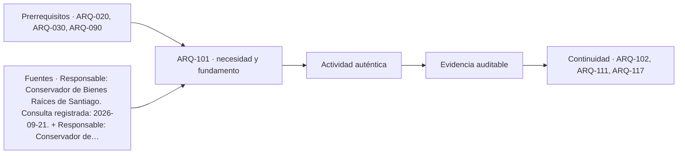

# ARQ-101 · Límites, dominio, servidumbres y antecedentes prediales

**Parte 11 · Clase desarrollada · Incorporada en v0.8.0.**

Prerrequisitos conceptuales: ARQ-020, ARQ-030, ARQ-090. Sin calendario. Casos, datos y esquemas originales y ficticios, salvo antecedentes expresamente atribuidos. Material de estudio; revisión externa especializada pendiente. No constituye proyecto ejecutable ni habilitación profesional.

## Pregunta central

¿Qué sabemos realmente de un terreno cuando tenemos una dirección, un rol tributario, una fotografía y una cifra de superficie? Antes de dibujar un edificio hay que distinguir identificación, dominio, límites, restricciones y condiciones urbanísticas. Son preguntas relacionadas, pero no se responden con un único documento ni con la apariencia del lugar.

## Qué aprenderás y qué entregarás

Construirás un expediente predial ficticio con una matriz de antecedentes, contradicciones y acciones de verificación. Resolverás una superposición de dos franjas de restricción sin descontar dos veces su intersección. La entrega será un plano de hipótesis claramente rotulado y un registro de qué corresponde comprobar mediante levantamiento, documentación registral y revisión profesional. No se emite aquí un estudio de títulos ni una interpretación jurídica de un predio real.

## 1. Identificar no equivale a acreditar

Una dirección permite localizar aproximadamente una propiedad; un rol vincula información tributaria; una inscripción identifica antecedentes del registro correspondiente. Ninguno debe confundirse con una medición completa de sus límites físicos y jurídicos. El expediente debe conservar las referencias originales para que otra persona pueda verificar qué documento se consultó.

La descripción pública de trámites del Conservador de Bienes Raíces de Santiago diferencia la copia de inscripción con vigencia o dominio vigente de otros certificados [[SITE-CBR]](#FUENTE-SITE-CBR). Esa distinción permite formular una pregunta sobre titularidad documentada, pero no reemplaza un estudio profesional de todos los antecedentes pertinentes. El conservador competente y la situación particular deben verificarse.

El certificado de hipotecas, gravámenes y prohibiciones se refiere a otras condiciones registrales, entre ellas las que pueda contener sobre servidumbres [[SITE-GP]](#FUENTE-SITE-GP). Consultarlo no significa que cualquier restricción imaginable esté resuelta ni que se pueda interpretar su efecto sin leer sus antecedentes. En la clase se estudia cómo organizar preguntas, no cómo declarar un título libre de problemas.

## 2. Límite observado, límite representado y límite jurídico

Un cerco es un objeto visible. Puede coincidir con un deslinde o no hacerlo. Un polígono en un visor es una representación producida con una finalidad, escala y fuente. Un deslinde documentado requiere interpretar antecedentes pertinentes y relacionarlos con el terreno mediante trabajo competente. Las tres cosas no deben fusionarse porque aparecen próximas en pantalla.

El aviso del visor Mapas SII señala que su cartografía no acredita delimitaciones prediales [[SITE-SII]](#FUENTE-SITE-SII). Por tanto, medir un polígono tributario puede servir para una exploración claramente identificada, pero no para fijar un cierre o resolver una controversia de límites. La finalidad del dato condiciona su uso.

En un plano de trabajo conviene separar capas: elementos observados, geometría documental, levantamiento disponible e hipótesis. Si dos líneas difieren, no se promedian ni se mueve una para que coincida visualmente con otra. Se registra el desacuerdo y se investiga su origen: escala, referencia, fecha, transformación o diferencia real de antecedentes.

## 3. Información urbanística y propiedad responden preguntas distintas

El formulario oficial de Certificado de Informaciones Previas del MINVU reúne identificación, instrumentos de planificación, normas urbanísticas, líneas oficiales, afectaciones y características de urbanización [[SITE-CIP]](#FUENTE-SITE-CIP). La existencia de esos campos ayuda a ordenar el dossier. Un formulario vacío no contiene la respuesta para ningún terreno.

El portal ministerial distingue CIP, certificado de número y certificado de afectación a utilidad pública, entre otras actuaciones [[SITE-FORM]](#FUENTE-SITE-FORM). No corresponde usar el nombre de un documento como sustituto de todos los demás. La revisión del proyecto deberá identificar los antecedentes aplicables, sus fechas y las modificaciones relevantes.

Tampoco un antecedente urbanístico acredita dominio, ni una inscripción favorable confirma que un uso sea admisible. La factibilidad de un proyecto requiere relacionar campos de información diferentes. La matriz del expediente debe impedir que una respuesta afirmativa en uno se extienda silenciosamente a todos.

## 4. Caso trabajado: tres superficies incompatibles

Un expediente ficticio contiene una escritura que menciona 1.200 m², una ficha tributaria con 1.152 m² y un levantamiento preliminar que representa un rectángulo de 29,40 por 40 m, equivalente a 1.176 m². No se entregan aquí documentos reales ni se atribuye validez jurídica a esas cifras.

La diferencia entre la mayor y la menor es 48 m². Su promedio aritmético es 1.176 m², coincidente por construcción con el levantamiento ficticio. Esa coincidencia no demuestra que el promedio sea la superficie correcta. Las cifras pueden referirse a objetos, fechas o convenciones diferentes; no son necesariamente tres mediciones independientes de la misma magnitud.

La primera acción es identificar procedencia, fecha, método y objeto de cada cifra. La segunda es revisar cómo se vinculan los documentos entre sí y con el levantamiento. La tercera es encargar las comprobaciones competentes. No se selecciona la cifra mayor para «aprovechar mejor el terreno» ni la menor como garantía automática de prudencia.

## 5. Una matriz de antecedentes que produce acciones

<table>
<thead>
<tr>
  <th>Antecedente ficticio</th>
  <th>Qué aporta</th>
  <th>Qué no permite concluir</th>
  <th>Acción siguiente</th>
</tr>
</thead>
<tbody>
<tr>
  <td>Dirección y rol</td>
  <td>Identificación de trabajo</td>
  <td>Dominio y deslinde definitivo</td>
  <td>Vincular con documentos correspondientes</td>
</tr>
<tr>
  <td>Inscripción referida</td>
  <td>Antecedente registral</td>
  <td>Geometría completa sin revisión</td>
  <td>Obtener y estudiar copia pertinente</td>
</tr>
<tr>
  <td>Plano preliminar</td>
  <td>Geometría medida bajo un método</td>
  <td>Efecto jurídico de límites</td>
  <td>Verificar referencias y alcance profesional</td>
</tr>
<tr>
  <td>CIP solicitado</td>
  <td>Preguntas urbanísticas del caso</td>
  <td>Parámetros mientras no exista respuesta</td>
  <td>Revisar documento emitido y antecedentes</td>
</tr>
<tr>
  <td>Cerco observado</td>
  <td>Posición física visible</td>
  <td>Coincidencia con deslinde</td>
  <td>Comparación documentada, sin intervenir</td>
</tr>
</tbody>
</table>

Una matriz útil termina en una acción concreta. «Revisar después» mantiene la incertidumbre, pero no organiza el trabajo. Debe indicarse qué información falta y quién puede resolverla. La persona que prepara el esquema arquitectónico no debe asumir por defecto todas las atribuciones técnicas y jurídicas.

## 6. Superponer restricciones sin duplicar superficies

Para aislar el problema geométrico, adoptamos ahora otro rectángulo ficticio de 30 por 40 m, con origen local en una esquina. El ejercicio estipula dos franjas donde no se sitúa la edificación propuesta: una lateral de 4 m por 40 m y una frontal de 5 m por 30 m. No se afirma que toda servidumbre o afectación produzca esa prohibición: es una condición inventada para practicar superposición.

La franja lateral ocupa 160 m²; la frontal, 150 m². Comparten una esquina de 4 por 5 m, es decir 20 m². La unión de ambas es `160 + 150 − 20 = 290 m²`. El área no incluida en esas franjas es `1.200 − 290 = 910 m²`.

También puede calcularse como rectángulo restante: `(30 − 4) × (40 − 5) = 26 × 35 = 910 m²`. Los dos métodos coinciden. Restar simplemente 160 y 150 del total habría producido 890 m² porque la intersección se descontaría dos veces.

*Esquema de conjuntos y áreas. Las bandas no representan restricciones reales ni definen una superficie legalmente edificable.*

## 7. Superficie disponible no es lo mismo que capacidad de proyecto

Aunque el remanente geométrico tenga 910 m², todavía faltan forma, accesos, pendientes, suelo, redes, normas y actividades. Un área extensa puede quedar dividida en fragmentos que no admiten la configuración prevista. Un área menor puede estar mejor relacionada con un programa particular. El número total no resuelve esas relaciones.

Tampoco se debe llamar automáticamente «superficie edificable» al remanente del ejercicio. Ese término puede involucrar reglas y convenciones que aquí no se han determinado. Es más preciso escribir «área fuera de las dos franjas estipuladas». La etiqueta mantiene el alcance de lo realmente calculado.

La misma precaución se aplica al volumen: multiplicar superficie por una altura imaginada no determina constructibilidad autorizada. El dossier debe separar exploración geométrica de antecedentes normativos y de factibilidad. Esa separación permite avanzar sin presentar como confirmado lo que sigue abierto.

## 8. Servidumbres y redes como relaciones espaciales

Una servidumbre puede requerir estudiar ubicación, finalidad, extensión, sujetos y condiciones documentadas. No basta dibujar una línea de colores y asumir que siempre permite o impide lo mismo. El equipo debe conocer qué uso o acceso se relaciona con ella y qué interpretación corresponde a especialistas competentes.

En el estudio arquitectónico, la pregunta espacial es cómo una condición documentada afecta implantación, circulación, mantenimiento o crecimiento. Puede ser necesario mantener acceso a una infraestructura o estudiar una franja específica, pero su alcance no se inventa a partir de una fotografía de una tubería.

Cuando el antecedente es ambiguo, la alternativa de proyecto debe mostrar esa incertidumbre. Se puede trabajar con escenarios separados, por ejemplo una geometría con la franja provisional y otra sujeta a aclaración, siempre identificadas. No se transforma el escenario más conveniente en una conclusión registral.

## 9. Preparar el dossier para que otro equipo lo use

El expediente debe conservar documentos originales, una tabla de versiones y una síntesis que no borre diferencias. Cada geometría necesita fuente, método, fecha y sistema de referencia cuando corresponda. Una imagen recortada sin contexto puede ser útil para una conversación, pero no como único respaldo de una decisión irreversible.

La síntesis debe distinguir confirmado para el alcance de estudio, pendiente y contradictorio. «No encontrado» no significa «inexistente». Si un antecedente no se obtuvo, se registra la consulta realizada y la limitación. No se completa la casilla con una respuesta presumida.

Finalmente, se define qué decisiones pueden continuar como exploración y cuáles requieren detenerse hasta aclarar un punto. La investigación predial no es un obstáculo externo al diseño: determina qué problema espacial existe realmente y evita que un proyecto avance sobre una base equivocada.

## Práctica independiente

En un rectángulo ficticio de 24 por 36 m se estipulan una franja lateral de 3 m y una frontal de 6 m. Calcula las superficies individuales, intersección, unión y remanente. Nombra el resultado sin presentarlo como una autorización de construcción.

Un segundo expediente contiene 900 m² en un documento y 864 m² en un dibujo. El dibujo no indica sistema de referencia ni método. Redacta tres preguntas previas a utilizarlo para implantar un edificio. Explica por qué tomar el promedio no resuelve la contradicción y por qué un cerco visible no basta para resolverla.

Solución razonada

El total es 864 m². La franja lateral ocupa 108 m²; la frontal, 144 m²; su intersección, 18 m². La unión es <code>108 + 144 − 18 = 234 m²</code> y el remanente 630 m². También resulta <code>(24 − 3) × (36 − 6) = 21 × 30 = 630 m²</code>. La etiqueta correcta es remanente geométrico fuera de las franjas hipotéticas.

Las preguntas deben identificar qué superficie describe cada documento, cuál es su procedencia y fecha, y cómo se relaciona el dibujo con referencias y mediciones verificables. También procede solicitar los antecedentes profesionales y registrales pertinentes. El promedio 882 m² no añade evidencia: combina números posiblemente no comparables. El cerco aporta una posición observada, no una conclusión jurídica sobre el deslinde.

## Autoevaluación y transferencia

Comprueba que no confundes identificación, propiedad, geometría y norma; que cada línea tiene procedencia y que las superposiciones se cuentan una vez. Tu dossier debe producir preguntas y decisiones de alcance explícito. Antes de diseñar sobre un terreno, hay que saber qué se sabe de él y qué documento puede responder cada duda.

<!-- pedagogia-2026:inicio -->
## Decisión pedagógica y posición curricular

### Por qué existe

Esta clase existe para resolver una necesidad concreta del recorrido: ¿Qué sabemos realmente de un terreno cuando tenemos una dirección, un rol tributario, una fotografía y una cifra de superficie? Antes de dibujar un edificio hay que distinguir identificación, dominio, límites, restricciones y condiciones urbanísticas.

### Por qué está exactamente aquí

Abre la Parte 11 porque plantea primero el problema «¿Qué sabemos realmente de un terreno cuando tenemos una dirección, un rol tributario, una fotografía y una cifra de superficie? Antes de dibujar un edificio hay que distinguir identificación, dominio, límites, restricciones y condiciones urbanísticas.». La transición desde ARQ-100 · Composición integrada con restricciones reales conserva métodos de evidencia y límites, pero no traslada parámetros del bloque anterior. Establece la pregunta y el producto base que ARQ-102 · Topografía, cotas y referencias altimétricas desarrollará a continuación.

- **Prerrequisitos:** `ARQ-020`, `ARQ-030`, `ARQ-090`
- **Capacidad que introduce:** Construirás un expediente predial ficticio con una matriz de antecedentes, contradicciones y acciones de verificación. Resolverás una superposición de dos franjas de restricción sin descontar dos veces su intersección. La entrega será un plano de hipótesis claramente rotulado y un registro de qué corresponde comprobar mediante levantamiento, documentación registral y revisión profesional.
- **Clases o experiencias que dependen de ella:** `ARQ-102`, `ARQ-111`, `ARQ-117`

El diagrama permite comprobar una relación que el texto lineal oculta con facilidad: esta clase recibe capacidades previas, toma decisiones apoyadas por fuentes, exige una experiencia y produce evidencia que habilita trabajo posterior. No representa un procedimiento de obra.

## Resultado observable, evidencia y evaluación

1. Identificar y delimitar las condiciones necesarias para responder la pregunta central de límites, dominio, servidumbres y antecedentes prediales.
2. Producir y comprobar la evidencia declarada por la clase: Construirás un expediente predial ficticio con una matriz de antecedentes, contradicciones y acciones de verificación. Resolverás una superposición de dos franjas de restricción sin descontar dos veces su intersección. La entrega será un plano de hipótesis claramente rotulado y un registro de qué corresponde comprobar mediante levantamiento, documentación registral y revisión profesional.
3. Justificar una decisión de límites, dominio, servidumbres y antecedentes prediales mediante fuentes, supuestos, alternativas y límites explícitos.

## Actividad, evidencia y criterio de aceptación

**Actividad:** En un rectángulo ficticio de 24 por 36 m se estipulan una franja lateral de 3 m y una frontal de 6 m. Calcula las superficies individuales, intersección, unión y remanente. Nombra el resultado sin presentarlo como una autorización de construcción.

**Evidencia mínima:** Construirás un expediente predial ficticio con una matriz de antecedentes, contradicciones y acciones de verificación. Resolverás una superposición de dos franjas de restricción sin descontar dos veces su intersección. La entrega será un plano de hipótesis claramente rotulado y un registro de qué corresponde comprobar mediante levantamiento, documentación registral y revisión profesional.

**Archivo sugerido:** `evidence/ARQ-101/evidencia.md`.

**Criterio de aceptación:** la entrega se acepta cuando:

- La entrega responde explícitamente a la pregunta: ¿Qué sabemos realmente de un terreno cuando tenemos una dirección, un rol tributario, una fotografía y una cifra de superficie? Antes de dibujar un edificio hay que distinguir identificación, dominio, límites, restricciones y condiciones urbanísticas.
- La actividad conserva las fronteras del caso y permite reconstruir el procedimiento: En un rectángulo ficticio de 24 por 36 m se estipulan una franja lateral de 3 m y una frontal de 6 m. Calcula las superficies individuales, intersección, unión y remanente. Nombra el resultado sin presentarlo como una autorización de construcción.
- Cada afirmación externa puede seguirse hasta una fuente, su alcance consultado y su límite.
- La evidencia deja disponible una entrada comprobable para ARQ-102.
- Comprueba que no confundes identificación, propiedad, geometría y norma; que cada línea tiene procedencia y que las superposiciones se cuentan una vez. Tu dossier debe producir preguntas y decisiones de alcance explícito.

La [rúbrica común](../../docs/RUBRICA_COMUN.md) complementa estos criterios; no los reemplaza. Una entrega puede superar un promedio y continuar pendiente si oculta una condición crítica.

## Trazabilidad de las decisiones

| # | Decisión o fundamento | Fuente utilizada | Aplicación y límite en esta clase |
|---:|---|---|---|
| 1 | Finalidad de la copia de inscripción con vigencia y diferenciación de documentos registrales. | [Responsable: Conservador de Bienes Raíces de Santiago. Consulta…](https://www.conservador.cl/portal/tramites_registros) | Consulta: Alcance consultado no documentado; debe completarse antes de ampliar la conclusión. Límite: Límite no documentado; la fuente no autoriza por sí sola una decisión profesional. |
| 2 | Descripción institucional de gravámenes, servidumbres y prohibiciones que pueden constar en el certificado. | [Responsable: Conservador de Bienes Raíces de Santiago. Consulta…](https://www.conservador.cl/portal/gp) | Consulta: Alcance consultado no documentado; debe completarse antes de ampliar la conclusión. Límite: Límite no documentado; la fuente no autoriza por sí sola una decisión profesional. |
| 3 | Aviso de que los mapas no acreditan delimitaciones prediales. | [Responsable: Servicio de Impuestos Internos de Chile. Consulta…](https://www4.sii.cl/mapasui/internet/) | Consulta: Alcance consultado no documentado; debe completarse antes de ampliar la conclusión. Límite: Límite no documentado; la fuente no autoriza por sí sola una decisión profesional. |
| 4 | Identificación del predio, instrumentos aplicables, normas urbanísticas, líneas oficiales, afectaciones y urbanización. | [Responsable: Ministerio de Vivienda y Urbanismo de Chile. Consulta…](https://www.minvu.gob.cl/wp-content/uploads/2019/06/5.2-C.I.P.pdf) | Consulta: Alcance consultado no documentado; debe completarse antes de ampliar la conclusión. Límite: Límite no documentado; la fuente no autoriza por sí sola una decisión profesional. |

La tabla permite auditar las relaciones; la explicación, el caso y la práctica de la clase siguen siendo la documentación principal.

## Autoevaluación, recuperación y continuidad

### Errores diagnósticos

Antes de avanzar, comprueba si puedes reconstruir cada resultado sin mirar la solución, señalar qué evidencia lo sostiene y nombrar una condición que obligaría a revisar tu decisión. Conserva la primera versión, la objeción recibida y la revisión.

**Conexión siguiente:** La continuidad inmediata es ARQ-102 · Topografía, cotas y referencias altimétricas; conserva el método y vuelve a verificar datos y límites.
<!-- pedagogia-2026:fin -->

## Fuentes y alcance de uso

Las referencias respaldan los conceptos identificados. Los cálculos, ejercicios, soluciones y criterios docentes son elaboraciones originales. Se distingue consulta completa, catálogo y acceso parcial; no se reproducen normas comerciales. Referencias nuevas consultadas el 21 de septiembre de 2026. Las heredadas conservan su fecha y alcance de origen.

### [[SITE-CBR]](#FUENTE-SITE-CBR) Registro de Propiedad, Hipotecas y Prohibiciones

**Responsable:** Conservador de Bienes Raíces de Santiago. **Consulta registrada:** 2026-09-21.

[https://www.conservador.cl/portal/tramites_registros](https://www.conservador.cl/portal/tramites_registros)

**Alcance consultado:** Extractos indexados de páginas oficiales de trámites; el portal directo devuelve contenido limitado.

**Apoyo:** Finalidad de la copia de inscripción con vigencia y diferenciación de documentos registrales.

**Límites:** No se consultó una inscripción real ni se emitió estudio de títulos; los alcances concretos deben revisarse con el conservador competente y asesoría jurídica.

### [[SITE-GP]](#FUENTE-SITE-GP) Certificado de Hipotecas, Gravámenes y Prohibiciones

**Responsable:** Conservador de Bienes Raíces de Santiago. **Consulta registrada:** 2026-09-21.

[https://www.conservador.cl/portal/gp](https://www.conservador.cl/portal/gp)

**Alcance consultado:** Extracto indexado de la página oficial; carga directa parcial.

**Apoyo:** Descripción institucional de gravámenes, servidumbres y prohibiciones que pueden constar en el certificado.

**Límites:** No confirma inexistencia de restricciones ni titularidad de un predio. No generalizar plazos o precios.

### [[SITE-SII]](#FUENTE-SITE-SII) Mapas SII: visor de cartografía tributaria

**Responsable:** Servicio de Impuestos Internos de Chile. **Consulta registrada:** 2026-09-21.

[https://www4.sii.cl/mapasui/internet/](https://www4.sii.cl/mapasui/internet/)

**Alcance consultado:** Texto indexado del aviso del visor; no consulta interactiva de un rol específico.

**Apoyo:** Aviso de que los mapas no acreditan delimitaciones prediales.

**Límites:** No se utilizan polígonos tributarios como deslindes legales ni se valora una propiedad.

### [[SITE-CIP]](#FUENTE-SITE-CIP) Formulario 5.2 — Certificado de Informaciones Previas

**Responsable:** Ministerio de Vivienda y Urbanismo de Chile. **Consulta registrada:** 2026-09-21.

[https://www.minvu.gob.cl/wp-content/uploads/2019/06/5.2-C.I.P.pdf](https://www.minvu.gob.cl/wp-content/uploads/2019/06/5.2-C.I.P.pdf)

**Alcance consultado:** Tres páginas completas, texto y capturas; enlazado desde el portal oficial de formularios el día de consulta.

**Apoyo:** Identificación del predio, instrumentos aplicables, normas urbanísticas, líneas oficiales, afectaciones y urbanización.

**Límites:** Es un formulario nacional vacío, no el CIP de un terreno. No permite concluir parámetros, vigencia de un caso o autorización para construir.

### [[SITE-FORM]](#FUENTE-SITE-FORM) Formularios: 0 — Certificados y Otros

**Responsable:** Ministerio de Vivienda y Urbanismo de Chile. **Consulta registrada:** 2026-09-21.

[https://www.minvu.gob.cl/elementos-tecnicos/formularios/0-certificados-y-otros/](https://www.minvu.gob.cl/elementos-tecnicos/formularios/0-certificados-y-otros/)

**Alcance consultado:** Página oficial y enlace actual al formulario 5.2.

**Apoyo:** Localización institucional de CIP y otros certificados y separación de actuaciones.

**Límites:** No se sustituye el procedimiento aplicable ni se afirma revisión íntegra de la OGUC.
