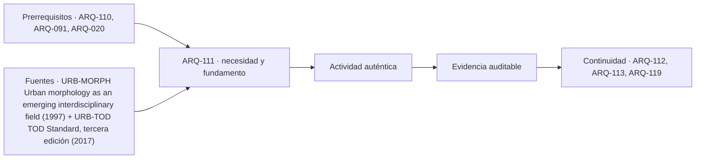

# ARQ-111 · Tejido urbano: trama, parcela, manzana y calle

**Parte 12 · Clase desarrollada · Incorporada en v0.9.0.**

Prerrequisitos conceptuales: ARQ-110, ARQ-091, ARQ-020. Sin calendario. Los casos numéricos y el barrio Quebrada Clara son ficticios; no describen obras ni poblaciones reales. Material de estudio con revisión externa especializada pendiente.

## Pregunta central

¿Qué cambia cuando dejamos de mirar un edificio aislado y empezamos a leer las relaciones entre calles, parcelas, manzanas y espacios abiertos?

## Resultado y conexión con lo anterior

ARQ-110 reunió antecedentes para estudiar la aptitud de un sitio. Ahora ampliamos la escala: un terreno puede admitir una forma y, sin embargo, relacionarse de manera problemática con la red que lo rodea. Aprenderás a representar esa red sin confundir límites de propiedad, bordes construidos y recorridos. Entregarás tres planos analíticos y una explicación de una transformación de manzana. No necesitas programas SIG: papel cuadriculado y una calculadora permiten reconstruir el caso.

## 1. Cuatro piezas que no deben dibujarse como una sola

La **parcela** es la unidad de suelo que distinguimos mediante un límite en un registro determinado. Su identificación física o cartográfica no demuestra por sí sola titularidad, como se estudió en ARQ-101. El **edificio** ocupa una parte de esa unidad y puede relacionarse con varias parcelas. La **manzana** agrupa suelo delimitado por vías u otros bordes que deben declararse. Una **calle** es simultáneamente espacio de desplazamiento, frente de acceso y lugar por el que pueden pasar redes. Su línea de eje no representa todo ese espesor.

La **trama** describe relaciones entre vías, conexiones y bordes; el **tejido** incorpora además parcelación, ocupación, espacios libres y transformaciones. Son definiciones operativas para analizar este bloque, no categorías legales universales. Si en un dibujo todo aparece como polígonos grises, desaparece la diferencia entre una bodega dentro de un predio y un cierre que interrumpe una conexión pública.

Moudon propone estudiar los componentes urbanos en sus relaciones y transformaciones temporales, no como objetos inmóviles [[URB-MORPH]](#FUENTE-URB-MORPH). Adoptamos esa mirada mediante tres documentos propios: plano de límites, plano de ocupación y plano de acceso. Compararlos permite formular preguntas que ninguno responde por separado.

## 2. Frente, fondo y espesor de una relación

El frente de una parcela puede tener puertas, vitrinas, cercos, desniveles o instalaciones. Dos parcelas con el mismo frente de diez metros no ofrecen necesariamente igual relación con la calle. Una abre directamente; otra tiene un cierre continuo y un único portón. No deduzcas intensidad de actividad contando solo metros de fachada.

El fondo organiza distancias y posibilidades internas. Un predio largo puede albergar un patio, un taller posterior o una secuencia de construcciones. Dibujarlo como una superficie uniforme oculta qué partes reciben acceso y cuáles dependen de pasar por otras. La subdivisión de una parcela no crea automáticamente accesos independientes ni convierte una senda existente en vía pública.

La sección complementa la planta. Una calle y un patio pueden parecer contiguos y estar separados por tres metros de altura. Una continuidad visual no equivale a continuidad del recorrido. A esta escala se conserva la distinción entre proximidad, visibilidad y acceso introducida en ARQ-091.

## 3. Presentación de una base común para veinte clases

Usaremos el **Barrio Quebrada Clara**, enteramente ficticio y sin localización municipal. Su base QC-BASE-01 comprende 120.000 m², equivalentes a 12 hectáreas. La dimensión conceptual de 300 por 400 metros sirve para dibujar el contorno; no es un levantamiento. Hay 240 viviendas y 720 residentes sintéticos. No se ha supuesto que toda vivienda tenga siempre tres ocupantes.

El suelo se distribuye sin superposición: 66.000 m² residenciales, 24.000 m² de circulación, 18.000 m² de parque y 12.000 m² de equipamientos. La suma vuelve a 120.000. Las superficies construidas por piso pertenecen a otro registro y aparecerán en ARQ-112. No las sumes al suelo como si ocuparan sectores adicionales.

La base permanece fija. Los ejercicios de manzana de esta clase son subcasos geométricos identificados como QC-M1; no cambian silenciosamente la superficie del barrio. Cuando más adelante se estudie una ampliación, se llamará variante y se distinguirán sus datos. El archivo `examples/urban-landscape/barrio-base.json` conserva estas convenciones.

## 4. Caso trabajado: abrir una conexión no es solo dibujar una línea

En QC-M1 se estudia una manzana rectangular de 120 por 80 metros, con área de 9.600 m². Un punto A está en el centro del borde sur y B en el centro del borde norte. Solo hay circulación por el perímetro. Para ir de A a B por el oeste se recorren 60 + 80 + 60 = 200 metros. El recorrido oriental mide lo mismo.

La distancia recta entre ambos puntos es 80 metros. El cociente de recorrido es 200 / 80 = 2,5. Ese valor describe este par de puntos bajo la red disponible, no la caminabilidad completa de la manzana. Si A estuviera en una esquina y B en la esquina contigua, el resultado sería diferente.

Ahora se dibuja un paso central continuo, de seis metros de ancho, entre A y B. Su área es 6 × 80 = 480 m². En el esquema ideal reduce el trayecto a 80 metros: una disminución de 120 metros, equivalente al 60 % del recorrido previo. El área remanente de la manzana es 9.600 − 480 = 9.120 m². Hemos ganado conexión a costa de modificar la distribución del suelo, no mediante una línea sin espesor.

*Figura 111. Subcaso QC-M1: las medidas son ficticias. El paso no representa una servidumbre adquirida ni una obra autorizada.*

## 5. Lo que ocurre a los frentes

Antes del paso, el perímetro exterior mide 2 × (120 + 80) = 400 metros. Al abrir la franja, dos segmentos exteriores de seis metros se convierten en bocas de acceso y se agregan dos bordes interiores de 80 metros. La longitud de contacto entre suelo remanente y espacios de circulación resulta 400 − 12 + 160 = 548 metros, bajo esta definición geométrica.

El aumento es 148 metros, no 160: contar íntegros los bordes exteriores además de las bocas duplicaría relaciones que dejaron de existir. Tampoco son 548 metros de comercio. El indicador contabiliza contacto, no puertas, actividad, titularidad ni iluminación.

Para proyectar habría que distinguir los dos nuevos frentes: pueden ser medianeras sin aberturas, jardines o accesos reformulados. Un paso entre muros ciegos puede resolver un desplazamiento y dejar otras preguntas abiertas. El modelo no decide si debe construirse; muestra qué consecuencias deben estudiarse cuando se propone.

## 6. Construir una lectura temporal

Dibuja tres estados: antes del paso, intervención propuesta y funcionamiento posible. En el primero conserva límites y accesos existentes del ejercicio. En el segundo marca lo que se retira, mantiene o incorpora. En el tercero describe quién podría abrir, limpiar, iluminar y supervisar el recorrido, sin atribuir esas obligaciones a un organismo real.

Un error habitual consiste en mostrar únicamente el tercer dibujo. Parece que la conexión siempre hubiese existido y desaparecen las operaciones necesarias para conseguirla. El análisis temporal obliga a reconocer cambios prediales, adaptación de fachadas y continuidad durante la obra. Son preguntas para distintas especialidades, no detalles que pueda resolver una imagen.

La comparación tampoco debe asumir que todo paso permanecerá abierto. Si funciona con un acceso controlado, representa una red para cada estado. Un camino cerrado durante cierta actividad no puede seguir contabilizándose como conexión disponible para esa actividad. El tiempo entra en el plano mediante condiciones de uso.

## 7. Dibujar a una escala que permita discutir

A escala 1:1.000, la manzana ocupa 120 por 80 milímetros y el paso tiene seis milímetros. Es posible reconocer su espesor, pero no resolver encuentros constructivos. A 1:500 se duplican todas las longitudes en papel; no se duplica el área real. Añade escala gráfica porque un archivo puede imprimirse reducido.

Usa un tipo de línea para límites del subcaso, otro para ocupación y otro para recorrido. Una flecha no es un ancho disponible. Rotula las dimensiones dadas y separa las inferidas. Para una parcela desconocida, escribe “límite por comprobar” en lugar de completar la trama imaginando que todos los lotes son iguales.

La continuidad de redes y la relación con recorridos peatonales forman parte del enfoque TOD de ITDP [[URB-TOD]](#FUENTE-URB-TOD). Aquí no empleamos su sistema de evaluación ni sus umbrales. Aprendemos a distinguir una propuesta de conexión de la evidencia necesaria para atribuirle prestaciones.

## 8. Del cálculo a una crítica arquitectónica

Una crítica defendible del subcaso podría decir: “El paso reduce la distancia A–B en el modelo y modifica 480 m² de suelo. La organización requiere estudiar nuevos frentes y acceso operativo”. Cada frase conserva su alcance. No dice que aumentará inevitablemente la seguridad, el comercio o la integración social.

Una segunda persona podría señalar que el paso coincide con un patio usado para trabajo. Esa información no invalida la aritmética, pero cambia el problema de diseño. Habría que representar actividad, continuidad y alternativas de trazado. El cálculo inicial es una pieza de la discusión, no una forma de cerrar otras evidencias.

El producto arquitectónico reúne por eso una planta de relaciones y un argumento. No basta escribir “más conectado”; explica para qué trayectos, bajo qué accesos, con qué transformación de bordes y con qué datos pendientes. La siguiente clase agregará cantidades de viviendas y actividad a esta estructura espacial.

## Práctica independiente

Estudia una segunda manzana, QC-M2, de 100 por 60 metros. Los puntos de partida y llegada están en los centros de sus lados largos opuestos. No hay paso interior. Se propone una franja central de cuatro metros de ancho entre ellos.

Calcula recorrido previo, recorrido posterior, disminución porcentual, suelo ocupado por la franja y área remanente. Después calcula el contacto del suelo remanente con la circulación usando la misma convención del ejemplo. Dibuja límites, ocupación ficticia y recorrido en tres láminas separadas. Inventa una condición operativa explícita —por ejemplo, cierre durante una actividad— y muestra qué cambia en la red, sin cambiar las dimensiones.

Finalmente responde a esta afirmación: “La manzana tiene más frente, por tanto habrá más locales abiertos”. Formula una pregunta y una evidencia para comprobarla. No se requiere visitar un sitio ni registrar personas.

Solución razonada

El recorrido perimetral mide 50 + 60 + 50 = 160 metros; el directo, 60. La reducción es 100 / 160 = 62,5 %. La franja ocupa 4 × 60 = 240 m² y quedan 6.000 − 240 = 5.760 m². El cociente previo es 160 / 60 = 2,667 aproximadamente.

El contacto inicial es 320 metros. Se restan ocho metros correspondientes a ambas bocas y se agregan 120 de bordes interiores: 432 metros. No se multiplica ese valor por una supuesta cantidad universal de locales por metro. Harían falta, entre otros antecedentes, accesos posibles, programas, permisos, demanda y decisiones de sus responsables.

En el estado cerrado vuelve a utilizarse el perímetro para A–B, salvo que la consigna haya definido otra conexión. Es incorrecto conservar los 60 metros por comodidad. Los tres planos muestran el mismo subcaso, pero cada uno responde una pregunta diferente: dónde están los límites, qué ocupa el suelo y por dónde puede pasarse.

## Autoevaluación y transferencia

La clase está comprendida cuando puedes explicar por qué el aumento de contacto no coincide con la longitud de nuevos bordes, por qué una franja consume superficie y por qué una conexión depende de su estado operativo. Revisa cualquier respuesta que mezcle suelo, pisos y recorridos en una única suma.

Guarda QC-BASE-01 sin modificar y archiva QC-M1 y QC-M2 como ejercicios separados. ARQ-112 utilizará la base común para medir densidad e intensidad; esa medición necesita primero saber qué territorio y qué unidades se están contando.

<!-- pedagogia-2026:inicio -->
## Decisión pedagógica y posición curricular

### Por qué existe

Esta clase existe para resolver una necesidad concreta del recorrido: ¿Qué cambia cuando dejamos de mirar un edificio aislado y empezamos a leer las relaciones entre calles, parcelas, manzanas y espacios abiertos?

### Por qué está exactamente aquí

Abre la Parte 12 porque plantea primero el problema «¿Qué cambia cuando dejamos de mirar un edificio aislado y empezamos a leer las relaciones entre calles, parcelas, manzanas y espacios abiertos?». La transición desde ARQ-110 · Síntesis de aptitud y restricciones del sitio conserva métodos de evidencia y límites, pero no traslada parámetros del bloque anterior. Establece la pregunta y el producto base que ARQ-112 · Densidad, intensidad y mezcla de usos desarrollará a continuación.

- **Prerrequisitos:** `ARQ-110`, `ARQ-091`, `ARQ-020`
- **Capacidad que introduce:** ARQ-110 reunió antecedentes para estudiar la aptitud de un sitio. Ahora ampliamos la escala: un terreno puede admitir una forma y, sin embargo, relacionarse de manera problemática con la red que lo rodea. Aprenderás a representar esa red sin confundir límites de propiedad, bordes construidos y recorridos.
- **Clases o experiencias que dependen de ella:** `ARQ-112`, `ARQ-113`, `ARQ-119`

El diagrama permite comprobar una relación que el texto lineal oculta con facilidad: esta clase recibe capacidades previas, toma decisiones apoyadas por fuentes, exige una experiencia y produce evidencia que habilita trabajo posterior. No representa un procedimiento de obra.

## Resultado observable, evidencia y evaluación

1. Identificar y delimitar las condiciones necesarias para responder la pregunta central de tejido urbano: trama, parcela, manzana y calle.
2. Producir y comprobar la evidencia declarada por la clase: ARQ-110 reunió antecedentes para estudiar la aptitud de un sitio. Ahora ampliamos la escala: un terreno puede admitir una forma y, sin embargo, relacionarse de manera problemática con la red que lo rodea. Aprenderás a representar esa red sin confundir límites de propiedad, bordes construidos y recorridos.
3. Justificar una decisión de tejido urbano: trama, parcela, manzana y calle mediante fuentes, supuestos, alternativas y límites explícitos.

## Actividad, evidencia y criterio de aceptación

**Actividad:** Estudia una segunda manzana, QC-M2, de 100 por 60 metros. Los puntos de partida y llegada están en los centros de sus lados largos opuestos. No hay paso interior.

**Evidencia mínima:** ARQ-110 reunió antecedentes para estudiar la aptitud de un sitio. Ahora ampliamos la escala: un terreno puede admitir una forma y, sin embargo, relacionarse de manera problemática con la red que lo rodea. Aprenderás a representar esa red sin confundir límites de propiedad, bordes construidos y recorridos.

**Archivo sugerido:** `evidence/ARQ-111/evidencia.md`.

**Criterio de aceptación:** la entrega se acepta cuando:

- La entrega responde explícitamente a la pregunta: ¿Qué cambia cuando dejamos de mirar un edificio aislado y empezamos a leer las relaciones entre calles, parcelas, manzanas y espacios abiertos?
- La actividad conserva las fronteras del caso y permite reconstruir el procedimiento: Estudia una segunda manzana, QC-M2, de 100 por 60 metros. Los puntos de partida y llegada están en los centros de sus lados largos opuestos. No hay paso interior.
- Cada afirmación externa puede seguirse hasta una fuente, su alcance consultado y su límite.
- La evidencia deja disponible una entrada comprobable para ARQ-112.
- La clase está comprendida cuando puedes explicar por qué el aumento de contacto no coincide con la longitud de nuevos bordes, por qué una franja consume superficie y por qué una conexión depende de su estado operativo. Revisa cualquier respuesta que mezcle suelo, pisos y recorridos en una única suma.

La [rúbrica común](../../docs/RUBRICA_COMUN.md) complementa estos criterios; no los reemplaza. Una entrega puede superar un promedio y continuar pendiente si oculta una condición crítica.

## Trazabilidad de las decisiones

| # | Decisión o fundamento | Fuente utilizada | Aplicación y límite en esta clase |
|---:|---|---|---|
| 1 | Lectura relacional y temporal de forma urbana. | [URB-MORPH Urban morphology as an emerging interdisciplinary field (1997)](https://pdfs.semanticscholar.org/e417/c7aa02616277bcef7930d7e100f84f69aad3.pdf) | Consulta: Artículo original; introducción y marco sobre relaciones y transformación de elementos urbanos. Copia académica alojada por Semantic Scholar. Límite: No se presenta una síntesis exhaustiva de las escuelas; ejemplos geométricos propios. |
| 2 | Relación entre caminar, conectar, transporte, mezcla y densidad. | [URB-TOD TOD Standard, tercera edición (2017)](https://itdp.org/publication/tod-standard/) | Consulta: Presentación institucional y principios; no lectura íntegra del manual descargable. Límite: No se aplican puntuaciones del estándar ni se afirma obligatoriedad en Chile. |

La tabla permite auditar las relaciones; la explicación, el caso y la práctica de la clase siguen siendo la documentación principal.

## Autoevaluación, recuperación y continuidad

### Errores diagnósticos

Antes de avanzar, comprueba si puedes reconstruir cada resultado sin mirar la solución, señalar qué evidencia lo sostiene y nombrar una condición que obligaría a revisar tu decisión. Conserva la primera versión, la objeción recibida y la revisión.

**Conexión siguiente:** La continuidad inmediata es ARQ-112 · Densidad, intensidad y mezcla de usos; conserva el método y vuelve a verificar datos y límites.
<!-- pedagogia-2026:fin -->

## Fuentes y alcance de uso

Los ejemplos, dibujos, problemas y soluciones son elaboraciones originales. Las fuentes respaldan los conceptos indicados, no los valores ficticios. Consulta de fuentes nuevas: 21 de septiembre de 2026.

### [[URB-MORPH]](#FUENTE-URB-MORPH) Urban morphology as an emerging interdisciplinary field (1997)

Anne Vernez Moudon / Urban Morphology, 1(1), 3–10. [https://pdfs.semanticscholar.org/e417/c7aa02616277bcef7930d7e100f84f69aad3.pdf](https://pdfs.semanticscholar.org/e417/c7aa02616277bcef7930d7e100f84f69aad3.pdf)

**Consulta:** Artículo original; introducción y marco sobre relaciones y transformación de elementos urbanos. Copia académica alojada por Semantic Scholar. **Apoyo:** Lectura relacional y temporal de forma urbana. **Límite:** No se presenta una síntesis exhaustiva de las escuelas; ejemplos geométricos propios.

### [[URB-TOD]](#FUENTE-URB-TOD) TOD Standard, tercera edición (2017)

Institute for Transportation and Development Policy. [https://itdp.org/publication/tod-standard/](https://itdp.org/publication/tod-standard/)

**Consulta:** Presentación institucional y principios; no lectura íntegra del manual descargable. **Apoyo:** Relación entre caminar, conectar, transporte, mezcla y densidad. **Límite:** No se aplican puntuaciones del estándar ni se afirma obligatoriedad en Chile.
