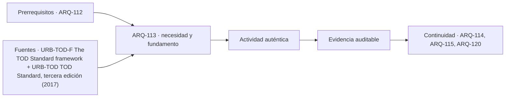

# ARQ-113 · Movilidad, caminabilidad y transporte público

**Parte 12 · Clase desarrollada · Incorporada en v0.9.0.**

Prerrequisitos conceptuales: ARQ-112. Sin calendario. Los casos numéricos y el barrio Quebrada Clara son ficticios; no describen obras ni poblaciones reales. Material de estudio con revisión externa especializada pendiente.

## Pregunta central

¿Por qué dos destinos a la misma distancia pueden exigir experiencias de viaje muy diferentes?

## Resultado y continuidad

La clase anterior contó viviendas y actividades. Esta estudia cómo se conectan. Construirás una cadena de viaje, distinguirás distancia, tiempo y posibilidad efectiva de acceso, y analizarás regularidad del transporte con datos ficticios. La entrega combina un plano de recorridos, una sección de calle y una tabla de tiempos. Retoma las diferencias entre proximidad y acceso de ARQ-091 y los estados operativos de ARQ-111.

## 1. Movilidad no es lo mismo que accesibilidad

Llamaremos movilidad al desplazamiento de personas y accesibilidad a la posibilidad de alcanzar actividades bajo condiciones declaradas. Viajar más lejos o más rápido no significa necesariamente acceder a más de lo que se necesita. Un servicio próximo puede reducir desplazamientos; otro físicamente cercano puede quedar separado por un obstáculo o funcionar cuando no se dispone de acceso.

La caminabilidad no se deduce de la existencia de una línea peatonal en el mapa. Requiere estudiar continuidad, cruces, superficie, pendiente, orientación, exposición ambiental y lugares de descanso según las personas y tareas. Esta enumeración organiza preguntas de proyecto; no sustituye los requisitos de accesibilidad que deban comprobarse profesionalmente.

ITDP relaciona redes peatonales, conexiones y transporte dentro del mismo marco de desarrollo orientado al transporte [[URB-TOD-F]](#FUENTE-URB-TOD-F). Aquí utilizamos esa relación para descomponer viajes, sin asumir que una distancia fija defina acceso adecuado para todas las personas.

## 2. Construir la cadena completa

Una cadena puede incluir salir de la vivienda, llegar al paradero, esperar, subir, desplazarse, cambiar de servicio, bajar y llegar a la actividad. Si el estudio cuenta solo el tiempo dentro del vehículo, omite partes que pueden cambiar decisivamente la experiencia. También debe considerar el retorno y la posibilidad de realizar el viaje acompañado o con objetos.

La cadena se representa mediante tramos y transiciones. Un tramo de 300 metros tiene longitud; una transición puede implicar espera, un desnivel o un procedimiento de acceso. No conviene sumar todos los obstáculos como “metros equivalentes” sin explicar un modelo de valoración. Primero registra magnitudes observables en sus unidades originales.

Puede haber una condición que interrumpa toda la cadena. Un ascensor fuera de servicio, un acceso cerrado o un cruce no practicable para una tarea no se compensan aritméticamente con un vehículo más rápido. Mantén estados de disponibilidad junto a los tiempos, en lugar de ocultarlos en un promedio.

## 3. Caso trabajado: tiempo de puerta a actividad

En QC-T1 se ofrece una ruta ficticia. El primer tramo a pie mide 480 metros, seguido por un cruce con demora dada de 40 segundos. El vehículo tarda 12 minutos. Desde la parada final a la actividad hay otros 300 metros. Para el ejemplo se adopta una velocidad constante de un metro por segundo y una espera de cinco minutos.

Los tiempos de marcha son ocho y cinco minutos. El total es 8 + 40/60 + 5 + 12 + 5 = 30,67 minutos, aproximadamente. El trayecto en vehículo representa solo 12 de esos 30,67. No hemos incluido una transferencia ni variabilidad porque no se entregaron datos sobre ellas.

La velocidad es un supuesto del caso, no una característica atribuida a un grupo de personas. Si una segunda condición de recorrido utiliza 0,8 m/s, los 780 metros requieren 16,25 minutos en vez de 13. El total pasa a 33,92 minutos. Lo importante es mostrar la dependencia del resultado, no etiquetar usuarios mediante una velocidad única.

*Figura 113. QC-T1: tiempos sintéticos. No corresponden a un servicio, tarifa ni frecuencia real.*

## 4. La espera media depende de cómo llega el servicio

Supón que los vehículos llegan exactamente cada diez minutos, que los pasajeros llegan en instantes uniformemente distribuidos y que siempre pueden abordar el siguiente. La espera varía entre cero y diez y su media es cinco. La regla “la mitad del intervalo” depende de esas condiciones; no es una ley para cualquier servicio.

Podemos derivarla sin estadística avanzada. Para un intervalo de duración h, una persona que llega al comienzo espera h y otra que llega al final espera cero. El área bajo la recta de espera forma un triángulo de base h y altura h: h²/2. Dividir por la duración h da h/2. Las unidades pasan de minutos cuadrados a minutos.

Si las llegadas de personas se concentran antes de una partida conocida, la distribución ya no es uniforme. Si un vehículo llega completo, la espera puede incluir otro intervalo. En ambos casos hay que cambiar el modelo, no conservar la fórmula porque resulte sencilla.

## 5. Igual intervalo promedio, distinta espera

Ahora el servicio alterna intervalos de dos y dieciocho minutos. El promedio entre vehículos sigue siendo diez, pero quienes llegan al azar tienen más probabilidad de hacerlo durante el intervalo largo. Para un ciclo de veinte minutos, sumamos las áreas de ambos triángulos y dividimos por veinte:

`Espera media = (2² + 18²) / [2 × (2 + 18)] = 8,2 minutos`.

Usar la mitad del promedio daría cinco y subestimaría la espera en 3,2 minutos dentro de este modelo. Con esa espera, QC-T1 tarda 33,87 minutos a la velocidad inicial. La irregularidad modifica el viaje aunque la media de los intervalos siga siendo diez.

El caso no prueba qué medidas operativas debería adoptar una ciudad. Enseña qué registros pedir: instantes de llegada, posibilidad de abordar, períodos observados y condiciones de quienes viajan. Un promedio publicado sin dispersión puede no bastar para describir la espera.

## 6. Una calle se discute en planta y en sección

Imagina una franja de calle de 18 metros de ancho en un subcaso, no como norma. En una distribución exploratoria, ocho metros se asignan a circulación de vehículos, cuatro a dos franjas laterales de dos metros, cuatro a dos espacios de desplazamiento peatonal y dos a una banda que debe definirse. La suma cierra, pero todavía no hay diseño resuelto.

La banda de dos metros podría plantearse como arbolado, espera u otra función; no puede contabilizarse íntegramente para todas si se interfieren. En las esquinas hay radios, cruces, visibilidad y encuentros. Una sección a mitad de cuadra no demuestra que esas transiciones funcionen.

Dibuja además las entradas de edificios y las trayectorias de carga, bicicletas y peatones que el ejercicio decida estudiar. El conflicto surge donde trayectorias y actividades coinciden, no solo donde faltan metros. Resolverlo exige geometría, operación y comprobaciones, no colorear cada modo con un tono distinto.

## 7. Redes con distintos estados

El paso de ARQ-111 puede reducir un recorrido mientras está abierto. Debe aparecer como arista disponible únicamente en ese estado. Un mapa de viaje nocturno o de otra condición no hereda automáticamente todos los enlaces del mapa inicial. La red es una representación condicionada, no una verdad permanente.

En Quebrada Clara conviene conservar tres registros relacionados: geometría, condiciones de uso y evidencia. Una arista puede tener longitud conocida y disponibilidad sin verificar. El programa no debería reemplazar “sin verificar” por “abierta” para terminar el cálculo. Puede ofrecer un resultado condicionado y señalar qué medición o documento lo cerraría.

Un plano legible distingue rutas comprobadas en el ejercicio, rutas propuestas y conexiones externas no modeladas. El límite de las 12 hectáreas no es un muro: quienes viajan pueden salir de él. Si la investigación termina allí, declara que no se está evaluando la cadena completa.

## 8. Comparar experiencias sin reducirlas a una cifra

Dos rutas de treinta minutos pueden diferir en número de cambios, exposición al sol, esfuerzo o incertidumbre. Conserva esas dimensiones en una tabla descriptiva y permite discutirlas por separado. Convertirlas en una única puntuación exige justificar valores que no se deducen del plano.

Para una tarea de acompañamiento, una espera con asiento puede importar de modo distinto que para un traslado de objetos. No asignes esa preferencia automáticamente por edad, género o diagnóstico. Formula escenarios de actividad y comprueba con las personas pertinentes cuando se trate de un proyecto real, con las precauciones de investigación ya estudiadas.

El producto arquitectónico puede ser una modificación de acceso o una zona de espera, no necesariamente una nueva vía. Debe indicar el mecanismo esperado: reducir distancia de transferencia, proteger una permanencia o eliminar una discontinuidad identificada. La comprobación debe medir esa misma relación.

## Práctica independiente

QC-T2 tiene 360 metros iniciales y 240 finales, velocidad dada de un metro por segundo, dos minutos acumulados de cruces, quince dentro del vehículo y un servicio perfectamente regular cada ocho minutos. Calcula el tiempo esperado completo con llegadas uniformes y abordaje asegurado.

Después el servicio alterna intervalos de cuatro y doce minutos. Deriva la nueva espera a partir de los triángulos y recalcula el viaje. Finalmente se informa que el camino final permanece cerrado: explica por qué no puedes resolver esa condición aumentando arbitrariamente la espera.

Dibuja una sección de calle ficticia con un ancho total elegido por ti. Distingue tres actividades y un punto donde sus trayectorias se crucen. Identifica el dato geométrico y el dato operativo que necesitarías para estudiar ese encuentro. No presentes tu sección como solución reglamentaria.

Solución razonada

La marcha suma diez minutos. Con intervalos regulares de ocho, la espera es cuatro; el total esperado es 10 + 2 + 15 + 4 = 31 minutos. Con intervalos cuatro y doce, la espera resulta (16 + 144) / 32 = cinco minutos y el total, 32.

El cierre del camino afecta disponibilidad. Hace falta otra ruta y su longitud, o cambiar el escenario de acceso. Una demora inventada no reconstruye una conexión inexistente. La respuesta correcta puede ser “no hay trayecto completo en la red entregada”, sin concluir que nunca exista uno fuera de ella.

La sección debe cerrar su suma de anchos, pero esa comprobación no basta: sus actividades necesitan continuidad hacia los accesos y cruces. Si una banda se usa simultáneamente para espera y circulación, identifica esa superposición en vez de contar dos veces el mismo ancho disponible.

## Autoevaluación y transferencia

Puedes avanzar cuando reconstruyes la espera irregular sin confundir promedio de intervalos con promedio experimentado, mantienes unidades y distingues falta de información de ruta imposible. Guarda la cadena de viaje junto a la red y sus condiciones.

ARQ-114 estudiará lo que sucede cuando las personas llegan y permanecen. Acceder a una plaza no explica todavía cómo se distribuyen descanso, juego, encuentro, paso y cuidado dentro de ella.

<!-- pedagogia-2026:inicio -->
## Decisión pedagógica y posición curricular

### Por qué existe

Esta clase existe para resolver una necesidad concreta del recorrido: ¿Por qué dos destinos a la misma distancia pueden exigir experiencias de viaje muy diferentes?

### Por qué está exactamente aquí

Ocupa el lugar 3 de la Parte 12. Se estudia después de ARQ-112 · Densidad, intensidad y mezcla de usos porque usa esa base para responder «¿Por qué dos destinos a la misma distancia pueden exigir experiencias de viaje muy diferentes?». Se ubica antes de ARQ-114 · Espacio público, permanencia y apropiación porque la evidencia producida aquí debe estar disponible para ese paso.

- **Prerrequisitos:** `ARQ-112`
- **Capacidad que introduce:** La clase anterior contó viviendas y actividades. Esta estudia cómo se conectan. Construirás una cadena de viaje, distinguirás distancia, tiempo y posibilidad efectiva de acceso, y analizarás regularidad del transporte con datos ficticios.
- **Clases o experiencias que dependen de ella:** `ARQ-114`, `ARQ-115`, `ARQ-120`

El diagrama permite comprobar una relación que el texto lineal oculta con facilidad: esta clase recibe capacidades previas, toma decisiones apoyadas por fuentes, exige una experiencia y produce evidencia que habilita trabajo posterior. No representa un procedimiento de obra.

## Resultado observable, evidencia y evaluación

1. Identificar y delimitar las condiciones necesarias para responder la pregunta central de movilidad, caminabilidad y transporte público.
2. Producir y comprobar la evidencia declarada por la clase: La clase anterior contó viviendas y actividades. Esta estudia cómo se conectan. Construirás una cadena de viaje, distinguirás distancia, tiempo y posibilidad efectiva de acceso, y analizarás regularidad del transporte con datos ficticios.
3. Justificar una decisión de movilidad, caminabilidad y transporte público mediante fuentes, supuestos, alternativas y límites explícitos.

## Actividad, evidencia y criterio de aceptación

**Actividad:** QC-T2 tiene 360 metros iniciales y 240 finales, velocidad dada de un metro por segundo, dos minutos acumulados de cruces, quince dentro del vehículo y un servicio perfectamente regular cada ocho minutos. Calcula el tiempo esperado completo con llegadas uniformes y abordaje asegurado. Después el servicio alterna intervalos de cuatro y doce minutos.

**Evidencia mínima:** La clase anterior contó viviendas y actividades. Esta estudia cómo se conectan. Construirás una cadena de viaje, distinguirás distancia, tiempo y posibilidad efectiva de acceso, y analizarás regularidad del transporte con datos ficticios.

**Archivo sugerido:** `evidence/ARQ-113/evidencia.md`.

**Criterio de aceptación:** la entrega se acepta cuando:

- La entrega responde explícitamente a la pregunta: ¿Por qué dos destinos a la misma distancia pueden exigir experiencias de viaje muy diferentes?
- La actividad conserva las fronteras del caso y permite reconstruir el procedimiento: QC-T2 tiene 360 metros iniciales y 240 finales, velocidad dada de un metro por segundo, dos minutos acumulados de cruces, quince dentro del vehículo y un servicio perfectamente regular cada ocho minutos. Calcula el tiempo esperado completo con llegadas uniformes y abordaje asegurado. Después el servicio alterna intervalos de cuatro y doce minutos.
- Cada afirmación externa puede seguirse hasta una fuente, su alcance consultado y su límite.
- La evidencia deja disponible una entrada comprobable para ARQ-114.
- Puedes avanzar cuando reconstruyes la espera irregular sin confundir promedio de intervalos con promedio experimentado, mantienes unidades y distingues falta de información de ruta imposible. Guarda la cadena de viaje junto a la red y sus condiciones.

La [rúbrica común](../../docs/RUBRICA_COMUN.md) complementa estos criterios; no los reemplaza. Una entrega puede superar un promedio y continuar pendiente si oculta una condición crítica.

## Trazabilidad de las decisiones

| # | Decisión o fundamento | Fuente utilizada | Aplicación y límite en esta clase |
|---:|---|---|---|
| 1 | Accesibilidad y conexión en lugar de analizar solo edificios aislados. | [URB-TOD-F The TOD Standard framework](https://tod.itdp.org/tod-standard/tod-standard-framework.html) | Consulta: Página oficial del marco y sus principios. Límite: Los umbrales de los ejercicios son convenciones ficticias, no certificación TOD. |
| 2 | Relación entre caminar, conectar, transporte, mezcla y densidad. | [URB-TOD TOD Standard, tercera edición (2017)](https://itdp.org/publication/tod-standard/) | Consulta: Presentación institucional y principios; no lectura íntegra del manual descargable. Límite: No se aplican puntuaciones del estándar ni se afirma obligatoriedad en Chile. |

La tabla permite auditar las relaciones; la explicación, el caso y la práctica de la clase siguen siendo la documentación principal.

## Autoevaluación, recuperación y continuidad

### Errores diagnósticos

Antes de avanzar, comprueba si puedes reconstruir cada resultado sin mirar la solución, señalar qué evidencia lo sostiene y nombrar una condición que obligaría a revisar tu decisión. Conserva la primera versión, la objeción recibida y la revisión.

**Conexión siguiente:** La continuidad inmediata es ARQ-114 · Espacio público, permanencia y apropiación; conserva el método y vuelve a verificar datos y límites.
<!-- pedagogia-2026:fin -->

## Fuentes y alcance de uso

Los ejemplos, dibujos, problemas y soluciones son elaboraciones originales. Las fuentes respaldan los conceptos indicados, no los valores ficticios. Consulta de fuentes nuevas: 21 de septiembre de 2026.

### [[URB-TOD-F]](#FUENTE-URB-TOD-F) The TOD Standard framework

Institute for Transportation and Development Policy. [https://tod.itdp.org/tod-standard/tod-standard-framework.html](https://tod.itdp.org/tod-standard/tod-standard-framework.html)

**Consulta:** Página oficial del marco y sus principios. **Apoyo:** Accesibilidad y conexión en lugar de analizar solo edificios aislados. **Límite:** Los umbrales de los ejercicios son convenciones ficticias, no certificación TOD.

### [[URB-TOD]](#FUENTE-URB-TOD) TOD Standard, tercera edición (2017)

Institute for Transportation and Development Policy. [https://itdp.org/publication/tod-standard/](https://itdp.org/publication/tod-standard/)

**Consulta:** Presentación institucional y principios; no lectura íntegra del manual descargable. **Apoyo:** Relación entre caminar, conectar, transporte, mezcla y densidad. **Límite:** No se aplican puntuaciones del estándar ni se afirma obligatoriedad en Chile.
