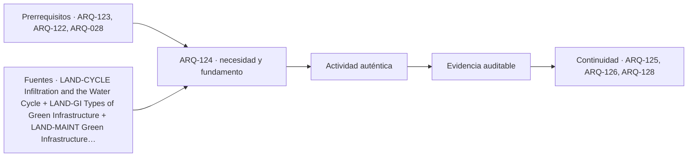

# ARQ-124 · Agua, cuencas y drenaje urbano sostenible

**Parte 13 · Clase desarrollada · Incorporada en v0.9.0.**

Prerrequisitos conceptuales: ARQ-123, ARQ-122, ARQ-028. Sin calendario. Los casos numéricos y el barrio Quebrada Clara son ficticios; no describen obras ni poblaciones reales. Material de estudio con revisión externa especializada pendiente.

## Pregunta central

¿Por qué dos lluvias con el mismo volumen acumulado pueden exigir respuestas distintas de un sistema de almacenamiento y descarga?

## Resultado y continuidad

ARQ-122 distinguió entrada al suelo y excedente; ARQ-123 relacionó vegetación con condiciones del sitio. Ahora construirás un balance temporal de agua para un subcaso del parque. Calcularás aportes, almacenamiento, descarga y rebalse, conservando unidades y condiciones. No dimensionarás una obra ejecutable ni certificarás riesgo de inundación. La secuencia prepara ARQ-126, donde varios dispositivos se conectarán entre sí.

## 1. Empezar por la cuenca, no por el recipiente

Una cuenca aportante delimita el territorio cuya agua llega al punto estudiado bajo ciertas condiciones. No coincide necesariamente con el límite del predio. El relieve, las superficies y las conexiones construidas pueden modificar recorridos. Antes de dibujar un depósito hay que establecer de dónde llega el agua y hacia dónde puede continuar.

El ciclo hidrológico incluye entrada, almacenamiento y circulación [[LAND-CYCLE]](#FUENTE-LAND-CYCLE). Las tipologías de infraestructura verde pueden capturar, filtrar, infiltrar, almacenar o conducir según su configuración [[LAND-GI]](#FUENTE-LAND-GI). No todas realizan todas las funciones ni todas requieren infiltrar al terreno.

Una zona denominada “jardín de lluvia” en un plano no informa capacidad, salida ni mantenimiento. El proyecto debe expresar la función buscada y la evidencia que permitirá comprobarla. Si existen condiciones de suelo o agua desconocidas, la infiltración permanece como hipótesis, no como una salida gratuita del balance.

## 2. Volumen acumulado y caudal

El volumen mide cantidad de agua. El caudal mide volumen por tiempo. Treinta metros cúbicos pueden llegar en tres minutos o en tres horas; la suma es igual, pero las tasas son distintas. No se obtiene un máximo temporal dividiendo por una duración elegida arbitrariamente.

Un balance general para un intervalo es: almacenamiento final = almacenamiento inicial + entradas − salidas. Las salidas pueden incluir descarga controlada, rebalse, infiltración o evapotranspiración, siempre que estén definidas y no se cuenten dos veces. El modelo debe mostrar qué procesos omite y por qué.

En un ejercicio corto podemos omitir ciertas pérdidas para aprender la estructura. Esa simplificación no significa que sean despreciables en toda obra. La escala temporal y la decisión determinan qué procesos deben representarse.

## 3. Primer cálculo: aportes de superficies sin superposición

QC-AGUA-01 tiene una cuenca ficticia de 4.000 m²: 2.000 de cubierta, 1.000 pavimentados y 1.000 de otra superficie. Para una lluvia acumulada de treinta milímetros se entregan fracciones efectivas de aporte de 0,90, 0,80 y 0,25. Son parámetros sintéticos del ejercicio, no coeficientes recomendados para materiales reales.

Los aportes son 2.000×0,030×0,90 = 54 m³; 1.000×0,030×0,80 = 24 m³; y 1.000×0,030×0,25 = 7,5 m³. Llegan 85,5 m³. El área ponderada es 2.850 m² y produce el mismo resultado al multiplicarla por 0,030 metros.

La lluvia total sobre los 4.000 m² es 120 m³. La diferencia de 34,5 m³ queda fuera del aporte modelado. No se declara que toda ella se infiltra: las fracciones agrupan procesos no desagregados. Para estudiar su destino habría que ampliar el modelo.

## 4. Introducir una secuencia temporal explícita

Se entrega una distribución de llegada al depósito en tres intervalos de diez minutos: 25, 40 y 20,5 m³. La suma conserva 85,5. Dentro de cada intervalo el caudal de entrada se supone constante. Hay inicialmente cinco metros cúbicos almacenados, capacidad máxima de treinta y una descarga controlada constante de un metro cúbico por minuto mientras exista agua.

No hay infiltración ni otras salidas en este modelo. La descarga puede evacuar diez metros cúbicos por intervalo y el agua disponible nunca se agota en los casos trabajados. Esa comprobación importa: no podría mantenerse una descarga ficticia después de vaciar el depósito.

Cuando el almacenamiento llega a treinta, el excedente rebalsa. No se elimina del balance ni se considera resuelto su destino. La clase calcula cuánto sale bajo los supuestos; no diseña la conducción posterior.

## 5. Resolver paso a paso

En el primer intervalo, cinco iniciales más 25 de entrada menos diez de descarga dejan veinte. No se alcanza la capacidad y no hay rebalse. En el segundo, veinte más cuarenta menos diez producirían cincuenta; se conservan treinta y rebalsan veinte.

En el tercero, treinta más 20,5 menos diez producirían 40,5; quedan treinta y rebalsan 10,5. La descarga total es treinta, el rebalse 30,5 y el almacenamiento final treinta. El balance global es:

`5 + 85,5 = 30 de almacenamiento + 30 de descarga + 30,5 de rebalse = 90,5 m³`.

<table>
<thead>
<tr>
  <th>Intervalo</th>
  <th style="text-align:right">Entrada</th>
  <th style="text-align:right">Descarga</th>
  <th style="text-align:right">Rebalse</th>
  <th style="text-align:right">Almacenamiento final</th>
</tr>
</thead>
<tbody>
<tr>
  <td>1</td>
  <td style="text-align:right">25,0 m³</td>
  <td style="text-align:right">10,0 m³</td>
  <td style="text-align:right">0,0 m³</td>
  <td style="text-align:right">20,0 m³</td>
</tr>
<tr>
  <td>2</td>
  <td style="text-align:right">40,0 m³</td>
  <td style="text-align:right">10,0 m³</td>
  <td style="text-align:right">20,0 m³</td>
  <td style="text-align:right">30,0 m³</td>
</tr>
<tr>
  <td>3</td>
  <td style="text-align:right">20,5 m³</td>
  <td style="text-align:right">10,0 m³</td>
  <td style="text-align:right">10,5 m³</td>
  <td style="text-align:right">30,0 m³</td>
</tr>
</tbody>
</table>

*Figura 124. QC-AGUA-01: caudales constantes dentro de cada intervalo, descarga dada y capacidad ficticia. No es un estudio de tormenta ni un diseño hidráulico aprobado.*

## 6. Comprobar el comportamiento dentro del intervalo

En el segundo intervalo entran cuatro metros cúbicos por minuto y sale uno por descarga. El almacenamiento aumenta a tres por minuto hasta llenarse. Parte de veinte y necesita diez para alcanzar treinta: se llena después de 10/3 = 3,33 minutos. Durante los 6,67 restantes rebalsan tres por minuto, acumulando veinte metros cúbicos.

Esta comprobación muestra por qué la tabla es coherente con los caudales constantes asumidos. No estamos introduciendo todo el volumen de golpe y permitiendo un almacenamiento físicamente superior a la capacidad antes de vaciarlo. El cambio ocurre continuamente dentro del intervalo definido.

El rebalse instantáneo del modelo después de llenarse es entrada menos descarga. Su máximo en esta secuencia es tres metros cúbicos por minuto. No se presenta como caudal de diseño real: depende de una distribución artificial, sin modelar tránsito por redes ni variabilidad interna de una tormenta.

## 7. Mismo volumen, otro resultado

QC-AGUA-01B concentra los 85,5 m³ en el primer intervalo y entrega cero en los otros dos, manteniendo caudal constante durante ese primer intervalo. El depósito inicia con cinco, descarga diez y solo puede conservar treinta: rebalsan 50,5 m³. Después descarga diez en cada intervalo restante y termina con diez almacenados.

La conservación vuelve a cumplirse: 5 + 85,5 = 10 finales + 30 de descarga + 50,5 de rebalse. Comparada con la primera secuencia, la llegada concentrada produce veinte metros cúbicos más de rebalse y veinte menos de almacenamiento final. El volumen acumulado de lluvia no cambió.

La conclusión no es que siempre deba construirse un recipiente mayor. Antes hay que estudiar distribución temporal, conexiones, destino del excedente, calidad del agua, suelo, operación y escenarios pertinentes. La aritmética enseña qué información importa, no decide una obra por sí sola.

## 8. Capacidad geométrica y capacidad operativa

Treinta metros cúbicos podrían representarse mediante muchas geometrías. No toda su profundidad o superficie estaría necesariamente disponible para almacenamiento útil; pueden existir volúmenes ocupados, cotas de entrada y salida, restricciones de uso y condiciones de mantenimiento. No convertimos el valor del ejercicio en una sección constructiva.

Si un sistema utiliza un medio poroso, su volumen total no equivale íntegramente a agua almacenable. La porosidad de ARQ-122 es relevante, pero aún deben considerarse estado inicial y funcionamiento. Tampoco se debe contar simultáneamente el mismo volumen como almacenamiento superficial y vacío interno sin distinguirlos.

La zona hidráulica de 2.000 m² de QC-PARQUE-01 sigue siendo una reserva. Los treinta metros cúbicos pertenecen a un submodelo de aprendizaje y no acreditan capacidad del parque. Esa separación evita que un ejemplo se convierta accidentalmente en especificación.

## 9. Mantenimiento y condiciones de salida

Las tipologías de infraestructura verde requieren inspección y mantenimiento para conservar funciones [[LAND-MAINT]](#FUENTE-LAND-MAINT). En el modelo, una reducción de descarga o de capacidad disponible cambiaría la tabla. No basta dibujar una salida: debe existir una condición operativa verificable.

El rebalse calculado necesita un destino estudiado. No se considera aceptable por desaparecer de la columna de almacenamiento. El proyecto debe coordinar relaciones aguas abajo y no transferir una dificultad fuera del límite sin documentarla.

La entrega académica incluirá esquema de entradas y salidas, tabla temporal, balance global y lista de procesos omitidos. Esa estructura permitirá conectar varios dispositivos en ARQ-126 sin duplicar agua entre ellos.

## Práctica independiente

QC-AGUA-02 comienza vacío, tiene capacidad de veinte metros cúbicos y descarga 0,5 m³/min mientras haya agua. Recibe 12, 30 y ocho metros cúbicos en tres intervalos de diez minutos, uniformemente dentro de cada uno. Calcula descargas, rebalses y almacenamiento final; comprueba que nunca se supone una salida sin agua.

Repite con cincuenta metros cúbicos en el primer intervalo y cero después. Compara volumen total de rebalse y almacenamiento final. Explica por qué una misma suma de entradas produce resultados distintos.

Finalmente redacta cuatro datos necesarios antes de relacionar el modelo con una obra real. Incluye uno temporal, uno del suelo o medio, uno de salida y uno operativo. No propongas dimensiones constructivas.

Solución razonada

Las descargas son cinco metros cúbicos por intervalo. La primera secuencia termina cada paso con siete, veinte y veinte; rebalsa cero, doce y tres. En total: cincuenta de entrada = quince descargados + quince de rebalse + veinte almacenados. El suministro y almacenamiento permiten la descarga asumida.

En la segunda secuencia, el primer rebalse es 50 − 5 − 20 = 25 m³. Los siguientes intervalos dejan quince y diez almacenados, sin nuevo rebalse. El total es cincuenta = quince descargados + veinticinco rebalsados + diez finales.

Hacen falta, entre otros antecedentes, una distribución temporal apropiada, caracterización del medio, condiciones de conducción posterior y capacidad de mantener entradas y salidas. La lista debe vincular cada dato con una hipótesis del cálculo, no limitarse a pedir “más estudios”.

## Autoevaluación y enlace

Puedes avanzar cuando cierras el balance por intervalo y globalmente, conservas almacenamiento inicial y distingues capacidad, caudal y volumen. Debes explicar el comportamiento dentro del intervalo, no solo aplicar una fórmula sin condiciones.

ARQ-125 volverá a otra dimensión temporal del paisaje: sombra y condiciones térmicas. Después ARQ-126 reunirá agua, vegetación y operación en una red coordinada.

<!-- pedagogia-2026:inicio -->
## Decisión pedagógica y posición curricular

### Por qué existe

Esta clase existe para resolver una necesidad concreta del recorrido: ¿Por qué dos lluvias con el mismo volumen acumulado pueden exigir respuestas distintas de un sistema de almacenamiento y descarga?

### Por qué está exactamente aquí

Ocupa el lugar 4 de la Parte 13. Se estudia después de ARQ-123 · Vegetación, biodiversidad y especies adecuadas al sitio porque usa esa base para responder «¿Por qué dos lluvias con el mismo volumen acumulado pueden exigir respuestas distintas de un sistema de almacenamiento y descarga?». Se ubica antes de ARQ-125 · Sombra, isla de calor y refugios climáticos porque la evidencia producida aquí debe estar disponible para ese paso.

- **Prerrequisitos:** `ARQ-123`, `ARQ-122`, `ARQ-028`
- **Capacidad que introduce:** ARQ-122 distinguió entrada al suelo y excedente; ARQ-123 relacionó vegetación con condiciones del sitio. Ahora construirás un balance temporal de agua para un subcaso del parque. Calcularás aportes, almacenamiento, descarga y rebalse, conservando unidades y condiciones.
- **Clases o experiencias que dependen de ella:** `ARQ-125`, `ARQ-126`, `ARQ-128`

El diagrama permite comprobar una relación que el texto lineal oculta con facilidad: esta clase recibe capacidades previas, toma decisiones apoyadas por fuentes, exige una experiencia y produce evidencia que habilita trabajo posterior. No representa un procedimiento de obra.

## Resultado observable, evidencia y evaluación

1. Identificar y delimitar las condiciones necesarias para responder la pregunta central de agua, cuencas y drenaje urbano sostenible.
2. Producir y comprobar la evidencia declarada por la clase: ARQ-122 distinguió entrada al suelo y excedente; ARQ-123 relacionó vegetación con condiciones del sitio. Ahora construirás un balance temporal de agua para un subcaso del parque. Calcularás aportes, almacenamiento, descarga y rebalse, conservando unidades y condiciones.
3. Justificar una decisión de agua, cuencas y drenaje urbano sostenible mediante fuentes, supuestos, alternativas y límites explícitos.

## Actividad, evidencia y criterio de aceptación

**Actividad:** QC-AGUA-02 comienza vacío, tiene capacidad de veinte metros cúbicos y descarga 0,5 m³/min mientras haya agua. Recibe 12, 30 y ocho metros cúbicos en tres intervalos de diez minutos, uniformemente dentro de cada uno. Calcula descargas, rebalses y almacenamiento final; comprueba que nunca se supone una salida sin agua.

**Evidencia mínima:** ARQ-122 distinguió entrada al suelo y excedente; ARQ-123 relacionó vegetación con condiciones del sitio. Ahora construirás un balance temporal de agua para un subcaso del parque. Calcularás aportes, almacenamiento, descarga y rebalse, conservando unidades y condiciones.

**Archivo sugerido:** `evidence/ARQ-124/evidencia.md`.

**Criterio de aceptación:** la entrega se acepta cuando:

- La entrega responde explícitamente a la pregunta: ¿Por qué dos lluvias con el mismo volumen acumulado pueden exigir respuestas distintas de un sistema de almacenamiento y descarga?
- La actividad conserva las fronteras del caso y permite reconstruir el procedimiento: QC-AGUA-02 comienza vacío, tiene capacidad de veinte metros cúbicos y descarga 0,5 m³/min mientras haya agua. Recibe 12, 30 y ocho metros cúbicos en tres intervalos de diez minutos, uniformemente dentro de cada uno. Calcula descargas, rebalses y almacenamiento final; comprueba que nunca se supone una salida sin agua.
- Cada afirmación externa puede seguirse hasta una fuente, su alcance consultado y su límite.
- La evidencia deja disponible una entrada comprobable para ARQ-125.
- Puedes avanzar cuando cierras el balance por intervalo y globalmente, conservas almacenamiento inicial y distingues capacidad, caudal y volumen. Debes explicar el comportamiento dentro del intervalo, no solo aplicar una fórmula sin condiciones.

La [rúbrica común](../../docs/RUBRICA_COMUN.md) complementa estos criterios; no los reemplaza. Una entrega puede superar un promedio y continuar pendiente si oculta una condición crítica.

## Trazabilidad de las decisiones

| # | Decisión o fundamento | Fuente utilizada | Aplicación y límite en esta clase |
|---:|---|---|---|
| 1 | Separar entrada al suelo, circulación y almacenamiento dentro del ciclo hidrológico. | [LAND-CYCLE Infiltration and the Water Cycle](https://www.usgs.gov/water-science-school/science/infiltration-and-water-cycle) | Consulta: Página educativa de procesos de infiltración. Límite: No proporciona parámetros del barrio ficticio ni certificación de capacidad del terreno. |
| 2 | Distinguir funciones de captura, filtración, infiltración, almacenamiento y conducción. | [LAND-GI Types of Green Infrastructure](https://www.epa.gov/green-infrastructure/types-green-infrastructure) | Consulta: Página oficial de tipologías, especialmente biorretención, jardines de lluvia y jardineras. Límite: Tipologías estadounidenses como referencia conceptual; no normas constructivas ni permisos para Chile. |
| 3 | Vincular desempeño a mantenimiento, recursos y observación del funcionamiento. | [LAND-MAINT Green Infrastructure Installation, Operation, and Maintenance](https://www.epa.gov/green-infrastructure/green-infrastructure-installation-operation-and-maintenance) | Consulta: Página completa: instalación, inspección, registros y responsabilidades operativas. Límite: No se trasladan asignaciones institucionales de Estados Unidos a Chile ni frecuencias universales a los ejercicios. |

La tabla permite auditar las relaciones; la explicación, el caso y la práctica de la clase siguen siendo la documentación principal.

## Autoevaluación, recuperación y continuidad

### Errores diagnósticos

Antes de avanzar, comprueba si puedes reconstruir cada resultado sin mirar la solución, señalar qué evidencia lo sostiene y nombrar una condición que obligaría a revisar tu decisión. Conserva la primera versión, la objeción recibida y la revisión.

**Conexión siguiente:** La continuidad inmediata es ARQ-125 · Sombra, isla de calor y refugios climáticos; conserva el método y vuelve a verificar datos y límites.
<!-- pedagogia-2026:fin -->

## Fuentes y alcance de uso

Los ejemplos, dibujos, problemas y soluciones son elaboraciones originales. Las fuentes respaldan los conceptos indicados, no los valores ficticios. Consulta de fuentes nuevas: 21 de septiembre de 2026.

### [[LAND-CYCLE]](#FUENTE-LAND-CYCLE) Infiltration and the Water Cycle

U.S. Geological Survey, Water Science School. [https://www.usgs.gov/water-science-school/science/infiltration-and-water-cycle](https://www.usgs.gov/water-science-school/science/infiltration-and-water-cycle)

**Consulta:** Página educativa de procesos de infiltración. **Apoyo:** Separar entrada al suelo, circulación y almacenamiento dentro del ciclo hidrológico. **Límite:** No proporciona parámetros del barrio ficticio ni certificación de capacidad del terreno.

### [[LAND-GI]](#FUENTE-LAND-GI) Types of Green Infrastructure

U.S. Environmental Protection Agency. [https://www.epa.gov/green-infrastructure/types-green-infrastructure](https://www.epa.gov/green-infrastructure/types-green-infrastructure)

**Consulta:** Página oficial de tipologías, especialmente biorretención, jardines de lluvia y jardineras. **Apoyo:** Distinguir funciones de captura, filtración, infiltración, almacenamiento y conducción. **Límite:** Tipologías estadounidenses como referencia conceptual; no normas constructivas ni permisos para Chile.

### [[LAND-MAINT]](#FUENTE-LAND-MAINT) Green Infrastructure Installation, Operation, and Maintenance

U.S. Environmental Protection Agency. [https://www.epa.gov/green-infrastructure/green-infrastructure-installation-operation-and-maintenance](https://www.epa.gov/green-infrastructure/green-infrastructure-installation-operation-and-maintenance)

**Consulta:** Página completa: instalación, inspección, registros y responsabilidades operativas. **Apoyo:** Vincular desempeño a mantenimiento, recursos y observación del funcionamiento. **Límite:** No se trasladan asignaciones institucionales de Estados Unidos a Chile ni frecuencias universales a los ejercicios.
