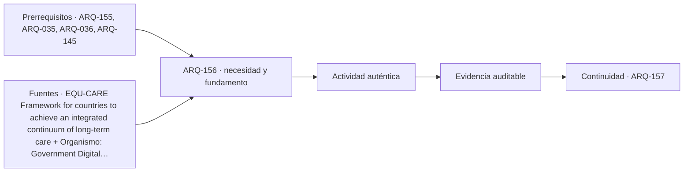

# ARQ-156 · Residencias, cuidados y atención de larga duración

**Parte 16 · Clase desarrollada · Incorporada en v0.11.0.**

Prerrequisitos conceptuales: ARQ-155, ARQ-035, ARQ-036, ARQ-145. Sin calendario. Los casos y cifras son ficticios; no corresponden a levantamientos, usuarios o ensayos reales. Material educativo con revisión externa especializada pendiente.

## Pregunta central

¿Cómo organizar una residencia de larga duración que permita habitar, elegir y recibir apoyos sin convertir la vida cotidiana en un problema exclusivo de distancias del personal?

## Resultado y continuidad

ARQ-155 estudió participar y retornar. Aquí la permanencia es parte del programa: dormir, relacionarse, recibir visitas, retirarse y elegir actividades. CUI-BASE-01 es una residencia ficticia, independiente de los casos escolares o sanitarios. Entregarás un mapa de vida cotidiana, una comparación de recorridos de apoyo y una revisión de privacidad. No se establecen dotaciones de personal ni procedimientos clínicos.

## 1. Habitar no es únicamente ser atendido

Una residencia contiene necesidades de hogar y necesidades de apoyo, pero no son idénticas. Una habitación puede permitir una tarea asistencial y, sin embargo, ofrecer pocas posibilidades de apropiación, elección o relación con el exterior. El proyecto debe describir ambas dimensiones sin asumir que una sustituye a la otra.

El marco de la OMS para atención de larga duración relaciona continuidad de servicios sociales y sanitarios, sostenibilidad y trabajo de cuidadores [[EQU-CARE]](#FUENTE-EQU-CARE). Su escala es sistémica; no prescribe una planta. La adaptación arquitectónica de esta clase consiste en preguntar cómo las decisiones del edificio permiten o dificultan esa continuidad, conservando autonomía y diversidad de necesidades como cuestiones a investigar.

No todas las personas desean el mismo grado de convivencia o ayuda. Una sala común muy visible puede favorecer encuentros y dificultar retirarse. Un corredor directo puede reducir desplazamientos del personal y exponer puertas de habitaciones. Esas tensiones deben representarse; la solución no emerge de maximizar una única medida.

## 2. Un programa con límites claros

CUI-BASE-01 propone doce unidades privadas de 20 m²: 240 en total. Añade estar común 72, comedor 48, encuentro con visitas 24, trabajo y descanso de personal 36, servicios compartidos 36, almacenamiento 24 y apoyo técnico 12. Son 492 m² programáticos. Circulación general 84 y construcción 24 completan 600 brutos.

Los veinte metros por unidad son una hipótesis del caso, no una superficie habilitante. Deben desagregarse según actividades, mobiliario y apoyos. Tampoco doce unidades significan doce personas de necesidades idénticas ni una determinada dotación asistencial. El escenario no contiene residentes reales.

En el presupuesto, el espacio de visitas no sustituye automáticamente estar, comedor o habitación. Cada uno aporta relaciones distintas de privacidad y elección. Si se decide compartirlos, debe describirse bajo qué condiciones y qué ocurre cuando las actividades coinciden.

## 3. Gradientes entre habitación, grupo y exterior

Dibuja una secuencia desde unidad privada a umbral, circulación, pequeño encuentro, espacio común y exterior. El umbral puede ofrecer una transición, pero necesita estudiar visuales y uso. No se presupone que mantener todas las puertas abiertas sea una forma adecuada de cuidado.

Una planta puede ofrecer más de un modo de participar: permanecer cerca sin integrarse a una conversación, recibir una visita o retirarse a un lugar tranquilo. Esas opciones deben ponerse en relación con accesibilidad, apoyos y operación. No se justifican con diagnósticos imaginados de residentes.

La relación con el exterior incorpora llegada, estancia, orientación y retorno. Un jardín no es terapéutico por estar rotulado así. El programa debe preguntar cómo se utiliza, qué apoyos requiere y qué evidencia permitiría evaluar las afirmaciones sobre él. La vegetación y el mantenimiento siguen necesitando condiciones del sitio.

## 4. Caso trabajado: dos puestos de apoyo en un corredor ideal

Para comparar recorridos, abstraemos doce puertas en seis posiciones: 0, 6, 12, 18, 24 y 30 metros, con dos unidades en cada posición. Cada unidad recibe una visita hipotética que parte del puesto y vuelve a él. Se ignoran recorridos internos, interrupciones y otras tareas. El modelo mide distancia, no calidad de cuidado.

Con puesto en el extremo x = 0, las distancias de ida a cada posición son 0, 6, 12, 18, 24 y 30; suman 90. Hay dos unidades por posición y regreso al puesto: 90 × 2 × 2 = 360 metros por ronda ficticia.

Con puesto en x = 15, las distancias son 15, 9, 3, 3, 9 y 15; suman 54. El recorrido de ida y vuelta a las doce unidades es 54 × 4 = 216 metros. La reducción es de 144 metros, equivalente al 40 % respecto de 360.

Ese resultado no demuestra que el puesto central sea la mejor implantación. Puede ocupar una relación espacial valiosa, introducir actividad frente a habitaciones o modificar luz y privacidad. La comparación solo responde a una pregunta bajo frecuencias iguales y viajes independientes.

## 5. Cuando la demanda cambia, también cambia la conclusión

CUI-RONDA-02 conserva puertas y distancias, pero asigna cuatro visitas a cada una de las dos unidades de x = 30 y una a las demás. Son frecuencias sintéticas, no prescripción de asistencia. El modelo debe ponderar cada distancia por su número de viajes.

Para el puesto x = 15, la suma ponderada por posición es 15 + 9 + 3 + 3 + 9 + 4×15 = 99. Con dos unidades por posición y vuelta: 396 metros. Para un puesto x = 24 resulta 24 + 18 + 12 + 6 + 0 + 4×6 = 84; total de 336. La ubicación que antes parecía centralmente conveniente ya no minimiza esta comparación entre esas dos opciones.

Una frecuencia observada durante un período tampoco se convierte en permanente. El proyecto debe estudiar cambios, no fijar una planta alrededor de un único reparto temporal. El ejercicio enseña a declarar hipótesis y a distinguir proximidad geométrica de disponibilidad real del personal y del apoyo requerido.

*Figura 156. Cada resultado incluye ida, vuelta y dos unidades por posición. No determina dotación, vigilancia o frecuencia asistencial.*

## 6. Objetos, apoyos y mantenimiento dentro de la habitación

Representa la habitación con cama, asientos, pertenencias, puertas y envolventes de las tareas previstas. Un equipo que entra no necesariamente puede colocarse o retirarse mientras otras personas permanecen allí. Las dimensiones y procedimientos reales deben provenir de responsables competentes y del equipamiento seleccionado.

La personalización puede permitir pertenencia y orientación, pero debe coordinarse con limpieza, acceso y condiciones técnicas. No se trata de elegir entre una habitación vacía y una imposible de mantener. El proyecto necesita definir qué puede cambiarse, qué no y con qué acompañamiento.

Una instalación oculta detrás de un mueble difícil de mover introduce una dependencia operativa. La ficha de mantenimiento debe reconocer cómo se accede y qué actividades se afectan. No se deben improvisar intervenciones de gas, electricidad o equipos asistenciales en un ejercicio de arquitectura.

## 7. Comedor y espacios comunes: concurrencia y elección

El comedor tiene 48 m², pero su uso no se deduce dividiendo por una ocupación promedio. Deben dibujarse mesas, aproximaciones, apoyos, distribución de alimentos y retirada, con las condiciones que establezca la operación. La experiencia incluye posibilidad de elegir compañía o recibir ayuda sin exposición innecesaria.

Un estar puede admitir actividades simultáneas o resultar conflictivo por sonido y circulación. Si se utiliza para ejercicios y visitas, representa ambas escenas y su coincidencia. Que el mismo mobiliario sea móvil no garantiza que exista espacio para guardarlo o que la transición resulte aceptable para quienes permanecen allí.

El escenario debe contemplar también descanso del personal y trabajo documental protegido. Omitirlos no hace desaparecer esas actividades: probablemente las desplaza a lugares inadecuados. El programa es una forma de reconocer el trabajo necesario, no solo las superficies más visibles para visitantes.

## 8. Investigar sin suplantar la voz de las personas

Una observación debe separar lo visto de lo inferido. «La persona se detuvo junto a la ventana» no prueba que prefiera ese lugar por la luz; podría esperar a alguien. Las conversaciones requieren apoyos adecuados, consentimiento y respeto por quienes decidan no participar. Los escenarios de esta clase no autorizan estudiar residentes reales sin un marco ético apropiado.

Un representante, familiar o trabajador puede aportar información valiosa sin sustituir automáticamente todas las preferencias de una persona. El proyecto debe conservar quién expresó una necesidad y bajo qué condiciones. Cuando hay desacuerdo, se investigan consecuencias y alternativas, no se decide por la voz más fuerte.

La privacidad incluye información. Un tablero visible de tareas puede ayudar a coordinar y revelar datos que no deberían exponerse. La ubicación de puestos, pantallas y archivos pertenece también al diseño del cuidado. No se necesita inventar datos sensibles para ensayar esos problemas: bastan documentos ficticios y roles genéricos.

## 9. Entrega y evaluación en distintos estados

Prepara plantas de uso ordinario, visitas y mantenimiento. En cada una señala qué espacios conservan disponibilidad y dónde se necesita otra organización. No presupongas que una ruta usada durante un estado seguirá abierta en todos los demás.

La evaluación combina geometría, uso y recursos. Un recorrido reducido es una evidencia acotada; una experiencia habitable requiere otras comprobaciones. El expediente debe recoger resultados, desacuerdos, límites y acciones pendientes, de modo que una futura modificación no pierda las razones de las decisiones iniciales.

## La ruta de una tarea no siempre vuelve al puesto inicial

El cálculo de visitas supone que cada tarea comienza y termina en el puesto. Si una persona encadena visitas entre habitaciones, ese modelo deja de describir su recorrido. Para una secuencia concreta habría que sumar distancias entre destinos sucesivos, junto con preparación y retorno cuando correspondan. No basta cambiar el nombre del escenario y conservar la fórmula anterior.

Este punto es importante porque una organización puede parecer conveniente bajo visitas independientes y menos adecuada para tareas agrupadas. El ejercicio no recomienda agrupar cuidados ni modificar una atención real; muestra que una hipótesis de recorrido influye en el resultado espacial. Quienes realizan las actividades deben ayudar a definir secuencias plausibles.

La comparación final debe identificar qué tareas están representadas y cuáles quedaron fuera. Traslado de objetos, conversación privada y momentos de descanso no se convierten en una sola distancia. El programa necesita conservar esas diferencias para no transformar una optimización geométrica en una conclusión sobre la calidad del cuidado.

## Práctica independiente

En otro corredor hay seis puertas únicas situadas en 0, 5, 10, 15, 20 y 25 metros. Cada una recibe una visita de ida y vuelta. Compara puestos en 0 y 12,5 metros. Después duplica solamente la frecuencia de las dos puertas de mayor coordenada y vuelve a calcular ambos recorridos.

Elige además una relación entre habitación y estar común. Propón dos configuraciones, explica qué posibilidad de elección ofrece cada una y qué puede dificultar. No concluyas que una garantiza bienestar ni asignes preferencias a una edad o condición médica.

Solución razonada

Con frecuencias iguales, el puesto extremo acumula 2×75 = 150 metros. El central suma distancias 12,5 + 7,5 + 2,5 + 2,5 + 7,5 + 12,5 = 45; ida y vuelta, 90 metros. La reducción relativa es del 40 %.

Duplicar las visitas a x = 20 y 25 añade 2×(20+25) = 90 al puesto extremo: total 240. En el puesto central añade 2×(7,5+12,5) = 40: total 130. Estos números no pueden trasladarse a CUI-BASE-01, que tiene otra cantidad de unidades y otro reparto de posiciones.

Una configuración puede interponer un umbral de estancia; otra, una circulación con distintos puntos de acceso. La respuesta debe mostrar tareas, visuales, sonido, apoyos y privacidad. El criterio de calidad no es describir una atmósfera agradable, sino hacer explícitas las consecuencias y cómo se consultarían o comprobarían.

## Autoevaluación y enlace

Distingue hogar, apoyo, recorrido y capacidad de operación. Ninguna distancia calculada fija una proporción de personal o demuestra calidad asistencial. ARQ-157 vuelve a CIV-BASE-01 para estudiar cómo una institución presta servicios sin convertir sus procedimientos internos en barreras espaciales.

<!-- pedagogia-2026:inicio -->
## Decisión pedagógica y posición curricular

### Por qué existe

Esta clase existe para resolver una necesidad concreta del recorrido: ¿Cómo organizar una residencia de larga duración que permita habitar, elegir y recibir apoyos sin convertir la vida cotidiana en un problema exclusivo de distancias del personal?

### Por qué está exactamente aquí

Ocupa el lugar 6 de la Parte 16. Se estudia después de ARQ-155 · Deporte y recreación inclusiva porque usa esa base para responder «¿Cómo organizar una residencia de larga duración que permita habitar, elegir y recibir apoyos sin convertir la vida cotidiana en un problema exclusivo de distancias del personal?». Se ubica antes de ARQ-157 · Edificios cívicos y acceso a servicios porque la evidencia producida aquí debe estar disponible para ese paso.

- **Prerrequisitos:** `ARQ-155`, `ARQ-035`, `ARQ-036`, `ARQ-145`
- **Capacidad que introduce:** ARQ-155 estudió participar y retornar. Aquí la permanencia es parte del programa: dormir, relacionarse, recibir visitas, retirarse y elegir actividades. CUI-BASE-01 es una residencia ficticia, independiente de los casos escolares o sanitarios.
- **Clases o experiencias que dependen de ella:** `ARQ-157`

El diagrama permite comprobar una relación que el texto lineal oculta con facilidad: esta clase recibe capacidades previas, toma decisiones apoyadas por fuentes, exige una experiencia y produce evidencia que habilita trabajo posterior. No representa un procedimiento de obra.

## Resultado observable, evidencia y evaluación

1. Identificar y delimitar las condiciones necesarias para responder la pregunta central de residencias, cuidados y atención de larga duración.
2. Producir y comprobar la evidencia declarada por la clase: ARQ-155 estudió participar y retornar. Aquí la permanencia es parte del programa: dormir, relacionarse, recibir visitas, retirarse y elegir actividades. CUI-BASE-01 es una residencia ficticia, independiente de los casos escolares o sanitarios.
3. Justificar una decisión de residencias, cuidados y atención de larga duración mediante fuentes, supuestos, alternativas y límites explícitos.

## Actividad, evidencia y criterio de aceptación

**Actividad:** En otro corredor hay seis puertas únicas situadas en 0, 5, 10, 15, 20 y 25 metros. Cada una recibe una visita de ida y vuelta. Compara puestos en 0 y 12,5 metros.

**Evidencia mínima:** ARQ-155 estudió participar y retornar. Aquí la permanencia es parte del programa: dormir, relacionarse, recibir visitas, retirarse y elegir actividades. CUI-BASE-01 es una residencia ficticia, independiente de los casos escolares o sanitarios.

**Archivo sugerido:** `evidence/ARQ-156/evidencia.md`.

**Criterio de aceptación:** la entrega se acepta cuando:

- La entrega responde explícitamente a la pregunta: ¿Cómo organizar una residencia de larga duración que permita habitar, elegir y recibir apoyos sin convertir la vida cotidiana en un problema exclusivo de distancias del personal?
- La actividad conserva las fronteras del caso y permite reconstruir el procedimiento: En otro corredor hay seis puertas únicas situadas en 0, 5, 10, 15, 20 y 25 metros. Cada una recibe una visita de ida y vuelta. Compara puestos en 0 y 12,5 metros.
- Cada afirmación externa puede seguirse hasta una fuente, su alcance consultado y su límite.
- La evidencia deja disponible una entrada comprobable para ARQ-157.
- Distingue hogar, apoyo, recorrido y capacidad de operación. Ninguna distancia calculada fija una proporción de personal o demuestra calidad asistencial.

La [rúbrica común](../../docs/RUBRICA_COMUN.md) complementa estos criterios; no los reemplaza. Una entrega puede superar un promedio y continuar pendiente si oculta una condición crítica.

## Trazabilidad de las decisiones

| # | Decisión o fundamento | Fuente utilizada | Aplicación y límite en esta clase |
|---:|---|---|---|
| 1 | Relación entre atención de larga duración, sistemas sociales y sanitarios, sostenibilidad operativa y cuidadores. | [EQU-CARE Framework for countries to achieve an integrated continuum of…](https://www.who.int/publications/i/item/9789240038844) | Consulta: Resumen oficial de la publicación de 2021. Límite: No define aquí una proporción de personal, un protocolo de cuidado ni un modelo arquitectónico obligatorio. |
| 2 | Información comprensible y participación voluntaria en investigación | [Organismo: Government Digital Service / GOV.UK. Consulta: 2026-09-21.](https://www.gov.uk/service-manual/user-research/getting-users-consent-for-research) | Consulta: Guía web; consentimiento, alcance y retirada Límite: Guía británica empleada como referencia metodológica; no se traslada como legislación chilena. |
| 3 | Minimización, acceso limitado y cuidado al compartir registros | [Organismo: Government Digital Service / GOV.UK. Consulta: 2026-09-21.](https://www.gov.uk/service-manual/user-research/managing-user-research-data-participant-privacy) | Consulta: Guía web; gestión de información y privacidad Límite: No se fija un plazo legal de conservación ni se asesora sobre cumplimiento en Chile. |
| 4 | Leer el recorrido como cadena de relaciones, no como dimensión aislada. | [ACC-ROUTES Guide to the ADA Accessibility Standards: Accessible…](https://www.access-board.gov/ada/guides/chapter-4-accessible-routes/) | Consulta: Guía explicativa web sobre continuidad y componentes de recorridos accesibles. Límite: Ámbito estadounidense; no se adoptan sus dimensiones como requisitos de Chile ni se certifica cumplimiento. |

La tabla permite auditar las relaciones; la explicación, el caso y la práctica de la clase siguen siendo la documentación principal.

## Autoevaluación, recuperación y continuidad

### Errores diagnósticos

Antes de avanzar, comprueba si puedes reconstruir cada resultado sin mirar la solución, señalar qué evidencia lo sostiene y nombrar una condición que obligaría a revisar tu decisión. Conserva la primera versión, la objeción recibida y la revisión.

**Conexión siguiente:** La continuidad inmediata es ARQ-157 · Edificios cívicos y acceso a servicios; conserva el método y vuelve a verificar datos y límites.
<!-- pedagogia-2026:fin -->

## Fuentes y alcance de uso

Los ejemplos y soluciones son originales. Las referencias fundamentan los conceptos señalados, no los parámetros ficticios. Las fuentes nuevas se consultaron el 21 de septiembre de 2026; las heredadas conservan su alcance.

### [[EQU-CARE]](#FUENTE-EQU-CARE) Framework for countries to achieve an integrated continuum of long-term care

Organización Mundial de la Salud. [https://www.who.int/publications/i/item/9789240038844](https://www.who.int/publications/i/item/9789240038844)

**Consulta:** Resumen oficial de la publicación de 2021. **Apoyo:** Relación entre atención de larga duración, sistemas sociales y sanitarios, sostenibilidad operativa y cuidadores. **Límite:** No define aquí una proporción de personal, un protocolo de cuidado ni un modelo arquitectónico obligatorio.

### [[RES-CONSENT]](#FUENTE-RES-CONSENT) Getting informed consent for user research

Government Digital Service / GOV.UK. [https://www.gov.uk/service-manual/user-research/getting-users-consent-for-research](https://www.gov.uk/service-manual/user-research/getting-users-consent-for-research)

**Consulta:** Guía web; consentimiento, alcance y retirada **Apoyo:** Información comprensible y participación voluntaria en investigación **Límite:** Guía británica empleada como referencia metodológica; no se traslada como legislación chilena.

### [[RES-PRIVACY]](#FUENTE-RES-PRIVACY) Managing user research data and participant privacy

Government Digital Service / GOV.UK. [https://www.gov.uk/service-manual/user-research/managing-user-research-data-participant-privacy](https://www.gov.uk/service-manual/user-research/managing-user-research-data-participant-privacy)

**Consulta:** Guía web; gestión de información y privacidad **Apoyo:** Minimización, acceso limitado y cuidado al compartir registros **Límite:** No se fija un plazo legal de conservación ni se asesora sobre cumplimiento en Chile.

### [[ACC-ROUTES]](#FUENTE-ACC-ROUTES) Guide to the ADA Accessibility Standards: Accessible Routes, chapter 4

U.S. Access Board. [https://www.access-board.gov/ada/guides/chapter-4-accessible-routes/](https://www.access-board.gov/ada/guides/chapter-4-accessible-routes/)

**Consulta:** Guía explicativa web sobre continuidad y componentes de recorridos accesibles. **Apoyo:** Leer el recorrido como cadena de relaciones, no como dimensión aislada. **Límite:** Ámbito estadounidense; no se adoptan sus dimensiones como requisitos de Chile ni se certifica cumplimiento.
