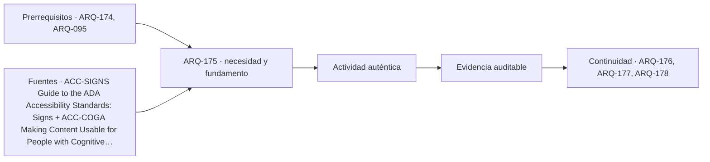

# ARQ-175 · Orientación, contraste y comunicación multisensorial

**Parte 18 · Clase desarrollada · Incorporada en v0.12.0.**

Prerrequisitos conceptuales: ARQ-174, ARQ-095. Sin calendario. Los casos y parámetros son ficticios; no son levantamientos, ensayos ni pruebas con personas reales. Revisión externa especializada pendiente.

## Pregunta central

¿Cómo coordinar espacio, nombres, señales y otros medios de información para que una persona pueda orientarse sin depender de una única pista o de una interpretación que el proyecto nunca comprobó?

## Resultado y continuidad

Las clases anteriores estudiaron recorrido, puerta y servicio. Ahora analizaremos la información que permite encontrarlos y comprenderlos. Construirás una secuencia de decisiones y un pequeño ensayo geométrico de tamaño aparente y contraste. No se fijan umbrales de legibilidad ni especificaciones de señalización. ARQ-176 continuará con instrucciones, carga de información y recuperación ante errores.

## 1. Orientarse es relacionar preguntas con momentos

La orientación comienza antes de entrar: identificar el edificio, reconocer el acceso pertinente y saber si el servicio está disponible. Continúa en cada decisión: dónde girar, qué nivel elegir, qué puerta corresponde y cómo confirmar la llegada. Una señal situada después del cruce puede contener información correcta demasiado tarde.

La organización espacial también comunica. Una entrada visible, una continuidad de recorrido o un destino reconocible pueden reducir incertidumbre. Pero no todos los usuarios perciben o interpretan las mismas relaciones. La arquitectura no debería exigir que una única cualidad visual resuelva toda la orientación.

La guía de señales de la Access Board distingue contenidos visuales, táctiles, ubicación y condiciones de contraste dentro de su ámbito [[ACC-SIGNS]](#FUENTE-ACC-SIGNS). Usaremos esas dimensiones como estructura de análisis, sin reproducir sus medidas como normas chilenas ni asumir que una señal cumple por parecerse a una ilustración.

## 2. Un nombre estable conecta documentos y espacio

En ORI-BASE-01, un servicio aparece en la invitación como “Atención”, en el directorio como “Ventanilla ciudadana” y en la puerta como “Unidad de gestión”. Las tres expresiones podrían referirse al mismo lugar, pero la persona necesita inferirlo. El proyecto ha trasladado una tarea de coordinación al usuario.

La primera corrección consiste en definir una denominación principal y sus relaciones con otras expresiones necesarias. No implica eliminar lenguaje institucional cuando es pertinente; implica evitar que el cambio de vocabulario parezca un cambio de destino. La denominación debe aparecer coherentemente en información previa, directorio, decisiones de recorrido y confirmación final.

Prepara un inventario de mensajes con ubicación, propósito y responsable de actualización. Una señal no queda terminada cuando se fabrica. Si el servicio cambia de lugar o nombre, la versión anterior puede seguir guiando hacia una puerta equivocada. La gestión de contenido forma parte de la operación del edificio.

## 3. Caso de decisión: información antes, durante y después

El escenario ficticio comienza en E, continúa al vestíbulo V y llega a una bifurcación B. A la izquierda está atención A; a la derecha, biblioteca L. Desde B no se ven los rótulos de las puertas. La hipótesis inicial coloca el único directorio dentro de L, por ser un espacio disponible.

El directorio describe correctamente ambos destinos, pero exige elegir una dirección antes de obtener la información para elegirla. Esta es una circularidad de la secuencia, no un problema de tamaño de letras. Aumentar el directorio no resuelve su ubicación.

La variante ORI-02 propone información de elección antes de B y confirmación al llegar a A o L. También conserva una vía para pedir ayuda cuando la información no se comprenda o no esté disponible. Todavía necesita estudiar lectura, comprensión, iluminación, posición y compatibilidad con los recorridos.

La prueba debe preguntar si se llega al destino buscado y cómo se toman las decisiones. “La señal existe” es una observación de inventario. “La persona pudo reconocer el destino en las condiciones ensayadas” es otro tipo de evidencia. Confundir ambas produce una evaluación aparentemente completa, pero centrada en objetos y no en tareas.

## 4. Tamaño físico y tamaño angular

Una letra de cierta altura no se ve del mismo tamaño aparente desde cualquier distancia. Para un objeto frontal de altura h, centrado respecto de la línea de observación y a distancia d, su ángulo visual ideal es θ = 2 arctan[h/(2d)]. La fórmula procede de dos triángulos rectángulos; no contiene un criterio de legibilidad humana.

Con h = 0,05 m y d = 5 m, θ es aproximadamente 0,573°. A diez metros, la misma altura produce aproximadamente 0,286°. Duplicar la distancia reduce casi a la mitad el ángulo en este rango. Si se duplica también la altura, se conserva la razón h/d y, bajo la geometría ideal, el ángulo.

Pero conservar el ángulo no conserva automáticamente la lectura. Intervienen forma de caracteres, espaciado, contraste, iluminación, reflejos, tiempo disponible, movimiento y experiencia de la persona. El cálculo sirve para comprender una relación geométrica y formular un ensayo; no para declarar una señal universalmente legible.

Una vista oblicua añade otras transformaciones. La dimensión proyectada cambia y pueden aparecer reflejos u ocultaciones. Por eso la revisión debe considerar posiciones de aproximación, no solo una fotografía frontal tomada desde el lugar más favorable.

## 5. Contraste: indicar qué razón se calcula

Adoptamos luminancias ficticias de 60 y 10 cd/m² para dos regiones de una señal. Un contraste de tipo Michelson se calcula como C = (Lmáx − Lmín)/(Lmáx + Lmín). En este caso, C = 50/70 ≈ 0,7143.

Si normalizamos la diferencia respecto de la región más luminosa, obtenemos otra razón: Cb = (60 − 10)/60 ≈ 0,8333. Ambas describen los mismos dos datos con denominadores diferentes. No son números intercambiables ni deben compararse con un umbral cuya definición desconocemos.

Ahora añadimos, como modelo simplificado de luminancia de velo, veinte unidades a cada región. Quedan 80 y 30. La diferencia sigue siendo cincuenta, pero el contraste de Michelson baja a 50/110 ≈ 0,4545. La relación muestra por qué conservar dos colores nominales no garantiza conservar su contraste observado.

No afirmamos que toda reflexión añada la misma luminancia ni que ese modelo describa una señal real. Tampoco utilizamos ratios de accesibilidad web como criterios automáticos de señalización física. La guía consultada trata contraste y acabado, pero no convierte estas razones didácticas en requisitos de construcción [[ACC-SIGNS]](#FUENTE-ACC-SIGNS).

*Figura 175. La información debe llegar antes de la decisión. El ángulo y el contraste calculados explican relaciones del modelo; no son umbrales de aprobación.*

## 6. Multisensorial no significa repetir indiscriminadamente

Un sistema puede utilizar información visual, táctil, sonora y apoyo humano. Su coordinación exige pensar qué mensaje aporta cada medio, dónde se recibe y cómo se reconoce su equivalencia. Repetir mensajes contradictorios en más canales multiplica la confusión.

La redundancia útil permite recuperar una información cuando un medio no está disponible o no resulta adecuado. Sin embargo, dos pantallas conectadas al mismo sistema pueden compartir una interrupción. Un mensaje sonoro que depende del mismo contenido desactualizado no corrige el error del directorio visual.

También debe estudiarse el contexto. Una señal sonora constante puede interferir con otra actividad. Un elemento táctil necesita una ubicación reconocible y una aproximación pertinente. Un símbolo requiere comprensión en su contexto cultural. No corresponde diseñar símbolos especializados o braille mediante una traducción improvisada sin revisión competente.

## 7. Contradicciones espaciales y cognitivas

Una flecha puede ser clara de forma aislada y ambigua en una esquina donde se ofrecen varias trayectorias. Una referencia a “segundo piso” puede interpretarse de modos diferentes si la nomenclatura del edificio cambia entre ascensor, plano y puerta. Las decisiones deben conservar un sistema común.

La información debe permitir confirmar que se sigue en el recorrido correcto. Sin confirmaciones, una persona puede regresar aunque haya elegido bien. El proyecto puede estudiar hitos, nombres y mensajes intermedios sin llenar cada muro de indicaciones.

La accesibilidad cognitiva, que se profundizará en ARQ-176, pide examinar claridad y recuperación. Los patrones de W3C sobre etiquetas, instrucciones y propósito ayudan a formular preguntas de contenido [[ACC-COGA]](#FUENTE-ACC-COGA). Su origen digital se mantiene explícito: no se presentan como norma de orientación arquitectónica.

## 8. Probar orientación sin sugerir la respuesta

Una tarea de prueba puede decir: “Has venido a consultar un material de biblioteca. Encuentra dónde comenzar”. No debe añadir “gira a la derecha”, porque eso elimina precisamente la decisión que se quiere observar. La moderación debe registrar dudas, retrocesos, consultas y condiciones del ensayo [[ACC-TESTING]](#FUENTE-ACC-TESTING).

Distingue ayuda espontánea del sistema de ayuda introducida por quien modera. Si el facilitador explica el código de colores durante la prueba, el resultado ya no describe una primera visita sin esa explicación. No significa que el ensayo sea inútil; significa que debe documentarse su alcance.

No se requiere recopilar diagnósticos para registrar que una instrucción resultó confusa. La participación necesita consentimiento, opciones de comunicación y respeto por la privacidad. Los ejemplos de esta clase son ficticios; una observación inventada no debe etiquetarse como experiencia de una persona real.

## 9. Entrega y mantenimiento del sistema

El expediente reúne mapa de decisiones, inventario de mensajes, variantes de nombre y un plan de comprobación. Para cada señal se identifica qué pregunta responde y qué ocurre cuando su información cambia. Las ubicaciones deben relacionarse con el plano y no quedar como una lista sin coordenadas.

Un cambio de servicio exige revisar la cadena completa, desde la comunicación previa hasta la puerta. Retirar una señal vieja sin actualizar otra puede dejar mensajes incompatibles. La responsabilidad editorial y operativa debe estar definida, no depender de que alguien recuerde modificar el archivo original.

La conclusión de ORI-02 puede afirmar que la propuesta coloca información antes de la bifurcación. No puede afirmar comprensión universal ni cumplimiento normativo. La diferencia entre propuesta, ensayo y aceptación debe mantenerse visible para que la siguiente revisión sepa qué falta comprobar.

## Práctica independiente

Calcula el ángulo visual de una altura de 0,04 m a cuatro y ocho metros. ¿Qué altura conservaría el mismo ángulo inicial a ocho metros? Después compara luminancias de 90 y 30 mediante las dos razones definidas. Añade quince a ambas y vuelve a calcular el contraste de Michelson.

En un edificio ficticio, dos directorios muestran “Recepción”, pero la puerta dice “Ingreso de solicitudes”. Además, uno de los directorios se actualiza automáticamente y el otro permanece impreso. Redacta una hipótesis de corrección y una tarea de prueba que no entregue la respuesta. Identifica una dependencia compartida que podría sobrevivir incluso utilizando medios distintos.

Solución razonada

Los ángulos son aproximadamente 0,573° y 0,286°. A ocho metros, una altura de 0,08 m conserva exactamente la misma razón geométrica que 0,04 a cuatro. Eso no basta para garantizar lectura: faltan las otras condiciones explicadas.

Para 90 y 30, Michelson es 60/120 = 0,50 y la normalización respecto del mayor, 60/90 ≈ 0,6667. Al añadir quince quedan 105 y 45; Michelson baja a 60/150 = 0,40. No debe compararse 0,6667 con un umbral de otra definición.

La propuesta puede unificar denominación y establecer un control de versiones para ambos directorios y la puerta. La tarea pide encontrar el lugar de atención sin mencionar la dirección. Una dependencia compartida puede ser el mismo catálogo de nombres equivocado: cambiar de soporte no corrige un contenido incorrecto. Debe registrarse quién mantiene la información y cómo se comprueba su coherencia.

## Autoevaluación y enlace

Puedes avanzar cuando distingues ubicación, tamaño, contraste, contenido y comprensión, y no conviertes una operación matemática en una certificación de legibilidad. ARQ-176 estudiará cómo se organizan instrucciones y decisiones sin reducir la diversidad cognitiva a un único número.

<!-- pedagogia-2026:inicio -->
## Decisión pedagógica y posición curricular

### Por qué existe

Esta clase existe para resolver una necesidad concreta del recorrido: ¿Cómo coordinar espacio, nombres, señales y otros medios de información para que una persona pueda orientarse sin depender de una única pista o de una interpretación que el proyecto nunca comprobó?

### Por qué está exactamente aquí

Ocupa el lugar 5 de la Parte 18. Se estudia después de ARQ-174 · Servicios higiénicos y privacidad porque usa esa base para responder «¿Cómo coordinar espacio, nombres, señales y otros medios de información para que una persona pueda orientarse sin depender de una única pista o de una interpretación que el proyecto nunca comprobó?». Se ubica antes de ARQ-176 · Accesibilidad cognitiva y carga de información porque la evidencia producida aquí debe estar disponible para ese paso.

- **Prerrequisitos:** `ARQ-174`, `ARQ-095`
- **Capacidad que introduce:** Las clases anteriores estudiaron recorrido, puerta y servicio. Ahora analizaremos la información que permite encontrarlos y comprenderlos. Construirás una secuencia de decisiones y un pequeño ensayo geométrico de tamaño aparente y contraste.
- **Clases o experiencias que dependen de ella:** `ARQ-176`, `ARQ-177`, `ARQ-178`

El diagrama permite comprobar una relación que el texto lineal oculta con facilidad: esta clase recibe capacidades previas, toma decisiones apoyadas por fuentes, exige una experiencia y produce evidencia que habilita trabajo posterior. No representa un procedimiento de obra.

## Resultado observable, evidencia y evaluación

1. Identificar y delimitar las condiciones necesarias para responder la pregunta central de orientación, contraste y comunicación multisensorial.
2. Producir y comprobar la evidencia declarada por la clase: Las clases anteriores estudiaron recorrido, puerta y servicio. Ahora analizaremos la información que permite encontrarlos y comprenderlos. Construirás una secuencia de decisiones y un pequeño ensayo geométrico de tamaño aparente y contraste.
3. Justificar una decisión de orientación, contraste y comunicación multisensorial mediante fuentes, supuestos, alternativas y límites explícitos.

## Actividad, evidencia y criterio de aceptación

**Actividad:** Calcula el ángulo visual de una altura de 0,04 m a cuatro y ocho metros. ¿Qué altura conservaría el mismo ángulo inicial a ocho metros? Después compara luminancias de 90 y 30 mediante las dos razones definidas.

**Evidencia mínima:** Las clases anteriores estudiaron recorrido, puerta y servicio. Ahora analizaremos la información que permite encontrarlos y comprenderlos. Construirás una secuencia de decisiones y un pequeño ensayo geométrico de tamaño aparente y contraste.

**Archivo sugerido:** `evidence/ARQ-175/evidencia.md`.

**Criterio de aceptación:** la entrega se acepta cuando:

- La entrega responde explícitamente a la pregunta: ¿Cómo coordinar espacio, nombres, señales y otros medios de información para que una persona pueda orientarse sin depender de una única pista o de una interpretación que el proyecto nunca comprobó?
- La actividad conserva las fronteras del caso y permite reconstruir el procedimiento: Calcula el ángulo visual de una altura de 0,04 m a cuatro y ocho metros. ¿Qué altura conservaría el mismo ángulo inicial a ocho metros? Después compara luminancias de 90 y 30 mediante las dos razones definidas.
- Cada afirmación externa puede seguirse hasta una fuente, su alcance consultado y su límite.
- La evidencia deja disponible una entrada comprobable para ARQ-176.
- Puedes avanzar cuando distingues ubicación, tamaño, contraste, contenido y comprensión, y no conviertes una operación matemática en una certificación de legibilidad. ARQ-176 estudiará cómo se organizan instrucciones y decisiones sin reducir la diversidad cognitiva a un único número.

La [rúbrica común](../../docs/RUBRICA_COMUN.md) complementa estos criterios; no los reemplaza. Una entrega puede superar un promedio y continuar pendiente si oculta una condición crítica.

## Trazabilidad de las decisiones

| # | Decisión o fundamento | Fuente utilizada | Aplicación y límite en esta clase |
|---:|---|---|---|
| 1 | Coordinación de información visual y táctil, legibilidad y ubicación. | [ACC-SIGNS Guide to the ADA Accessibility Standards: Signs](https://www.access-board.gov/ada/guides/chapter-7-signs/) | Consulta: Apartados visuales, contraste, acabados y relación entre tamaño y distancia. Límite: No se adoptan dimensiones, braille inglés abreviado ni ratios como requisitos chilenos. Las fórmulas geométricas y comparaciones de luminancia son ejercicios originales. |
| 2 | Descomponer instrucciones y facilitar comprensión, orientación y recuperación. | [ACC-COGA Making Content Usable for People with Cognitive and Learning…](https://www.w3.org/TR/coga-usable/) | Consulta: Nota de grupo de trabajo; patrones de propósito, instrucciones, resúmenes, etiquetas y corrección. Límite: Referencia para contenido digital, adaptada aquí como pregunta de diseño espacial. No es una norma constructiva ni establece una medida universal de carga cognitiva. |
| 3 | Preparar pruebas de uso centradas en tareas y distinguir observación de ayuda del facilitador. | [DES-TEST Using moderated usability testing](https://www.gov.uk/service-manual/user-research/using-moderated-usability-testing) | Consulta: Guía web sobre tareas, moderación y registro. Límite: El campo original es investigación de servicios digitales; la adaptación arquitectónica y los datos son propios y simulados. No hubo participantes reales. |

La tabla permite auditar las relaciones; la explicación, el caso y la práctica de la clase siguen siendo la documentación principal.

## Autoevaluación, recuperación y continuidad

### Errores diagnósticos

Antes de avanzar, comprueba si puedes reconstruir cada resultado sin mirar la solución, señalar qué evidencia lo sostiene y nombrar una condición que obligaría a revisar tu decisión. Conserva la primera versión, la objeción recibida y la revisión.

**Conexión siguiente:** La continuidad inmediata es ARQ-176 · Accesibilidad cognitiva y carga de información; conserva el método y vuelve a verificar datos y límites.
<!-- pedagogia-2026:fin -->

## Fuentes y alcance de uso

Los casos, dibujos, derivaciones docentes y soluciones son originales. Las referencias respaldan los conceptos indicados, no las cifras ficticias. Consulta de fuentes nuevas: 21 de septiembre de 2026. Las referencias heredadas conservan su alcance; no se afirma lectura íntegra cuando el acceso fue parcial.

### [[ACC-SIGNS]](#FUENTE-ACC-SIGNS) Guide to the ADA Accessibility Standards: Signs

U.S. Access Board. [https://www.access-board.gov/ada/guides/chapter-7-signs/](https://www.access-board.gov/ada/guides/chapter-7-signs/)

**Consulta:** Apartados visuales, contraste, acabados y relación entre tamaño y distancia. **Apoyo:** Coordinación de información visual y táctil, legibilidad y ubicación. **Límite:** No se adoptan dimensiones, braille inglés abreviado ni ratios como requisitos chilenos. Las fórmulas geométricas y comparaciones de luminancia son ejercicios originales.

### [[ACC-COGA]](#FUENTE-ACC-COGA) Making Content Usable for People with Cognitive and Learning Disabilities

W3C. [https://www.w3.org/TR/coga-usable/](https://www.w3.org/TR/coga-usable/)

**Consulta:** Nota de grupo de trabajo; patrones de propósito, instrucciones, resúmenes, etiquetas y corrección. **Apoyo:** Descomponer instrucciones y facilitar comprensión, orientación y recuperación. **Límite:** Referencia para contenido digital, adaptada aquí como pregunta de diseño espacial. No es una norma constructiva ni establece una medida universal de carga cognitiva.

### [[ACC-TESTING]](#FUENTE-ACC-TESTING) Using moderated usability testing

Government Digital Service / GOV.UK. [https://www.gov.uk/service-manual/user-research/using-moderated-usability-testing](https://www.gov.uk/service-manual/user-research/using-moderated-usability-testing)

**Consulta:** Guía web sobre tareas, moderación y registro. **Apoyo:** Preparar pruebas de uso centradas en tareas y distinguir observación de ayuda del facilitador. **Límite:** El campo original es investigación de servicios digitales; la adaptación arquitectónica y los datos son propios y simulados. No hubo participantes reales.
