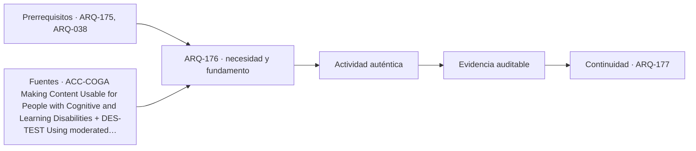

# ARQ-176 · Accesibilidad cognitiva y carga de información

**Parte 18 · Clase desarrollada · Incorporada en v0.12.0.**

Prerrequisitos conceptuales: ARQ-175, ARQ-038. Sin calendario. Los casos y parámetros son ficticios; no son levantamientos, ensayos ni pruebas con personas reales. Revisión externa especializada pendiente.

## Pregunta central

¿Cómo organizar información y decisiones para facilitar una actividad sin suponer que todas las personas comprenden, recuerdan o resuelven problemas de la misma manera?

## Resultado y continuidad

ARQ-175 situó la información en el recorrido. Ahora estudiaremos propósito, secuencia, memoria y recuperación. El caso INF-01 es un servicio ficticio de orientación, no una evaluación clínica. Producirás dos versiones de una instrucción, un mapa de decisiones y un protocolo de contraste. El cálculo de información del capítulo es matemático: no mide inteligencia, discapacidad ni esfuerzo mental de una persona.

## 1. La dificultad puede estar en la relación con el entorno

Un edificio puede exigir recordar instrucciones largas, interpretar nombres cambiantes, distinguir estímulos simultáneos o decidir sin saber el resultado esperado. Esas exigencias no afectan de la misma forma a todas las personas ni en todos los momentos. Una primera visita, cansancio, preocupación, idioma o interrupciones pueden cambiar la experiencia.

El proyecto debe investigar barreras concretas, no diagnosticar a quien encuentra una dificultad. “No entiende el edificio” desplaza la responsabilidad sin describir el problema. “La instrucción cambia de nombre entre dos pasos y no indica cómo volver” identifica una condición que puede revisarse.

W3C propone patrones de contenido para hacer explícitos propósito, instrucciones y formas de corregir errores [[ACC-COGA]](#FUENTE-ACC-COGA). Se trata de una referencia de accesibilidad digital. Aquí se adapta como herramienta de investigación del servicio y su espacio, sin atribuirle requisitos constructivos ni tratar sus patrones como una solución automática.

## 2. Propósito antes que acumulación de mensajes

Antes de seguir una instrucción, conviene poder reconocer para qué sirve. Un directorio que enumera oficinas puede no responder a la pregunta de una persona que conoce su necesidad, pero no el nombre administrativo del área. La organización debe conectar actividades comprensibles con destinos.

En INF-01, la tarea es entregar una solicitud y obtener constancia. El recorrido inicial comienza con un cartel titulado “Procedimiento de gestión documental”, seguido de varias condiciones mezcladas. La primera pregunta de revisión no es cuántas palabras contiene, sino si permite reconocer que allí se realiza esa tarea.

Un título como “Entregar una solicitud” puede mejorar esa correspondencia, pero debe contrastarse. No se prescribe una redacción universal: términos adecuados dependen del servicio, idioma y personas implicadas. La claridad se estudia mediante tareas y evidencia, no mediante la preferencia estilística del proyectista.

## 3. Caso trabajado: descomponer una instrucción

El texto ficticio inicial dice: “Previo registro y previa obtención de turno, diríjase al módulo correspondiente, salvo atención agendada, incorporando los antecedentes requeridos, y conserve el comprobante para eventuales subsanaciones”. Mezcla acciones, excepción y lenguaje que podría necesitar explicación.

La versión de estudio comienza con el propósito: “Aquí puedes entregar tu solicitud y recibir un comprobante”. Después distingue dos situaciones: con una cita ya confirmada, seguir la indicación de esa cita; sin cita, pedir orientación en el punto señalado. Para este servicio ficticio, la orientación informa qué documentación corresponde antes de obtener el turno.

La secuencia propuesta separa acciones: revisar documentos, obtener turno, esperar la llamada identificada, entregar la solicitud y recibir el comprobante. El cierre explica para qué sirve el comprobante y dónde consultar una duda. No se inventan requisitos legales ni documentos reales: el ejercicio estudia cómo organizar contenido que el responsable del servicio deberá definir.

La mejora no consiste únicamente en acortar. La nueva versión puede ocupar más líneas y resultar más fácil de recorrer porque cada paso tiene un propósito. El criterio es que la persona pueda anticipar, ejecutar y comprobar la acción, no que la cartelería tenga el menor número posible de palabras.

## 4. Una excepción debe llegar antes del punto de compromiso

Una condición comunicada después de hacer una fila obliga a retroceder. En INF-01, descubrir al final que faltaba un antecedente puede invalidar el recorrido anterior. La pregunta de diseño es dónde se necesita conocer esa condición para tomar una decisión útil.

No todas las excepciones deben mostrarse simultáneamente en el primer cartel. Puede existir un nivel inicial de orientación y otro de detalle. Pero ocultar información indispensable hasta después de una acción irreversible o costosa crea una barrera. La secuencia debe distinguir lo necesario para empezar de lo necesario para cada paso posterior.

Una representación útil contiene acción, condición previa, información requerida, confirmación y forma de recuperación. Si una fila de esa tabla queda vacía, conviene investigar si el servicio está suponiendo un conocimiento que no ha comunicado. No se rellena la celda con una explicación inventada: se consulta a quien conoce y opera el proceso.

## 5. Agrupar decisiones no reduce automáticamente la información matemática

Considera seis destinos equiprobables. La cantidad de información asociada a identificar uno puede escribirse H = log₂(6), aproximadamente 2,585 bits. Es una propiedad del modelo probabilístico, no un indicador de dificultad humana.

Ahora organiza esos destinos en tres grupos, con dos destinos en cada grupo, todos igualmente probables. La primera selección aporta log₂(3) y la segunda log₂(2). La suma es log₂(3) + log₂(2) = log₂(6): exactamente la misma cantidad matemática.

La agrupación puede ayudar a comprender una organización si sus categorías son pertinentes y se presentan en el momento adecuado. También puede añadir una decisión confusa si las categorías se superponen o no se reconocen. La igualdad de bits no resuelve cuál interfaz funciona mejor, del mismo modo que contar palabras no mide comprensión.

Si las probabilidades cambian, el modelo general usa H = −Σ pᵢ log₂(pᵢ). Pero conocer una frecuencia agregada no permite inferir la experiencia de una persona particular. Tampoco autoriza diseñar solo para el destino más frecuente y dejar sin explicación los demás. La herramienta matemática debe mantenerse dentro de su pregunta.

*Figura 176. Dividir seis destinos en tres grupos de dos conserva la información del modelo equiprobable. La comprensión de las categorías requiere evidencia de uso distinta del cálculo.*

## 6. Memoria externa y confirmación del progreso

Un sistema puede permitir consultar lo que antes exigía recordar: nombre del destino, número de turno, pasos realizados y próximo punto. Esas referencias deben ser comprensibles y coherentes entre medios. Un comprobante con un código sin explicación puede añadir un dato sin ayudar a orientarse.

La confirmación del progreso reduce la incertidumbre sobre si una acción terminó. En INF-01, después de entregar la solicitud, la persona necesita saber si fue recibida y qué corresponde hacer después. La presencia de un mostrador no resuelve esa comunicación.

El apoyo a la memoria no exige llenar el espacio de carteles repetidos. Puede organizarse mediante hitos, etiquetas estables, resúmenes breves y acceso a ayuda. El diseño debe contrastar si esas referencias se encuentran y comprenden en los momentos pertinentes. La ausencia de preguntas no demuestra necesariamente comprensión; algunas personas pueden abandonar sin consultar.

## 7. Recuperación sin castigar el error

Un recorrido puede admitir equivocaciones previsibles: elegir otra fila, llegar a un sector cerrado o perder una referencia. La pregunta es qué permite reconocer el problema y volver a una situación comprensible. Una instrucción que solo funciona cuando nunca se comete un error es frágil.

En la variante INF-02, una persona llega a un módulo distinto. El mensaje propuesto no dice simplemente “equivocado”; identifica el servicio de ese módulo y ofrece una referencia coherente para llegar a orientación. Esa redacción todavía debe probarse, pero su función es permitir recuperar la tarea sin exponer innecesariamente a la persona.

Debe distinguirse recuperación del proceso de autorización para realizarlo. Facilitar orientación no implica omitir requisitos aplicables. La coordinación entre claridad y procedimiento exige que quienes administran el servicio revisen el contenido, en lugar de pedir al arquitecto que invente una simplificación jurídica.

## 8. Evitar una falsa solución única

Una persona puede preferir información escrita; otra, explicación verbal; otra, una representación de pasos. Ofrecer opciones no significa que cada modalidad deba duplicar todos los detalles de manera idéntica. Significa mantener equivalencia de la información necesaria y una forma de acceder a ella.

No se deben asignar modalidades automáticamente a grupos definidos por edad, diagnóstico o apariencia. La investigación puede preguntar por apoyos útiles y permitir elegir. Un acompañamiento deseado también debe respetar privacidad y autonomía.

El diseño debe cuidar contradicciones entre medios. Un cartel puede indicar que se espere y una pantalla llamar con otro código; una explicación verbal puede usar un nombre que no aparece en el plano. La consistencia del sistema requiere responsables de contenido, versiones y mantenimiento, como se estudió en ARQ-175.

## 9. Qué observar en una prueba

Una prueba moderada define tareas y evita proporcionar de antemano la ruta que se quiere estudiar [[ACC-TESTING]](#FUENTE-ACC-TESTING). Para INF-02, se puede pedir localizar cómo iniciar una solicitud, identificar qué ocurre después de obtener turno y explicar cómo pedir ayuda. No se evalúa a la persona: se examina la propuesta.

El registro distingue finalización, ayuda, retrocesos, dudas, interpretación de mensajes y condiciones del ensayo. La velocidad no debe convertirse en el único criterio. Una versión puede reducir tiempo y aumentar errores, o permitir una tarea antes imposible aunque requiera más tiempo.

La participación necesita consentimiento e información accesible [[RES-CONSENT]](#FUENTE-RES-CONSENT). Los registros del ejercicio no representan personas reales. Si posteriormente se realiza investigación, deben acordarse tratamiento de datos, condiciones de interrupción y modalidades de participación. No se publican relatos identificables para demostrar que una consulta ocurrió.

## 10. Una devolución útil conserva desacuerdos

La síntesis puede distinguir qué mensajes se comprendieron, dónde aparecieron interpretaciones diferentes y qué cambio se propone. No es necesario presentar consenso inexistente. Una persona que utiliza la alternativa de ayuda no representa un fallo personal ni valida por sí sola toda la asistencia del servicio.

La versión revisada debe conservar su relación con los hallazgos. Si se cambia el nombre de un paso, se revisan los otros medios donde aparece. Si se elimina un detalle, se comprueba que no era necesario para una decisión. La mejora se demuestra con evidencia acotada y no con adjetivos como “intuitivo”.

La entrega final reúne texto inicial, propuesta, razones de cada cambio, tarea de prueba y resultados esperados como hipótesis. Es importante rotular estos últimos: prever que algo ayudará no equivale a haber observado que ayudó.

## Práctica independiente

Reescribe este mensaje ficticio: “Usuarios sin validación previa deberán regularizar antecedentes en orientación antes de concurrir a la atención, excepto quienes dispongan de confirmación específica”. Separa propósito, situaciones y primer paso sin inventar documentos o requisitos. Identifica qué información debe confirmar el responsable del servicio antes de publicar la propuesta.

Compara ocho destinos equiprobables con dos grupos de cuatro. Calcula la información total en ambas organizaciones y explica dos razones por las que la igualdad matemática no prueba igualdad de comprensión.

Diseña una tarea de prueba y un registro que distinga comprensión, ayuda y finalización. Incluye una manera de registrar abandono sin asignarle duración cero ni eliminarlo del análisis.

Solución razonada

Una propuesta puede comenzar con “Antes de ir a atención, revisa dónde debes comenzar”. Luego diferencia quienes tienen una confirmación que indica destino de quienes necesitan consultar en orientación. Deben confirmarse el significado de validación, el alcance de la excepción y el punto de orientación. La redacción no puede suplir esos datos con una suposición.

Ocho opciones equiprobables aportan log₂(8) = 3 bits. Dos grupos de cuatro aportan 1 + 2 = 3 bits. Las categorías pueden ser familiares o confusas, y la información puede aparecer en un momento útil o tardío; nada de eso queda representado por el cálculo.

La tarea no incluye la dirección correcta. El registro conserva si se completó sin ayuda, con ayuda o no se completó, junto con observaciones del sistema. Un abandono sigue en el denominador de tareas iniciadas y lleva un estado explícito; no se convierte en éxito rápido por asignarle cero segundos.

## Autoevaluación y enlace

Puedes avanzar cuando mejoras una instrucción sin inventar el procedimiento, distingues información matemática de experiencia humana y preparas una prueba que no sugiera la respuesta. ARQ-177 estudiará cómo acústica e iluminación pueden apoyar o dificultar esa misma actividad.

<!-- pedagogia-2026:inicio -->
## Decisión pedagógica y posición curricular

### Por qué existe

Esta clase existe para resolver una necesidad concreta del recorrido: ¿Cómo organizar información y decisiones para facilitar una actividad sin suponer que todas las personas comprenden, recuerdan o resuelven problemas de la misma manera?

### Por qué está exactamente aquí

Ocupa el lugar 6 de la Parte 18. Se estudia después de ARQ-175 · Orientación, contraste y comunicación multisensorial porque usa esa base para responder «¿Cómo organizar información y decisiones para facilitar una actividad sin suponer que todas las personas comprenden, recuerdan o resuelven problemas de la misma manera?». Se ubica antes de ARQ-177 · Acústica, iluminación y diversidad sensorial porque la evidencia producida aquí debe estar disponible para ese paso.

- **Prerrequisitos:** `ARQ-175`, `ARQ-038`
- **Capacidad que introduce:** ARQ-175 situó la información en el recorrido. Ahora estudiaremos propósito, secuencia, memoria y recuperación. El caso INF-01 es un servicio ficticio de orientación, no una evaluación clínica.
- **Clases o experiencias que dependen de ella:** `ARQ-177`

El diagrama permite comprobar una relación que el texto lineal oculta con facilidad: esta clase recibe capacidades previas, toma decisiones apoyadas por fuentes, exige una experiencia y produce evidencia que habilita trabajo posterior. No representa un procedimiento de obra.

## Resultado observable, evidencia y evaluación

1. Identificar y delimitar las condiciones necesarias para responder la pregunta central de accesibilidad cognitiva y carga de información.
2. Producir y comprobar la evidencia declarada por la clase: ARQ-175 situó la información en el recorrido. Ahora estudiaremos propósito, secuencia, memoria y recuperación. El caso INF-01 es un servicio ficticio de orientación, no una evaluación clínica.
3. Justificar una decisión de accesibilidad cognitiva y carga de información mediante fuentes, supuestos, alternativas y límites explícitos.

## Actividad, evidencia y criterio de aceptación

**Actividad:** Reescribe este mensaje ficticio: “Usuarios sin validación previa deberán regularizar antecedentes en orientación antes de concurrir a la atención, excepto quienes dispongan de confirmación específica”. Separa propósito, situaciones y primer paso sin inventar documentos o requisitos. Identifica qué información debe confirmar el responsable del servicio antes de publicar la propuesta.

**Evidencia mínima:** ARQ-175 situó la información en el recorrido. Ahora estudiaremos propósito, secuencia, memoria y recuperación. El caso INF-01 es un servicio ficticio de orientación, no una evaluación clínica.

**Archivo sugerido:** `evidence/ARQ-176/evidencia.md`.

**Criterio de aceptación:** la entrega se acepta cuando:

- La entrega responde explícitamente a la pregunta: ¿Cómo organizar información y decisiones para facilitar una actividad sin suponer que todas las personas comprenden, recuerdan o resuelven problemas de la misma manera?
- La actividad conserva las fronteras del caso y permite reconstruir el procedimiento: Reescribe este mensaje ficticio: “Usuarios sin validación previa deberán regularizar antecedentes en orientación antes de concurrir a la atención, excepto quienes dispongan de confirmación específica”. Separa propósito, situaciones y primer paso sin inventar documentos o requisitos. Identifica qué información debe confirmar el responsable del servicio antes de publicar la propuesta.
- Cada afirmación externa puede seguirse hasta una fuente, su alcance consultado y su límite.
- La evidencia deja disponible una entrada comprobable para ARQ-177.
- Una persona puede preferir información escrita; otra, explicación verbal; otra, una representación de pasos. Ofrecer opciones no significa que cada modalidad deba duplicar todos los detalles de manera idéntica.

La [rúbrica común](../../docs/RUBRICA_COMUN.md) complementa estos criterios; no los reemplaza. Una entrega puede superar un promedio y continuar pendiente si oculta una condición crítica.

## Trazabilidad de las decisiones

| # | Decisión o fundamento | Fuente utilizada | Aplicación y límite en esta clase |
|---:|---|---|---|
| 1 | Descomponer instrucciones y facilitar comprensión, orientación y recuperación. | [ACC-COGA Making Content Usable for People with Cognitive and Learning…](https://www.w3.org/TR/coga-usable/) | Consulta: Nota de grupo de trabajo; patrones de propósito, instrucciones, resúmenes, etiquetas y corrección. Límite: Referencia para contenido digital, adaptada aquí como pregunta de diseño espacial. No es una norma constructiva ni establece una medida universal de carga cognitiva. |
| 2 | Preparar pruebas de uso centradas en tareas y distinguir observación de ayuda del facilitador. | [DES-TEST Using moderated usability testing](https://www.gov.uk/service-manual/user-research/using-moderated-usability-testing) | Consulta: Guía web sobre tareas, moderación y registro. Límite: El campo original es investigación de servicios digitales; la adaptación arquitectónica y los datos son propios y simulados. No hubo participantes reales. |
| 3 | Información comprensible y participación voluntaria en investigación | [Organismo: Government Digital Service / GOV.UK. Consulta: 2026-09-21.](https://www.gov.uk/service-manual/user-research/getting-users-consent-for-research) | Consulta: Guía web; consentimiento, alcance y retirada Límite: Guía británica empleada como referencia metodológica; no se traslada como legislación chilena. |

La tabla permite auditar las relaciones; la explicación, el caso y la práctica de la clase siguen siendo la documentación principal.

## Autoevaluación, recuperación y continuidad

### Errores diagnósticos

Antes de avanzar, comprueba si puedes reconstruir cada resultado sin mirar la solución, señalar qué evidencia lo sostiene y nombrar una condición que obligaría a revisar tu decisión. Conserva la primera versión, la objeción recibida y la revisión.

**Conexión siguiente:** La continuidad inmediata es ARQ-177 · Acústica, iluminación y diversidad sensorial; conserva el método y vuelve a verificar datos y límites.
<!-- pedagogia-2026:fin -->

## Fuentes y alcance de uso

Los casos, dibujos, derivaciones docentes y soluciones son originales. Las referencias respaldan los conceptos indicados, no las cifras ficticias. Consulta de fuentes nuevas: 21 de septiembre de 2026. Las referencias heredadas conservan su alcance; no se afirma lectura íntegra cuando el acceso fue parcial.

### [[ACC-COGA]](#FUENTE-ACC-COGA) Making Content Usable for People with Cognitive and Learning Disabilities

W3C. [https://www.w3.org/TR/coga-usable/](https://www.w3.org/TR/coga-usable/)

**Consulta:** Nota de grupo de trabajo; patrones de propósito, instrucciones, resúmenes, etiquetas y corrección. **Apoyo:** Descomponer instrucciones y facilitar comprensión, orientación y recuperación. **Límite:** Referencia para contenido digital, adaptada aquí como pregunta de diseño espacial. No es una norma constructiva ni establece una medida universal de carga cognitiva.

### [[ACC-TESTING]](#FUENTE-ACC-TESTING) Using moderated usability testing

Government Digital Service / GOV.UK. [https://www.gov.uk/service-manual/user-research/using-moderated-usability-testing](https://www.gov.uk/service-manual/user-research/using-moderated-usability-testing)

**Consulta:** Guía web sobre tareas, moderación y registro. **Apoyo:** Preparar pruebas de uso centradas en tareas y distinguir observación de ayuda del facilitador. **Límite:** El campo original es investigación de servicios digitales; la adaptación arquitectónica y los datos son propios y simulados. No hubo participantes reales.

### [[RES-CONSENT]](#FUENTE-RES-CONSENT) Getting informed consent for user research

Government Digital Service / GOV.UK. [https://www.gov.uk/service-manual/user-research/getting-users-consent-for-research](https://www.gov.uk/service-manual/user-research/getting-users-consent-for-research)

**Consulta:** Guía web; consentimiento, alcance y retirada **Apoyo:** Información comprensible y participación voluntaria en investigación **Límite:** Guía británica empleada como referencia metodológica; no se traslada como legislación chilena.
