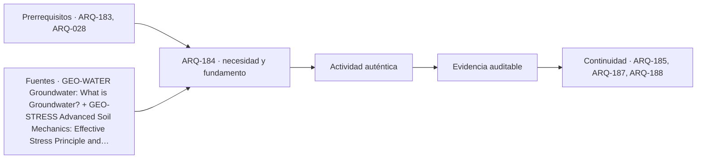

# ARQ-184 · Agua subterránea y variaciones del terreno

**Parte 19 · Clase desarrollada · Incorporada en v0.12.0.**

Prerrequisitos conceptuales: ARQ-183, ARQ-028. Sin calendario. Los casos y parámetros son ficticios; no son levantamientos, ensayos ni pruebas con personas reales. Revisión externa especializada pendiente.

## Pregunta central

¿Cómo cambia la interpretación de una carga sobre el terreno cuando el agua también transmite presión, y por qué un nivel observado una vez no describe necesariamente todos los estados del sitio?

## Resultado y continuidad

ARQ-183 exigió ubicación, datum, método y fecha para cada resultado. Esta clase aplica esa exigencia al agua. No asigna un nivel freático a GEO-BASE-01: trabaja con **AGUA-COLUMNA-01**, una columna homogénea ficticia, y **FLUJO-01**, un ensayo matemático unidimensional separado. Resolverás esfuerzos total y efectivo y un balance de caudal, explicando sus hipótesis. ARQ-185 estudiará deformaciones sin tratar estos resultados como una capacidad de soporte autorizada.

## 1. El agua subterránea no es necesariamente un río oculto

El agua puede ocupar poros y fracturas. La explicación de USGS distingue zona saturada y nivel freático dentro de ese contexto [[GEO-WATER]](#FUENTE-GEO-WATER). Una representación azul continua ayuda a comprender el fenómeno, pero no significa que exista una cavidad vacía bajo cada terreno ni una superficie horizontal universal.

Las condiciones dependen de materiales, conexiones hidráulicas, recarga, límites y variación temporal. Una observación debe conservar ubicación, cota, momento y método. No observar agua durante una exploración no demuestra que el terreno permanezca seco en toda estación o profundidad.

También debe distinguirse profundidad desde la superficie de carga hidráulica o cota de agua. Dos lecturas a dos metros bajo terrenos de elevaciones distintas no representan automáticamente igual energía hidráulica. Recupera la comparación de referencias de ARQ-183 antes de dibujar una línea que conecte mediciones.

## 2. Esfuerzo total y presión intersticial

El esfuerzo total representa fuerza por unidad de área dentro del modelo considerado. La presión intersticial u describe la presión del agua en los poros. En suelo saturado, el principio de esfuerzo efectivo utiliza `σ′ = σ − u` para relacionar esfuerzo total y presión intersticial [[GEO-STRESS]](#FUENTE-GEO-STRESS).

No significa que cada grano soporte una fuerza obtenida restando directamente dos pesos. Es una descripción continua del conjunto, que permite estudiar el papel de las interacciones del esqueleto sólido. La relación requiere conservar componentes y convenciones compatibles. En esta clase se trabaja con esfuerzo vertical, presión manométrica y estado hidrostático.

La forma simple no se traslada sin revisión a suelo no saturado. La succión y otras condiciones necesitan modelos pertinentes. Para el ejemplo, el punto de interés está por debajo del nivel de agua en todos los estados. No utilizamos la misma ecuación para atribuir propiedades a la zona superior no saturada.

## 3. Unidades que evitan errores de escala

El peso unitario γ se expresa aquí en kN/m³. Multiplicarlo por espesor en metros entrega kN/m², equivalentes a kPa. La densidad de masa, en kg/m³, no es el mismo dato. Cambiar de una a otra requiere incluir gravedad y unidades, como se explicó en ARQ-182.

Bajo hidrostática, la presión manométrica del agua a una profundidad h bajo su superficie es `u = γw h`. Adoptamos γw = 9,81 kN/m³. La distancia h se mide desde el nivel de agua hasta el punto, no desde la superficie del terreno cuando ambos niveles son distintos.

No se asigna una presión por mirar solamente un color en el mapa. El modelo presupone conexión y estado hidrostático. Flujo, confinamiento u otras condiciones pueden exigir otra distribución. La simplicidad de la multiplicación no elimina la necesidad de justificar sus límites.

## 4. Caso trabajado: nivel de agua a dos metros

AGUA-COLUMNA-01 estudia un punto a seis metros bajo una superficie horizontal. El material por encima del agua tiene peso unitario ficticio de 18 kN/m³ y el material saturado, 20. El nivel de agua está a dos metros. No existe carga superficial adicional en el modelo.

El esfuerzo total vertical suma las dos franjas: `σv = 2 × 18 + 4 × 20 = 116 kPa`. El punto está cuatro metros bajo el agua, por lo que `u = 4 × 9,81 = 39,24 kPa`. El esfuerzo efectivo resulta `σ′v = 116 − 39,24 = 76,76 kPa`.

Cada cifra responde a una pregunta distinta. Los 116 no son una carga aplicada por un edificio; representan el peso suprayacente del modelo. Los 39,24 no son un porcentaje de saturación. Los 76,76 no son capacidad de soporte. Mantener estos significados evita utilizar un resultado físicamente correcto como respuesta a otra cuestión.

## 5. Qué cambia cuando sube el agua

En una variante, el agua alcanza la superficie. Los seis metros se consideran saturados con el mismo peso unitario ficticio de 20. El esfuerzo total pasa a `6 × 20 = 120 kPa`; la presión intersticial, a `6 × 9,81 = 58,86`; el esfuerzo efectivo queda en `61,14 kPa`.

La diferencia respecto del estado inicial es `61,14 − 76,76 = −15,62 kPa`. No basta restar 19,62 kPa por los dos metros adicionales de agua, porque también cambió el peso total de la franja superior: aumentó cuatro kPa. Ambos efectos deben incluirse dentro del modelo declarado.

Esto no demuestra un asentamiento ni una falla concreta. Muestra que una misma profundidad geométrica puede tener distinto estado efectivo al cambiar el agua. Para interpretar consecuencias hacen falta propiedades, historia, acciones y condiciones del problema. La clase enseña a revisar esas dependencias, no a indicar un nivel de bombeo.

*Figura 184. AGUA-COLUMNA-01: profundidad del punto fija en seis metros. Los estados no son observaciones del predio GEO ni diseños de drenaje.*

## 6. Qué cambia cuando baja el agua

En otra variante independiente, el nivel está a cuatro metros. Bajo las mismas reglas de peso unitario, el esfuerzo total es `4 × 18 + 2 × 20 = 112 kPa`; u es 19,62; σ′v es 92,38 kPa. Es mayor que el valor inicial aunque el esfuerzo total disminuyó.

La comparación revela por qué no conviene utilizar únicamente el peso total para explicar la respuesta. También muestra que una modificación hidráulica puede afectar condiciones fuera del punto donde se actúa. No deducimos cuánto se deformará un suelo vecino: esa predicción necesita un modelo y datos que aquí no existen.

Bajar agua no es una recomendación universal para mejorar un terreno. Puede modificar esfuerzos y movimientos, además de otras relaciones ambientales y operativas. El estudio y la ejecución corresponden a profesionales y procedimientos pertinentes. No se entregan instrucciones de bombeo, pozos o excavaciones.

## 7. Carga hidráulica y gradiente

En un modelo de flujo, la carga hidráulica reúne elevación y presión expresada como altura de agua, bajo las simplificaciones adoptadas. El gradiente i es diferencia de carga dividida por longitud del trayecto: `i = Δh/L`. No es simplemente pendiente de la superficie del terreno.

La ley de Darcy unidimensional se escribe `Q = k i A`, donde k es conductividad hidráulica y A el área transversal adoptada [[GEO-FLOW]](#FUENTE-GEO-FLOW). La expresión necesita condiciones de aplicación y parámetros pertinentes. Una arcilla o arena no recibe aquí un valor universal de k a partir de su nombre.

La velocidad de Darcy Q/A es un caudal por área total. No equivale necesariamente a velocidad media del agua dentro del espacio poroso. Esa diferencia permite comprender por qué una sección y una porosidad deben definirse cuidadosamente antes de hablar de tiempos de recorrido. No se calcula transporte de contaminantes con este único balance.

## 8. Segundo caso: comprobar el caudal y sus unidades

FLUJO-01 adopta k = 0,00001 m/s, diferencia de carga de un metro, longitud de veinte y área de ocho metros cuadrados. El gradiente es 0,05. El caudal resulta `0,00001 × 0,05 × 8 = 0,000004 m³/s`.

Un día contiene 86.400 segundos; bajo condiciones constantes, el volumen sería `0,000004 × 86.400 = 0,3456 m³`. No son 0,3456 m³ por segundo ni cuatro litros por segundo: mantener la notación y las conversiones evita errores de varios órdenes de magnitud.

Duplicar Δh duplicaría Q dentro de este modelo lineal si todo lo demás permaneciera constante. No demuestra que un sistema real acepte ese cambio sin modificar condiciones. El área de flujo, los límites o las propiedades podrían cambiar. La sensibilidad matemática debe conservar explícita la hipótesis de parámetros fijos.

## 9. Observar en el tiempo antes de declarar una condición permanente

Un registro debe distinguir lectura, interpretación y escenario de análisis. Una fecha seca, una lluvia reciente, una excavación próxima o una condición de operación pueden ser relevantes para comprender el estado observado. Los efectos concretos necesitan datos; no se atribuyen por coincidencia temporal sin investigación.

El expediente puede conservar series y metadatos, señalar interrupciones o cambios de referencia y comparar lecturas compatibles. Un salto en la curva podría ser real o deberse a cambio de instrumento o datum. La primera tarea es comprobar trazabilidad, no suavizar el gráfico para que coincida con una expectativa.

Para el proyecto deben justificarse escenarios pertinentes, no solamente elegir la lectura más conveniente. La función del arquitecto es reconocer qué decisiones dependen de esas condiciones y coordinar la información: niveles, usos, sistemas, mantenimiento y vecinos. No sustituye la interpretación hidrogeológica o geotécnica mediante una tabla del curso.

## 10. Devolver el resultado a la pregunta de diseño

Una nota de coordinación adecuada podría decir: «El esquema requiere verificar estados de agua y sus efectos sobre las alternativas. Las lecturas disponibles tienen este alcance; los escenarios propuestos necesitan revisión. No se ha seleccionado un procedimiento de control ni se presume independencia respecto del entorno».

La nota no debe afirmar que un drenaje dibujado resuelve presión, capacidad y mantenimiento. Una instalación requiere comprobar destino del agua, operación y consecuencias, además de geometría. Tampoco basta etiquetar un elemento como impermeable para demostrar su respuesta a todas las acciones.

El cierre conserva tres capas: magnitudes del modelo, interpretación condicionada y decisiones pendientes. Esa estructura permite avanzar hacia asentamientos sin olvidar de dónde procede cada esfuerzo. ARQ-185 no utilizará los 76,76 kPa como un aumento por carga ni como un parámetro resistente: son un resultado específico de esta columna.

## Práctica independiente

Un punto está a cinco metros bajo una superficie horizontal; el agua, a un metro. Usa γ superior = 17 y γ saturado = 19 kN/m³, sin carga adicional. Calcula esfuerzo total, presión intersticial y esfuerzo efectivo. Explica qué cambiaría en el procedimiento si no estuviera justificado el estado hidrostático.

En un modelo de Darcy distinto, k = 0,000008 m/s, Δh = 0,40 m, L = 10 m y A = 5 m². Calcula Q y volumen de un día bajo estado constante. Un informe afirma que ese volumen dimensiona automáticamente un bombeo para el predio GEO. Explica al menos tres antecedentes que faltan para sostener esa afirmación.

Solución razonada

El esfuerzo total es <code>1 × 17 + 4 × 19 = 93 kPa</code>. u = <code>4 × 9,81 = 39,24 kPa</code>; σ′v = 53,76 kPa. Sin hidrostática no se asigna automáticamente esa presión a partir de profundidad: hace falta conocer o modelar el estado hidráulico pertinente.

El gradiente es 0,04 y Q = 0,0000016 m³/s. En un día corresponden 0,13824 m³. No se transfieren a GEO porque faltan propiedades representativas, geometría y límites de flujo, variación temporal y análisis de efectos, entre otros antecedentes. El resultado pertenece al modelo declarado, no a un sistema de control diseñado.

## Autoevaluación y enlace

Puedes reconstruir las sumas, distinguir presión de capacidad y explicar por qué agua y peso total cambian juntos en las variantes. ARQ-185 relacionará esfuerzos con deformación y condiciones de servicio, manteniendo separados los parámetros de cada ejemplo.

<!-- pedagogia-2026:inicio -->
## Decisión pedagógica y posición curricular

### Por qué existe

Esta clase existe para resolver una necesidad concreta del recorrido: ¿Cómo cambia la interpretación de una carga sobre el terreno cuando el agua también transmite presión, y por qué un nivel observado una vez no describe necesariamente todos los estados del sitio?

### Por qué está exactamente aquí

Ocupa el lugar 4 de la Parte 19. Se estudia después de ARQ-183 · Reconocimiento, muestreo y ensayos: quién los ejecuta porque usa esa base para responder «¿Cómo cambia la interpretación de una carga sobre el terreno cuando el agua también transmite presión, y por qué un nivel observado una vez no describe necesariamente todos los estados del sitio?». Se ubica antes de ARQ-185 · Capacidad de soporte y asentamientos: conceptos porque la evidencia producida aquí debe estar disponible para ese paso.

- **Prerrequisitos:** `ARQ-183`, `ARQ-028`
- **Capacidad que introduce:** ARQ-183 exigió ubicación, datum, método y fecha para cada resultado. Esta clase aplica esa exigencia al agua. No asigna un nivel freático a GEO-BASE-01: trabaja con AGUA-COLUMNA-01 , una columna homogénea ficticia, y FLUJO-01 , un ensayo matemático unidimensional separado.
- **Clases o experiencias que dependen de ella:** `ARQ-185`, `ARQ-187`, `ARQ-188`

El diagrama permite comprobar una relación que el texto lineal oculta con facilidad: esta clase recibe capacidades previas, toma decisiones apoyadas por fuentes, exige una experiencia y produce evidencia que habilita trabajo posterior. No representa un procedimiento de obra.

## Resultado observable, evidencia y evaluación

1. Identificar y delimitar las condiciones necesarias para responder la pregunta central de agua subterránea y variaciones del terreno.
2. Producir y comprobar la evidencia declarada por la clase: ARQ-183 exigió ubicación, datum, método y fecha para cada resultado. Esta clase aplica esa exigencia al agua. No asigna un nivel freático a GEO-BASE-01: trabaja con AGUA-COLUMNA-01 , una columna homogénea ficticia, y FLUJO-01 , un ensayo matemático unidimensional separado.
3. Justificar una decisión de agua subterránea y variaciones del terreno mediante fuentes, supuestos, alternativas y límites explícitos.

## Actividad, evidencia y criterio de aceptación

**Actividad:** Un punto está a cinco metros bajo una superficie horizontal; el agua, a un metro. Usa γ superior = 17 y γ saturado = 19 kN/m³, sin carga adicional. Calcula esfuerzo total, presión intersticial y esfuerzo efectivo.

**Evidencia mínima:** ARQ-183 exigió ubicación, datum, método y fecha para cada resultado. Esta clase aplica esa exigencia al agua. No asigna un nivel freático a GEO-BASE-01: trabaja con AGUA-COLUMNA-01 , una columna homogénea ficticia, y FLUJO-01 , un ensayo matemático unidimensional separado.

**Archivo sugerido:** `evidence/ARQ-184/evidencia.md`.

**Criterio de aceptación:** la entrega se acepta cuando:

- La entrega responde explícitamente a la pregunta: ¿Cómo cambia la interpretación de una carga sobre el terreno cuando el agua también transmite presión, y por qué un nivel observado una vez no describe necesariamente todos los estados del sitio?
- La actividad conserva las fronteras del caso y permite reconstruir el procedimiento: Un punto está a cinco metros bajo una superficie horizontal; el agua, a un metro. Usa γ superior = 17 y γ saturado = 19 kN/m³, sin carga adicional. Calcula esfuerzo total, presión intersticial y esfuerzo efectivo.
- Cada afirmación externa puede seguirse hasta una fuente, su alcance consultado y su límite.
- La evidencia deja disponible una entrada comprobable para ARQ-185.
- El peso unitario γ se expresa aquí en kN/m³. Multiplicarlo por espesor en metros entrega kN/m², equivalentes a kPa.

La [rúbrica común](../../docs/RUBRICA_COMUN.md) complementa estos criterios; no los reemplaza. Una entrega puede superar un promedio y continuar pendiente si oculta una condición crítica.

## Trazabilidad de las decisiones

| # | Decisión o fundamento | Fuente utilizada | Aplicación y límite en esta clase |
|---:|---|---|---|
| 1 | No confundir agua subterránea con una cavidad o un nivel universalmente fijo. | [GEO-WATER Groundwater: What is Groundwater?](https://www.usgs.gov/water-science-school/science/groundwater-what-groundwater) | Consulta: Explicación de zona saturada, poros, fracturas y nivel freático. Límite: El esquema divulgativo no determina condiciones del predio ni sustituye observaciones piezométricas y análisis profesional. |
| 2 | Distinguir esfuerzo total, presión intersticial y esfuerzo efectivo en suelo saturado. | [GEO-STRESS Advanced Soil Mechanics: Effective Stress Principle and…](https://ocw.mit.edu/courses/1-361-advanced-soil-mechanics-fall-2004/62df8b4deaaacad60cd76c03ee219e68_part_iv_1.pdf) | Consulta: Páginas 1–2 del PDF, especialmente esfuerzo efectivo e hidrostática; inspección visual. Límite: No se extiende sin revisión la ecuación simple a suelos no saturados ni se dimensionan bombeos, excavaciones o fundaciones. |
| 3 | Distinguir gradiente, conductividad, área y caudal en un modelo unidimensional. | [GEO-FLOW Advanced Soil Mechanics: One-Dimensional Flow](https://ocw.mit.edu/courses/1-361-advanced-soil-mechanics-fall-2004/3210eb5f518388b9df0103d846b4fd9c_part_iv_2.pdf) | Consulta: Páginas 1–2 del PDF; ley de Darcy, carga hidráulica y unidades; inspección visual. Límite: No se leyó el capítulo entero ni se diseñan drenajes. La heterogeneidad, límites y variación temporal reales no quedan resueltos por el ejemplo. |

La tabla permite auditar las relaciones; la explicación, el caso y la práctica de la clase siguen siendo la documentación principal.

## Autoevaluación, recuperación y continuidad

### Errores diagnósticos

Antes de avanzar, comprueba si puedes reconstruir cada resultado sin mirar la solución, señalar qué evidencia lo sostiene y nombrar una condición que obligaría a revisar tu decisión. Conserva la primera versión, la objeción recibida y la revisión.

**Conexión siguiente:** La continuidad inmediata es ARQ-185 · Capacidad de soporte y asentamientos: conceptos; conserva el método y vuelve a verificar datos y límites.
<!-- pedagogia-2026:fin -->

## Fuentes y alcance de uso

Los casos, dibujos, derivaciones docentes y soluciones son originales. Las referencias respaldan los conceptos indicados, no las cifras ficticias. Consulta de fuentes nuevas: 21 de septiembre de 2026. Las referencias heredadas conservan su alcance; no se afirma lectura íntegra cuando el acceso fue parcial.

### [[GEO-WATER]](#FUENTE-GEO-WATER) Groundwater: What is Groundwater?

U.S. Geological Survey. [https://www.usgs.gov/water-science-school/science/groundwater-what-groundwater](https://www.usgs.gov/water-science-school/science/groundwater-what-groundwater)

**Consulta:** Explicación de zona saturada, poros, fracturas y nivel freático. **Apoyo:** No confundir agua subterránea con una cavidad o un nivel universalmente fijo. **Límite:** El esquema divulgativo no determina condiciones del predio ni sustituye observaciones piezométricas y análisis profesional.

### [[GEO-STRESS]](#FUENTE-GEO-STRESS) Advanced Soil Mechanics: Effective Stress Principle and Capillarity

Charles C. Ladd y Lucy C. Jen / MIT OpenCourseWare. [https://ocw.mit.edu/courses/1-361-advanced-soil-mechanics-fall-2004/62df8b4deaaacad60cd76c03ee219e68_part_iv_1.pdf](https://ocw.mit.edu/courses/1-361-advanced-soil-mechanics-fall-2004/62df8b4deaaacad60cd76c03ee219e68_part_iv_1.pdf)

**Consulta:** Páginas 1–2 del PDF, especialmente esfuerzo efectivo e hidrostática; inspección visual. **Apoyo:** Distinguir esfuerzo total, presión intersticial y esfuerzo efectivo en suelo saturado. **Límite:** No se extiende sin revisión la ecuación simple a suelos no saturados ni se dimensionan bombeos, excavaciones o fundaciones.

### [[GEO-FLOW]](#FUENTE-GEO-FLOW) Advanced Soil Mechanics: One-Dimensional Flow

Charles C. Ladd y Lucy C. Jen / MIT OpenCourseWare. [https://ocw.mit.edu/courses/1-361-advanced-soil-mechanics-fall-2004/3210eb5f518388b9df0103d846b4fd9c_part_iv_2.pdf](https://ocw.mit.edu/courses/1-361-advanced-soil-mechanics-fall-2004/3210eb5f518388b9df0103d846b4fd9c_part_iv_2.pdf)

**Consulta:** Páginas 1–2 del PDF; ley de Darcy, carga hidráulica y unidades; inspección visual. **Apoyo:** Distinguir gradiente, conductividad, área y caudal en un modelo unidimensional. **Límite:** No se leyó el capítulo entero ni se diseñan drenajes. La heterogeneidad, límites y variación temporal reales no quedan resueltos por el ejemplo.
