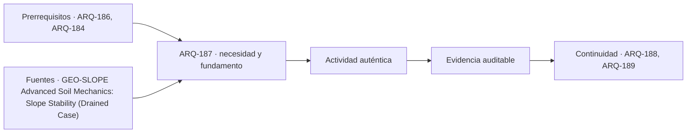

# ARQ-187 · Taludes, excavaciones y obras temporales

**Parte 19 · Clase desarrollada · Incorporada en v0.12.0.**

Prerrequisitos conceptuales: ARQ-186, ARQ-184. Sin calendario. Los casos y parámetros son ficticios; no son levantamientos, ensayos ni pruebas con personas reales. Revisión externa especializada pendiente.

## Pregunta central

¿Por qué una excavación o un talud necesita analizarse como un estado propio, y cómo puede el agua modificar una comprobación de equilibrio aunque la geometría visible no cambie?

## Resultado y continuidad

ARQ-186 incorporó ejecución y entorno a la comparación de fundaciones. Esta clase estudia fuerzas sobre una superficie potencial ficticia y distingue esa cuenta de un análisis completo de estabilidad. **TALUD-FUERZAS-01** no tiene dimensiones de excavación ni representa GEO-BASE-01. Elaborarás un balance y una matriz de estados temporales. No se entregan ángulos seguros, secuencias de excavación ni procedimientos de sostenimiento. ARQ-188 añadirá acciones sísmicas y efectos del sitio que este modelo estático no contiene.

## 1. El sistema temporal no es el edificio terminado

Una excavación modifica geometría, confinamiento y relaciones con el agua. Las condiciones durante una etapa pueden diferir de las del proyecto final. Un elemento previsto para más adelante no está disponible antes de ejecutarse y verificarse; una línea de separación en el plano no demuestra independencia de las zonas.

La investigación debe considerar terreno, cargas próximas, redes, accesos, construcciones vecinas y condiciones hidráulicas pertinentes. No se puede deducir estabilidad a partir de que una superficie haya permanecido expuesta durante cierto tiempo. La ausencia de un evento observado no define resistencia ni duración futura.

El estudiante identifica decisiones y dependencias, no autoriza ocupación de una excavación. El diseño, control y ejecución requieren responsables competentes y procedimientos aplicables. Los ejemplos se limitan a mecánica ideal y lectura crítica de información; no deben utilizarse para improvisar obras temporales.

## 2. Superficie potencial y mecanismo supuesto

Un modelo de equilibrio necesita definir qué masa o cuerpo se estudia y qué fuerzas actúan. Una superficie potencial de desplazamiento es una hipótesis de mecanismo, no una grieta necesariamente observada. Su posición y forma influyen en las fuerzas y en la resistencia movilizable.

Los apuntes de estabilidad drenada consultados distinguen métodos y supuestos de equilibrio, incluyendo la necesidad de investigar mecanismos pertinentes [[GEO-SLOPE]](#FUENTE-GEO-SLOPE). Comprobar una superficie elegida no demuestra que no exista otra más desfavorable. Tampoco un dibujo detallado resuelve la incertidumbre de los parámetros.

En TALUD-FUERZAS-01 se entregan directamente fuerzas resultantes y área. No se derivan de un talud real, no se busca una superficie crítica y no se modelan grietas, deformaciones o distribución de agua. La simplificación permite comprender relaciones sin presentar la cuenta como análisis de una excavación.

## 3. Fuerza normal, agua y resistencia por fricción

Sobre el plano ficticio actúa una fuerza normal total N y una resultante de presión de agua U. Bajo la idealización drenada, la fuerza normal efectiva se expresa como `N′ = N−U`. Es la versión resultante de la distinción entre esfuerzo total y efectivo de ARQ-184.

Adoptamos una resistencia disponible del modelo `R = c′ A + (N−U) tan φ′`, donde c′ tiene unidades de esfuerzo, A de área y φ′ es un parámetro angular del modelo resistente. Los apuntes consultados utilizan la relación entre resistencia, esfuerzo efectivo y parámetros drenados [[GEO-SLOPE]](#FUENTE-GEO-SLOPE).

El ángulo φ′ no es un ángulo de excavación recomendado. Tampoco c′ representa adhesión permanente garantizada en cualquier condición. Deben justificarse parámetros, estado drenado y alcance del modelo. Si N−U fuera negativo, no se continúa asignando fricción negativa como si el contacto compresivo siguiera describiéndose adecuadamente.

## 4. Cociente entre resistencia y solicitación

Si T es la fuerza que tiende al desplazamiento en el mecanismo adoptado, podemos formar `F_modelo = R/T`. El cociente es adimensional. Dentro del modelo, un valor menor que uno indica que la resistencia calculada no alcanza esa solicitación; uno no incluye margen. Ninguno de esos resultados representa por sí solo un criterio normativo de una obra.

Un valor mayor que uno tampoco autoriza excavación. Faltan representatividad de parámetros, mecanismos alternativos, incertidumbres, estados, acciones y criterios aplicables. No se entrega un umbral universal a partir del cual el estudiante pueda declarar seguridad.

La palabra factor debe acompañarse del modelo y de sus hipótesis. Un informe que muestra solo un número pierde información fundamental. El lector necesita saber qué mecanismo se examinó, con qué agua y parámetros y qué quedó fuera. La utilidad educativa es reconstruir esa relación, no memorizar una cifra tranquilizadora.

## 5. Caso trabajado: la presión de agua cambia el resultado

TALUD-FUERZAS-01 adopta A = 2 m², c′ = 8 kPa, N = 100 kN, U = 20 kN, φ′ = 30° y T = 60 kN. El término c′A es 16 kN. N′ = 80 kN y la contribución friccional es `80 tan30° = 46,188 kN`, aproximadamente.

R suma 62,188 kN y el cociente es 1,03647. No se redondea a «seguro» ni se interpreta como una probabilidad. El resultado muestra que, bajo esos datos exactos y ese único mecanismo, resistencia y solicitación están próximas. No informa sobre el grado real de incertidumbre.

Una variante aumenta U a 40 kN, conservando N, T, A, c′ y φ′. La contribución friccional baja a `60 tan30° = 34,641 kN`; R queda en 50,641 y el cociente en 0,84402. La geometría no cambió en el ejercicio, pero el estado de fuerzas sí. El agua no puede tratarse como una decoración del corte.

*Figura 187. TALUD-FUERZAS-01: comparación de dos estados estáticos ideales. Los cocientes no son criterios de aceptación ni un diseño de excavación.*

## 6. Sensibilidad no es investigación de terreno

La diferencia entre ambos estados permite identificar una variable importante. No demuestra que U real vaya a alcanzar cuarenta kN ni que controlar una sola condición resuelva todo el problema. Una sensibilidad varía entradas de un modelo; una investigación produce evidencia sobre el sitio y sus posibles estados.

Si también cambia N por una acción próxima o T por otra geometría, se necesita una variante nueva. No se atribuye todo cambio de resultado al agua cuando se modificaron varios términos. La tabla debe conservar el estado base y documentar qué permaneció fijo.

Una incertidumbre en φ′ también afecta el resultado, pero no debe expresarse mediante un intervalo arbitrario para aparentar rigor. Los parámetros y sus rangos necesitan fundamento. El programa puede enseñar a calcular sensibilidad, no inventar la distribución de propiedades de un terreno que no fue ensayado.

## 7. Drenado y no drenado requieren condiciones distintas

El modelo presentado usa parámetros efectivos y presión de agua explícita. No debe mezclarse con una resistencia no drenada obtenida e interpretada bajo otra idealización. Sustituir c′ por cualquier número de cohesión de una tabla puede combinar conceptos incompatibles.

La elección depende del material, historia, duración de acciones y posibilidad de drenaje, entre otros aspectos. No basta clasificar arena o arcilla para decidir automáticamente todos los estados de una obra. ARQ-182 introdujo esa dependencia y ARQ-184 mostró por qué las condiciones hidráulicas necesitan evidencia.

El estudiante debe preguntar qué estado representa el análisis y cómo se justificó. Si el informe usa dos enfoques, debe comprender cuáles escenarios estudia cada uno y qué parámetros les corresponden. No selecciona el resultado más favorable ni promedia factores de mecanismos diferentes para producir una conclusión global.

## 8. Matriz de estados y dependencias

Una matriz conceptual puede distinguir estado inicial, etapa de intervención y estado final previsto. Para cada uno registra geometría, elementos efectivamente disponibles, cargas, agua, accesos y evidencias de revisión. No asigna una secuencia de obra ni permite iniciar actividades: organiza preguntas para quienes deben diseñarlas y controlarlas.

Un apoyo temporal no se presume permanente por aparecer en un dibujo. Un elemento final no sostiene una fase anterior. Un acceso de maquinaria puede modificar acciones o relaciones espaciales que deben estudiarse. La comparación debe incluir esos estados, no solamente una imagen limpia del resultado terminado.

Las modificaciones se comunican con versión y alcance. Si cambia profundidad, ubicación, condición de agua o entorno, se revisa qué análisis queda afectado. Una aprobación referida a otra geometría no se traslada automáticamente. La trazabilidad de ARQ-138 es especialmente importante donde una decisión temporal condiciona otras actividades.

## 9. Observación, instrumentos y decisiones

Un sistema de seguimiento necesita magnitudes, referencias, frecuencia y criterios definidos por responsables competentes. Una lectura sin datum o sin historial no permite interpretar movimiento. Tampoco un dato aislado debe traducirse automáticamente en causa o estabilidad.

La ausencia de variación en un instrumento no demuestra que todos los mecanismos estén controlados. Puede observar una magnitud diferente o una zona limitada. La relación entre modelo y medición debe explicarse: qué hipótesis se contrasta, qué rango se espera y qué decisiones corresponden a cada estado bajo el plan profesional.

No se incluyen umbrales de alarma ni instrucciones de respuesta para una obra real. Esa información depende del proyecto y de protocolos competentes. En la práctica del curso se utilizan registros ficticios y se identifica qué debe definirse; no se invita a inspeccionar zonas peligrosas ni a realizar mediciones en excavaciones activas.

## 10. Construcciones vecinas y comunicación del alcance

El entorno no termina en la línea de propiedad. Una intervención puede requerir estudiar elementos, redes y edificaciones próximas. La geometría visible del vecino no revela su fundación ni su condición interna. Los antecedentes deben obtenerse e interpretarse mediante canales y profesionales adecuados.

Un registro previo de condiciones ayuda a distinguir estados, pero no demuestra causalidad por sí solo. Si se observan diferencias después de una intervención, hace falta investigar referencias, historia, otras acciones y mecanismos. No se atribuyen responsabilidades a partir de dos fotografías sin contexto.

La comunicación debe indicar qué fue observado, qué se analizó y qué permanece desconocido. El modelo de fuerzas de este capítulo no se incorpora como certificado del predio GEO. ARQ-189 retomará la relación entre suelo, estructura y vecinos mediante otro modelo, conservando las fronteras entre ejercicios.

## Práctica independiente

En un plano ficticio separado, A = 3 m², c′ = 6 kPa, N = 120 kN, U = 30 kN, φ′ = 28° y T = 80 kN. Calcula N′, cada contribución resistente, R y el cociente R/T. Repite con U = 10 kN, manteniendo todos los demás datos.

Explica por qué el segundo resultado no autoriza una excavación ni una acción para bajar agua. Un compañero propone usar φ′ = 28° como inclinación segura del terreno. Identifica el error conceptual. Finalmente redacta una fila de matriz de estados donde un elemento futuro todavía no pueda contarse como disponible.

Solución razonada

Con U = 30, N′ = 90 kN; c′A = 18 kN; la fricción es aproximadamente 47,85385. R = 65,85385 y R/T = 0,82317. Con U = 10, N′ = 110; la fricción es 58,48804; R = 76,48804 y el cociente 0,95610. En ambos casos la resistencia ideal calculada es menor que la solicitación entregada.

La modificación de U es matemática, no un procedimiento de control. φ′ es un parámetro resistente y no una geometría segura. Una fila adecuada distingue el estado previo a ejecutar un elemento del estado posterior a su verificación; no usa la capacidad prevista en el primero. La respuesta conserva la necesidad de análisis profesional y no convierte la matriz en permiso de intervención.

## Autoevaluación y enlace

Puedes reconstruir fuerzas, reconocer el papel del agua y mantener separados mecanismo, parámetro y criterio. ARQ-188 estudiará procesos asociados a sacudida sísmica y características del sitio que no aparecen en este equilibrio estático.

<!-- pedagogia-2026:inicio -->
## Decisión pedagógica y posición curricular

### Por qué existe

Esta clase existe para resolver una necesidad concreta del recorrido: ¿Por qué una excavación o un talud necesita analizarse como un estado propio, y cómo puede el agua modificar una comprobación de equilibrio aunque la geometría visible no cambie?

### Por qué está exactamente aquí

Ocupa el lugar 7 de la Parte 19. Se estudia después de ARQ-186 · Fundaciones superficiales y profundas: selección conceptual porque usa esa base para responder «¿Por qué una excavación o un talud necesita analizarse como un estado propio, y cómo puede el agua modificar una comprobación de equilibrio aunque la geometría visible no cambie?». Se ubica antes de ARQ-188 · Licuefacción y efectos del sitio porque la evidencia producida aquí debe estar disponible para ese paso.

- **Prerrequisitos:** `ARQ-186`, `ARQ-184`
- **Capacidad que introduce:** ARQ-186 incorporó ejecución y entorno a la comparación de fundaciones. Esta clase estudia fuerzas sobre una superficie potencial ficticia y distingue esa cuenta de un análisis completo de estabilidad. TALUD-FUERZAS-01 no tiene dimensiones de excavación ni representa GEO-BASE-01.
- **Clases o experiencias que dependen de ella:** `ARQ-188`, `ARQ-189`

El diagrama permite comprobar una relación que el texto lineal oculta con facilidad: esta clase recibe capacidades previas, toma decisiones apoyadas por fuentes, exige una experiencia y produce evidencia que habilita trabajo posterior. No representa un procedimiento de obra.

## Resultado observable, evidencia y evaluación

1. Identificar y delimitar las condiciones necesarias para responder la pregunta central de taludes, excavaciones y obras temporales.
2. Producir y comprobar la evidencia declarada por la clase: ARQ-186 incorporó ejecución y entorno a la comparación de fundaciones. Esta clase estudia fuerzas sobre una superficie potencial ficticia y distingue esa cuenta de un análisis completo de estabilidad. TALUD-FUERZAS-01 no tiene dimensiones de excavación ni representa GEO-BASE-01.
3. Justificar una decisión de taludes, excavaciones y obras temporales mediante fuentes, supuestos, alternativas y límites explícitos.

## Actividad, evidencia y criterio de aceptación

**Actividad:** En un plano ficticio separado, A = 3 m², c′ = 6 kPa, N = 120 kN, U = 30 kN, φ′ = 28° y T = 80 kN. Calcula N′, cada contribución resistente, R y el cociente R/T. Repite con U = 10 kN, manteniendo todos los demás datos.

**Evidencia mínima:** ARQ-186 incorporó ejecución y entorno a la comparación de fundaciones. Esta clase estudia fuerzas sobre una superficie potencial ficticia y distingue esa cuenta de un análisis completo de estabilidad. TALUD-FUERZAS-01 no tiene dimensiones de excavación ni representa GEO-BASE-01.

**Archivo sugerido:** `evidence/ARQ-187/evidencia.md`.

**Criterio de aceptación:** la entrega se acepta cuando:

- La entrega responde explícitamente a la pregunta: ¿Por qué una excavación o un talud necesita analizarse como un estado propio, y cómo puede el agua modificar una comprobación de equilibrio aunque la geometría visible no cambie?
- La actividad conserva las fronteras del caso y permite reconstruir el procedimiento: En un plano ficticio separado, A = 3 m², c′ = 6 kPa, N = 120 kN, U = 30 kN, φ′ = 28° y T = 80 kN. Calcula N′, cada contribución resistente, R y el cociente R/T. Repite con U = 10 kN, manteniendo todos los demás datos.
- Cada afirmación externa puede seguirse hasta una fuente, su alcance consultado y su límite.
- La evidencia deja disponible una entrada comprobable para ARQ-188.
- Puedes reconstruir fuerzas, reconocer el papel del agua y mantener separados mecanismo, parámetro y criterio. ARQ-188 estudiará procesos asociados a sacudida sísmica y características del sitio que no aparecen en este equilibrio estático.

La [rúbrica común](../../docs/RUBRICA_COMUN.md) complementa estos criterios; no los reemplaza. Una entrega puede superar un promedio y continuar pendiente si oculta una condición crítica.

## Trazabilidad de las decisiones

| # | Decisión o fundamento | Fuente utilizada | Aplicación y límite en esta clase |
|---:|---|---|---|
| 1 | Relacionar fuerzas resistentes, solicitantes, hipótesis de superficie y agua. | [GEO-SLOPE Advanced Soil Mechanics: Slope Stability (Drained Case)](https://ocw.mit.edu/courses/1-361-advanced-soil-mechanics-fall-2004/a1586eb80e4faccc173e8d3432319b37_part_iv_6.pdf) | Consulta: Páginas 1–3 del PDF: alcance, equilibrio y efecto de presión de poros; inspección visual. Límite: No se aplican programas o recomendaciones históricas como práctica vigente; el cociente del ejemplo no autoriza una excavación ni constituye un factor normativo exigible. |

La tabla permite auditar las relaciones; la explicación, el caso y la práctica de la clase siguen siendo la documentación principal.

## Autoevaluación, recuperación y continuidad

### Errores diagnósticos

Antes de avanzar, comprueba si puedes reconstruir cada resultado sin mirar la solución, señalar qué evidencia lo sostiene y nombrar una condición que obligaría a revisar tu decisión. Conserva la primera versión, la objeción recibida y la revisión.

**Conexión siguiente:** La continuidad inmediata es ARQ-188 · Licuefacción y efectos del sitio; conserva el método y vuelve a verificar datos y límites.
<!-- pedagogia-2026:fin -->

## Fuentes y alcance de uso

Los casos, dibujos, derivaciones docentes y soluciones son originales. Las referencias respaldan los conceptos indicados, no las cifras ficticias. Consulta de fuentes nuevas: 21 de septiembre de 2026. Las referencias heredadas conservan su alcance; no se afirma lectura íntegra cuando el acceso fue parcial.

### [[GEO-SLOPE]](#FUENTE-GEO-SLOPE) Advanced Soil Mechanics: Slope Stability (Drained Case)

Charles C. Ladd y Lucy C. Jen / MIT OpenCourseWare. [https://ocw.mit.edu/courses/1-361-advanced-soil-mechanics-fall-2004/a1586eb80e4faccc173e8d3432319b37_part_iv_6.pdf](https://ocw.mit.edu/courses/1-361-advanced-soil-mechanics-fall-2004/a1586eb80e4faccc173e8d3432319b37_part_iv_6.pdf)

**Consulta:** Páginas 1–3 del PDF: alcance, equilibrio y efecto de presión de poros; inspección visual. **Apoyo:** Relacionar fuerzas resistentes, solicitantes, hipótesis de superficie y agua. **Límite:** No se aplican programas o recomendaciones históricas como práctica vigente; el cociente del ejemplo no autoriza una excavación ni constituye un factor normativo exigible.
