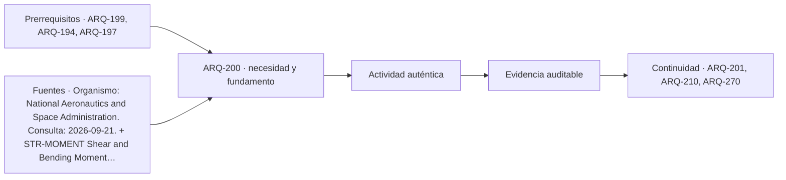

# ARQ-200 · Lectura de resultados sin delegar el juicio al software

**Parte 20 · Clase desarrollada · Incorporada en v0.13.0.**

Prerrequisitos conceptuales: ARQ-199, ARQ-194, ARQ-197. Sin calendario. Los parámetros, ensayos y casos son didácticos y ficticios; no dimensionan una obra ni acreditan seguridad. Revisión externa especializada pendiente.

## Pregunta central

¿Cómo revisar una salida de cálculo de manera que una imagen convincente, un residuo pequeño o una suma correcta no sustituyan la comprensión del modelo y de sus límites?

## Resultado y continuidad

Esta clase cierra la parte 20. Recibe EST-V191, FLEX-01/02, ACC-L/R y MEF-01 como casos diferenciados. Construirás un informe de revisión con comprobaciones reproducibles y hallazgos clasificados. Los errores del documento **REV-EST-01** se han inventado deliberadamente para aprender; no proceden de un programa comercial ni de un profesional real. ARQ-201 trasladará los métodos a sistemas arquitectónicos, sin transformar estos ejercicios en un edificio calculado.

## 1. La primera pantalla debería ser el modelo

Antes de leer un máximo, identifica geometría, unidades, coordenadas, propiedades, vínculos, liberaciones y acciones. Una imagen deformada puede parecer razonable porque se amplificó gráficamente; su escala no demuestra que el desplazamiento sea aceptable ni que ocurra exactamente como se muestra.

Pregunta qué magnitud representa cada salida: desplazamiento relativo o absoluto, fuerza nodal o interna, tensión media o local, componente o combinación. Un resultado sin unidad y convención es incompleto. El nombre del archivo tampoco garantiza que la versión corresponda a los planos que estás revisando.

El enfoque de verificación y validación de NASA distingue comprobar requisitos de establecer adecuación al uso [[NASA-VERIFY]](#FUENTE-NASA-VERIFY). Aquí adaptamos esa separación: resolver las ecuaciones declaradas y representar adecuadamente la situación son tareas relacionadas, pero distintas. No afirmamos que una revisión docente constituya validación profesional.

## 2. Estimar antes de ejecutar

Una estimación independiente permite reconocer órdenes de magnitud, signos y simetrías esperables. Para FLEX-01, la carga total 24 kN y la simetría implican doce por apoyo. El momento central debería corresponder a una carga distribuida, no a otra concentración arbitraria.

Para MEF-01, los tramos en serie transmiten igual fuerza si no hay acciones intermedias. El tramo de menor área se alarga más. Si la salida muestra fuerza cero en ese tramo y el nodo final equilibrado, habría que revisar conectividad, cargas y restricciones.

No se trata de conocer de antemano toda la solución. Se trata de formular comprobaciones que podrían refutar un resultado. Cuando todas las revisiones consisten en aceptar lo que muestra el programa, no hay contraste independiente.

## 3. Caso REV-EST-01: una tabla parcialmente correcta

El informe ficticio declara analizar FLEX-01: L=6 m, w=4 kN/m, E=200 GPa e I=8×10⁻⁵ m⁴, articulación y rodillo. Publica reacciones 12 y 12 kN, momento central 36 kN·m y flecha central 6,75 mm. Concluye que la coincidencia de reacciones con la cuenta manual valida toda la respuesta.

Las reacciones son correctas para FLEX-01, pero momento y flecha corresponden a FLEX-02, que tiene 24 kN concentrados en el centro. El informe mezcló geometría y rótulo de un caso con la representación de carga de otro. La suma global no permite detectar por sí sola esa sustitución, porque ambos tienen igual fuerza total y centro de aplicación.

La observación correcta no es «el software no sirve», sino «la distribución de carga utilizada no coincide con el caso declarado; deben revisarse la entrada y todas las salidas dependientes». Tampoco se cambia solo la cifra del momento en la tabla dejando el archivo de análisis con la carga puntual.

## 4. Equilibrio global y equilibrio de segmentos

El balance global debe comparar resultantes de acciones y reacciones, con signos y puntos de referencia comunes. En un modelo tridimensional incluye componentes de fuerza y momento. Una suma de magnitudes absolutas puede ocultar direcciones contrarias o contar resultados incompatibles.

Para FLEX-01, un corte en x=1 m permite una comprobación local: `V=12−4×1=8 kN`, `M=12×1−4×1²/2=10 kN·m`. FLEX-02, antes de la carga central, tendría V=12 y M=12 en ese punto. El contraste local distingue modelos que el equilibrio global no distingue.

El procedimiento de diagramas [[STR-MOMENT]](#FUENTE-STR-MOMENT) ayuda a revisar esa relación entre carga, cortante y momento. Un punto de carga concentrada produce un salto de cortante; un tramo con carga distribuida cambia su pendiente. La forma del resultado debe conversar con la forma de la entrada.

## 5. Residuo numérico y escala de la comprobación

En los grados libres de un sistema lineal, el residuo es `r=Ku−f`. Un residuo pequeño muestra que la solución satisface aproximadamente esas ecuaciones. No demuestra que K y f representen la estructura deseada. Una matriz equivocada puede resolverse con gran precisión.

Una tolerancia numérica debe relacionarse con unidades y escalas. Un residuo de 0,001 N y otro de 0,001 kN no son iguales. Para informar un error relativo puede normalizarse por una fuerza de referencia explícita y evitar divisiones por cero; momentos requieren una escala de fuerza por longitud, no sumarse sin conversión a fuerzas.

Las tolerancias de las pruebas de código de este programa son controles numéricos de ejemplos, no límites estructurales. Su elección no define deformaciones aceptables, seguridad o incertidumbre de mediciones. Es importante conservar esa diferencia incluso cuando la salida diga «prueba aprobada».

## 6. Error de unidades que conserva el equilibrio

REV-EST-01 contiene también una versión de MEF-01 que interpreta 400 mm² como 400 cm² y 200 mm² como 200 cm². Las áreas se multiplican por cien. Las reacciones y fuerzas siguen en 24 kN porque el sistema axial en serie las determina por equilibrio.

Los desplazamientos, en cambio, se dividen por cien: u1 pasa a 0,003 mm y u2 a 0,009 mm. Las tensiones también se reducen cien veces. El sistema puede presentar residuo nulo y fuerzas perfectamente equilibradas mientras utiliza una geometría distinta.

La corrección debe hacerse en la entrada y en sus metadatos, volver a ejecutar y comparar resultados. No es suficiente multiplicar una flecha por cien en un informe sin asegurar que tensiones, energía y modelos posteriores se actualizaron. La trazabilidad de cambios [[NASA-CHANGE]](#FUENTE-NASA-CHANGE) se aplica a todo el conjunto dependiente.

## 7. Envolventes y casos que no pueden mezclarse

El informe muestra máximos de reacción 16,5 y 16,5 kN de ACC-L/R y los utiliza como una pareja simultánea para revisar una fuerza total de treinta. Esa pareja suma 33 porque sus máximos provienen de dos situaciones distintas. No es un error de aritmética ni necesariamente del cálculo de cada caso.

Debe mantenerse el identificador del caso que produce cada extremo. Si otra especialidad necesita acciones simultáneas, se transfieren conjuntos coherentes, no máximos independientes sin sus relaciones. El mismo cuidado corresponde a componentes de desplazamiento o esfuerzos que pueden alcanzar sus extremos en instantes distintos.

Una envolvente sigue siendo útil para una pregunta concreta. El hallazgo no exige descartarla, sino corregir la interpretación y el uso que se hace de ella. La revisión profunda evita tanto aceptar todo como rechazar información válida por un mal empleo posterior.

*Figura 200. El equilibrio global, el control local, las unidades y la pertinencia del modelo son comprobaciones diferentes. Ninguna casilla sustituye a las demás.*

## 8. Malla refinada y afirmación excesiva

Una cuarta frase del informe afirma que una malla con mil elementos valida el modelo. ARQ-199 mostró lo contrario con una barra de área mal promediada: refinar el mismo error de geometría no recupera la distribución original.

La secuencia de refinamiento debe declarar qué magnitud se sigue, qué parámetros permanecen constantes y qué referencia se utiliza. Si cambia el apoyo al mismo tiempo que la malla, la diferencia no puede atribuirse únicamente al número de elementos.

Tampoco una tensión máxima creciente en una esquina ideal implica automáticamente rotura de una pieza real. Puede exigir revisar singularidades, geometría de detalle y tipo de resultado. La interpretación pertenece a un modelo físico y a criterios pertinentes, no a un color rojo aislado.

## 9. Redactar una revisión útil

Una observación completa identifica evidencia, discrepancia, consecuencia y acción siguiente. Por ejemplo: «El caso declarado incluye 4 kN/m distribuidos, pero sus resultados internos coinciden con 24 kN concentrados. Se solicita confirmar la representación de cargas, regenerar diagramas y desplazamientos y mantener la versión anterior identificada».

Otra puede decir: «Las fuerzas axiales de MEF-01 cierran equilibrio. Sin embargo, la entrada utiliza cm² donde el caso prescribe mm². Deben corregirse propiedades y actualizar desplazamientos, tensiones y energía; el equilibrio positivo no cierra esta revisión».

El cierre no declara segura o insegura una obra inexistente. Señala qué cuentas se comprobaron, cuáles deben repetirse y qué afirmaciones todavía no tienen respaldo. No atribuye intenciones ni incompetencia a una persona por errores inventados para el ejercicio.

## 10. Responsabilidades y revisión independiente

El arquitecto necesita entender cómo decisiones de espacio, aberturas o instalaciones afectan el modelo, pero no sustituye automáticamente al ingeniero responsable. El calculista debe conservar coherencia entre hipótesis, análisis y detalles. Una revisión independiente tiene también un alcance que debe conocerse: no equivale a ensayar cada componente.

El programa no asigna facultades legales. Enseña a formular preguntas suficientemente concretas para que puedan ser respondidas y registradas. «Revisar estructura» es demasiado general; «confirmar si esta conexión admite el giro supuesto y qué cambio afecta su rigidez» vincula una decisión con una evidencia.

Cuando una modificación cambia la base, se revisan los análisis afectados. Conservar el PDF anterior puede ser útil para trazabilidad; presentarlo como actual sin advertir el cambio no lo es. El expediente debe permitir reconstruir quién utilizó qué versión y para qué decisión.

## Práctica independiente

Un informe declara una viga de cuatro metros con 3 kN/m y EI=8×10⁶ N·m². Publica reacciones 6 y 6 kN, momento central 12 kN·m y flecha 2 mm. Analiza qué datos son consistentes con la declaración y qué sustitución explica los otros valores. Comprueba además un corte en x=1 m.

Otra salida de MEF-01 utiliza 18 kN y entrega u1=0,225 mm, u2=0,675 mm y reacción −18 kN. El revisor rechaza el modelo porque u2 no es el doble de u1. Explica por qué esa objeción es incorrecta y redacta una comprobación mejor. Añade una observación sobre lo que ninguno de estos ejercicios acredita.

Solución razonada

Las reacciones corresponden a la carga total doce kN. Para carga distribuida, el momento central correcto es 6 kN·m y la flecha 1,25 mm. Los valores 12 y 2 corresponden a doce kN concentrados en el centro. En x=1 m, el caso distribuido tiene <code>V=6−3=3 kN</code> y <code>M=6−1,5=4,5 kN·m</code>; el puntual, antes del centro, tendría V=6 y M=6.

En MEF-01 el segundo tramo tiene la mitad del área y el doble de flexibilidad axial. Su alargamiento 0,450 mm es dos veces el del primero; u2 es la suma,0,675, por tanto tres veces u1. La objeción confundió desplazamiento nodal con alargamiento del segundo elemento. La comprobación correcta calcula <code>80×0,225=18</code> y <code>40×(0,675−0,225)=18 kN</code>.

Las cuentas no verifican resistencia, estabilidad, conexión, cimentación ni cumplimiento de un edificio. El informe docente debe conservar ese límite junto con sus resultados positivos; no borrar las comprobaciones válidas ni extenderlas fuera de su alcance.

## Autoevaluación y entrega a la parte 21

Puedes revisar un resultado por unidades, equilibrio, cortes, compatibilidad y procedencia; escribir una devolución sin confundir error numérico con error de modelo; y conservar casos simultáneos. ARQ-201 abrirá un recinto estructural ficticio independiente para comparar muros, pórticos y otros sistemas mediante estos mismos métodos.

<!-- pedagogia-2026:inicio -->
## Decisión pedagógica y posición curricular

### Por qué existe

Esta clase existe para resolver una necesidad concreta del recorrido: ¿Cómo revisar una salida de cálculo de manera que una imagen convincente, un residuo pequeño o una suma correcta no sustituyan la comprensión del modelo y de sus límites?

### Por qué está exactamente aquí

Cierra la Parte 20: integra lo producido en ARQ-199 · Modelos, discretización y error de idealización para responder «¿Cómo revisar una salida de cálculo de manera que una imagen convincente, un residuo pequeño o una suma correcta no sustituyan la comprensión del modelo y de sus límites?». La transición hacia ARQ-201 · Muros portantes y distribución del espacio transfiere el método y la disciplina de evidencia, no los datos o parámetros particulares de esta parte.

- **Prerrequisitos:** `ARQ-199`, `ARQ-194`, `ARQ-197`
- **Capacidad que introduce:** Esta clase cierra la parte 20. Recibe EST-V191, FLEX-01/02, ACC-L/R y MEF-01 como casos diferenciados. Construirás un informe de revisión con comprobaciones reproducibles y hallazgos clasificados.
- **Clases o experiencias que dependen de ella:** `ARQ-201`, `ARQ-210`, `ARQ-270`

El diagrama permite comprobar una relación que el texto lineal oculta con facilidad: esta clase recibe capacidades previas, toma decisiones apoyadas por fuentes, exige una experiencia y produce evidencia que habilita trabajo posterior. No representa un procedimiento de obra.

## Resultado observable, evidencia y evaluación

1. Identificar y delimitar las condiciones necesarias para responder la pregunta central de lectura de resultados sin delegar el juicio al software.
2. Producir y comprobar la evidencia declarada por la clase: Esta clase cierra la parte 20. Recibe EST-V191, FLEX-01/02, ACC-L/R y MEF-01 como casos diferenciados. Construirás un informe de revisión con comprobaciones reproducibles y hallazgos clasificados.
3. Justificar una decisión de lectura de resultados sin delegar el juicio al software mediante fuentes, supuestos, alternativas y límites explícitos.

## Actividad, evidencia y criterio de aceptación

**Actividad:** Un informe declara una viga de cuatro metros con 3 kN/m y EI=8×10⁶ N·m². Publica reacciones 6 y 6 kN, momento central 12 kN·m y flecha 2 mm. Analiza qué datos son consistentes con la declaración y qué sustitución explica los otros valores.

**Evidencia mínima:** Esta clase cierra la parte 20. Recibe EST-V191, FLEX-01/02, ACC-L/R y MEF-01 como casos diferenciados. Construirás un informe de revisión con comprobaciones reproducibles y hallazgos clasificados.

**Archivo sugerido:** `evidence/ARQ-200/evidencia.md`.

**Criterio de aceptación:** la entrega se acepta cuando:

- La entrega responde explícitamente a la pregunta: ¿Cómo revisar una salida de cálculo de manera que una imagen convincente, un residuo pequeño o una suma correcta no sustituyan la comprensión del modelo y de sus límites?
- La actividad conserva las fronteras del caso y permite reconstruir el procedimiento: Un informe declara una viga de cuatro metros con 3 kN/m y EI=8×10⁶ N·m². Publica reacciones 6 y 6 kN, momento central 12 kN·m y flecha 2 mm. Analiza qué datos son consistentes con la declaración y qué sustitución explica los otros valores.
- Cada afirmación externa puede seguirse hasta una fuente, su alcance consultado y su límite.
- La evidencia deja disponible una entrada comprobable para ARQ-201.
- Puedes revisar un resultado por unidades, equilibrio, cortes, compatibilidad y procedencia; escribir una devolución sin confundir error numérico con error de modelo; y conservar casos simultáneos. ARQ-201 abrirá un recinto estructural ficticio independiente para comparar muros, pórticos y otros sistemas mediante estos mismos métodos.

La [rúbrica común](../../docs/RUBRICA_COMUN.md) complementa estos criterios; no los reemplaza. Una entrega puede superar un promedio y continuar pendiente si oculta una condición crítica.

## Trazabilidad de las decisiones

| # | Decisión o fundamento | Fuente utilizada | Aplicación y límite en esta clase |
|---:|---|---|---|
| 1 | Distinguir conformidad con requisitos de adecuación al uso | [Organismo: National Aeronautics and Space Administration. Consulta:…](https://www.nasa.gov/reference/5-0-product-realization/) | Consulta: Apartados web de verificación y validación Límite: La verificación de cálculos no constituye validación de un edificio. |
| 2 | Obtener V y M por cortes, manteniendo una convención de signos. | [STR-MOMENT Shear and Bending Moment Diagrams](https://ocw.mit.edu/courses/3-11-mechanics-of-materials-fall-1999/b8e832b3c8bf3c1700c26425a4baddb1_MIT3_11F99_statics.pdf) | Consulta: Secciones de equilibrio de segmentos y construcción de diagramas. Límite: Las convenciones del curso se declaran por separado; no se copian casos. |
| 3 | Línea base, trazabilidad y análisis del impacto de cambios | [Organismo: National Aeronautics and Space Administration. Consulta:…](https://www.nasa.gov/reference/6-0-crosscutting-technical-management/) | Consulta: Apartados 6.2 y 6.5 sobre requisitos y configuración Límite: Los formularios y el caso arquitectónico son originales; no se copian procedimientos contractuales. |

La tabla permite auditar las relaciones; la explicación, el caso y la práctica de la clase siguen siendo la documentación principal.

## Autoevaluación, recuperación y continuidad

### Errores diagnósticos

Antes de avanzar, comprueba si puedes reconstruir cada resultado sin mirar la solución, señalar qué evidencia lo sostiene y nombrar una condición que obligaría a revisar tu decisión. Conserva la primera versión, la objeción recibida y la revisión.

**Conexión siguiente:** La continuidad inmediata es ARQ-201 · Muros portantes y distribución del espacio; conserva el método y vuelve a verificar datos y límites.
<!-- pedagogia-2026:fin -->

## Fuentes y alcance de uso

Los ejemplos, diagramas y desarrollos numéricos son originales. Las fuentes fundamentan los conceptos señalados, no los parámetros ficticios. Consulta de fuentes nuevas: 21 de septiembre de 2026. No se afirma lectura íntegra de normas o manuales cuando el alcance fue parcial.

### [[NASA-VERIFY]](#FUENTE-NASA-VERIFY) NASA Systems Engineering Handbook, 5.0: Product Realization

National Aeronautics and Space Administration. [https://www.nasa.gov/reference/5-0-product-realization/](https://www.nasa.gov/reference/5-0-product-realization/)

**Consulta:** Apartados web de verificación y validación **Apoyo:** Distinguir conformidad con requisitos de adecuación al uso **Límite:** La verificación de cálculos no constituye validación de un edificio.

### [[STR-MOMENT]](#FUENTE-STR-MOMENT) Shear and Bending Moment Diagrams

David Roylance / MIT OpenCourseWare. [https://ocw.mit.edu/courses/3-11-mechanics-of-materials-fall-1999/b8e832b3c8bf3c1700c26425a4baddb1_MIT3_11F99_statics.pdf](https://ocw.mit.edu/courses/3-11-mechanics-of-materials-fall-1999/b8e832b3c8bf3c1700c26425a4baddb1_MIT3_11F99_statics.pdf)

**Consulta:** Secciones de equilibrio de segmentos y construcción de diagramas. **Apoyo:** Obtener V y M por cortes, manteniendo una convención de signos. **Límite:** Las convenciones del curso se declaran por separado; no se copian casos.

### [[NASA-CHANGE]](#FUENTE-NASA-CHANGE) NASA Systems Engineering Handbook, 6.0: Crosscutting Technical Management

National Aeronautics and Space Administration. [https://www.nasa.gov/reference/6-0-crosscutting-technical-management/](https://www.nasa.gov/reference/6-0-crosscutting-technical-management/)

**Consulta:** Apartados 6.2 y 6.5 sobre requisitos y configuración **Apoyo:** Línea base, trazabilidad y análisis del impacto de cambios **Límite:** Los formularios y el caso arquitectónico son originales; no se copian procedimientos contractuales.
