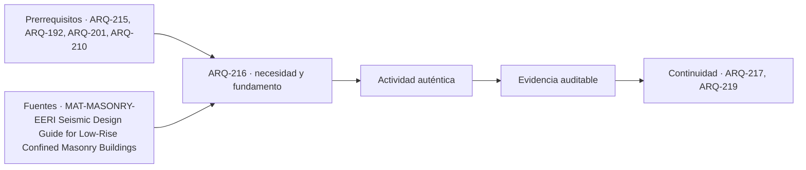

# ARQ-216 · Albañilería confinada, armada y no reforzada

**Parte 22 · Clase desarrollada · Incorporada en v0.14.0.**

Prerrequisitos conceptuales: ARQ-215, ARQ-192, ARQ-201, ARQ-210. Sin calendario. Casos y parámetros ficticios, salvo antecedentes expresamente atribuidos. Material de estudio; revisión externa especializada pendiente.

## Pregunta central

¿Qué cambia cuando un muro está confinado, contiene armaduras o funciona como relleno de un pórtico, aunque las tres construcciones parezcan una pared entre columnas?

## Resultado y continuidad

ARQ-215 mostró que unidades y juntas no responden como materiales independientes. Ahora ampliarás la frontera al sistema: muro, conexiones, elementos de borde, entrepiso y fundación. Entregarás tres cortes conceptuales, una comparación de mecanismos y un reparto elástico ficticio. **ALB-SIS-01** no es EST-HALL ni representa un proyecto autorizado. Su finalidad es conectar organización espacial y mecánica antes de estudiar deterioro y exposición.

## 1. Un vocabulario que describe funciones

La albañilería reúne unidades y juntas en una organización material. Para estudiar su papel hay que preguntar si recibe acciones verticales, participa frente a acciones laterales, delimita espacios o combina esas funciones. «Es de ladrillo» describe parte del material, no responde qué sistema lo sostiene.

En una albañilería no reforzada no se incorpora una armadura distribuida diseñada para proporcionar el comportamiento de una albañilería armada. Eso no significa que toda pieza carezca de cualquier amarre ni que todas las construcciones así denominadas tengan idéntica capacidad. En una albañilería armada, el refuerzo se integra en el sistema de unidades, rellenos y juntas conforme a un proyecto específico. No basta observar una barra aislada para identificar su continuidad, anclaje o participación.

La albañilería confinada combina paños con elementos de confinamiento. La guía EERI/IAEE distingue este sistema de pórticos de hormigón que reciben posteriormente un relleno; describe diferencias de función y secuencia [[MAT-MASONRY-EERI]](#FUENTE-MAT-MASONRY-EERI). El concepto no se reduce a dibujar un marco alrededor de cualquier muro existente. La relación entre materiales y la forma de construirla pertenecen al sistema que debe investigarse.

## 2. Por qué importa la secuencia

Un muro que se construye antes de los elementos que lo confinan establece interfaces distintas de un relleno insertado en un marco previamente ejecutado. La secuencia influye en contactos, compatibilidad, transferencia y estados temporales. Conocer la secuencia no demuestra buena ejecución; proporciona una pregunta mejor que identificar el sistema por una fotografía terminada.

Dibuja dos esquemas: en el primero, identifica paño y elementos que lo confinan; en el segundo, marco y relleno. Traza después posibles recorridos de las acciones verticales. No asignes automáticamente al marco del primer esquema toda la carga ni al relleno del segundo una contribución despreciable. Lo observado, lo supuesto en el cálculo y lo detallado en la obra deben coincidir.

Un relleno puede interactuar con el marco aunque no se haya contado deliberadamente con él. Esa interacción exige evaluación; no autoriza atribuirle una diagonal resistente de cualquier magnitud. Del mismo modo, separar físicamente elementos para cambiar su interacción sería una decisión de proyecto, no una recomendación que pueda tomarse de este dibujo educativo.

## 3. Dentro y fuera del plano

Las acciones dentro del plano del muro pueden combinar compresión, corte y flexión. Una acción perpendicular moviliza otro comportamiento y otras conexiones. Que un paño participe eficazmente en una dirección no prueba su estabilidad fuera del plano. La distinción debe aparecer en plantas y cortes, no solo en una lista de cargas.

Los encuentros con pisos y cubiertas pueden transmitir acciones y restringir movimientos. Las aberturas crean bordes, segmentos y zonas donde cambia el recorrido de fuerzas. Una línea continua en un alzado no demuestra que exista un elemento capaz de proporcionar la restricción idealizada. Debes identificar qué conecta con qué y qué esfuerzo necesita atravesar la interfaz.

También importa el estado. Antes de cerrar una cubierta o completar conexiones, puede no existir el sistema final representado. La evaluación de estados temporales corresponde a responsables competentes. Para el aprendizaje, basta reconocer que un modelo del edificio terminado no representa automáticamente cada etapa de su construcción.

## 4. Derivar una comparación elástica limitada

ALB-SIS-01 contiene dos muros rectangulares ideales de igual altura H = 3 m, espesor t = 0,20 m y módulo E ficticio. Sus longitudes en planta son L₁ = 4 m y L₂ = 2 m. Los tratamos exclusivamente como voladizos elásticos con deformación por flexión, unidos arriba por un vínculo que impone la misma traslación sin introducir torsión global.

Para flexión en su plano, el segundo momento de área es **I = tL³/12**. La rigidez lateral del voladizo bajo fuerza en su extremo es **k = 3EI/H³**. Al compartir E, t y H, la razón de rigideces resulta `(4/2)³ = 8`. No sale de contar cuántos ladrillos hay: deriva de la geometría y de las condiciones de borde adoptadas.

Si el desplazamiento común es u, cada fuerza vale Fᵢ = kᵢu. Por equilibrio, F₁ + F₂ = 90 kN. Sustituyendo la compatibilidad: `(k₁+k₂)u = 90`. Por tanto, las fuerzas son `F₁ = 90×8/9 = 80 kN` y `F₂ = 90×1/9 = 10 kN`.

Una repartición de 60 y 30 basada solamente en longitudes describiría otra regla, no la solución de este modelo flexional. La igualdad de desplazamiento es la hipótesis que permite relacionar rigidez y fuerza. Sin ese vínculo, los dos elementos necesitarían otro análisis.

## 5. Comprobar unidades y desplazamiento

Adopta únicamente para este cálculo E = 1.000 MPa, equivalente a 1.000.000 kN/m². Los momentos de área son 1,066667 y 0,133333 m⁴. Las rigideces resultan aproximadamente 118.518,52 y 14.814,81 kN/m.

La suma es 133.333,33 kN/m; por ello `u = 90/133.333,33 = 0,000675 m`, es decir, 0,675 mm. Multiplicar cada rigidez por ese desplazamiento recupera 80 y 10 kN. Esta comprobación enlaza fuerza, longitud y unidades.

No hemos verificado resistencia, agrietamiento, deformación por corte, contactos, cimentación ni comportamiento cíclico. Tampoco se ha medido E de una albañilería real. El pequeño desplazamiento calculado no constituye una conclusión de seguridad: expresa la respuesta de un modelo que dejó deliberadamente fuera mecanismos importantes.

*Figura 216. La compatibilidad declarada determina el reparto. Dividir un muro cambia la rigidez ideal; el esquema no dimensiona elementos de confinamiento.*

## 6. Abrir un hueco no equivale a restar un porcentaje

Ahora reemplazamos el muro de cuatro metros por dos paños de 1,50 m separados por una abertura de un metro. En **ALB-SIS-02** suponemos que no hay acoplamiento resistente entre ambos paños; cada uno es otro voladizo y los dos reciben el mismo desplazamiento superior. El otro muro, de dos metros, permanece.

La rigidez combinada de los paños es proporcional a `2×1,5³ = 6,75`; la del muro conservado, a `2³ = 8`. El grupo recibe `90×6,75/14,75 = 41,19 kN`; el muro restante, 48,81 kN. Cada paño idéntico recibe la mitad de la primera fuerza.

No equivale a sustituir cuatro por tres metros en una sola sección. Una pared continua de tres metros tendría un término proporcional a 27, cuatro veces 6,75. Suponer continuidad donde hay separación cambia profundamente el modelo. Tampoco significa que todo hueco real produzca exactamente esta respuesta: un acoplamiento por dinteles y otros elementos requeriría representarse explícitamente.

## 7. Cuando la flexión no es la única deformación

La rigidez calculada dependía de despreciar deformación por corte. Para reconocer el alcance de esa elección, imagina otro modelo en el que el desplazamiento total es suma de flexión y corte. Bajo una fuerza F, escribe `u = F/k_f + F/k_c`. La rigidez equivalente cumple `1/k_eq = 1/k_f + 1/k_c`; por tanto es menor que cualquiera de ambas por separado cuando las dos son positivas y finitas.

No se suman k_f y k_c como si fueran dos muros que reciben fuerza en paralelo. Aquí la misma fuerza produce dos contribuciones de desplazamiento en un elemento. Si el término de corte es importante, el reparto entre muros podría cambiar porque sus rigideces equivalentes ya no conservan necesariamente la razón cúbica utilizada antes.

Esta extensión no selecciona un valor de corte real ni resuelve albañilería agrietada. Enseña a preguntar qué deformaciones incluye una rigidez. Una comparación puede ser matemáticamente impecable y responder a una idealización demasiado limitada; reconocerlo permite formular la siguiente investigación en lugar de ajustar el resultado arbitrariamente.

## 8. Armar una ficha de sistema

La ficha debe distinguir unidad, junta, refuerzo, confinamiento, conexiones con otros sistemas y condiciones de apoyo. Añade documentación, ensayos pertinentes y exposición. Los resultados de una unidad no se trasladan directamente a un muro con juntas, aberturas y bordes diferentes.

Relaciona la ficha con arquitectura: posición de aberturas, continuidad vertical, recintos que necesitan paso y encuentros con instalaciones. Un cambio de puerta puede afectar el mecanismo supuesto aunque la superficie construida no cambie. Debe actualizarse la alternativa y solicitar la evaluación correspondiente, en lugar de conservar el cálculo anterior junto a una planta nueva.

No utilices la clase para recomendar diámetros, separaciones de refuerzo o cantidades de elementos. Su producto es una explicación revisable de las decisiones y de las comprobaciones que faltan. La siguiente clase estudiará cómo el agua puede alterar materiales e interfaces que aquí se idealizaron constantes.

## Práctica independiente

Compara dos voladizos de la misma altura, espesor y E, con longitudes 3 y 2 m. Bajo una traslación común y una fuerza total de 70 kN, calcula el reparto. Luego sustituye el muro de tres metros por dos paños independientes de un metro, conservando el otro muro y la fuerza total.

Redacta además tres frases: una que identifique una albañilería por su sistema, otra que describa una evidencia insuficiente y una tercera que solicite información sobre su unión con la cubierta. No asignes propiedades reales a partir de las figuras.

Solución razonada

En la primera configuración, las rigideces son proporcionales a 27 y 8; las fuerzas son 54 y 16 kN. En la variante, los dos paños suman un término de 2 y el muro conservado mantiene 8: reciben 14 y 56 kN, respectivamente. Cada paño de un metro recibe siete. Ambos estados equilibran setenta, pero no tienen la misma rigidez ni el mismo reparto.

Una frase adecuada sería: «El expediente identifica paños confinados y describe su secuencia, pero falta comprobar las conexiones representadas». Una evidencia insuficiente sería afirmar que una barra visible demuestra continuidad de toda la armadura. La solicitud puede pedir geometría, función y documentación del encuentro con la cubierta, indicando qué acción debe transferirse.

## Autoevaluación y puente

Explica por qué dos paredes del mismo material pueden pertenecer a sistemas distintos. Reconstruye el reparto desde equilibrio y compatibilidad, y distingue el cálculo de fuerzas de una verificación de resistencia. ARQ-217 conservará esa separación al introducir humedad, sales y cambios de condición.

<!-- pedagogia-2026:inicio -->
## Decisión pedagógica y posición curricular

### Por qué existe

Esta clase existe para resolver una necesidad concreta del recorrido: ¿Qué cambia cuando un muro está confinado, contiene armaduras o funciona como relleno de un pórtico, aunque las tres construcciones parezcan una pared entre columnas?

### Por qué está exactamente aquí

Ocupa el lugar 6 de la Parte 22. Se estudia después de ARQ-215 · Morteros, juntas y compatibilidad porque usa esa base para responder «¿Qué cambia cuando un muro está confinado, contiene armaduras o funciona como relleno de un pórtico, aunque las tres construcciones parezcan una pared entre columnas?». Se ubica antes de ARQ-217 · Agua, sales y degradación porque la evidencia producida aquí debe estar disponible para ese paso.

- **Prerrequisitos:** `ARQ-215`, `ARQ-192`, `ARQ-201`, `ARQ-210`
- **Capacidad que introduce:** ARQ-215 mostró que unidades y juntas no responden como materiales independientes. Ahora ampliarás la frontera al sistema: muro, conexiones, elementos de borde, entrepiso y fundación. Entregarás tres cortes conceptuales, una comparación de mecanismos y un reparto elástico ficticio.
- **Clases o experiencias que dependen de ella:** `ARQ-217`, `ARQ-219`

El diagrama permite comprobar una relación que el texto lineal oculta con facilidad: esta clase recibe capacidades previas, toma decisiones apoyadas por fuentes, exige una experiencia y produce evidencia que habilita trabajo posterior. No representa un procedimiento de obra.

## Resultado observable, evidencia y evaluación

1. Identificar y delimitar las condiciones necesarias para responder la pregunta central de albañilería confinada, armada y no reforzada.
2. Producir y comprobar la evidencia declarada por la clase: ARQ-215 mostró que unidades y juntas no responden como materiales independientes. Ahora ampliarás la frontera al sistema: muro, conexiones, elementos de borde, entrepiso y fundación. Entregarás tres cortes conceptuales, una comparación de mecanismos y un reparto elástico ficticio.
3. Justificar una decisión de albañilería confinada, armada y no reforzada mediante fuentes, supuestos, alternativas y límites explícitos.

## Actividad, evidencia y criterio de aceptación

**Actividad:** Compara dos voladizos de la misma altura, espesor y E, con longitudes 3 y 2 m. Bajo una traslación común y una fuerza total de 70 kN, calcula el reparto. Luego sustituye el muro de tres metros por dos paños independientes de un metro, conservando el otro muro y la fuerza total.

**Evidencia mínima:** ARQ-215 mostró que unidades y juntas no responden como materiales independientes. Ahora ampliarás la frontera al sistema: muro, conexiones, elementos de borde, entrepiso y fundación. Entregarás tres cortes conceptuales, una comparación de mecanismos y un reparto elástico ficticio.

**Archivo sugerido:** `evidence/ARQ-216/evidencia.md`.

**Criterio de aceptación:** la entrega se acepta cuando:

- La entrega responde explícitamente a la pregunta: ¿Qué cambia cuando un muro está confinado, contiene armaduras o funciona como relleno de un pórtico, aunque las tres construcciones parezcan una pared entre columnas?
- La actividad conserva las fronteras del caso y permite reconstruir el procedimiento: Compara dos voladizos de la misma altura, espesor y E, con longitudes 3 y 2 m. Bajo una traslación común y una fuerza total de 70 kN, calcula el reparto. Luego sustituye el muro de tres metros por dos paños independientes de un metro, conservando el otro muro y la fuerza total.
- Cada afirmación externa puede seguirse hasta una fuente, su alcance consultado y su límite.
- La evidencia deja disponible una entrada comprobable para ARQ-217.
- Explica por qué dos paredes del mismo material pueden pertenecer a sistemas distintos. Reconstruye el reparto desde equilibrio y compatibilidad, y distingue el cálculo de fuerzas de una verificación de resistencia.

La [rúbrica común](../../docs/RUBRICA_COMUN.md) complementa estos criterios; no los reemplaza. Una entrega puede superar un promedio y continuar pendiente si oculta una condición crítica.

## Trazabilidad de las decisiones

| # | Decisión o fundamento | Fuente utilizada | Aplicación y límite en esta clase |
|---:|---|---|---|
| 1 | Diferenciar albañilería confinada, armada y pórticos con relleno. | [MAT-MASONRY-EERI Seismic Design Guide for Low-Rise Confined Masonry…](https://www.world-housing.net/wp-content/uploads/2011/08/ConfinedMasonryDesignGuide82011.pdf) | Consulta: Capítulo 1, especialmente pp. 6–9: componentes, secuencia y comparación; figura 3 inspeccionada. Límite: Guía de 2011; no se trasladan prescripciones, dimensiones, armaduras ni permisos a Chile. No se consultó íntegramente el manual. |

La tabla permite auditar las relaciones; la explicación, el caso y la práctica de la clase siguen siendo la documentación principal.

## Autoevaluación, recuperación y continuidad

### Errores diagnósticos

Antes de avanzar, comprueba si puedes reconstruir cada resultado sin mirar la solución, señalar qué evidencia lo sostiene y nombrar una condición que obligaría a revisar tu decisión. Conserva la primera versión, la objeción recibida y la revisión.

**Conexión siguiente:** La continuidad inmediata es ARQ-217 · Agua, sales y degradación; conserva el método y vuelve a verificar datos y límites.
<!-- pedagogia-2026:fin -->

## Fuentes y alcance de uso

Los casos, figuras, derivaciones y soluciones son elaboraciones del programa, no resultados de los organismos citados. Consulta de fuentes nuevas: 22 de septiembre de 2026. No se declara lectura íntegra cuando el acceso fue parcial.

### [[MAT-MASONRY-EERI]](#FUENTE-MAT-MASONRY-EERI) Seismic Design Guide for Low-Rise Confined Masonry Buildings

Roberto Meli, Svetlana Brzev y comité internacional / EERI e IAEE. [https://www.world-housing.net/wp-content/uploads/2011/08/ConfinedMasonryDesignGuide82011.pdf](https://www.world-housing.net/wp-content/uploads/2011/08/ConfinedMasonryDesignGuide82011.pdf)

**Consulta:** Capítulo 1, especialmente pp. 6–9: componentes, secuencia y comparación; figura 3 inspeccionada. **Apoyo:** Diferenciar albañilería confinada, armada y pórticos con relleno. **Límite:** Guía de 2011; no se trasladan prescripciones, dimensiones, armaduras ni permisos a Chile. No se consultó íntegramente el manual.
