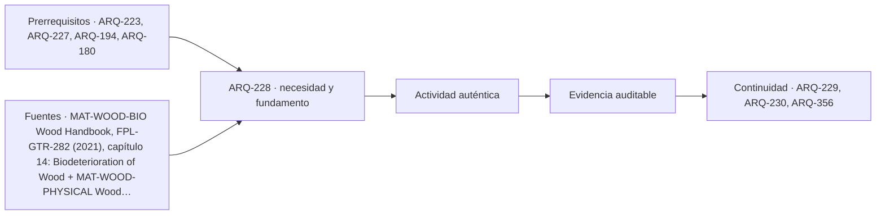

# ARQ-228 · Durabilidad, hongos, insectos y mantenimiento

**Parte 23 · Clase desarrollada · Incorporada en v0.14.0.**

Prerrequisitos conceptuales: ARQ-223, ARQ-227, ARQ-194, ARQ-180. Sin calendario. Casos y parámetros ficticios, salvo antecedentes expresamente atribuidos. Material de estudio; revisión externa especializada pendiente.

## Pregunta central

¿Cómo relacionar humedad, agentes biológicos, condición de una pieza y mantenimiento sin diagnosticar daño estructural a partir de una mancha o de una sola lectura?

## Resultado y continuidad

ARQ-227 distinguió manifestación, geometría y desempeño. Esta clase aplica una disciplina semejante a durabilidad. Elaborarás un registro de condiciones, interpretarás datos simulados con una interrupción y compararás dos pérdidas geométricas iguales en área. **DUR-REG-01** y **DUR-GEO-01** no describen un edificio real. No se recomiendan tratamientos, biocidas ni procedimientos de retirada.

## 1. Agente, condición y efecto

Un agente biológico, las condiciones que favorecen su actividad y el efecto sobre el material son dimensiones relacionadas, pero distintas. La presencia de una manifestación superficial no cuantifica automáticamente una pérdida resistente; tampoco su ausencia visible descarta alteraciones internas.

El capítulo de biodeterioro del Wood Handbook distingue hongos y otros agentes y relaciona su actividad con condiciones ambientales [[MAT-WOOD-BIO]](#FUENTE-MAT-WOOD-BIO). No convertimos esa explicación en un umbral universal de humedad o tiempo. La evaluación de una pieza requiere identificación, historia, exposición y método adecuados.

Una ficha debe separar descripción observable, hipótesis de agente y consecuencia por verificar. «Se observa una variación de color» no equivale a «la sección perdió cierto porcentaje de resistencia». La segunda afirmación necesitaría evidencia distinta y una evaluación competente.

## 2. Durabilidad no es una etiqueta permanente

La aptitud depende de material, detalles, exposición, uso y mantenimiento. Un producto puede trabajar en un ambiente distinto del previsto durante transporte, montaje o vida útil. La estrategia no debería comenzar cuando aparece una manifestación, sino cuando se decide cómo se evitarán condiciones incompatibles y cómo se observarán cambios.

Un encuentro puede permitir acumulación de agua; una pieza puede quedar difícil de inspeccionar; una intervención puede cambiar ventilación o acceso. Estas relaciones deben investigarse en el edificio concreto. No basta declarar un material «durable» sin describir qué condiciones sostienen esa afirmación.

La madera tratada y la no tratada tampoco se comparan mediante una etiqueta aislada. Producto, proceso, exposición y restricciones requieren documentación específica. Este programa no prescribe sustancias ni concentraciones; enseña a identificar qué información debe pedir el proyecto.

## 3. Diseñar un registro que responda una pregunta

DUR-REG-01 plantea una pregunta limitada: ¿durante qué parte de una ventana simulada el indicador estuvo por encima de un disparador operativo ficticio? Adoptamos 20 % solo como valor del ejercicio, **no como límite de desarrollo de hongos, seguridad o aceptación de madera**.

Hay lecturas al inicio de intervalos de seis horas: a 0 h, 14 %; a 6 h, 22 %; a 12 h, dato ausente; a 18 h, 18 %. La ventana termina a 24 h. Para el modelo, cada lectura conocida representa todo el intervalo siguiente. Esa regla de retención es una hipótesis; un seguimiento real puede necesitar otra resolución.

Se conservan estado, hora, ubicación, método y calidad. El dato ausente no se reemplaza por cero ni por el último valor sin declarar un método. El registro debe permitir distinguir fenómeno observado de comportamiento atribuido por interpolación.

## 4. Resolver el tiempo conocido y el desconocido

Entre 0 y 6 h, el indicador está bajo el disparador en el modelo. Entre 6 y 12, está sobre él. Entre 12 y 18, no se conoce. Entre 18 y 24, está debajo. Hay doce horas conocidas bajo el disparador, seis sobre él y seis desconocidas.

Sobre el tiempo observado, dieciocho horas, la fracción superior es `6/18 = 33,33 %`. Sobre la ventana completa, la fracción confirmada superior es `6/24 = 25 %`. Ambas cifras son correctas si conservan su denominador y su significado; ninguna afirma que el estado completo se conoce.

Bajo las hipótesis por intervalo y sin información adicional, la duración total superior podría estar entre seis y doce horas. El extremo inferior supone que todo el intervalo desconocido estuvo debajo; el superior, que estuvo encima. Son límites del registro, no probabilidades ni intervalos de confianza.

## 5. Qué cambia al comparar dos campañas

Una campaña posterior con menos lecturas superiores podría tener también más períodos sin datos. Presentarla como mejora sin revisar cobertura sería una conclusión prematura. Hay que conservar ubicación, método, intervalo, estado de uso y definición del indicador cuando se comparan series.

Si después se corrige una entrada de agua, el registro puede ayudar a observar cambios de condiciones. No demuestra por sí solo que se haya recuperado capacidad material ni identifica todos los agentes. La evaluación de causa y la de consecuencias son tareas relacionadas, pero no equivalentes.

Un valor medio puede ocultar exposiciones localizadas o episodios. El registro necesita conservar la serie original, no solo un resumen favorable. La automatización de un aviso tampoco transforma su disparador en criterio técnico: el umbral debe tener finalidad y autoridad definidas cuando se use en una obra.

*Figura 228. Seis horas sin dato permanecen desconocidas. El disparador del ejercicio no diagnostica biodeterioro ni seguridad.*

## 6. La forma de una pérdida importa

DUR-GEO-01 es un rectángulo homogéneo ideal de b = 100 mm y h = 200 mm. Su área es 20.000 mm² y su I para flexión asociada a h es `bh³/12 = 66.666.666,67 mm⁴`.

En una variante se reduce la altura diez milímetros: queda 100 por 190 y área 19.000. Se conserva el 95 % de área, pero I se multiplica por `(190/200)³ = 0,857375`. La pérdida geométrica de I es aproximadamente 14,26 %, no 5 %.

En otra variante se reduce ancho cinco milímetros: queda 95 por 200, con la misma área de 19.000. Ahora I conserva el 95 % del inicial. Dos pérdidas iguales de área producen cambios distintos de la propiedad geométrica. No se deduce la rigidez restante solo de un porcentaje de masa o sección perdida.

## 7. Por qué el ejemplo no diagnostica una pieza deteriorada

Las dos variantes son rectángulos perfectos con material homogéneo restante. Una alteración real puede cambiar propiedades, distribución, interfaces y geometría de formas no representadas. La zona aparentemente conservada tampoco tiene necesariamente el mismo módulo ni resistencia inicial.

Por ello los cocientes de I no son porcentajes de capacidad de una viga atacada. La geometría aporta una pregunta: dónde y cómo cambió la sección, qué propiedades quedan y qué acciones recibe. Es necesario coordinar observación y evaluación estructural, no convertir un esquema en instrucción de refuerzo.

La presencia de insectos o indicios requiere identificación y evaluación correspondientes. La clase no propone manipular muestras, aplicar sustancias o ocupar áreas cuya condición se desconoce. Su producto es un expediente de observación y preguntas para responsables competentes.

## 8. Pasar del registro a un plan de mantenimiento

Un plan identifica elementos, funciones, condiciones a observar, responsables y forma de registrar incidencias. No debe depender de una única persona que recuerda dónde estaba una mancha. Los cambios necesitan ubicación y versión para comparar lo mismo a lo largo del tiempo.

El plan también relaciona accesibilidad a la pieza y procedimiento de revisión. Un componente que queda encerrado puede requerir decisiones tempranas de diseño. La facilidad de sustitución de un acabado no significa que la estructura interna sea igualmente accesible.

No se inventan frecuencias universales. Los intervalos de inspección y acciones deben responder a exposición, uso, material y criterios profesionales. En el ejercicio se redacta qué debe definirse y por qué; no un calendario de mantenimiento presentado como válido para cualquier edificio.

## 9. Una respuesta documentada ante una incidencia

La respuesta separa detección, valoración, decisión, acción y revisión. Detectar una condición no identifica automáticamente una reparación. Una acción puede controlar una causa y dejar pendientes consecuencias acumuladas; otra puede mejorar apariencia sin cambiar el origen.

Una nota del caso podría decir: «La serie confirma seis horas sobre el disparador ficticio y conserva seis sin información. Se solicita revisar cobertura antes de comparar campañas». Para DUR-GEO añadiría: «Dos geometrías con igual área restante tienen I diferente; no se ha evaluado material deteriorado real».

Estas conclusiones no son evasivas: explican exactamente qué se obtuvo y qué decisión no puede cerrarse todavía. El mantenimiento gana utilidad cuando los resultados se conectan con responsabilidades y evidencias, en lugar de acumular fotografías sin contexto.

## Práctica independiente

Una ventana de veinte horas tiene cinco intervalos de cuatro. Sus indicadores iniciales son 18, 24, ausente, 21 y 17 %, bajo el mismo disparador ficticio de 20. Calcula tiempo superior conocido, inferior conocido, desconocido, proporción sobre tiempo observado y límites del tiempo superior total.

Un rectángulo de 80 por 160 mm pierde 10 % de área mediante dos variantes separadas: reducir únicamente altura o únicamente ancho. Calcula las dimensiones restantes y el cociente de I en cada una. Explica por qué no son predicciones de capacidad de una pieza afectada biológicamente.

Solución razonada

Hay ocho horas superiores, ocho inferiores y cuatro desconocidas. Sobre dieciséis observadas, la fracción superior es 50 %; sobre la ventana completa, la fracción confirmada es 40 %. La duración superior total está entre ocho y doce horas bajo la discretización del ejercicio.

Reduciendo altura queda 80 por 144; I conserva <code>0,9³ = 0,729</code>, es decir, 72,9 %. Reduciendo ancho queda 72 por 160; I conserva 90 %. En ambos casos el área restante es 11.520 mm². Faltan propiedades, forma real de alteración y análisis de acciones para evaluar una pieza existente.

## Autoevaluación y enlace

No transformes ausencias en lecturas favorables ni superficie en diagnóstico. Conserva el significado de cada denominador y de cada propiedad geométrica. ARQ-229 estudiará bambú y otros recursos biobasados: se trasladarán estas preguntas de identificación y exposición, no propiedades numéricas de madera.

<!-- pedagogia-2026:inicio -->
## Decisión pedagógica y posición curricular

### Por qué existe

Esta clase existe para resolver una necesidad concreta del recorrido: ¿Cómo relacionar humedad, agentes biológicos, condición de una pieza y mantenimiento sin diagnosticar daño estructural a partir de una mancha o de una sola lectura?

### Por qué está exactamente aquí

Ocupa el lugar 8 de la Parte 23. Se estudia después de ARQ-227 · Fuego, protección y estrategia de resistencia porque usa esa base para responder «¿Cómo relacionar humedad, agentes biológicos, condición de una pieza y mantenimiento sin diagnosticar daño estructural a partir de una mancha o de una sola lectura?». Se ubica antes de ARQ-229 · Bambú y otros recursos biobasados porque la evidencia producida aquí debe estar disponible para ese paso.

- **Prerrequisitos:** `ARQ-223`, `ARQ-227`, `ARQ-194`, `ARQ-180`
- **Capacidad que introduce:** ARQ-227 distinguió manifestación, geometría y desempeño. Esta clase aplica una disciplina semejante a durabilidad. Elaborarás un registro de condiciones, interpretarás datos simulados con una interrupción y compararás dos pérdidas geométricas iguales en área.
- **Clases o experiencias que dependen de ella:** `ARQ-229`, `ARQ-230`, `ARQ-356`

El diagrama permite comprobar una relación que el texto lineal oculta con facilidad: esta clase recibe capacidades previas, toma decisiones apoyadas por fuentes, exige una experiencia y produce evidencia que habilita trabajo posterior. No representa un procedimiento de obra.

## Resultado observable, evidencia y evaluación

1. Identificar y delimitar las condiciones necesarias para responder la pregunta central de durabilidad, hongos, insectos y mantenimiento.
2. Producir y comprobar la evidencia declarada por la clase: ARQ-227 distinguió manifestación, geometría y desempeño. Esta clase aplica una disciplina semejante a durabilidad. Elaborarás un registro de condiciones, interpretarás datos simulados con una interrupción y compararás dos pérdidas geométricas iguales en área.
3. Justificar una decisión de durabilidad, hongos, insectos y mantenimiento mediante fuentes, supuestos, alternativas y límites explícitos.

## Actividad, evidencia y criterio de aceptación

**Actividad:** Una ventana de veinte horas tiene cinco intervalos de cuatro. Sus indicadores iniciales son 18, 24, ausente, 21 y 17 %, bajo el mismo disparador ficticio de 20. Calcula tiempo superior conocido, inferior conocido, desconocido, proporción sobre tiempo observado y límites del tiempo superior total.

**Evidencia mínima:** ARQ-227 distinguió manifestación, geometría y desempeño. Esta clase aplica una disciplina semejante a durabilidad. Elaborarás un registro de condiciones, interpretarás datos simulados con una interrupción y compararás dos pérdidas geométricas iguales en área.

**Archivo sugerido:** `evidence/ARQ-228/evidencia.md`.

**Criterio de aceptación:** la entrega se acepta cuando:

- La entrega responde explícitamente a la pregunta: ¿Cómo relacionar humedad, agentes biológicos, condición de una pieza y mantenimiento sin diagnosticar daño estructural a partir de una mancha o de una sola lectura?
- La actividad conserva las fronteras del caso y permite reconstruir el procedimiento: Una ventana de veinte horas tiene cinco intervalos de cuatro. Sus indicadores iniciales son 18, 24, ausente, 21 y 17 %, bajo el mismo disparador ficticio de 20. Calcula tiempo superior conocido, inferior conocido, desconocido, proporción sobre tiempo observado y límites del tiempo superior total.
- Cada afirmación externa puede seguirse hasta una fuente, su alcance consultado y su límite.
- La evidencia deja disponible una entrada comprobable para ARQ-229.
- No transformes ausencias en lecturas favorables ni superficie en diagnóstico. Conserva el significado de cada denominador y de cada propiedad geométrica.

La [rúbrica común](../../docs/RUBRICA_COMUN.md) complementa estos criterios; no los reemplaza. Una entrega puede superar un promedio y continuar pendiente si oculta una condición crítica.

## Trazabilidad de las decisiones

| # | Decisión o fundamento | Fuente utilizada | Aplicación y límite en esta clase |
|---:|---|---|---|
| 1 | Separar manifestación superficial, deterioro, condiciones de exposición y diagnóstico. | [MAT-WOOD-BIO Wood Handbook, FPL-GTR-282 (2021), capítulo 14:…](https://research.fs.usda.gov/download/treesearch/62262.pdf) | Consulta: Capítulo PDF: Introducción y apartados iniciales sobre hongos; identificación de otros agentes en el capítulo. Límite: No se distribuye el capítulo ni se adoptan resistencias, clases, productos o detalles ejecutables. Las referencias de 2021 no son una verificación de códigos vigentes; los modelos numéricos son ficticios. |
| 2 | Separar humedad, dirección anatómica, gradientes y cambios dimensionales. | [MAT-WOOD-PHYSICAL Wood Handbook, FPL-GTR-282 (2021), capítulo 4:…](https://research.fs.usda.gov/download/treesearch/62243.pdf) | Consulta: Capítulo PDF: Apartados sobre contenido de humedad, equilibrio y contracción; figura 4–5 inspeccionada. Límite: No se distribuye el capítulo ni se adoptan resistencias, clases, productos o detalles ejecutables. Las referencias de 2021 no son una verificación de códigos vigentes; los modelos numéricos son ficticios. |

La tabla permite auditar las relaciones; la explicación, el caso y la práctica de la clase siguen siendo la documentación principal.

## Autoevaluación, recuperación y continuidad

### Errores diagnósticos

Antes de avanzar, comprueba si puedes reconstruir cada resultado sin mirar la solución, señalar qué evidencia lo sostiene y nombrar una condición que obligaría a revisar tu decisión. Conserva la primera versión, la objeción recibida y la revisión.

**Conexión siguiente:** La continuidad inmediata es ARQ-229 · Bambú y otros recursos biobasados; conserva el método y vuelve a verificar datos y límites.
<!-- pedagogia-2026:fin -->

## Fuentes y alcance de uso

Los casos, figuras, derivaciones y soluciones son elaboraciones del programa, no resultados de los organismos citados. Consulta de fuentes nuevas: 22 de septiembre de 2026. No se declara lectura íntegra cuando el acceso fue parcial.

### [[MAT-WOOD-BIO]](#FUENTE-MAT-WOOD-BIO) Wood Handbook, FPL-GTR-282 (2021), capítulo 14: Biodeterioration of Wood

Rachel A. Arango, Stan T. Lebow y Jessie A. Glaeser / USDA Forest Service. [https://research.fs.usda.gov/download/treesearch/62262.pdf](https://research.fs.usda.gov/download/treesearch/62262.pdf)

**Consulta:** Capítulo PDF: Introducción y apartados iniciales sobre hongos; identificación de otros agentes en el capítulo. **Apoyo:** Separar manifestación superficial, deterioro, condiciones de exposición y diagnóstico. **Límite:** No se distribuye el capítulo ni se adoptan resistencias, clases, productos o detalles ejecutables. Las referencias de 2021 no son una verificación de códigos vigentes; los modelos numéricos son ficticios.

### [[MAT-WOOD-PHYSICAL]](#FUENTE-MAT-WOOD-PHYSICAL) Wood Handbook, FPL-GTR-282 (2021), capítulo 4: Moisture Relations and Physical Properties of Wood

Samuel V. Glass y Samuel L. Zelinka / USDA Forest Service. [https://research.fs.usda.gov/download/treesearch/62243.pdf](https://research.fs.usda.gov/download/treesearch/62243.pdf)

**Consulta:** Capítulo PDF: Apartados sobre contenido de humedad, equilibrio y contracción; figura 4–5 inspeccionada. **Apoyo:** Separar humedad, dirección anatómica, gradientes y cambios dimensionales. **Límite:** No se distribuye el capítulo ni se adoptan resistencias, clases, productos o detalles ejecutables. Las referencias de 2021 no son una verificación de códigos vigentes; los modelos numéricos son ficticios.
