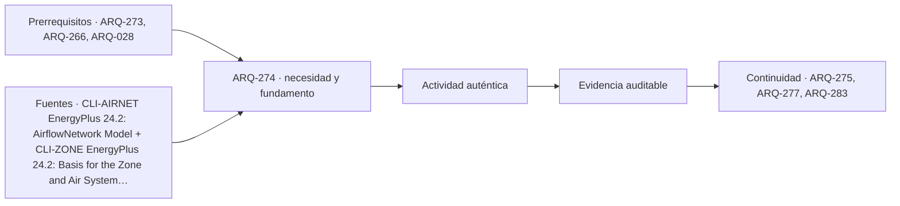

# ARQ-274 · Ventilación natural y diferencias de presión

**Parte 28 · Clase desarrollada · Incorporada en v0.17.0.**

Prerrequisitos conceptuales: ARQ-273, ARQ-266, ARQ-028. Sin calendario. Casos, series y parámetros ficticios, salvo antecedentes atribuidos. No son mediciones de un edificio ni pronósticos. Revisión externa especializada pendiente.

## Pregunta central

¿Por qué abrir dos ventanas no determina por sí solo la ventilación de un recinto, y cómo se relacionan presión, tamaño efectivo de las aberturas y continuidad del recorrido del aire?

## Resultado y continuidad

ARQ-273 estudió la geometría de la sombra. Esta clase cambia de mecanismo: una abertura intercambia aire cuando existe una diferencia de presión y un camino disponible. Construirás **VEN-RED-01**, una red ideal de dos aberturas, verificarás su balance y compararás cambios de tamaño y dirección. No es una prueba de calidad de aire ni un dimensionamiento de ventilación. ARQ-275 añadirá el almacenamiento térmico del espacio.

## 1. Área dibujada, área libre y área efectiva

El vano de una ventana no equivale a su área abierta. El tipo de hoja, posición de apertura, mallas, celosías y obstáculos pueden modificar el paso. Además, el flujo depende de cómo el aire se contrae y pierde energía al atravesarlo. Conviene separar superficie geométrica libre `A` y coeficiente de descarga `Cd`.

El producto `CdA` es el área efectiva del modelo de orificio. No debe confundirse con el área de fachada ni con una superficie de vidrio. Adoptar un valor para estudiar sensibilidad no convierte ese valor en propiedad certificada de una ventana concreta.

La distribución interior importa: una puerta cerrada puede interrumpir la conexión entre fachadas. Una ruta de aire corta puede evitar una zona ocupada y dejarla mal representada por el promedio. La red describe nodos y enlaces; no resuelve automáticamente distribución espacial, corrientes locales ni mezcla de contaminantes.

## 2. Presiones que pueden colaborar o competir

El viento produce diferencias de presión que dependen de velocidad, dirección y entorno. La diferencia de densidad entre aire interior y exterior puede producir otra contribución asociada a altura y temperatura. En una red, ambas intervienen junto con pérdidas y conexiones [[CLI-AIRNET]](#FUENTE-CLI-AIRNET).

Para una comparación auxiliar adoptamos presión de viento `Δp_w=0,5ρv²ΔCp`. Con densidad ficticia de 1,2 kg/m³, velocidad 3 m/s y diferencia de coeficientes 0,50, resulta 2,70 Pa. No se dedujo `ΔCp` de una forma de edificio: es un parámetro del ejercicio.

Una aproximación de flotabilidad para pequeñas diferencias de temperatura es `Δp_s≈ρghΔT/T`, con temperatura absoluta de referencia. Si `h=3 m`, `ΔT=6 K` y `T=300 K`, resulta 0,70632 Pa. La expresión simplifica densidades y posición de aberturas. No sustituye el cálculo del plano de presión neutra de una red real.

Si las contribuciones actúan en el mismo sentido, suman 3,40632 Pa; si se oponen, la diferencia es 1,99368 Pa. Se suman presiones con signo antes de calcular el flujo. Sumar por separado dos caudales calculados como si cada mecanismo actuara solo no satisface necesariamente la misma red.

## 3. Derivar una abertura ideal

Para un salto de presión positivo, el modelo de orificio expresa `Q=CdA√(2Δp/ρ)`. Despejando aparece `Δp=(ρ/2)(Q/CdA)²`. La relación cuadrática importa: duplicar el caudal exige cuadruplicar la presión si no cambia el área efectiva.

La densidad relaciona presión y velocidad en esta aproximación. Suponerla constante permite utilizar un mismo caudal volumétrico en ambos enlaces. En un análisis con densidades significativamente diferentes, la continuidad fundamental sería de masa y el tratamiento tendría que ampliarse.

La expresión no sirve para describir cualquier abertura grande con flujo simultáneo en ambos sentidos ni una cavidad compleja. La documentación de AirflowNetwork contiene formulaciones adicionales para esos casos [[CLI-AIRNET]](#FUENTE-CLI-AIRNET). Aquí la simplificación se mantiene visible para aprender a ensamblar una red antes de aumentar su complejidad.

## 4. Dos aberturas en serie

En VEN-RED-01 solo hay una entrada, un recinto y una salida. No se acumula aire dentro del nodo. Por ello el caudal `Q` es el mismo en ambas aberturas y las pérdidas de presión se suman:

`Δp_total=(ρQ²/2)[1/(CdA1)²+1/(CdA2)²]`.

Despejando:

`Q=√{2Δp_total/[ρ((CdA1)⁻²+(CdA2)⁻²)]}`.

No se suman las áreas como si fueran dos entradas paralelas. Tampoco se toma simplemente la menor y se ignora la otra: ambas consumen parte de la diferencia de presión. La fórmula permite verificar esas dos afirmaciones mediante límites. Si una abertura crece mucho, la otra domina; si cualquiera se cierra por completo, el recorrido único queda interrumpido.

## 5. Caso trabajado y presión interior

Adoptamos `CdA1=0,12 m²`, `CdA2=0,06 m²`, `ρ=1,2 kg/m³` y diferencia total de 4 Pa. El resultado es `Q=0,138564 m³/s`, equivalente a 498,831 m³/h. No son renovaciones por hora hasta dividir por un volumen de recinto definido.

La primera abertura consume 0,80 Pa y la segunda 3,20 Pa. Si el exterior de entrada se toma en 4 Pa y el de salida en cero, el nodo interior queda en 3,20 Pa dentro de esta referencia. La mayor pérdida corresponde al área efectiva menor; ambas suman exactamente cuatro.

La comprobación inversa sustituye el caudal en cada ecuación de orificio. Si se obtiene otro valor en la salida, hay una inconsistencia de unidades o de planteamiento. No basta que el total de presiones cierre si cada enlace se ha calculado con un caudal diferente sin una entrada adicional declarada.

*Figura 274. La continuidad exige el mismo flujo en los dos enlaces del modelo. Las áreas efectivas no son dimensiones recomendadas de ventanas.*

## 6. Aumentar una abertura no siempre produce el mismo efecto

Duplicando solo `CdA1` a 0,24 m², el caudal pasa a 0,150294 m³/s. Duplicando solo la segunda a 0,12, ambas quedan iguales y el caudal asciende a 0,219089 m³/s. Son variantes separadas de la misma base, no cambios simultáneos.

La diferencia explica por qué añadir superficie donde ya existe poca resistencia puede aportar menos que actuar sobre otro enlace. Sin embargo, no selecciona una ventana: pueden intervenir ruido, lluvia, seguridad, control y distribución del flujo. El resultado numérico solo identifica una relación dentro de la red adoptada.

Con las presiones combinadas del apartado anterior, las áreas originales dan aproximadamente 0,127868 m³/s cuando viento y flotabilidad colaboran y 0,097825 cuando se oponen. Si el signo total se invierte, el flujo invierte su sentido. Una flecha fija en el plano no representa todos los estados posibles.

## 7. Del intercambio de aire al efecto térmico

Para un flujo de entrada conocido, el intercambio sensible puede aproximarse como `ρcpQ(Te−Ti)`. El signo importa: aire más frío puede retirar calor; aire más caliente lo añade. Un caudal alto no implica por sí mismo enfriamiento ni condiciones interiores adecuadas.

También hay humedad y sustancias transportadas. ARQ-278 estudiará razón de humedad y entalpía. No reduzcas la calidad de aire a una potencia térmica ni uses un balance de calor para declarar satisfechas tasas mínimas de ventilación. Esas decisiones necesitan criterios y evidencia propios.

El caudal nocturno presupone que las aberturas estén disponibles durante ese estado. Si el proyecto exige cerrarlas por ruido o por funcionamiento del servicio, el modelo debe cambiar. Una estrategia pasiva que funciona únicamente con una operación imposible no queda validada por su ecuación.

## 8. Dibujar la cadena espacial

Representa acceso del aire, zona ocupada, conexiones interiores y salida. Identifica puertas, tabiques, muebles altos y diferencias de nivel que puedan alterar el recorrido. La red debe corresponder con planta y sección, y las etiquetas deben distinguir estado abierto, cerrado y desconocido.

En un edificio profundo, dos aberturas en una misma fachada no constituyen necesariamente el caso transversal de esta clase. Las conexiones verticales tampoco son simples equivalentes de las horizontales. Para cada alternativa explica qué mecanismo se estudia y qué geometría queda sin representar.

El arquitecto coordina esa organización con especialistas y operación. No necesita fingir un cálculo completo para detectar que un tabique elimina la ruta propuesta. La evidencia inicial puede ser una contradicción entre documentos, que debe resolverse antes de asignar una prestación al conjunto.

## 9. Comprobación y comunicación

La ficha final conserva áreas efectivas, presiones, densidad, estado de puertas y límites de la red. Distingue caudal calculado, caudal medido y necesidad del servicio. Una medición puntual, si existiera, tendría que registrar condiciones de viento y operación para compararse con el modelo.

No conviertas el resultado de un estado favorable en caudal permanente. Prepara al menos un caso con presión menor y otro con un enlace no disponible. Esa sensibilidad comunica mejor la dependencia de la estrategia que una sola cifra grande acompañada de una flecha azul.

## Práctica independiente

Dos aberturas tienen áreas efectivas iguales de 0,10 m². Calcula el flujo para 3 Pa y densidad 1,2 kg/m³; verifica las pérdidas por separado. Repite con −3 Pa conservando una orientación positiva de referencia. Explica qué sucede si la salida se cierra completamente y no existen otros enlaces.

En una comparación aparte, una contribución de viento de 2 Pa y una de flotabilidad de −3 Pa actúan sobre el mismo circuito. Determina el signo de la presión total antes de proponer cualquier flujo. No sumes caudales calculados de manera independiente.

Solución razonada

El flujo es 0,158114 m³/s, equivalente a 569,210 m³/h. Cada abertura consume 1,50 Pa. Con presión inversa, el flujo tiene igual magnitud y signo negativo bajo las hipótesis simétricas. Al cerrar el único enlace de salida, el modelo estacionario no conserva ese intercambio; no se divide por un área cero ni se inventa otra abertura.

Las contribuciones de la segunda comparación suman −1 Pa. El sentido es opuesto al definido positivo. El resultado no autoriza extrapolar calidad de aire, mezcla o enfriamiento: esas preguntas requieren variables y criterios adicionales.

## Autoevaluación y enlace

Comprueba presiones, continuidad y signos. Explica por qué duplicar distintas aberturas no produce el mismo cambio y qué estado operativo podría impedir la estrategia. ARQ-275 estudiará qué hace el recinto con el calor recibido o retirado: temperatura y almacenamiento no responden instantáneamente de la misma manera.

<!-- pedagogia-2026:inicio -->
## Decisión pedagógica y posición curricular

### Por qué existe

Esta clase existe para resolver una necesidad concreta del recorrido: ¿Por qué abrir dos ventanas no determina por sí solo la ventilación de un recinto, y cómo se relacionan presión, tamaño efectivo de las aberturas y continuidad del recorrido del aire?

### Por qué está exactamente aquí

Ocupa el lugar 4 de la Parte 28. Se estudia después de ARQ-273 · Sombra, protección solar y estacionalidad porque usa esa base para responder «¿Por qué abrir dos ventanas no determina por sí solo la ventilación de un recinto, y cómo se relacionan presión, tamaño efectivo de las aberturas y continuidad del recorrido del aire?». Se ubica antes de ARQ-275 · Masa térmica y oscilación diaria porque la evidencia producida aquí debe estar disponible para ese paso.

- **Prerrequisitos:** `ARQ-273`, `ARQ-266`, `ARQ-028`
- **Capacidad que introduce:** ARQ-273 estudió la geometría de la sombra. Esta clase cambia de mecanismo: una abertura intercambia aire cuando existe una diferencia de presión y un camino disponible. Construirás VEN-RED-01 , una red ideal de dos aberturas, verificarás su balance y compararás cambios de tamaño y dirección.
- **Clases o experiencias que dependen de ella:** `ARQ-275`, `ARQ-277`, `ARQ-283`

El diagrama permite comprobar una relación que el texto lineal oculta con facilidad: esta clase recibe capacidades previas, toma decisiones apoyadas por fuentes, exige una experiencia y produce evidencia que habilita trabajo posterior. No representa un procedimiento de obra.

## Resultado observable, evidencia y evaluación

1. Identificar y delimitar las condiciones necesarias para responder la pregunta central de ventilación natural y diferencias de presión.
2. Producir y comprobar la evidencia declarada por la clase: ARQ-273 estudió la geometría de la sombra. Esta clase cambia de mecanismo: una abertura intercambia aire cuando existe una diferencia de presión y un camino disponible. Construirás VEN-RED-01 , una red ideal de dos aberturas, verificarás su balance y compararás cambios de tamaño y dirección.
3. Justificar una decisión de ventilación natural y diferencias de presión mediante fuentes, supuestos, alternativas y límites explícitos.

## Actividad, evidencia y criterio de aceptación

**Actividad:** Dos aberturas tienen áreas efectivas iguales de 0,10 m². Calcula el flujo para 3 Pa y densidad 1,2 kg/m³; verifica las pérdidas por separado. Repite con −3 Pa conservando una orientación positiva de referencia.

**Evidencia mínima:** ARQ-273 estudió la geometría de la sombra. Esta clase cambia de mecanismo: una abertura intercambia aire cuando existe una diferencia de presión y un camino disponible. Construirás VEN-RED-01 , una red ideal de dos aberturas, verificarás su balance y compararás cambios de tamaño y dirección.

**Archivo sugerido:** `evidence/ARQ-274/evidencia.md`.

**Criterio de aceptación:** la entrega se acepta cuando:

- La entrega responde explícitamente a la pregunta: ¿Por qué abrir dos ventanas no determina por sí solo la ventilación de un recinto, y cómo se relacionan presión, tamaño efectivo de las aberturas y continuidad del recorrido del aire?
- La actividad conserva las fronteras del caso y permite reconstruir el procedimiento: Dos aberturas tienen áreas efectivas iguales de 0,10 m². Calcula el flujo para 3 Pa y densidad 1,2 kg/m³; verifica las pérdidas por separado. Repite con −3 Pa conservando una orientación positiva de referencia.
- Cada afirmación externa puede seguirse hasta una fuente, su alcance consultado y su límite.
- La evidencia deja disponible una entrada comprobable para ARQ-275.
- Comprueba presiones, continuidad y signos. Explica por qué duplicar distintas aberturas no produce el mismo cambio y qué estado operativo podría impedir la estrategia.

La [rúbrica común](../../docs/RUBRICA_COMUN.md) complementa estos criterios; no los reemplaza. Una entrega puede superar un promedio y continuar pendiente si oculta una condición crítica.

## Trazabilidad de las decisiones

| # | Decisión o fundamento | Fuente utilizada | Aplicación y límite en esta clase |
|---:|---|---|---|
| 1 | Relacionar aberturas, presiones y continuidad del flujo. | [CLI-AIRNET EnergyPlus 24.2: AirflowNetwork Model](https://bigladdersoftware.com/epx/docs/24-2/engineering-reference/airflownetwork-model.html) | Consulta: Red de presiones, conservación de masa, viento y flotabilidad. Límite: El modelo de dos aberturas es independiente; no es CFD ni selección de aberturas para una obra. |
| 2 | Distinguir flujos, almacenamiento y evolución de temperatura. | [CLI-ZONE EnergyPlus 24.2: Basis for the Zone and Air System Integration](https://bigladdersoftware.com/epx/docs/24-2/engineering-reference/basis-for-the-zone-and-air-system-integration.html) | Consulta: Balance sensible, almacenamiento y solución analítica por intervalos. Límite: Los modelos de uno y dos nodos del curso no implementan el motor EnergyPlus ni validan un edificio. |

La tabla permite auditar las relaciones; la explicación, el caso y la práctica de la clase siguen siendo la documentación principal.

## Autoevaluación, recuperación y continuidad

### Errores diagnósticos

Antes de avanzar, comprueba si puedes reconstruir cada resultado sin mirar la solución, señalar qué evidencia lo sostiene y nombrar una condición que obligaría a revisar tu decisión. Conserva la primera versión, la objeción recibida y la revisión.

**Conexión siguiente:** La continuidad inmediata es ARQ-275 · Masa térmica y oscilación diaria; conserva el método y vuelve a verificar datos y límites.
<!-- pedagogia-2026:fin -->

## Fuentes y alcance de uso

Los modelos, datos, figuras, prácticas y soluciones son elaboraciones originales. Consulta de fuentes nuevas: 22 de septiembre de 2026. Las referencias heredadas conservan su alcance. No se afirma aplicación íntegra de normas ni ejecución de simuladores externos.

### [[CLI-AIRNET]](#FUENTE-CLI-AIRNET) EnergyPlus 24.2: AirflowNetwork Model

EnergyPlus / U.S. Department of Energy. [https://bigladdersoftware.com/epx/docs/24-2/engineering-reference/airflownetwork-model.html](https://bigladdersoftware.com/epx/docs/24-2/engineering-reference/airflownetwork-model.html)

**Consulta:** Red de presiones, conservación de masa, viento y flotabilidad. **Apoyo:** Relacionar aberturas, presiones y continuidad del flujo. **Límite:** El modelo de dos aberturas es independiente; no es CFD ni selección de aberturas para una obra.

### [[CLI-ZONE]](#FUENTE-CLI-ZONE) EnergyPlus 24.2: Basis for the Zone and Air System Integration

EnergyPlus / U.S. Department of Energy. [https://bigladdersoftware.com/epx/docs/24-2/engineering-reference/basis-for-the-zone-and-air-system-integration.html](https://bigladdersoftware.com/epx/docs/24-2/engineering-reference/basis-for-the-zone-and-air-system-integration.html)

**Consulta:** Balance sensible, almacenamiento y solución analítica por intervalos. **Apoyo:** Distinguir flujos, almacenamiento y evolución de temperatura. **Límite:** Los modelos de uno y dos nodos del curso no implementan el motor EnergyPlus ni validan un edificio.
