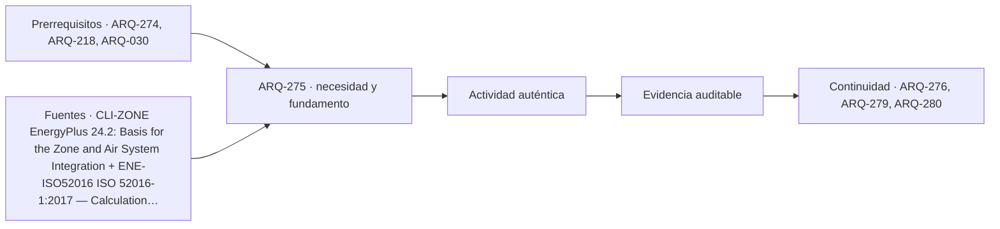

# ARQ-275 · Masa térmica y oscilación diaria

**Parte 28 · Clase desarrollada · Incorporada en v0.17.0.**

Prerrequisitos conceptuales: ARQ-274, ARQ-218, ARQ-030. Sin calendario. Casos, series y parámetros ficticios, salvo antecedentes atribuidos. No son mediciones de un edificio ni pronósticos. Revisión externa especializada pendiente.

## Pregunta central

¿Cómo modifica la capacidad térmica la amplitud y el momento de una oscilación interior, y por qué retrasar una temperatura máxima no equivale a reducir cualquier necesidad energética?

## Resultado y continuidad

En ARQ-218 se estudió propagación periódica dentro de un material. Aquí cambia el objeto: **PAS-SENO-01** representa un recinto mediante un solo nodo térmico efectivo. No es una pared semiinfinita ni el muro de ARQ-261. Derivarás su respuesta a una temperatura exterior oscilante, compararás dos capacidades y comprobarás un balance de ciclo. ARQ-280 recuperará el método dinámico con otra excitación expresamente identificada.

## 1. Capacidad térmica, masa y acceso al intercambio

Una masa puede almacenar energía cuando cambia su temperatura, pero no toda la masa de un edificio participa de igual manera ni al mismo tiempo. Importan posición, superficie expuesta, contacto con el aire, capas de acabado y velocidad del proceso. La etiqueta «edificio pesado» no especifica una capacidad efectiva para cualquier modelo.

La capacidad `C` se expresa en J/K. La conductancia `H`, en W/K, representa el intercambio adoptado con el exterior. Son propiedades distintas: una determina almacenamiento por cambio de temperatura; la otra, potencia por diferencia térmica. Aumentar espesor puede cambiar ambas, pero el modelo debe registrar cómo.

Los balances de zona distinguen flujos y almacenamiento [[CLI-ZONE]](#FUENTE-CLI-ZONE). Nuestra reducción a un nodo supone una temperatura representativa única. No predice gradientes dentro de muros, temperatura radiante en cada punto ni diferencias entre habitaciones. Su utilidad está en mostrar relaciones temporales que una cuenta estacionaria no contiene.

## 2. Construir el balance antes de buscar la solución

Considera temperatura interior `Ti(t)`, exterior `Te(t)`, ganancia constante `G` y conductancia `H`. El balance es:

`C dTi/dt = H(Te−Ti)+G`.

A la izquierda está la variación de energía almacenada. A la derecha, el intercambio con el exterior y la ganancia. Si ambas entradas se compensan, la temperatura permanece constante; si su suma es positiva, aumenta. El signo no depende de llamar al flujo «pérdida»: en ciertas condiciones el exterior aporta calor.

La razón `τ=C/H` tiene dimensión de tiempo. Bajo un salto de condición constante, describe la velocidad de aproximación al nuevo equilibrio. No es automáticamente el retraso de una onda diaria ni el tiempo necesario para llegar exactamente al estado final. Esas dos interpretaciones se comprobarán por separado.

## 3. Separar valor medio y oscilación

Adoptamos `Te=Tmed+A cos(ωt)`, donde `ω=2π/P` y `P` es el período. Buscamos la respuesta periódica después de que desaparezca el transitorio inicial. Al promediar sobre un ciclo completo, la variación neta de almacenamiento es cero. Por tanto, `Ti_media=Tmed+G/H`.

La capacidad no aparece en esa media bajo estas hipótesis. Cambiar `C` altera la oscilación, pero no elimina una ganancia constante. Si la ganancia no fuera constante o existiera control con estados, habría que reformular el caso, no trasladar automáticamente esta conclusión.

Para la parte variable proponemos `Ti−Ti_media=a cos(ωt)+b sin(ωt)`. Sustituimos y comparamos los coeficientes de seno y coseno. Resultan `Ha+ωCb=HA` y `Hb−ωCa=0`. Así se obtiene la respuesta sin recurrir únicamente a una fórmula memorizada.

## 4. Atenuación y retraso derivados

De las ecuaciones anteriores, `b=(ωC/H)a` y `a=AH²/[H²+(ωC)²]`. La amplitud interior es `√(a²+b²)`, que se simplifica a:

`A_i=A/√[1+(ωC/H)²]`.

La fase es `θ=arctan(ωC/H)` y el retraso temporal `t_lag=θ/ω`. La solución puede escribirse como `Ti=Ti_media+A_i cos(ωt−θ)`. La temperatura máxima interior ocurre después de la máxima exterior dentro de este modelo.

Una comprobación de límites ayuda a interpretar. Si `C` tiende a cero, la atenuación tiende a uno y el retraso a cero. Si `C` crece mucho, la oscilación se atenúa y la fase se aproxima a un cuarto de período, no a un retraso ilimitado. Son propiedades del modelo de primer orden, no leyes universales de cualquier edificio.

## 5. Caso trabajado: dos capacidades

PAS-SENO-01 adopta media exterior 22 °C, amplitud 8 K, período de 24 horas, `H=100 W/K` y ganancia constante de 200 W. La media interior periódica es 24 °C. Con `C=1,8 MJ/K`, la constante de tiempo es cinco horas.

El cociente `ωC/H` vale aproximadamente 1,309. La amplitud interior resulta 4,856543 K y el retraso 3,508147 horas. La temperatura oscila entre 19,143457 y 28,856543 °C. Esos valores no constituyen una evaluación de confort ni un pronóstico para una ciudad.

La variante PAS-SENO-02 cambia solo `C` a 7,2 MJ/K. Su constante de tiempo sube a veinte horas, pero el retraso periódico es 5,279168, no veinte. La amplitud baja a 1,500762 K: oscilación entre 22,499238 y 25,500762 °C, manteniendo la media de 24.

*Figura 275. Aumentar capacidad atenúa la oscilación y cambia su fase, pero no modifica la media bajo la ganancia constante adoptada.*

## 6. Un balance de ciclo que evita atribuir energía desaparecida

Durante parte del ciclo el nodo acumula energía y durante otra la devuelve. Al regresar al mismo estado, `C[Ti(P)−Ti(0)]=0`. La ganancia diaria de 200 W durante 24 horas es 4,8 kWh. Debe salir netamente por la conductancia dentro del ciclo periódico.

El almacenamiento no destruye esas 4,8 kWh ni las convierte en ahorro por reducir una máxima. Puede desplazar el intercambio hacia horas distintas, lo que sería útil o problemático según clima, uso y controles. Para hablar de demanda de refrigeración se necesitarían un criterio de servicio y una estrategia de acondicionamiento que aquí no se han definido.

La media de la diferencia `Ti−Te` es dos kelvin; multiplicada por 100 W/K da los mismos 200 W de salida media. Esta comprobación es independiente de los valores extremos y ayuda a encontrar errores de signo o de unidades en una solución numérica.

## 7. El estado inicial también importa

La respuesta completa incluye un término transitorio `B exp(−t/τ)`. Su amplitud depende de la temperatura inicial respecto de la solución periódica. Comenzar el cálculo a 10 °C y simular un solo día no produce necesariamente los extremos periódicos que acabamos de obtener.

No es correcto escoger el estado inicial que favorece una alternativa y presentar el resultado como diferencia atribuible al material. Define un arranque común o un criterio de ciclo repetido. Si la pregunta trata una interrupción o una apertura estacional, el transitorio puede ser precisamente el fenómeno de interés y no debe eliminarse.

La mitad de una desviación inicial desaparece tras `τ ln 2`. Con τ de cinco horas, ese tiempo es 3,465736 horas, próximo pero distinto del retraso periódico calculado. La semejanza numérica no convierte las dos magnitudes en sinónimos.

## 8. Masa expuesta y funcionamiento arquitectónico

El modelo invita a preguntar cómo intercambia energía la masa con el espacio. Un revestimiento o un cielo suspendido puede alterar esa relación; un elemento ubicado fuera de una capa aislante no participa igual que uno expuesto hacia el recinto. No asignamos un nuevo `C` a partir de esas observaciones sin evidencia.

La ventilación nocturna puede facilitar una descarga térmica si las condiciones lo permiten, pero exige aire exterior y operación compatibles. Si la noche permanece cálida o las aberturas se cierran, la condición de descarga cambia. Añadir masa sin estudiar ese estado puede conservar calor en un período donde se desea retirarlo.

También importan actividades: retrasar una máxima puede llevarla fuera o dentro de la ocupación. Por eso la entrega debe superponer temperatura calculada y uso, sin inventar que toda hora tiene igual importancia. ARQ-279 estudiará indicadores por intervalos y conservará la diferencia entre temperatura del modelo y experiencia de las personas.

## 9. Qué se puede comparar y qué queda pendiente

Las dos variantes cambian una sola capacidad efectiva manteniendo conductancia, ganancia, excitación y régimen periódico. Esa igualdad permite atribuir la diferencia del modelo a `C`. Un cambio material real podría alterar simultáneamente otras variables; la comparación tendría que registrarlas.

No extrapoles las amplitudes a otra frecuencia. Una oscilación de doce horas produciría otro cociente `ωC/H`; un evento prolongado no equivale a una onda diaria. La representación temporal forma parte del caso tanto como el espesor o el material del edificio.

Entrega ecuaciones, datos, gráfica y dos comprobaciones: media y balance de ciclo. Explica qué temperatura representa el nodo y cuáles no calcula. Una visualización suave no prueba que la simplificación describa bien una sala real; permite comprender la hipótesis y preparar una investigación más completa.

## Práctica independiente

Otro nodo tiene `C=3,6 MJ/K`, `H=200 W/K`, media exterior 15 °C, amplitud 6 K, período de 24 horas y ganancia constante de 600 W. Calcula media interior, constante de tiempo, amplitud, retraso y extremos periódicos. Verifica la salida neta diaria de energía.

Después explica qué cambiaría si el mismo caso comenzara muy por debajo de su respuesta periódica y se observaran solo seis horas. No alteres las propiedades para forzar coincidencia con una condición inicial diferente.

Solución razonada

La media interior es 18 °C y τ sigue siendo cinco horas. La amplitud resulta 3,642407 K; el retraso, 3,508147 horas. Los extremos son 14,357593 y 21,642407 °C. La ganancia diaria es 14,4 kWh y la salida neta media es <code>200×3=600 W</code>, coherente con ese balance.

Un arranque frío incorpora un transitorio, de modo que sus seis horas no representan los extremos de ciclo. Deben conservarse temperatura inicial, duración y finalidad del análisis. No se concluye que una mayor masa siempre reduzca consumo o asegure confort.

## Autoevaluación y enlace

Puedes derivar la atenuación, diferenciar fase y constante de tiempo, y cerrar el balance sin energía desaparecida. ARQ-276 estudiará conductancia y forma: cambiar la envolvente no equivale a cambiar únicamente capacidad térmica.

<!-- pedagogia-2026:inicio -->
## Decisión pedagógica y posición curricular

### Por qué existe

Esta clase existe para resolver una necesidad concreta del recorrido: ¿Cómo modifica la capacidad térmica la amplitud y el momento de una oscilación interior, y por qué retrasar una temperatura máxima no equivale a reducir cualquier necesidad energética?

### Por qué está exactamente aquí

Ocupa el lugar 5 de la Parte 28. Se estudia después de ARQ-274 · Ventilación natural y diferencias de presión porque usa esa base para responder «¿Cómo modifica la capacidad térmica la amplitud y el momento de una oscilación interior, y por qué retrasar una temperatura máxima no equivale a reducir cualquier necesidad energética?». Se ubica antes de ARQ-276 · Aislamiento y compacidad porque la evidencia producida aquí debe estar disponible para ese paso.

- **Prerrequisitos:** `ARQ-274`, `ARQ-218`, `ARQ-030`
- **Capacidad que introduce:** En ARQ-218 se estudió propagación periódica dentro de un material. Aquí cambia el objeto: PAS-SENO-01 representa un recinto mediante un solo nodo térmico efectivo. No es una pared semiinfinita ni el muro de ARQ-261.
- **Clases o experiencias que dependen de ella:** `ARQ-276`, `ARQ-279`, `ARQ-280`

El diagrama permite comprobar una relación que el texto lineal oculta con facilidad: esta clase recibe capacidades previas, toma decisiones apoyadas por fuentes, exige una experiencia y produce evidencia que habilita trabajo posterior. No representa un procedimiento de obra.

## Resultado observable, evidencia y evaluación

1. Identificar y delimitar las condiciones necesarias para responder la pregunta central de masa térmica y oscilación diaria.
2. Producir y comprobar la evidencia declarada por la clase: En ARQ-218 se estudió propagación periódica dentro de un material. Aquí cambia el objeto: PAS-SENO-01 representa un recinto mediante un solo nodo térmico efectivo. No es una pared semiinfinita ni el muro de ARQ-261.
3. Justificar una decisión de masa térmica y oscilación diaria mediante fuentes, supuestos, alternativas y límites explícitos.

## Actividad, evidencia y criterio de aceptación

**Actividad:** Otro nodo tiene C=3,6 MJ/K , H=200 W/K , media exterior 15 °C, amplitud 6 K, período de 24 horas y ganancia constante de 600 W. Calcula media interior, constante de tiempo, amplitud, retraso y extremos periódicos. Verifica la salida neta diaria de energía.

**Evidencia mínima:** En ARQ-218 se estudió propagación periódica dentro de un material. Aquí cambia el objeto: PAS-SENO-01 representa un recinto mediante un solo nodo térmico efectivo. No es una pared semiinfinita ni el muro de ARQ-261.

**Archivo sugerido:** `evidence/ARQ-275/evidencia.md`.

**Criterio de aceptación:** la entrega se acepta cuando:

- La entrega responde explícitamente a la pregunta: ¿Cómo modifica la capacidad térmica la amplitud y el momento de una oscilación interior, y por qué retrasar una temperatura máxima no equivale a reducir cualquier necesidad energética?
- La actividad conserva las fronteras del caso y permite reconstruir el procedimiento: Otro nodo tiene C=3,6 MJ/K , H=200 W/K , media exterior 15 °C, amplitud 6 K, período de 24 horas y ganancia constante de 600 W. Calcula media interior, constante de tiempo, amplitud, retraso y extremos periódicos. Verifica la salida neta diaria de energía.
- Cada afirmación externa puede seguirse hasta una fuente, su alcance consultado y su límite.
- La evidencia deja disponible una entrada comprobable para ARQ-276.
- Considera temperatura interior Ti(t) , exterior Te(t) , ganancia constante G y conductancia H . El balance es: C dTi/dt = H(Te−Ti)+G .

La [rúbrica común](../../docs/RUBRICA_COMUN.md) complementa estos criterios; no los reemplaza. Una entrega puede superar un promedio y continuar pendiente si oculta una condición crítica.

## Trazabilidad de las decisiones

| # | Decisión o fundamento | Fuente utilizada | Aplicación y límite en esta clase |
|---:|---|---|---|
| 1 | Distinguir flujos, almacenamiento y evolución de temperatura. | [CLI-ZONE EnergyPlus 24.2: Basis for the Zone and Air System Integration](https://bigladdersoftware.com/epx/docs/24-2/engineering-reference/basis-for-the-zone-and-air-system-integration.html) | Consulta: Balance sensible, almacenamiento y solución analítica por intervalos. Límite: Los modelos de uno y dos nodos del curso no implementan el motor EnergyPlus ni validan un edificio. |
| 2 | Distinguir energía, carga, humedad y zona térmica en procedimientos de desempeño. | [ENE-ISO52016 ISO 52016-1:2017 — Calculation procedures for energy…](https://www.iso.org/standard/65696.html) | Consulta: Ficha pública, resumen y alcance; confirmación 2022 indicada en catálogo. Límite: No se leyó ni implementó el texto normativo íntegro. No se afirma cumplimiento. |

La tabla permite auditar las relaciones; la explicación, el caso y la práctica de la clase siguen siendo la documentación principal.

## Autoevaluación, recuperación y continuidad

### Errores diagnósticos

Antes de avanzar, comprueba si puedes reconstruir cada resultado sin mirar la solución, señalar qué evidencia lo sostiene y nombrar una condición que obligaría a revisar tu decisión. Conserva la primera versión, la objeción recibida y la revisión.

**Conexión siguiente:** La continuidad inmediata es ARQ-276 · Aislamiento y compacidad; conserva el método y vuelve a verificar datos y límites.
<!-- pedagogia-2026:fin -->

## Fuentes y alcance de uso

Los modelos, datos, figuras, prácticas y soluciones son elaboraciones originales. Consulta de fuentes nuevas: 22 de septiembre de 2026. Las referencias heredadas conservan su alcance. No se afirma aplicación íntegra de normas ni ejecución de simuladores externos.

### [[CLI-ZONE]](#FUENTE-CLI-ZONE) EnergyPlus 24.2: Basis for the Zone and Air System Integration

EnergyPlus / U.S. Department of Energy. [https://bigladdersoftware.com/epx/docs/24-2/engineering-reference/basis-for-the-zone-and-air-system-integration.html](https://bigladdersoftware.com/epx/docs/24-2/engineering-reference/basis-for-the-zone-and-air-system-integration.html)

**Consulta:** Balance sensible, almacenamiento y solución analítica por intervalos. **Apoyo:** Distinguir flujos, almacenamiento y evolución de temperatura. **Límite:** Los modelos de uno y dos nodos del curso no implementan el motor EnergyPlus ni validan un edificio.

### [[ENE-ISO52016]](#FUENTE-ENE-ISO52016) ISO 52016-1:2017 — Calculation procedures for energy needs, temperatures and loads

International Organization for Standardization. [https://www.iso.org/standard/65696.html](https://www.iso.org/standard/65696.html)

**Consulta:** Ficha pública, resumen y alcance; confirmación 2022 indicada en catálogo. **Apoyo:** Distinguir energía, carga, humedad y zona térmica en procedimientos de desempeño. **Límite:** No se leyó ni implementó el texto normativo íntegro. No se afirma cumplimiento.
