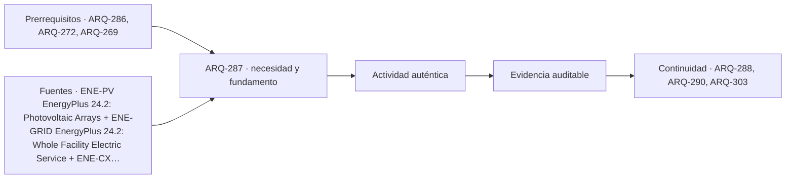

# ARQ-287 · Energía renovable e integración arquitectónica

**Parte 29 · Clase desarrollada · Incorporada en v0.17.0.**

Prerrequisitos conceptuales: ARQ-286, ARQ-272, ARQ-269. Sin calendario. Casos, series y parámetros ficticios, salvo antecedentes atribuidos. No son mediciones de un edificio ni pronósticos. Revisión externa especializada pendiente.

## Pregunta central

¿Cómo integrar generación renovable en un proyecto arquitectónico sin confundir área disponible, potencia nominal, energía producida, autoconsumo, exportación y autonomía?

## Resultado y continuidad

La clase anterior separó servicio útil y energía de entrada. Aquí abrimos **PV-POT-01** para una potencia fotovoltaica ideal y **PV-SERIE-01** para balances por intervalos. Son casos distintos: los ocho y seis kWh de la serie no se presentan como resultados del panel del primer cálculo. Añadiremos una batería puramente contable y verificaremos pérdidas y existencias. No se diseña una instalación eléctrica ni se recomiendan equipos.

## 1. La cubierta no es una superficie disponible sin restricciones

Una cubierta puede requerir accesos, mantenimiento, drenaje, equipos, protección y condiciones estructurales. Su superficie geométrica total no equivale a superficie activa de módulos. Orientación, inclinación, separación y sombras también afectan la integración.

La implantación debe conservar funciones de envolvente y recorridos de operación. Una penetración o soporte puede alterar impermeabilidad y movimientos; una nueva carga necesita revisión de la estructura. Esas preguntas no se resuelven porque el balance energético sea favorable.

La relación con el entorno incluye sombras mutuas y posibles cambios futuros de edificios vecinos. El proyecto debe identificar qué geometría se modeló y qué información permanece desconocida. Una estimación de área no sustituye el estudio de generación ni una evaluación eléctrica competente.

## 2. Un modelo simple de potencia

PV-POT-01 adopta superficie de doce metros cuadrados, fracción activa 0,90, irradiancia sobre el plano de 800 W/m², eficiencia de conversión 0,20 y eficiencia de conversión eléctrica adicional 0,95. La potencia útil ideal es `P=A f G η1 η2=1.641,6 W`.

La documentación de modelos fotovoltaicos distingue área activa, irradiancia y conversiones [[ENE-PV]](#FUENTE-ENE-PV). En nuestro ejemplo las eficiencias son constantes ficticias. No se modelan temperatura de célula, sombras parciales, cableado, degradación o límites de un inversor real.

Si esa potencia se mantuviera media hora, la energía sería 0,8208 kWh. No se multiplica por todas las horas del año ni se interpreta como potencia garantizada. Un modelo temporal requiere irradiancia y estados por intervalo, además de prestaciones pertinentes del conjunto.

## 3. Demanda y generación deben encontrarse en el tiempo

PV-SERIE-01 contiene cuatro intervalos de seis horas. La demanda eléctrica es 4, 3, 5 y 4 kWh; la generación local, 0, 8, 6 y 0. Ambas series son sintéticas y representan energía ya disponible en una misma frontera AC, sin batería.

En cada intervalo, autoconsumo es el mínimo entre demanda y generación. Importación es `max(demanda−generación,0)` y exportación `max(generación−demanda,0)`. La documentación de servicio eléctrico total mantiene esa distinción entre flujos y balance neto [[ENE-GRID]](#FUENTE-ENE-GRID).

Las importaciones resultan cuatro, cero, cero y cuatro: ocho kWh. Las exportaciones son cero, cinco, uno y cero: seis. El autoconsumo suma ocho. Demanda total dieciséis menos generación total catorce da dos, pero esos dos son importación neta, no toda la electricidad comprada.

## 4. Dos porcentajes con denominadores diferentes

La fracción de generación autoconsumida es `8/14≈57,143 %`. La fracción de demanda atendida directamente por generación es `8/16=50 %`. Ambos indicadores describen la misma serie y no son intercambiables.

Tener generación anual igual a demanda anual tampoco demostraría autonomía en cada hora. La simultaneidad importa. En nuestra serie, hay excedentes en unos intervalos e importaciones en otros, y no existe una conexión temporal entre ellos salvo la red o un almacenamiento explícito.

No se evalúan aquí compensaciones tarifarias, permisos de conexión ni precios de venta. La contabilidad física debe distinguirse del contrato económico. Un balance neto favorable no autoriza declarar que no se necesita red o que la factura será cero.

## 5. Añadir almacenamiento con una frontera clara

PV-BAT-01 utiliza la misma serie, una capacidad de cuatro kWh de energía almacenada, estado inicial cero y eficiencias de carga y descarga de 0,90. No hay límites de potencia ni envejecimiento en este modelo. La operación prioriza autoconsumo directo, luego carga con excedente y descarga ante déficit.

Si entran X kWh al proceso de carga, se almacenan `0,90X`. Para entregar Y kWh a la carga se retiran `Y/0,90` de la batería. La capacidad limita energía interna, no la energía bruta que debe comprarse o captarse para llenarla.

La batería no genera energía. El balance debe conservar estado inicial, entradas, salidas, pérdidas y estado final. Si se permite cargar desde red o cambiar prioridades, se construye otra política y se declara; no se modifica silenciosamente para obtener un indicador deseado.

## 6. Resolver los cuatro intervalos

En el primero no hay generación ni energía almacenada: se importan cuatro kWh. En el segundo, después de atender tres, sobran cinco. Para llenar la batería se necesitan `4/0,90=4,444444 kWh`; quedan 0,555556 para exportar y se pierden 0,444444 en la carga.

En el tercero sobra un kWh, pero la batería sigue llena; se exporta. En el último, la batería entrega `4×0,90=3,6 kWh`, pierde 0,4 y queda vacía. Como la demanda es cuatro, aún se importan 0,4 kWh.

Los totales son 4,4 importados, 1,555556 exportados y 0,844444 de pérdidas de almacenamiento. La identidad global es `14+4,4=16+1,555556+0,844444`. El estado final coincide con el inicial; no se ha ocultado una descarga de energía acumulada antes de la ventana.

*Figura 287. Menor importación no equivale a pérdidas nulas. La existencia almacenada se conserva como estado, no como generación adicional.*

## 7. Capacidad energética no es potencia disponible

El modelo no limita la rapidez de carga o descarga. Un equipo real tiene otras restricciones de potencia, temperatura, control y estado que requieren documentación. Cuatro kWh no dicen por sí solos cuántos kilovatios pueden entregarse en un instante.

Los intervalos de seis horas tampoco permiten deducir picos internos. Una demanda de cuatro kWh podría ser uniforme o concentrada; ambas producen igual energía y distintas exigencias de potencia. Para estudiar continuidad ante interrupciones se necesita otra resolución y una lista de servicios prioritarios.

No se presenta la batería como respaldo seguro ni como solución de emergencia. Instalación, protecciones, ventilación, incendio y conexión pertenecen a revisiones especializadas. La clase enseña balances para no atribuir al almacenamiento funciones que el cálculo no verificó.

## 8. Integración con demanda y estrategias pasivas

Reducir una demanda puede cambiar autoconsumo y exportación aunque la generación se mantenga. Por tanto, no se suman ahorros de consumo y generación calculados sobre bases diferentes sin recomponer los intervalos. ARQ-290 desarrollará esa interacción.

La generación solar puede compartir superficies con sombra, cubierta o fachadas, pero las funciones no se dan por compatibles. Una solución integrada necesita revisar orientación, acceso, encuentros, luz, estructura y mantenimiento. Atribuir dos beneficios al mismo componente exige demostrar ambos, no repetir una imagen.

La comparación ambiental también necesita fabricación, reposición y fin de vida bajo servicio equivalente. El hecho de producir energía local no resuelve por sí solo todo impacto del sistema. Aquí no se calculan emisiones evitadas ni tiempos de retorno porque no se aportaron esos datos.

## 9. Entrega reproducible

El expediente incluye geometría propuesta, modelo de potencia, serie temporal y balance con identificadores distintos. Conserva eficiencia y capacidad como hipótesis. Explica si la generación se mide antes o después de conversiones y dónde se ubica el contador de demanda.

Una conclusión adecuada afirma que PV-BAT-01 reduce importaciones del ejemplo de ocho a 4,4 kWh, a costa de pérdidas y bajo una política ideal. No afirma autonomía, ahorro tarifario ni desempeño anual. La diferencia entre contabilidad y promesa comercial debe permanecer visible.

## Superficie captadora y espacio disponible no son equivalentes

Los doce metros cuadrados de PV-POT-01 representan la superficie a la que se refiere el cálculo, no toda una cubierta. El proyecto necesita distinguir superficie activa, área exterior del producto, separación, accesos, obstáculos y zonas que no pueden ocuparse. Una multiplicación por la superficie del techo puede omitir todas esas condiciones.

Además, una potencia calculada para un intervalo no verifica su conversión en cualquier estado. Un límite de salida, una sombra o una desconexión requieren otra descripción. El modelo simple mantiene constantes sus eficiencias para enseñar el balance; no garantiza que duplicar superficie instalada duplique siempre la energía entregada. La selección real exige coordinación eléctrica, estructural y de mantenimiento que permanece fuera de estos números.

## Práctica independiente

Dos intervalos tienen demandas de dos y seis kWh y generaciones de cinco y uno. Sin batería, calcula autoconsumo, importación y exportación. Después utiliza una batería inicialmente vacía, capacidad de dos kWh y ambas eficiencias iguales a uno, sin límites de potencia. Conserva la misma política de autoconsumo y luego almacenamiento.

Explica cómo cambiaría el balance si la batería terminara con energía almacenada, y por qué esa existencia no podría contarse además como energía ya entregada al edificio.

Solución razonada

Sin batería se autoconsumen tres kWh, se importan cinco y se exportan tres. En el primer intervalo, la batería almacena dos del excedente y se exporta uno. En el segundo entrega dos adicionales, reduciendo la importación a tres. El estado final es cero y el balance es <code>generación 6+importación 3=demanda 8+exportación 1</code>.

Si quedara energía almacenada, su aumento se añadiría al lado de salidas y existencias del balance. No sería a la vez consumo atendido. El ejercicio ideal no incorpora pérdidas, potencia o seguridad de un equipo real.

## Autoevaluación y enlace

Puedes distinguir autoconsumo y cobertura, cerrar la batería y conservar los intervalos. ARQ-288 estudiará la distancia entre un desempeño proyectado y una operación real o simulada, sin atribuir automáticamente la diferencia a usuarios, equipos o una única causa.

<!-- pedagogia-2026:inicio -->
## Decisión pedagógica y posición curricular

### Por qué existe

Esta clase existe para resolver una necesidad concreta del recorrido: ¿Cómo integrar generación renovable en un proyecto arquitectónico sin confundir área disponible, potencia nominal, energía producida, autoconsumo, exportación y autonomía?

### Por qué está exactamente aquí

Ocupa el lugar 7 de la Parte 29. Se estudia después de ARQ-286 · Sistemas activos y eficiencia estacional porque usa esa base para responder «¿Cómo integrar generación renovable en un proyecto arquitectónico sin confundir área disponible, potencia nominal, energía producida, autoconsumo, exportación y autonomía?». Se ubica antes de ARQ-288 · Desempeño diseñado frente a uso real porque la evidencia producida aquí debe estar disponible para ese paso.

- **Prerrequisitos:** `ARQ-286`, `ARQ-272`, `ARQ-269`
- **Capacidad que introduce:** La clase anterior separó servicio útil y energía de entrada. Aquí abrimos PV-POT-01 para una potencia fotovoltaica ideal y PV-SERIE-01 para balances por intervalos. Son casos distintos: los ocho y seis kWh de la serie no se presentan como resultados del panel del primer cálculo.
- **Clases o experiencias que dependen de ella:** `ARQ-288`, `ARQ-290`, `ARQ-303`

El diagrama permite comprobar una relación que el texto lineal oculta con facilidad: esta clase recibe capacidades previas, toma decisiones apoyadas por fuentes, exige una experiencia y produce evidencia que habilita trabajo posterior. No representa un procedimiento de obra.

## Resultado observable, evidencia y evaluación

1. Identificar y delimitar las condiciones necesarias para responder la pregunta central de energía renovable e integración arquitectónica.
2. Producir y comprobar la evidencia declarada por la clase: La clase anterior separó servicio útil y energía de entrada. Aquí abrimos PV-POT-01 para una potencia fotovoltaica ideal y PV-SERIE-01 para balances por intervalos. Son casos distintos: los ocho y seis kWh de la serie no se presentan como resultados del panel del primer cálculo.
3. Justificar una decisión de energía renovable e integración arquitectónica mediante fuentes, supuestos, alternativas y límites explícitos.

## Actividad, evidencia y criterio de aceptación

**Actividad:** Dos intervalos tienen demandas de dos y seis kWh y generaciones de cinco y uno. Sin batería, calcula autoconsumo, importación y exportación. Después utiliza una batería inicialmente vacía, capacidad de dos kWh y ambas eficiencias iguales a uno, sin límites de potencia.

**Evidencia mínima:** La clase anterior separó servicio útil y energía de entrada. Aquí abrimos PV-POT-01 para una potencia fotovoltaica ideal y PV-SERIE-01 para balances por intervalos. Son casos distintos: los ocho y seis kWh de la serie no se presentan como resultados del panel del primer cálculo.

**Archivo sugerido:** `evidence/ARQ-287/evidencia.md`.

**Criterio de aceptación:** la entrega se acepta cuando:

- La entrega responde explícitamente a la pregunta: ¿Cómo integrar generación renovable en un proyecto arquitectónico sin confundir área disponible, potencia nominal, energía producida, autoconsumo, exportación y autonomía?
- La actividad conserva las fronteras del caso y permite reconstruir el procedimiento: Dos intervalos tienen demandas de dos y seis kWh y generaciones de cinco y uno. Sin batería, calcula autoconsumo, importación y exportación. Después utiliza una batería inicialmente vacía, capacidad de dos kWh y ambas eficiencias iguales a uno, sin límites de potencia.
- Cada afirmación externa puede seguirse hasta una fuente, su alcance consultado y su límite.
- La evidencia deja disponible una entrada comprobable para ARQ-288.
- Puedes distinguir autoconsumo y cobertura, cerrar la batería y conservar los intervalos. ARQ-288 estudiará la distancia entre un desempeño proyectado y una operación real o simulada, sin atribuir automáticamente la diferencia a usuarios, equipos o una única causa.

La [rúbrica común](../../docs/RUBRICA_COMUN.md) complementa estos criterios; no los reemplaza. Una entrega puede superar un promedio y continuar pendiente si oculta una condición crítica.

## Trazabilidad de las decisiones

| # | Decisión o fundamento | Fuente utilizada | Aplicación y límite en esta clase |
|---:|---|---|---|
| 1 | Distinguir potencia, energía, DC/AC y supuestos de eficiencia. | [ENE-PV EnergyPlus 24.2: Photovoltaic Arrays](https://bigladdersoftware.com/epx/docs/24-2/engineering-reference/photovoltaic-arrays.html) | Consulta: Modelo simple y separación entre área activa, radiación y conversiones. Límite: No se ejecutó PVWatts ni se dimensiona una instalación eléctrica. |
| 2 | Conservar sentidos de flujos y diferencias entre balance neto y compras reales. | [ENE-GRID EnergyPlus 24.2: Whole Facility Electric Service](https://bigladdersoftware.com/epx/docs/24-2/engineering-reference/whole-facility-electric-service.html) | Consulta: Balances de demanda, producción, importación, exportación y almacenamiento. Límite: La batería docente no representa un equipo ni contempla seguridad eléctrica, envejecimiento o límites de potencia. |
| 3 | Organizar comprobaciones desde el requisito hasta la operación. | [ENE-CX Commissioning in Federal Buildings](https://www.energy.gov/cmei/femp/commissioning-federal-buildings) | Consulta: Definición, revisión, pruebas funcionales, documentación y continuidad operativa. Límite: No se trasladan obligaciones federales a Chile ni se realizan pruebas sobre instalaciones reales. |

La tabla permite auditar las relaciones; la explicación, el caso y la práctica de la clase siguen siendo la documentación principal.

## Autoevaluación, recuperación y continuidad

### Errores diagnósticos

Antes de avanzar, comprueba si puedes reconstruir cada resultado sin mirar la solución, señalar qué evidencia lo sostiene y nombrar una condición que obligaría a revisar tu decisión. Conserva la primera versión, la objeción recibida y la revisión.

**Conexión siguiente:** La continuidad inmediata es ARQ-288 · Desempeño diseñado frente a uso real; conserva el método y vuelve a verificar datos y límites.
<!-- pedagogia-2026:fin -->

## Fuentes y alcance de uso

Los modelos, datos, figuras, prácticas y soluciones son elaboraciones originales. Consulta de fuentes nuevas: 22 de septiembre de 2026. Las referencias heredadas conservan su alcance. No se afirma aplicación íntegra de normas ni ejecución de simuladores externos.

### [[ENE-PV]](#FUENTE-ENE-PV) EnergyPlus 24.2: Photovoltaic Arrays

EnergyPlus / U.S. Department of Energy. [https://bigladdersoftware.com/epx/docs/24-2/engineering-reference/photovoltaic-arrays.html](https://bigladdersoftware.com/epx/docs/24-2/engineering-reference/photovoltaic-arrays.html)

**Consulta:** Modelo simple y separación entre área activa, radiación y conversiones. **Apoyo:** Distinguir potencia, energía, DC/AC y supuestos de eficiencia. **Límite:** No se ejecutó PVWatts ni se dimensiona una instalación eléctrica.

### [[ENE-GRID]](#FUENTE-ENE-GRID) EnergyPlus 24.2: Whole Facility Electric Service

EnergyPlus / U.S. Department of Energy. [https://bigladdersoftware.com/epx/docs/24-2/engineering-reference/whole-facility-electric-service.html](https://bigladdersoftware.com/epx/docs/24-2/engineering-reference/whole-facility-electric-service.html)

**Consulta:** Balances de demanda, producción, importación, exportación y almacenamiento. **Apoyo:** Conservar sentidos de flujos y diferencias entre balance neto y compras reales. **Límite:** La batería docente no representa un equipo ni contempla seguridad eléctrica, envejecimiento o límites de potencia.

### [[ENE-CX]](#FUENTE-ENE-CX) Commissioning in Federal Buildings

U.S. Department of Energy / FEMP. [https://www.energy.gov/cmei/femp/commissioning-federal-buildings](https://www.energy.gov/cmei/femp/commissioning-federal-buildings)

**Consulta:** Definición, revisión, pruebas funcionales, documentación y continuidad operativa. **Apoyo:** Organizar comprobaciones desde el requisito hasta la operación. **Límite:** No se trasladan obligaciones federales a Chile ni se realizan pruebas sobre instalaciones reales.
