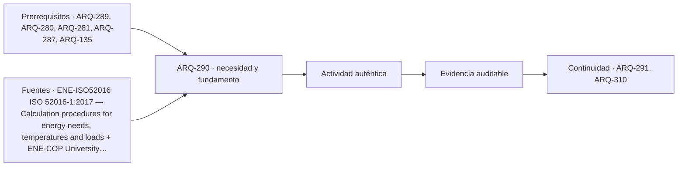

# ARQ-290 · Comparación de alternativas sin dobles conteos

**Parte 29 · Clase desarrollada · Incorporada en v0.17.0.**

Prerrequisitos conceptuales: ARQ-289, ARQ-280, ARQ-281, ARQ-287, ARQ-135. Sin calendario. Casos, series y parámetros ficticios, salvo antecedentes atribuidos. No son mediciones de un edificio ni pronósticos. Revisión externa especializada pendiente.

## Pregunta central

¿Cómo comparar aislamiento, equipos y generación sin sumar ahorros incompatibles ni confundir menor demanda térmica, menor electricidad utilizada y menor compra a la red?

## Resultado y continuidad

Esta clase cierra las partes 28 y 29 con **ENE-PACK-01**, un caso nuevo que conserva un servicio hipotéticamente equivalente entre alternativas. Integrarás demanda, conversión y generación por intervalos y redactarás una comparación con límites explícitos. Sus cifras no pertenecen a PV-SERIE-01 de ARQ-287 ni a un edificio medido. La siguiente clase pendiente, ARQ-291, estudiará disponibilidad y distribución de luz natural.

## 1. Ordenar las preguntas antes de ordenar alternativas

Una estrategia de envolvente modifica intercambios y demanda bajo ciertas condiciones. Un equipo transforma la relación entre servicio útil y energía de entrada. Una generación local modifica el origen de la electricidad que se utiliza, importa o exporta. Las tres pueden relacionarse, pero no representan la misma operación.

Si se instala generación sin cambiar el servicio ni la envolvente, no desaparece por ello la demanda térmica del recinto. Si mejora un equipo, puede reducirse su entrada manteniendo calor útil. Si cambia una ventana, también pueden cambiar luz y ganancias solares, no solo transmisión. La comparación debe identificar qué hipótesis modifica cada medida.

El marco de ISO 52016-1 distingue necesidades, temperaturas y cargas dentro de su alcance [[ENE-ISO52016]](#FUENTE-ENE-ISO52016). La clase mantiene esas categorías sin ejecutar el procedimiento normativo. Su finalidad es cerrar una contabilidad didáctica y detectar afirmaciones que mezclan niveles.

## 2. Una base común y un servicio declarado

ENE-PACK-01 utiliza cuatro intervalos de seis horas. La demanda útil de calefacción es treinta, cuarenta, treinta y veinte kWh: ciento veinte en total. La base supone conversión eléctrica directa ideal, COP igual a uno, sin pérdidas adicionales dentro de esa frontera.

Otros servicios eléctricos consumen cinco kWh en cada intervalo, veinte en total. La entrada eléctrica base es por tanto 35, 45, 35 y 25 kWh: ciento cuarenta. Los otros servicios no se reducen cuando cambia el equipo de calefacción, salvo una variante que lo declarase expresamente.

El servicio equivalente es una hipótesis de comparación, no un resultado de pruebas con personas. No se ha derivado la demanda de una geometría real ni demostrado disponibilidad de potencia. Los intervalos describen una ventana de operación ficticia; no constituyen un año típico ni un calendario de estudio.

## 3. Dos medidas calculadas por separado

La medida ENV reduce la demanda útil al setenta y cinco por ciento de la base bajo las condiciones adoptadas. La nueva demanda es noventa kWh. Manteniendo COP uno y los veinte de otros servicios, la entrada queda en 110: reducción de treinta respecto de 140.

La medida EQU mantiene los ciento veinte útiles, pero utiliza un COP de tres constante en la ventana. Su entrada de calefacción es cuarenta kWh; con los otros veinte, el total es sesenta. La reducción respecto de la base es ochenta.

La relación de COP exige distinguir calor transferido y trabajo de entrada [[ENE-COP]](#FUENTE-ENE-COP). El valor tres es una hipótesis uniforme de este ejercicio, no una ficha de producto ni una eficiencia estacional medida. La clase anterior enseñó qué evidencia sería necesaria para evaluar esa condición en operación.

## 4. Combinar no significa sumar ahorros independientes

Con ENV y EQU simultáneamente, primero queda una demanda útil de noventa kWh y luego una entrada de calefacción de treinta. Añadiendo otros servicios, el total es cincuenta. La reducción conjunta es noventa, no ciento diez.

Sumar treinta de ENV y ochenta de EQU habría contado dos veces una parte de la reducción. EQU se evaluó por separado convirtiendo ciento veinte kWh, pero tras ENV convierte noventa. ENV se evaluó ahorrando electricidad con COP uno; después de EQU, cada unidad térmica evitada cambia menos la entrada eléctrica.

Los dos recorridos correctos son: 140 a 110 por ENV y luego a cincuenta por EQU, con reducciones treinta y sesenta; o 140 a sesenta por EQU y luego a cincuenta por ENV, con reducciones ochenta y diez. Ambos suman noventa. La interacción de veinte explica por qué no se agregan los ahorros aislados.

## 5. Conservar los intervalos al incorporar generación

La entrada eléctrica conjunta por intervalo es 12,50; quince; 12,50 y diez kWh. **PACK-PV** añade una generación ficticia de cero, veinte, quince y cero. Su total es treinta y cinco, distinto de la serie utilizada en ARQ-287.

Sin almacenamiento, en cada intervalo se utiliza directamente el menor valor entre generación y demanda. Resultan cero, quince, 12,50 y cero: autoconsumo de 27,50 kWh. Las importaciones son 12,50; cero; cero y diez: 22,50. Las exportaciones son cero; cinco; 2,50 y cero: 7,50.

El balance cierra: `generación35 + importación22,50 = uso50 + exportación7,50`. El tratamiento separado de importación, exportación y almacenamiento también aparece en la documentación del servicio eléctrico de EnergyPlus [[ENE-GRID]](#FUENTE-ENE-GRID). Aquí se resuelve aritméticamente el caso; no se ejecutó ese motor.

*Figura 290. ENV y EQU reducen la entrada a cincuenta kWh; PACK-PV cambia su abastecimiento. Importar 22,50 y exportar 7,50 no equivale a importar solamente quince.*

## 6. Tres porcentajes que no deben intercambiarse

La compra bruta a la red baja de 140 a 22,50 kWh dentro de la ventana: reducción de 117,50. La compra neta, definida aquí como importación menos exportación, es quince. Comparar 140 con quince responde a otra pregunta; no convierte la importación física en quince ni permite valorar facturas sin reglas de compensación.

La fracción de generación utilizada directamente es `27,50/35=78,57 %`. La fracción del consumo eléctrico atendida directamente por esa generación es `27,50/50=55 %`. El numerador es igual, pero los denominadores describen cosas distintas.

Ninguno de esos porcentajes acredita autonomía, seguridad eléctrica o disponibilidad durante una interrupción. La generación ocurre cuando el sistema y sus condiciones lo permiten. Las hipótesis de capacidad, controles, conexión y mantenimiento deben investigarse por separado antes de asignar una prestación real.

## 7. Una frontera temporal distinta puede cambiar la conclusión

En estos cuatro intervalos la generación supera al consumo durante dos y falta durante otros dos. Agregar previamente habría ocultado esa alternancia. Una batería exigiría estados, eficiencias y límites; no se añade un crédito abstracto de almacenamiento al balance sin modificar entradas y salidas.

La ventana elegida tampoco demuestra un resultado anual. Debe abarcar condiciones pertinentes para el servicio, clima, horarios y operación. Un período especialmente favorable a la generación puede servir como ensayo de un estado, pero no como sustituto de una comparación representativa.

La disponibilidad de datos limita la resolución temporal. Si solo se conocen totales, pueden conservarse como tales y declararse desconocida la simultaneidad. No se inventa una curva conveniente para calcular autoconsumo. La calidad de una conclusión depende también de reconocer qué no identifica su información.

## 8. Costos e impactos conservan otras reglas

Para comparar costos hacen falta tarifas, horizontes, inversión, operación, reposición y condiciones contractuales. Para comparar impactos ambientales hacen falta unidad de servicio, inventario, límites, indicadores y método. Una disminución de kWh no permite atribuir una cantidad de dinero o emisiones sin esos datos.

El marco de análisis de ciclo de vida exige definir objetivo y alcance [[ISO-14040]](#FUENTE-ISO-14040). Se recupera esa disciplina, no factores ambientales de otros materiales. La energía exportada no recibe un beneficio universal; su tratamiento depende del método. Una reposición futura tampoco desaparece porque la comparación inicial sea favorable.

No se suman porcentajes de indicadores distintos. Mejorar cierta intensidad no demuestra reducir el total si cambia la superficie o el servicio. El expediente debe permitir reconstruir denominadores y exclusiones antes de defender una alternativa por un número destacado.

## 9. Estado de las alternativas y evidencia pendiente

La matriz final distingue cálculos comprobados, hipótesis compartidas y condiciones pendientes. Se verificaron sumas y relaciones bajo el caso. Se supuso que ENV conserva el servicio y que EQU entrega COP tres. Quedan pendientes propiedades de una solución real, controles, cargas máximas, disponibilidad y operación.

Una opción no se declara seleccionada por una única magnitud cuando mantiene condiciones necesarias sin verificar. El método de ARQ-135 ayuda a separar restricciones y preferencias. La medición y verificación de ARQ-289 permite formular cómo se contrastarían las hipótesis [[ENE-MV]](#FUENTE-ENE-MV).

El cierre también identifica cambios de otros ámbitos: una protección solar afecta luz; un equipo necesita espacio y mantenimiento; una generación requiere coordinación con estructura y envolvente. La comparación energética no borra el resto del programa arquitectónico.

## Práctica independiente

Otra base demanda ochenta kWh útiles y veinte de otros servicios, con COP uno. ENV reduce a la mitad la demanda y EQU utiliza COP cuatro. Calcula cada medida aislada y su combinación; demuestra el error de sumar ahorros respecto de la misma base.

En otro balance sin almacenamiento, el consumo eléctrico es dos, seis y cuatro kWh, y la generación cinco, uno y cuatro. Calcula uso directo, importación y exportación por intervalo, y ambos porcentajes de cobertura. Mantén este balance separado del anterior: no se afirmó que fuera su distribución temporal.

Solución razonada

La base suma cien. ENV deja cuarenta útiles más veinte: sesenta, ahorro cuarenta. EQU requiere veinte eléctricos de calefacción más veinte: cuarenta, ahorro sesenta. Juntas requieren diez más veinte: treinta, ahorro setenta. Sumar cuarenta y sesenta daría cien y duplicaría treinta de interacción.

En el balance separado, el uso directo es dos, uno y cuatro: siete. Se importan cero, cinco y cero: cinco; se exportan tres, cero y cero: tres. Generación diez más importación cinco iguala consumo doce más exportación tres. Autoconsumo es setenta por ciento de generación; cobertura directa, 58,33 % del consumo.

Los resultados no prueban ahorro anual ni equivalencia ambiental. La respuesta debe incluir servicio, frontera, ventana, hipótesis y evidencia pendiente. Dos balances correctos no pueden combinarse si no se definió que representan el mismo sistema.

## Autoevaluación y entrega a iluminación

Reconstruye una combinación sin duplicar ahorros, conserva la cronología de la generación y explica qué evidencia falta. El recorrido continúa en ARQ-291 con luz natural. La radiación solar en W/m² no se convierte directamente en iluminancia, y una menor ganancia térmica no garantiza una mejor experiencia visual. Se transfieren métodos de representación y balance, no equivalencias entre magnitudes distintas.

<!-- pedagogia-2026:inicio -->
## Decisión pedagógica y posición curricular

### Por qué existe

Esta clase existe para resolver una necesidad concreta del recorrido: ¿Cómo comparar aislamiento, equipos y generación sin sumar ahorros incompatibles ni confundir menor demanda térmica, menor electricidad utilizada y menor compra a la red?

### Por qué está exactamente aquí

Cierra la Parte 29: integra lo producido en ARQ-289 · Comisionamiento energético y medición para responder «¿Cómo comparar aislamiento, equipos y generación sin sumar ahorros incompatibles ni confundir menor demanda térmica, menor electricidad utilizada y menor compra a la red?». La transición hacia ARQ-291 · Luz natural: disponibilidad y distribución transfiere el método y la disciplina de evidencia, no los datos o parámetros particulares de esta parte.

- **Prerrequisitos:** `ARQ-289`, `ARQ-280`, `ARQ-281`, `ARQ-287`, `ARQ-135`
- **Capacidad que introduce:** Esta clase cierra las partes 28 y 29 con ENE-PACK-01 , un caso nuevo que conserva un servicio hipotéticamente equivalente entre alternativas. Integrarás demanda, conversión y generación por intervalos y redactarás una comparación con límites explícitos. Sus cifras no pertenecen a PV-SERIE-01 de ARQ-287 ni a un edificio medido.
- **Clases o experiencias que dependen de ella:** `ARQ-291`, `ARQ-310`

El diagrama permite comprobar una relación que el texto lineal oculta con facilidad: esta clase recibe capacidades previas, toma decisiones apoyadas por fuentes, exige una experiencia y produce evidencia que habilita trabajo posterior. No representa un procedimiento de obra.

## Resultado observable, evidencia y evaluación

1. Identificar y delimitar las condiciones necesarias para responder la pregunta central de comparación de alternativas sin dobles conteos.
2. Producir y comprobar la evidencia declarada por la clase: Esta clase cierra las partes 28 y 29 con ENE-PACK-01 , un caso nuevo que conserva un servicio hipotéticamente equivalente entre alternativas. Integrarás demanda, conversión y generación por intervalos y redactarás una comparación con límites explícitos. Sus cifras no pertenecen a PV-SERIE-01 de ARQ-287 ni a un edificio medido.
3. Justificar una decisión de comparación de alternativas sin dobles conteos mediante fuentes, supuestos, alternativas y límites explícitos.

## Actividad, evidencia y criterio de aceptación

**Actividad:** Otra base demanda ochenta kWh útiles y veinte de otros servicios, con COP uno. ENV reduce a la mitad la demanda y EQU utiliza COP cuatro. Calcula cada medida aislada y su combinación; demuestra el error de sumar ahorros respecto de la misma base.

**Evidencia mínima:** Esta clase cierra las partes 28 y 29 con ENE-PACK-01 , un caso nuevo que conserva un servicio hipotéticamente equivalente entre alternativas. Integrarás demanda, conversión y generación por intervalos y redactarás una comparación con límites explícitos. Sus cifras no pertenecen a PV-SERIE-01 de ARQ-287 ni a un edificio medido.

**Archivo sugerido:** `evidence/ARQ-290/evidencia.md`.

**Criterio de aceptación:** la entrega se acepta cuando:

- La entrega responde explícitamente a la pregunta: ¿Cómo comparar aislamiento, equipos y generación sin sumar ahorros incompatibles ni confundir menor demanda térmica, menor electricidad utilizada y menor compra a la red?
- La actividad conserva las fronteras del caso y permite reconstruir el procedimiento: Otra base demanda ochenta kWh útiles y veinte de otros servicios, con COP uno. ENV reduce a la mitad la demanda y EQU utiliza COP cuatro. Calcula cada medida aislada y su combinación; demuestra el error de sumar ahorros respecto de la misma base.
- Cada afirmación externa puede seguirse hasta una fuente, su alcance consultado y su límite.
- La evidencia deja disponible una entrada comprobable para ARQ-291.
- Reconstruye una combinación sin duplicar ahorros, conserva la cronología de la generación y explica qué evidencia falta. El recorrido continúa en ARQ-291 con luz natural.

La [rúbrica común](../../docs/RUBRICA_COMUN.md) complementa estos criterios; no los reemplaza. Una entrega puede superar un promedio y continuar pendiente si oculta una condición crítica.

## Trazabilidad de las decisiones

| # | Decisión o fundamento | Fuente utilizada | Aplicación y límite en esta clase |
|---:|---|---|---|
| 1 | Distinguir energía, carga, humedad y zona térmica en procedimientos de desempeño. | [ENE-ISO52016 ISO 52016-1:2017 — Calculation procedures for energy…](https://www.iso.org/standard/65696.html) | Consulta: Ficha pública, resumen y alcance; confirmación 2022 indicada en catálogo. Límite: No se leyó ni implementó el texto normativo íntegro. No se afirma cumplimiento. |
| 2 | Distinguir transferencia de calor de generación de energía y calcular COP. | [ENE-COP University Physics Volume 2, 4.3: Refrigerators and Heat Pumps](https://openstax.org/books/university-physics-volume-2/pages/4-3-refrigerators-and-heat-pumps) | Consulta: Sección sobre conservación de energía y coeficientes de desempeño. Límite: Casos originales; no se copian ejemplos del libro ni se seleccionan equipos. |
| 3 | Conservar sentidos de flujos y diferencias entre balance neto y compras reales. | [ENE-GRID EnergyPlus 24.2: Whole Facility Electric Service](https://bigladdersoftware.com/epx/docs/24-2/engineering-reference/whole-facility-electric-service.html) | Consulta: Balances de demanda, producción, importación, exportación y almacenamiento. Límite: La batería docente no representa un equipo ni contempla seguridad eléctrica, envejecimiento o límites de potencia. |
| 4 | Distinguir medición aislada, balance global, regresión y simulación calibrada. | [ENE-MV Measurement and Verification Options for Federal Energy- and…](https://www.energy.gov/cmei/femp/measurement-and-verification-options-federal-energy-and-water-saving-projects) | Consulta: Descripción de opciones A, B, C y D, fronteras y ajuste a condiciones. Límite: Referencia metodológica estadounidense; no se aplica un contrato de desempeño ni se afirma cumplir IPMVP. |

La tabla permite auditar las relaciones; la explicación, el caso y la práctica de la clase siguen siendo la documentación principal.

## Autoevaluación, recuperación y continuidad

### Errores diagnósticos

Antes de avanzar, comprueba si puedes reconstruir cada resultado sin mirar la solución, señalar qué evidencia lo sostiene y nombrar una condición que obligaría a revisar tu decisión. Conserva la primera versión, la objeción recibida y la revisión.

**Conexión siguiente:** La continuidad inmediata es ARQ-291 · Luz natural: disponibilidad y distribución; conserva el método y vuelve a verificar datos y límites.
<!-- pedagogia-2026:fin -->

## Fuentes y alcance de uso

Los modelos, datos, figuras, prácticas y soluciones son elaboraciones originales. Consulta de fuentes nuevas: 22 de septiembre de 2026. Las referencias heredadas conservan su alcance. No se afirma aplicación íntegra de normas ni ejecución de simuladores externos.

### [[ENE-ISO52016]](#FUENTE-ENE-ISO52016) ISO 52016-1:2017 — Calculation procedures for energy needs, temperatures and loads

International Organization for Standardization. [https://www.iso.org/standard/65696.html](https://www.iso.org/standard/65696.html)

**Consulta:** Ficha pública, resumen y alcance; confirmación 2022 indicada en catálogo. **Apoyo:** Distinguir energía, carga, humedad y zona térmica en procedimientos de desempeño. **Límite:** No se leyó ni implementó el texto normativo íntegro. No se afirma cumplimiento.

### [[ENE-COP]](#FUENTE-ENE-COP) University Physics Volume 2, 4.3: Refrigerators and Heat Pumps

OpenStax / Rice University. [https://openstax.org/books/university-physics-volume-2/pages/4-3-refrigerators-and-heat-pumps](https://openstax.org/books/university-physics-volume-2/pages/4-3-refrigerators-and-heat-pumps)

**Consulta:** Sección sobre conservación de energía y coeficientes de desempeño. **Apoyo:** Distinguir transferencia de calor de generación de energía y calcular COP. **Límite:** Casos originales; no se copian ejemplos del libro ni se seleccionan equipos.

### [[ENE-GRID]](#FUENTE-ENE-GRID) EnergyPlus 24.2: Whole Facility Electric Service

EnergyPlus / U.S. Department of Energy. [https://bigladdersoftware.com/epx/docs/24-2/engineering-reference/whole-facility-electric-service.html](https://bigladdersoftware.com/epx/docs/24-2/engineering-reference/whole-facility-electric-service.html)

**Consulta:** Balances de demanda, producción, importación, exportación y almacenamiento. **Apoyo:** Conservar sentidos de flujos y diferencias entre balance neto y compras reales. **Límite:** La batería docente no representa un equipo ni contempla seguridad eléctrica, envejecimiento o límites de potencia.

### [[ENE-MV]](#FUENTE-ENE-MV) Measurement and Verification Options for Federal Energy- and Water-Saving Projects

U.S. Department of Energy / FEMP. [https://www.energy.gov/cmei/femp/measurement-and-verification-options-federal-energy-and-water-saving-projects](https://www.energy.gov/cmei/femp/measurement-and-verification-options-federal-energy-and-water-saving-projects)

**Consulta:** Descripción de opciones A, B, C y D, fronteras y ajuste a condiciones. **Apoyo:** Distinguir medición aislada, balance global, regresión y simulación calibrada. **Límite:** Referencia metodológica estadounidense; no se aplica un contrato de desempeño ni se afirma cumplir IPMVP.

### [[ISO-14040]](#FUENTE-ISO-14040) ISO 14040:2006 — Life cycle assessment — Principles and framework

ISO. [https://www.iso.org/standard/37456.html](https://www.iso.org/standard/37456.html)

**Consulta:** Ficha pública **Apoyo:** Objetivo y alcance, inventario, evaluación e interpretación de ACV **Límite:** Revisar enmiendas aplicables; no se reproduce el texto normativo.
