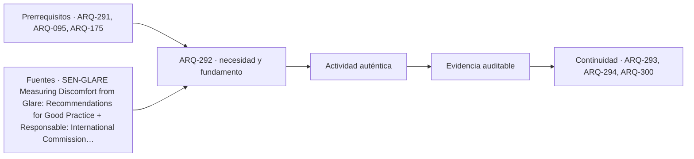

# ARQ-292 · Deslumbramiento y contraste

**Parte 30 · Clase desarrollada · Incorporada en v0.18.0.**

Prerrequisitos conceptuales: ARQ-291, ARQ-095, ARQ-175. Sin calendario. Casos, observaciones y parámetros ficticios salvo antecedentes atribuidos. Material educativo; revisión externa especializada pendiente.

## Pregunta central

¿Por qué una tarea puede recibir suficiente iluminancia y seguir siendo difícil o molesta de observar, y cómo distinguir el contraste que ayuda a verla del brillo que interfiere con esa tarea?

## Resultado y continuidad

La clase anterior describió luz incidente sobre regiones. Aquí cambiamos de perspectiva: identificamos observador, dirección de mirada, objeto y fondo. Resolverás un modelo de superficies difusas, otro de velo luminoso y una comparación geométrica de una fuente extensa. Son auxiliares independientes de SALA-LUZ-01. No constituyen una evaluación clínica ni una implementación de un índice de deslumbramiento.

## 1. Molestia y pérdida de visibilidad no son idénticas

Una escena puede producir incomodidad sin impedir reconocer un objeto; también puede reducir la visibilidad por luz dispersa o reflejos. Fotios y Kent distinguen la experiencia de molestia de la reducción del desempeño visual y señalan que no siempre aparecen juntas [[SEN-GLARE]](#FUENTE-SEN-GLARE). Por eso «se ve» y «resulta cómodo trabajar» son preguntas diferentes.

El proyecto debe registrar qué actividad se realiza, cuánto cambia la mirada, qué aparece alrededor de la tarea y qué posibilidades de ajuste existen. Un punto muy luminoso detrás de la cabeza no ocupa la misma posición en el campo visual que uno junto al texto. Una pantalla orientada hacia una ventana puede reflejarla aunque el luxómetro horizontal no muestre un valor extremo.

No se diagnostica una condición visual a partir de una queja ni se descarta esa experiencia por tener una cifra favorable. La observación orienta qué investigar: fuente, posición, reflejo, contraste, adaptación o control. Las soluciones requieren comprender el mecanismo, no limitarse a reducir toda la luz disponible.

## 2. De iluminancia a luminancia bajo una hipótesis

Para una superficie perfectamente difusa o lambertiana, con reflectancia luminosa ρ e iluminancia E, el modelo proporciona `L = ρE/π`. La relación depende de esa hipótesis de distribución; no describe del mismo modo una superficie especular, translúcida o con brillo direccional. Las unidades pasan de lux a cd/m² mediante el modelo angular, no porque ambas magnitudes sean sinónimas [[LIGHT-LUM]](#FUENTE-LIGHT-LUM).

En **VIS-DIF-01**, objeto y fondo reciben 500 lx. El fondo tiene reflectancia 0,80 y el objeto, 0,20. Sus luminancias son respectivamente 127,324 y 31,831 cd/m². La diferencia es −95,493 cd/m² si restamos fondo a objeto. El signo expresa que el objeto es más oscuro, no un error de medición.

Si ambos reciben 1.000 lx y conservan reflectancias, las luminancias se duplican. Su relación permanece igual. Aumentar la iluminación puede cambiar otros aspectos de la experiencia, pero no modifica automáticamente todos los contrastes. Hay que decir qué definición de contraste se está utilizando y qué variables cambian.

## 3. Definir el contraste antes de compararlo

Para un objeto pequeño respecto de un fondo aproximadamente uniforme utilizamos, como herramienta del caso, contraste de Weber: `C = (L_objeto−L_fondo)/L_fondo`. En VIS-DIF-01 resulta `(31,831−127,324)/127,324 = −0,75`. Su magnitud es 0,75; el signo conserva la polaridad.

Existen otras definiciones para distribuciones periódicas o escenas distintas. No es correcto colocar cifras calculadas con definiciones diferentes en una misma columna sin identificarlas. Tampoco el valor por sí solo fija tamaño de letra, tiempo de lectura, capacidad visual o comodidad.

En el ejemplo de duplicar la iluminancia, numerador y denominador se multiplican por dos y el contraste de Weber permanece −0,75. Esta invariancia pertenece a superficies, iluminación y modelo declarados. Si una sombra afecta solo al objeto o cambia una reflexión, ya no estamos multiplicando todas las luminancias por el mismo factor.

## 4. Añadir un velo: diferencia constante, contraste menor

En **VIS-VELO-01** agregamos una luminancia de velo ideal de 40 cd/m² a objeto y fondo. El modelo representa una contribución que reduce la diferenciación aparente; no predice cómo se genera dentro de un ojo concreto. Las luminancias utilizadas pasan a 71,831 y 167,324.

La diferencia continúa siendo −95,493, porque se añadió el mismo valor a ambas. Pero el contraste es ahora `−95,493/167,324 = −0,570707`. La magnitud bajó de 0,75 a aproximadamente 0,571. Este cálculo muestra por qué conservar la diferencia absoluta no conserva la diferencia relativa respecto del fondo.

No se infiere de esa cifra una probabilidad de error de lectura. Para eso harían falta tarea, observadores, condiciones y método. La utilidad arquitectónica está en formular una comprobación: localizar fuentes o reflejos que añaden luz no deseada a la dirección de observación y estudiar alternativas que no eliminen la luz útil de toda la sala.

*Figura 292. El velo ideal conserva la diferencia absoluta y cambia el contraste relativo. No es una simulación de visión individual ni un umbral de deslumbramiento.*

## 5. Una fuente tiene tamaño angular, no solo dimensiones

Considera una abertura rectangular luminosa de dos metros de ancho por 1,50 de alto, observada desde su eje perpendicular. Sus dimensiones físicas permanecen iguales, pero no ocupa la misma porción del campo visual a tres metros que a seis. Para describir esa relación empleamos el ángulo sólido.

Si a y b son los semianchos y d la distancia, la integración geométrica para el rectángulo centrado da `Ω = 4 arctan[ab/(d√(d²+a²+b²))]`. Aquí a=1 y b=0,75 metros. Al duplicar d, Ω disminuye; el cálculo no equivale a dividir siempre por cuatro, porque la geometría extensa se mantiene en la expresión completa.

La luminancia de una fuente uniforme ideal no se reduce simplemente con el cuadrado de la distancia en este planteamiento. Lo que cambia es su extensión angular y la contribución integrada al punto receptor. Confundir luminancia con intensidad o iluminancia llevaría a aplicar una ley de distancia a la variable equivocada.

## 6. Encontrar un reflejo mediante geometría

Un segundo esquema utiliza un plano reflectante horizontal en y=0. En una sección bidimensional, el ojo está en (0,1) y la fuente puntual en (2,2), en metros. Reflejar virtualmente la fuente al punto (2,−2) convierte el camino especular en una línea recta entre ojo y fuente virtual.

La recta cruza y=0 en x=2/3. Ese es el punto de reflexión del modelo. Si la superficie útil no contiene ese punto, aquel camino específico no existe sobre ella. Si lo contiene, la geometría permite estudiarlo, pero no entrega todavía la intensidad del reflejo: faltan propiedades de superficie, extensión y distribución de la fuente.

Este procedimiento ayuda a coordinar posición de pantallas, luminarias y ventanas. Cambiar el acabado puede modificar la distribución reflejada; cambiar el puesto modifica el camino. Son estrategias diferentes. Una imagen renderizada sin propiedades ópticas verificadas no permite escoger entre ellas por su realismo aparente.

## 7. Índices y experiencia: conservar el alcance

Los índices técnicos de deslumbramiento combinan variables según modelos y ámbitos determinados. No se obtiene un índice válido introduciendo cualquier luminancia y distancia en una expresión encontrada sin conocer sus condiciones. Esta clase no calcula UGR ni DGP; sus modelos aíslan relaciones para preparar una lectura crítica posterior.

La evaluación subjetiva también necesita diseño. Las instrucciones, categorías de respuesta, orden y posibilidades de ajuste pueden influir en lo registrado. El trabajo de Fotios y Kent sirve como referencia para identificar esos problemas metodológicos [[SEN-GLARE]](#FUENTE-SEN-GLARE). No se copian sus datos de participantes ni se afirma haber realizado un ensayo equivalente.

Para el proyecto, prepara escenas comparables y preguntas específicas: qué tarea se dificulta, en qué posición aparece el reflejo y qué modificación se observa. No preguntes únicamente si una alternativa «es moderna y confortable». Esa frase mezcla expectativas estéticas con una prestación que necesita evidencia distinta.

## 8. Coordinar controles sin trasladar el problema

Una protección móvil puede reducir una fuente molesta, pero también oscurecer el fondo. Una luminaria adicional puede aumentar la luz útil o añadir otro reflejo. Un acabado menos brillante puede dispersar luz sin mejorar todas las condiciones. La evaluación debe conservar el conjunto objeto–fondo–observador.

Dibuja al menos una sección y una vista desde la tarea. Identifica qué control usa la persona, si es comprensible y si permanece disponible. Un sistema que solo funciona cuando alguien modifica una persiana inaccesible no resuelve la actividad de forma equivalente a un control utilizable.

La decisión final debe declarar qué se calculó y qué se contrastaría con personas. La documentación de una queja no exige publicar identidades o fotografías del rostro. Puede conservar posición, tarea, condición y respuesta con consentimiento apropiado, siguiendo el cuidado de los datos de investigación [[RES-CONSENT]](#FUENTE-RES-CONSENT).

## Práctica independiente

Objeto y fondo difusos reciben 400 lx y tienen reflectancias 0,15 y 0,60. Calcula luminancias y contraste de Weber. Añade un velo ideal de 20 cd/m² a ambas y recalcula. Explica si doblar E manteniendo fijo ese velo deja el contraste exactamente igual.

En el esquema de espejo, cambia la fuente a (3,2) y conserva el ojo en (0,1). Localiza el punto de reflexión. Finalmente, redacta una solicitud de información para evaluar una ventana luminosa sin afirmar que conocer sus lux horizontales permite declarar ausencia de deslumbramiento.

Solución razonada

Las luminancias iniciales son 19,099 y 76,394 cd/m²; el contraste es −0,75. Con velo resulta <code>−57,296/96,394 ≈ −0,594389</code>. Doblar E sin doblar el velo cambia la proporción entre contribuciones: ya no se multiplican por dos las luminancias totales. No debe aplicarse la invariancia del caso sin velo.

La fuente virtual es (3,−2). La recta desde el ojo cruza y=0 a un tercio del recorrido vertical, por lo que x=1 metro. Se pedirían posiciones, luminancias y distribución angular, tarea, control de protecciones y condiciones de observación. El punto geométrico no acredita magnitud ni molestia del reflejo.

## Autoevaluación y enlace

Debes poder explicar qué variable permanece constante en cada comparación y qué cambia al añadir un término. ARQ-293 estudiará iluminación artificial conservando esa relación entre cantidad, distribución y tarea: una suma de lúmenes no elimina la necesidad de revisar el campo visual.

<!-- pedagogia-2026:inicio -->
## Decisión pedagógica y posición curricular

### Por qué existe

Esta clase existe para resolver una necesidad concreta del recorrido: ¿Por qué una tarea puede recibir suficiente iluminancia y seguir siendo difícil o molesta de observar, y cómo distinguir el contraste que ayuda a verla del brillo que interfiere con esa tarea?

### Por qué está exactamente aquí

Ocupa el lugar 2 de la Parte 30. Se estudia después de ARQ-291 · Luz natural: disponibilidad y distribución porque usa esa base para responder «¿Por qué una tarea puede recibir suficiente iluminancia y seguir siendo difícil o molesta de observar, y cómo distinguir el contraste que ayuda a verla del brillo que interfiere con esa tarea?». Se ubica antes de ARQ-293 · Iluminación artificial y tareas visuales porque la evidencia producida aquí debe estar disponible para ese paso.

- **Prerrequisitos:** `ARQ-291`, `ARQ-095`, `ARQ-175`
- **Capacidad que introduce:** La clase anterior describió luz incidente sobre regiones. Aquí cambiamos de perspectiva: identificamos observador, dirección de mirada, objeto y fondo. Resolverás un modelo de superficies difusas, otro de velo luminoso y una comparación geométrica de una fuente extensa.
- **Clases o experiencias que dependen de ella:** `ARQ-293`, `ARQ-294`, `ARQ-300`

El diagrama permite comprobar una relación que el texto lineal oculta con facilidad: esta clase recibe capacidades previas, toma decisiones apoyadas por fuentes, exige una experiencia y produce evidencia que habilita trabajo posterior. No representa un procedimiento de obra.

## Resultado observable, evidencia y evaluación

1. Identificar y delimitar las condiciones necesarias para responder la pregunta central de deslumbramiento y contraste.
2. Producir y comprobar la evidencia declarada por la clase: La clase anterior describió luz incidente sobre regiones. Aquí cambiamos de perspectiva: identificamos observador, dirección de mirada, objeto y fondo. Resolverás un modelo de superficies difusas, otro de velo luminoso y una comparación geométrica de una fuente extensa.
3. Justificar una decisión de deslumbramiento y contraste mediante fuentes, supuestos, alternativas y límites explícitos.

## Actividad, evidencia y criterio de aceptación

**Actividad:** Objeto y fondo difusos reciben 400 lx y tienen reflectancias 0,15 y 0,60. Calcula luminancias y contraste de Weber. Añade un velo ideal de 20 cd/m² a ambas y recalcula.

**Evidencia mínima:** La clase anterior describió luz incidente sobre regiones. Aquí cambiamos de perspectiva: identificamos observador, dirección de mirada, objeto y fondo. Resolverás un modelo de superficies difusas, otro de velo luminoso y una comparación geométrica de una fuente extensa.

**Archivo sugerido:** `evidence/ARQ-292/evidencia.md`.

**Criterio de aceptación:** la entrega se acepta cuando:

- La entrega responde explícitamente a la pregunta: ¿Por qué una tarea puede recibir suficiente iluminancia y seguir siendo difícil o molesta de observar, y cómo distinguir el contraste que ayuda a verla del brillo que interfiere con esa tarea?
- La actividad conserva las fronteras del caso y permite reconstruir el procedimiento: Objeto y fondo difusos reciben 400 lx y tienen reflectancias 0,15 y 0,60. Calcula luminancias y contraste de Weber. Añade un velo ideal de 20 cd/m² a ambas y recalcula.
- Cada afirmación externa puede seguirse hasta una fuente, su alcance consultado y su límite.
- La evidencia deja disponible una entrada comprobable para ARQ-293.
- Debes poder explicar qué variable permanece constante en cada comparación y qué cambia al añadir un término. ARQ-293 estudiará iluminación artificial conservando esa relación entre cantidad, distribución y tarea: una suma de lúmenes no elimina la necesidad de revisar el campo visual.

La [rúbrica común](../../docs/RUBRICA_COMUN.md) complementa estos criterios; no los reemplaza. Una entrega puede superar un promedio y continuar pendiente si oculta una condición crítica.

## Trazabilidad de las decisiones

| # | Decisión o fundamento | Fuente utilizada | Aplicación y límite en esta clase |
|---:|---|---|---|
| 1 | Diferenciar molestia y reducción del desempeño visual; identificar efectos del procedimiento de evaluación. | [SEN-GLARE Measuring Discomfort from Glare: Recommendations for Good…](https://www.energy.gov/eere/ssl/articles/measuring-discomfort-glare-recommendations-good-practice) | Consulta: Copia de artículo de LEUKOS 2020; resumen, introducción y apartados iniciales sobre procedimientos. Límite: No se aplican índices normativos ni se reproducen resultados o tablas de participantes. No se consultó íntegramente todo el artículo. |
| 2 | Luminancia, dirección de observación y área proyectada. | [Responsable: International Commission on Illumination. Consulta…](https://cie.co.at/eilvterm/17-21-050) | Consulta: Definición pública de CIE S 017:2020. Límite: El modelo difusor perfecto de la clase es una idealización, no una medición de una superficie real. |
| 3 | Relacionar cantidad y calidad de iluminación con tareas; distinguir luz diurna, eléctrica y combinación. | [SEN-ISO8995 ISO/CIE 8995-1:2025 — Lighting of work places — Part 1:…](https://www.iso.org/standard/76342.html) | Consulta: Ficha pública, edición y alcance. Límite: No se consultaron tablas ni cláusulas íntegras. Los objetivos de lux del curso son ficticios y no requisitos chilenos. |
| 4 | Información comprensible y participación voluntaria en investigación | [Organismo: Government Digital Service / GOV.UK. Consulta: 2026-09-21.](https://www.gov.uk/service-manual/user-research/getting-users-consent-for-research) | Consulta: Guía web; consentimiento, alcance y retirada Límite: Guía británica empleada como referencia metodológica; no se traslada como legislación chilena. |

La tabla permite auditar las relaciones; la explicación, el caso y la práctica de la clase siguen siendo la documentación principal.

## Autoevaluación, recuperación y continuidad

### Errores diagnósticos

Antes de avanzar, comprueba si puedes reconstruir cada resultado sin mirar la solución, señalar qué evidencia lo sostiene y nombrar una condición que obligaría a revisar tu decisión. Conserva la primera versión, la objeción recibida y la revisión.

**Conexión siguiente:** La continuidad inmediata es ARQ-293 · Iluminación artificial y tareas visuales; conserva el método y vuelve a verificar datos y límites.
<!-- pedagogia-2026:fin -->

## Fuentes y alcance de uso

Los casos, figuras, cálculos y soluciones son elaboraciones originales, no datos obtenidos de las instituciones citadas. Las nuevas consultas corresponden al 22 de septiembre de 2026. Las referencias previas conservan su alcance; no se anuncia una reverificación normativa integral.

### [[SEN-GLARE]](#FUENTE-SEN-GLARE) Measuring Discomfort from Glare: Recommendations for Good Practice

Steve Fotios y Michael Kent. [https://www.energy.gov/eere/ssl/articles/measuring-discomfort-glare-recommendations-good-practice](https://www.energy.gov/eere/ssl/articles/measuring-discomfort-glare-recommendations-good-practice)

**Consulta:** Copia de artículo de LEUKOS 2020; resumen, introducción y apartados iniciales sobre procedimientos. **Apoyo:** Diferenciar molestia y reducción del desempeño visual; identificar efectos del procedimiento de evaluación. **Límite:** No se aplican índices normativos ni se reproducen resultados o tablas de participantes. No se consultó íntegramente todo el artículo.

### [[LIGHT-LUM]](#FUENTE-LIGHT-LUM) CIE e-ILV: luminance, 17-21-050

International Commission on Illumination. [https://cie.co.at/eilvterm/17-21-050](https://cie.co.at/eilvterm/17-21-050)

**Consulta:** Definición pública de CIE S 017:2020. **Apoyo:** Luminancia, dirección de observación y área proyectada. **Límite:** El modelo difusor perfecto de la clase es una idealización, no una medición de una superficie real.

### [[SEN-ISO8995]](#FUENTE-SEN-ISO8995) ISO/CIE 8995-1:2025 — Lighting of work places — Part 1: Indoor

ISO / CIE. [https://www.iso.org/standard/76342.html](https://www.iso.org/standard/76342.html)

**Consulta:** Ficha pública, edición y alcance. **Apoyo:** Relacionar cantidad y calidad de iluminación con tareas; distinguir luz diurna, eléctrica y combinación. **Límite:** No se consultaron tablas ni cláusulas íntegras. Los objetivos de lux del curso son ficticios y no requisitos chilenos.

### [[RES-CONSENT]](#FUENTE-RES-CONSENT) Getting informed consent for user research

Government Digital Service / GOV.UK. [https://www.gov.uk/service-manual/user-research/getting-users-consent-for-research](https://www.gov.uk/service-manual/user-research/getting-users-consent-for-research)

**Consulta:** Guía web; consentimiento, alcance y retirada **Apoyo:** Información comprensible y participación voluntaria en investigación **Límite:** Guía británica empleada como referencia metodológica; no se traslada como legislación chilena.
