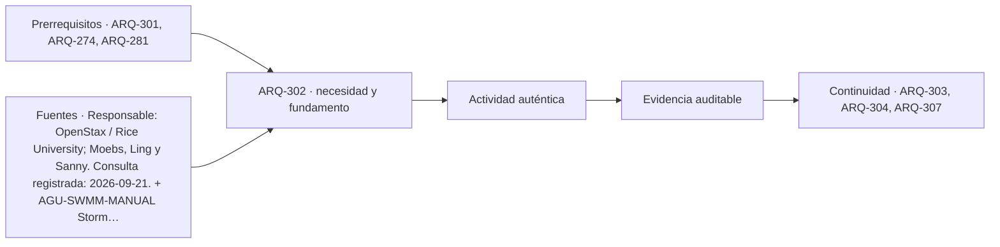

# ARQ-302 · Presión, caudal y almacenamiento: conceptos

**Parte 31 · Clase desarrollada · Incorporada en v0.18.0.**

Prerrequisitos conceptuales: ARQ-301, ARQ-274, ARQ-281. Sin calendario. Casos, observaciones y parámetros ficticios salvo antecedentes atribuidos. Material educativo; revisión externa especializada pendiente.

## Pregunta central

¿Cómo puede un suministro que entrega suficiente volumen total fallar durante ciertos períodos, y por qué disponer de agua almacenada tampoco demuestra que exista presión suficiente en cada punto del edificio?

## Resultado y continuidad

Se conserva **AGU-SERV-01** de ARQ-301: seis intervalos de una hora y demandas de 100, 300, 500, 200, 600 y 100 L. Añadimos una fuente ideal de 300 L/h, almacenamiento útil de 1.000 L y existencia inicial de 400. **AGU-PRES** es otro modelo, sin relación geométrica con ese depósito. Entregarás balances temporales y un cálculo de energía por unidad de peso, distinguiendo cantidad y presión.

## 1. Presión estática y energía del flujo

La presión expresa fuerza por área. Al dividirla por ρg se obtiene una altura equivalente de energía por unidad de peso. La cota z, el término de presión p/(ρg) y la altura cinética v²/(2g) aparecen en el balance de Bernoulli bajo sus condiciones [[PHY-BERNOULLI]](#FUENTE-PHY-BERNOULLI).

En una red real pueden existir pérdidas, equipos, cambios de sección y estados transitorios. La suma ideal no se utiliza como si todos esos efectos fueran nulos. El análisis debe identificar desde dónde y hasta dónde se escribe el balance, y qué términos se incluyen.

La presión en reposo no es la presión mientras se conduce un caudal. Con movimiento aparecen pérdidas dependientes de geometría y estado. También es necesario distinguir presión manométrica y absoluta. En los cálculos siguientes la referencia es manométrica, asociada a la atmósfera común de los puntos abiertos.

## 2. Un depósito tiene estado, entradas y salidas

Para un intervalo, la conservación es `S_final=S_inicial+entrada−entrega−rebalse`. Si la demanda excede lo disponible, se registra además una cantidad no atendida; no se permite una existencia física negativa. Si el remanente supera la capacidad útil, el exceso se conserva como salida, no desaparece.

En AGU-SERV suponemos entradas y demandas uniformes y simultáneas dentro de cada hora, sin límite de caudal del equipo de entrega. Así, el saldo cambia de manera monótona en cada intervalo. El modelo no describe mezcla, edad del agua, capacidad de bombeo ni regulación de nivel.

La capacidad útil no es necesariamente el volumen geométrico total de un estanque real. Puede haber reservas, niveles operativos y condiciones que deben definirse. Aquí mil litros son una capacidad del modelo, no una especificación constructiva ni una reserva sanitaria reglamentaria.

## 3. Caso base: igual entrada y demanda total

Partimos de 400 L. En la primera hora entran trescientos y se demandan cien: quedan seiscientos. En la segunda, entrada y demanda son trescientos: se conserva seiscientos. La tercera demanda quinientos y deja cuatrocientos; la cuarta deja quinientos; la quinta, doscientos; la sexta vuelve a cuatrocientos.

La secuencia final es **600, 600, 400, 500, 200 y 400 L**. No hay déficit ni rebalse dentro del modelo. Las entradas totalizan 1.800 y la demanda también; por ello la existencia final coincide con la inicial. Esa igualdad total no bastaba para saber si el depósito se agotaría durante la ventana: había que reconstruir estados.

El mínimo de la secuencia es doscientos, pero no se convierte en una reserva normativa. Es una consecuencia de esos aportes y usos. Si cambian duración, orden o caudales internos, se requiere otro análisis. ARQ-310 retomará exactamente esta base con una disponibilidad menor de la fuente.

## 4. Mismo total, orden distinto y un déficit

La variante **AGU-ORDEN** conserva fuente, capacidad e inicio, pero reordena las demandas como 600, 500, 300, 200, 100 y 100 L. La primera hora deja cien. En la segunda solo hay cuatrocientos disponibles frente a quinientos demandados: se entregan cuatrocientos y quedan cien sin atender.

Los estados finales son **100, 0, 0, 100, 300 y 500 L**. Las entregas totalizan 1.700, no 1.800. Al final hay más agua que al inicio y aun así ocurrió un déficit intermedio. La existencia posterior no puede atender retrospectivamente una necesidad anterior sin cambiar el servicio.

El balance global cierra: `400+1.800=1.700+500`. Los cien de déficit son demanda no satisfecha, no agua que deba sumarse como una salida física. Confundir ambas cosas rompería el balance. Este caso explica por qué un total diario favorable no demuestra continuidad.

*Figura 302. Mismos volúmenes totales no producen los mismos estados. La variante deja demanda sin atender aun terminando con 500 L.*

## 5. Modelo independiente de presión disponible

AGU-PRES representa una superficie libre amplia en cota z=30 m y un punto interior de una tubería en cota doce. La velocidad en la superficie libre se desprecia. En el punto interior se impone un caudal de 0,002 m³/s mediante la condición de consumo; no es una descarga abierta a la atmósfera en ese punto.

La tubería ideal tiene diámetro interior 0,040 m, longitud treinta metros, factor de fricción Darcy ficticio f=0,025 y coeficiente total de pérdidas locales K=3. Usamos ρ=1.000 kg/m³ y g=9,81 m/s². La rugosidad y el régimen real no se han medido ni verificado.

La velocidad es `Q/(πD²/4)=1,591549 m/s` y su altura cinética, 0,129104 m. La pérdida adoptada es `h_L=(fL/D+K)v²/(2g)=2,808022 m`. El manual de SWMM distingue el tratamiento de conductos y la formulación Darcy–Weisbach en su ámbito [[AGU-SWMM-MANUAL]](#FUENTE-AGU-SWMM-MANUAL); aquí se utiliza un ejercicio SI independiente, sin ejecutar ese programa.

## 6. Cerrar el balance en el punto correcto

La altura de presión disponible en el punto interior es `30−12−0,129104−2,808022=15,062873 m`. Multiplicando por ρg obtenemos unos **147,767 kPa manométricos**. Los dieciocho metros de desnivel no aparecen íntegramente como presión porque se incluyen movimiento y pérdidas.

La comprobación inversa suma `12+15,062873+0,129104+2,808022=30`. Cada término tiene unidad de longitud y representa una contribución distinta. No se suman directamente pascales y metros sin conversión.

Esta presión no demuestra que un artefacto funcione adecuadamente ni que cumpla requisitos. Hace falta comparar con condiciones documentadas y considerar otras ramas y estados. También podría haber una presión distinta en otra ubicación. Un único balance no describe toda la red.

## 7. Cambiar caudal exige revisar pérdidas

Manteniendo f y K constantes solo como sensibilidad del modelo, reducir Q a la mitad divide velocidad por dos y sus términos cuadráticos por cuatro. La altura de presión se aproxima a dieciocho metros al disminuir el caudal. Eso ayuda a entender la diferencia con el estado en reposo.

En una instalación real el factor de fricción puede cambiar con el régimen. Una válvula, bomba o consumidor también relaciona caudal y presión mediante su comportamiento. No puede fijarse libremente cualquier par sin cerrar el sistema. ARQ-307 estudiará un punto de operación donde se igualan curvas de equipo y red.

Del mismo modo, aumentar el volumen de almacenamiento no elimina necesariamente una pérdida de presión. Un depósito situado a la misma cota y conectado a la misma red podría dar más duración de servicio, pero no más altura disponible. Cantidad, cota y capacidad hidráulica son variables distintas.

## 8. Calidad, continuidad y coordinación

Almacenar agua añade condiciones de operación y mantenimiento. La documentación de EPA identifica relaciones entre tiempo de permanencia, cambios de uso y calidad [[AGU-QUALITY]](#FUENTE-AGU-QUALITY). Por eso «más volumen» no se adopta automáticamente como una mejora de todo el sistema.

El proyecto necesita coordinar acceso, limpieza, protección, instrumentación, cargas y contingencias. Esta clase no proporciona métodos de intervención en depósitos ni parámetros de desinfección. La competencia sanitaria debe definir requisitos y controles pertinentes.

La matriz final distingue balance de cantidad, análisis de presión y evidencia de calidad. Un resultado favorable en una columna no verifica las otras. Las condiciones de factibilidad y diseño correspondientes deben obtenerse en el marco del proyecto, no inferirse de un depósito dibujado [[AGU-RIDAA]](#FUENTE-AGU-RIDAA).

## Conservar el instante de referencia

El contenido inicial debe referirse al mismo instante que comienza la serie. Una lectura tomada después de una reposición no se utiliza como si precediera a esa entrada: el agua se contaría dos veces. La ficha debe registrar el reloj de los contadores y del depósito, y distinguir un cambio observado de almacenamiento de un valor nominal dibujado.

## Práctica independiente

Un depósito de capacidad útil 500 L comienza con cien. Durante tres intervalos iguales entran 200 L en cada uno y las demandas son 200, 400 y 100. Calcula entregas, déficit, estados y balance global. Explica por qué la igualdad entre agua disponible total y demanda total no garantiza atención completa.

En AGU-PRES reduce Q a 0,001 m³/s conservando los demás parámetros, incluidos f y K. Calcula velocidad, pérdidas y presión en el punto. Indica qué hipótesis sería necesario revisar antes de interpretar esta sensibilidad como una predicción real.

Solución razonada

Los estados son cien, cero y cien litros. Se entregan 200, 300 y 100: seiscientos; quedan cien sin atender en el segundo intervalo. El balance físico es <code>100+600=600+100</code>. La existencia final coincide con el déficit, pero está disponible después, no cuando se necesitaba.

La velocidad se reduce a 0,795775 m/s, la altura cinética a 0,032276 m y la pérdida a 0,702006 m. La altura de presión es 17,265718 m, aproximadamente 169,377 kPa. Deben revisarse régimen, factor de fricción, condiciones de consumidor, otras ramas y el alcance del estado estacionario. No se declara conformidad sanitaria o funcional.

## Autoevaluación y enlace

Puedes seguir existencias, distinguir déficit de salida y cerrar un balance de energía con unidades compatibles. ARQ-303 añadirá temperatura y distribución de agua caliente, manteniendo separados volumen mezclado, componentes y energía.

<!-- pedagogia-2026:inicio -->
## Decisión pedagógica y posición curricular

### Por qué existe

Esta clase existe para resolver una necesidad concreta del recorrido: ¿Cómo puede un suministro que entrega suficiente volumen total fallar durante ciertos períodos, y por qué disponer de agua almacenada tampoco demuestra que exista presión suficiente en cada punto del edificio?

### Por qué está exactamente aquí

Ocupa el lugar 2 de la Parte 31. Se estudia después de ARQ-301 · Abastecimiento de agua y demanda porque usa esa base para responder «¿Cómo puede un suministro que entrega suficiente volumen total fallar durante ciertos períodos, y por qué disponer de agua almacenada tampoco demuestra que exista presión suficiente en cada punto del edificio?». Se ubica antes de ARQ-303 · Agua caliente y distribución porque la evidencia producida aquí debe estar disponible para ese paso.

- **Prerrequisitos:** `ARQ-301`, `ARQ-274`, `ARQ-281`
- **Capacidad que introduce:** Se conserva AGU-SERV-01 de ARQ-301: seis intervalos de una hora y demandas de 100, 300, 500, 200, 600 y 100 L. Añadimos una fuente ideal de 300 L/h, almacenamiento útil de 1.000 L y existencia inicial de 400. AGU-PRES es otro modelo, sin relación geométrica con ese depósito.
- **Clases o experiencias que dependen de ella:** `ARQ-303`, `ARQ-304`, `ARQ-307`

El diagrama permite comprobar una relación que el texto lineal oculta con facilidad: esta clase recibe capacidades previas, toma decisiones apoyadas por fuentes, exige una experiencia y produce evidencia que habilita trabajo posterior. No representa un procedimiento de obra.

## Resultado observable, evidencia y evaluación

1. Identificar y delimitar las condiciones necesarias para responder la pregunta central de presión, caudal y almacenamiento: conceptos.
2. Producir y comprobar la evidencia declarada por la clase: Se conserva AGU-SERV-01 de ARQ-301: seis intervalos de una hora y demandas de 100, 300, 500, 200, 600 y 100 L. Añadimos una fuente ideal de 300 L/h, almacenamiento útil de 1.000 L y existencia inicial de 400. AGU-PRES es otro modelo, sin relación geométrica con ese depósito.
3. Justificar una decisión de presión, caudal y almacenamiento: conceptos mediante fuentes, supuestos, alternativas y límites explícitos.

## Actividad, evidencia y criterio de aceptación

**Actividad:** Un depósito de capacidad útil 500 L comienza con cien. Durante tres intervalos iguales entran 200 L en cada uno y las demandas son 200, 400 y 100. Calcula entregas, déficit, estados y balance global.

**Evidencia mínima:** Se conserva AGU-SERV-01 de ARQ-301: seis intervalos de una hora y demandas de 100, 300, 500, 200, 600 y 100 L. Añadimos una fuente ideal de 300 L/h, almacenamiento útil de 1.000 L y existencia inicial de 400. AGU-PRES es otro modelo, sin relación geométrica con ese depósito.

**Archivo sugerido:** `evidence/ARQ-302/evidencia.md`.

**Criterio de aceptación:** la entrega se acepta cuando:

- La entrega responde explícitamente a la pregunta: ¿Cómo puede un suministro que entrega suficiente volumen total fallar durante ciertos períodos, y por qué disponer de agua almacenada tampoco demuestra que exista presión suficiente en cada punto del edificio?
- La actividad conserva las fronteras del caso y permite reconstruir el procedimiento: Un depósito de capacidad útil 500 L comienza con cien. Durante tres intervalos iguales entran 200 L en cada uno y las demandas son 200, 400 y 100. Calcula entregas, déficit, estados y balance global.
- Cada afirmación externa puede seguirse hasta una fuente, su alcance consultado y su límite.
- La evidencia deja disponible una entrada comprobable para ARQ-303.
- Puedes seguir existencias, distinguir déficit de salida y cerrar un balance de energía con unidades compatibles. ARQ-303 añadirá temperatura y distribución de agua caliente, manteniendo separados volumen mezclado, componentes y energía.

La [rúbrica común](../../docs/RUBRICA_COMUN.md) complementa estos criterios; no los reemplaza. Una entrega puede superar un promedio y continuar pendiente si oculta una condición crítica.

## Trazabilidad de las decisiones

| # | Decisión o fundamento | Fuente utilizada | Aplicación y límite en esta clase |
|---:|---|---|---|
| 1 | Interpretación energética de presión y altura bajo hipótesis de densidad constante; términos que deben declararse al simplificar. | [Responsable: OpenStax / Rice University; Moebs, Ling y Sanny. Consulta…](https://openstax.org/books/university-physics-volume-1/pages/14-6-bernoullis-equation) | Consulta: Sección sobre conservación de energía, presión, velocidad y elevación; no se reproducen ejemplos, imágenes o texto del libro. Límite: El libro presenta Bernoulli ideal sin pérdidas. La pérdida de carga del caso es una entrada ficticia añadida al balance; no se calculan fricción, bombas o diámetros ni se proponen mínimos de presión. |
| 2 | Relacionar caudal, radio hidráulico, pendiente y pérdidas; distinguir unidades SI de las estadounidenses. | [AGU-SWMM-MANUAL Storm Water Management Model User’s Manual, Version…](https://www.epa.gov/system/files/documents/2022-04/swmm-users-manual-version-5.2.pdf) | Consulta: Apartado 3.2.7, páginas impresas 55 y 57, fórmulas examinadas en imagen: Manning y Darcy–Weisbach. Límite: No se leyó el manual íntegro ni se adoptan rugosidades de sus tablas. Los coeficientes del curso son ficticios y no dimensionamientos normativos. |
| 3 | Distinguir reducción de volumen y conservación de calidad; relacionar cambios de uso con el agua retenida. | [AGU-QUALITY WaterSense at Work, Section 1.6: Water Quality…](https://www.epa.gov/system/files/documents/2025-05/ws-commercial-watersense-at-work_section1.6_water_quality_considerations.pdf) | Consulta: Apartados de degradación, tiempo de permanencia y condiciones internas/externas; páginas impresas 3–5. Límite: No se trasladan valores térmicos ni procedimientos de control de patógenos. La clase no diagnostica calidad ni autoriza consumo. |
| 4 | Distinguir fronteras, documentos, responsabilidades y coordinación de redes domiciliarias. | [AGU-RIDAA Decreto 50, MOP: Reglamento de Instalaciones Domiciliarias…](https://www.bcn.cl/leychile/navegar?idNorma=207101) | Consulta: Marco inicial, definiciones y apartados pertinentes sobre factibilidad, ventilación, aguas lluvias y recepción; texto consultado el 22-09-2026. Límite: No se releen todos los anexos ni se dimensiona una instalación. Verificar artículos, modificaciones y proyecto concreto con los profesionales competentes. |

La tabla permite auditar las relaciones; la explicación, el caso y la práctica de la clase siguen siendo la documentación principal.

## Autoevaluación, recuperación y continuidad

### Errores diagnósticos

Antes de avanzar, comprueba si puedes reconstruir cada resultado sin mirar la solución, señalar qué evidencia lo sostiene y nombrar una condición que obligaría a revisar tu decisión. Conserva la primera versión, la objeción recibida y la revisión.

**Conexión siguiente:** La continuidad inmediata es ARQ-303 · Agua caliente y distribución; conserva el método y vuelve a verificar datos y límites.
<!-- pedagogia-2026:fin -->

## Fuentes y alcance de uso

Los casos, figuras, cálculos y soluciones son elaboraciones originales, no datos obtenidos de las instituciones citadas. Las nuevas consultas corresponden al 22 de septiembre de 2026. Las referencias previas conservan su alcance; no se anuncia una reverificación normativa integral.

### [[PHY-BERNOULLI]](#FUENTE-PHY-BERNOULLI) University Physics Volume 1 — 14.6 Bernoulli’s Equation

OpenStax / Rice University; Moebs, Ling y Sanny. [https://openstax.org/books/university-physics-volume-1/pages/14-6-bernoullis-equation](https://openstax.org/books/university-physics-volume-1/pages/14-6-bernoullis-equation)

**Consulta:** Sección sobre conservación de energía, presión, velocidad y elevación; no se reproducen ejemplos, imágenes o texto del libro. **Apoyo:** Interpretación energética de presión y altura bajo hipótesis de densidad constante; términos que deben declararse al simplificar. **Límite:** El libro presenta Bernoulli ideal sin pérdidas. La pérdida de carga del caso es una entrada ficticia añadida al balance; no se calculan fricción, bombas o diámetros ni se proponen mínimos de presión.

### [[AGU-SWMM-MANUAL]](#FUENTE-AGU-SWMM-MANUAL) Storm Water Management Model User’s Manual, Version 5.2, 2022

U.S. Environmental Protection Agency. [https://www.epa.gov/system/files/documents/2022-04/swmm-users-manual-version-5.2.pdf](https://www.epa.gov/system/files/documents/2022-04/swmm-users-manual-version-5.2.pdf)

**Consulta:** Apartado 3.2.7, páginas impresas 55 y 57, fórmulas examinadas en imagen: Manning y Darcy–Weisbach. **Apoyo:** Relacionar caudal, radio hidráulico, pendiente y pérdidas; distinguir unidades SI de las estadounidenses. **Límite:** No se leyó el manual íntegro ni se adoptan rugosidades de sus tablas. Los coeficientes del curso son ficticios y no dimensionamientos normativos.

### [[AGU-QUALITY]](#FUENTE-AGU-QUALITY) WaterSense at Work, Section 1.6: Water Quality Considerations

U.S. Environmental Protection Agency. [https://www.epa.gov/system/files/documents/2025-05/ws-commercial-watersense-at-work_section1.6_water_quality_considerations.pdf](https://www.epa.gov/system/files/documents/2025-05/ws-commercial-watersense-at-work_section1.6_water_quality_considerations.pdf)

**Consulta:** Apartados de degradación, tiempo de permanencia y condiciones internas/externas; páginas impresas 3–5. **Apoyo:** Distinguir reducción de volumen y conservación de calidad; relacionar cambios de uso con el agua retenida. **Límite:** No se trasladan valores térmicos ni procedimientos de control de patógenos. La clase no diagnostica calidad ni autoriza consumo.

### [[AGU-RIDAA]](#FUENTE-AGU-RIDAA) Decreto 50, MOP: Reglamento de Instalaciones Domiciliarias de Agua Potable y Alcantarillado

BCN / LeyChile; Ministerio de Obras Públicas. [https://www.bcn.cl/leychile/navegar?idNorma=207101](https://www.bcn.cl/leychile/navegar?idNorma=207101)

**Consulta:** Marco inicial, definiciones y apartados pertinentes sobre factibilidad, ventilación, aguas lluvias y recepción; texto consultado el 22-09-2026. **Apoyo:** Distinguir fronteras, documentos, responsabilidades y coordinación de redes domiciliarias. **Límite:** No se releen todos los anexos ni se dimensiona una instalación. Verificar artículos, modificaciones y proyecto concreto con los profesionales competentes.
