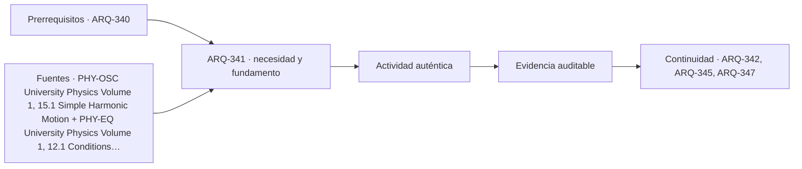

# ARQ-341 · Diseñar frente al sismo: comportamiento, daño y límites

**Parte 35 · Clase redactada, primera edición de estudio.**

El material es educativo: no constituye un proyecto construible, cálculo firmado, informe pericial ni habilitación profesional. Los casos y cifras son sintéticos salvo indicación explícita. La revisión externa por especialistas está pendiente.

## Pregunta central

¿Qué puede decidir el arquitecto frente a un sismo antes de que exista un cálculo estructural detallado? Puede reconocer continuidades, irregularidades, conflictos espaciales, elementos no estructurales y objetivos de recuperación que necesitan coordinación temprana. No puede certificar seguridad observando solamente la forma ni sustituir al profesional estructural mediante una regla rápida.

## Resultado y alcance

Compararás dos configuraciones conceptuales, explicarás un modelo masa–resorte y formularás preguntas de coordinación. La evidencia será una matriz de decisiones y tres cálculos didácticos, cada uno acompañado por lo que no demuestra. Usaremos **sismorresistente** en lugar de «a prueba de terremotos»: esta clase no ofrece garantías de daño nulo ni predice eventos.

## Amenaza, respuesta y consecuencia

La amenaza describe un fenómeno potencial; el riesgo incluye además las personas y bienes expuestos, su vulnerabilidad y capacidades [[RISK-UN]](#FUENTE-RISK-UN). En un edificio, la respuesta depende de características del movimiento y del sistema. La consecuencia puede incluir lesiones, daño físico, pérdida de servicio, desplazamiento de usuarios o reparación prolongada. Esas dimensiones no deben reducirse a una sola palabra como «resiste».

En un encargo real es necesario definir qué desempeño se busca y bajo qué marco normativo. Mantener una función crítica es una exigencia diferente de limitar determinadas consecuencias estructurales. Una discusión de continuidad puede incluir accesos, agua, energía, comunicaciones y equipos, no únicamente pilares y muros.

## Modelo mínimo: una masa y un resorte

Un oscilador lineal ideal de masa m y rigidez k tiene período natural T = 2π√(m/k), en ausencia de amortiguamiento para la expresión elemental [[PHY-OSC]](#FUENTE-PHY-OSC). El modelo permite entender relaciones, no representar automáticamente un edificio completo.

Tomemos m = 100.000 kg y k = 10.000.000 N/m. La razón m/k tiene unidad s² y valor 0,01 s². Su raíz es 0,10 s, por lo que T ≈ 0,628 s. Si mantenemos la masa y reducimos la rigidez a la cuarta parte, T se duplica aproximadamente a 1,257 s. Si duplicamos la masa con la rigidez original, el período aumenta por un factor √2.

No concluyas que un período mayor es siempre mejor ni que una estructura más rígida es siempre más segura. La demanda dinámica, las deformaciones, el comportamiento no lineal y otras condiciones deben evaluarse mediante modelos y reglas pertinentes. La fórmula solo muestra una relación dentro de una idealización.

## Deformación y movimiento relativo

Considera un modelo ficticio de dos niveles con altura de entrepiso de 3 m. En un instante imaginado, el primer piso se desplaza 0,008 m respecto de la base y el segundo 0,024 m. El desplazamiento relativo del primer entrepiso es 0,008 m; el del segundo es 0,024 − 0,008 = 0,016 m. Las razones de deformación son aproximadamente 0,267 % y 0,533 %.

Estas cifras no se comparan aquí con límites normativos. Sirven para ver que el desplazamiento absoluto del techo y la deformación relativa entre niveles describen cosas distintas. Un cerramiento, una conexión o un equipo puede verse afectado por movimientos relativos que un render del edificio no revela. La coordinación necesita identificar qué partes se mueven juntas y cuáles requieren compatibilidad de desplazamiento.

## Dos configuraciones para discutir

La alternativa A tiene una distribución relativamente continua de elementos resistentes a lo largo de su altura. La alternativa B elimina gran parte de esos elementos en el primer nivel para crear un espacio abierto. Ambas son dibujos conceptuales; no se afirma que A sea segura ni que B sea imposible. La segunda alternativa introduce preguntas que deben resolverse antes de prometer una planta libre.

La primera pregunta es cómo se mantiene la transferencia de acciones hasta el terreno. La segunda es qué cambio de rigidez y resistencia aparece entre niveles. La tercera es cómo se distribuyen masas y elementos laterales en planta. La cuarta es qué consecuencias tiene para uniones, deformaciones y componentes no estructurales. La revisión competente debe determinar qué mecanismos son relevantes en el sistema real.

La lección arquitectónica no es «nunca dibujar un primer piso abierto», sino no tratar esa elección como si solo cambiara la circulación. Una decisión espacial puede transformar la estrategia resistente y requerir otra solución, mayor complejidad o una reconsideración del programa.

## Torsión y la insuficiencia de la simetría visual

Un edificio que parece simétrico puede contener distribuciones distintas de masa, rigidez y resistencia. Por eso una fachada regular no demuestra respuesta regular. A nivel conceptual, cuando acciones y resistencias no se organizan de manera compatible, pueden aparecer efectos de giro que deben estudiarse. No se asigna aquí una excentricidad reglamentaria ni se propone calcular el centro de rigidez de un edificio complejo a partir de su imagen.

La práctica correcta es entregar al ingeniero una organización espacial y un conjunto claro de restricciones, recibir observaciones y volver a iterar. Dibujar primero todo y pedir después «que la estructura lo resuelva» puede ocultar conflictos que habrían sido más fáciles de tratar al inicio.

## Componentes no estructurales y recuperación

Tabiques, cielos, fachadas, instalaciones y equipos necesitan coordinación de soportes, anclajes y compatibilidad de movimientos según el caso. La revisión de estos elementos no se da por satisfecha porque el sistema principal haya sido calculado. En un proyecto real deben definirse responsabilidades y referencias técnicas específicas; este programa no proporciona detalles de anclaje universales.

También debe discutirse qué ocurre después de un evento: inspección, restricciones de uso, acceso a documentación y recuperación de servicios. La autorización de reingreso o utilización de un edificio dañado no se obtiene mediante una autoevaluación de esta clase. Corresponde seguir a autoridades y profesionales competentes.

## Advertencia normativa de esta edición

El Decreto exento 28 publicado en el Diario Oficial el **10 de agosto de 2026** oficializa, entre otras normas, NCh433:2026 y establece una entrada en vigencia diferida de **seis meses desde su publicación** [[CL-433-2026]](#FUENTE-CL-433-2026). Por tanto, al corte documental del **20 de septiembre de 2026**, no es correcto tratar la mera publicación como vigencia inmediata bajo ese decreto.

La aplicación a un proyecto concreto requiere revisar el texto legal, sus reglas transitorias y su relación con el marco reglamentario, incluido el DS61 cuando corresponda [[CL-DS61]](#FUENTE-CL-DS61). Esta clase no ha consultado íntegramente el texto técnico de NCh433:2026, no atribuye cambios de coeficientes y no mezcla ecuaciones de distintas ediciones. La fecha del catálogo y la fecha de aplicación son campos diferentes del registro normativo.

## Ejercicio de coordinación

Un cliente pide una primera planta completamente abierta y una cubierta con equipos que no estaban en el encargo inicial. Redacta una respuesta profesional que mantenga abierta la exploración sin prometer una solución no estudiada. Identifica qué información necesita arquitectura, qué debe revisar ingeniería estructural y qué debe aclarar operación.

Después calcula el período de un oscilador ficticio con m = 80.000 kg y k = 8.000.000 N/m. El resultado es también aproximadamente 0,628 s porque la razón m/k coincide con la del primer ejemplo. Esta igualdad demuestra una propiedad del modelo, no equivalencia de seguridad entre dos edificios.

Solución orientativa

La respuesta debería registrar que el cambio afecta distribución espacial, masas, accesos de mantenimiento y coordinación resistente. Pediría características y ubicación de los equipos, condiciones de soporte y servicio, así como revisión de la estrategia estructural. Compararía alternativas de ubicación o configuración. No presentaría un «coeficiente de seguridad» inventado ni una sección de pilar elegida por experiencia visual.

Una buena matriz asigna a cada asunto una evidencia pendiente y un responsable de producirla. Por ejemplo: «Compatibilidad de movimientos de fachada: criterio y detalle a desarrollar y revisar» es mejor que «fachada antisísmica: sí».

## Evaluación

Modelo y unidades valen 25 %, interpretación de deformaciones 20 %, calidad de preguntas de coordinación 30 % y rigor normativo y límites 25 %. Son errores críticos prometer ausencia de daño, deducir seguridad de la altura del edificio, reemplazar estudio de suelo por una aplicación cartográfica y presentar un ejercicio de oscilación como cálculo sísmico real. La comprensión alcanzada debe mejorar la conversación con especialistas, no suplantarla.

<!-- pedagogia-2026:inicio -->
## Decisión pedagógica y posición curricular

### Por qué existe

Esta clase existe para resolver una necesidad concreta del recorrido: ¿Qué puede decidir el arquitecto frente a un sismo antes de que exista un cálculo estructural detallado? Puede reconocer continuidades, irregularidades, conflictos espaciales, elementos no estructurales y objetivos de recuperación que necesitan coordinación temprana.

### Por qué está exactamente aquí

Abre la Parte 35 porque plantea primero el problema «¿Qué puede decidir el arquitecto frente a un sismo antes de que exista un cálculo estructural detallado? Puede reconocer continuidades, irregularidades, conflictos espaciales, elementos no estructurales y objetivos de recuperación que necesitan coordinación temprana.». La transición desde ARQ-340 · Inspección, mantenimiento y gestión de cambios conserva métodos de evidencia y límites, pero no traslada parámetros del bloque anterior. Establece la pregunta y el producto base que ARQ-342 · Movimiento del suelo, sitio y demanda desarrollará a continuación.

- **Prerrequisitos:** `ARQ-340`
- **Capacidad que introduce:** Compararás dos configuraciones conceptuales, explicarás un modelo masa–resorte y formularás preguntas de coordinación. La evidencia será una matriz de decisiones y tres cálculos didácticos, cada uno acompañado por lo que no demuestra. Usaremos sismorresistente en lugar de «a prueba de terremotos»: esta clase no ofrece garantías de daño nulo ni predice eventos.
- **Clases o experiencias que dependen de ella:** `ARQ-342`, `ARQ-345`, `ARQ-347`

El diagrama permite comprobar una relación que el texto lineal oculta con facilidad: esta clase recibe capacidades previas, toma decisiones apoyadas por fuentes, exige una experiencia y produce evidencia que habilita trabajo posterior. No representa un procedimiento de obra.

## Resultado observable, evidencia y evaluación

1. Identificar y delimitar las condiciones necesarias para responder la pregunta central de diseñar frente al sismo: comportamiento, daño y límites.
2. Producir y comprobar la evidencia declarada por la clase: Compararás dos configuraciones conceptuales, explicarás un modelo masa–resorte y formularás preguntas de coordinación. La evidencia será una matriz de decisiones y tres cálculos didácticos, cada uno acompañado por lo que no demuestra. Usaremos sismorresistente en lugar de «a prueba de terremotos»: esta clase no ofrece garantías de daño nulo ni predice eventos.
3. Justificar una decisión de diseñar frente al sismo: comportamiento, daño y límites mediante fuentes, supuestos, alternativas y límites explícitos.

## Actividad, evidencia y criterio de aceptación

**Actividad:** Un cliente pide una primera planta completamente abierta y una cubierta con equipos que no estaban en el encargo inicial. Redacta una respuesta profesional que mantenga abierta la exploración sin prometer una solución no estudiada. Identifica qué información necesita arquitectura, qué debe revisar ingeniería estructural y qué debe aclarar operación.

**Evidencia mínima:** Compararás dos configuraciones conceptuales, explicarás un modelo masa–resorte y formularás preguntas de coordinación. La evidencia será una matriz de decisiones y tres cálculos didácticos, cada uno acompañado por lo que no demuestra. Usaremos sismorresistente en lugar de «a prueba de terremotos»: esta clase no ofrece garantías de daño nulo ni predice eventos.

**Archivo sugerido:** `evidence/ARQ-341/evidencia.md`.

**Criterio de aceptación:** la entrega se acepta cuando:

- La entrega responde explícitamente a la pregunta: ¿Qué puede decidir el arquitecto frente a un sismo antes de que exista un cálculo estructural detallado? Puede reconocer continuidades, irregularidades, conflictos espaciales, elementos no estructurales y objetivos de recuperación que necesitan coordinación temprana.
- La actividad conserva las fronteras del caso y permite reconstruir el procedimiento: Un cliente pide una primera planta completamente abierta y una cubierta con equipos que no estaban en el encargo inicial. Redacta una respuesta profesional que mantenga abierta la exploración sin prometer una solución no estudiada. Identifica qué información necesita arquitectura, qué debe revisar ingeniería estructural y qué debe aclarar operación.
- Cada afirmación externa puede seguirse hasta una fuente, su alcance consultado y su límite.
- La evidencia deja disponible una entrada comprobable para ARQ-342.
- Errores diagnósticos Antes de avanzar, comprueba si puedes reconstruir cada resultado sin mirar la solución, señalar qué evidencia lo sostiene y nombrar una condición que obligaría a revisar tu decisión. Conserva la primera versión, la objeción recibida y la revisión.

La [rúbrica común](../../docs/RUBRICA_COMUN.md) complementa estos criterios; no los reemplaza. Una entrega puede superar un promedio y continuar pendiente si oculta una condición crítica.

## Trazabilidad de las decisiones

| # | Decisión o fundamento | Fuente utilizada | Aplicación y límite en esta clase |
|---:|---|---|---|
| 1 | Modelo masa-resorte y período de oscilación. | [PHY-OSC University Physics Volume 1, 15.1 Simple Harmonic Motion](https://openstax.org/books/university-physics-volume-1/pages/15-1-simple-harmonic-motion) | Consulta: Capítulo abierto. Límite: No proporciona un espectro de diseño sísmico chileno ni una predicción de terremotos. |
| 2 | Equilibrio de fuerzas y momentos; diagramas de cuerpo libre. | [PHY-EQ University Physics Volume 1, 12.1 Conditions for Static…](https://openstax.org/books/university-physics-volume-1/pages/12-1-conditions-for-static-equilibrium) | Consulta: Capítulo abierto. Límite: Modelo de física introductoria, no reglas de dimensionamiento de edificios. |
| 3 | Identificación del reglamento sísmico a revisar junto con la norma técnica aplicable. | [CL-DS61 Decreto 61 de 2011: reglamento de diseño sísmico de edificios](https://www.bcn.cl/leychile/Navegar?idNorma=1034101) | Consulta: Localizador y ficha legal. Límite: No se realiza dictamen de compatibilidad ni se calculan proyectos con esta ficha. |
| 4 | Publicación 10-08-2026 y entrada en vigencia diferida seis meses desde publicación. | [CL-433-2026 Decreto exento 28: oficialización de NCh433:2026 y otras…](https://www.diariooficial.interior.gob.cl/publicaciones/2026/08/10/44521/01/2850138.pdf) | Consulta: Texto de dos páginas; segunda página inspeccionada visualmente. Límite: No se leyó aquí el texto técnico íntegro de NCh433:2026; no basta la fecha del catálogo para decidir aplicabilidad a una obra. |

La tabla permite auditar las relaciones; la explicación, el caso y la práctica de la clase siguen siendo la documentación principal.

## Autoevaluación, recuperación y continuidad

### Errores diagnósticos

Antes de avanzar, comprueba si puedes reconstruir cada resultado sin mirar la solución, señalar qué evidencia lo sostiene y nombrar una condición que obligaría a revisar tu decisión. Conserva la primera versión, la objeción recibida y la revisión.

**Conexión siguiente:** La continuidad inmediata es ARQ-342 · Movimiento del suelo, sitio y demanda; conserva el método y vuelve a verificar datos y límites.
<!-- pedagogia-2026:fin -->

## Fuentes y alcance de uso

- **[[PHY-OSC]](#FUENTE-PHY-OSC) University Physics Volume 1, 15.1 Simple Harmonic Motion** — OpenStax / Rice University. [https://openstax.org/books/university-physics-volume-1/pages/15-1-simple-harmonic-motion](https://openstax.org/books/university-physics-volume-1/pages/15-1-simple-harmonic-motion)
Uso: Modelo masa-resorte y período de oscilación. Alcance de consulta: Capítulo abierto. Límite: No proporciona un espectro de diseño sísmico chileno ni una predicción de terremotos.

- **[[PHY-EQ]](#FUENTE-PHY-EQ) University Physics Volume 1, 12.1 Conditions for Static Equilibrium** — OpenStax / Rice University. [https://openstax.org/books/university-physics-volume-1/pages/12-1-conditions-for-static-equilibrium](https://openstax.org/books/university-physics-volume-1/pages/12-1-conditions-for-static-equilibrium)
Uso: Equilibrio de fuerzas y momentos; diagramas de cuerpo libre. Alcance de consulta: Capítulo abierto. Límite: Modelo de física introductoria, no reglas de dimensionamiento de edificios.

- **[[CL-DS61]](#FUENTE-CL-DS61) Decreto 61 de 2011: reglamento de diseño sísmico de edificios** — BCN / LeyChile. [https://www.bcn.cl/leychile/Navegar?idNorma=1034101](https://www.bcn.cl/leychile/Navegar?idNorma=1034101)
Uso: Identificación del reglamento sísmico a revisar junto con la norma técnica aplicable. Alcance de consulta: Localizador y ficha legal. Límite: No se realiza dictamen de compatibilidad ni se calculan proyectos con esta ficha.

- **[[CL-433-2026]](#FUENTE-CL-433-2026) Decreto exento 28: oficialización de NCh433:2026 y otras normas; CVE 2850138** — MINVU / Diario Oficial. [https://www.diariooficial.interior.gob.cl/publicaciones/2026/08/10/44521/01/2850138.pdf](https://www.diariooficial.interior.gob.cl/publicaciones/2026/08/10/44521/01/2850138.pdf)
Uso: Publicación 10-08-2026 y entrada en vigencia diferida seis meses desde publicación. Alcance de consulta: Texto de dos páginas; segunda página inspeccionada visualmente. Límite: No se leyó aquí el texto técnico íntegro de NCh433:2026; no basta la fecha del catálogo para decidir aplicabilidad a una obra.

- **[[RISK-UN]](#FUENTE-RISK-UN) Disaster risk: terminology** — UNDRR. [https://www.undrr.org/terminology/disaster-risk](https://www.undrr.org/terminology/disaster-risk)
Uso: Amenaza, exposición, vulnerabilidad, capacidad e incertidumbre del riesgo. Alcance de consulta: Definición institucional. Límite: No es una fórmula universal multiplicativa ni una cuantificación parcelaria.

Consulta de referencias: **20 de septiembre de 2026**. Los razonamientos, datos de ejercicio y soluciones son elaboración didáctica original; no se atribuyen a las fuentes como estudios de casos reales.
