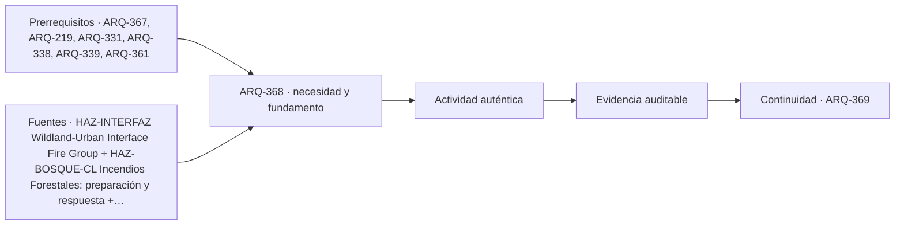

# ARQ-368 · Incendio de interfaz urbano-forestal

**Parte 37 · Clase desarrollada · Incorporada en v0.21.0.**

Prerrequisitos conceptuales: ARQ-367, ARQ-219, ARQ-331, ARQ-338, ARQ-339, ARQ-361. Sin calendario. Casos y parámetros ficticios, salvo antecedentes atribuidos. Material de estudio; revisión externa especializada pendiente.

## Pregunta central

¿Cómo examinar el contacto entre edificación y vegetación sin reducir el incendio de interfaz a una distancia única, un material aislado o una sola trayectoria de propagación?

## Resultado y continuidad

Construirás **IFZ-REL-01**, un grafo de exposición hipotética, y **IFZ-CONTEO-01**, un registro simulado de partículas depositadas. No se generan incendios ni se ensayan materiales. Los modelos permiten distinguir rutas, distribuciones y evidencia; no predicen ignición ni establecen zonas seguras. ARQ-369 retomará interdependencias para estudiar amenazas combinadas y pérdida de suministros.

## 1. La interfaz es una relación entre sistemas

La interfaz urbano-forestal reúne construcciones, vegetación, topografía, actividades, infraestructura y condiciones ambientales. No es únicamente una línea administrativa ni una colección de viviendas idénticas. La lectura debe situar cada relación y reconocer escalas de edificio, parcela y entorno.

NIST estudia exposición por brasas y llama, materiales, geometrías y relaciones entre componentes y estructuras [[HAZ-INTERFAZ]](#FUENTE-HAZ-INTERFAZ). La presentación consultada describe líneas de investigación y recursos; no se leyó íntegramente cada método ni se adoptan sus parámetros como norma local.

La orientación de SENAPRED para incendios forestales incluye preparación y seguimiento de indicaciones de autoridad [[HAZ-BOSQUE-CL]](#FUENTE-HAZ-BOSQUE-CL). Ante un evento real no se utilizan las cuentas de esta clase para decidir permanecer, volver o combatir el fuego. Los ejercicios son de gabinete y no proporcionan rutas de evacuación reales.

## 2. Diferenciar exposición, ignición y propagación

Exposición describe la acción que llega a un objeto. Ignición es una respuesta bajo condiciones determinadas. Propagación requiere estudiar cómo el proceso alcanza otros elementos. Un registro de exposición no demuestra automáticamente ignición y una propiedad de material no verifica toda una construcción.

La transferencia puede involucrar radiación, contacto con llama y partículas transportadas. Cada mecanismo requiere datos y modelos adecuados. La fórmula de intercambio radiativo de ARQ-338 no predice por sí sola ignición; tampoco un conteo de partículas identifica su temperatura, energía o duración de contacto.

Las palabras «resistente» o «ignífugo» necesitan alcance de producto, ensayo y configuración. Una cubierta con determinada documentación no verifica aberturas, juntas, elementos próximos o mantenimiento. El sistema debe estudiarse como relaciones, sin convertir un atributo favorable en garantía global.

## 3. Representar rutas posibles sin afirmar que ocurrirán

IFZ-REL-01 tiene cuatro nodos abstractos: V representa una fuente exterior de exposición, F un elemento intermedio, S una construcción auxiliar y H un edificio principal. Se plantean enlaces V–F, F–S y S–H como hipótesis de transferencia que necesitan investigación.

Se agrega V–H como otra hipótesis de exposición directa por transporte de partículas. Las flechas indican relaciones propuestas, no certeza de propagación ni secuencia temporal de un incendio. No tienen distancias, combustibles o condiciones que permitan calcular una trayectoria real.

Si se elimina el enlace F–S dentro del modelo, la ruta V–F–S–H se interrumpe, pero V–H permanece. El ejemplo refuta que resolver una única relación elimine automáticamente todas las exposiciones. No demuestra que H vaya a arder ni prescribe retirar un elemento concreto de una propiedad real.

## 4. El grafo necesita estados y procedencia

Cada enlace debe indicar mecanismo supuesto, evidencia disponible, condiciones y estado. Un contacto observado, una posibilidad por geometría y una interpretación sin verificar no se presentan como datos del mismo nivel. Los desconocidos se conservan.

La configuración puede cambiar con mantenimiento, nuevas construcciones o almacenamiento. Una ruta no desaparece del expediente porque se cierre una incidencia sobre otra. El control de cambios debe seguir relaciones y no solamente objetos individuales [[NASA-CHANGE]](#FUENTE-NASA-CHANGE).

Un grafo tampoco contiene capacidad, intensidad ni probabilidad por defecto. Multiplicar porcentajes inventados entre enlaces produciría una cifra sin fundamento. Su uso aquí es identificar qué preguntas faltan y qué alternativas deben revisarse, no calcular riesgo cuantitativo de una comunidad.

*Figura 368. Los enlaces son hipótesis de exposición. Interrumpir una cadena no elimina la relación directa restante ni predice el resultado de un incendio.*

## 5. Un conteo conserva unidades, pero no toda la física

IFZ-CONTEO-01 es un registro simulado en una superficie de cuatro metros cuadrados. Durante diez segundos recibe una tasa uniforme de tres partículas por metro cuadrado y segundo; durante otros diez, una. El total es `4×10×3 + 4×10×1 = 160 partículas`.

La tasa media de la ventana es `160/(4×20)=2 partículas/(m²·s)`. No representa el máximo de tres ni la distribución real en cada punto. Tampoco cada partícula tiene necesariamente la misma masa, energía o capacidad de producir un efecto.

El dato de conteo no se transforma en energía multiplicándolo por un valor arbitrario. Para una investigación real serían necesarios método, detección, tamaños, temperaturas, composición y condiciones del receptor, según la pregunta. En esta clase no se produjeron ni capturaron partículas reales.

## 6. El mismo total puede ocultar concentraciones espaciales

Dividimos otra superficie de cuatro metros cuadrados en dos zonas iguales. En el caso X se registran ochenta partículas en cada zona; en Y,140 en una y veinte en la otra. Ambos totales son160, pero las densidades acumuladas locales cambian de40/40 a70/10 partículas por metro cuadrado.

La media global de40 permanece. No describe la concentración local de70. Si un punto singular se encuentra en la zona más expuesta, el promedio de toda la superficie puede ser insuficiente para la pregunta de investigación. Esto no establece un umbral de ignición ni una probabilidad de daño.

No se mezclan automáticamente este reparto espacial y la serie temporal anterior. Podrían corresponder a experimentos distintos. Se necesitaría un registro espacio-temporal común para atribuir simultaneidad. El programa mantiene los identificadores de cada ejemplo para impedir esa falsa integración.

## 7. Arquitectura, materiales y encuentros

La revisión de un proyecto debe relacionar envolvente, aberturas, elementos exteriores, penetraciones y condiciones de mantenimiento. Una junta o una abertura puede comportarse de manera distinta a un paño continuo. La selección de productos debe considerar su configuración y evidencia, no solo un nombre comercial.

La geometría del entorno y las construcciones próximas también requiere estudio. No se asignan franjas, distancias o especies desde este capítulo. Esas decisiones deben fundamentarse en normativa, orientación local y evaluación especializada de las condiciones reales.

Las modificaciones pueden afectar varias funciones. Una medida propuesta para reducir exposición no debe bloquear una salida, impedir mantenimiento o crear otro problema de ventilación sin análisis. La coordinación examina relaciones y responsabilidades antes de presentar una solución como integral.

## 8. Operación y suministros forman parte del problema

Un edificio puede perder energía, agua, acceso o comunicaciones por condiciones del entorno. La protección de su envolvente no demuestra continuidad de esas funciones. La planificación de NIST relaciona infraestructura y necesidades comunitarias [[HAZ-REDES]](#FUENTE-HAZ-REDES).

El expediente debe distinguir prevención, preparación, respuesta y recuperación, con actores y competencias. El curso no enseña combate de incendios ni improvisación de sistemas de extinción. No se toman depósitos destinados a otros servicios ni se presume una reserva disponible sin verificar su función.

La información pública debe utilizar fuentes oficiales y estar disponible en formas comprensibles. El grafo docente no es un plano de evacuación. Las personas y equipos no deben exponerse para «validar» un ejercicio del curso; la evaluación es documental y numérica, sin fuego ni desplazamientos de prueba en condiciones peligrosas.

## 9. Revisión de afirmaciones frecuentes

La frase «se retiró un elemento, por tanto no hay exposición» omite rutas alternativas. «El promedio de partículas es bajo, por tanto toda la superficie está igual» confunde distribución y agregación. «El material está clasificado, por tanto el edificio es seguro» traslada evidencia de una escala a otra.

La corrección no consiste en afirmar lo contrario de forma universal. Se solicita evidencia de los mecanismos, configuraciones y condiciones. Puede haber una medida eficaz para un alcance y preguntas todavía abiertas para otros. Esas diferencias deben quedar visibles.

Una conclusión de IFZ-REL diría que la modificación interrumpe una cadena del grafo, pero conserva otra hipótesis de exposición. Una conclusión de IFZ-CONTEO describiría tasa, ventana y distribución sin inferir ignición. Son resultados útiles precisamente porque no pretenden responder preguntas que sus datos no contienen.

## Una muestra necesita un denominador y una selección

Contar partículas en una bandeja no representa automáticamente toda una fachada. Debe conocerse el área observada, el tiempo, la ubicación y la eficiencia del método. Una zona protegida por un alero y otra expuesta directamente no son repeticiones equivalentes si esas condiciones afectan la llegada.

También puede haber conteos desconocidos o fuera del alcance del instrumento. Registrarlos como cero altera el resultado. Un cero observado bajo un método es distinto de ausencia de registro. La ficha debe conservar esa diferencia y explicar qué afirmación permite cada dato. Un diseño de muestreo para una investigación real requiere especialistas y condiciones seguras; el curso no propone capturar partículas durante un incendio. Su contribución es preparar una revisión crítica de los documentos y no atribuirles una representatividad que no demostraron.

## Práctica independiente

Una superficie de tres metros cuadrados recibe dos partículas por metro cuadrado y segundo durante quince segundos y cuatro durante cinco. Calcula total y media temporal. Otra observación reparte el total en zonas de uno y dos metros cuadrados con conteos sesenta y noventa: calcula densidades y promedio espacial correcto.

En el grafo, elimina S–H y conserva V–H. Después marca V–H como desconocido, no eliminado. Explica qué puedes concluir y prepara una ficha con mecanismo, evidencia y responsable de investigación. No propongas ensayos con fuego ni parámetros de protección.

Solución razonada

El conteo temporal suma <code>3×15×2 + 3×5×4 = 150</code>. La media es150/(3×20)=2,50 partículas/(m²·s). El reparto espacial da60 y45 partículas/m²; el promedio ponderado es50, no52,50, porque las zonas tienen áreas diferentes.

Eliminar S–H corta la cadena indirecta, pero mantiene la exposición hipotética directa. Si esta queda desconocida, no corresponde declarar ausencia ni ocurrencia de propagación. Se conserva una pregunta que debe investigarse con métodos y responsables apropiados.

## Autoevaluación y enlace

Puedes diferenciar mecanismo, ruta, conteo, distribución y respuesta, manteniendo el alcance de cada evidencia. ARQ-369 reunirá amenazas y suministros sin inventar independencia entre fallos ni sumar resultados de casos incompatibles.

<!-- pedagogia-2026:inicio -->
## Decisión pedagógica y posición curricular

### Por qué existe

Esta clase existe para resolver una necesidad concreta del recorrido: ¿Cómo examinar el contacto entre edificación y vegetación sin reducir el incendio de interfaz a una distancia única, un material aislado o una sola trayectoria de propagación?

### Por qué está exactamente aquí

Ocupa el lugar 8 de la Parte 37. Se estudia después de ARQ-367 · Sequía, vegetación y disponibilidad de agua porque usa esa base para responder «¿Cómo examinar el contacto entre edificación y vegetación sin reducir el incendio de interfaz a una distancia única, un material aislado o una sola trayectoria de propagación?». Se ubica antes de ARQ-369 · Amenazas combinadas y falla de suministros porque la evidencia producida aquí debe estar disponible para ese paso.

- **Prerrequisitos:** `ARQ-367`, `ARQ-219`, `ARQ-331`, `ARQ-338`, `ARQ-339`, `ARQ-361`
- **Capacidad que introduce:** Construirás IFZ-REL-01 , un grafo de exposición hipotética, y IFZ-CONTEO-01 , un registro simulado de partículas depositadas. No se generan incendios ni se ensayan materiales. Los modelos permiten distinguir rutas, distribuciones y evidencia; no predicen ignición ni establecen zonas seguras.
- **Clases o experiencias que dependen de ella:** `ARQ-369`

El diagrama permite comprobar una relación que el texto lineal oculta con facilidad: esta clase recibe capacidades previas, toma decisiones apoyadas por fuentes, exige una experiencia y produce evidencia que habilita trabajo posterior. No representa un procedimiento de obra.

## Resultado observable, evidencia y evaluación

1. Identificar y delimitar las condiciones necesarias para responder la pregunta central de incendio de interfaz urbano-forestal.
2. Producir y comprobar la evidencia declarada por la clase: Construirás IFZ-REL-01 , un grafo de exposición hipotética, y IFZ-CONTEO-01 , un registro simulado de partículas depositadas. No se generan incendios ni se ensayan materiales. Los modelos permiten distinguir rutas, distribuciones y evidencia; no predicen ignición ni establecen zonas seguras.
3. Justificar una decisión de incendio de interfaz urbano-forestal mediante fuentes, supuestos, alternativas y límites explícitos.

## Actividad, evidencia y criterio de aceptación

**Actividad:** Una superficie de tres metros cuadrados recibe dos partículas por metro cuadrado y segundo durante quince segundos y cuatro durante cinco. Calcula total y media temporal. Otra observación reparte el total en zonas de uno y dos metros cuadrados con conteos sesenta y noventa: calcula densidades y promedio espacial correcto.

**Evidencia mínima:** Construirás IFZ-REL-01 , un grafo de exposición hipotética, y IFZ-CONTEO-01 , un registro simulado de partículas depositadas. No se generan incendios ni se ensayan materiales. Los modelos permiten distinguir rutas, distribuciones y evidencia; no predicen ignición ni establecen zonas seguras.

**Archivo sugerido:** `evidence/ARQ-368/evidencia.md`.

**Criterio de aceptación:** la entrega se acepta cuando:

- La entrega responde explícitamente a la pregunta: ¿Cómo examinar el contacto entre edificación y vegetación sin reducir el incendio de interfaz a una distancia única, un material aislado o una sola trayectoria de propagación?
- La actividad conserva las fronteras del caso y permite reconstruir el procedimiento: Una superficie de tres metros cuadrados recibe dos partículas por metro cuadrado y segundo durante quince segundos y cuatro durante cinco. Calcula total y media temporal. Otra observación reparte el total en zonas de uno y dos metros cuadrados con conteos sesenta y noventa: calcula densidades y promedio espacial correcto.
- Cada afirmación externa puede seguirse hasta una fuente, su alcance consultado y su límite.
- La evidencia deja disponible una entrada comprobable para ARQ-369.
- Puedes diferenciar mecanismo, ruta, conteo, distribución y respuesta, manteniendo el alcance de cada evidencia. ARQ-369 reunirá amenazas y suministros sin inventar independencia entre fallos ni sumar resultados de casos incompatibles.

La [rúbrica común](../../docs/RUBRICA_COMUN.md) complementa estos criterios; no los reemplaza. Una entrega puede superar un promedio y continuar pendiente si oculta una condición crítica.

## Trazabilidad de las decisiones

| # | Decisión o fundamento | Fuente utilizada | Aplicación y límite en esta clase |
|---:|---|---|---|
| 1 | Distinguir exposición a pavesas, llamas y relaciones entre parcelas y estructuras. | [HAZ-INTERFAZ Wildland-Urban Interface Fire Group](https://www.nist.gov/el/fire/wildland-urban-interface-fire) | Consulta: Presentación, HMM, relaciones espaciales y líneas de investigación sobre pavesas, exposición y propagación. Límite: No se leyó íntegro HMM o ESCAPE ni se obtuvieron distancias seguras. El curso no reproduce experimentos ni predice propagación real. |
| 2 | Vincular preparación previa y respuesta oficial sin reemplazarlas por un modelo del curso. | [HAZ-BOSQUE-CL Incendios Forestales: preparación y respuesta](https://senapred.cl/incendios-forestales/) | Consulta: Definición, preparación, comunicación y seguimiento de indicaciones de autoridades. Límite: No se prescribe combate de incendios, uso de fuego ni rutas operativas. No se trasladan cifras penales o estadísticas como asesoría. |
| 3 | Definir servicio y dependencias antes de afirmar continuidad. | [HAZ-REDES Development and Implementation of the Community Resilience…](https://www.nist.gov/community-resilience/planning-guide) | Consulta: Presentación de la guía, funciones sociales, infraestructura e interdependencias. Límite: No se leyó íntegramente cada volumen o guía enlazada. Los grafos y tiempos de servicio son originales y ficticios. |
| 4 | Línea base, trazabilidad y análisis del impacto de cambios | [Organismo: National Aeronautics and Space Administration. Consulta:…](https://www.nasa.gov/reference/6-0-crosscutting-technical-management/) | Consulta: Apartados 6.2 y 6.5 sobre requisitos y configuración Límite: Los formularios y el caso arquitectónico son originales; no se copian procedimientos contractuales. |

La tabla permite auditar las relaciones; la explicación, el caso y la práctica de la clase siguen siendo la documentación principal.

## Autoevaluación, recuperación y continuidad

### Errores diagnósticos

Antes de avanzar, comprueba si puedes reconstruir cada resultado sin mirar la solución, señalar qué evidencia lo sostiene y nombrar una condición que obligaría a revisar tu decisión. Conserva la primera versión, la objeción recibida y la revisión.

**Conexión siguiente:** La continuidad inmediata es ARQ-369 · Amenazas combinadas y falla de suministros; conserva el método y vuelve a verificar datos y límites.
<!-- pedagogia-2026:fin -->

## Fuentes y alcance de uso

Los casos, derivaciones, prácticas y figuras son originales. Fuentes nuevas consultadas el 23 de septiembre de 2026; las heredadas conservan su alcance. No se declara lectura íntegra cuando la consulta fue parcial.

### [[HAZ-INTERFAZ]](#FUENTE-HAZ-INTERFAZ) Wildland-Urban Interface Fire Group

NIST. [https://www.nist.gov/el/fire/wildland-urban-interface-fire](https://www.nist.gov/el/fire/wildland-urban-interface-fire)

**Consulta:** Presentación, HMM, relaciones espaciales y líneas de investigación sobre pavesas, exposición y propagación. **Apoyo:** Distinguir exposición a pavesas, llamas y relaciones entre parcelas y estructuras. **Límite:** No se leyó íntegro HMM o ESCAPE ni se obtuvieron distancias seguras. El curso no reproduce experimentos ni predice propagación real.

### [[HAZ-BOSQUE-CL]](#FUENTE-HAZ-BOSQUE-CL) Incendios Forestales: preparación y respuesta

SENAPRED. [https://senapred.cl/incendios-forestales/](https://senapred.cl/incendios-forestales/)

**Consulta:** Definición, preparación, comunicación y seguimiento de indicaciones de autoridades. **Apoyo:** Vincular preparación previa y respuesta oficial sin reemplazarlas por un modelo del curso. **Límite:** No se prescribe combate de incendios, uso de fuego ni rutas operativas. No se trasladan cifras penales o estadísticas como asesoría.

### [[HAZ-REDES]](#FUENTE-HAZ-REDES) Development and Implementation of the Community Resilience Planning Guides

NIST. [https://www.nist.gov/community-resilience/planning-guide](https://www.nist.gov/community-resilience/planning-guide)

**Consulta:** Presentación de la guía, funciones sociales, infraestructura e interdependencias. **Apoyo:** Definir servicio y dependencias antes de afirmar continuidad. **Límite:** No se leyó íntegramente cada volumen o guía enlazada. Los grafos y tiempos de servicio son originales y ficticios.

### [[NASA-CHANGE]](#FUENTE-NASA-CHANGE) NASA Systems Engineering Handbook, 6.0: Crosscutting Technical Management

National Aeronautics and Space Administration. [https://www.nasa.gov/reference/6-0-crosscutting-technical-management/](https://www.nasa.gov/reference/6-0-crosscutting-technical-management/)

**Consulta:** Apartados 6.2 y 6.5 sobre requisitos y configuración **Apoyo:** Línea base, trazabilidad y análisis del impacto de cambios **Límite:** Los formularios y el caso arquitectónico son originales; no se copian procedimientos contractuales.
