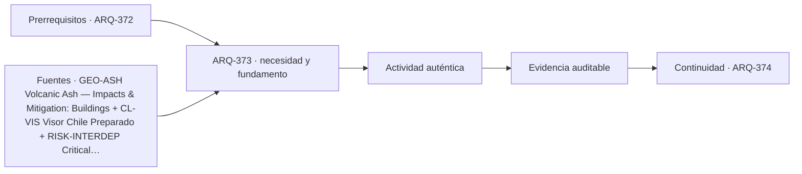

# ARQ-373 · Volcanes, ceniza y lahares

**Parte 38 · Clase desarrollada · Incorporada en v0.22.0.**

Prerrequisito conceptual principal: ARQ-372. Sin calendario. Los casos, cifras y decisiones del capítulo son didácticos salvo antecedentes expresamente atribuidos. No constituyen diseño ejecutable, permiso, inspección oficial ni habilitación profesional. Revisión externa especializada pendiente.

## Pregunta central

¿Cómo estudiar amenazas volcánicas sin tratar ceniza, lahar, lava y gases como si fueran un único problema de “distancia al volcán”?

## Resultado y continuidad

Recibe el método de ARQ-372: conservar datos, versiones y límites. El nuevo caso tiene identificador propio y no hereda magnitudes del capítulo anterior salvo que se indique expresamente. Elaborarás un registro reproducible, resolverás un caso numérico y una práctica diferente, y cerrarás con una decisión que distinga lo comprobado de lo pendiente.

## 1. Definir el problema antes de medir

Un volcán puede generar fenómenos con mecanismos, velocidades, alcances y evidencias distintas. La arquitectura no debe reducirlos a una sola franja alrededor del cráter. El primer trabajo es identificar la amenaza relevante y la fuente oficial que describe su cobertura.

## 2. Separar observación, modelo y decisión

La ceniza es material particulado que puede acumular masa, ingresar a equipos, afectar filtros y drenajes y remobilizarse con viento o agua. El espesor visible no basta para conocer carga: también importan densidad y humedad. USGS advierte además dependencias con cubiertas y sistemas de edificio.

## 3. La variable que suele confundirse

Un lahar es un flujo de mezcla de agua y material volcánico que sigue topografía y cauces. Un mapa de ceniza no representa automáticamente lahar. Del mismo modo, una carretera abierta en un escenario no implica que seguirá disponible después de otro fenómeno.

## 4. Interfaces y estados

Las cubiertas deben analizarse como sistemas: geometría, apoyos, obstrucciones, drenaje y mantenimiento. Limpiar una cubierta cargada también introduce un problema de seguridad para quienes intervienen; el curso no prescribe acceso ni retiro de ceniza.

## 5. Lo que cambia durante el tiempo

La preparación debe reconocer pérdida de energía, agua o ventilación, no solo daño estructural. Equipos exteriores, tomas de aire y almacenamiento pueden ser sensibles a material particulado aun cuando la estructura principal siga en pie.

## 6. Responsabilidades y evidencia

Las decisiones territoriales combinan información oficial, exposición y continuidad. Un edificio importante no se vuelve adecuado solo por reforzar su cubierta si sus accesos o suministros se encuentran en rutas vulnerables.

### Caso trabajado: masa de ceniza sobre una cubierta

Una cubierta ficticia horizontal tiene **180 m²**. Se modelan **40 mm** de ceniza seca con densidad aparente adoptada de **900 kg/m³**. El volumen es `180×0,04=7,2 m³` y la masa `7,2×900=6.480 kg`. La carga gravitatoria equivalente es aproximadamente `6.480×9,81/1000=63,57 kN`, es decir **0,353 kPa** sobre la proyección.

Si el mismo espesor tuviera **1.500 kg/m³**, la masa subiría a 10.800 kg y la presión equivalente a **0,589 kPa**. El ejemplo demuestra que el espesor no identifica por sí solo la carga. No compara esas cifras con la capacidad de una cubierta ni indica cuándo limpiarla.

*Figura 373. El esquema ordena las preguntas del caso; no agrega prestaciones o datos no comprobados.*

## 8. Cómo documentar la decisión

La entrega debe permitir que otra persona reconstruya el caso sin adivinar parámetros. Registra identificador, versión, unidades, fuente de cada dato, hipótesis, cálculo, resultado, límite y acción siguiente. Cuando una condición depende de otra disciplina o autoridad, identifica esa dependencia en vez de completar la casilla con una cifra inventada.

Un resultado matemáticamente correcto puede seguir siendo insuficiente para la decisión. La profundidad de la clase consiste en explicar qué demuestra la operación y qué permanece fuera: condiciones del lugar, variabilidad, comportamiento del sistema completo, autorización, seguridad de personas o mantenimiento. Esta separación evita convertir el ejercicio en una receta.

## 9. Errores frecuentes y contraste

Tres errores se repiten: usar una media para ocultar distribución; trasladar un parámetro desde otro caso por parecido; y presentar un estado pendiente como favorable. También es un error corregir un documento sin rastrear los archivos y oficios que dependían de la versión anterior. La respuesta adecuada conserva el antecedente, crea una variante y vuelve a comprobar las interfaces afectadas.

Revisa además los signos y las fronteras. Una fuerza, un volumen, un área o un tiempo necesitan dirección o período cuando corresponda. Una cantidad acumulada no describe automáticamente el máximo instantáneo, y una compatibilidad geométrica no demuestra funcionamiento.

## 10. Profundización y transferencia

La utilidad de **Volcanes, ceniza y lahares** aumenta cuando se conecta con decisiones anteriores y posteriores del proyecto. No basta reconocer el concepto: hay que localizar qué documento lo describe, qué actor produce la evidencia, qué otra disciplina depende de ella y qué cambio obligaría a revisarla. Una buena entrega permite reconstruir la decisión incluso cuando cambia el equipo de trabajo.

Para profundizar, representa el problema en al menos **dos escalas**. En la primera, dibuja el componente o relación local que produce el resultado del caso. En la segunda, muestra dónde se inserta dentro del sitio, edificio, proceso o red. Esa segunda vista suele revelar dependencias que la cuenta aislada no contiene: accesos, drenajes, apoyos, suministro, secuencia, mantenimiento o información. La comparación entre escalas debe conservar unidades y referencias; no se permite trasladar una propiedad local al conjunto sin una justificación.

Construye además una **tabla de evidencia** con cinco columnas: afirmación, dato de origen, método de comprobación, estado y acción siguiente. Usa al menos los estados `comprobado dentro del alcance`, `conflicto`, `pendiente` y `no aplica con justificación`. El estado pendiente es especialmente importante: evita que la ausencia de información se convierta en una aprobación tácita. Si una afirmación depende de un documento externo, registra edición, fecha de consulta y alcance.

Finalmente, prueba una variante que cambie una sola condición mientras conserva las demás. El objetivo no es encontrar una solución universal, sino observar sensibilidad. Si el resultado cambia mucho, esa variable merece investigación; si cambia poco, todavía puede ser crítica por razones no representadas en el modelo. Una sensibilidad matemática no reemplaza una evaluación de seguridad, cumplimiento, costo, uso o mantenimiento.

## 11. Lectura crítica de una respuesta

Una respuesta profunda debería distinguir cuatro capas. **Primero**, hechos u observaciones: dimensiones, estados, registros o documentos identificados. **Segundo**, hipótesis: simplificaciones necesarias para construir el modelo. **Tercero**, resultados: operaciones reproducibles con unidades. **Cuarto**, decisiones: qué se puede hacer con ese resultado y qué necesita revisión adicional. Mezclar las cuatro capas produce conclusiones aparentemente seguras que no pueden auditarse.

Revisa también los contraejemplos. Pregunta qué pasaría si cambia la referencia, si el dato corresponde a otra versión, si un servicio compartido falla, si una zona no fue observada o si una tolerancia actúa en el sentido desfavorable. No se busca imaginar todos los problemas posibles; se busca demostrar que la conclusión conoce su dominio. En una obra o emergencia real, los criterios y responsables deben provenir del marco aplicable y de profesionales competentes.

## 12. Preguntas de profundización

- ¿Qué dato del caso tiene mayor influencia sobre la decisión y cómo comprobarías su procedencia?

- ¿Qué resultado seguiría siendo válido si cambia la geometría, el tiempo o el estado operativo?

- ¿Qué interfaz con otra disciplina puede invalidar una conclusión local aunque la aritmética esté correcta?

- ¿Qué evidencia necesitarías para transformar una hipótesis del ejercicio en una afirmación sobre una situación real?

## Práctica independiente

Para 120 m² y 25 mm de depósito, calcula masa y presión con 800 y 1.400 kg/m³. Identifica tres datos adicionales que necesitarías antes de hablar de seguridad de una cubierta.

Solución razonada

El volumen es 3 m³. Las masas son 2.400 y 4.200 kg; las presiones equivalentes son 0,1962 y 0,34335 kPa. Faltan, entre otros, configuración estructural, distribución real, estado húmedo/seco, acumulaciones locales, condición de apoyos y evaluación profesional.

La solución resuelve únicamente el modelo declarado. Antes de llevar una conclusión a una obra, amenaza real o procedimiento de trabajo deben obtenerse los antecedentes, criterios, responsables y revisiones que correspondan.

## Autoevaluación y enlace

Puedes avanzar si reconstruyes el caso sin mirar la respuesta, explicas al menos dos límites y redactas qué evidencia cambiaría la decisión. No se evalúa por memorizar el número final. La siguiente clase mantiene la secuencia conceptual sin trasladar automáticamente los parámetros de este ejercicio.

<!-- pedagogia-2026:inicio -->
## Decisión pedagógica y posición curricular

### Por qué existe

Esta clase existe para resolver una necesidad concreta del recorrido: ¿Cómo estudiar amenazas volcánicas sin tratar ceniza, lahar, lava y gases como si fueran un único problema de “distancia al volcán”?

### Por qué está exactamente aquí

Ocupa el lugar 3 de la Parte 38. Se estudia después de ARQ-372 · Remociones en masa y estabilidad de laderas porque usa esa base para responder «¿Cómo estudiar amenazas volcánicas sin tratar ceniza, lahar, lava y gases como si fueran un único problema de “distancia al volcán”?». Se ubica antes de ARQ-374 · Subsidencia, cavidades y suelos problemáticos porque la evidencia producida aquí debe estar disponible para ese paso.

- **Prerrequisitos:** `ARQ-372`
- **Capacidad que introduce:** Recibe el método de ARQ-372: conservar datos, versiones y límites. El nuevo caso tiene identificador propio y no hereda magnitudes del capítulo anterior salvo que se indique expresamente. Elaborarás un registro reproducible, resolverás un caso numérico y una práctica diferente, y cerrarás con una decisión que distinga lo comprobado de lo pendiente.
- **Clases o experiencias que dependen de ella:** `ARQ-374`

El diagrama permite comprobar una relación que el texto lineal oculta con facilidad: esta clase recibe capacidades previas, toma decisiones apoyadas por fuentes, exige una experiencia y produce evidencia que habilita trabajo posterior. No representa un procedimiento de obra.

## Resultado observable, evidencia y evaluación

1. Identificar y delimitar las condiciones necesarias para responder la pregunta central de volcanes, ceniza y lahares.
2. Producir y comprobar la evidencia declarada por la clase: Recibe el método de ARQ-372: conservar datos, versiones y límites. El nuevo caso tiene identificador propio y no hereda magnitudes del capítulo anterior salvo que se indique expresamente. Elaborarás un registro reproducible, resolverás un caso numérico y una práctica diferente, y cerrarás con una decisión que distinga lo comprobado de lo pendiente.
3. Justificar una decisión de volcanes, ceniza y lahares mediante fuentes, supuestos, alternativas y límites explícitos.

## Actividad, evidencia y criterio de aceptación

**Actividad:** Para 120 m² y 25 mm de depósito, calcula masa y presión con 800 y 1.400 kg/m³. Identifica tres datos adicionales que necesitarías antes de hablar de seguridad de una cubierta.

**Evidencia mínima:** Recibe el método de ARQ-372: conservar datos, versiones y límites. El nuevo caso tiene identificador propio y no hereda magnitudes del capítulo anterior salvo que se indique expresamente. Elaborarás un registro reproducible, resolverás un caso numérico y una práctica diferente, y cerrarás con una decisión que distinga lo comprobado de lo pendiente.

**Archivo sugerido:** `evidence/ARQ-373/evidencia.md`.

**Criterio de aceptación:** la entrega se acepta cuando:

- La entrega responde explícitamente a la pregunta: ¿Cómo estudiar amenazas volcánicas sin tratar ceniza, lahar, lava y gases como si fueran un único problema de “distancia al volcán”?
- La actividad conserva las fronteras del caso y permite reconstruir el procedimiento: Para 120 m² y 25 mm de depósito, calcula masa y presión con 800 y 1.400 kg/m³. Identifica tres datos adicionales que necesitarías antes de hablar de seguridad de una cubierta.
- Cada afirmación externa puede seguirse hasta una fuente, su alcance consultado y su límite.
- La evidencia deja disponible una entrada comprobable para ARQ-374.
- Tres errores se repiten: usar una media para ocultar distribución; trasladar un parámetro desde otro caso por parecido; y presentar un estado pendiente como favorable. También es un error corregir un documento sin rastrear los archivos y oficios que dependían de la versión anterior.

La [rúbrica común](../../docs/RUBRICA_COMUN.md) complementa estos criterios; no los reemplaza. Una entrega puede superar un promedio y continuar pendiente si oculta una condición crítica.

## Trazabilidad de las decisiones

| # | Decisión o fundamento | Fuente utilizada | Aplicación y límite en esta clase |
|---:|---|---|---|
| 1 | Relacionar espesor, densidad, acumulación, cubiertas, drenaje y servicios afectados por ceniza. | [GEO-ASH Volcanic Ash — Impacts & Mitigation: Buildings](https://volcanoes.usgs.gov/volcanic_ash/buildings.html) | Consulta: Página oficial sobre efectos de ceniza en edificios y sistemas. Límite: No se trasladan espesores como cargas de diseño ni se prescriben labores de retiro sobre cubiertas. |
| 2 | Consulta de amenazas y preparación territorial; fuentes y rutas oficiales según cobertura | [CL-VIS Visor Chile Preparado](https://senapred.cl/visor-preparado/) | Consulta: Página explicativa del visor Límite: La cobertura del visor no representa todos los peligros ni certifica la seguridad de un predio. |
| 3 | Analizar cómo la pérdida de un servicio puede propagarse hacia otras infraestructuras y funciones. | [RISK-INTERDEP Critical infrastructure interdependency analysis:…](https://www.undrr.org/publication/critical-infrastructure-interdependency-analysis-operationalising-resilience-strategies) | Consulta: Resumen institucional del documento de interdependencias. Límite: No se implementa una metodología completa ni se asignan probabilidades a las cadenas del curso. Consulta de nuevas referencias: 23 de septiembre de 2026. Los ejemplos, cálculos, tablas y soluciones son elaboración didáctica original. |

La tabla permite auditar las relaciones; la explicación, el caso y la práctica de la clase siguen siendo la documentación principal.

## Autoevaluación, recuperación y continuidad

### Errores diagnósticos

Antes de avanzar, comprueba si puedes reconstruir cada resultado sin mirar la solución, señalar qué evidencia lo sostiene y nombrar una condición que obligaría a revisar tu decisión. Conserva la primera versión, la objeción recibida y la revisión.

**Conexión siguiente:** La continuidad inmediata es ARQ-374 · Subsidencia, cavidades y suelos problemáticos; conserva el método y vuelve a verificar datos y límites.
<!-- pedagogia-2026:fin -->

## Fuentes y alcance de uso

### [[GEO-ASH]](#FUENTE-GEO-ASH) Volcanic Ash — Impacts & Mitigation: Buildings

U.S. Geological Survey. [https://volcanoes.usgs.gov/volcanic_ash/buildings.html](https://volcanoes.usgs.gov/volcanic_ash/buildings.html)

**Consulta:** Página oficial sobre efectos de ceniza en edificios y sistemas. **Apoyo:** Relacionar espesor, densidad, acumulación, cubiertas, drenaje y servicios afectados por ceniza. **Límite:** No se trasladan espesores como cargas de diseño ni se prescriben labores de retiro sobre cubiertas.

### [[CL-VIS]](#FUENTE-CL-VIS) Visor Chile Preparado

SENAPRED. [https://senapred.cl/visor-preparado/](https://senapred.cl/visor-preparado/)

**Consulta:** Página explicativa del visor **Apoyo:** Consulta de amenazas y preparación territorial; fuentes y rutas oficiales según cobertura **Límite:** La cobertura del visor no representa todos los peligros ni certifica la seguridad de un predio.

### [[RISK-INTERDEP]](#FUENTE-RISK-INTERDEP) Critical infrastructure interdependency analysis: Operationalising resilience strategies

UNDRR. [https://www.undrr.org/publication/critical-infrastructure-interdependency-analysis-operationalising-resilience-strategies](https://www.undrr.org/publication/critical-infrastructure-interdependency-analysis-operationalising-resilience-strategies)

**Consulta:** Resumen institucional del documento de interdependencias. **Apoyo:** Analizar cómo la pérdida de un servicio puede propagarse hacia otras infraestructuras y funciones. **Límite:** No se implementa una metodología completa ni se asignan probabilidades a las cadenas del curso.

Consulta de nuevas referencias: **23 de septiembre de 2026**. Los ejemplos, cálculos, tablas y soluciones son elaboración didáctica original.
