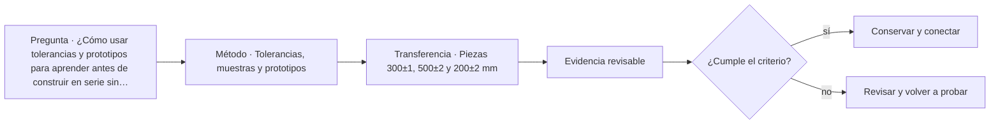

# ARQ-388 · Tolerancias, muestras y prototipos

**Parte 39 · Clase desarrollada · Incorporada en v0.22.0.**

Prerrequisito conceptual principal: ARQ-387. Sin calendario. Los casos, cifras y decisiones del capítulo son didácticos salvo antecedentes expresamente atribuidos. No constituyen diseño ejecutable, permiso, inspección oficial ni habilitación profesional. Revisión externa especializada pendiente.

## Pregunta central

¿Cómo usar tolerancias y prototipos para aprender antes de construir en serie sin convertir una muestra aprobada en garantía de todas las unidades?

## Resultado y continuidad

Recibe el método de ARQ-387: conservar datos, versiones y límites. El nuevo caso tiene identificador propio y no hereda magnitudes del capítulo anterior salvo que se indique expresamente. Elaborarás un registro reproducible, resolverás un caso numérico y una práctica diferente, y cerrarás con una decisión que distinga lo comprobado de lo pendiente.

## 1. Definir el problema antes de medir

La tolerancia define variación permitida respecto de una referencia, no calidad general. Debe estar asociada a una función y método de medición. Dos elementos pueden cumplir individualmente y fallar al encontrarse.

## 2. Separar observación, modelo y decisión

Las cadenas de tolerancias requieren signos y referencias. Sumar todos los máximos puede ser un escenario conservador si se declara, pero no una probabilidad.

## 3. La variable que suele confundirse

Una muestra física puede revisar apariencia, encuentro o procedimiento. Un prototipo puede incorporar más funciones. Ninguno representa automáticamente todas las condiciones de serie.

## 4. Interfaces y estados

La aprobación debe especificar qué atributos se aceptaron. “Muestra aprobada” no debería usarse para cerrar color, desempeño acústico, impermeabilidad y geometría si solo se revisó uno.

## 5. Lo que cambia durante el tiempo

Los cambios posteriores a la muestra reabren las comprobaciones afectadas. Un producto “equivalente” debe compararse por requisitos, no por parecido.

## 6. Responsabilidades y evidencia

Las mediciones necesitan referencia y resolución. Registrar muchos decimales no mejora una herramienta ni elimina sesgos comunes.

### Caso trabajado: cadena de tres piezas

Tres segmentos nominales suman **1.000 mm**: A=400±2, B=350±3, C=250±1 mm. Bajo suma de extremos, el conjunto varía entre **994 y 1.006 mm**.

Una abertura fija de 1.004 mm no admite todos los extremos: el máximo excede 2 mm. No hay probabilidades asociadas; solo se demuestra incompatibilidad dentro del conjunto de límites adoptado.

*Figura 388. El esquema ordena las preguntas del caso; no agrega prestaciones o datos no comprobados.*

## 8. Cómo documentar la decisión

La entrega debe permitir que otra persona reconstruya el caso sin adivinar parámetros. Registra identificador, versión, unidades, fuente de cada dato, hipótesis, cálculo, resultado, límite y acción siguiente. Cuando una condición depende de otra disciplina o autoridad, identifica esa dependencia en vez de completar la casilla con una cifra inventada.

Un resultado matemáticamente correcto puede seguir siendo insuficiente para la decisión. La profundidad de la clase consiste en explicar qué demuestra la operación y qué permanece fuera: condiciones del lugar, variabilidad, comportamiento del sistema completo, autorización, seguridad de personas o mantenimiento. Esta separación evita convertir el ejercicio en una receta.

## 9. Errores frecuentes y contraste

Tres errores se repiten: usar una media para ocultar distribución; trasladar un parámetro desde otro caso por parecido; y presentar un estado pendiente como favorable. También es un error corregir un documento sin rastrear los archivos y oficios que dependían de la versión anterior. La respuesta adecuada conserva el antecedente, crea una variante y vuelve a comprobar las interfaces afectadas.

Revisa además los signos y las fronteras. Una fuerza, un volumen, un área o un tiempo necesitan dirección o período cuando corresponda. Una cantidad acumulada no describe automáticamente el máximo instantáneo, y una compatibilidad geométrica no demuestra funcionamiento.

## 10. Profundización y transferencia

La utilidad de **Tolerancias, muestras y prototipos** aumenta cuando se conecta con decisiones anteriores y posteriores del proyecto. No basta reconocer el concepto: hay que localizar qué documento lo describe, qué actor produce la evidencia, qué otra disciplina depende de ella y qué cambio obligaría a revisarla. Una buena entrega permite reconstruir la decisión incluso cuando cambia el equipo de trabajo.

Para profundizar, representa el problema en al menos **dos escalas**. En la primera, dibuja el componente o relación local que produce el resultado del caso. En la segunda, muestra dónde se inserta dentro del sitio, edificio, proceso o red. Esa segunda vista suele revelar dependencias que la cuenta aislada no contiene: accesos, drenajes, apoyos, suministro, secuencia, mantenimiento o información. La comparación entre escalas debe conservar unidades y referencias; no se permite trasladar una propiedad local al conjunto sin una justificación.

Construye además una **tabla de evidencia** con cinco columnas: afirmación, dato de origen, método de comprobación, estado y acción siguiente. Usa al menos los estados `comprobado dentro del alcance`, `conflicto`, `pendiente` y `no aplica con justificación`. El estado pendiente es especialmente importante: evita que la ausencia de información se convierta en una aprobación tácita. Si una afirmación depende de un documento externo, registra edición, fecha de consulta y alcance.

Finalmente, prueba una variante que cambie una sola condición mientras conserva las demás. El objetivo no es encontrar una solución universal, sino observar sensibilidad. Si el resultado cambia mucho, esa variable merece investigación; si cambia poco, todavía puede ser crítica por razones no representadas en el modelo. Una sensibilidad matemática no reemplaza una evaluación de seguridad, cumplimiento, costo, uso o mantenimiento.

## 11. Lectura crítica de una respuesta

Una respuesta profunda debería distinguir cuatro capas. **Primero**, hechos u observaciones: dimensiones, estados, registros o documentos identificados. **Segundo**, hipótesis: simplificaciones necesarias para construir el modelo. **Tercero**, resultados: operaciones reproducibles con unidades. **Cuarto**, decisiones: qué se puede hacer con ese resultado y qué necesita revisión adicional. Mezclar las cuatro capas produce conclusiones aparentemente seguras que no pueden auditarse.

Revisa también los contraejemplos. Pregunta qué pasaría si cambia la referencia, si el dato corresponde a otra versión, si un servicio compartido falla, si una zona no fue observada o si una tolerancia actúa en el sentido desfavorable. No se busca imaginar todos los problemas posibles; se busca demostrar que la conclusión conoce su dominio. En una obra o emergencia real, los criterios y responsables deben provenir del marco aplicable y de profesionales competentes.

## 12. Preguntas de profundización

- ¿Qué dato del caso tiene mayor influencia sobre la decisión y cómo comprobarías su procedencia?

- ¿Qué resultado seguiría siendo válido si cambia la geometría, el tiempo o el estado operativo?

- ¿Qué interfaz con otra disciplina puede invalidar una conclusión local aunque la aritmética esté correcta?

- ¿Qué evidencia necesitarías para transformar una hipótesis del ejercicio en una afirmación sobre una situación real?

## Práctica independiente

Piezas 300±1, 500±2 y 200±2 mm. Calcula rango total. Una abertura es 1.003 mm. ¿Qué extremos entran y qué no puedes concluir?

Solución razonada

Total nominal 1.000; rango 995–1.005 mm. La abertura de 1.003 admite configuraciones hasta ese valor, pero no el extremo máximo. Sin distribución estadística no se calcula probabilidad de interferencia ni aceptación de producción.

La solución resuelve únicamente el modelo declarado. Antes de llevar una conclusión a una obra, amenaza real o procedimiento de trabajo deben obtenerse los antecedentes, criterios, responsables y revisiones que correspondan.

## Autoevaluación y enlace

Puedes avanzar si reconstruyes el caso sin mirar la respuesta, explicas al menos dos límites y redactas qué evidencia cambiaría la decisión. No se evalúa por memorizar el número final. La siguiente clase mantiene la secuencia conceptual sin trasladar automáticamente los parámetros de este ejercicio.

<!-- pedagogia-2026:inicio -->
## Mapa visual de aprendizaje

El diagrama representa el ciclo de aprendizaje de esta clase, no una secuencia de obra ni un procedimiento profesional.

## Resultado observable, evidencia y evaluación

**Tipo de clase:** profesional y de coordinación.

**Evidencia mínima:** registro de decisión con alcance, interfaces, versiones, responsables, evidencia y condición de cierre.

**Archivo sugerido:** `evidence/ARQ-388/evidencia.md`.

| Criterio | Evidencia observable |
|---|---|
| Precisión y representación · 20 % | Los conceptos, unidades y convenciones se usan de forma coherente y pueden ser reconstruidos por otra persona. |
| Evidencia y trazabilidad · 25 % | Cada afirmación importante se vincula con dato, cálculo, observación o fuente; hipótesis y desconocidos permanecen visibles. |
| Decisión y alternativas · 25 % | La decisión responde a la pregunta, compara al menos una alternativa y declara qué condición la haría cambiar. |
| Integración y ciclo de vida · 20 % | Se identifica una interfaz y una consecuencia para construcción, uso, mantenimiento, adaptación o fin de vida. |
| Comunicación, ética y límites · 10 % | El alcance se entiende sin explicación oral adicional y no se atribuyen permisos, competencias o certezas inexistentes. |

**Criterio de aceptación:** 80/100 y ningún criterio bajo 60 %. Una entrega genérica que podría reutilizarse sin cambios en otra clase no demuestra dominio. Si existe una condición crítica de seguridad, accesibilidad, evidencia o responsabilidad sin resolver, la entrega permanece pendiente aunque el promedio supere 80.

### Errores diagnósticos

En esta clase conviene vigilar especialmente: confundir coordinación con aprobación; perder versión o responsable; cerrar un pendiente sin evidencia.

## Autoevaluación, recuperación y continuidad

Antes de avanzar, responde sin consultar la solución:

1. ¿Qué decisión concreta puedes tomar ahora que no podías justificar antes?
2. ¿Qué evidencia de tu entrega es comprobada y cuál continúa siendo una hipótesis?
3. ¿Qué cambio de contexto invalidaría la transferencia realizada?

Revisa la entrega a las 24–48 horas y nuevamente al cerrar la parte. Conserva la primera versión, la crítica recibida y la versión revisada: el aprendizaje se demuestra también mediante el cambio entre versiones.
<!-- pedagogia-2026:fin -->

## Fuentes y alcance de uso

### [[ISO-9001]](#FUENTE-ISO-9001) ISO 9001:2026 — Quality management systems — Requirements

ISO. [https://www.iso.org/standard/9001](https://www.iso.org/standard/9001)

**Consulta:** Ficha pública; publicación 16-09-2026 **Apoyo:** Sistema de gestión de calidad; edición publicada y ámbito general **Límite:** Texto normativo íntegro no adquirido; no se inventan cláusulas ni plazos universales de transición de certificación.

### [[MET-TERM]](#FUENTE-MET-TERM) NIST TN 1297, Appendix D.1: Terminology

National Institute of Standards and Technology. [https://www.nist.gov/pml/nist-technical-note-1297/nist-tn-1297-appendix-d1-terminology](https://www.nist.gov/pml/nist-technical-note-1297/nist-tn-1297-appendix-d1-terminology)

**Consulta:** Apéndice explicativo de TN 1297; publicación histórica. **Apoyo:** Distinción entre exactitud, repetibilidad y reproducibilidad. **Límite:** No se afirma que sea una nueva edición del VIM; usar sus distinciones en el alcance explicado.

### [[NASA-CHANGE]](#FUENTE-NASA-CHANGE) NASA Systems Engineering Handbook, 6.0: Crosscutting Technical Management

National Aeronautics and Space Administration. [https://www.nasa.gov/reference/6-0-crosscutting-technical-management/](https://www.nasa.gov/reference/6-0-crosscutting-technical-management/)

**Consulta:** Apartados 6.2 y 6.5 sobre requisitos y configuración **Apoyo:** Línea base, trazabilidad y análisis del impacto de cambios **Límite:** Los formularios y el caso arquitectónico son originales; no se copian procedimientos contractuales.

Consulta de nuevas referencias: **23 de septiembre de 2026**. Los ejemplos, cálculos, tablas y soluciones son elaboración didáctica original.
