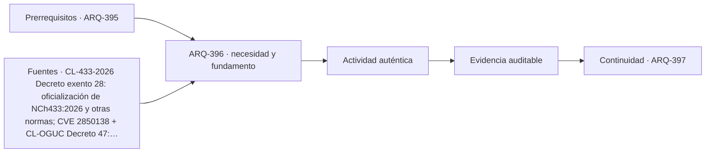

# ARQ-396 · Normas técnicas chilenas: edición, adopción y vigencia

**Parte 40 · Clase desarrollada · Incorporada en v0.23.0.**

Prerrequisitos conceptuales: ARQ-395. Sin calendario. Material educativo; no constituye asesoría jurídica, especificación ejecutable, acto administrativo, interpretación vinculante de contrato ni habilitación profesional. Los casos y cifras son didácticos salvo antecedentes expresamente atribuidos. Revisión externa especializada pendiente.

## Pregunta central

¿Cómo verificar una NCh sin confundir número, edición publicada, oficialización y fecha de aplicación?

## Resultado y continuidad

Recibe ARQ-395: mantiene identificación, versión, fuentes y estados. El nuevo caso es independiente salvo referencias expresamente recuperadas. Elaborarás una matriz o registro reproducible, resolverás un caso trabajado y una práctica independiente, y cerrarás distinguiendo hecho, interpretación, obligación, evidencia y asunto pendiente.

## 1. Definir el objeto y la frontera

Una referencia como “NCh433” es incompleta para una decisión documental: necesita edición, organismo, estado y forma de incorporación. Los cambios de edición pueden modificar definiciones o procedimientos aunque el número base permanezca.

## 2. Distinguir documentos y funciones

En Chile algunas normas técnicas se relacionan con reglamentos o actos de oficialización. Debe verificarse el documento que establece esa relación y su fecha. Publicación, oficialización y vigencia pueden no coincidir en el mismo día.

## 3. La confusión que debe evitarse

Una memoria que copia una referencia histórica puede seguir describiendo el criterio con que se desarrolló una etapa, pero no debe etiquetarse automáticamente como referencia vigente. La gestión de transición exige decidir qué documentos se actualizan y bajo qué condiciones.

## 4. Interfaces y dependencias

El catálogo o ficha pública de una norma confirma metadatos y alcance general; no equivale a disponer del texto íntegro. Cuando la aplicación depende de una cláusula específica, el equipo debe obtener acceso legítimo al documento necesario.

## 5. Cambios, versiones y tiempo

La trazabilidad también debe conservar normas retiradas cuando explican decisiones antiguas. Borrar toda referencia previa impide reconstruir por qué un cálculo fue realizado de cierta manera. Se marca su estado y se vincula la nueva revisión.

## 6. Responsables, evidencia y cierre

La auditoría de referencias necesita fecha de consulta. Esto es especialmente importante en períodos de actualización: el lector debe saber qué podía verificarse en ese momento y qué estaba anunciado, publicado o todavía en transición.

### Caso trabajado: una vigencia diferida

Un decreto ficticio se publica el **10 de agosto** y declara que una nueva edición entra en vigencia **seis meses después**. Un informe fechado 23 de septiembre afirma “ya vigente porque fue publicada”.

El error no es matemático sino temporal: publicación no equivale a cumplimiento del plazo. La ficha debe registrar fecha de publicación, regla de vigencia y fecha de consulta.

La clase utiliza el caso real de oficialización de NCh433:2026 como ejemplo de que esa diferencia debe comprobarse en el acto oficial, sin pretender interpretar todos los transitorios de una obra.

*Figura 396. El esquema separa fuente, aplicación y evidencia; no crea obligaciones nuevas.*

## 8. Método de trabajo reproducible

Para cualquier documento registra como mínimo: **identificador, título, emisor, edición o versión, fecha relevante, jurisdicción o ámbito, objeto, forma de incorporación, evidencia disponible, responsable y estado**. Si una de esas variables es desconocida, se conserva como desconocida; no se completa desde memoria para que la tabla parezca terminada.

Cuando existe un número, anota también unidad, denominador y frontera. En materias documentales las cantidades suelen parecer sencillas, pero pueden ocultar diferencias de alcance: superficie bruta frente a neta, precio con o sin partidas, cantidad enviada frente a aceptada, documento publicado frente a vigente. La aritmética es una comprobación; la aplicabilidad necesita otra evidencia.

## 9. Profundización: qué no demuestra un documento correcto

Un documento formalmente correcto puede pertenecer a otra versión, otro predio o un alcance distinto. Una firma válida no amplía el objeto firmado. Una norma vigente no prueba cumplimiento. Un plano coordinado no prueba ejecución. Una oferta completa no acredita que el contrato la haya incorporado. Una recepción o aceptación tampoco convierte en conocidas todas las prestaciones futuras.

Esta separación es deliberada: en un proyecto complejo, los errores más costosos pueden surgir cuando una evidencia real se utiliza para responder una pregunta distinta. La revisión debe preguntar siempre **“¿qué afirmación exacta respalda este documento?”** y **“¿qué cambia si la configuración o la fuente cambia?”**.

## 10. Errores frecuentes

Evita usar la fecha de descarga como fecha de vigencia; citar una edición sin comprobar su estado; tratar un visor como acto oficial; copiar una cláusula extranjera como si fuera legislación local; cerrar una incidencia porque fue respondida sin actualizar los documentos; y sumar porcentajes de estados diferentes para fabricar un índice de “cumplimiento”.

Otro error es borrar la versión anterior después de una corrección. La trazabilidad necesita conservar antecedentes suficientes para entender el cambio. Obsoleto no significa inexistente: significa que no debe usarse como línea base actual.

## 11. Cruce con un proyecto real

En un proyecto real esta materia no aparece aislada. La decisión debe vincularse con el encargo, la etapa, el contrato, la autoridad cuando corresponda y los documentos técnicos que dependen de ella. Una revisión responsable comienza por identificar **qué está en juego si la interpretación es incorrecta**: puede ser una cantidad, una autorización, una obligación entre partes, un requisito de desempeño o la capacidad de operar y mantener. Esa consecuencia determina qué evidencia merece prioridad.

La práctica profesional exige además distinguir entre **localizar una fuente**, **leerla**, **interpretarla para un caso**, **incorporarla al proyecto** y **verificar el resultado**. Son cinco operaciones distintas. Un enlace resuelve solamente la primera; una ficha pública puede apoyar la segunda de manera parcial; la aplicación necesita competencia, contexto y, en materias jurídicas o contractuales, la revisión especializada correspondiente.

Por eso la entrega académica debe dejar una ruta de auditoría: qué documento se consultó, qué versión, qué afirmación se extrajo, quién debería confirmar su aplicabilidad y qué archivo del proyecto cambiaría si la respuesta fuese distinta. Esa ruta es más valiosa que una lista extensa de referencias sin relación con decisiones concretas.

## Práctica independiente

Imagina una norma edición 2020, otra 2026 y un contrato firmado en 2025 que cita la primera. Redacta qué preguntas deben resolverse antes de sustituir la referencia en todos los documentos.

Solución razonada

Debe revisarse aplicabilidad legal, cláusula contractual, transitorios, alcance técnico, documentos dependientes, efecto en cálculos y aprobación de cambios. “Existe una edición 2026” no basta para reemplazar automáticamente la línea base contractual de 2025.

La solución describe únicamente el caso educativo. Para un proyecto real deben consultarse las fuentes vigentes, el contrato, los antecedentes específicos y los profesionales o autoridades competentes. Si una fuente pública es solo una ficha o portal, no se presenta como lectura del documento técnico completo.

## Autoevaluación y enlace

Puedes avanzar si logras reconstruir el caso sin la solución, identificas al menos tres campos que podrían cambiar la conclusión y distingues una evidencia de una obligación. Revisa especialmente si mantuviste versiones y jurisdicción. La clase siguiente recibe el método, no una conclusión universal.

<!-- pedagogia-2026:inicio -->
## Decisión pedagógica y posición curricular

### Por qué existe

Esta clase existe para resolver una necesidad concreta del recorrido: ¿Cómo verificar una NCh sin confundir número, edición publicada, oficialización y fecha de aplicación?

### Por qué está exactamente aquí

Ocupa el lugar 6 de la Parte 40. Se estudia después de ARQ-395 · Responsabilidades, habilitaciones y revisión independiente porque usa esa base para responder «¿Cómo verificar una NCh sin confundir número, edición publicada, oficialización y fecha de aplicación?». Se ubica antes de ARQ-397 · Gestión de calidad, ambiente y seguridad con ISO porque la evidencia producida aquí debe estar disponible para ese paso.

- **Prerrequisitos:** `ARQ-395`
- **Capacidad que introduce:** Recibe ARQ-395: mantiene identificación, versión, fuentes y estados. El nuevo caso es independiente salvo referencias expresamente recuperadas. Elaborarás una matriz o registro reproducible, resolverás un caso trabajado y una práctica independiente, y cerrarás distinguiendo hecho, interpretación, obligación, evidencia y asunto pendiente.
- **Clases o experiencias que dependen de ella:** `ARQ-397`

El diagrama permite comprobar una relación que el texto lineal oculta con facilidad: esta clase recibe capacidades previas, toma decisiones apoyadas por fuentes, exige una experiencia y produce evidencia que habilita trabajo posterior. No representa un procedimiento de obra.

## Resultado observable, evidencia y evaluación

1. Identificar y delimitar las condiciones necesarias para responder la pregunta central de normas técnicas chilenas: edición, adopción y vigencia.
2. Producir y comprobar la evidencia declarada por la clase: Recibe ARQ-395: mantiene identificación, versión, fuentes y estados. El nuevo caso es independiente salvo referencias expresamente recuperadas. Elaborarás una matriz o registro reproducible, resolverás un caso trabajado y una práctica independiente, y cerrarás distinguiendo hecho, interpretación, obligación, evidencia y asunto pendiente.
3. Justificar una decisión de normas técnicas chilenas: edición, adopción y vigencia mediante fuentes, supuestos, alternativas y límites explícitos.

## Actividad, evidencia y criterio de aceptación

**Actividad:** Imagina una norma edición 2020, otra 2026 y un contrato firmado en 2025 que cita la primera. Redacta qué preguntas deben resolverse antes de sustituir la referencia en todos los documentos.

**Evidencia mínima:** Recibe ARQ-395: mantiene identificación, versión, fuentes y estados. El nuevo caso es independiente salvo referencias expresamente recuperadas. Elaborarás una matriz o registro reproducible, resolverás un caso trabajado y una práctica independiente, y cerrarás distinguiendo hecho, interpretación, obligación, evidencia y asunto pendiente.

**Archivo sugerido:** `evidence/ARQ-396/evidencia.md`.

**Criterio de aceptación:** la entrega se acepta cuando:

- La entrega responde explícitamente a la pregunta: ¿Cómo verificar una NCh sin confundir número, edición publicada, oficialización y fecha de aplicación?
- La actividad conserva las fronteras del caso y permite reconstruir el procedimiento: Imagina una norma edición 2020, otra 2026 y un contrato firmado en 2025 que cita la primera. Redacta qué preguntas deben resolverse antes de sustituir la referencia en todos los documentos.
- Cada afirmación externa puede seguirse hasta una fuente, su alcance consultado y su límite.
- La evidencia deja disponible una entrada comprobable para ARQ-397.
- Evita usar la fecha de descarga como fecha de vigencia; citar una edición sin comprobar su estado; tratar un visor como acto oficial; copiar una cláusula extranjera como si fuera legislación local; cerrar una incidencia porque fue respondida sin actualizar los documentos; y sumar porcentajes de estados diferentes para fabricar un índice de “cumplimiento”. Otro error es borrar la versión anterior después de una corrección.

La [rúbrica común](../../docs/RUBRICA_COMUN.md) complementa estos criterios; no los reemplaza. Una entrega puede superar un promedio y continuar pendiente si oculta una condición crítica.

## Trazabilidad de las decisiones

| # | Decisión o fundamento | Fuente utilizada | Aplicación y límite en esta clase |
|---:|---|---|---|
| 1 | Publicación 10-08-2026 y entrada en vigencia diferida seis meses desde publicación | [CL-433-2026 Decreto exento 28: oficialización de NCh433:2026 y otras…](https://www.diariooficial.interior.gob.cl/publicaciones/2026/08/10/44521/01/2850138.pdf) | Consulta: Texto de dos páginas; segunda página inspeccionada visualmente Límite: No se leyó aquí el texto técnico íntegro de NCh433:2026; no basta la fecha del catálogo para decidir aplicabilidad a una obra. |
| 2 | Localizador principal para verificar requisitos urbanísticos y de edificación | [CL-OGUC Decreto 47: Ordenanza General de Urbanismo y Construcciones](https://www.bcn.cl/leychile/navegar?idNorma=8201) | Consulta: Texto consolidado disponible; revisión de marco, no de cada disposición Límite: Una ficha educativa no reemplaza lectura del artículo vigente, sus modificaciones, transitorios y antecedentes del proyecto. |
| 3 | Línea base, trazabilidad y análisis del impacto de cambios | [Organismo: National Aeronautics and Space Administration. Consulta:…](https://www.nasa.gov/reference/6-0-crosscutting-technical-management/) | Consulta: Apartados 6.2 y 6.5 sobre requisitos y configuración Límite: Los formularios y el caso arquitectónico son originales; no se copian procedimientos contractuales. Consulta de referencias nuevas o reconsultadas: 23 de septiembre de 2026. Los casos, matrices, cifras y soluciones son elaboración didáctica original. |

La tabla permite auditar las relaciones; la explicación, el caso y la práctica de la clase siguen siendo la documentación principal.

## Autoevaluación, recuperación y continuidad

### Errores diagnósticos

Antes de avanzar, comprueba si puedes reconstruir cada resultado sin mirar la solución, señalar qué evidencia lo sostiene y nombrar una condición que obligaría a revisar tu decisión. Conserva la primera versión, la objeción recibida y la revisión.

**Conexión siguiente:** La continuidad inmediata es ARQ-397 · Gestión de calidad, ambiente y seguridad con ISO; conserva el método y vuelve a verificar datos y límites.
<!-- pedagogia-2026:fin -->

## Fuentes y alcance de uso

### [[CL-433-2026]](#FUENTE-CL-433-2026) Decreto exento 28: oficialización de NCh433:2026 y otras normas; CVE 2850138

MINVU / Diario Oficial. [https://www.diariooficial.interior.gob.cl/publicaciones/2026/08/10/44521/01/2850138.pdf](https://www.diariooficial.interior.gob.cl/publicaciones/2026/08/10/44521/01/2850138.pdf)

**Consulta:** Texto de dos páginas; segunda página inspeccionada visualmente **Apoyo:** Publicación 10-08-2026 y entrada en vigencia diferida seis meses desde publicación **Límite:** No se leyó aquí el texto técnico íntegro de NCh433:2026; no basta la fecha del catálogo para decidir aplicabilidad a una obra.

### [[CL-OGUC]](#FUENTE-CL-OGUC) Decreto 47: Ordenanza General de Urbanismo y Construcciones

BCN / LeyChile. [https://www.bcn.cl/leychile/navegar?idNorma=8201](https://www.bcn.cl/leychile/navegar?idNorma=8201)

**Consulta:** Texto consolidado disponible; revisión de marco, no de cada disposición **Apoyo:** Localizador principal para verificar requisitos urbanísticos y de edificación **Límite:** Una ficha educativa no reemplaza lectura del artículo vigente, sus modificaciones, transitorios y antecedentes del proyecto.

### [[NASA-CHANGE]](#FUENTE-NASA-CHANGE) NASA Systems Engineering Handbook, 6.0: Crosscutting Technical Management

National Aeronautics and Space Administration. [https://www.nasa.gov/reference/6-0-crosscutting-technical-management/](https://www.nasa.gov/reference/6-0-crosscutting-technical-management/)

**Consulta:** Apartados 6.2 y 6.5 sobre requisitos y configuración **Apoyo:** Línea base, trazabilidad y análisis del impacto de cambios **Límite:** Los formularios y el caso arquitectónico son originales; no se copian procedimientos contractuales.

Consulta de referencias nuevas o reconsultadas: **23 de septiembre de 2026**. Los casos, matrices, cifras y soluciones son elaboración didáctica original.
