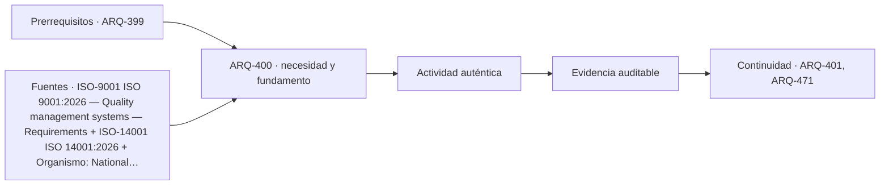

# ARQ-400 · Gestión de cambios normativos y auditoría de fuentes

**Parte 40 · Clase desarrollada · Incorporada en v0.23.0.**

Prerrequisitos conceptuales: ARQ-399. Sin calendario. Material educativo; no constituye asesoría jurídica, especificación ejecutable, acto administrativo, interpretación vinculante de contrato ni habilitación profesional. Los casos y cifras son didácticos salvo antecedentes expresamente atribuidos. Revisión externa especializada pendiente.

## Pregunta central

¿Cómo detectar que una referencia cambió y actualizar un proyecto sin borrar la historia ni sustituir la revisión por una búsqueda en Internet?

## Resultado y continuidad

Recibe ARQ-399: mantiene identificación, versión, fuentes y estados. El nuevo caso es independiente salvo referencias expresamente recuperadas. Elaborarás una matriz o registro reproducible, resolverás un caso trabajado y una práctica independiente, y cerrarás distinguiendo hecho, interpretación, obligación, evidencia y asunto pendiente.

## 1. Definir el objeto y la frontera

Una auditoría normativa comienza por un inventario de referencias: identificador, título, edición, emisor, fecha de consulta, modo de incorporación y documentos del proyecto que dependen de ella. Sin ese inventario es difícil saber qué debe reabrirse cuando cambia una fuente.

## 2. Distinguir documentos y funciones

Las fuentes tienen calidad y función diferentes. Un catálogo oficial puede confirmar una edición; un texto consolidado puede mostrar una ley vigente; una noticia institucional puede anunciar una publicación; una página secundaria puede ayudar a encontrar el documento, pero no debería ser la evidencia final de una obligación.

## 3. La confusión que debe evitarse

En septiembre de 2026 ISO publicó ISO 9001:2026 y ya había publicado ISO 14001:2026. Eso ilustra un cambio real de edición. Sin embargo, la transición de una certificación, un contrato o un proyecto concreto requiere revisar reglas específicas; no se inventa un plazo universal por haber visto la nueva ficha.

## 4. Interfaces y dependencias

El control de configuración conserva la línea base y la variante. Si un requisito cambia, se identifica impacto sobre especificaciones, cálculos, planos, compras, ensayos y autorizaciones. Actualizar solo la bibliografía puede dejar intactas decisiones que dependían de otra versión.

## 5. Cambios, versiones y tiempo

La auditoría también detecta enlaces rotos y acceso parcial. Si el proyecto solo consultó una ficha pública, debe decirlo. Una afirmación que requiere una cláusula del texto completo permanece pendiente hasta acceder legítimamente al documento necesario.

## 6. Responsables, evidencia y cierre

El cierre necesita evidencia de revisión: quién comparó las ediciones, qué cambió, qué se mantuvo, qué documentos fueron actualizados y qué decisiones permanecen pendientes. El objetivo no es estar “siempre actualizado” de manera abstracta, sino saber qué versión sustenta cada decisión.

### Caso trabajado: una actualización que afecta cuatro documentos

La línea base ficticia usa Norma N-2020 en especificación **E**, cálculo **C**, plan de ensayo **P** y matriz de cumplimiento **M**. Aparece N-2026. La revisión concluye que solo cambia el método de ensayo y una definición de aceptación.

No se reescribe C si su método no depende de esos cambios, pero sí deben revisarse P y M, y E si cita la definición antigua. La lista de impacto es **P, M y posiblemente E**, no “todos los archivos” ni “solo la bibliografía”.

El caso muestra que la trazabilidad reduce tanto omisiones como retrabajo innecesario.

*Figura 400. El esquema separa fuente, aplicación y evidencia; no crea obligaciones nuevas.*

## 8. Método de trabajo reproducible

Para cualquier documento registra como mínimo: **identificador, título, emisor, edición o versión, fecha relevante, jurisdicción o ámbito, objeto, forma de incorporación, evidencia disponible, responsable y estado**. Si una de esas variables es desconocida, se conserva como desconocida; no se completa desde memoria para que la tabla parezca terminada.

Cuando existe un número, anota también unidad, denominador y frontera. En materias documentales las cantidades suelen parecer sencillas, pero pueden ocultar diferencias de alcance: superficie bruta frente a neta, precio con o sin partidas, cantidad enviada frente a aceptada, documento publicado frente a vigente. La aritmética es una comprobación; la aplicabilidad necesita otra evidencia.

## 9. Profundización: qué no demuestra un documento correcto

Un documento formalmente correcto puede pertenecer a otra versión, otro predio o un alcance distinto. Una firma válida no amplía el objeto firmado. Una norma vigente no prueba cumplimiento. Un plano coordinado no prueba ejecución. Una oferta completa no acredita que el contrato la haya incorporado. Una recepción o aceptación tampoco convierte en conocidas todas las prestaciones futuras.

Esta separación es deliberada: en un proyecto complejo, los errores más costosos pueden surgir cuando una evidencia real se utiliza para responder una pregunta distinta. La revisión debe preguntar siempre **“¿qué afirmación exacta respalda este documento?”** y **“¿qué cambia si la configuración o la fuente cambia?”**.

## 10. Errores frecuentes

Evita usar la fecha de descarga como fecha de vigencia; citar una edición sin comprobar su estado; tratar un visor como acto oficial; copiar una cláusula extranjera como si fuera legislación local; cerrar una incidencia porque fue respondida sin actualizar los documentos; y sumar porcentajes de estados diferentes para fabricar un índice de “cumplimiento”.

Otro error es borrar la versión anterior después de una corrección. La trazabilidad necesita conservar antecedentes suficientes para entender el cambio. Obsoleto no significa inexistente: significa que no debe usarse como línea base actual.

## 11. Cruce con un proyecto real

En un proyecto real esta materia no aparece aislada. La decisión debe vincularse con el encargo, la etapa, el contrato, la autoridad cuando corresponda y los documentos técnicos que dependen de ella. Una revisión responsable comienza por identificar **qué está en juego si la interpretación es incorrecta**: puede ser una cantidad, una autorización, una obligación entre partes, un requisito de desempeño o la capacidad de operar y mantener. Esa consecuencia determina qué evidencia merece prioridad.

La práctica profesional exige además distinguir entre **localizar una fuente**, **leerla**, **interpretarla para un caso**, **incorporarla al proyecto** y **verificar el resultado**. Son cinco operaciones distintas. Un enlace resuelve solamente la primera; una ficha pública puede apoyar la segunda de manera parcial; la aplicación necesita competencia, contexto y, en materias jurídicas o contractuales, la revisión especializada correspondiente.

Por eso la entrega académica debe dejar una ruta de auditoría: qué documento se consultó, qué versión, qué afirmación se extrajo, quién debería confirmar su aplicabilidad y qué archivo del proyecto cambiaría si la respuesta fuese distinta. Esa ruta es más valiosa que una lista extensa de referencias sin relación con decisiones concretas.

## Práctica independiente

Construye un registro de seis fuentes con campos de edición, fecha de consulta, estado y documentos dependientes. Simula que dos cambian de edición. Define qué archivos reabrirías y qué evidencia exigirías antes de cerrar el cambio.

Solución razonada

La respuesta depende de las dependencias declaradas. Cada fuente modificada debe activar solo los documentos cuyo contenido usa requisitos, métodos o definiciones alteradas. Se exige comparación de versiones, decisión de aplicabilidad, actualización rastreable y revisión correspondiente; no basta reemplazar el año.

La solución describe únicamente el caso educativo. Para un proyecto real deben consultarse las fuentes vigentes, el contrato, los antecedentes específicos y los profesionales o autoridades competentes. Si una fuente pública es solo una ficha o portal, no se presenta como lectura del documento técnico completo.

## Autoevaluación y enlace

Puedes avanzar si logras reconstruir el caso sin la solución, identificas al menos tres campos que podrían cambiar la conclusión y distingues una evidencia de una obligación. Revisa especialmente si mantuviste versiones y jurisdicción. La clase siguiente recibe el método, no una conclusión universal.

<!-- pedagogia-2026:inicio -->
## Decisión pedagógica y posición curricular

### Por qué existe

Esta clase existe para resolver una necesidad concreta del recorrido: ¿Cómo detectar que una referencia cambió y actualizar un proyecto sin borrar la historia ni sustituir la revisión por una búsqueda en Internet?

### Por qué está exactamente aquí

Cierra la Parte 40: integra lo producido en ARQ-399 · Contratos y normas extranjeras: incorporación y conflictos para responder «¿Cómo detectar que una referencia cambió y actualizar un proyecto sin borrar la historia ni sustituir la revisión por una búsqueda en Internet?». La transición hacia ARQ-401 · Memoria, planos, especificaciones y mediciones transfiere el método y la disciplina de evidencia, no los datos o parámetros particulares de esta parte.

- **Prerrequisitos:** `ARQ-399`
- **Capacidad que introduce:** Recibe ARQ-399: mantiene identificación, versión, fuentes y estados. El nuevo caso es independiente salvo referencias expresamente recuperadas. Elaborarás una matriz o registro reproducible, resolverás un caso trabajado y una práctica independiente, y cerrarás distinguiendo hecho, interpretación, obligación, evidencia y asunto pendiente.
- **Clases o experiencias que dependen de ella:** `ARQ-401`, `ARQ-471`

El diagrama permite comprobar una relación que el texto lineal oculta con facilidad: esta clase recibe capacidades previas, toma decisiones apoyadas por fuentes, exige una experiencia y produce evidencia que habilita trabajo posterior. No representa un procedimiento de obra.

## Resultado observable, evidencia y evaluación

1. Identificar y delimitar las condiciones necesarias para responder la pregunta central de gestión de cambios normativos y auditoría de fuentes.
2. Producir y comprobar la evidencia declarada por la clase: Recibe ARQ-399: mantiene identificación, versión, fuentes y estados. El nuevo caso es independiente salvo referencias expresamente recuperadas. Elaborarás una matriz o registro reproducible, resolverás un caso trabajado y una práctica independiente, y cerrarás distinguiendo hecho, interpretación, obligación, evidencia y asunto pendiente.
3. Justificar una decisión de gestión de cambios normativos y auditoría de fuentes mediante fuentes, supuestos, alternativas y límites explícitos.

## Actividad, evidencia y criterio de aceptación

**Actividad:** Construye un registro de seis fuentes con campos de edición, fecha de consulta, estado y documentos dependientes. Simula que dos cambian de edición. Define qué archivos reabrirías y qué evidencia exigirías antes de cerrar el cambio.

**Evidencia mínima:** Recibe ARQ-399: mantiene identificación, versión, fuentes y estados. El nuevo caso es independiente salvo referencias expresamente recuperadas. Elaborarás una matriz o registro reproducible, resolverás un caso trabajado y una práctica independiente, y cerrarás distinguiendo hecho, interpretación, obligación, evidencia y asunto pendiente.

**Archivo sugerido:** `evidence/ARQ-400/evidencia.md`.

**Criterio de aceptación:** la entrega se acepta cuando:

- La entrega responde explícitamente a la pregunta: ¿Cómo detectar que una referencia cambió y actualizar un proyecto sin borrar la historia ni sustituir la revisión por una búsqueda en Internet?
- La actividad conserva las fronteras del caso y permite reconstruir el procedimiento: Construye un registro de seis fuentes con campos de edición, fecha de consulta, estado y documentos dependientes. Simula que dos cambian de edición. Define qué archivos reabrirías y qué evidencia exigirías antes de cerrar el cambio.
- Cada afirmación externa puede seguirse hasta una fuente, su alcance consultado y su límite.
- La evidencia deja disponible una entrada comprobable para ARQ-401.
- Evita usar la fecha de descarga como fecha de vigencia; citar una edición sin comprobar su estado; tratar un visor como acto oficial; copiar una cláusula extranjera como si fuera legislación local; cerrar una incidencia porque fue respondida sin actualizar los documentos; y sumar porcentajes de estados diferentes para fabricar un índice de “cumplimiento”. Otro error es borrar la versión anterior después de una corrección.

La [rúbrica común](../../docs/RUBRICA_COMUN.md) complementa estos criterios; no los reemplaza. Una entrega puede superar un promedio y continuar pendiente si oculta una condición crítica.

## Trazabilidad de las decisiones

| # | Decisión o fundamento | Fuente utilizada | Aplicación y límite en esta clase |
|---:|---|---|---|
| 1 | Sistema de gestión de calidad; edición publicada y ámbito general | [ISO-9001 ISO 9001:2026 — Quality management systems — Requirements](https://www.iso.org/standard/9001) | Consulta: Ficha pública; publicación 16-09-2026 Límite: Texto normativo íntegro no adquirido; no se inventan cláusulas ni plazos universales de transición de certificación. |
| 2 | Sistema de gestión ambiental y alcance general | [ISO-14001 ISO 14001:2026](https://www.iso.org/standard/14001) | Consulta: Ficha pública; edición 2026 Límite: No equivale a certificar el desempeño ambiental de cada edificio; texto completo no consultado. |
| 3 | Línea base, trazabilidad y análisis del impacto de cambios | [Organismo: National Aeronautics and Space Administration. Consulta:…](https://www.nasa.gov/reference/6-0-crosscutting-technical-management/) | Consulta: Apartados 6.2 y 6.5 sobre requisitos y configuración Límite: Los formularios y el caso arquitectónico son originales; no se copian procedimientos contractuales. |
| 4 | Niveles de planificación, componentes de instrumentos y necesidad de distinguir versiones. | [URB-LGUC Ley General de Urbanismo y Construcciones: texto consolidado…](https://www.bcn.cl/leychile/navegar?idNorma=13560) | Consulta: Lectura dirigida de artículos 27–29, 34–35, 41–46 y anotaciones; no auditoría completa de disposiciones y transitorios. Límite: Hay modificaciones publicadas en 2026. Determinar aplicabilidad temporal y procedimientos concretos requiere revisar transitorios y reglamentación; no se ofrece asesoría predial. Consulta de referencias nuevas o reconsultadas: 23 de septiembre de 2026. Los casos, matrices, cifras y soluciones son elaboración didáctica original. |

La tabla permite auditar las relaciones; la explicación, el caso y la práctica de la clase siguen siendo la documentación principal.

## Autoevaluación, recuperación y continuidad

### Errores diagnósticos

Antes de avanzar, comprueba si puedes reconstruir cada resultado sin mirar la solución, señalar qué evidencia lo sostiene y nombrar una condición que obligaría a revisar tu decisión. Conserva la primera versión, la objeción recibida y la revisión.

**Conexión siguiente:** La continuidad inmediata es ARQ-401 · Memoria, planos, especificaciones y mediciones; conserva el método y vuelve a verificar datos y límites.
<!-- pedagogia-2026:fin -->

## Fuentes y alcance de uso

### [[ISO-9001]](#FUENTE-ISO-9001) ISO 9001:2026 — Quality management systems — Requirements

ISO. [https://www.iso.org/standard/9001](https://www.iso.org/standard/9001)

**Consulta:** Ficha pública; publicación 16-09-2026 **Apoyo:** Sistema de gestión de calidad; edición publicada y ámbito general **Límite:** Texto normativo íntegro no adquirido; no se inventan cláusulas ni plazos universales de transición de certificación.

### [[ISO-14001]](#FUENTE-ISO-14001) ISO 14001:2026 — Environmental management systems

ISO. [https://www.iso.org/standard/14001](https://www.iso.org/standard/14001)

**Consulta:** Ficha pública; edición 2026 **Apoyo:** Sistema de gestión ambiental y alcance general **Límite:** No equivale a certificar el desempeño ambiental de cada edificio; texto completo no consultado.

### [[NASA-CHANGE]](#FUENTE-NASA-CHANGE) NASA Systems Engineering Handbook, 6.0: Crosscutting Technical Management

National Aeronautics and Space Administration. [https://www.nasa.gov/reference/6-0-crosscutting-technical-management/](https://www.nasa.gov/reference/6-0-crosscutting-technical-management/)

**Consulta:** Apartados 6.2 y 6.5 sobre requisitos y configuración **Apoyo:** Línea base, trazabilidad y análisis del impacto de cambios **Límite:** Los formularios y el caso arquitectónico son originales; no se copian procedimientos contractuales.

### [[URB-LGUC]](#FUENTE-URB-LGUC) Ley General de Urbanismo y Construcciones: texto consolidado consultado

Biblioteca del Congreso Nacional de Chile / LeyChile. [https://www.bcn.cl/leychile/navegar?idNorma=13560](https://www.bcn.cl/leychile/navegar?idNorma=13560)

**Consulta:** Lectura dirigida de artículos 27–29, 34–35, 41–46 y anotaciones; no auditoría completa de disposiciones y transitorios. **Apoyo:** Niveles de planificación, componentes de instrumentos y necesidad de distinguir versiones. **Límite:** Hay modificaciones publicadas en 2026. Determinar aplicabilidad temporal y procedimientos concretos requiere revisar transitorios y reglamentación; no se ofrece asesoría predial.

Consulta de referencias nuevas o reconsultadas: **23 de septiembre de 2026**. Los casos, matrices, cifras y soluciones son elaboración didáctica original.
