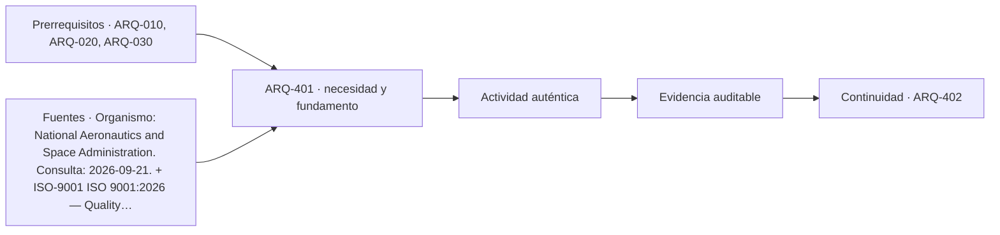

# ARQ-401 · Memoria, planos, especificaciones y mediciones

**Parte 41 · Clase desarrollada · Incorporada en v0.23.0.**

Prerrequisitos conceptuales: ARQ-010, ARQ-020, ARQ-030. Sin calendario. Material educativo; no constituye asesoría jurídica, especificación ejecutable, acto administrativo, interpretación vinculante de contrato ni habilitación profesional. Los casos y cifras son didácticos salvo antecedentes expresamente atribuidos. Revisión externa especializada pendiente.

## Pregunta central

¿Cómo lograr que memoria, planos, especificaciones y mediciones describan el mismo proyecto sin convertir un documento en sustituto de los demás?

## Resultado y continuidad

Esta clase abre la Parte 41. Recibe la auditoría normativa de ARQ-400 y la convierte en un sistema documental de proyecto; no vuelve a discutir aplicabilidad jurídica como si fuera una especificación. Elaborarás una matriz o registro reproducible, resolverás un caso trabajado y una práctica independiente, y cerrarás distinguiendo hecho, interpretación, obligación, evidencia y asunto pendiente.

## 1. Definir el objeto y la frontera

Cada documento responde preguntas distintas. La memoria explica decisiones y alcance; los planos localizan y representan; las especificaciones definen prestaciones, materiales, ejecución y evidencias; las mediciones cuantifican bajo reglas declaradas. La coordinación consiste en que se refieran al mismo objeto y versión.

## 2. Distinguir documentos y funciones

Un plano puede mostrar una puerta sin definir todos sus requisitos. Una especificación puede exigir una prestación sin fijar su ubicación. La memoria puede justificar una estrategia sin detallar cada pieza. Ninguno debería cargar información crítica que los demás contradicen silenciosamente.

## 3. La confusión que debe evitarse

Las mediciones requieren reglas de frontera. Un muro puede medirse por superficie bruta, neta o volumen según el objetivo. Cambiar de regla en medio del presupuesto crea diferencias aun cuando la geometría sea la misma.

## 4. Interfaces y dependencias

Los identificadores son esenciales: recinto, elemento, detalle, especificación y partida necesitan vínculos. “Ver plano” o “según especificación” sin referencia precisa traslada la ambigüedad al lector y dificulta controlar cambios.

## 5. Cambios, versiones y tiempo

Una revisión coordinada busca conflictos semánticos además de geométricos. Si un plano dice 120 mm y la especificación 150 mm, el problema es evidente; si ambos dicen 120 pero uno mide acabado y otro estructura, la coincidencia numérica puede ocultar otra inconsistencia.

## 6. Responsables, evidencia y cierre

La entrega debe conservar versión y fecha. Un conjunto de documentos no es coherente porque todos estén en PDF: necesita una línea base identificada, registro de revisiones y responsables.

### Caso trabajado: el mismo muro medido de dos maneras

Un muro rectangular mide **8×3 m** y contiene dos vanos de 1,0×2,1 m. Su superficie bruta es 24 m²; los vanos suman 4,2 m²; la superficie neta es **19,8 m²**.

Si el presupuesto usa 24 y la especificación de terminación calcula consumo sobre 19,8, ambas cifras pueden ser correctas para fronteras distintas. El problema aparece si la partida se llama simplemente “muro 24 m²” y luego se compara con consumo neto sin explicación.

La regla de medición debe viajar con la cifra.

*Figura 401. El esquema separa fuente, aplicación y evidencia; no crea obligaciones nuevas.*

## 8. Método de trabajo reproducible

Para cualquier documento registra como mínimo: **identificador, título, emisor, edición o versión, fecha relevante, jurisdicción o ámbito, objeto, forma de incorporación, evidencia disponible, responsable y estado**. Si una de esas variables es desconocida, se conserva como desconocida; no se completa desde memoria para que la tabla parezca terminada.

Cuando existe un número, anota también unidad, denominador y frontera. En materias documentales las cantidades suelen parecer sencillas, pero pueden ocultar diferencias de alcance: superficie bruta frente a neta, precio con o sin partidas, cantidad enviada frente a aceptada, documento publicado frente a vigente. La aritmética es una comprobación; la aplicabilidad necesita otra evidencia.

## 9. Profundización: qué no demuestra un documento correcto

Un documento formalmente correcto puede pertenecer a otra versión, otro predio o un alcance distinto. Una firma válida no amplía el objeto firmado. Una norma vigente no prueba cumplimiento. Un plano coordinado no prueba ejecución. Una oferta completa no acredita que el contrato la haya incorporado. Una recepción o aceptación tampoco convierte en conocidas todas las prestaciones futuras.

Esta separación es deliberada: en un proyecto complejo, los errores más costosos pueden surgir cuando una evidencia real se utiliza para responder una pregunta distinta. La revisión debe preguntar siempre **“¿qué afirmación exacta respalda este documento?”** y **“¿qué cambia si la configuración o la fuente cambia?”**.

## 10. Errores frecuentes

Evita usar la fecha de descarga como fecha de vigencia; citar una edición sin comprobar su estado; tratar un visor como acto oficial; copiar una cláusula extranjera como si fuera legislación local; cerrar una incidencia porque fue respondida sin actualizar los documentos; y sumar porcentajes de estados diferentes para fabricar un índice de “cumplimiento”.

Otro error es borrar la versión anterior después de una corrección. La trazabilidad necesita conservar antecedentes suficientes para entender el cambio. Obsoleto no significa inexistente: significa que no debe usarse como línea base actual.

## 11. Cruce con un proyecto real

En un proyecto real esta materia no aparece aislada. La decisión debe vincularse con el encargo, la etapa, el contrato, la autoridad cuando corresponda y los documentos técnicos que dependen de ella. Una revisión responsable comienza por identificar **qué está en juego si la interpretación es incorrecta**: puede ser una cantidad, una autorización, una obligación entre partes, un requisito de desempeño o la capacidad de operar y mantener. Esa consecuencia determina qué evidencia merece prioridad.

La práctica profesional exige además distinguir entre **localizar una fuente**, **leerla**, **interpretarla para un caso**, **incorporarla al proyecto** y **verificar el resultado**. Son cinco operaciones distintas. Un enlace resuelve solamente la primera; una ficha pública puede apoyar la segunda de manera parcial; la aplicación necesita competencia, contexto y, en materias jurídicas o contractuales, la revisión especializada correspondiente.

Por eso la entrega académica debe dejar una ruta de auditoría: qué documento se consultó, qué versión, qué afirmación se extrajo, quién debería confirmar su aplicabilidad y qué archivo del proyecto cambiaría si la respuesta fuese distinta. Esa ruta es más valiosa que una lista extensa de referencias sin relación con decisiones concretas.

## Práctica independiente

Un paño mide 10×2,8 m y tiene tres vanos de 0,9×2,1 m. Calcula área bruta y neta. Luego redacta cómo lo representarías en plano, especificación y medición para evitar ambigüedad.

Solución razonada

Bruta 28 m²; vanos 5,67 m²; neta 22,33 m². El plano identifica geometría y vanos; la especificación define qué capas se aplican y cómo se tratan bordes; la medición declara regla y unidad. Ningún número debe aparecer sin su frontera.

La solución describe únicamente el caso educativo. Para un proyecto real deben consultarse las fuentes vigentes, el contrato, los antecedentes específicos y los profesionales o autoridades competentes. Si una fuente pública es solo una ficha o portal, no se presenta como lectura del documento técnico completo.

## Autoevaluación y enlace

Puedes avanzar si logras reconstruir el caso sin la solución, identificas al menos tres campos que podrían cambiar la conclusión y distingues una evidencia de una obligación. Revisa especialmente si mantuviste versiones y jurisdicción. La clase siguiente recibe el método, no una conclusión universal.

<!-- pedagogia-2026:inicio -->
## Decisión pedagógica y posición curricular

### Por qué existe

Esta clase existe para resolver una necesidad concreta del recorrido: ¿Cómo lograr que memoria, planos, especificaciones y mediciones describan el mismo proyecto sin convertir un documento en sustituto de los demás?

### Por qué está exactamente aquí

Abre la Parte 41 porque plantea primero el problema «¿Cómo lograr que memoria, planos, especificaciones y mediciones describan el mismo proyecto sin convertir un documento en sustituto de los demás?». La transición desde ARQ-400 · Gestión de cambios normativos y auditoría de fuentes conserva métodos de evidencia y límites, pero no traslada parámetros del bloque anterior. Establece la pregunta y el producto base que ARQ-402 · Especificar por desempeño y por prescripción desarrollará a continuación.

- **Prerrequisitos:** `ARQ-010`, `ARQ-020`, `ARQ-030`
- **Capacidad que introduce:** Esta clase abre la Parte 41. Recibe la auditoría normativa de ARQ-400 y la convierte en un sistema documental de proyecto; no vuelve a discutir aplicabilidad jurídica como si fuera una especificación. Elaborarás una matriz o registro reproducible, resolverás un caso trabajado y una práctica independiente, y cerrarás distinguiendo hecho, interpretación, obligación, evidencia y asunto pendiente.
- **Clases o experiencias que dependen de ella:** `ARQ-402`

El diagrama permite comprobar una relación que el texto lineal oculta con facilidad: esta clase recibe capacidades previas, toma decisiones apoyadas por fuentes, exige una experiencia y produce evidencia que habilita trabajo posterior. No representa un procedimiento de obra.

## Resultado observable, evidencia y evaluación

1. Identificar y delimitar las condiciones necesarias para responder la pregunta central de memoria, planos, especificaciones y mediciones.
2. Producir y comprobar la evidencia declarada por la clase: Esta clase abre la Parte 41. Recibe la auditoría normativa de ARQ-400 y la convierte en un sistema documental de proyecto; no vuelve a discutir aplicabilidad jurídica como si fuera una especificación. Elaborarás una matriz o registro reproducible, resolverás un caso trabajado y una práctica independiente, y cerrarás distinguiendo hecho, interpretación, obligación, evidencia y asunto pendiente.
3. Justificar una decisión de memoria, planos, especificaciones y mediciones mediante fuentes, supuestos, alternativas y límites explícitos.

## Actividad, evidencia y criterio de aceptación

**Actividad:** Un paño mide 10×2,8 m y tiene tres vanos de 0,9×2,1 m. Calcula área bruta y neta. Luego redacta cómo lo representarías en plano, especificación y medición para evitar ambigüedad.

**Evidencia mínima:** Esta clase abre la Parte 41. Recibe la auditoría normativa de ARQ-400 y la convierte en un sistema documental de proyecto; no vuelve a discutir aplicabilidad jurídica como si fuera una especificación. Elaborarás una matriz o registro reproducible, resolverás un caso trabajado y una práctica independiente, y cerrarás distinguiendo hecho, interpretación, obligación, evidencia y asunto pendiente.

**Archivo sugerido:** `evidence/ARQ-401/evidencia.md`.

**Criterio de aceptación:** la entrega se acepta cuando:

- La entrega responde explícitamente a la pregunta: ¿Cómo lograr que memoria, planos, especificaciones y mediciones describan el mismo proyecto sin convertir un documento en sustituto de los demás?
- La actividad conserva las fronteras del caso y permite reconstruir el procedimiento: Un paño mide 10×2,8 m y tiene tres vanos de 0,9×2,1 m. Calcula área bruta y neta. Luego redacta cómo lo representarías en plano, especificación y medición para evitar ambigüedad.
- Cada afirmación externa puede seguirse hasta una fuente, su alcance consultado y su límite.
- La evidencia deja disponible una entrada comprobable para ARQ-402.
- Evita usar la fecha de descarga como fecha de vigencia; citar una edición sin comprobar su estado; tratar un visor como acto oficial; copiar una cláusula extranjera como si fuera legislación local; cerrar una incidencia porque fue respondida sin actualizar los documentos; y sumar porcentajes de estados diferentes para fabricar un índice de “cumplimiento”. Otro error es borrar la versión anterior después de una corrección.

La [rúbrica común](../../docs/RUBRICA_COMUN.md) complementa estos criterios; no los reemplaza. Una entrega puede superar un promedio y continuar pendiente si oculta una condición crítica.

## Trazabilidad de las decisiones

| # | Decisión o fundamento | Fuente utilizada | Aplicación y límite en esta clase |
|---:|---|---|---|
| 1 | Línea base, trazabilidad y análisis del impacto de cambios | [Organismo: National Aeronautics and Space Administration. Consulta:…](https://www.nasa.gov/reference/6-0-crosscutting-technical-management/) | Consulta: Apartados 6.2 y 6.5 sobre requisitos y configuración Límite: Los formularios y el caso arquitectónico son originales; no se copian procedimientos contractuales. |
| 2 | Sistema de gestión de calidad; edición publicada y ámbito general | [ISO-9001 ISO 9001:2026 — Quality management systems — Requirements](https://www.iso.org/standard/9001) | Consulta: Ficha pública; publicación 16-09-2026 Límite: Texto normativo íntegro no adquirido; no se inventan cláusulas ni plazos universales de transición de certificación. |
| 3 | Distinguir tipos de actuaciones y documentos administrativos en permisos, modificaciones y recepciones. | [CL-MINVU-EDIF-FORMS Formularios de permisos de edificación](https://www.minvu.gob.cl/elementos-tecnicos/formularios/formularios-de-permisos-de-edificacion/) | Consulta: Página oficial consultada el 23-09-2026; lista solicitudes de permiso, modificación y recepción definitiva para distintas actuaciones. Límite: La existencia de un formulario no determina por sí sola qué procedimiento aplica a un caso; deben revisarse LGUC, OGUC, antecedentes, transitorios e instrucciones vigentes. Consulta de referencias nuevas o reconsultadas: 23 de septiembre de 2026. Los casos, matrices, cifras y soluciones son elaboración didáctica original. |

La tabla permite auditar las relaciones; la explicación, el caso y la práctica de la clase siguen siendo la documentación principal.

## Autoevaluación, recuperación y continuidad

### Errores diagnósticos

Antes de avanzar, comprueba si puedes reconstruir cada resultado sin mirar la solución, señalar qué evidencia lo sostiene y nombrar una condición que obligaría a revisar tu decisión. Conserva la primera versión, la objeción recibida y la revisión.

**Conexión siguiente:** La continuidad inmediata es ARQ-402 · Especificar por desempeño y por prescripción; conserva el método y vuelve a verificar datos y límites.
<!-- pedagogia-2026:fin -->

## Fuentes y alcance de uso

### [[NASA-CHANGE]](#FUENTE-NASA-CHANGE) NASA Systems Engineering Handbook, 6.0: Crosscutting Technical Management

National Aeronautics and Space Administration. [https://www.nasa.gov/reference/6-0-crosscutting-technical-management/](https://www.nasa.gov/reference/6-0-crosscutting-technical-management/)

**Consulta:** Apartados 6.2 y 6.5 sobre requisitos y configuración **Apoyo:** Línea base, trazabilidad y análisis del impacto de cambios **Límite:** Los formularios y el caso arquitectónico son originales; no se copian procedimientos contractuales.

### [[ISO-9001]](#FUENTE-ISO-9001) ISO 9001:2026 — Quality management systems — Requirements

ISO. [https://www.iso.org/standard/9001](https://www.iso.org/standard/9001)

**Consulta:** Ficha pública; publicación 16-09-2026 **Apoyo:** Sistema de gestión de calidad; edición publicada y ámbito general **Límite:** Texto normativo íntegro no adquirido; no se inventan cláusulas ni plazos universales de transición de certificación.

### [[CL-MINVU-EDIF-FORMS]](#FUENTE-CL-MINVU-EDIF-FORMS) Formularios de permisos de edificación

Ministerio de Vivienda y Urbanismo de Chile. [https://www.minvu.gob.cl/elementos-tecnicos/formularios/formularios-de-permisos-de-edificacion/](https://www.minvu.gob.cl/elementos-tecnicos/formularios/formularios-de-permisos-de-edificacion/)

**Consulta:** Página oficial consultada el 23-09-2026; lista solicitudes de permiso, modificación y recepción definitiva para distintas actuaciones. **Apoyo:** Distinguir tipos de actuaciones y documentos administrativos en permisos, modificaciones y recepciones. **Límite:** La existencia de un formulario no determina por sí sola qué procedimiento aplica a un caso; deben revisarse LGUC, OGUC, antecedentes, transitorios e instrucciones vigentes.

Consulta de referencias nuevas o reconsultadas: **23 de septiembre de 2026**. Los casos, matrices, cifras y soluciones son elaboración didáctica original.
