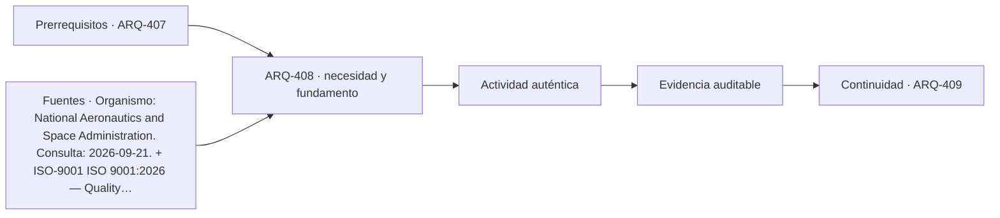

# ARQ-408 · Solicitudes de información y cambios

**Parte 41 · Clase desarrollada · Incorporada en v0.23.0.**

Prerrequisitos conceptuales: ARQ-407. Sin calendario. Material educativo; no constituye asesoría jurídica, especificación ejecutable, acto administrativo, interpretación vinculante de contrato ni habilitación profesional. Los casos y cifras son didácticos salvo antecedentes expresamente atribuidos. Revisión externa especializada pendiente.

## Pregunta central

¿Cómo usar una RFI para resolver información faltante sin convertir cada respuesta en una orden de cambio automática?

## Resultado y continuidad

Recibe ARQ-407: mantiene identificación, versión, fuentes y estados. El nuevo caso es independiente salvo referencias expresamente recuperadas. Elaborarás una matriz o registro reproducible, resolverás un caso trabajado y una práctica independiente, y cerrarás distinguiendo hecho, interpretación, obligación, evidencia y asunto pendiente.

## 1. Definir el objeto y la frontera

Una solicitud de información identifica una pregunta necesaria para ejecutar o coordinar. Debe localizar el problema, citar documentos y explicar el impacto. Una RFI vaga como “confirmar detalle” desplaza trabajo de investigación al receptor.

## 2. Distinguir documentos y funciones

La respuesta puede aclarar el diseño existente, revelar una discrepancia o introducir una modificación. Esas situaciones no tienen necesariamente el mismo efecto contractual. Conviene registrar si cambia alcance, costo, plazo o documentación.

## 3. La confusión que debe evitarse

Una respuesta por correo puede resolver la pregunta técnica y aun requerir incorporación formal a planos o especificaciones. Si la obra utiliza el correo pero la línea base no se actualiza, la siguiente revisión puede volver a la condición antigua.

## 4. Interfaces y dependencias

Los cambios necesitan identificador, origen, motivo, documentos afectados y estado de aprobación. La trazabilidad permite distinguir propuesta, autorización y ejecución. Saltarse uno de esos estados produce conflictos posteriores.

## 5. Cambios, versiones y tiempo

El análisis de impacto debe ser proporcional: una cota modificada puede afectar varias disciplinas; un error tipográfico quizá solo un documento. La gestión no consiste en abrir todos los archivos por rutina, sino en mapear dependencias.

## 6. Responsables, evidencia y cierre

El cierre de RFI no significa necesariamente cierre de cambio. La pregunta puede estar respondida mientras costo, plazo o documentos siguen pendientes. Los estados administrativos deben mantener esa diferencia.

### Caso trabajado: una cota que cambia cuatro archivos

RFI-17 pregunta si una abertura debe estar a **2,10 o 2,25 m**. La respuesta confirma 2,25. El modelo arquitectónico se actualiza, pero estructura, elevación, medición y plano de taller siguen en 2,10.

Cerrar RFI-17 como “respondida” es correcto para la pregunta, pero insuficiente para la configuración. Se necesitan tareas de actualización y revisión en los cuatro documentos dependientes.

La diferencia de 0,15 m es simple; la cadena documental es el problema real.

*Figura 408. El esquema separa fuente, aplicación y evidencia; no crea obligaciones nuevas.*

## 8. Método de trabajo reproducible

Para cualquier documento registra como mínimo: **identificador, título, emisor, edición o versión, fecha relevante, jurisdicción o ámbito, objeto, forma de incorporación, evidencia disponible, responsable y estado**. Si una de esas variables es desconocida, se conserva como desconocida; no se completa desde memoria para que la tabla parezca terminada.

Cuando existe un número, anota también unidad, denominador y frontera. En materias documentales las cantidades suelen parecer sencillas, pero pueden ocultar diferencias de alcance: superficie bruta frente a neta, precio con o sin partidas, cantidad enviada frente a aceptada, documento publicado frente a vigente. La aritmética es una comprobación; la aplicabilidad necesita otra evidencia.

## 9. Profundización: qué no demuestra un documento correcto

Un documento formalmente correcto puede pertenecer a otra versión, otro predio o un alcance distinto. Una firma válida no amplía el objeto firmado. Una norma vigente no prueba cumplimiento. Un plano coordinado no prueba ejecución. Una oferta completa no acredita que el contrato la haya incorporado. Una recepción o aceptación tampoco convierte en conocidas todas las prestaciones futuras.

Esta separación es deliberada: en un proyecto complejo, los errores más costosos pueden surgir cuando una evidencia real se utiliza para responder una pregunta distinta. La revisión debe preguntar siempre **“¿qué afirmación exacta respalda este documento?”** y **“¿qué cambia si la configuración o la fuente cambia?”**.

## 10. Errores frecuentes

Evita usar la fecha de descarga como fecha de vigencia; citar una edición sin comprobar su estado; tratar un visor como acto oficial; copiar una cláusula extranjera como si fuera legislación local; cerrar una incidencia porque fue respondida sin actualizar los documentos; y sumar porcentajes de estados diferentes para fabricar un índice de “cumplimiento”.

Otro error es borrar la versión anterior después de una corrección. La trazabilidad necesita conservar antecedentes suficientes para entender el cambio. Obsoleto no significa inexistente: significa que no debe usarse como línea base actual.

## 11. Cruce con un proyecto real

En un proyecto real esta materia no aparece aislada. La decisión debe vincularse con el encargo, la etapa, el contrato, la autoridad cuando corresponda y los documentos técnicos que dependen de ella. Una revisión responsable comienza por identificar **qué está en juego si la interpretación es incorrecta**: puede ser una cantidad, una autorización, una obligación entre partes, un requisito de desempeño o la capacidad de operar y mantener. Esa consecuencia determina qué evidencia merece prioridad.

La práctica profesional exige además distinguir entre **localizar una fuente**, **leerla**, **interpretarla para un caso**, **incorporarla al proyecto** y **verificar el resultado**. Son cinco operaciones distintas. Un enlace resuelve solamente la primera; una ficha pública puede apoyar la segunda de manera parcial; la aplicación necesita competencia, contexto y, en materias jurídicas o contractuales, la revisión especializada correspondiente.

Por eso la entrega académica debe dejar una ruta de auditoría: qué documento se consultó, qué versión, qué afirmación se extrajo, quién debería confirmar su aplicabilidad y qué archivo del proyecto cambiaría si la respuesta fuese distinta. Esa ruta es más valiosa que una lista extensa de referencias sin relación con decisiones concretas.

## Práctica independiente

Una respuesta modifica diámetro de un paso de 150 a 200 mm. Enumera seis posibles efectos y diseña un registro con estados pregunta, respuesta, cambio, actualización y verificación.

Solución razonada

Posibles efectos: estructura, sleeve, sellado, incendio, instalaciones, medición/costo, taller y pruebas. La respuesta técnica no debe marcarse como cambio implementado hasta actualizar y verificar los documentos y la obra correspondientes.

La solución describe únicamente el caso educativo. Para un proyecto real deben consultarse las fuentes vigentes, el contrato, los antecedentes específicos y los profesionales o autoridades competentes. Si una fuente pública es solo una ficha o portal, no se presenta como lectura del documento técnico completo.

## Autoevaluación y enlace

Puedes avanzar si logras reconstruir el caso sin la solución, identificas al menos tres campos que podrían cambiar la conclusión y distingues una evidencia de una obligación. Revisa especialmente si mantuviste versiones y jurisdicción. La clase siguiente recibe el método, no una conclusión universal.

<!-- pedagogia-2026:inicio -->
## Decisión pedagógica y posición curricular

### Por qué existe

Esta clase existe para resolver una necesidad concreta del recorrido: ¿Cómo usar una RFI para resolver información faltante sin convertir cada respuesta en una orden de cambio automática?

### Por qué está exactamente aquí

Ocupa el lugar 8 de la Parte 41. Se estudia después de ARQ-407 · Subcontratos, suministros y aprobaciones porque usa esa base para responder «¿Cómo usar una RFI para resolver información faltante sin convertir cada respuesta en una orden de cambio automática?». Se ubica antes de ARQ-409 · Registro de instrucciones y versiones porque la evidencia producida aquí debe estar disponible para ese paso.

- **Prerrequisitos:** `ARQ-407`
- **Capacidad que introduce:** Recibe ARQ-407: mantiene identificación, versión, fuentes y estados. El nuevo caso es independiente salvo referencias expresamente recuperadas. Elaborarás una matriz o registro reproducible, resolverás un caso trabajado y una práctica independiente, y cerrarás distinguiendo hecho, interpretación, obligación, evidencia y asunto pendiente.
- **Clases o experiencias que dependen de ella:** `ARQ-409`

El diagrama permite comprobar una relación que el texto lineal oculta con facilidad: esta clase recibe capacidades previas, toma decisiones apoyadas por fuentes, exige una experiencia y produce evidencia que habilita trabajo posterior. No representa un procedimiento de obra.

## Resultado observable, evidencia y evaluación

1. Identificar y delimitar las condiciones necesarias para responder la pregunta central de solicitudes de información y cambios.
2. Producir y comprobar la evidencia declarada por la clase: Recibe ARQ-407: mantiene identificación, versión, fuentes y estados. El nuevo caso es independiente salvo referencias expresamente recuperadas. Elaborarás una matriz o registro reproducible, resolverás un caso trabajado y una práctica independiente, y cerrarás distinguiendo hecho, interpretación, obligación, evidencia y asunto pendiente.
3. Justificar una decisión de solicitudes de información y cambios mediante fuentes, supuestos, alternativas y límites explícitos.

## Actividad, evidencia y criterio de aceptación

**Actividad:** Una respuesta modifica diámetro de un paso de 150 a 200 mm. Enumera seis posibles efectos y diseña un registro con estados pregunta, respuesta, cambio, actualización y verificación.

**Evidencia mínima:** Recibe ARQ-407: mantiene identificación, versión, fuentes y estados. El nuevo caso es independiente salvo referencias expresamente recuperadas. Elaborarás una matriz o registro reproducible, resolverás un caso trabajado y una práctica independiente, y cerrarás distinguiendo hecho, interpretación, obligación, evidencia y asunto pendiente.

**Archivo sugerido:** `evidence/ARQ-408/evidencia.md`.

**Criterio de aceptación:** la entrega se acepta cuando:

- La entrega responde explícitamente a la pregunta: ¿Cómo usar una RFI para resolver información faltante sin convertir cada respuesta en una orden de cambio automática?
- La actividad conserva las fronteras del caso y permite reconstruir el procedimiento: Una respuesta modifica diámetro de un paso de 150 a 200 mm. Enumera seis posibles efectos y diseña un registro con estados pregunta, respuesta, cambio, actualización y verificación.
- Cada afirmación externa puede seguirse hasta una fuente, su alcance consultado y su límite.
- La evidencia deja disponible una entrada comprobable para ARQ-409.
- Evita usar la fecha de descarga como fecha de vigencia; citar una edición sin comprobar su estado; tratar un visor como acto oficial; copiar una cláusula extranjera como si fuera legislación local; cerrar una incidencia porque fue respondida sin actualizar los documentos; y sumar porcentajes de estados diferentes para fabricar un índice de “cumplimiento”. Otro error es borrar la versión anterior después de una corrección.

La [rúbrica común](../../docs/RUBRICA_COMUN.md) complementa estos criterios; no los reemplaza. Una entrega puede superar un promedio y continuar pendiente si oculta una condición crítica.

## Trazabilidad de las decisiones

| # | Decisión o fundamento | Fuente utilizada | Aplicación y límite en esta clase |
|---:|---|---|---|
| 1 | Línea base, trazabilidad y análisis del impacto de cambios | [Organismo: National Aeronautics and Space Administration. Consulta:…](https://www.nasa.gov/reference/6-0-crosscutting-technical-management/) | Consulta: Apartados 6.2 y 6.5 sobre requisitos y configuración Límite: Los formularios y el caso arquitectónico son originales; no se copian procedimientos contractuales. |
| 2 | Sistema de gestión de calidad; edición publicada y ámbito general | [ISO-9001 ISO 9001:2026 — Quality management systems — Requirements](https://www.iso.org/standard/9001) | Consulta: Ficha pública; publicación 16-09-2026 Límite: Texto normativo íntegro no adquirido; no se inventan cláusulas ni plazos universales de transición de certificación. |
| 3 | Ilustrar que un modelo contractual contiene condiciones, anexos, formularios y asignaciones de responsabilidades que deben incorporarse expresamente. | [FIDIC-RED-2017 Construction Contract 2nd Ed (2017 Red Book) — training…](https://www.fidic.org/books/construction-contract-2nd-ed-2017-red-book-training-only) | Consulta: Ficha oficial de la edición 2017 para formación; identifica condiciones generales, anexos y formularios. Límite: No se reproduce el contrato ni se presenta FIDIC como derecho chileno o como modelo obligatorio para un proyecto. Consulta de referencias nuevas o reconsultadas: 23 de septiembre de 2026. Los casos, matrices, cifras y soluciones son elaboración didáctica original. |

La tabla permite auditar las relaciones; la explicación, el caso y la práctica de la clase siguen siendo la documentación principal.

## Autoevaluación, recuperación y continuidad

### Errores diagnósticos

Antes de avanzar, comprueba si puedes reconstruir cada resultado sin mirar la solución, señalar qué evidencia lo sostiene y nombrar una condición que obligaría a revisar tu decisión. Conserva la primera versión, la objeción recibida y la revisión.

**Conexión siguiente:** La continuidad inmediata es ARQ-409 · Registro de instrucciones y versiones; conserva el método y vuelve a verificar datos y límites.
<!-- pedagogia-2026:fin -->

## Fuentes y alcance de uso

### [[NASA-CHANGE]](#FUENTE-NASA-CHANGE) NASA Systems Engineering Handbook, 6.0: Crosscutting Technical Management

National Aeronautics and Space Administration. [https://www.nasa.gov/reference/6-0-crosscutting-technical-management/](https://www.nasa.gov/reference/6-0-crosscutting-technical-management/)

**Consulta:** Apartados 6.2 y 6.5 sobre requisitos y configuración **Apoyo:** Línea base, trazabilidad y análisis del impacto de cambios **Límite:** Los formularios y el caso arquitectónico son originales; no se copian procedimientos contractuales.

### [[ISO-9001]](#FUENTE-ISO-9001) ISO 9001:2026 — Quality management systems — Requirements

ISO. [https://www.iso.org/standard/9001](https://www.iso.org/standard/9001)

**Consulta:** Ficha pública; publicación 16-09-2026 **Apoyo:** Sistema de gestión de calidad; edición publicada y ámbito general **Límite:** Texto normativo íntegro no adquirido; no se inventan cláusulas ni plazos universales de transición de certificación.

### [[FIDIC-RED-2017]](#FUENTE-FIDIC-RED-2017) Construction Contract 2nd Ed (2017 Red Book) — training information

International Federation of Consulting Engineers. [https://www.fidic.org/books/construction-contract-2nd-ed-2017-red-book-training-only](https://www.fidic.org/books/construction-contract-2nd-ed-2017-red-book-training-only)

**Consulta:** Ficha oficial de la edición 2017 para formación; identifica condiciones generales, anexos y formularios. **Apoyo:** Ilustrar que un modelo contractual contiene condiciones, anexos, formularios y asignaciones de responsabilidades que deben incorporarse expresamente. **Límite:** No se reproduce el contrato ni se presenta FIDIC como derecho chileno o como modelo obligatorio para un proyecto.

Consulta de referencias nuevas o reconsultadas: **23 de septiembre de 2026**. Los casos, matrices, cifras y soluciones son elaboración didáctica original.
