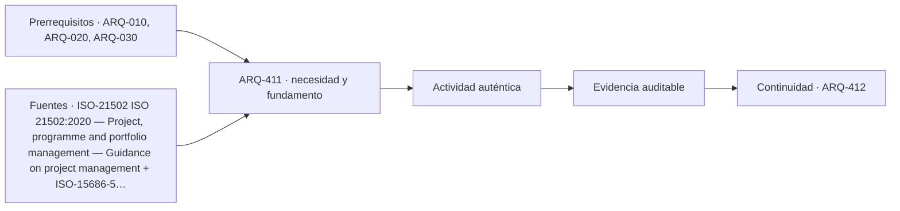

# ARQ-411 · Factibilidad técnica, territorial y económica

**Parte 42 · Clase desarrollada · Incorporada en v0.24.0.**

Prerrequisitos conceptuales: ARQ-010, ARQ-020, ARQ-030. Sin calendario. Material educativo; no constituye presupuesto contractual, certificación de obra, instrucción de seguridad ni habilitación profesional. Los casos, cantidades y costos son ficticios salvo antecedentes expresamente atribuidos. Revisión externa especializada pendiente.

## Pregunta central

¿Cómo decidir si una idea merece desarrollarse antes de confundir deseo, posibilidad física y conveniencia económica?

## Resultado y continuidad

ARQ-411 abre la Parte 42 y traslada los métodos anteriores a un caso económico y de gestión nuevo. Elaborarás un registro reproducible, resolverás un caso cuantitativo, contrastarás al menos una variante y cerrarás distinguiendo cálculo, evidencia, decisión y asunto pendiente.

## 1. Definir el problema y su frontera

Factibilidad no significa demostrar que el proyecto “funciona” en abstracto. Se separan al menos cuatro preguntas: si el sitio admite la intervención; si existe una solución técnica plausible; si los recursos y plazos pueden sostenerla; y si la organización tiene capacidad para operar el resultado. Cada pregunta necesita evidencias diferentes.

## 2. Variables que no deben confundirse

Una alternativa puede ser técnicamente posible y territorialmente inviable, o caber en el terreno pero requerir recursos que el mandante no puede sostener. Por eso la factibilidad es un filtro progresivo, no una maqueta preliminar con apariencia definitiva.

## 3. Trazabilidad y estados de información

Las incertidumbres se registran con impacto y siguiente acción. Un dato faltante no se reemplaza por cero. En etapas tempranas puede trabajarse con rangos, escenarios y reservas, siempre que quede visible qué decisión depende de cada supuesto.

## 4. Caso trabajado

Un centro vecinal ficticio considera tres opciones: A reutiliza 600 m² existentes por 420 unidades de costo; B construye 700 m² por 560; C arrienda un espacio equivalente por 72 unidades/año. El ejercicio usa horizonte de cinco años sin descuento para una primera criba: A=420+5×18=510; B=560+5×14=630; C=5×72=360. C tiene menor costo dentro de esa frontera, pero no se declara “mejor”: deben compararse disponibilidad, control del espacio, adecuación y continuidad del servicio.

## 5. Cómo comprobar el resultado

Una cuenta correcta debe poder reconstruirse por un segundo camino: conciliando totales, revisando unidades, comparando estado inicial y final o repitiendo el balance por componentes. Si una variante modifica una sola hipótesis, las demás permanecen constantes. Si cambia más de una, debe declararse; de lo contrario no puede atribuirse la diferencia a una única causa.

Cuando el resultado depende del tiempo, conserva el orden de los eventos. Un saldo final puede ser compatible con un déficit anterior, una demora o una capacidad excedida. Cuando depende del alcance, conserva qué está incluido y qué queda fuera. La profundidad consiste en explicar qué pregunta responde el número y cuál no.

## 6. Interfaces profesionales y documentos

El mismo problema suele cruzar arquitectura, especialidades, administración, construcción y operación. Cada actor necesita información compatible: geometría, cantidad, versión, requisito, fecha de corte o estado. Un archivo correcto de una disciplina puede ser insuficiente si utiliza una base distinta de la que usan las demás.

Por eso cada registro de clase incluye **objeto, fuente, versión, unidad, responsable, estado y decisión siguiente**. En proyectos reales, las responsabilidades provienen de contratos, regulación, organización y competencias profesionales; este material no las asigna universalmente.

## 7. Sensibilidad y escenarios

Una buena estimación muestra cómo cambia la conclusión cuando cambia una variable importante. No se necesita inventar una distribución probabilística. Basta definir escenarios coherentes, recalcular y explicar qué incertidumbre se está explorando.

Si dos escenarios producen conclusiones distintas, no es un fallo del análisis: indica que la decisión es sensible. Puede justificar obtener mejor información, conservar flexibilidad o establecer una condición antes de comprometer recursos.

*Figura 411. La secuencia resume relaciones del caso; no sustituye criterios técnicos, contractuales o normativos.*

## 8. Errores frecuentes

Evita usar porcentajes sin base, mezclar bruto y neto, considerar un dato ausente como cero, sumar máximos de estados incompatibles, tratar promedio como condición individual, cambiar versiones sin actualizar dependencias y convertir una hipótesis didáctica en criterio contractual o normativo.

Otro error es optimizar una sola dimensión. Menor costo no garantiza mismo servicio; mayor productividad no garantiza calidad; mayor capacidad de almacenamiento no resuelve un suministro tardío; más inspecciones no compensan un criterio ambiguo. El método siempre vuelve a la función y a la evidencia.

## 9. Práctica independiente

Construye una matriz para una biblioteca ficticia con tres alternativas. Usa cuatro criterios no ponderados: disponibilidad del sitio, compatibilidad técnica, costo de inversión y costo operativo. Deja al menos un dato como desconocido y explica qué decisión impide cerrar.

10. Solución razonada

Una respuesta correcta mantiene el desconocido y evita asignarle cero o una puntuación neutra. La matriz sirve para organizar evidencia; no convierte criterios necesarios en preferencias compensables.

La solución se limita a la frontera declarada. Para una obra real se deben verificar precios, rendimientos, contratos, legislación, condiciones de seguridad, medioambiente, ensayos y responsabilidades aplicables. Una referencia pública no sustituye el documento técnico completo cuando su consulta fue parcial.

## 11. Autoevaluación y transferencia

Antes de avanzar, comprueba que puedes: explicar la unidad y el denominador de cada cifra; reconstruir el balance; identificar una hipótesis que, si cambia, podría alterar la decisión; y nombrar al menos una evidencia que tendría que producir un actor competente. Si solo puedes repetir el resultado numérico, el aprendizaje está incompleto.

La clase siguiente conservará los métodos, no los números. Los casos se identifican para impedir que cantidades de un ejercicio aparezcan como datos de otra obra.

<!-- pedagogia-2026:inicio -->
## Decisión pedagógica y posición curricular

### Por qué existe

Esta clase existe para resolver una necesidad concreta del recorrido: ¿Cómo decidir si una idea merece desarrollarse antes de confundir deseo, posibilidad física y conveniencia económica?

### Por qué está exactamente aquí

Abre la Parte 42 porque plantea primero el problema «¿Cómo decidir si una idea merece desarrollarse antes de confundir deseo, posibilidad física y conveniencia económica?». La transición desde ARQ-410 · Documentos finales y evidencia de aceptación conserva métodos de evidencia y límites, pero no traslada parámetros del bloque anterior. Establece la pregunta y el producto base que ARQ-412 · Superficies útiles, construidas y criterios de medición desarrollará a continuación.

- **Prerrequisitos:** `ARQ-010`, `ARQ-020`, `ARQ-030`
- **Capacidad que introduce:** ARQ-411 abre la Parte 42 y traslada los métodos anteriores a un caso económico y de gestión nuevo. Elaborarás un registro reproducible, resolverás un caso cuantitativo, contrastarás al menos una variante y cerrarás distinguiendo cálculo, evidencia, decisión y asunto pendiente.
- **Clases o experiencias que dependen de ella:** `ARQ-412`

El diagrama permite comprobar una relación que el texto lineal oculta con facilidad: esta clase recibe capacidades previas, toma decisiones apoyadas por fuentes, exige una experiencia y produce evidencia que habilita trabajo posterior. No representa un procedimiento de obra.

## Resultado observable, evidencia y evaluación

1. Identificar y delimitar las condiciones necesarias para responder la pregunta central de factibilidad técnica, territorial y económica.
2. Producir y comprobar la evidencia declarada por la clase: ARQ-411 abre la Parte 42 y traslada los métodos anteriores a un caso económico y de gestión nuevo. Elaborarás un registro reproducible, resolverás un caso cuantitativo, contrastarás al menos una variante y cerrarás distinguiendo cálculo, evidencia, decisión y asunto pendiente.
3. Justificar una decisión de factibilidad técnica, territorial y económica mediante fuentes, supuestos, alternativas y límites explícitos.

## Actividad, evidencia y criterio de aceptación

**Actividad:** Construye una matriz para una biblioteca ficticia con tres alternativas. Usa cuatro criterios no ponderados: disponibilidad del sitio, compatibilidad técnica, costo de inversión y costo operativo. Deja al menos un dato como desconocido y explica qué decisión impide cerrar.

**Evidencia mínima:** ARQ-411 abre la Parte 42 y traslada los métodos anteriores a un caso económico y de gestión nuevo. Elaborarás un registro reproducible, resolverás un caso cuantitativo, contrastarás al menos una variante y cerrarás distinguiendo cálculo, evidencia, decisión y asunto pendiente.

**Archivo sugerido:** `evidence/ARQ-411/evidencia.md`.

**Criterio de aceptación:** la entrega se acepta cuando:

- La entrega responde explícitamente a la pregunta: ¿Cómo decidir si una idea merece desarrollarse antes de confundir deseo, posibilidad física y conveniencia económica?
- La actividad conserva las fronteras del caso y permite reconstruir el procedimiento: Construye una matriz para una biblioteca ficticia con tres alternativas. Usa cuatro criterios no ponderados: disponibilidad del sitio, compatibilidad técnica, costo de inversión y costo operativo. Deja al menos un dato como desconocido y explica qué decisión impide cerrar.
- Cada afirmación externa puede seguirse hasta una fuente, su alcance consultado y su límite.
- La evidencia deja disponible una entrada comprobable para ARQ-412.
- Evita usar porcentajes sin base, mezclar bruto y neto, considerar un dato ausente como cero, sumar máximos de estados incompatibles, tratar promedio como condición individual, cambiar versiones sin actualizar dependencias y convertir una hipótesis didáctica en criterio contractual o normativo. Otro error es optimizar una sola dimensión.

La [rúbrica común](../../docs/RUBRICA_COMUN.md) complementa estos criterios; no los reemplaza. Una entrega puede superar un promedio y continuar pendiente si oculta una condición crítica.

## Trazabilidad de las decisiones

| # | Decisión o fundamento | Fuente utilizada | Aplicación y límite en esta clase |
|---:|---|---|---|
| 1 | Marco de gestión de proyectos y relación entre prácticas, ciclo de vida y entregables. | [ISO-21502 ISO 21502:2020 — Project, programme and portfolio management…](https://www.iso.org/standard/74947.html) | Consulta: Ficha pública; edición 1 publicada 2020-12, actualmente en revisión sistemática. Límite: No se leyó íntegramente la norma; no se reproducen procesos ni se presenta como contrato o metodología obligatoria. |
| 2 | Alcance del costo de ciclo de vida y definición del período y límites del análisis. | [ISO-15686-5 ISO 15686-5:2017 — Buildings and constructed assets —…](https://www.iso.org/standard/61148.html) | Consulta: Ficha pública y resumen; edición 2017, confirmación indicada en 2024. Límite: No se leyó el texto completo ni se aplican cláusulas, tasas financieras o requisitos legales por citar la ficha. |
| 3 | Sistema de gestión de calidad; edición publicada y ámbito general | [ISO-9001 ISO 9001:2026 — Quality management systems — Requirements](https://www.iso.org/standard/9001) | Consulta: Ficha pública; publicación 16-09-2026 Límite: Texto normativo íntegro no adquirido; no se inventan cláusulas ni plazos universales de transición de certificación. |

La tabla permite auditar las relaciones; la explicación, el caso y la práctica de la clase siguen siendo la documentación principal.

## Autoevaluación, recuperación y continuidad

### Errores diagnósticos

Antes de avanzar, comprueba si puedes reconstruir cada resultado sin mirar la solución, señalar qué evidencia lo sostiene y nombrar una condición que obligaría a revisar tu decisión. Conserva la primera versión, la objeción recibida y la revisión.

**Conexión siguiente:** La continuidad inmediata es ARQ-412 · Superficies útiles, construidas y criterios de medición; conserva el método y vuelve a verificar datos y límites.
<!-- pedagogia-2026:fin -->

## Fuentes y alcance de uso

### [[ISO-21502]](#FUENTE-ISO-21502) ISO 21502:2020 — Project, programme and portfolio management — Guidance on project management

ISO. [https://www.iso.org/standard/74947.html](https://www.iso.org/standard/74947.html)

**Consulta:** Ficha pública; edición 1 publicada 2020-12, actualmente en revisión sistemática. **Apoyo:** Marco de gestión de proyectos y relación entre prácticas, ciclo de vida y entregables. **Límite:** No se leyó íntegramente la norma; no se reproducen procesos ni se presenta como contrato o metodología obligatoria.

### [[ISO-15686-5]](#FUENTE-ISO-15686-5) ISO 15686-5:2017 — Buildings and constructed assets — Service life planning — Part 5: Life-cycle costing

International Organization for Standardization. [https://www.iso.org/standard/61148.html](https://www.iso.org/standard/61148.html)

**Consulta:** Ficha pública y resumen; edición 2017, confirmación indicada en 2024. **Apoyo:** Alcance del costo de ciclo de vida y definición del período y límites del análisis. **Límite:** No se leyó el texto completo ni se aplican cláusulas, tasas financieras o requisitos legales por citar la ficha.

### [[ISO-9001]](#FUENTE-ISO-9001) ISO 9001:2026 — Quality management systems — Requirements

ISO. [https://www.iso.org/standard/9001](https://www.iso.org/standard/9001)

**Consulta:** Ficha pública; publicación 16-09-2026 **Apoyo:** Sistema de gestión de calidad; edición publicada y ámbito general **Límite:** Texto normativo íntegro no adquirido; no se inventan cláusulas ni plazos universales de transición de certificación.
