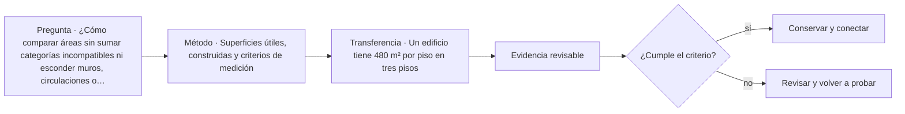

# ARQ-412 · Superficies útiles, construidas y criterios de medición

**Parte 42 · Clase desarrollada · Incorporada en v0.24.0.**

Prerrequisitos conceptuales: ARQ-411. Sin calendario. Material educativo; no constituye presupuesto contractual, certificación de obra, instrucción de seguridad ni habilitación profesional. Los casos, cantidades y costos son ficticios salvo antecedentes expresamente atribuidos. Revisión externa especializada pendiente.

## Pregunta central

¿Cómo comparar áreas sin sumar categorías incompatibles ni esconder muros, circulaciones o vacíos dentro del mismo número?

## Resultado y continuidad

Recibe ARQ-411 y conserva sus definiciones; los parámetros nuevos se identifican explícitamente y no reescriben el caso anterior. Elaborarás un registro reproducible, resolverás un caso cuantitativo, contrastarás al menos una variante y cerrarás distinguiendo cálculo, evidencia, decisión y asunto pendiente.

## 1. Definir el problema y su frontera

“Metros cuadrados” no es una categoría suficiente. Superficie útil, programática, circulaciones, construcción, cubierta, ocupación de suelo y pisos construidos responden a fronteras diferentes. Antes de medir se declara qué caras, niveles y exclusiones forman parte del cálculo.

## 2. Variables que no deben confundirse

Una cifra puede ser correcta y aun no ser comparable. Dos equipos pueden llamar “útil” a áreas distintas si uno incluye almacenamiento o tabiques y otro no. La primera comprobación es semántica: misma definición antes de misma unidad.

## 3. Trazabilidad y estados de información

Las mediciones también deben conservar versión del plano. Una modificación geométrica obliga a recalcular las superficies dependientes; actualizar solo el total de portada produce inconsistencias silenciosas.

## 4. Caso trabajado

Una planta ficticia ocupa 20×15=300 m². Dentro de ella hay 210 m² programáticos, 54 de circulación y 36 de muros y shafts. La suma cierra 300. Si una remodelación absorbe 12 m² de circulación para programa, el total construido sigue 300 pero programa pasa a 222 y circulación a 42. No se anuncia un “aumento de edificio” de 12 m².

## 5. Cómo comprobar el resultado

Una cuenta correcta debe poder reconstruirse por un segundo camino: conciliando totales, revisando unidades, comparando estado inicial y final o repitiendo el balance por componentes. Si una variante modifica una sola hipótesis, las demás permanecen constantes. Si cambia más de una, debe declararse; de lo contrario no puede atribuirse la diferencia a una única causa.

Cuando el resultado depende del tiempo, conserva el orden de los eventos. Un saldo final puede ser compatible con un déficit anterior, una demora o una capacidad excedida. Cuando depende del alcance, conserva qué está incluido y qué queda fuera. La profundidad consiste en explicar qué pregunta responde el número y cuál no.

## 6. Interfaces profesionales y documentos

El mismo problema suele cruzar arquitectura, especialidades, administración, construcción y operación. Cada actor necesita información compatible: geometría, cantidad, versión, requisito, fecha de corte o estado. Un archivo correcto de una disciplina puede ser insuficiente si utiliza una base distinta de la que usan las demás.

Por eso cada registro de clase incluye **objeto, fuente, versión, unidad, responsable, estado y decisión siguiente**. En proyectos reales, las responsabilidades provienen de contratos, regulación, organización y competencias profesionales; este material no las asigna universalmente.

## 7. Sensibilidad y escenarios

Una buena estimación muestra cómo cambia la conclusión cuando cambia una variable importante. No se necesita inventar una distribución probabilística. Basta definir escenarios coherentes, recalcular y explicar qué incertidumbre se está explorando.

Si dos escenarios producen conclusiones distintas, no es un fallo del análisis: indica que la decisión es sensible. Puede justificar obtener mejor información, conservar flexibilidad o establecer una condición antes de comprometer recursos.

*Figura 412. La secuencia resume relaciones del caso; no sustituye criterios técnicos, contractuales o normativos.*

## 8. Errores frecuentes

Evita usar porcentajes sin base, mezclar bruto y neto, considerar un dato ausente como cero, sumar máximos de estados incompatibles, tratar promedio como condición individual, cambiar versiones sin actualizar dependencias y convertir una hipótesis didáctica en criterio contractual o normativo.

Otro error es optimizar una sola dimensión. Menor costo no garantiza mismo servicio; mayor productividad no garantiza calidad; mayor capacidad de almacenamiento no resuelve un suministro tardío; más inspecciones no compensan un criterio ambiguo. El método siempre vuelve a la función y a la evidencia.

## 9. Práctica independiente

Un edificio tiene 480 m² por piso en tres pisos. En cada piso: 330 programáticos, 90 circulación y 60 construcción. Calcula totales por categoría y explica por qué 1.440 m² de pisos no es necesariamente la superficie del terreno.

10. Solución razonada

Los totales son 990, 270 y 180 m²; suman 1.440. La huella del edificio es 480 m² si los pisos coinciden en proyección, pero la superficie del terreno requiere otra frontera y otros datos.

La solución se limita a la frontera declarada. Para una obra real se deben verificar precios, rendimientos, contratos, legislación, condiciones de seguridad, medioambiente, ensayos y responsabilidades aplicables. Una referencia pública no sustituye el documento técnico completo cuando su consulta fue parcial.

## 11. Autoevaluación y transferencia

Antes de avanzar, comprueba que puedes: explicar la unidad y el denominador de cada cifra; reconstruir el balance; identificar una hipótesis que, si cambia, podría alterar la decisión; y nombrar al menos una evidencia que tendría que producir un actor competente. Si solo puedes repetir el resultado numérico, el aprendizaje está incompleto.

La clase siguiente conservará los métodos, no los números. Los casos se identifican para impedir que cantidades de un ejercicio aparezcan como datos de otra obra.

<!-- pedagogia-2026:inicio -->
## Mapa visual de aprendizaje

El diagrama representa el ciclo de aprendizaje de esta clase, no una secuencia de obra ni un procedimiento profesional.

## Resultado observable, evidencia y evaluación

**Tipo de clase:** cuantitativa.

**Evidencia mínima:** desarrollo reproducible con datos, unidades, hipótesis, control independiente y conclusión limitada al modelo.

**Archivo sugerido:** `evidence/ARQ-412/evidencia.md`.

| Criterio | Evidencia observable |
|---|---|
| Precisión y representación · 20 % | Los conceptos, unidades y convenciones se usan de forma coherente y pueden ser reconstruidos por otra persona. |
| Evidencia y trazabilidad · 25 % | Cada afirmación importante se vincula con dato, cálculo, observación o fuente; hipótesis y desconocidos permanecen visibles. |
| Decisión y alternativas · 25 % | La decisión responde a la pregunta, compara al menos una alternativa y declara qué condición la haría cambiar. |
| Integración y ciclo de vida · 20 % | Se identifica una interfaz y una consecuencia para construcción, uso, mantenimiento, adaptación o fin de vida. |
| Comunicación, ética y límites · 10 % | El alcance se entiende sin explicación oral adicional y no se atribuyen permisos, competencias o certezas inexistentes. |

**Criterio de aceptación:** 80/100 y ningún criterio bajo 60 %. Una entrega genérica que podría reutilizarse sin cambios en otra clase no demuestra dominio. Si existe una condición crítica de seguridad, accesibilidad, evidencia o responsabilidad sin resolver, la entrega permanece pendiente aunque el promedio supere 80.

### Errores diagnósticos

En esta clase conviene vigilar especialmente: perder unidades; ocultar hipótesis; redondear antes de tiempo; convertir el resultado del modelo en autorización.

## Autoevaluación, recuperación y continuidad

Antes de avanzar, responde sin consultar la solución:

1. ¿Qué decisión concreta puedes tomar ahora que no podías justificar antes?
2. ¿Qué evidencia de tu entrega es comprobada y cuál continúa siendo una hipótesis?
3. ¿Qué cambio de contexto invalidaría la transferencia realizada?

Revisa la entrega a las 24–48 horas y nuevamente al cerrar la parte. Conserva la primera versión, la crítica recibida y la versión revisada: el aprendizaje se demuestra también mediante el cambio entre versiones.
<!-- pedagogia-2026:fin -->

## Fuentes y alcance de uso

### [[ISO-21502]](#FUENTE-ISO-21502) ISO 21502:2020 — Project, programme and portfolio management — Guidance on project management

ISO. [https://www.iso.org/standard/74947.html](https://www.iso.org/standard/74947.html)

**Consulta:** Ficha pública; edición 1 publicada 2020-12, actualmente en revisión sistemática. **Apoyo:** Marco de gestión de proyectos y relación entre prácticas, ciclo de vida y entregables. **Límite:** No se leyó íntegramente la norma; no se reproducen procesos ni se presenta como contrato o metodología obligatoria.

### [[ISO-9001]](#FUENTE-ISO-9001) ISO 9001:2026 — Quality management systems — Requirements

ISO. [https://www.iso.org/standard/9001](https://www.iso.org/standard/9001)

**Consulta:** Ficha pública; publicación 16-09-2026 **Apoyo:** Sistema de gestión de calidad; edición publicada y ámbito general **Límite:** Texto normativo íntegro no adquirido; no se inventan cláusulas ni plazos universales de transición de certificación.
