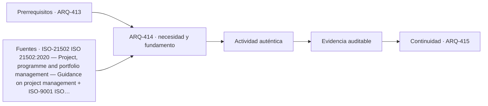

# ARQ-414 · Precios unitarios y rendimientos: estructura conceptual

**Parte 42 · Clase desarrollada · Incorporada en v0.24.0.**

Prerrequisitos conceptuales: ARQ-413. Sin calendario. Material educativo; no constituye presupuesto contractual, certificación de obra, instrucción de seguridad ni habilitación profesional. Los casos, cantidades y costos son ficticios salvo antecedentes expresamente atribuidos. Revisión externa especializada pendiente.

## Pregunta central

¿Cómo construir un precio unitario sin ocultar cantidades, productividades, unidades y condiciones detrás de un solo valor?

## Resultado y continuidad

Recibe ARQ-413 y conserva sus definiciones; los parámetros nuevos se identifican explícitamente y no reescriben el caso anterior. Elaborarás un registro reproducible, resolverás un caso cuantitativo, contrastarás al menos una variante y cerrarás distinguiendo cálculo, evidencia, decisión y asunto pendiente.

## 1. Definir el problema y su frontera

Un análisis de precio unitario es una composición: materiales, mano de obra, equipos y otros recursos se relacionan con una unidad de resultado. El precio final depende tanto de precios de recursos como de rendimientos y condiciones adoptadas.

## 2. Variables que no deben confundirse

Rendimiento puede expresarse como producción por tiempo o recurso por unidad. Invertirlo sin revisar unidades es una fuente común de errores. La productividad observada en una condición no se transporta automáticamente a otra cuadrilla, geometría o secuencia.

## 3. Trazabilidad y estados de información

El APU educativo debe conservar origen de cada dato y fecha. Cotización, salario, rendimiento y factor de uso pueden cambiar a ritmos diferentes; un “precio actualizado” no se obtiene multiplicando el total antiguo por un porcentaje arbitrario si la composición cambió.

## 4. Caso trabajado

Para 1 m² de terminación ficticia se requieren 1,05 unidades de material a 18 cada una; 0,25 h de oficial a 24/h; y 0,10 h de equipo a 30/h. Costo directo unitario=18,90+6+3=27,90. Si el rendimiento laboral empeora a 0,35 h/m², el costo pasa a 30,30; no cambió el precio del material.

## 5. Cómo comprobar el resultado

Una cuenta correcta debe poder reconstruirse por un segundo camino: conciliando totales, revisando unidades, comparando estado inicial y final o repitiendo el balance por componentes. Si una variante modifica una sola hipótesis, las demás permanecen constantes. Si cambia más de una, debe declararse; de lo contrario no puede atribuirse la diferencia a una única causa.

Cuando el resultado depende del tiempo, conserva el orden de los eventos. Un saldo final puede ser compatible con un déficit anterior, una demora o una capacidad excedida. Cuando depende del alcance, conserva qué está incluido y qué queda fuera. La profundidad consiste en explicar qué pregunta responde el número y cuál no.

## 6. Interfaces profesionales y documentos

El mismo problema suele cruzar arquitectura, especialidades, administración, construcción y operación. Cada actor necesita información compatible: geometría, cantidad, versión, requisito, fecha de corte o estado. Un archivo correcto de una disciplina puede ser insuficiente si utiliza una base distinta de la que usan las demás.

Por eso cada registro de clase incluye **objeto, fuente, versión, unidad, responsable, estado y decisión siguiente**. En proyectos reales, las responsabilidades provienen de contratos, regulación, organización y competencias profesionales; este material no las asigna universalmente.

## 7. Sensibilidad y escenarios

Una buena estimación muestra cómo cambia la conclusión cuando cambia una variable importante. No se necesita inventar una distribución probabilística. Basta definir escenarios coherentes, recalcular y explicar qué incertidumbre se está explorando.

Si dos escenarios producen conclusiones distintas, no es un fallo del análisis: indica que la decisión es sensible. Puede justificar obtener mejor información, conservar flexibilidad o establecer una condición antes de comprometer recursos.

*Figura 414. La secuencia resume relaciones del caso; no sustituye criterios técnicos, contractuales o normativos.*

## 8. Errores frecuentes

Evita usar porcentajes sin base, mezclar bruto y neto, considerar un dato ausente como cero, sumar máximos de estados incompatibles, tratar promedio como condición individual, cambiar versiones sin actualizar dependencias y convertir una hipótesis didáctica en criterio contractual o normativo.

Otro error es optimizar una sola dimensión. Menor costo no garantiza mismo servicio; mayor productividad no garantiza calidad; mayor capacidad de almacenamiento no resuelve un suministro tardío; más inspecciones no compensan un criterio ambiguo. El método siempre vuelve a la función y a la evidencia.

## 9. Práctica independiente

Construye un APU para una actividad ficticia con dos materiales, una categoría de mano de obra y un equipo. Luego aumenta solo el consumo de uno de los materiales en 10 % y recalcula.

10. Solución razonada

La respuesta debe mostrar cantidades×precios por separado, sumar subtotales y modificar únicamente el componente cuyo consumo cambió. El porcentaje de aumento del APU será menor que 10 % salvo que ese material represente todo el costo.

La solución se limita a la frontera declarada. Para una obra real se deben verificar precios, rendimientos, contratos, legislación, condiciones de seguridad, medioambiente, ensayos y responsabilidades aplicables. Una referencia pública no sustituye el documento técnico completo cuando su consulta fue parcial.

## 11. Autoevaluación y transferencia

Antes de avanzar, comprueba que puedes: explicar la unidad y el denominador de cada cifra; reconstruir el balance; identificar una hipótesis que, si cambia, podría alterar la decisión; y nombrar al menos una evidencia que tendría que producir un actor competente. Si solo puedes repetir el resultado numérico, el aprendizaje está incompleto.

La clase siguiente conservará los métodos, no los números. Los casos se identifican para impedir que cantidades de un ejercicio aparezcan como datos de otra obra.

<!-- pedagogia-2026:inicio -->
## Decisión pedagógica y posición curricular

### Por qué existe

Esta clase existe para resolver una necesidad concreta del recorrido: ¿Cómo construir un precio unitario sin ocultar cantidades, productividades, unidades y condiciones detrás de un solo valor?

### Por qué está exactamente aquí

Ocupa el lugar 4 de la Parte 42. Se estudia después de ARQ-413 · Cubicaciones y cantidades de obra porque usa esa base para responder «¿Cómo construir un precio unitario sin ocultar cantidades, productividades, unidades y condiciones detrás de un solo valor?». Se ubica antes de ARQ-415 · Costos directos, indirectos y contingencias porque la evidencia producida aquí debe estar disponible para ese paso.

- **Prerrequisitos:** `ARQ-413`
- **Capacidad que introduce:** Recibe ARQ-413 y conserva sus definiciones; los parámetros nuevos se identifican explícitamente y no reescriben el caso anterior. Elaborarás un registro reproducible, resolverás un caso cuantitativo, contrastarás al menos una variante y cerrarás distinguiendo cálculo, evidencia, decisión y asunto pendiente.
- **Clases o experiencias que dependen de ella:** `ARQ-415`

El diagrama permite comprobar una relación que el texto lineal oculta con facilidad: esta clase recibe capacidades previas, toma decisiones apoyadas por fuentes, exige una experiencia y produce evidencia que habilita trabajo posterior. No representa un procedimiento de obra.

## Resultado observable, evidencia y evaluación

1. Identificar y delimitar las condiciones necesarias para responder la pregunta central de precios unitarios y rendimientos: estructura conceptual.
2. Producir y comprobar la evidencia declarada por la clase: Recibe ARQ-413 y conserva sus definiciones; los parámetros nuevos se identifican explícitamente y no reescriben el caso anterior. Elaborarás un registro reproducible, resolverás un caso cuantitativo, contrastarás al menos una variante y cerrarás distinguiendo cálculo, evidencia, decisión y asunto pendiente.
3. Justificar una decisión de precios unitarios y rendimientos: estructura conceptual mediante fuentes, supuestos, alternativas y límites explícitos.

## Actividad, evidencia y criterio de aceptación

**Actividad:** Construye un APU para una actividad ficticia con dos materiales, una categoría de mano de obra y un equipo. Luego aumenta solo el consumo de uno de los materiales en 10 % y recalcula.

**Evidencia mínima:** Recibe ARQ-413 y conserva sus definiciones; los parámetros nuevos se identifican explícitamente y no reescriben el caso anterior. Elaborarás un registro reproducible, resolverás un caso cuantitativo, contrastarás al menos una variante y cerrarás distinguiendo cálculo, evidencia, decisión y asunto pendiente.

**Archivo sugerido:** `evidence/ARQ-414/evidencia.md`.

**Criterio de aceptación:** la entrega se acepta cuando:

- La entrega responde explícitamente a la pregunta: ¿Cómo construir un precio unitario sin ocultar cantidades, productividades, unidades y condiciones detrás de un solo valor?
- La actividad conserva las fronteras del caso y permite reconstruir el procedimiento: Construye un APU para una actividad ficticia con dos materiales, una categoría de mano de obra y un equipo. Luego aumenta solo el consumo de uno de los materiales en 10 % y recalcula.
- Cada afirmación externa puede seguirse hasta una fuente, su alcance consultado y su límite.
- La evidencia deja disponible una entrada comprobable para ARQ-415.
- Evita usar porcentajes sin base, mezclar bruto y neto, considerar un dato ausente como cero, sumar máximos de estados incompatibles, tratar promedio como condición individual, cambiar versiones sin actualizar dependencias y convertir una hipótesis didáctica en criterio contractual o normativo. Otro error es optimizar una sola dimensión.

La [rúbrica común](../../docs/RUBRICA_COMUN.md) complementa estos criterios; no los reemplaza. Una entrega puede superar un promedio y continuar pendiente si oculta una condición crítica.

## Trazabilidad de las decisiones

| # | Decisión o fundamento | Fuente utilizada | Aplicación y límite en esta clase |
|---:|---|---|---|
| 1 | Marco de gestión de proyectos y relación entre prácticas, ciclo de vida y entregables. | [ISO-21502 ISO 21502:2020 — Project, programme and portfolio management…](https://www.iso.org/standard/74947.html) | Consulta: Ficha pública; edición 1 publicada 2020-12, actualmente en revisión sistemática. Límite: No se leyó íntegramente la norma; no se reproducen procesos ni se presenta como contrato o metodología obligatoria. |
| 2 | Sistema de gestión de calidad; edición publicada y ámbito general | [ISO-9001 ISO 9001:2026 — Quality management systems — Requirements](https://www.iso.org/standard/9001) | Consulta: Ficha pública; publicación 16-09-2026 Límite: Texto normativo íntegro no adquirido; no se inventan cláusulas ni plazos universales de transición de certificación. |

La tabla permite auditar las relaciones; la explicación, el caso y la práctica de la clase siguen siendo la documentación principal.

## Autoevaluación, recuperación y continuidad

### Errores diagnósticos

Antes de avanzar, comprueba si puedes reconstruir cada resultado sin mirar la solución, señalar qué evidencia lo sostiene y nombrar una condición que obligaría a revisar tu decisión. Conserva la primera versión, la objeción recibida y la revisión.

**Conexión siguiente:** La continuidad inmediata es ARQ-415 · Costos directos, indirectos y contingencias; conserva el método y vuelve a verificar datos y límites.
<!-- pedagogia-2026:fin -->

## Fuentes y alcance de uso

### [[ISO-21502]](#FUENTE-ISO-21502) ISO 21502:2020 — Project, programme and portfolio management — Guidance on project management

ISO. [https://www.iso.org/standard/74947.html](https://www.iso.org/standard/74947.html)

**Consulta:** Ficha pública; edición 1 publicada 2020-12, actualmente en revisión sistemática. **Apoyo:** Marco de gestión de proyectos y relación entre prácticas, ciclo de vida y entregables. **Límite:** No se leyó íntegramente la norma; no se reproducen procesos ni se presenta como contrato o metodología obligatoria.

### [[ISO-9001]](#FUENTE-ISO-9001) ISO 9001:2026 — Quality management systems — Requirements

ISO. [https://www.iso.org/standard/9001](https://www.iso.org/standard/9001)

**Consulta:** Ficha pública; publicación 16-09-2026 **Apoyo:** Sistema de gestión de calidad; edición publicada y ámbito general **Límite:** Texto normativo íntegro no adquirido; no se inventan cláusulas ni plazos universales de transición de certificación.
