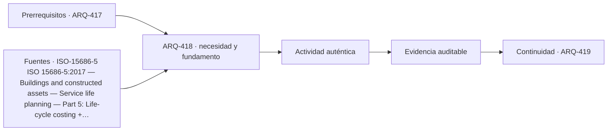

# ARQ-418 · Costo de ciclo de vida y mantenimiento

**Parte 42 · Clase desarrollada · Incorporada en v0.24.0.**

Prerrequisitos conceptuales: ARQ-417. Sin calendario. Material educativo; no constituye presupuesto contractual, certificación de obra, instrucción de seguridad ni habilitación profesional. Los casos, cantidades y costos son ficticios salvo antecedentes expresamente atribuidos. Revisión externa especializada pendiente.

## Pregunta central

¿Cómo comparar alternativas cuando inversión, operación, reposiciones y disposición ocurren en momentos diferentes?

## Resultado y continuidad

Recibe ARQ-417 y conserva sus definiciones; los parámetros nuevos se identifican explícitamente y no reescriben el caso anterior. Elaborarás un registro reproducible, resolverás un caso cuantitativo, contrastarás al menos una variante y cerrarás distinguiendo cálculo, evidencia, decisión y asunto pendiente.

## 1. Definir el problema y su frontera

El costo de ciclo de vida necesita alcance temporal, servicio equivalente y flujos definidos. La inversión inicial es solo una parte. Mantenimiento, operación, reemplazos y fin de vida pueden cambiar la comparación.

## 2. Variables que no deben confundirse

El descuento financiero transforma valores futuros a una referencia temporal mediante una tasa adoptada. Esa tasa no debe confundirse con inflación, rentabilidad o deterioro físico. El ejercicio explicita la convención y realiza sensibilidad.

## 3. Trazabilidad y estados de información

Una vida útil supuesta necesita evidencia. Extenderla para mejorar una alternativa sin justificar mantenimiento o exposición es tan problemático como omitir una reposición conocida.

## 4. Caso trabajado

Alternativa A: 1.000 inicial + 400 en año 10. B: 1.250 inicial sin reposición en 15 años. Con tasa ficticia 4 %, valor presente de la reposición A=400/(1,04)^10≈270,2; A≈1.270,2 y B=1.250. Sin descuento A=1.400. La conclusión depende de frontera y tasa.

## 5. Cómo comprobar el resultado

Una cuenta correcta debe poder reconstruirse por un segundo camino: conciliando totales, revisando unidades, comparando estado inicial y final o repitiendo el balance por componentes. Si una variante modifica una sola hipótesis, las demás permanecen constantes. Si cambia más de una, debe declararse; de lo contrario no puede atribuirse la diferencia a una única causa.

Cuando el resultado depende del tiempo, conserva el orden de los eventos. Un saldo final puede ser compatible con un déficit anterior, una demora o una capacidad excedida. Cuando depende del alcance, conserva qué está incluido y qué queda fuera. La profundidad consiste en explicar qué pregunta responde el número y cuál no.

## 6. Interfaces profesionales y documentos

El mismo problema suele cruzar arquitectura, especialidades, administración, construcción y operación. Cada actor necesita información compatible: geometría, cantidad, versión, requisito, fecha de corte o estado. Un archivo correcto de una disciplina puede ser insuficiente si utiliza una base distinta de la que usan las demás.

Por eso cada registro de clase incluye **objeto, fuente, versión, unidad, responsable, estado y decisión siguiente**. En proyectos reales, las responsabilidades provienen de contratos, regulación, organización y competencias profesionales; este material no las asigna universalmente.

## 7. Sensibilidad y escenarios

Una buena estimación muestra cómo cambia la conclusión cuando cambia una variable importante. No se necesita inventar una distribución probabilística. Basta definir escenarios coherentes, recalcular y explicar qué incertidumbre se está explorando.

Si dos escenarios producen conclusiones distintas, no es un fallo del análisis: indica que la decisión es sensible. Puede justificar obtener mejor información, conservar flexibilidad o establecer una condición antes de comprometer recursos.

*Figura 418. La secuencia resume relaciones del caso; no sustituye criterios técnicos, contractuales o normativos.*

## 8. Errores frecuentes

Evita usar porcentajes sin base, mezclar bruto y neto, considerar un dato ausente como cero, sumar máximos de estados incompatibles, tratar promedio como condición individual, cambiar versiones sin actualizar dependencias y convertir una hipótesis didáctica en criterio contractual o normativo.

Otro error es optimizar una sola dimensión. Menor costo no garantiza mismo servicio; mayor productividad no garantiza calidad; mayor capacidad de almacenamiento no resuelve un suministro tardío; más inspecciones no compensan un criterio ambiguo. El método siempre vuelve a la función y a la evidencia.

## 9. Práctica independiente

Compara C=900 inicial +300 en año 8 y D=1.100 inicial, horizonte 12 años, tasa 3 %. No incluyas operación común.

10. Solución razonada

VP reposición≈300/(1,03)^8≈236,8; C≈1.136,8; D=1.100. La diferencia no demuestra superioridad global porque el alcance excluye otras partidas y la vida útil está supuesta.

La solución se limita a la frontera declarada. Para una obra real se deben verificar precios, rendimientos, contratos, legislación, condiciones de seguridad, medioambiente, ensayos y responsabilidades aplicables. Una referencia pública no sustituye el documento técnico completo cuando su consulta fue parcial.

## 11. Autoevaluación y transferencia

Antes de avanzar, comprueba que puedes: explicar la unidad y el denominador de cada cifra; reconstruir el balance; identificar una hipótesis que, si cambia, podría alterar la decisión; y nombrar al menos una evidencia que tendría que producir un actor competente. Si solo puedes repetir el resultado numérico, el aprendizaje está incompleto.

La clase siguiente conservará los métodos, no los números. Los casos se identifican para impedir que cantidades de un ejercicio aparezcan como datos de otra obra.

<!-- pedagogia-2026:inicio -->
## Decisión pedagógica y posición curricular

### Por qué existe

Esta clase existe para resolver una necesidad concreta del recorrido: ¿Cómo comparar alternativas cuando inversión, operación, reposiciones y disposición ocurren en momentos diferentes?

### Por qué está exactamente aquí

Ocupa el lugar 8 de la Parte 42. Se estudia después de ARQ-417 · Comparación de ofertas y cambios de alcance porque usa esa base para responder «¿Cómo comparar alternativas cuando inversión, operación, reposiciones y disposición ocurren en momentos diferentes?». Se ubica antes de ARQ-419 · Valor, asequibilidad y economía social porque la evidencia producida aquí debe estar disponible para ese paso.

- **Prerrequisitos:** `ARQ-417`
- **Capacidad que introduce:** Recibe ARQ-417 y conserva sus definiciones; los parámetros nuevos se identifican explícitamente y no reescriben el caso anterior. Elaborarás un registro reproducible, resolverás un caso cuantitativo, contrastarás al menos una variante y cerrarás distinguiendo cálculo, evidencia, decisión y asunto pendiente.
- **Clases o experiencias que dependen de ella:** `ARQ-419`

El diagrama permite comprobar una relación que el texto lineal oculta con facilidad: esta clase recibe capacidades previas, toma decisiones apoyadas por fuentes, exige una experiencia y produce evidencia que habilita trabajo posterior. No representa un procedimiento de obra.

## Resultado observable, evidencia y evaluación

1. Identificar y delimitar las condiciones necesarias para responder la pregunta central de costo de ciclo de vida y mantenimiento.
2. Producir y comprobar la evidencia declarada por la clase: Recibe ARQ-417 y conserva sus definiciones; los parámetros nuevos se identifican explícitamente y no reescriben el caso anterior. Elaborarás un registro reproducible, resolverás un caso cuantitativo, contrastarás al menos una variante y cerrarás distinguiendo cálculo, evidencia, decisión y asunto pendiente.
3. Justificar una decisión de costo de ciclo de vida y mantenimiento mediante fuentes, supuestos, alternativas y límites explícitos.

## Actividad, evidencia y criterio de aceptación

**Actividad:** Compara C=900 inicial +300 en año 8 y D=1.100 inicial, horizonte 12 años, tasa 3 %. No incluyas operación común.

**Evidencia mínima:** Recibe ARQ-417 y conserva sus definiciones; los parámetros nuevos se identifican explícitamente y no reescriben el caso anterior. Elaborarás un registro reproducible, resolverás un caso cuantitativo, contrastarás al menos una variante y cerrarás distinguiendo cálculo, evidencia, decisión y asunto pendiente.

**Archivo sugerido:** `evidence/ARQ-418/evidencia.md`.

**Criterio de aceptación:** la entrega se acepta cuando:

- La entrega responde explícitamente a la pregunta: ¿Cómo comparar alternativas cuando inversión, operación, reposiciones y disposición ocurren en momentos diferentes?
- La actividad conserva las fronteras del caso y permite reconstruir el procedimiento: Compara C=900 inicial +300 en año 8 y D=1.100 inicial, horizonte 12 años, tasa 3 %. No incluyas operación común.
- Cada afirmación externa puede seguirse hasta una fuente, su alcance consultado y su límite.
- La evidencia deja disponible una entrada comprobable para ARQ-419.
- Evita usar porcentajes sin base, mezclar bruto y neto, considerar un dato ausente como cero, sumar máximos de estados incompatibles, tratar promedio como condición individual, cambiar versiones sin actualizar dependencias y convertir una hipótesis didáctica en criterio contractual o normativo. Otro error es optimizar una sola dimensión.

La [rúbrica común](../../docs/RUBRICA_COMUN.md) complementa estos criterios; no los reemplaza. Una entrega puede superar un promedio y continuar pendiente si oculta una condición crítica.

## Trazabilidad de las decisiones

| # | Decisión o fundamento | Fuente utilizada | Aplicación y límite en esta clase |
|---:|---|---|---|
| 1 | Alcance del costo de ciclo de vida y definición del período y límites del análisis. | [ISO-15686-5 ISO 15686-5:2017 — Buildings and constructed assets —…](https://www.iso.org/standard/61148.html) | Consulta: Ficha pública y resumen; edición 2017, confirmación indicada en 2024. Límite: No se leyó el texto completo ni se aplican cláusulas, tasas financieras o requisitos legales por citar la ficha. |
| 2 | Objetivo y alcance, inventario, evaluación e interpretación de ACV | [ISO-14040 ISO 14040:2006](https://www.iso.org/standard/37456.html) | Consulta: Ficha pública Límite: Revisar enmiendas aplicables; no se reproduce el texto normativo. |

La tabla permite auditar las relaciones; la explicación, el caso y la práctica de la clase siguen siendo la documentación principal.

## Autoevaluación, recuperación y continuidad

### Errores diagnósticos

Antes de avanzar, comprueba si puedes reconstruir cada resultado sin mirar la solución, señalar qué evidencia lo sostiene y nombrar una condición que obligaría a revisar tu decisión. Conserva la primera versión, la objeción recibida y la revisión.

**Conexión siguiente:** La continuidad inmediata es ARQ-419 · Valor, asequibilidad y economía social; conserva el método y vuelve a verificar datos y límites.
<!-- pedagogia-2026:fin -->

## Fuentes y alcance de uso

### [[ISO-15686-5]](#FUENTE-ISO-15686-5) ISO 15686-5:2017 — Buildings and constructed assets — Service life planning — Part 5: Life-cycle costing

International Organization for Standardization. [https://www.iso.org/standard/61148.html](https://www.iso.org/standard/61148.html)

**Consulta:** Ficha pública y resumen; edición 2017, confirmación indicada en 2024. **Apoyo:** Alcance del costo de ciclo de vida y definición del período y límites del análisis. **Límite:** No se leyó el texto completo ni se aplican cláusulas, tasas financieras o requisitos legales por citar la ficha.

### [[ISO-14040]](#FUENTE-ISO-14040) ISO 14040:2006 — Life cycle assessment — Principles and framework

ISO. [https://www.iso.org/standard/37456.html](https://www.iso.org/standard/37456.html)

**Consulta:** Ficha pública **Apoyo:** Objetivo y alcance, inventario, evaluación e interpretación de ACV **Límite:** Revisar enmiendas aplicables; no se reproduce el texto normativo.
