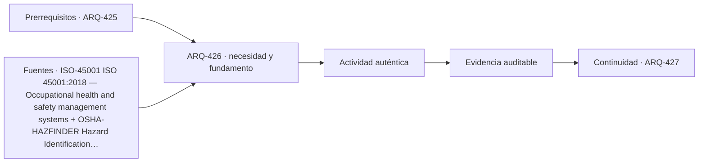

# ARQ-426 · Seguridad y salud: identificación y control de peligros

**Parte 43 · Clase desarrollada · Incorporada en v0.24.0.**

Prerrequisitos conceptuales: ARQ-425. Sin calendario. Material educativo; no constituye presupuesto contractual, certificación de obra, instrucción de seguridad ni habilitación profesional. Los casos, cantidades y costos son ficticios salvo antecedentes expresamente atribuidos. Revisión externa especializada pendiente.

## Pregunta central

¿Cómo identificar y reducir peligros sin convertir una lista genérica en un plan de seguridad de una obra real?

## Resultado y continuidad

Recibe ARQ-425 y conserva sus definiciones; los parámetros nuevos se identifican explícitamente y no reescriben el caso anterior. Elaborarás un registro reproducible, resolverás un caso cuantitativo, contrastarás al menos una variante y cerrarás distinguiendo cálculo, evidencia, decisión y asunto pendiente.

## 1. Definir el problema y su frontera

Peligro, exposición y control son conceptos distintos. Identificar una caída potencial no cuantifica automáticamente el riesgo ni selecciona la medida apropiada. Hace falta comprender tarea, entorno, personas y estado de la obra.

## 2. Variables que no deben confundirse

La identificación mejora cuando combina información previa, observación, participación de trabajadores e investigación de incidentes. Un catálogo genérico ayuda a preguntar, pero no sustituye la evaluación específica del frente.

## 3. Trazabilidad y estados de información

La jerarquía de controles se estudia conceptualmente: evitar o modificar el peligro suele ser distinto de depender exclusivamente de conducta o equipo personal. La clase no prescribe maniobras ni trabajo en altura.

## 4. Caso trabajado

Una actividad ficticia tiene dos estados: material almacenado bloquea un recorrido y una tarea requiere acceder a otro nivel. El análisis no asigna probabilidades. Se registran peligro, personas expuestas, condición desencadenante y controles por estudiar. Retirar el obstáculo elimina ese peligro particular; no declara segura toda la faena.

## 5. Cómo comprobar el resultado

Una cuenta correcta debe poder reconstruirse por un segundo camino: conciliando totales, revisando unidades, comparando estado inicial y final o repitiendo el balance por componentes. Si una variante modifica una sola hipótesis, las demás permanecen constantes. Si cambia más de una, debe declararse; de lo contrario no puede atribuirse la diferencia a una única causa.

Cuando el resultado depende del tiempo, conserva el orden de los eventos. Un saldo final puede ser compatible con un déficit anterior, una demora o una capacidad excedida. Cuando depende del alcance, conserva qué está incluido y qué queda fuera. La profundidad consiste en explicar qué pregunta responde el número y cuál no.

## 6. Interfaces profesionales y documentos

El mismo problema suele cruzar arquitectura, especialidades, administración, construcción y operación. Cada actor necesita información compatible: geometría, cantidad, versión, requisito, fecha de corte o estado. Un archivo correcto de una disciplina puede ser insuficiente si utiliza una base distinta de la que usan las demás.

Por eso cada registro de clase incluye **objeto, fuente, versión, unidad, responsable, estado y decisión siguiente**. En proyectos reales, las responsabilidades provienen de contratos, regulación, organización y competencias profesionales; este material no las asigna universalmente.

## 7. Sensibilidad y escenarios

Una buena estimación muestra cómo cambia la conclusión cuando cambia una variable importante. No se necesita inventar una distribución probabilística. Basta definir escenarios coherentes, recalcular y explicar qué incertidumbre se está explorando.

Si dos escenarios producen conclusiones distintas, no es un fallo del análisis: indica que la decisión es sensible. Puede justificar obtener mejor información, conservar flexibilidad o establecer una condición antes de comprometer recursos.

*Figura 426. La secuencia resume relaciones del caso; no sustituye criterios técnicos, contractuales o normativos.*

## 8. Errores frecuentes

Evita usar porcentajes sin base, mezclar bruto y neto, considerar un dato ausente como cero, sumar máximos de estados incompatibles, tratar promedio como condición individual, cambiar versiones sin actualizar dependencias y convertir una hipótesis didáctica en criterio contractual o normativo.

Otro error es optimizar una sola dimensión. Menor costo no garantiza mismo servicio; mayor productividad no garantiza calidad; mayor capacidad de almacenamiento no resuelve un suministro tardío; más inspecciones no compensan un criterio ambiguo. El método siempre vuelve a la función y a la evidencia.

## 9. Práctica independiente

Para una faena ficticia, identifica cuatro peligros de categorías distintas y propone qué información adicional necesitarías antes de elegir controles.

10. Solución razonada

La respuesta debe separar observación de control propuesto y evitar instrucciones operativas detalladas. Debe incluir responsables competentes y legislación aplicable como pendientes.

La solución se limita a la frontera declarada. Para una obra real se deben verificar precios, rendimientos, contratos, legislación, condiciones de seguridad, medioambiente, ensayos y responsabilidades aplicables. Una referencia pública no sustituye el documento técnico completo cuando su consulta fue parcial.

## 11. Autoevaluación y transferencia

Antes de avanzar, comprueba que puedes: explicar la unidad y el denominador de cada cifra; reconstruir el balance; identificar una hipótesis que, si cambia, podría alterar la decisión; y nombrar al menos una evidencia que tendría que producir un actor competente. Si solo puedes repetir el resultado numérico, el aprendizaje está incompleto.

La clase siguiente conservará los métodos, no los números. Los casos se identifican para impedir que cantidades de un ejercicio aparezcan como datos de otra obra.

<!-- pedagogia-2026:inicio -->
## Decisión pedagógica y posición curricular

### Por qué existe

Esta clase existe para resolver una necesidad concreta del recorrido: ¿Cómo identificar y reducir peligros sin convertir una lista genérica en un plan de seguridad de una obra real?

### Por qué está exactamente aquí

Ocupa el lugar 6 de la Parte 43. Se estudia después de ARQ-425 · Ensayos, trazabilidad y no conformidades porque usa esa base para responder «¿Cómo identificar y reducir peligros sin convertir una lista genérica en un plan de seguridad de una obra real?». Se ubica antes de ARQ-427 · Medioambiente de faena y relación con vecinos porque la evidencia producida aquí debe estar disponible para ese paso.

- **Prerrequisitos:** `ARQ-425`
- **Capacidad que introduce:** Recibe ARQ-425 y conserva sus definiciones; los parámetros nuevos se identifican explícitamente y no reescriben el caso anterior. Elaborarás un registro reproducible, resolverás un caso cuantitativo, contrastarás al menos una variante y cerrarás distinguiendo cálculo, evidencia, decisión y asunto pendiente.
- **Clases o experiencias que dependen de ella:** `ARQ-427`

El diagrama permite comprobar una relación que el texto lineal oculta con facilidad: esta clase recibe capacidades previas, toma decisiones apoyadas por fuentes, exige una experiencia y produce evidencia que habilita trabajo posterior. No representa un procedimiento de obra.

## Resultado observable, evidencia y evaluación

1. Identificar y delimitar las condiciones necesarias para responder la pregunta central de seguridad y salud: identificación y control de peligros.
2. Producir y comprobar la evidencia declarada por la clase: Recibe ARQ-425 y conserva sus definiciones; los parámetros nuevos se identifican explícitamente y no reescriben el caso anterior. Elaborarás un registro reproducible, resolverás un caso cuantitativo, contrastarás al menos una variante y cerrarás distinguiendo cálculo, evidencia, decisión y asunto pendiente.
3. Justificar una decisión de seguridad y salud: identificación y control de peligros mediante fuentes, supuestos, alternativas y límites explícitos.

## Actividad, evidencia y criterio de aceptación

**Actividad:** Para una faena ficticia, identifica cuatro peligros de categorías distintas y propone qué información adicional necesitarías antes de elegir controles.

**Evidencia mínima:** Recibe ARQ-425 y conserva sus definiciones; los parámetros nuevos se identifican explícitamente y no reescriben el caso anterior. Elaborarás un registro reproducible, resolverás un caso cuantitativo, contrastarás al menos una variante y cerrarás distinguiendo cálculo, evidencia, decisión y asunto pendiente.

**Archivo sugerido:** `evidence/ARQ-426/evidencia.md`.

**Criterio de aceptación:** la entrega se acepta cuando:

- La entrega responde explícitamente a la pregunta: ¿Cómo identificar y reducir peligros sin convertir una lista genérica en un plan de seguridad de una obra real?
- La actividad conserva las fronteras del caso y permite reconstruir el procedimiento: Para una faena ficticia, identifica cuatro peligros de categorías distintas y propone qué información adicional necesitarías antes de elegir controles.
- Cada afirmación externa puede seguirse hasta una fuente, su alcance consultado y su límite.
- La evidencia deja disponible una entrada comprobable para ARQ-427.
- Evita usar porcentajes sin base, mezclar bruto y neto, considerar un dato ausente como cero, sumar máximos de estados incompatibles, tratar promedio como condición individual, cambiar versiones sin actualizar dependencias y convertir una hipótesis didáctica en criterio contractual o normativo. Otro error es optimizar una sola dimensión.

La [rúbrica común](../../docs/RUBRICA_COMUN.md) complementa estos criterios; no los reemplaza. Una entrega puede superar un promedio y continuar pendiente si oculta una condición crítica.

## Trazabilidad de las decisiones

| # | Decisión o fundamento | Fuente utilizada | Aplicación y límite en esta clase |
|---:|---|---|---|
| 1 | Gestión de seguridad y salud en el trabajo | [ISO-45001 ISO 45001:2018 — Occupational health and safety management…](https://www.iso.org/standard/45001) | Consulta: Ficha pública Límite: No sustituye legislación laboral, identificación de peligros de faena ni competencias habilitantes. |
| 2 | Identificar peligros mediante información previa, observación, participación de trabajadores e investigación de incidentes. | [OSHA-HAZFINDER Hazard Identification Training Tool — Construction](https://www.osha.gov/hazfinder/text-version/construction) | Consulta: Herramienta pública de formación; escenario de construcción y métodos de identificación de peligros. Límite: Referencia estadounidense de formación; no sustituye legislación chilena, procedimientos de faena ni competencias de prevención. |

La tabla permite auditar las relaciones; la explicación, el caso y la práctica de la clase siguen siendo la documentación principal.

## Autoevaluación, recuperación y continuidad

### Errores diagnósticos

Antes de avanzar, comprueba si puedes reconstruir cada resultado sin mirar la solución, señalar qué evidencia lo sostiene y nombrar una condición que obligaría a revisar tu decisión. Conserva la primera versión, la objeción recibida y la revisión.

**Conexión siguiente:** La continuidad inmediata es ARQ-427 · Medioambiente de faena y relación con vecinos; conserva el método y vuelve a verificar datos y límites.
<!-- pedagogia-2026:fin -->

## Fuentes y alcance de uso

### [[ISO-45001]](#FUENTE-ISO-45001) ISO 45001:2018 — Occupational health and safety management systems

ISO. [https://www.iso.org/standard/45001](https://www.iso.org/standard/45001)

**Consulta:** Ficha pública **Apoyo:** Gestión de seguridad y salud en el trabajo **Límite:** No sustituye legislación laboral, identificación de peligros de faena ni competencias habilitantes.

### [[OSHA-HAZFINDER]](#FUENTE-OSHA-HAZFINDER) Hazard Identification Training Tool — Construction

Occupational Safety and Health Administration. [https://www.osha.gov/hazfinder/text-version/construction](https://www.osha.gov/hazfinder/text-version/construction)

**Consulta:** Herramienta pública de formación; escenario de construcción y métodos de identificación de peligros. **Apoyo:** Identificar peligros mediante información previa, observación, participación de trabajadores e investigación de incidentes. **Límite:** Referencia estadounidense de formación; no sustituye legislación chilena, procedimientos de faena ni competencias de prevención.
