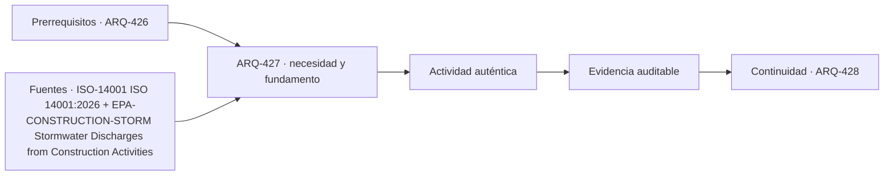

# ARQ-427 · Medioambiente de faena y relación con vecinos

**Parte 43 · Clase desarrollada · Incorporada en v0.24.0.**

Prerrequisitos conceptuales: ARQ-426. Sin calendario. Material educativo; no constituye presupuesto contractual, certificación de obra, instrucción de seguridad ni habilitación profesional. Los casos, cantidades y costos son ficticios salvo antecedentes expresamente atribuidos. Revisión externa especializada pendiente.

## Pregunta central

¿Cómo gestionar efectos de una faena sobre agua, aire, ruido, residuos y comunidad sin confundir cumplir una medida con ausencia de impacto?

## Resultado y continuidad

Recibe ARQ-426 y conserva sus definiciones; los parámetros nuevos se identifican explícitamente y no reescriben el caso anterior. Elaborarás un registro reproducible, resolverás un caso cuantitativo, contrastarás al menos una variante y cerrarás distinguiendo cálculo, evidencia, decisión y asunto pendiente.

## 1. Definir el problema y su frontera

La obra modifica temporalmente superficies, flujos, accesos y emisiones. El plan ambiental necesita identificar aspectos, receptores, condiciones y evidencias de control. La lista depende del sitio y de la fase.

## 2. Variables que no deben confundirse

La escorrentía puede transportar sedimentos y otros contaminantes desde suelos expuestos. Un control necesita continuidad y mantenimiento; su mera instalación no demuestra desempeño durante una lluvia.

## 3. Trazabilidad y estados de información

La relación con vecinos incluye información, horarios, accesos e incidencias. Un registro de reclamos no es una medida de impacto completa, pero puede revelar condiciones que el plan técnico no había observado.

## 4. Caso trabajado

Una zona ficticia de 600 m² recibe 20 mm de lluvia. Volumen sobre la superficie=12 m³. Si un sistema retiene 70 % bajo la hipótesis del ejercicio, quedan 3,6 m³ por gestionar fuera de esa retención. Eso no dimensiona una descarga ni acredita calidad del agua.

## 5. Cómo comprobar el resultado

Una cuenta correcta debe poder reconstruirse por un segundo camino: conciliando totales, revisando unidades, comparando estado inicial y final o repitiendo el balance por componentes. Si una variante modifica una sola hipótesis, las demás permanecen constantes. Si cambia más de una, debe declararse; de lo contrario no puede atribuirse la diferencia a una única causa.

Cuando el resultado depende del tiempo, conserva el orden de los eventos. Un saldo final puede ser compatible con un déficit anterior, una demora o una capacidad excedida. Cuando depende del alcance, conserva qué está incluido y qué queda fuera. La profundidad consiste en explicar qué pregunta responde el número y cuál no.

## 6. Interfaces profesionales y documentos

El mismo problema suele cruzar arquitectura, especialidades, administración, construcción y operación. Cada actor necesita información compatible: geometría, cantidad, versión, requisito, fecha de corte o estado. Un archivo correcto de una disciplina puede ser insuficiente si utiliza una base distinta de la que usan las demás.

Por eso cada registro de clase incluye **objeto, fuente, versión, unidad, responsable, estado y decisión siguiente**. En proyectos reales, las responsabilidades provienen de contratos, regulación, organización y competencias profesionales; este material no las asigna universalmente.

## 7. Sensibilidad y escenarios

Una buena estimación muestra cómo cambia la conclusión cuando cambia una variable importante. No se necesita inventar una distribución probabilística. Basta definir escenarios coherentes, recalcular y explicar qué incertidumbre se está explorando.

Si dos escenarios producen conclusiones distintas, no es un fallo del análisis: indica que la decisión es sensible. Puede justificar obtener mejor información, conservar flexibilidad o establecer una condición antes de comprometer recursos.

*Figura 427. La secuencia resume relaciones del caso; no sustituye criterios técnicos, contractuales o normativos.*

## 8. Errores frecuentes

Evita usar porcentajes sin base, mezclar bruto y neto, considerar un dato ausente como cero, sumar máximos de estados incompatibles, tratar promedio como condición individual, cambiar versiones sin actualizar dependencias y convertir una hipótesis didáctica en criterio contractual o normativo.

Otro error es optimizar una sola dimensión. Menor costo no garantiza mismo servicio; mayor productividad no garantiza calidad; mayor capacidad de almacenamiento no resuelve un suministro tardío; más inspecciones no compensan un criterio ambiguo. El método siempre vuelve a la función y a la evidencia.

## 9. Práctica independiente

Área expuesta 450 m², lluvia 15 mm, retención ficticia 60 %. Calcula volumen total y remanente. Enumera tres procesos reales omitidos.

10. Solución razonada

Volumen=6,75 m³; retenido=4,05; remanente=2,70. Faltan intensidad temporal, infiltración, sedimentos, capacidad de almacenamiento, rebalse y calidad, entre otros.

La solución se limita a la frontera declarada. Para una obra real se deben verificar precios, rendimientos, contratos, legislación, condiciones de seguridad, medioambiente, ensayos y responsabilidades aplicables. Una referencia pública no sustituye el documento técnico completo cuando su consulta fue parcial.

## 11. Autoevaluación y transferencia

Antes de avanzar, comprueba que puedes: explicar la unidad y el denominador de cada cifra; reconstruir el balance; identificar una hipótesis que, si cambia, podría alterar la decisión; y nombrar al menos una evidencia que tendría que producir un actor competente. Si solo puedes repetir el resultado numérico, el aprendizaje está incompleto.

La clase siguiente conservará los métodos, no los números. Los casos se identifican para impedir que cantidades de un ejercicio aparezcan como datos de otra obra.

<!-- pedagogia-2026:inicio -->
## Decisión pedagógica y posición curricular

### Por qué existe

Esta clase existe para resolver una necesidad concreta del recorrido: ¿Cómo gestionar efectos de una faena sobre agua, aire, ruido, residuos y comunidad sin confundir cumplir una medida con ausencia de impacto?

### Por qué está exactamente aquí

Ocupa el lugar 7 de la Parte 43. Se estudia después de ARQ-426 · Seguridad y salud: identificación y control de peligros porque usa esa base para responder «¿Cómo gestionar efectos de una faena sobre agua, aire, ruido, residuos y comunidad sin confundir cumplir una medida con ausencia de impacto?». Se ubica antes de ARQ-428 · Gestión de cambios y resolución de conflictos porque la evidencia producida aquí debe estar disponible para ese paso.

- **Prerrequisitos:** `ARQ-426`
- **Capacidad que introduce:** Recibe ARQ-426 y conserva sus definiciones; los parámetros nuevos se identifican explícitamente y no reescriben el caso anterior. Elaborarás un registro reproducible, resolverás un caso cuantitativo, contrastarás al menos una variante y cerrarás distinguiendo cálculo, evidencia, decisión y asunto pendiente.
- **Clases o experiencias que dependen de ella:** `ARQ-428`

El diagrama permite comprobar una relación que el texto lineal oculta con facilidad: esta clase recibe capacidades previas, toma decisiones apoyadas por fuentes, exige una experiencia y produce evidencia que habilita trabajo posterior. No representa un procedimiento de obra.

## Resultado observable, evidencia y evaluación

1. Identificar y delimitar las condiciones necesarias para responder la pregunta central de medioambiente de faena y relación con vecinos.
2. Producir y comprobar la evidencia declarada por la clase: Recibe ARQ-426 y conserva sus definiciones; los parámetros nuevos se identifican explícitamente y no reescriben el caso anterior. Elaborarás un registro reproducible, resolverás un caso cuantitativo, contrastarás al menos una variante y cerrarás distinguiendo cálculo, evidencia, decisión y asunto pendiente.
3. Justificar una decisión de medioambiente de faena y relación con vecinos mediante fuentes, supuestos, alternativas y límites explícitos.

## Actividad, evidencia y criterio de aceptación

**Actividad:** Área expuesta 450 m², lluvia 15 mm, retención ficticia 60 %. Calcula volumen total y remanente. Enumera tres procesos reales omitidos.

**Evidencia mínima:** Recibe ARQ-426 y conserva sus definiciones; los parámetros nuevos se identifican explícitamente y no reescriben el caso anterior. Elaborarás un registro reproducible, resolverás un caso cuantitativo, contrastarás al menos una variante y cerrarás distinguiendo cálculo, evidencia, decisión y asunto pendiente.

**Archivo sugerido:** `evidence/ARQ-427/evidencia.md`.

**Criterio de aceptación:** la entrega se acepta cuando:

- La entrega responde explícitamente a la pregunta: ¿Cómo gestionar efectos de una faena sobre agua, aire, ruido, residuos y comunidad sin confundir cumplir una medida con ausencia de impacto?
- La actividad conserva las fronteras del caso y permite reconstruir el procedimiento: Área expuesta 450 m², lluvia 15 mm, retención ficticia 60 %. Calcula volumen total y remanente. Enumera tres procesos reales omitidos.
- Cada afirmación externa puede seguirse hasta una fuente, su alcance consultado y su límite.
- La evidencia deja disponible una entrada comprobable para ARQ-428.
- Evita usar porcentajes sin base, mezclar bruto y neto, considerar un dato ausente como cero, sumar máximos de estados incompatibles, tratar promedio como condición individual, cambiar versiones sin actualizar dependencias y convertir una hipótesis didáctica en criterio contractual o normativo. Otro error es optimizar una sola dimensión.

La [rúbrica común](../../docs/RUBRICA_COMUN.md) complementa estos criterios; no los reemplaza. Una entrega puede superar un promedio y continuar pendiente si oculta una condición crítica.

## Trazabilidad de las decisiones

| # | Decisión o fundamento | Fuente utilizada | Aplicación y límite en esta clase |
|---:|---|---|---|
| 1 | Sistema de gestión ambiental y alcance general | [ISO-14001 ISO 14001:2026](https://www.iso.org/standard/14001) | Consulta: Ficha pública; edición 2026 Límite: No equivale a certificar el desempeño ambiental de cada edificio; texto completo no consultado. |
| 2 | Relacionar suelo expuesto, sedimentos, residuos, químicos y control ambiental de obra. | [EPA-CONSTRUCTION-STORM Stormwater Discharges from Construction…](https://www.epa.gov/npdes/stormwater-discharges-construction-activities) | Consulta: Página pública sobre escorrentía y contaminantes asociados a actividades de construcción. Límite: Los umbrales y permisos estadounidenses no se trasladan como regulación chilena. |

La tabla permite auditar las relaciones; la explicación, el caso y la práctica de la clase siguen siendo la documentación principal.

## Autoevaluación, recuperación y continuidad

### Errores diagnósticos

Antes de avanzar, comprueba si puedes reconstruir cada resultado sin mirar la solución, señalar qué evidencia lo sostiene y nombrar una condición que obligaría a revisar tu decisión. Conserva la primera versión, la objeción recibida y la revisión.

**Conexión siguiente:** La continuidad inmediata es ARQ-428 · Gestión de cambios y resolución de conflictos; conserva el método y vuelve a verificar datos y límites.
<!-- pedagogia-2026:fin -->

## Fuentes y alcance de uso

### [[ISO-14001]](#FUENTE-ISO-14001) ISO 14001:2026 — Environmental management systems

ISO. [https://www.iso.org/standard/14001](https://www.iso.org/standard/14001)

**Consulta:** Ficha pública; edición 2026 **Apoyo:** Sistema de gestión ambiental y alcance general **Límite:** No equivale a certificar el desempeño ambiental de cada edificio; texto completo no consultado.

### [[EPA-CONSTRUCTION-STORM]](#FUENTE-EPA-CONSTRUCTION-STORM) Stormwater Discharges from Construction Activities

U.S. Environmental Protection Agency. [https://www.epa.gov/npdes/stormwater-discharges-construction-activities](https://www.epa.gov/npdes/stormwater-discharges-construction-activities)

**Consulta:** Página pública sobre escorrentía y contaminantes asociados a actividades de construcción. **Apoyo:** Relacionar suelo expuesto, sedimentos, residuos, químicos y control ambiental de obra. **Límite:** Los umbrales y permisos estadounidenses no se trasladan como regulación chilena.
