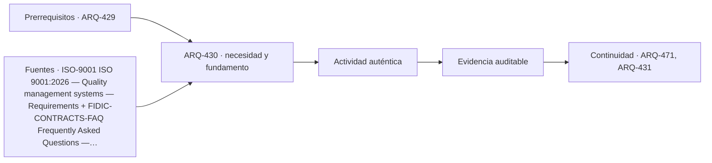

# ARQ-430 · Recepción, pendientes y cierre de contratos

**Parte 43 · Clase desarrollada · Incorporada en v0.24.0.**

Prerrequisitos conceptuales: ARQ-429. Sin calendario. Material educativo; no constituye presupuesto contractual, certificación de obra, instrucción de seguridad ni habilitación profesional. Los casos, cantidades y costos son ficticios salvo antecedentes expresamente atribuidos. Revisión externa especializada pendiente.

## Pregunta central

¿Cómo cerrar una obra sin confundir entrega física, aceptación documental, subsanación de pendientes y cierre económico?

## Resultado y continuidad

Recibe ARQ-429 y conserva sus definiciones; los parámetros nuevos se identifican explícitamente y no reescriben el caso anterior. Elaborarás un registro reproducible, resolverás un caso cuantitativo, contrastarás al menos una variante y cerrarás distinguiendo cálculo, evidencia, decisión y asunto pendiente.

## 1. Definir el problema y su frontera

El cierre tiene varios estados: trabajo terminado según alcance, pruebas realizadas, documentos entregados, pendientes registrados, aceptación según contrato y cierre de pagos. Pueden ocurrir en fechas distintas.

## 2. Variables que no deben confundirse

Una lista de pendientes necesita identidad, ubicación, responsable, estado y evidencia de cierre. Marcar “resuelto” porque se emitió una orden no demuestra ejecución ni verificación.

## 3. Trazabilidad y estados de información

La documentación final debe permitir operar y mantener. Planos finales, manuales, resultados y registros no son simples anexos administrativos; su calidad afecta la capacidad de investigar cambios futuros.

## 4. Caso trabajado

Un proyecto tiene 12 pendientes: 7 cerrados con evidencia, 3 ejecutados pero aún no verificados y 2 abiertos. Decir “10 de 12 resueltos” mezcla estados. El reporte correcto conserva 7 cerrados, 3 pendientes de verificación y 2 abiertos.

## 5. Cómo comprobar el resultado

Una cuenta correcta debe poder reconstruirse por un segundo camino: conciliando totales, revisando unidades, comparando estado inicial y final o repitiendo el balance por componentes. Si una variante modifica una sola hipótesis, las demás permanecen constantes. Si cambia más de una, debe declararse; de lo contrario no puede atribuirse la diferencia a una única causa.

Cuando el resultado depende del tiempo, conserva el orden de los eventos. Un saldo final puede ser compatible con un déficit anterior, una demora o una capacidad excedida. Cuando depende del alcance, conserva qué está incluido y qué queda fuera. La profundidad consiste en explicar qué pregunta responde el número y cuál no.

## 6. Interfaces profesionales y documentos

El mismo problema suele cruzar arquitectura, especialidades, administración, construcción y operación. Cada actor necesita información compatible: geometría, cantidad, versión, requisito, fecha de corte o estado. Un archivo correcto de una disciplina puede ser insuficiente si utiliza una base distinta de la que usan las demás.

Por eso cada registro de clase incluye **objeto, fuente, versión, unidad, responsable, estado y decisión siguiente**. En proyectos reales, las responsabilidades provienen de contratos, regulación, organización y competencias profesionales; este material no las asigna universalmente.

## 7. Sensibilidad y escenarios

Una buena estimación muestra cómo cambia la conclusión cuando cambia una variable importante. No se necesita inventar una distribución probabilística. Basta definir escenarios coherentes, recalcular y explicar qué incertidumbre se está explorando.

Si dos escenarios producen conclusiones distintas, no es un fallo del análisis: indica que la decisión es sensible. Puede justificar obtener mejor información, conservar flexibilidad o establecer una condición antes de comprometer recursos.

*Figura 430. La secuencia resume relaciones del caso; no sustituye criterios técnicos, contractuales o normativos.*

## 8. Errores frecuentes

Evita usar porcentajes sin base, mezclar bruto y neto, considerar un dato ausente como cero, sumar máximos de estados incompatibles, tratar promedio como condición individual, cambiar versiones sin actualizar dependencias y convertir una hipótesis didáctica en criterio contractual o normativo.

Otro error es optimizar una sola dimensión. Menor costo no garantiza mismo servicio; mayor productividad no garantiza calidad; mayor capacidad de almacenamiento no resuelve un suministro tardío; más inspecciones no compensan un criterio ambiguo. El método siempre vuelve a la función y a la evidencia.

## 9. Práctica independiente

Registro con 15 ítems: 9 cerrados, 4 ejecutados sin verificación, 1 rechazado y 1 sin dato. Redacta el estado sin promediarlo a un porcentaje de aceptación.

10. Solución razonada

El estado mantiene cuatro categorías: 9 cerrados; 4 pendientes de verificación; 1 conflicto/rechazo; 1 desconocido. Ninguna suma autoriza declarar cierre contractual total.

La solución se limita a la frontera declarada. Para una obra real se deben verificar precios, rendimientos, contratos, legislación, condiciones de seguridad, medioambiente, ensayos y responsabilidades aplicables. Una referencia pública no sustituye el documento técnico completo cuando su consulta fue parcial.

## 11. Autoevaluación y transferencia

Antes de avanzar, comprueba que puedes: explicar la unidad y el denominador de cada cifra; reconstruir el balance; identificar una hipótesis que, si cambia, podría alterar la decisión; y nombrar al menos una evidencia que tendría que producir un actor competente. Si solo puedes repetir el resultado numérico, el aprendizaje está incompleto.

La clase siguiente conservará los métodos, no los números. Los casos se identifican para impedir que cantidades de un ejercicio aparezcan como datos de otra obra.

<!-- pedagogia-2026:inicio -->
## Decisión pedagógica y posición curricular

### Por qué existe

Esta clase existe para resolver una necesidad concreta del recorrido: ¿Cómo cerrar una obra sin confundir entrega física, aceptación documental, subsanación de pendientes y cierre económico?

### Por qué está exactamente aquí

Cierra la Parte 43: integra lo producido en ARQ-429 · Avance, productividad y límites de indicadores para responder «¿Cómo cerrar una obra sin confundir entrega física, aceptación documental, subsanación de pendientes y cierre económico?». La transición hacia ARQ-431 · BIM es gestión de información, no solo modelar en 3D transfiere el método y la disciplina de evidencia, no los datos o parámetros particulares de esta parte.

- **Prerrequisitos:** `ARQ-429`
- **Capacidad que introduce:** Recibe ARQ-429 y conserva sus definiciones; los parámetros nuevos se identifican explícitamente y no reescriben el caso anterior. Elaborarás un registro reproducible, resolverás un caso cuantitativo, contrastarás al menos una variante y cerrarás distinguiendo cálculo, evidencia, decisión y asunto pendiente.
- **Clases o experiencias que dependen de ella:** `ARQ-471`, `ARQ-431`

El diagrama permite comprobar una relación que el texto lineal oculta con facilidad: esta clase recibe capacidades previas, toma decisiones apoyadas por fuentes, exige una experiencia y produce evidencia que habilita trabajo posterior. No representa un procedimiento de obra.

## Resultado observable, evidencia y evaluación

1. Identificar y delimitar las condiciones necesarias para responder la pregunta central de recepción, pendientes y cierre de contratos.
2. Producir y comprobar la evidencia declarada por la clase: Recibe ARQ-429 y conserva sus definiciones; los parámetros nuevos se identifican explícitamente y no reescriben el caso anterior. Elaborarás un registro reproducible, resolverás un caso cuantitativo, contrastarás al menos una variante y cerrarás distinguiendo cálculo, evidencia, decisión y asunto pendiente.
3. Justificar una decisión de recepción, pendientes y cierre de contratos mediante fuentes, supuestos, alternativas y límites explícitos.

## Actividad, evidencia y criterio de aceptación

**Actividad:** Registro con 15 ítems: 9 cerrados, 4 ejecutados sin verificación, 1 rechazado y 1 sin dato. Redacta el estado sin promediarlo a un porcentaje de aceptación.

**Evidencia mínima:** Recibe ARQ-429 y conserva sus definiciones; los parámetros nuevos se identifican explícitamente y no reescriben el caso anterior. Elaborarás un registro reproducible, resolverás un caso cuantitativo, contrastarás al menos una variante y cerrarás distinguiendo cálculo, evidencia, decisión y asunto pendiente.

**Archivo sugerido:** `evidence/ARQ-430/evidencia.md`.

**Criterio de aceptación:** la entrega se acepta cuando:

- La entrega responde explícitamente a la pregunta: ¿Cómo cerrar una obra sin confundir entrega física, aceptación documental, subsanación de pendientes y cierre económico?
- La actividad conserva las fronteras del caso y permite reconstruir el procedimiento: Registro con 15 ítems: 9 cerrados, 4 ejecutados sin verificación, 1 rechazado y 1 sin dato. Redacta el estado sin promediarlo a un porcentaje de aceptación.
- Cada afirmación externa puede seguirse hasta una fuente, su alcance consultado y su límite.
- La evidencia deja disponible una entrada comprobable para ARQ-471.
- Evita usar porcentajes sin base, mezclar bruto y neto, considerar un dato ausente como cero, sumar máximos de estados incompatibles, tratar promedio como condición individual, cambiar versiones sin actualizar dependencias y convertir una hipótesis didáctica en criterio contractual o normativo. Otro error es optimizar una sola dimensión.

La [rúbrica común](../../docs/RUBRICA_COMUN.md) complementa estos criterios; no los reemplaza. Una entrega puede superar un promedio y continuar pendiente si oculta una condición crítica.

## Trazabilidad de las decisiones

| # | Decisión o fundamento | Fuente utilizada | Aplicación y límite en esta clase |
|---:|---|---|---|
| 1 | Sistema de gestión de calidad; edición publicada y ámbito general | [ISO-9001 ISO 9001:2026 — Quality management systems — Requirements](https://www.iso.org/standard/9001) | Consulta: Ficha pública; publicación 16-09-2026 Límite: Texto normativo íntegro no adquirido; no se inventan cláusulas ni plazos universales de transición de certificación. |
| 2 | Distinguir forma contractual, edición y tipo de contratación antes de citar una condición. | [FIDIC-CONTRACTS-FAQ Frequently Asked Questions — Contracts & Agreements](https://fidic.org/faq-page/240) | Consulta: Página oficial consultada el 23-09-2026; identifica distintas familias y ediciones de contratos FIDIC. Límite: No proporciona asesoría jurídica ni sustituye contrato particular, condiciones especiales o legislación aplicable. |
| 3 | Línea base, trazabilidad y análisis del impacto de cambios | [Organismo: National Aeronautics and Space Administration. Consulta:…](https://www.nasa.gov/reference/6-0-crosscutting-technical-management/) | Consulta: Apartados 6.2 y 6.5 sobre requisitos y configuración Límite: Los formularios y el caso arquitectónico son originales; no se copian procedimientos contractuales. |

La tabla permite auditar las relaciones; la explicación, el caso y la práctica de la clase siguen siendo la documentación principal.

## Autoevaluación, recuperación y continuidad

### Errores diagnósticos

Antes de avanzar, comprueba si puedes reconstruir cada resultado sin mirar la solución, señalar qué evidencia lo sostiene y nombrar una condición que obligaría a revisar tu decisión. Conserva la primera versión, la objeción recibida y la revisión.

**Conexión siguiente:** La continuidad inmediata es ARQ-431 · BIM es gestión de información, no solo modelar en 3D; conserva el método y vuelve a verificar datos y límites.
<!-- pedagogia-2026:fin -->

## Fuentes y alcance de uso

### [[ISO-9001]](#FUENTE-ISO-9001) ISO 9001:2026 — Quality management systems — Requirements

ISO. [https://www.iso.org/standard/9001](https://www.iso.org/standard/9001)

**Consulta:** Ficha pública; publicación 16-09-2026 **Apoyo:** Sistema de gestión de calidad; edición publicada y ámbito general **Límite:** Texto normativo íntegro no adquirido; no se inventan cláusulas ni plazos universales de transición de certificación.

### [[FIDIC-CONTRACTS-FAQ]](#FUENTE-FIDIC-CONTRACTS-FAQ) Frequently Asked Questions — Contracts & Agreements

International Federation of Consulting Engineers. [https://fidic.org/faq-page/240](https://fidic.org/faq-page/240)

**Consulta:** Página oficial consultada el 23-09-2026; identifica distintas familias y ediciones de contratos FIDIC. **Apoyo:** Distinguir forma contractual, edición y tipo de contratación antes de citar una condición. **Límite:** No proporciona asesoría jurídica ni sustituye contrato particular, condiciones especiales o legislación aplicable.

### [[NASA-CHANGE]](#FUENTE-NASA-CHANGE) NASA Systems Engineering Handbook, 6.0: Crosscutting Technical Management

National Aeronautics and Space Administration. [https://www.nasa.gov/reference/6-0-crosscutting-technical-management/](https://www.nasa.gov/reference/6-0-crosscutting-technical-management/)

**Consulta:** Apartados 6.2 y 6.5 sobre requisitos y configuración **Apoyo:** Línea base, trazabilidad y análisis del impacto de cambios **Límite:** Los formularios y el caso arquitectónico son originales; no se copian procedimientos contractuales.
