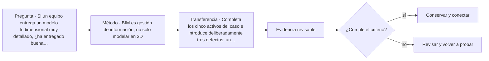

# ARQ-431 · BIM es gestión de información, no solo modelar en 3D

**Parte 44 · Clase redactada, primera edición de estudio.**

El material es educativo: no constituye un proyecto construible, cálculo firmado, informe pericial ni habilitación profesional. Los casos y cifras son sintéticos salvo indicación explícita. La revisión externa por especialistas está pendiente.

## Pregunta central

Si un equipo entrega un modelo tridimensional muy detallado, ¿ha entregado buena información? Solo si esa información permite responder las preguntas del proyecto, tiene procedencia, está coordinada y puede usarse. BIM no debe confundirse con producir más geometría. Esta clase organiza una entrega pequeña que realmente pueda comprobarse.

## Resultado y alcance

Redactarás requisitos de información para cinco activos ficticios, definirás responsabilidades de revisión y diseñarás un protocolo de intercambio. No se ejecuta un programa BIM en esta clase ni se afirma que los datos de ejemplo sean un archivo IFC. La evidencia será un contrato de información didáctico, una tabla de activos y un informe de validación manual.

## Objeto, información y decisión

Un objeto modelado puede tener dimensiones, ubicación, material, relaciones y propiedades. Sin embargo, cada dato solo es útil si responde a una necesidad. Para mantenimiento, puede ser más importante conocer fabricante, identificación, acceso, repuesto y documentación que disponer de una geometría con cientos de detalles irrelevantes. Para coordinación espacial, otras propiedades serán prioritarias.

ISO 19650-1 trata principios de gestión de información, y la parte 2 se refiere a la fase de entrega de activos [ISO-19650-1; ISO-19650-2]. Esta clase toma ese ámbito como referencia y propone su propio ejercicio de requisitos; no reproduce cláusulas ni afirma conformidad formal. La parte 6 incorpora el ámbito de información de salud y seguridad [[ISO-19650-6]](#FUENTE-ISO-19650-6).

## Requisitos antes de modelar

Empieza por la decisión. Supongamos que el operador debe identificar una válvula para programar mantenimiento. La información necesaria incluye un identificador estable, ubicación comprensible, función y vínculo con instrucciones autorizadas. Un objeto llamado «válvula nueva final 2» no resuelve esa necesidad aunque esté representado con precisión.

Después define quién produce, quién revisa y quién acepta cada dato. La persona que modela puede transcribir una propiedad suministrada por otra disciplina, pero eso no la convierte en responsable de validar todas sus implicaciones técnicas. Las competencias deben permanecer claras. El flujo de información no puede borrar la autoría y revisión profesional.

## Caso trabajado: cinco activos para entregar

El caso ficticio contiene dos puertas, una unidad de ventilación, un tablero y una válvula. Adoptamos los identificadores P-001, P-002, V-001, E-001 y A-001. Estos códigos son internos del ejercicio, no una clasificación universal. Para cada activo exigimos ubicación, tipo, estado de revisión, fuente del dato y enlace documental cuando corresponda.

**Primera comprobación: identidad.** Ningún identificador debe repetirse. Si dos objetos comparten E-001, una orden de trabajo puede dirigirse al activo equivocado. Cambiar el identificador en cada revisión también destruye continuidad; por eso debe existir una regla de persistencia y de reemplazo.

**Segunda comprobación: unidades y vocabulario.** Un ancho no puede registrarse unas veces en metros y otras en milímetros sin declaración. «Abierta» puede significar una puerta físicamente abierta o una incidencia pendiente; el campo debe definir su sentido. Evitar ambigüedad es una tarea de gestión de información, no una preferencia estética.

**Tercera comprobación: estados.** Para este ejercicio usamos borrador, revisado, aceptado y sustituido. Son estados propuestos, no una transcripción normativa. Cada cambio de estado exige responsable y evidencia. Un archivo no pasa a aceptado porque su nombre contenga «final».

**Cuarta comprobación: contenido.** Si el manual de V-001 no existe, el campo no se rellena con un enlace ficticio. Se registra pendiente y se conserva la incidencia. La entrega puede estar incompleta aunque el archivo abra sin errores.

## Ejemplo de contrato de datos

```
{
  "id": "V-001",
  "tipo": "unidad_ventilacion_ficticia",
  "ubicacion": "recinto_tecnico_01",
  "estado": "revisado",
  "fuente": "ficha_de_ejercicio",
  "documento_mantenimiento": null,
  "incidencias": ["manual_pendiente"]
}
```

Este JSON es un ejemplo de estructura de información. **No es IFC**, no representa un producto real y no debe importarse como si fuera un modelo de construcción. El valor nulo hace visible el vacío; sustituirlo por una cadena vacía o un enlace inventado dificultaría la revisión.

## Interoperabilidad y significado

buildingSMART identifica IFC como un esquema abierto para intercambio y documenta IFC 4.3.2.0 en relación con ISO 16739-1:2024 [[BIM-IFC]](#FUENTE-BIM-IFC). Compartir un formato no garantiza que todas las aplicaciones interpreten cada propiedad de la misma forma. Deben definirse versión, contenido esperado y pruebas adecuadas al intercambio.

Una prueba de ida y vuelta puede comparar identificadores, unidades, geometría relevante y propiedades requeridas antes y después de transferir información. Abrir visualmente el archivo es una comprobación insuficiente si los datos que necesita operación se perdieron. A la inversa, exigir todos los campos imaginables puede encarecer la entrega y dificultar el mantenimiento de la información.

## Interferencias y falsas seguridades

Un control geométrico puede identificar intersecciones, pero no necesariamente comprende todas las condiciones de montaje, acceso o mantenimiento. Dos objetos que no chocan pueden seguir dejando un equipo sin espacio para reparar. Por tanto, un informe de «cero interferencias» debe interpretarse según reglas, tolerancias, versiones y usos comprobados.

La comprobación automática exige un criterio explícito. Por ejemplo, «todos los activos deben tener identificador único» es verificable. «El edificio está bien diseñado» no se convierte en una regla inequívoca por escribirla en un programa. El sistema debe explicar qué revisó, qué excluyó y qué requiere juicio humano.

## IA dentro del proceso

Una IA puede ayudar a clasificar incidencias o generar alternativas de organización documental, pero sus resultados requieren comprobación. La noticia oficial sobre la revisión 2026 de la Carta UNESCO–UIA enfatiza un uso complementario al pensamiento de diseño [[EDU-UIA]](#FUENTE-EDU-UIA). En el ejercicio, una IA no puede inventar un manual faltante ni marcar un componente como conforme sin evidencia.

También deben considerarse privacidad, propiedad de archivos y condiciones de uso de servicios externos. No se cargan planos sensibles o datos de usuarios en cualquier sistema por conveniencia. Esta clase no prescribe una plataforma comercial; enseña a definir requisitos que después permitan compararlas.

## Práctica y respuesta orientativa

Completa los cinco activos del caso e introduce deliberadamente tres defectos: un identificador repetido, una unidad inconsistente y un documento faltante. Pide a otra persona que los detecte usando tus reglas. Después corrige los dos primeros y registra el tercero como pendiente, explicando por qué no se puede cerrar todavía.

La respuesta debe generar tres incidencias distintas, con objeto afectado, regla incumplida, responsable y evidencia necesaria. No debe borrar el activo sin documento para lograr una validación «en verde». Un control que premia esconder pendientes degrada la calidad de la entrega.

## Evaluación

Se propone 30 % para pertinencia de requisitos, 25 % para identidad y semántica, 25 % para revisión y trazabilidad, y 20 % para límites de automatización. Son errores críticos llamar IFC a cualquier JSON, presentar apertura de archivo como prueba de cumplimiento y atribuir al modelador facultades de certificación que no posee. El mejor modelo no es el más pesado: es el que proporciona información confiable para decisiones definidas.

<!-- pedagogia-2026:inicio -->
## Mapa visual de aprendizaje



El diagrama representa el ciclo de aprendizaje de esta clase, no una secuencia de obra ni un procedimiento profesional.

## Resultado observable, evidencia y evaluación

**Tipo de clase:** profesional y de coordinación.

**Evidencia mínima:** registro de decisión con alcance, interfaces, versiones, responsables, evidencia y condición de cierre.

**Archivo sugerido:** `evidence/ARQ-431/evidencia.md`.

| Criterio | Evidencia observable |
|---|---|
| Precisión y representación · 20 % | Los conceptos, unidades y convenciones se usan de forma coherente y pueden ser reconstruidos por otra persona. |
| Evidencia y trazabilidad · 25 % | Cada afirmación importante se vincula con dato, cálculo, observación o fuente; hipótesis y desconocidos permanecen visibles. |
| Decisión y alternativas · 25 % | La decisión responde a la pregunta, compara al menos una alternativa y declara qué condición la haría cambiar. |
| Integración y ciclo de vida · 20 % | Se identifica una interfaz y una consecuencia para construcción, uso, mantenimiento, adaptación o fin de vida. |
| Comunicación, ética y límites · 10 % | El alcance se entiende sin explicación oral adicional y no se atribuyen permisos, competencias o certezas inexistentes. |

**Criterio de aceptación:** 80/100 y ningún criterio bajo 60 %. Una entrega genérica que podría reutilizarse sin cambios en otra clase no demuestra dominio. Si existe una condición crítica de seguridad, accesibilidad, evidencia o responsabilidad sin resolver, la entrega permanece pendiente aunque el promedio supere 80.

### Errores diagnósticos

En esta clase conviene vigilar especialmente: confundir coordinación con aprobación; perder versión o responsable; cerrar un pendiente sin evidencia.

## Autoevaluación, recuperación y continuidad

Antes de avanzar, responde sin consultar la solución:

1. ¿Qué decisión concreta puedes tomar ahora que no podías justificar antes?
2. ¿Qué evidencia de tu entrega es comprobada y cuál continúa siendo una hipótesis?
3. ¿Qué cambio de contexto invalidaría la transferencia realizada?

Revisa la entrega a las 24–48 horas y nuevamente al cerrar la parte. Conserva la primera versión, la crítica recibida y la versión revisada: el aprendizaje se demuestra también mediante el cambio entre versiones.
<!-- pedagogia-2026:fin -->

## Fuentes y alcance de uso

- **[[ISO-19650-1]](#FUENTE-ISO-19650-1) ISO 19650-1:2018 — Information management using BIM: Concepts and principles** — ISO. [https://www.iso.org/standard/68078.html](https://www.iso.org/standard/68078.html)
Uso: Principios de gestión de información de activos. Alcance de consulta: Ficha pública. Límite: No es licencia de software ni certificado automático de un modelo.

- **[[ISO-19650-2]](#FUENTE-ISO-19650-2) ISO 19650-2:2018 — Delivery phase of the assets** — ISO. [https://www.iso.org/standard/68080.html](https://www.iso.org/standard/68080.html)
Uso: Gestión de información durante la entrega del proyecto. Alcance de consulta: Ficha pública; edición publicada con revisión en curso. Límite: Un proyecto de revisión no reemplaza por sí solo la edición publicada. Texto íntegro no consultado.

- **[[ISO-19650-6]](#FUENTE-ISO-19650-6) ISO 19650-6:2025 — Health and safety information** — ISO. [https://www.iso.org/standard/82705.html](https://www.iso.org/standard/82705.html)
Uso: Información de salud y seguridad. Alcance de consulta: Ficha pública / resultado oficial. Límite: No se atribuyen requisitos de detalle sin texto completo; no es una norma dedicada exclusivamente a operación.

- **[[BIM-IFC]](#FUENTE-BIM-IFC) Industry Foundation Classes: IFC 4.3 / ISO 16739-1:2024** — buildingSMART International. [https://www.buildingsmart.org/standards/bsi-standards/industry-foundation-classes/](https://www.buildingsmart.org/standards/bsi-standards/industry-foundation-classes/)
Uso: Interoperabilidad mediante un esquema abierto; versión IFC 4.3.2.0. Alcance de consulta: Página de estándar. Límite: No garantiza soporte idéntico de todas las aplicaciones ni cumplimiento normativo del edificio.

- **[[EDU-UIA]](#FUENTE-EDU-UIA) UNESCO–UIA Charter for Architectural Education, revisión 2026** — Unión Internacional de Arquitectos. [https://www.uia-architectes.org/en/news/unesco-uia-charter-for-architectural-education-revised-edition-2026/](https://www.uia-architectes.org/en/news/unesco-uia-charter-for-architectural-education-revised-edition-2026/)
Uso: Amplitud de la formación arquitectónica y uso de IA complementario al pensamiento de diseño. Alcance de consulta: Noticia oficial y alcance de la revisión. Límite: No se revisó aquí el texto integral de la Carta ni se obtuvo validación o acreditación del programa.

Consulta de referencias: **20 de septiembre de 2026**. Los razonamientos, datos de ejercicio y soluciones son elaboración didáctica original; no se atribuyen a las fuentes como estudios de casos reales.
