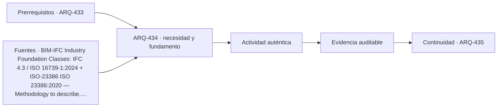

# ARQ-434 · IFC, clasificación y datos de objetos

**Parte 44 · Clase desarrollada · Incorporada en v0.25.0.**

Prerrequisitos conceptuales: ARQ-433. Sin calendario. Los casos, cantidades, algoritmos e indicadores son didácticos y ficticios salvo antecedentes expresamente atribuidos. No constituyen certificación BIM, ACV conforme, auditoría, especificación contractual ni habilitación profesional. Revisión externa especializada pendiente.

## Pregunta central

¿Cómo lograr interoperabilidad semántica cuando dos aplicaciones pueden mostrar la misma geometría pero interpretar distinto sus datos?

## Resultado y continuidad

ARQ-434 recibe la lógica de ARQ-433; cualquier parámetro nuevo se identifica como caso propio y no modifica retrospectivamente el capítulo anterior. Elaborarás una estructura de evidencia, resolverás un caso reproducible, contrastarás una variante y cerrarás distinguiendo dato, requisito, interpretación y pendiente.

## 1. Definir la pregunta y el uso

IFC es un esquema de información, no un simple contenedor de sólidos. Una exportación puede conservar forma y perder propiedades, relaciones o clasificaciones. Por eso la prueba debe responder a los usos definidos y no reducirse a “el archivo abre”.

## 2. Información que debe conservar significado

Clasificar significa relacionar objetos con conceptos bajo un sistema identificado. Dos códigos iguales en sistemas distintos pueden no significar lo mismo. La clase exige registrar sistema, edición o contexto y propósito de uso.

## 3. Estados, versiones y fronteras

Las propiedades necesitan nombre, definición, unidad y procedencia. ISO 23386 aborda metodologías para definir y mantener propiedades; ISO 23387:2025 actualiza el marco de plantillas de datos. El ejercicio utiliza esos principios sin afirmar implementación formal.

## 4. Comprobación antes de automatizar

Los diccionarios de datos facilitan consistencia, pero no convierten una definición en un valor medido. “Transmitancia térmica” puede estar perfectamente definida y seguir sin existir evidencia de cuál es la transmitancia del objeto concreto.

## 5. Caso trabajado

Caso IFC-DATA-01: cinco puertas se intercambian. Todas conservan GUID y ubicación; cuatro conservan clasificación; tres conservan FireRating y dos lo pierden. La geometría se mantiene en las cinco. Para un uso que exige clasificación y FireRating, solo tres puertas tienen ambos campos. La tasa de preservación geométrica es 100 %, la de identidad 100 % y la de paquete requerido 60 %. El ejemplo demuestra que un único porcentaje de “éxito de exportación” oculta qué función se perdió.

## 6. Profundización: de una cifra a una decisión auditable

La comprobación no termina cuando una suma cierra. Debe poder reconstruirse la **procedencia** de cada entrada, la **unidad**, la **versión** y la **frontera** a la que pertenece. Cuando dos resultados se comparan, ambos deben responder a la misma pregunta o la diferencia debe explicarse antes de concluir.

Una segunda comprobación útil cambia una sola hipótesis. Si el resultado cambia mucho, la decisión es sensible a ese dato; si cambia poco, puede ser más importante investigar otra variable. Sensibilidad no significa probabilidad: los escenarios del curso no inventan distribuciones estadísticas cuando no hay datos.

También se conserva el estado desconocido. En información digital, un campo ausente no es cero; en una comparación ambiental, un módulo no reportado no es impacto nulo; en un control de reglas, una condición no comprobada no se transforma en aprobación. Esta disciplina impide que un tablero visualmente “verde” o una tabla aparentemente completa oculte huecos relevantes.

## 7. Interfaces profesionales y control de cambios

Arquitectura, ingeniería, construcción, operación, datos y sostenibilidad pueden utilizar el mismo objeto con propósitos diferentes. El registro debe indicar quién origina una propiedad, quién la revisa, para qué uso se acepta y qué modificación obliga a reabrir la evidencia. Un cambio de geometría puede afectar cantidad, cronograma y análisis ambiental; un cambio de producto puede afectar propiedades, documentación y mantenimiento.

El control de cambios no exige repetir indiscriminadamente todo. Exige rastrear dependencias y justificar qué permanece válido. Si un identificador, versión o fuente cambia, los documentos dependientes deben revisarse de forma proporcional al efecto. Conservar la base anterior permite entender la evolución y evita reemplazar silenciosamente resultados desfavorables.

## 8. Errores frecuentes

Evita confundir presencia de información con validez; formato abierto con interoperabilidad garantizada; automatización con verificación completa; clasificación con desempeño; archivo entregado con activo operable; EPD con superioridad ambiental; carbono con sostenibilidad total; y certificación con cumplimiento de todas las dimensiones del proyecto.

Otro error es sumar porcentajes o indicadores que tienen denominadores distintos. Antes de combinar valores, escribe sus unidades, población u objeto, horizonte y criterio. Cuando no existe una conversión defendible, presenta los resultados en paralelo y explica el conflicto en lugar de fabricar una puntuación universal.

*Figura 434. Esquema original del programa. Resume relaciones del caso; no representa una obra, producto o certificación real.*

## 9. Práctica independiente

Crea seis objetos con identidad, clasificación y dos propiedades requeridas. Simula una transferencia que pierde una propiedad en dos objetos y clasificación en uno distinto. Calcula cuántos objetos conservan el paquete completo y explica qué prueba adicional necesitarías sobre unidades.

10. Solución razonada

Si las pérdidas afectan a tres objetos distintos, solo tres de seis mantienen el paquete completo: 50 %. Aunque cada campo individual tenga una tasa mayor, el uso exige conjunción. Las unidades deben comprobarse por significado, no solo por presencia del valor.

La solución pertenece únicamente al modelo declarado. En un proyecto real deben verificarse fuentes, contratos de información, software, reglas de intercambio, declaraciones ambientales, datos de producto, legislación, autorizaciones y responsabilidades aplicables. Una ficha pública de norma no equivale a la lectura completa de sus cláusulas.

## 11. Autoevaluación y transferencia

Puedes avanzar cuando seas capaz de reconstruir el caso sin mirar la respuesta, nombrar al menos una condición que el cálculo no verifica y explicar qué actor debería producir la evidencia pendiente. Si solo puedes repetir el porcentaje final, el aprendizaje está incompleto.

La clase siguiente conserva el **método**, no las cifras. Las familias de casos permanecen separadas para que un valor didáctico no reaparezca como antecedente de otro proyecto.

<!-- pedagogia-2026:inicio -->
## Decisión pedagógica y posición curricular

### Por qué existe

Esta clase existe para resolver una necesidad concreta del recorrido: ¿Cómo lograr interoperabilidad semántica cuando dos aplicaciones pueden mostrar la misma geometría pero interpretar distinto sus datos?

### Por qué está exactamente aquí

Ocupa el lugar 4 de la Parte 44. Se estudia después de ARQ-433 · Coordinación, responsabilidades y entorno común de datos porque usa esa base para responder «¿Cómo lograr interoperabilidad semántica cuando dos aplicaciones pueden mostrar la misma geometría pero interpretar distinto sus datos?». Se ubica antes de ARQ-435 · Interferencias y comprobaciones basadas en reglas porque la evidencia producida aquí debe estar disponible para ese paso.

- **Prerrequisitos:** `ARQ-433`
- **Capacidad que introduce:** ARQ-434 recibe la lógica de ARQ-433; cualquier parámetro nuevo se identifica como caso propio y no modifica retrospectivamente el capítulo anterior. Elaborarás una estructura de evidencia, resolverás un caso reproducible, contrastarás una variante y cerrarás distinguiendo dato, requisito, interpretación y pendiente.
- **Clases o experiencias que dependen de ella:** `ARQ-435`

El diagrama permite comprobar una relación que el texto lineal oculta con facilidad: esta clase recibe capacidades previas, toma decisiones apoyadas por fuentes, exige una experiencia y produce evidencia que habilita trabajo posterior. No representa un procedimiento de obra.

## Resultado observable, evidencia y evaluación

1. Identificar y delimitar las condiciones necesarias para responder la pregunta central de ifc, clasificación y datos de objetos.
2. Producir y comprobar la evidencia declarada por la clase: ARQ-434 recibe la lógica de ARQ-433; cualquier parámetro nuevo se identifica como caso propio y no modifica retrospectivamente el capítulo anterior. Elaborarás una estructura de evidencia, resolverás un caso reproducible, contrastarás una variante y cerrarás distinguiendo dato, requisito, interpretación y pendiente.
3. Justificar una decisión de ifc, clasificación y datos de objetos mediante fuentes, supuestos, alternativas y límites explícitos.

## Actividad, evidencia y criterio de aceptación

**Actividad:** Crea seis objetos con identidad, clasificación y dos propiedades requeridas. Simula una transferencia que pierde una propiedad en dos objetos y clasificación en uno distinto. Calcula cuántos objetos conservan el paquete completo y explica qué prueba adicional necesitarías sobre unidades.

**Evidencia mínima:** ARQ-434 recibe la lógica de ARQ-433; cualquier parámetro nuevo se identifica como caso propio y no modifica retrospectivamente el capítulo anterior. Elaborarás una estructura de evidencia, resolverás un caso reproducible, contrastarás una variante y cerrarás distinguiendo dato, requisito, interpretación y pendiente.

**Archivo sugerido:** `evidence/ARQ-434/evidencia.md`.

**Criterio de aceptación:** la entrega se acepta cuando:

- La entrega responde explícitamente a la pregunta: ¿Cómo lograr interoperabilidad semántica cuando dos aplicaciones pueden mostrar la misma geometría pero interpretar distinto sus datos?
- La actividad conserva las fronteras del caso y permite reconstruir el procedimiento: Crea seis objetos con identidad, clasificación y dos propiedades requeridas. Simula una transferencia que pierde una propiedad en dos objetos y clasificación en uno distinto. Calcula cuántos objetos conservan el paquete completo y explica qué prueba adicional necesitarías sobre unidades.
- Cada afirmación externa puede seguirse hasta una fuente, su alcance consultado y su límite.
- La evidencia deja disponible una entrada comprobable para ARQ-435.
- Evita confundir presencia de información con validez; formato abierto con interoperabilidad garantizada; automatización con verificación completa; clasificación con desempeño; archivo entregado con activo operable; EPD con superioridad ambiental; carbono con sostenibilidad total; y certificación con cumplimiento de todas las dimensiones del proyecto. Otro error es sumar porcentajes o indicadores que tienen denominadores distintos.

La [rúbrica común](../../docs/RUBRICA_COMUN.md) complementa estos criterios; no los reemplaza. Una entrega puede superar un promedio y continuar pendiente si oculta una condición crítica.

## Trazabilidad de las decisiones

| # | Decisión o fundamento | Fuente utilizada | Aplicación y límite en esta clase |
|---:|---|---|---|
| 1 | Interoperabilidad mediante un esquema abierto; versión IFC 4.3.2.0 | [BIM-IFC Industry Foundation Classes: IFC 4.3 / ISO 16739-1:2024](https://www.buildingsmart.org/standards/bsi-standards/industry-foundation-classes/) | Consulta: Página de estándar Límite: No garantiza soporte idéntico de todas las aplicaciones ni cumplimiento normativo del edificio. |
| 2 | Definición, autoría, mantenimiento y gobernanza de propiedades en diccionarios interconectados. | [ISO-23386 ISO 23386:2020 — Methodology to describe, author and…](https://www.iso.org/standard/75401.html) | Consulta: Ficha pública; edición 2020 confirmada en 2025. Límite: No se leyó el texto íntegro ni se reproduce su proceso normativo. |
| 3 | Plantillas de datos legibles por máquina para objetos durante el ciclo de vida. | [ISO-23387-2025 ISO 23387:2025 — Data templates for objects used in the…](https://www.iso.org/standard/85391.html) | Consulta: Ficha pública; edición 2 publicada en septiembre de 2025. Límite: No aporta el contenido de una plantilla concreta ni certifica un modelo. |
| 4 | Vocabularios, definiciones y acceso consistente a términos y propiedades del entorno construido. | [BIM-BSDD buildingSMART Data Dictionary (bSDD)](https://www.buildingsmart.org/users/services/buildingsmart-data-dictionary/) | Consulta: Página pública del servicio y descripción de diccionarios interconectados. Límite: La existencia de un término en un diccionario no certifica datos de un objeto ni obliga a un proyecto a adoptarlo. |

La tabla permite auditar las relaciones; la explicación, el caso y la práctica de la clase siguen siendo la documentación principal.

## Autoevaluación, recuperación y continuidad

### Errores diagnósticos

Antes de avanzar, comprueba si puedes reconstruir cada resultado sin mirar la solución, señalar qué evidencia lo sostiene y nombrar una condición que obligaría a revisar tu decisión. Conserva la primera versión, la objeción recibida y la revisión.

**Conexión siguiente:** La continuidad inmediata es ARQ-435 · Interferencias y comprobaciones basadas en reglas; conserva el método y vuelve a verificar datos y límites.
<!-- pedagogia-2026:fin -->

## Fuentes y alcance de uso

### [[BIM-IFC]](#FUENTE-BIM-IFC) Industry Foundation Classes: IFC 4.3 / ISO 16739-1:2024

buildingSMART International. [https://www.buildingsmart.org/standards/bsi-standards/industry-foundation-classes/](https://www.buildingsmart.org/standards/bsi-standards/industry-foundation-classes/)

**Consulta:** Página de estándar **Apoyo:** Interoperabilidad mediante un esquema abierto; versión IFC 4.3.2.0 **Límite:** No garantiza soporte idéntico de todas las aplicaciones ni cumplimiento normativo del edificio.

### [[ISO-23386]](#FUENTE-ISO-23386) ISO 23386:2020 — Methodology to describe, author and maintain properties in interconnected data dictionaries

ISO. [https://www.iso.org/standard/75401.html](https://www.iso.org/standard/75401.html)

**Consulta:** Ficha pública; edición 2020 confirmada en 2025. **Apoyo:** Definición, autoría, mantenimiento y gobernanza de propiedades en diccionarios interconectados. **Límite:** No se leyó el texto íntegro ni se reproduce su proceso normativo.

### [[ISO-23387-2025]](#FUENTE-ISO-23387-2025) ISO 23387:2025 — Data templates for objects used in the life cycle of assets

ISO. [https://www.iso.org/standard/85391.html](https://www.iso.org/standard/85391.html)

**Consulta:** Ficha pública; edición 2 publicada en septiembre de 2025. **Apoyo:** Plantillas de datos legibles por máquina para objetos durante el ciclo de vida. **Límite:** No aporta el contenido de una plantilla concreta ni certifica un modelo.

### [[BIM-BSDD]](#FUENTE-BIM-BSDD) buildingSMART Data Dictionary (bSDD)

buildingSMART International. [https://www.buildingsmart.org/users/services/buildingsmart-data-dictionary/](https://www.buildingsmart.org/users/services/buildingsmart-data-dictionary/)

**Consulta:** Página pública del servicio y descripción de diccionarios interconectados. **Apoyo:** Vocabularios, definiciones y acceso consistente a términos y propiedades del entorno construido. **Límite:** La existencia de un término en un diccionario no certifica datos de un objeto ni obliga a un proyecto a adoptarlo.
