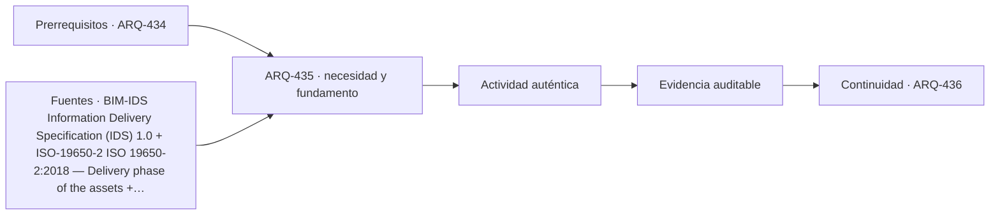

# ARQ-435 · Interferencias y comprobaciones basadas en reglas

**Parte 44 · Clase desarrollada · Incorporada en v0.25.0.**

Prerrequisitos conceptuales: ARQ-434. Sin calendario. Los casos, cantidades, algoritmos e indicadores son didácticos y ficticios salvo antecedentes expresamente atribuidos. No constituyen certificación BIM, ACV conforme, auditoría, especificación contractual ni habilitación profesional. Revisión externa especializada pendiente.

## Pregunta central

¿Cómo automatizar controles sin convertir una regla estrecha en una afirmación general sobre la calidad del proyecto?

## Resultado y continuidad

ARQ-435 recibe la lógica de ARQ-434; cualquier parámetro nuevo se identifica como caso propio y no modifica retrospectivamente el capítulo anterior. Elaborarás una estructura de evidencia, resolverás un caso reproducible, contrastarás una variante y cerrarás distinguiendo dato, requisito, interpretación y pendiente.

## 1. Definir la pregunta y el uso

Una interferencia geométrica responde a una condición formal: dos volúmenes se superponen bajo tolerancias y versiones dadas. Puede detectar choques, pero no comprende por sí sola montaje, mantenimiento, acceso o secuencia.

## 2. Información que debe conservar significado

Las reglas de información funcionan mejor cuando expresan requisitos observables: entidad, clasificación, propiedad, unidad y valor esperado. IDS permite definir requisitos alfanuméricos interpretables por máquinas; según buildingSMART, no cubre por sí solo aspectos geométricos.

## 3. Estados, versiones y fronteras

Los falsos positivos y negativos deben registrarse. Una penetración intencional puede aparecer como choque; una separación mínima crítica puede no generar intersección. El criterio debe indicar tolerancia y tipo de relación que se busca.

## 4. Comprobación antes de automatizar

La salida automatizada necesita juicio humano y trazabilidad. “0 incidencias abiertas” solo significa que el conjunto de incidencias gestionadas llegó a cierto estado; no demuestra que se hayan definido todas las reglas necesarias.

## 5. Caso trabajado

Caso RULE-01: una comprobación alfanumérica revisa 20 muros y exige clasificación y FireRating. Dieciocho cumplen ambos; uno carece de clasificación y otro tiene un valor fuera del conjunto permitido. Paralelamente, el control geométrico detecta siete choques: cuatro son penetraciones intencionales documentadas, dos conflictos reales y uno queda pendiente. No corresponde sumar 18/20 y 4/7 en un “índice BIM”. Son controles con denominadores, propósitos y estados distintos.

## 6. Profundización: de una cifra a una decisión auditable

La comprobación no termina cuando una suma cierra. Debe poder reconstruirse la **procedencia** de cada entrada, la **unidad**, la **versión** y la **frontera** a la que pertenece. Cuando dos resultados se comparan, ambos deben responder a la misma pregunta o la diferencia debe explicarse antes de concluir.

Una segunda comprobación útil cambia una sola hipótesis. Si el resultado cambia mucho, la decisión es sensible a ese dato; si cambia poco, puede ser más importante investigar otra variable. Sensibilidad no significa probabilidad: los escenarios del curso no inventan distribuciones estadísticas cuando no hay datos.

También se conserva el estado desconocido. En información digital, un campo ausente no es cero; en una comparación ambiental, un módulo no reportado no es impacto nulo; en un control de reglas, una condición no comprobada no se transforma en aprobación. Esta disciplina impide que un tablero visualmente “verde” o una tabla aparentemente completa oculte huecos relevantes.

## 7. Interfaces profesionales y control de cambios

Arquitectura, ingeniería, construcción, operación, datos y sostenibilidad pueden utilizar el mismo objeto con propósitos diferentes. El registro debe indicar quién origina una propiedad, quién la revisa, para qué uso se acepta y qué modificación obliga a reabrir la evidencia. Un cambio de geometría puede afectar cantidad, cronograma y análisis ambiental; un cambio de producto puede afectar propiedades, documentación y mantenimiento.

El control de cambios no exige repetir indiscriminadamente todo. Exige rastrear dependencias y justificar qué permanece válido. Si un identificador, versión o fuente cambia, los documentos dependientes deben revisarse de forma proporcional al efecto. Conservar la base anterior permite entender la evolución y evita reemplazar silenciosamente resultados desfavorables.

## 8. Errores frecuentes

Evita confundir presencia de información con validez; formato abierto con interoperabilidad garantizada; automatización con verificación completa; clasificación con desempeño; archivo entregado con activo operable; EPD con superioridad ambiental; carbono con sostenibilidad total; y certificación con cumplimiento de todas las dimensiones del proyecto.

Otro error es sumar porcentajes o indicadores que tienen denominadores distintos. Antes de combinar valores, escribe sus unidades, población u objeto, horizonte y criterio. Cuando no existe una conversión defendible, presenta los resultados en paralelo y explica el conflicto en lugar de fabricar una puntuación universal.

*Figura 435. Esquema original del programa. Resume relaciones del caso; no representa una obra, producto o certificación real.*

## 9. Práctica independiente

Define una regla alfanumérica para diez objetos y una regla geométrica para cinco encuentros. Introduce una excepción autorizada y un dato desconocido. Reporta resultados sin borrar la excepción ni convertir el desconocido en fallo o aprobación.

10. Solución razonada

Los resultados deben separar cumplimiento, excepción registrada, conflicto y pendiente. Una excepción no cuenta como cumplimiento de la regla original; queda aceptada por otro mecanismo. Lo desconocido mantiene una acción pendiente.

La solución pertenece únicamente al modelo declarado. En un proyecto real deben verificarse fuentes, contratos de información, software, reglas de intercambio, declaraciones ambientales, datos de producto, legislación, autorizaciones y responsabilidades aplicables. Una ficha pública de norma no equivale a la lectura completa de sus cláusulas.

## 11. Autoevaluación y transferencia

Puedes avanzar cuando seas capaz de reconstruir el caso sin mirar la respuesta, nombrar al menos una condición que el cálculo no verifica y explicar qué actor debería producir la evidencia pendiente. Si solo puedes repetir el porcentaje final, el aprendizaje está incompleto.

La clase siguiente conserva el **método**, no las cifras. Las familias de casos permanecen separadas para que un valor didáctico no reaparezca como antecedente de otro proyecto.

<!-- pedagogia-2026:inicio -->
## Decisión pedagógica y posición curricular

### Por qué existe

Esta clase existe para resolver una necesidad concreta del recorrido: ¿Cómo automatizar controles sin convertir una regla estrecha en una afirmación general sobre la calidad del proyecto?

### Por qué está exactamente aquí

Ocupa el lugar 5 de la Parte 44. Se estudia después de ARQ-434 · IFC, clasificación y datos de objetos porque usa esa base para responder «¿Cómo automatizar controles sin convertir una regla estrecha en una afirmación general sobre la calidad del proyecto?». Se ubica antes de ARQ-436 · Modelos 4D, 5D y vínculo con obra porque la evidencia producida aquí debe estar disponible para ese paso.

- **Prerrequisitos:** `ARQ-434`
- **Capacidad que introduce:** ARQ-435 recibe la lógica de ARQ-434; cualquier parámetro nuevo se identifica como caso propio y no modifica retrospectivamente el capítulo anterior. Elaborarás una estructura de evidencia, resolverás un caso reproducible, contrastarás una variante y cerrarás distinguiendo dato, requisito, interpretación y pendiente.
- **Clases o experiencias que dependen de ella:** `ARQ-436`

El diagrama permite comprobar una relación que el texto lineal oculta con facilidad: esta clase recibe capacidades previas, toma decisiones apoyadas por fuentes, exige una experiencia y produce evidencia que habilita trabajo posterior. No representa un procedimiento de obra.

## Resultado observable, evidencia y evaluación

1. Identificar y delimitar las condiciones necesarias para responder la pregunta central de interferencias y comprobaciones basadas en reglas.
2. Producir y comprobar la evidencia declarada por la clase: ARQ-435 recibe la lógica de ARQ-434; cualquier parámetro nuevo se identifica como caso propio y no modifica retrospectivamente el capítulo anterior. Elaborarás una estructura de evidencia, resolverás un caso reproducible, contrastarás una variante y cerrarás distinguiendo dato, requisito, interpretación y pendiente.
3. Justificar una decisión de interferencias y comprobaciones basadas en reglas mediante fuentes, supuestos, alternativas y límites explícitos.

## Actividad, evidencia y criterio de aceptación

**Actividad:** Define una regla alfanumérica para diez objetos y una regla geométrica para cinco encuentros. Introduce una excepción autorizada y un dato desconocido. Reporta resultados sin borrar la excepción ni convertir el desconocido en fallo o aprobación.

**Evidencia mínima:** ARQ-435 recibe la lógica de ARQ-434; cualquier parámetro nuevo se identifica como caso propio y no modifica retrospectivamente el capítulo anterior. Elaborarás una estructura de evidencia, resolverás un caso reproducible, contrastarás una variante y cerrarás distinguiendo dato, requisito, interpretación y pendiente.

**Archivo sugerido:** `evidence/ARQ-435/evidencia.md`.

**Criterio de aceptación:** la entrega se acepta cuando:

- La entrega responde explícitamente a la pregunta: ¿Cómo automatizar controles sin convertir una regla estrecha en una afirmación general sobre la calidad del proyecto?
- La actividad conserva las fronteras del caso y permite reconstruir el procedimiento: Define una regla alfanumérica para diez objetos y una regla geométrica para cinco encuentros. Introduce una excepción autorizada y un dato desconocido. Reporta resultados sin borrar la excepción ni convertir el desconocido en fallo o aprobación.
- Cada afirmación externa puede seguirse hasta una fuente, su alcance consultado y su límite.
- La evidencia deja disponible una entrada comprobable para ARQ-436.
- Evita confundir presencia de información con validez; formato abierto con interoperabilidad garantizada; automatización con verificación completa; clasificación con desempeño; archivo entregado con activo operable; EPD con superioridad ambiental; carbono con sostenibilidad total; y certificación con cumplimiento de todas las dimensiones del proyecto. Otro error es sumar porcentajes o indicadores que tienen denominadores distintos.

La [rúbrica común](../../docs/RUBRICA_COMUN.md) complementa estos criterios; no los reemplaza. Una entrega puede superar un promedio y continuar pendiente si oculta una condición crítica.

## Trazabilidad de las decisiones

| # | Decisión o fundamento | Fuente utilizada | Aplicación y límite en esta clase |
|---:|---|---|---|
| 1 | Requisitos de intercambio legibles por personas y máquinas y comprobación automatizada de información alfanumérica en IFC. | [BIM-IDS Information Delivery Specification (IDS) 1.0](https://www.buildingsmart.org/standards/bsi-standards/information-delivery-specification-ids/) | Consulta: Página oficial del estándar y documentación pública; IDS 1.0 figura como estándar final desde 2024. Límite: IDS no cubre por sí solo comprobaciones geométricas; no se implementa aquí un archivo contractual real. |
| 2 | Gestión de información durante la entrega del proyecto | [ISO-19650-2 ISO 19650-2:2018 — Delivery phase of the assets](https://www.iso.org/standard/68080.html) | Consulta: Ficha pública; edición publicada con revisión en curso Límite: Un proyecto de revisión no reemplaza por sí solo la edición publicada. Texto íntegro no consultado. |
| 3 | Distinguir conformidad con requisitos de adecuación al uso | [Organismo: National Aeronautics and Space Administration. Consulta:…](https://www.nasa.gov/reference/5-0-product-realization/) | Consulta: Apartados web de verificación y validación Límite: La verificación de cálculos no constituye validación de un edificio. |

La tabla permite auditar las relaciones; la explicación, el caso y la práctica de la clase siguen siendo la documentación principal.

## Autoevaluación, recuperación y continuidad

### Errores diagnósticos

Antes de avanzar, comprueba si puedes reconstruir cada resultado sin mirar la solución, señalar qué evidencia lo sostiene y nombrar una condición que obligaría a revisar tu decisión. Conserva la primera versión, la objeción recibida y la revisión.

**Conexión siguiente:** La continuidad inmediata es ARQ-436 · Modelos 4D, 5D y vínculo con obra; conserva el método y vuelve a verificar datos y límites.
<!-- pedagogia-2026:fin -->

## Fuentes y alcance de uso

### [[BIM-IDS]](#FUENTE-BIM-IDS) Information Delivery Specification (IDS) 1.0

buildingSMART International. [https://www.buildingsmart.org/standards/bsi-standards/information-delivery-specification-ids/](https://www.buildingsmart.org/standards/bsi-standards/information-delivery-specification-ids/)

**Consulta:** Página oficial del estándar y documentación pública; IDS 1.0 figura como estándar final desde 2024. **Apoyo:** Requisitos de intercambio legibles por personas y máquinas y comprobación automatizada de información alfanumérica en IFC. **Límite:** IDS no cubre por sí solo comprobaciones geométricas; no se implementa aquí un archivo contractual real.

### [[ISO-19650-2]](#FUENTE-ISO-19650-2) ISO 19650-2:2018 — Delivery phase of the assets

ISO. [https://www.iso.org/standard/68080.html](https://www.iso.org/standard/68080.html)

**Consulta:** Ficha pública; edición publicada con revisión en curso **Apoyo:** Gestión de información durante la entrega del proyecto **Límite:** Un proyecto de revisión no reemplaza por sí solo la edición publicada. Texto íntegro no consultado.

### [[NASA-VERIFY]](#FUENTE-NASA-VERIFY) NASA Systems Engineering Handbook, 5.0: Product Realization

National Aeronautics and Space Administration. [https://www.nasa.gov/reference/5-0-product-realization/](https://www.nasa.gov/reference/5-0-product-realization/)

**Consulta:** Apartados web de verificación y validación **Apoyo:** Distinguir conformidad con requisitos de adecuación al uso **Límite:** La verificación de cálculos no constituye validación de un edificio.
