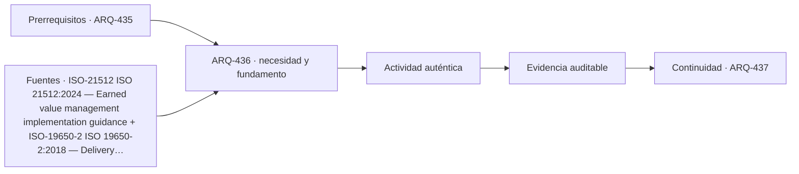

# ARQ-436 · Modelos 4D, 5D y vínculo con obra

**Parte 44 · Clase desarrollada · Incorporada en v0.25.0.**

Prerrequisitos conceptuales: ARQ-435. Sin calendario. Los casos, cantidades, algoritmos e indicadores son didácticos y ficticios salvo antecedentes expresamente atribuidos. No constituyen certificación BIM, ACV conforme, auditoría, especificación contractual ni habilitación profesional. Revisión externa especializada pendiente.

## Pregunta central

¿Qué cambia cuando tiempo y costo se enlazan a objetos del modelo, y qué errores aparecen si se confunde vínculo con realidad ejecutada?

## Resultado y continuidad

ARQ-436 recibe la lógica de ARQ-435; cualquier parámetro nuevo se identifica como caso propio y no modifica retrospectivamente el capítulo anterior. Elaborarás una estructura de evidencia, resolverás un caso reproducible, contrastarás una variante y cerrarás distinguiendo dato, requisito, interpretación y pendiente.

## 1. Definir la pregunta y el uso

4D relaciona información espacial con actividades o estados temporales; 5D añade relaciones económicas según la convención del proyecto. Ninguno convierte automáticamente un modelo en cronograma o presupuesto contractual: necesita correspondencia explícita entre objetos y paquetes de trabajo.

## 2. Información que debe conservar significado

La granularidad debe ser compatible. Si una actividad construye un muro por sectores, enlazarla a un único objeto de toda la planta puede impedir representar estados intermedios. Dividir demasiado también aumenta mantenimiento de enlaces.

## 3. Estados, versiones y fronteras

Los cambios requieren sincronización. Una revisión geométrica puede crear o eliminar objetos; si los vínculos temporales y económicos permanecen apuntando a identificadores obsoletos, los gráficos pueden verse completos y estar desactualizados.

## 4. Comprobación antes de automatizar

La comparación entre plan y avance necesita evidencia de obra. Pintar de verde un objeto porque la fecha llegó no demuestra ejecución, calidad ni aceptación.

## 5. Caso trabajado

Caso 4D5D-01: cuatro paquetes P1–P4 valen 100, 120, 80 y 100 unidades. A la fecha de corte se han ejecutado físicamente 100 %, 50 %, 0 % y 25 %. El “valor físico” didáctico es 100+60+0+25=185, no 400 ni 46,25 % de “calidad”. Si el modelo marca P2 completo por fecha programada, la visualización exagera 60 unidades de trabajo respecto de la evidencia física adoptada.

## 6. Profundización: de una cifra a una decisión auditable

La comprobación no termina cuando una suma cierra. Debe poder reconstruirse la **procedencia** de cada entrada, la **unidad**, la **versión** y la **frontera** a la que pertenece. Cuando dos resultados se comparan, ambos deben responder a la misma pregunta o la diferencia debe explicarse antes de concluir.

Una segunda comprobación útil cambia una sola hipótesis. Si el resultado cambia mucho, la decisión es sensible a ese dato; si cambia poco, puede ser más importante investigar otra variable. Sensibilidad no significa probabilidad: los escenarios del curso no inventan distribuciones estadísticas cuando no hay datos.

También se conserva el estado desconocido. En información digital, un campo ausente no es cero; en una comparación ambiental, un módulo no reportado no es impacto nulo; en un control de reglas, una condición no comprobada no se transforma en aprobación. Esta disciplina impide que un tablero visualmente “verde” o una tabla aparentemente completa oculte huecos relevantes.

## 7. Interfaces profesionales y control de cambios

Arquitectura, ingeniería, construcción, operación, datos y sostenibilidad pueden utilizar el mismo objeto con propósitos diferentes. El registro debe indicar quién origina una propiedad, quién la revisa, para qué uso se acepta y qué modificación obliga a reabrir la evidencia. Un cambio de geometría puede afectar cantidad, cronograma y análisis ambiental; un cambio de producto puede afectar propiedades, documentación y mantenimiento.

El control de cambios no exige repetir indiscriminadamente todo. Exige rastrear dependencias y justificar qué permanece válido. Si un identificador, versión o fuente cambia, los documentos dependientes deben revisarse de forma proporcional al efecto. Conservar la base anterior permite entender la evolución y evita reemplazar silenciosamente resultados desfavorables.

## 8. Errores frecuentes

Evita confundir presencia de información con validez; formato abierto con interoperabilidad garantizada; automatización con verificación completa; clasificación con desempeño; archivo entregado con activo operable; EPD con superioridad ambiental; carbono con sostenibilidad total; y certificación con cumplimiento de todas las dimensiones del proyecto.

Otro error es sumar porcentajes o indicadores que tienen denominadores distintos. Antes de combinar valores, escribe sus unidades, población u objeto, horizonte y criterio. Cuando no existe una conversión defendible, presenta los resultados en paralelo y explica el conflicto en lugar de fabricar una puntuación universal.

*Figura 436. Esquema original del programa. Resume relaciones del caso; no representa una obra, producto o certificación real.*

## 9. Práctica independiente

Con tres paquetes de valores 200, 100 y 300 y avances 75 %, 100 % y 20 %, calcula el valor físico didáctico. Después explica qué datos adicionales necesitarías para llamarlo valor ganado contractual.

10. Solución razonada

El valor físico del ejercicio es 150+100+60=310. No es valor ganado contractual sin línea base, reglas de reconocimiento, fecha de corte y estructura acordadas. El vínculo visual no sustituye esas definiciones.

La solución pertenece únicamente al modelo declarado. En un proyecto real deben verificarse fuentes, contratos de información, software, reglas de intercambio, declaraciones ambientales, datos de producto, legislación, autorizaciones y responsabilidades aplicables. Una ficha pública de norma no equivale a la lectura completa de sus cláusulas.

## 11. Autoevaluación y transferencia

Puedes avanzar cuando seas capaz de reconstruir el caso sin mirar la respuesta, nombrar al menos una condición que el cálculo no verifica y explicar qué actor debería producir la evidencia pendiente. Si solo puedes repetir el porcentaje final, el aprendizaje está incompleto.

La clase siguiente conserva el **método**, no las cifras. Las familias de casos permanecen separadas para que un valor didáctico no reaparezca como antecedente de otro proyecto.

<!-- pedagogia-2026:inicio -->
## Decisión pedagógica y posición curricular

### Por qué existe

Esta clase existe para resolver una necesidad concreta del recorrido: ¿Qué cambia cuando tiempo y costo se enlazan a objetos del modelo, y qué errores aparecen si se confunde vínculo con realidad ejecutada?

### Por qué está exactamente aquí

Ocupa el lugar 6 de la Parte 44. Se estudia después de ARQ-435 · Interferencias y comprobaciones basadas en reglas porque usa esa base para responder «¿Qué cambia cuando tiempo y costo se enlazan a objetos del modelo, y qué errores aparecen si se confunde vínculo con realidad ejecutada?». Se ubica antes de ARQ-437 · SIG, BIM y contexto territorial porque la evidencia producida aquí debe estar disponible para ese paso.

- **Prerrequisitos:** `ARQ-435`
- **Capacidad que introduce:** ARQ-436 recibe la lógica de ARQ-435; cualquier parámetro nuevo se identifica como caso propio y no modifica retrospectivamente el capítulo anterior. Elaborarás una estructura de evidencia, resolverás un caso reproducible, contrastarás una variante y cerrarás distinguiendo dato, requisito, interpretación y pendiente.
- **Clases o experiencias que dependen de ella:** `ARQ-437`

El diagrama permite comprobar una relación que el texto lineal oculta con facilidad: esta clase recibe capacidades previas, toma decisiones apoyadas por fuentes, exige una experiencia y produce evidencia que habilita trabajo posterior. No representa un procedimiento de obra.

## Resultado observable, evidencia y evaluación

1. Identificar y delimitar las condiciones necesarias para responder la pregunta central de modelos 4d, 5d y vínculo con obra.
2. Producir y comprobar la evidencia declarada por la clase: ARQ-436 recibe la lógica de ARQ-435; cualquier parámetro nuevo se identifica como caso propio y no modifica retrospectivamente el capítulo anterior. Elaborarás una estructura de evidencia, resolverás un caso reproducible, contrastarás una variante y cerrarás distinguiendo dato, requisito, interpretación y pendiente.
3. Justificar una decisión de modelos 4d, 5d y vínculo con obra mediante fuentes, supuestos, alternativas y límites explícitos.

## Actividad, evidencia y criterio de aceptación

**Actividad:** Con tres paquetes de valores 200, 100 y 300 y avances 75 %, 100 % y 20 %, calcula el valor físico didáctico. Después explica qué datos adicionales necesitarías para llamarlo valor ganado contractual.

**Evidencia mínima:** ARQ-436 recibe la lógica de ARQ-435; cualquier parámetro nuevo se identifica como caso propio y no modifica retrospectivamente el capítulo anterior. Elaborarás una estructura de evidencia, resolverás un caso reproducible, contrastarás una variante y cerrarás distinguiendo dato, requisito, interpretación y pendiente.

**Archivo sugerido:** `evidence/ARQ-436/evidencia.md`.

**Criterio de aceptación:** la entrega se acepta cuando:

- La entrega responde explícitamente a la pregunta: ¿Qué cambia cuando tiempo y costo se enlazan a objetos del modelo, y qué errores aparecen si se confunde vínculo con realidad ejecutada?
- La actividad conserva las fronteras del caso y permite reconstruir el procedimiento: Con tres paquetes de valores 200, 100 y 300 y avances 75 %, 100 % y 20 %, calcula el valor físico didáctico. Después explica qué datos adicionales necesitarías para llamarlo valor ganado contractual.
- Cada afirmación externa puede seguirse hasta una fuente, su alcance consultado y su límite.
- La evidencia deja disponible una entrada comprobable para ARQ-437.
- Evita confundir presencia de información con validez; formato abierto con interoperabilidad garantizada; automatización con verificación completa; clasificación con desempeño; archivo entregado con activo operable; EPD con superioridad ambiental; carbono con sostenibilidad total; y certificación con cumplimiento de todas las dimensiones del proyecto. Otro error es sumar porcentajes o indicadores que tienen denominadores distintos.

La [rúbrica común](../../docs/RUBRICA_COMUN.md) complementa estos criterios; no los reemplaza. Una entrega puede superar un promedio y continuar pendiente si oculta una condición crítica.

## Trazabilidad de las decisiones

| # | Decisión o fundamento | Fuente utilizada | Aplicación y límite en esta clase |
|---:|---|---|---|
| 1 | Relacionar alcance, avance, costo y valor ganado sin confundir indicadores con producción física. | [ISO-21512 ISO 21512:2024 — Earned value management implementation…](https://www.iso.org/standard/63584.html) | Consulta: Ficha pública; edición 2024, versión corregida 2025 y enmienda publicada en 2026. Límite: No se implementa la norma completa ni se convierten indicadores educativos en certificación de desempeño. |
| 2 | Gestión de información durante la entrega del proyecto | [ISO-19650-2 ISO 19650-2:2018 — Delivery phase of the assets](https://www.iso.org/standard/68080.html) | Consulta: Ficha pública; edición publicada con revisión en curso Límite: Un proyecto de revisión no reemplaza por sí solo la edición publicada. Texto íntegro no consultado. |
| 3 | Marco de gestión de proyectos y relación entre prácticas, ciclo de vida y entregables. | [ISO-21502 ISO 21502:2020 — Project, programme and portfolio management…](https://www.iso.org/standard/74947.html) | Consulta: Ficha pública; edición 1 publicada 2020-12, actualmente en revisión sistemática. Límite: No se leyó íntegramente la norma; no se reproducen procesos ni se presenta como contrato o metodología obligatoria. |

La tabla permite auditar las relaciones; la explicación, el caso y la práctica de la clase siguen siendo la documentación principal.

## Autoevaluación, recuperación y continuidad

### Errores diagnósticos

Antes de avanzar, comprueba si puedes reconstruir cada resultado sin mirar la solución, señalar qué evidencia lo sostiene y nombrar una condición que obligaría a revisar tu decisión. Conserva la primera versión, la objeción recibida y la revisión.

**Conexión siguiente:** La continuidad inmediata es ARQ-437 · SIG, BIM y contexto territorial; conserva el método y vuelve a verificar datos y límites.
<!-- pedagogia-2026:fin -->

## Fuentes y alcance de uso

### [[ISO-21512]](#FUENTE-ISO-21512) ISO 21512:2024 — Earned value management implementation guidance

ISO. [https://www.iso.org/standard/63584.html](https://www.iso.org/standard/63584.html)

**Consulta:** Ficha pública; edición 2024, versión corregida 2025 y enmienda publicada en 2026. **Apoyo:** Relacionar alcance, avance, costo y valor ganado sin confundir indicadores con producción física. **Límite:** No se implementa la norma completa ni se convierten indicadores educativos en certificación de desempeño.

### [[ISO-19650-2]](#FUENTE-ISO-19650-2) ISO 19650-2:2018 — Delivery phase of the assets

ISO. [https://www.iso.org/standard/68080.html](https://www.iso.org/standard/68080.html)

**Consulta:** Ficha pública; edición publicada con revisión en curso **Apoyo:** Gestión de información durante la entrega del proyecto **Límite:** Un proyecto de revisión no reemplaza por sí solo la edición publicada. Texto íntegro no consultado.

### [[ISO-21502]](#FUENTE-ISO-21502) ISO 21502:2020 — Project, programme and portfolio management — Guidance on project management

ISO. [https://www.iso.org/standard/74947.html](https://www.iso.org/standard/74947.html)

**Consulta:** Ficha pública; edición 1 publicada 2020-12, actualmente en revisión sistemática. **Apoyo:** Marco de gestión de proyectos y relación entre prácticas, ciclo de vida y entregables. **Límite:** No se leyó íntegramente la norma; no se reproducen procesos ni se presenta como contrato o metodología obligatoria.
