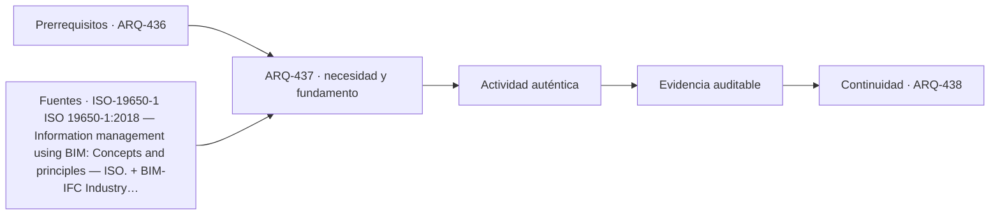

# ARQ-437 · SIG, BIM y contexto territorial

**Parte 44 · Clase desarrollada · Incorporada en v0.25.0.**

Prerrequisitos conceptuales: ARQ-436. Sin calendario. Los casos, cantidades, algoritmos e indicadores son didácticos y ficticios salvo antecedentes expresamente atribuidos. No constituyen certificación BIM, ACV conforme, auditoría, especificación contractual ni habilitación profesional. Revisión externa especializada pendiente.

## Pregunta central

¿Cómo relacionar modelos de edificio y datos territoriales sin perder referencia espacial, escala y procedencia?

## Resultado y continuidad

ARQ-437 recibe la lógica de ARQ-436; cualquier parámetro nuevo se identifica como caso propio y no modifica retrospectivamente el capítulo anterior. Elaborarás una estructura de evidencia, resolverás un caso reproducible, contrastarás una variante y cerrarás distinguiendo dato, requisito, interpretación y pendiente.

## 1. Definir la pregunta y el uso

BIM y SIG describen objetos y territorios con énfasis diferentes. Integrarlos exige coordinar sistemas de referencia, unidades, niveles de detalle y semántica. Desplazar un modelo “a ojo” para que coincida con un mapa elimina trazabilidad.

## 2. Información que debe conservar significado

La precisión útil depende de la decisión. Un mapa regional puede orientar exposición general y ser insuficiente para replantear una obra. Un levantamiento local puede ser preciso y no contener la red territorial necesaria para una evaluación urbana.

## 3. Estados, versiones y fronteras

Las transformaciones de coordenadas deben registrarse. Cambiar de un sistema local a uno georreferenciado no consiste en escribir otro nombre de CRS; los valores y, a veces, la época de referencia necesitan transformación coherente.

## 4. Comprobación antes de automatizar

La interoperabilidad territorial también es semántica: parcela, edificio, cobertura, eje vial y zona de amenaza no son solo polígonos. Cada capa requiere origen, fecha, escala y significado.

## 5. Caso trabajado

Caso GIS-BIM-01: un edificio local usa origen (0,0). Un punto de control del sitio corresponde en la capa territorial a (350000, 6295000). Para un ejercicio simplificado sin rotación se adopta una traslación fija; un segundo punto esperado queda a (350040,6295020), pero el modelo transformado entrega (350040,6295018). La discrepancia de 2 m indica que la hipótesis de traslación pura no reproduce ambos puntos. No se “corrige” moviendo solo el segundo objeto: se revisa la transformación.

## 6. Profundización: de una cifra a una decisión auditable

La comprobación no termina cuando una suma cierra. Debe poder reconstruirse la **procedencia** de cada entrada, la **unidad**, la **versión** y la **frontera** a la que pertenece. Cuando dos resultados se comparan, ambos deben responder a la misma pregunta o la diferencia debe explicarse antes de concluir.

Una segunda comprobación útil cambia una sola hipótesis. Si el resultado cambia mucho, la decisión es sensible a ese dato; si cambia poco, puede ser más importante investigar otra variable. Sensibilidad no significa probabilidad: los escenarios del curso no inventan distribuciones estadísticas cuando no hay datos.

También se conserva el estado desconocido. En información digital, un campo ausente no es cero; en una comparación ambiental, un módulo no reportado no es impacto nulo; en un control de reglas, una condición no comprobada no se transforma en aprobación. Esta disciplina impide que un tablero visualmente “verde” o una tabla aparentemente completa oculte huecos relevantes.

## 7. Interfaces profesionales y control de cambios

Arquitectura, ingeniería, construcción, operación, datos y sostenibilidad pueden utilizar el mismo objeto con propósitos diferentes. El registro debe indicar quién origina una propiedad, quién la revisa, para qué uso se acepta y qué modificación obliga a reabrir la evidencia. Un cambio de geometría puede afectar cantidad, cronograma y análisis ambiental; un cambio de producto puede afectar propiedades, documentación y mantenimiento.

El control de cambios no exige repetir indiscriminadamente todo. Exige rastrear dependencias y justificar qué permanece válido. Si un identificador, versión o fuente cambia, los documentos dependientes deben revisarse de forma proporcional al efecto. Conservar la base anterior permite entender la evolución y evita reemplazar silenciosamente resultados desfavorables.

## 8. Errores frecuentes

Evita confundir presencia de información con validez; formato abierto con interoperabilidad garantizada; automatización con verificación completa; clasificación con desempeño; archivo entregado con activo operable; EPD con superioridad ambiental; carbono con sostenibilidad total; y certificación con cumplimiento de todas las dimensiones del proyecto.

Otro error es sumar porcentajes o indicadores que tienen denominadores distintos. Antes de combinar valores, escribe sus unidades, población u objeto, horizonte y criterio. Cuando no existe una conversión defendible, presenta los resultados en paralelo y explica el conflicto en lugar de fabricar una puntuación universal.

*Figura 437. Esquema original del programa. Resume relaciones del caso; no representa una obra, producto o certificación real.*

## 9. Práctica independiente

Con dos puntos locales (0,0) y (30,10) y territoriales (1000,2000) y (1030,2008), comprueba si una traslación pura es suficiente. Explica la discrepancia.

10. Solución razonada

El primer punto sugiere traslación (+1000,+2000). Aplicada al segundo predice (1030,2010), dos metros por encima del dato territorial. La transformación necesita otra explicación: rotación, escala, datos erróneos o referencia distinta.

La solución pertenece únicamente al modelo declarado. En un proyecto real deben verificarse fuentes, contratos de información, software, reglas de intercambio, declaraciones ambientales, datos de producto, legislación, autorizaciones y responsabilidades aplicables. Una ficha pública de norma no equivale a la lectura completa de sus cláusulas.

## 11. Autoevaluación y transferencia

Puedes avanzar cuando seas capaz de reconstruir el caso sin mirar la respuesta, nombrar al menos una condición que el cálculo no verifica y explicar qué actor debería producir la evidencia pendiente. Si solo puedes repetir el porcentaje final, el aprendizaje está incompleto.

La clase siguiente conserva el **método**, no las cifras. Las familias de casos permanecen separadas para que un valor didáctico no reaparezca como antecedente de otro proyecto.

<!-- pedagogia-2026:inicio -->
## Decisión pedagógica y posición curricular

### Por qué existe

Esta clase existe para resolver una necesidad concreta del recorrido: ¿Cómo relacionar modelos de edificio y datos territoriales sin perder referencia espacial, escala y procedencia?

### Por qué está exactamente aquí

Ocupa el lugar 7 de la Parte 44. Se estudia después de ARQ-436 · Modelos 4D, 5D y vínculo con obra porque usa esa base para responder «¿Cómo relacionar modelos de edificio y datos territoriales sin perder referencia espacial, escala y procedencia?». Se ubica antes de ARQ-438 · Diseño paramétrico, automatización y validación porque la evidencia producida aquí debe estar disponible para ese paso.

- **Prerrequisitos:** `ARQ-436`
- **Capacidad que introduce:** ARQ-437 recibe la lógica de ARQ-436; cualquier parámetro nuevo se identifica como caso propio y no modifica retrospectivamente el capítulo anterior. Elaborarás una estructura de evidencia, resolverás un caso reproducible, contrastarás una variante y cerrarás distinguiendo dato, requisito, interpretación y pendiente.
- **Clases o experiencias que dependen de ella:** `ARQ-438`

El diagrama permite comprobar una relación que el texto lineal oculta con facilidad: esta clase recibe capacidades previas, toma decisiones apoyadas por fuentes, exige una experiencia y produce evidencia que habilita trabajo posterior. No representa un procedimiento de obra.

## Resultado observable, evidencia y evaluación

1. Identificar y delimitar las condiciones necesarias para responder la pregunta central de sig, bim y contexto territorial.
2. Producir y comprobar la evidencia declarada por la clase: ARQ-437 recibe la lógica de ARQ-436; cualquier parámetro nuevo se identifica como caso propio y no modifica retrospectivamente el capítulo anterior. Elaborarás una estructura de evidencia, resolverás un caso reproducible, contrastarás una variante y cerrarás distinguiendo dato, requisito, interpretación y pendiente.
3. Justificar una decisión de sig, bim y contexto territorial mediante fuentes, supuestos, alternativas y límites explícitos.

## Actividad, evidencia y criterio de aceptación

**Actividad:** Con dos puntos locales (0,0) y (30,10) y territoriales (1000,2000) y (1030,2008), comprueba si una traslación pura es suficiente. Explica la discrepancia.

**Evidencia mínima:** ARQ-437 recibe la lógica de ARQ-436; cualquier parámetro nuevo se identifica como caso propio y no modifica retrospectivamente el capítulo anterior. Elaborarás una estructura de evidencia, resolverás un caso reproducible, contrastarás una variante y cerrarás distinguiendo dato, requisito, interpretación y pendiente.

**Archivo sugerido:** `evidence/ARQ-437/evidencia.md`.

**Criterio de aceptación:** la entrega se acepta cuando:

- La entrega responde explícitamente a la pregunta: ¿Cómo relacionar modelos de edificio y datos territoriales sin perder referencia espacial, escala y procedencia?
- La actividad conserva las fronteras del caso y permite reconstruir el procedimiento: Con dos puntos locales (0,0) y (30,10) y territoriales (1000,2000) y (1030,2008), comprueba si una traslación pura es suficiente. Explica la discrepancia.
- Cada afirmación externa puede seguirse hasta una fuente, su alcance consultado y su límite.
- La evidencia deja disponible una entrada comprobable para ARQ-438.
- Evita confundir presencia de información con validez; formato abierto con interoperabilidad garantizada; automatización con verificación completa; clasificación con desempeño; archivo entregado con activo operable; EPD con superioridad ambiental; carbono con sostenibilidad total; y certificación con cumplimiento de todas las dimensiones del proyecto. Otro error es sumar porcentajes o indicadores que tienen denominadores distintos.

La [rúbrica común](../../docs/RUBRICA_COMUN.md) complementa estos criterios; no los reemplaza. Una entrega puede superar un promedio y continuar pendiente si oculta una condición crítica.

## Trazabilidad de las decisiones

| # | Decisión o fundamento | Fuente utilizada | Aplicación y límite en esta clase |
|---:|---|---|---|
| 1 | Principios de gestión de información de activos | [ISO-19650-1 ISO 19650-1:2018 — Information management using BIM:…](https://www.iso.org/standard/68078.html) | Consulta: Ficha pública Límite: No es licencia de software ni certificado automático de un modelo. |
| 2 | Interoperabilidad mediante un esquema abierto; versión IFC 4.3.2.0 | [BIM-IFC Industry Foundation Classes: IFC 4.3 / ISO 16739-1:2024](https://www.buildingsmart.org/standards/bsi-standards/industry-foundation-classes/) | Consulta: Página de estándar Límite: No garantiza soporte idéntico de todas las aplicaciones ni cumplimiento normativo del edificio. |

La tabla permite auditar las relaciones; la explicación, el caso y la práctica de la clase siguen siendo la documentación principal.

## Autoevaluación, recuperación y continuidad

### Errores diagnósticos

Antes de avanzar, comprueba si puedes reconstruir cada resultado sin mirar la solución, señalar qué evidencia lo sostiene y nombrar una condición que obligaría a revisar tu decisión. Conserva la primera versión, la objeción recibida y la revisión.

**Conexión siguiente:** La continuidad inmediata es ARQ-438 · Diseño paramétrico, automatización y validación; conserva el método y vuelve a verificar datos y límites.
<!-- pedagogia-2026:fin -->

## Fuentes y alcance de uso

### [[ISO-19650-1]](#FUENTE-ISO-19650-1) ISO 19650-1:2018 — Information management using BIM: Concepts and principles

ISO. [https://www.iso.org/standard/68078.html](https://www.iso.org/standard/68078.html)

**Consulta:** Ficha pública **Apoyo:** Principios de gestión de información de activos **Límite:** No es licencia de software ni certificado automático de un modelo.

### [[BIM-IFC]](#FUENTE-BIM-IFC) Industry Foundation Classes: IFC 4.3 / ISO 16739-1:2024

buildingSMART International. [https://www.buildingsmart.org/standards/bsi-standards/industry-foundation-classes/](https://www.buildingsmart.org/standards/bsi-standards/industry-foundation-classes/)

**Consulta:** Página de estándar **Apoyo:** Interoperabilidad mediante un esquema abierto; versión IFC 4.3.2.0 **Límite:** No garantiza soporte idéntico de todas las aplicaciones ni cumplimiento normativo del edificio.
