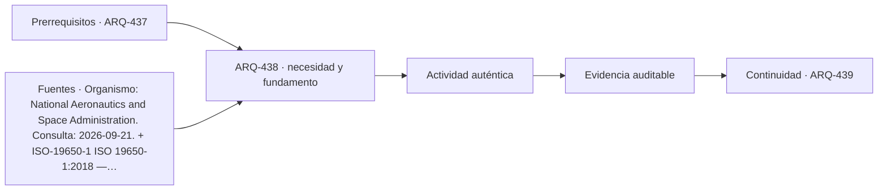

# ARQ-438 · Diseño paramétrico, automatización y validación

**Parte 44 · Clase desarrollada · Incorporada en v0.25.0.**

Prerrequisitos conceptuales: ARQ-437. Sin calendario. Los casos, cantidades, algoritmos e indicadores son didácticos y ficticios salvo antecedentes expresamente atribuidos. No constituyen certificación BIM, ACV conforme, auditoría, especificación contractual ni habilitación profesional. Revisión externa especializada pendiente.

## Pregunta central

¿Cómo usar reglas y código para generar alternativas sin confundir reproducibilidad con corrección del modelo de diseño?

## Resultado y continuidad

ARQ-438 recibe la lógica de ARQ-437; cualquier parámetro nuevo se identifica como caso propio y no modifica retrospectivamente el capítulo anterior. Elaborarás una estructura de evidencia, resolverás un caso reproducible, contrastarás una variante y cerrarás distinguiendo dato, requisito, interpretación y pendiente.

## 1. Definir la pregunta y el uso

Un modelo paramétrico hace explícitas relaciones entre entradas y salidas. Esa transparencia permite sensibilidad y repetición, pero también propaga errores con gran eficiencia si una relación está mal formulada.

## 2. Información que debe conservar significado

Las restricciones deben separarse de objetivos. Una alternativa puede optimizar área y violar una dimensión necesaria. La automatización no debe compensar una condición necesaria mediante una puntuación más alta en otra variable.

## 3. Estados, versiones y fronteras

La validación necesita casos conocidos y pruebas de borde. Si una fórmula funciona para valores ordinarios pero falla con cero, límite o signo contrario, la lógica no está terminada. Los tests de código no sustituyen validación del comportamiento arquitectónico.

## 4. Comprobación antes de automatizar

El control de versiones importa tanto como el algoritmo. Una salida reproducible requiere parámetros, versión de script, dependencias y datos de entrada.

## 5. Caso trabajado

Caso PAR-VALID-01: un generador produce rectángulos de área 120 m² con ancho w y largo 120/w. El objetivo auxiliar minimiza perímetro. Para w=8, 10, 12 y sqrt(120), los perímetros son 46, 44, 44 y aproximadamente 43,818. Pero el encargo exige ancho entre 8 y 10 m: el mínimo matemático global queda fuera. Dentro de la restricción, w=10 es el extremo admisible de menor perímetro. La lección distingue optimización de factibilidad.

## 6. Profundización: de una cifra a una decisión auditable

La comprobación no termina cuando una suma cierra. Debe poder reconstruirse la **procedencia** de cada entrada, la **unidad**, la **versión** y la **frontera** a la que pertenece. Cuando dos resultados se comparan, ambos deben responder a la misma pregunta o la diferencia debe explicarse antes de concluir.

Una segunda comprobación útil cambia una sola hipótesis. Si el resultado cambia mucho, la decisión es sensible a ese dato; si cambia poco, puede ser más importante investigar otra variable. Sensibilidad no significa probabilidad: los escenarios del curso no inventan distribuciones estadísticas cuando no hay datos.

También se conserva el estado desconocido. En información digital, un campo ausente no es cero; en una comparación ambiental, un módulo no reportado no es impacto nulo; en un control de reglas, una condición no comprobada no se transforma en aprobación. Esta disciplina impide que un tablero visualmente “verde” o una tabla aparentemente completa oculte huecos relevantes.

## 7. Interfaces profesionales y control de cambios

Arquitectura, ingeniería, construcción, operación, datos y sostenibilidad pueden utilizar el mismo objeto con propósitos diferentes. El registro debe indicar quién origina una propiedad, quién la revisa, para qué uso se acepta y qué modificación obliga a reabrir la evidencia. Un cambio de geometría puede afectar cantidad, cronograma y análisis ambiental; un cambio de producto puede afectar propiedades, documentación y mantenimiento.

El control de cambios no exige repetir indiscriminadamente todo. Exige rastrear dependencias y justificar qué permanece válido. Si un identificador, versión o fuente cambia, los documentos dependientes deben revisarse de forma proporcional al efecto. Conservar la base anterior permite entender la evolución y evita reemplazar silenciosamente resultados desfavorables.

## 8. Errores frecuentes

Evita confundir presencia de información con validez; formato abierto con interoperabilidad garantizada; automatización con verificación completa; clasificación con desempeño; archivo entregado con activo operable; EPD con superioridad ambiental; carbono con sostenibilidad total; y certificación con cumplimiento de todas las dimensiones del proyecto.

Otro error es sumar porcentajes o indicadores que tienen denominadores distintos. Antes de combinar valores, escribe sus unidades, población u objeto, horizonte y criterio. Cuando no existe una conversión defendible, presenta los resultados en paralelo y explica el conflicto en lugar de fabricar una puntuación universal.

*Figura 438. Esquema original del programa. Resume relaciones del caso; no representa una obra, producto o certificación real.*

## 9. Práctica independiente

Área 96 m², ancho permitido 6–8 m. Compara w=6, 8 y sqrt(96). Calcula perímetros y determina cuál es válido bajo la restricción.

10. Solución razonada

Los perímetros son 44, 40 y aproximadamente 39,596. sqrt(96)≈9,798 queda fuera; w=8 es la mejor de las alternativas admisibles comparadas. La automatización debe filtrar restricciones antes de declarar óptimo.

La solución pertenece únicamente al modelo declarado. En un proyecto real deben verificarse fuentes, contratos de información, software, reglas de intercambio, declaraciones ambientales, datos de producto, legislación, autorizaciones y responsabilidades aplicables. Una ficha pública de norma no equivale a la lectura completa de sus cláusulas.

## 11. Autoevaluación y transferencia

Puedes avanzar cuando seas capaz de reconstruir el caso sin mirar la respuesta, nombrar al menos una condición que el cálculo no verifica y explicar qué actor debería producir la evidencia pendiente. Si solo puedes repetir el porcentaje final, el aprendizaje está incompleto.

La clase siguiente conserva el **método**, no las cifras. Las familias de casos permanecen separadas para que un valor didáctico no reaparezca como antecedente de otro proyecto.

<!-- pedagogia-2026:inicio -->
## Decisión pedagógica y posición curricular

### Por qué existe

Esta clase existe para resolver una necesidad concreta del recorrido: ¿Cómo usar reglas y código para generar alternativas sin confundir reproducibilidad con corrección del modelo de diseño?

### Por qué está exactamente aquí

Ocupa el lugar 8 de la Parte 44. Se estudia después de ARQ-437 · SIG, BIM y contexto territorial porque usa esa base para responder «¿Cómo usar reglas y código para generar alternativas sin confundir reproducibilidad con corrección del modelo de diseño?». Se ubica antes de ARQ-439 · IA: alternativas, sesgos, privacidad y verificación humana porque la evidencia producida aquí debe estar disponible para ese paso.

- **Prerrequisitos:** `ARQ-437`
- **Capacidad que introduce:** ARQ-438 recibe la lógica de ARQ-437; cualquier parámetro nuevo se identifica como caso propio y no modifica retrospectivamente el capítulo anterior. Elaborarás una estructura de evidencia, resolverás un caso reproducible, contrastarás una variante y cerrarás distinguiendo dato, requisito, interpretación y pendiente.
- **Clases o experiencias que dependen de ella:** `ARQ-439`

El diagrama permite comprobar una relación que el texto lineal oculta con facilidad: esta clase recibe capacidades previas, toma decisiones apoyadas por fuentes, exige una experiencia y produce evidencia que habilita trabajo posterior. No representa un procedimiento de obra.

## Resultado observable, evidencia y evaluación

1. Identificar y delimitar las condiciones necesarias para responder la pregunta central de diseño paramétrico, automatización y validación.
2. Producir y comprobar la evidencia declarada por la clase: ARQ-438 recibe la lógica de ARQ-437; cualquier parámetro nuevo se identifica como caso propio y no modifica retrospectivamente el capítulo anterior. Elaborarás una estructura de evidencia, resolverás un caso reproducible, contrastarás una variante y cerrarás distinguiendo dato, requisito, interpretación y pendiente.
3. Justificar una decisión de diseño paramétrico, automatización y validación mediante fuentes, supuestos, alternativas y límites explícitos.

## Actividad, evidencia y criterio de aceptación

**Actividad:** Área 96 m², ancho permitido 6–8 m. Compara w=6, 8 y sqrt(96). Calcula perímetros y determina cuál es válido bajo la restricción.

**Evidencia mínima:** ARQ-438 recibe la lógica de ARQ-437; cualquier parámetro nuevo se identifica como caso propio y no modifica retrospectivamente el capítulo anterior. Elaborarás una estructura de evidencia, resolverás un caso reproducible, contrastarás una variante y cerrarás distinguiendo dato, requisito, interpretación y pendiente.

**Archivo sugerido:** `evidence/ARQ-438/evidencia.md`.

**Criterio de aceptación:** la entrega se acepta cuando:

- La entrega responde explícitamente a la pregunta: ¿Cómo usar reglas y código para generar alternativas sin confundir reproducibilidad con corrección del modelo de diseño?
- La actividad conserva las fronteras del caso y permite reconstruir el procedimiento: Área 96 m², ancho permitido 6–8 m. Compara w=6, 8 y sqrt(96). Calcula perímetros y determina cuál es válido bajo la restricción.
- Cada afirmación externa puede seguirse hasta una fuente, su alcance consultado y su límite.
- La evidencia deja disponible una entrada comprobable para ARQ-439.
- Evita confundir presencia de información con validez; formato abierto con interoperabilidad garantizada; automatización con verificación completa; clasificación con desempeño; archivo entregado con activo operable; EPD con superioridad ambiental; carbono con sostenibilidad total; y certificación con cumplimiento de todas las dimensiones del proyecto. Otro error es sumar porcentajes o indicadores que tienen denominadores distintos.

La [rúbrica común](../../docs/RUBRICA_COMUN.md) complementa estos criterios; no los reemplaza. Una entrega puede superar un promedio y continuar pendiente si oculta una condición crítica.

## Trazabilidad de las decisiones

| # | Decisión o fundamento | Fuente utilizada | Aplicación y límite en esta clase |
|---:|---|---|---|
| 1 | Distinguir conformidad con requisitos de adecuación al uso | [Organismo: National Aeronautics and Space Administration. Consulta:…](https://www.nasa.gov/reference/5-0-product-realization/) | Consulta: Apartados web de verificación y validación Límite: La verificación de cálculos no constituye validación de un edificio. |
| 2 | Principios de gestión de información de activos | [ISO-19650-1 ISO 19650-1:2018 — Information management using BIM:…](https://www.iso.org/standard/68078.html) | Consulta: Ficha pública Límite: No es licencia de software ni certificado automático de un modelo. |

La tabla permite auditar las relaciones; la explicación, el caso y la práctica de la clase siguen siendo la documentación principal.

## Autoevaluación, recuperación y continuidad

### Errores diagnósticos

Antes de avanzar, comprueba si puedes reconstruir cada resultado sin mirar la solución, señalar qué evidencia lo sostiene y nombrar una condición que obligaría a revisar tu decisión. Conserva la primera versión, la objeción recibida y la revisión.

**Conexión siguiente:** La continuidad inmediata es ARQ-439 · IA: alternativas, sesgos, privacidad y verificación humana; conserva el método y vuelve a verificar datos y límites.
<!-- pedagogia-2026:fin -->

## Fuentes y alcance de uso

### [[NASA-VERIFY]](#FUENTE-NASA-VERIFY) NASA Systems Engineering Handbook, 5.0: Product Realization

National Aeronautics and Space Administration. [https://www.nasa.gov/reference/5-0-product-realization/](https://www.nasa.gov/reference/5-0-product-realization/)

**Consulta:** Apartados web de verificación y validación **Apoyo:** Distinguir conformidad con requisitos de adecuación al uso **Límite:** La verificación de cálculos no constituye validación de un edificio.

### [[ISO-19650-1]](#FUENTE-ISO-19650-1) ISO 19650-1:2018 — Information management using BIM: Concepts and principles

ISO. [https://www.iso.org/standard/68078.html](https://www.iso.org/standard/68078.html)

**Consulta:** Ficha pública **Apoyo:** Principios de gestión de información de activos **Límite:** No es licencia de software ni certificado automático de un modelo.
