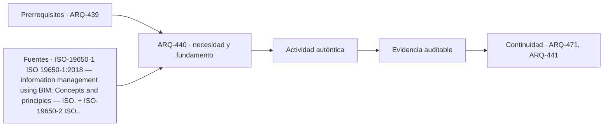

# ARQ-440 · Entrega digital, archivo y datos para operar

**Parte 44 · Clase desarrollada · Incorporada en v0.25.0.**

Prerrequisitos conceptuales: ARQ-439. Sin calendario. Los casos, cantidades, algoritmos e indicadores son didácticos y ficticios salvo antecedentes expresamente atribuidos. No constituyen certificación BIM, ACV conforme, auditoría, especificación contractual ni habilitación profesional. Revisión externa especializada pendiente.

## Pregunta central

¿Qué debe sobrevivir a la entrega para que el activo pueda operarse, mantenerse y comprenderse años después?

## Resultado y continuidad

ARQ-440 recibe la lógica de ARQ-439; cualquier parámetro nuevo se identifica como caso propio y no modifica retrospectivamente el capítulo anterior. Elaborarás una estructura de evidencia, resolverás un caso reproducible, contrastarás una variante y cerrarás distinguiendo dato, requisito, interpretación y pendiente.

## 1. Definir la pregunta y el uso

La entrega digital necesita seleccionar información útil para la operación, no archivar indiscriminadamente todo lo producido. Deben conservarse identidad, configuración ejecutada, manuales, garantías, criterios de mantenimiento y relaciones entre documentos.

## 2. Información que debe conservar significado

Archivo y copia no son lo mismo. Un repositorio histórico requiere metadatos, formatos legibles, integridad y reglas de retención. Un archivo binario existente pero imposible de abrir o interpretar no cumple su función.

## 3. Estados, versiones y fronteras

La transición entre proyecto y operación necesita reconciliar “propuesto”, “instalado” y “aceptado”. Un objeto modelado puede no haberse instalado; un equipo instalado puede haber cambiado de marca; la entrega debe representar el estado pertinente y conservar antecedentes.

## 4. Comprobación antes de automatizar

La información también envejece. Cambios de operación deben actualizar el registro para que una entrega inicial no se trate como verdad permanente.

## 5. Caso trabajado

Caso HANDOVER-01: se esperan 50 activos. 48 tienen ID, 45 manual, 44 fecha de instalación y 42 los cuatro campos requeridos (ID, ubicación, manual y fecha). Además, dos manuales están vinculados a revisiones sustituidas. La “presencia de manual” es 90 %, pero solo 40/50 activos tienen el paquete válido completo después de descontar esos vínculos obsoletos: 80 %. El caso demuestra que existencia, vigencia y utilidad son controles diferentes.

## 6. Profundización: de una cifra a una decisión auditable

La comprobación no termina cuando una suma cierra. Debe poder reconstruirse la **procedencia** de cada entrada, la **unidad**, la **versión** y la **frontera** a la que pertenece. Cuando dos resultados se comparan, ambos deben responder a la misma pregunta o la diferencia debe explicarse antes de concluir.

Una segunda comprobación útil cambia una sola hipótesis. Si el resultado cambia mucho, la decisión es sensible a ese dato; si cambia poco, puede ser más importante investigar otra variable. Sensibilidad no significa probabilidad: los escenarios del curso no inventan distribuciones estadísticas cuando no hay datos.

También se conserva el estado desconocido. En información digital, un campo ausente no es cero; en una comparación ambiental, un módulo no reportado no es impacto nulo; en un control de reglas, una condición no comprobada no se transforma en aprobación. Esta disciplina impide que un tablero visualmente “verde” o una tabla aparentemente completa oculte huecos relevantes.

## 7. Interfaces profesionales y control de cambios

Arquitectura, ingeniería, construcción, operación, datos y sostenibilidad pueden utilizar el mismo objeto con propósitos diferentes. El registro debe indicar quién origina una propiedad, quién la revisa, para qué uso se acepta y qué modificación obliga a reabrir la evidencia. Un cambio de geometría puede afectar cantidad, cronograma y análisis ambiental; un cambio de producto puede afectar propiedades, documentación y mantenimiento.

El control de cambios no exige repetir indiscriminadamente todo. Exige rastrear dependencias y justificar qué permanece válido. Si un identificador, versión o fuente cambia, los documentos dependientes deben revisarse de forma proporcional al efecto. Conservar la base anterior permite entender la evolución y evita reemplazar silenciosamente resultados desfavorables.

## 8. Errores frecuentes

Evita confundir presencia de información con validez; formato abierto con interoperabilidad garantizada; automatización con verificación completa; clasificación con desempeño; archivo entregado con activo operable; EPD con superioridad ambiental; carbono con sostenibilidad total; y certificación con cumplimiento de todas las dimensiones del proyecto.

Otro error es sumar porcentajes o indicadores que tienen denominadores distintos. Antes de combinar valores, escribe sus unidades, población u objeto, horizonte y criterio. Cuando no existe una conversión defendible, presenta los resultados en paralelo y explica el conflicto en lugar de fabricar una puntuación universal.

*Figura 440. Esquema original del programa. Resume relaciones del caso; no representa una obra, producto o certificación real.*

## 9. Práctica independiente

Para 25 activos, 24 tienen ID, 23 ubicación, 22 manual y 20 paquete completo. Dos de los 20 manuales están obsoletos. Calcula presencia por campo y paquete válido.

10. Solución razonada

ID 96 %, ubicación 92 %, manual 88 %. Paquete completo 80 %, pero paquete válido 18/25=72 %. No se promedia 96,92 y88 para representar capacidad de mantenimiento.

La solución pertenece únicamente al modelo declarado. En un proyecto real deben verificarse fuentes, contratos de información, software, reglas de intercambio, declaraciones ambientales, datos de producto, legislación, autorizaciones y responsabilidades aplicables. Una ficha pública de norma no equivale a la lectura completa de sus cláusulas.

## 11. Autoevaluación y transferencia

Puedes avanzar cuando seas capaz de reconstruir el caso sin mirar la respuesta, nombrar al menos una condición que el cálculo no verifica y explicar qué actor debería producir la evidencia pendiente. Si solo puedes repetir el porcentaje final, el aprendizaje está incompleto.

La clase siguiente conserva el **método**, no las cifras. Las familias de casos permanecen separadas para que un valor didáctico no reaparezca como antecedente de otro proyecto.

<!-- pedagogia-2026:inicio -->
## Decisión pedagógica y posición curricular

### Por qué existe

Esta clase existe para resolver una necesidad concreta del recorrido: ¿Qué debe sobrevivir a la entrega para que el activo pueda operarse, mantenerse y comprenderse años después?

### Por qué está exactamente aquí

Cierra la Parte 44: integra lo producido en ARQ-439 · IA: alternativas, sesgos, privacidad y verificación humana para responder «¿Qué debe sobrevivir a la entrega para que el activo pueda operarse, mantenerse y comprenderse años después?». La transición hacia ARQ-441 · Comparar impactos: unidad funcional, vida útil y límites transfiere el método y la disciplina de evidencia, no los datos o parámetros particulares de esta parte.

- **Prerrequisitos:** `ARQ-439`
- **Capacidad que introduce:** ARQ-440 recibe la lógica de ARQ-439; cualquier parámetro nuevo se identifica como caso propio y no modifica retrospectivamente el capítulo anterior. Elaborarás una estructura de evidencia, resolverás un caso reproducible, contrastarás una variante y cerrarás distinguiendo dato, requisito, interpretación y pendiente.
- **Clases o experiencias que dependen de ella:** `ARQ-471`, `ARQ-441`

El diagrama permite comprobar una relación que el texto lineal oculta con facilidad: esta clase recibe capacidades previas, toma decisiones apoyadas por fuentes, exige una experiencia y produce evidencia que habilita trabajo posterior. No representa un procedimiento de obra.

## Resultado observable, evidencia y evaluación

1. Identificar y delimitar las condiciones necesarias para responder la pregunta central de entrega digital, archivo y datos para operar.
2. Producir y comprobar la evidencia declarada por la clase: ARQ-440 recibe la lógica de ARQ-439; cualquier parámetro nuevo se identifica como caso propio y no modifica retrospectivamente el capítulo anterior. Elaborarás una estructura de evidencia, resolverás un caso reproducible, contrastarás una variante y cerrarás distinguiendo dato, requisito, interpretación y pendiente.
3. Justificar una decisión de entrega digital, archivo y datos para operar mediante fuentes, supuestos, alternativas y límites explícitos.

## Actividad, evidencia y criterio de aceptación

**Actividad:** Para 25 activos, 24 tienen ID, 23 ubicación, 22 manual y 20 paquete completo. Dos de los 20 manuales están obsoletos. Calcula presencia por campo y paquete válido.

**Evidencia mínima:** ARQ-440 recibe la lógica de ARQ-439; cualquier parámetro nuevo se identifica como caso propio y no modifica retrospectivamente el capítulo anterior. Elaborarás una estructura de evidencia, resolverás un caso reproducible, contrastarás una variante y cerrarás distinguiendo dato, requisito, interpretación y pendiente.

**Archivo sugerido:** `evidence/ARQ-440/evidencia.md`.

**Criterio de aceptación:** la entrega se acepta cuando:

- La entrega responde explícitamente a la pregunta: ¿Qué debe sobrevivir a la entrega para que el activo pueda operarse, mantenerse y comprenderse años después?
- La actividad conserva las fronteras del caso y permite reconstruir el procedimiento: Para 25 activos, 24 tienen ID, 23 ubicación, 22 manual y 20 paquete completo. Dos de los 20 manuales están obsoletos. Calcula presencia por campo y paquete válido.
- Cada afirmación externa puede seguirse hasta una fuente, su alcance consultado y su límite.
- La evidencia deja disponible una entrada comprobable para ARQ-471.
- Evita confundir presencia de información con validez; formato abierto con interoperabilidad garantizada; automatización con verificación completa; clasificación con desempeño; archivo entregado con activo operable; EPD con superioridad ambiental; carbono con sostenibilidad total; y certificación con cumplimiento de todas las dimensiones del proyecto. Otro error es sumar porcentajes o indicadores que tienen denominadores distintos.

La [rúbrica común](../../docs/RUBRICA_COMUN.md) complementa estos criterios; no los reemplaza. Una entrega puede superar un promedio y continuar pendiente si oculta una condición crítica.

## Trazabilidad de las decisiones

| # | Decisión o fundamento | Fuente utilizada | Aplicación y límite en esta clase |
|---:|---|---|---|
| 1 | Principios de gestión de información de activos | [ISO-19650-1 ISO 19650-1:2018 — Information management using BIM:…](https://www.iso.org/standard/68078.html) | Consulta: Ficha pública Límite: No es licencia de software ni certificado automático de un modelo. |
| 2 | Gestión de información durante la entrega del proyecto | [ISO-19650-2 ISO 19650-2:2018 — Delivery phase of the assets](https://www.iso.org/standard/68080.html) | Consulta: Ficha pública; edición publicada con revisión en curso Límite: Un proyecto de revisión no reemplaza por sí solo la edición publicada. Texto íntegro no consultado. |
| 3 | Plantillas de datos legibles por máquina para objetos durante el ciclo de vida. | [ISO-23387-2025 ISO 23387:2025 — Data templates for objects used in the…](https://www.iso.org/standard/85391.html) | Consulta: Ficha pública; edición 2 publicada en septiembre de 2025. Límite: No aporta el contenido de una plantilla concreta ni certifica un modelo. |

La tabla permite auditar las relaciones; la explicación, el caso y la práctica de la clase siguen siendo la documentación principal.

## Autoevaluación, recuperación y continuidad

### Errores diagnósticos

Antes de avanzar, comprueba si puedes reconstruir cada resultado sin mirar la solución, señalar qué evidencia lo sostiene y nombrar una condición que obligaría a revisar tu decisión. Conserva la primera versión, la objeción recibida y la revisión.

**Conexión siguiente:** La continuidad inmediata es ARQ-441 · Comparar impactos: unidad funcional, vida útil y límites; conserva el método y vuelve a verificar datos y límites.
<!-- pedagogia-2026:fin -->

## Fuentes y alcance de uso

### [[ISO-19650-1]](#FUENTE-ISO-19650-1) ISO 19650-1:2018 — Information management using BIM: Concepts and principles

ISO. [https://www.iso.org/standard/68078.html](https://www.iso.org/standard/68078.html)

**Consulta:** Ficha pública **Apoyo:** Principios de gestión de información de activos **Límite:** No es licencia de software ni certificado automático de un modelo.

### [[ISO-19650-2]](#FUENTE-ISO-19650-2) ISO 19650-2:2018 — Delivery phase of the assets

ISO. [https://www.iso.org/standard/68080.html](https://www.iso.org/standard/68080.html)

**Consulta:** Ficha pública; edición publicada con revisión en curso **Apoyo:** Gestión de información durante la entrega del proyecto **Límite:** Un proyecto de revisión no reemplaza por sí solo la edición publicada. Texto íntegro no consultado.

### [[ISO-23387-2025]](#FUENTE-ISO-23387-2025) ISO 23387:2025 — Data templates for objects used in the life cycle of assets

ISO. [https://www.iso.org/standard/85391.html](https://www.iso.org/standard/85391.html)

**Consulta:** Ficha pública; edición 2 publicada en septiembre de 2025. **Apoyo:** Plantillas de datos legibles por máquina para objetos durante el ciclo de vida. **Límite:** No aporta el contenido de una plantilla concreta ni certifica un modelo.
