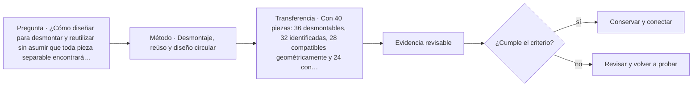

# ARQ-447 · Desmontaje, reúso y diseño circular

**Parte 45 · Clase desarrollada · Incorporada en v0.25.0.**

Prerrequisitos conceptuales: ARQ-446. Sin calendario. Los casos, cantidades, algoritmos e indicadores son didácticos y ficticios salvo antecedentes expresamente atribuidos. No constituyen certificación BIM, ACV conforme, auditoría, especificación contractual ni habilitación profesional. Revisión externa especializada pendiente.

## Pregunta central

¿Cómo diseñar para desmontar y reutilizar sin asumir que toda pieza separable encontrará automáticamente un segundo uso?

## Resultado y continuidad

ARQ-447 recibe la lógica de ARQ-446; cualquier parámetro nuevo se identifica como caso propio y no modifica retrospectivamente el capítulo anterior. Elaborarás una estructura de evidencia, resolverás un caso reproducible, contrastarás una variante y cerrarás distinguiendo dato, requisito, interpretación y pendiente.

## 1. Definir la pregunta y el uso

El diseño para desmontaje considera accesibilidad de uniones, secuencia, reversibilidad, identificación y daño potencial. Separabilidad técnica es condición útil, no garantía de reúso futuro.

## 2. Información que debe conservar significado

La reutilización necesita información sobre dimensiones, material, condición, historial y compatibilidad con el nuevo uso. Sin esa información, una pieza recuperada puede requerir ensayos o quedar fuera del alcance.

## 3. Estados, versiones y fronteras

Circularidad también incluye decisiones de sistema: capas con vidas diferentes pueden beneficiarse de independencia. Un adhesivo irreversible puede dificultar recuperar componentes aunque la geometría sea modular.

## 4. Comprobación antes de automatizar

Los escenarios de fin de vida deben evitar créditos automáticos. El destino real o metodológico necesita reglas; declarar “100 % reciclable” no significa 100 % reciclado.

## 5. Caso trabajado

Caso CIRC-01: un conjunto ficticio tiene 100 piezas. 90 pueden desmontarse sin rotura bajo el escenario; 80 quedan identificadas; 60 cumplen dimensiones para un segundo uso hipotético; 50 tienen evidencia suficiente de condición. La “desmontabilidad” es 90 %, pero el conjunto realmente preparado para la hipótesis de reúso es 50 %. Multiplicar porcentajes sin entender dependencia tampoco reemplaza el seguimiento pieza a pieza.

## 6. Profundización: de una cifra a una decisión auditable

La comprobación no termina cuando una suma cierra. Debe poder reconstruirse la **procedencia** de cada entrada, la **unidad**, la **versión** y la **frontera** a la que pertenece. Cuando dos resultados se comparan, ambos deben responder a la misma pregunta o la diferencia debe explicarse antes de concluir.

Una segunda comprobación útil cambia una sola hipótesis. Si el resultado cambia mucho, la decisión es sensible a ese dato; si cambia poco, puede ser más importante investigar otra variable. Sensibilidad no significa probabilidad: los escenarios del curso no inventan distribuciones estadísticas cuando no hay datos.

También se conserva el estado desconocido. En información digital, un campo ausente no es cero; en una comparación ambiental, un módulo no reportado no es impacto nulo; en un control de reglas, una condición no comprobada no se transforma en aprobación. Esta disciplina impide que un tablero visualmente “verde” o una tabla aparentemente completa oculte huecos relevantes.

## 7. Interfaces profesionales y control de cambios

Arquitectura, ingeniería, construcción, operación, datos y sostenibilidad pueden utilizar el mismo objeto con propósitos diferentes. El registro debe indicar quién origina una propiedad, quién la revisa, para qué uso se acepta y qué modificación obliga a reabrir la evidencia. Un cambio de geometría puede afectar cantidad, cronograma y análisis ambiental; un cambio de producto puede afectar propiedades, documentación y mantenimiento.

El control de cambios no exige repetir indiscriminadamente todo. Exige rastrear dependencias y justificar qué permanece válido. Si un identificador, versión o fuente cambia, los documentos dependientes deben revisarse de forma proporcional al efecto. Conservar la base anterior permite entender la evolución y evita reemplazar silenciosamente resultados desfavorables.

## 8. Errores frecuentes

Evita confundir presencia de información con validez; formato abierto con interoperabilidad garantizada; automatización con verificación completa; clasificación con desempeño; archivo entregado con activo operable; EPD con superioridad ambiental; carbono con sostenibilidad total; y certificación con cumplimiento de todas las dimensiones del proyecto.

Otro error es sumar porcentajes o indicadores que tienen denominadores distintos. Antes de combinar valores, escribe sus unidades, población u objeto, horizonte y criterio. Cuando no existe una conversión defendible, presenta los resultados en paralelo y explica el conflicto en lugar de fabricar una puntuación universal.

*Figura 447. Esquema original del programa. Resume relaciones del caso; no representa una obra, producto o certificación real.*

## 9. Práctica independiente

Con 40 piezas: 36 desmontables, 32 identificadas, 28 compatibles geométricamente y 24 con condición documentada. Reporta los cuatro estados y evita resumirlos en un único porcentaje de circularidad.

10. Solución razonada

Los estados son 90 %, 80 %, 70 % y 60 % respecto del total. La salida útil conserva la cadena de filtros; 24 piezas llegan al final bajo ese caso. No se concluye que el resto sea residuo inevitable.

La solución pertenece únicamente al modelo declarado. En un proyecto real deben verificarse fuentes, contratos de información, software, reglas de intercambio, declaraciones ambientales, datos de producto, legislación, autorizaciones y responsabilidades aplicables. Una ficha pública de norma no equivale a la lectura completa de sus cláusulas.

## 11. Autoevaluación y transferencia

Puedes avanzar cuando seas capaz de reconstruir el caso sin mirar la respuesta, nombrar al menos una condición que el cálculo no verifica y explicar qué actor debería producir la evidencia pendiente. Si solo puedes repetir el porcentaje final, el aprendizaje está incompleto.

La clase siguiente conserva el **método**, no las cifras. Las familias de casos permanecen separadas para que un valor didáctico no reaparezca como antecedente de otro proyecto.

<!-- pedagogia-2026:inicio -->
## Mapa visual de aprendizaje

El diagrama representa el ciclo de aprendizaje de esta clase, no una secuencia de obra ni un procedimiento profesional.

## Resultado observable, evidencia y evaluación

**Tipo de clase:** profesional y de coordinación.

**Evidencia mínima:** registro de decisión con alcance, interfaces, versiones, responsables, evidencia y condición de cierre.

**Archivo sugerido:** `evidence/ARQ-447/evidencia.md`.

| Criterio | Evidencia observable |
|---|---|
| Precisión y representación · 20 % | Los conceptos, unidades y convenciones se usan de forma coherente y pueden ser reconstruidos por otra persona. |
| Evidencia y trazabilidad · 25 % | Cada afirmación importante se vincula con dato, cálculo, observación o fuente; hipótesis y desconocidos permanecen visibles. |
| Decisión y alternativas · 25 % | La decisión responde a la pregunta, compara al menos una alternativa y declara qué condición la haría cambiar. |
| Integración y ciclo de vida · 20 % | Se identifica una interfaz y una consecuencia para construcción, uso, mantenimiento, adaptación o fin de vida. |
| Comunicación, ética y límites · 10 % | El alcance se entiende sin explicación oral adicional y no se atribuyen permisos, competencias o certezas inexistentes. |

**Criterio de aceptación:** 80/100 y ningún criterio bajo 60 %. Una entrega genérica que podría reutilizarse sin cambios en otra clase no demuestra dominio. Si existe una condición crítica de seguridad, accesibilidad, evidencia o responsabilidad sin resolver, la entrega permanece pendiente aunque el promedio supere 80.

### Errores diagnósticos

En esta clase conviene vigilar especialmente: confundir coordinación con aprobación; perder versión o responsable; cerrar un pendiente sin evidencia.

## Autoevaluación, recuperación y continuidad

Antes de avanzar, responde sin consultar la solución:

1. ¿Qué decisión concreta puedes tomar ahora que no podías justificar antes?
2. ¿Qué evidencia de tu entrega es comprobada y cuál continúa siendo una hipótesis?
3. ¿Qué cambio de contexto invalidaría la transferencia realizada?

Revisa la entrega a las 24–48 horas y nuevamente al cerrar la parte. Conserva la primera versión, la crítica recibida y la versión revisada: el aprendizaje se demuestra también mediante el cambio entre versiones.
<!-- pedagogia-2026:fin -->

## Fuentes y alcance de uso

### [[ISO-20887]](#FUENTE-ISO-20887) ISO 20887:2020 — Design for disassembly and adaptability — Principles, requirements and guidance

International Organization for Standardization. [https://www.iso.org/standard/69370.html](https://www.iso.org/standard/69370.html)

**Consulta:** Ficha pública de catálogo y resumen; edición 2020, confirmación indicada en 2025. **Apoyo:** Marco de diseño para desmontaje y adaptabilidad en edificios y obras civiles. **Límite:** No se leyó el texto normativo completo. La ficha no fija niveles específicos de desempeño y no equivale a certificación del caso.

### [[ISO-15392]](#FUENTE-ISO-15392) ISO 15392:2019 — Sustainability in buildings and civil engineering works — General principles

ISO. [https://www.iso.org/standard/69947.html](https://www.iso.org/standard/69947.html)

**Consulta:** Ficha pública; edición 2019 confirmada en 2025. **Apoyo:** Principios generales de sostenibilidad aplicados al ciclo de vida de obras de construcción. **Límite:** La propia ficha indica que no proporciona niveles de desempeño para sustentar afirmaciones absolutas de sostenibilidad.
