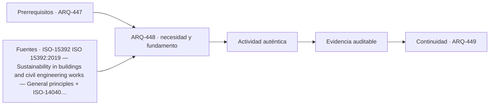

# ARQ-448 · Residuos, recuperación y riesgos de materiales

**Parte 45 · Clase desarrollada · Incorporada en v0.25.0.**

Prerrequisitos conceptuales: ARQ-447. Sin calendario. Los casos, cantidades, algoritmos e indicadores son didácticos y ficticios salvo antecedentes expresamente atribuidos. No constituyen certificación BIM, ACV conforme, auditoría, especificación contractual ni habilitación profesional. Revisión externa especializada pendiente.

## Pregunta central

¿Cómo gestionar flujos de demolición y obra sin confundir residuo, subproducto, material recuperable y material seguro para un nuevo uso?

## Resultado y continuidad

ARQ-448 recibe la lógica de ARQ-447; cualquier parámetro nuevo se identifica como caso propio y no modifica retrospectivamente el capítulo anterior. Elaborarás una estructura de evidencia, resolverás un caso reproducible, contrastarás una variante y cerrarás distinguiendo dato, requisito, interpretación y pendiente.

## 1. Definir la pregunta y el uso

El primer paso es identificar materiales, cantidades, condición y posibles peligros. Separar por destino antes de caracterizar puede llevar materiales problemáticos a corrientes que no los admiten.

## 2. Información que debe conservar significado

Recuperar una fracción de masa no significa recuperar igual valor o función. Un material puede reciclarse como insumo de menor calidad, reutilizarse directamente o requerir tratamiento; los destinos deben distinguirse.

## 3. Estados, versiones y fronteras

Los porcentajes necesitan denominador. “80 % recuperado” puede referirse a masa, volumen, costo o cantidad de piezas. Sin esa base, el indicador es ambiguo.

## 4. Comprobación antes de automatizar

Los riesgos de materiales requieren competencias y procedimientos. La clase no enseña identificación de sustancias peligrosas por apariencia ni métodos de retirada; enseña a detener decisiones cuando falta caracterización.

## 5. Caso trabajado

Caso RES-01: 10 t de material ficticio se distribuyen en 4 t de reúso directo, 3 t de reciclaje, 1 t de tratamiento especial y 2 t sin destino confirmado. La recuperación material confirmada es 7/10=70 % si la definición incluye reúso+reciclaje. No corresponde anunciar 90 % sumando tratamiento especial, ni 100 % suponiendo que lo desconocido terminará recuperándose.

## 6. Profundización: de una cifra a una decisión auditable

La comprobación no termina cuando una suma cierra. Debe poder reconstruirse la **procedencia** de cada entrada, la **unidad**, la **versión** y la **frontera** a la que pertenece. Cuando dos resultados se comparan, ambos deben responder a la misma pregunta o la diferencia debe explicarse antes de concluir.

Una segunda comprobación útil cambia una sola hipótesis. Si el resultado cambia mucho, la decisión es sensible a ese dato; si cambia poco, puede ser más importante investigar otra variable. Sensibilidad no significa probabilidad: los escenarios del curso no inventan distribuciones estadísticas cuando no hay datos.

También se conserva el estado desconocido. En información digital, un campo ausente no es cero; en una comparación ambiental, un módulo no reportado no es impacto nulo; en un control de reglas, una condición no comprobada no se transforma en aprobación. Esta disciplina impide que un tablero visualmente “verde” o una tabla aparentemente completa oculte huecos relevantes.

## 7. Interfaces profesionales y control de cambios

Arquitectura, ingeniería, construcción, operación, datos y sostenibilidad pueden utilizar el mismo objeto con propósitos diferentes. El registro debe indicar quién origina una propiedad, quién la revisa, para qué uso se acepta y qué modificación obliga a reabrir la evidencia. Un cambio de geometría puede afectar cantidad, cronograma y análisis ambiental; un cambio de producto puede afectar propiedades, documentación y mantenimiento.

El control de cambios no exige repetir indiscriminadamente todo. Exige rastrear dependencias y justificar qué permanece válido. Si un identificador, versión o fuente cambia, los documentos dependientes deben revisarse de forma proporcional al efecto. Conservar la base anterior permite entender la evolución y evita reemplazar silenciosamente resultados desfavorables.

## 8. Errores frecuentes

Evita confundir presencia de información con validez; formato abierto con interoperabilidad garantizada; automatización con verificación completa; clasificación con desempeño; archivo entregado con activo operable; EPD con superioridad ambiental; carbono con sostenibilidad total; y certificación con cumplimiento de todas las dimensiones del proyecto.

Otro error es sumar porcentajes o indicadores que tienen denominadores distintos. Antes de combinar valores, escribe sus unidades, población u objeto, horizonte y criterio. Cuando no existe una conversión defendible, presenta los resultados en paralelo y explica el conflicto en lugar de fabricar una puntuación universal.

*Figura 448. Esquema original del programa. Resume relaciones del caso; no representa una obra, producto o certificación real.*

## 9. Práctica independiente

Con 25 t: 8 reúso, 9 reciclaje, 3 tratamiento especial y 5 desconocidas. Calcula recuperación confirmada y explica cómo reportar lo desconocido.

10. Solución razonada

Reúso+reciclaje=17 t=68 %. Tratamiento y desconocido se mantienen en categorías distintas. El informe no decide su destino final sin evidencia.

La solución pertenece únicamente al modelo declarado. En un proyecto real deben verificarse fuentes, contratos de información, software, reglas de intercambio, declaraciones ambientales, datos de producto, legislación, autorizaciones y responsabilidades aplicables. Una ficha pública de norma no equivale a la lectura completa de sus cláusulas.

## 11. Autoevaluación y transferencia

Puedes avanzar cuando seas capaz de reconstruir el caso sin mirar la respuesta, nombrar al menos una condición que el cálculo no verifica y explicar qué actor debería producir la evidencia pendiente. Si solo puedes repetir el porcentaje final, el aprendizaje está incompleto.

La clase siguiente conserva el **método**, no las cifras. Las familias de casos permanecen separadas para que un valor didáctico no reaparezca como antecedente de otro proyecto.

<!-- pedagogia-2026:inicio -->
## Decisión pedagógica y posición curricular

### Por qué existe

Esta clase existe para resolver una necesidad concreta del recorrido: ¿Cómo gestionar flujos de demolición y obra sin confundir residuo, subproducto, material recuperable y material seguro para un nuevo uso?

### Por qué está exactamente aquí

Ocupa el lugar 8 de la Parte 45. Se estudia después de ARQ-447 · Desmontaje, reúso y diseño circular porque usa esa base para responder «¿Cómo gestionar flujos de demolición y obra sin confundir residuo, subproducto, material recuperable y material seguro para un nuevo uso?». Se ubica antes de ARQ-449 · Certificaciones de edificios y límites del sello porque la evidencia producida aquí debe estar disponible para ese paso.

- **Prerrequisitos:** `ARQ-447`
- **Capacidad que introduce:** ARQ-448 recibe la lógica de ARQ-447; cualquier parámetro nuevo se identifica como caso propio y no modifica retrospectivamente el capítulo anterior. Elaborarás una estructura de evidencia, resolverás un caso reproducible, contrastarás una variante y cerrarás distinguiendo dato, requisito, interpretación y pendiente.
- **Clases o experiencias que dependen de ella:** `ARQ-449`

El diagrama permite comprobar una relación que el texto lineal oculta con facilidad: esta clase recibe capacidades previas, toma decisiones apoyadas por fuentes, exige una experiencia y produce evidencia que habilita trabajo posterior. No representa un procedimiento de obra.

## Resultado observable, evidencia y evaluación

1. Identificar y delimitar las condiciones necesarias para responder la pregunta central de residuos, recuperación y riesgos de materiales.
2. Producir y comprobar la evidencia declarada por la clase: ARQ-448 recibe la lógica de ARQ-447; cualquier parámetro nuevo se identifica como caso propio y no modifica retrospectivamente el capítulo anterior. Elaborarás una estructura de evidencia, resolverás un caso reproducible, contrastarás una variante y cerrarás distinguiendo dato, requisito, interpretación y pendiente.
3. Justificar una decisión de residuos, recuperación y riesgos de materiales mediante fuentes, supuestos, alternativas y límites explícitos.

## Actividad, evidencia y criterio de aceptación

**Actividad:** Con 25 t: 8 reúso, 9 reciclaje, 3 tratamiento especial y 5 desconocidas. Calcula recuperación confirmada y explica cómo reportar lo desconocido.

**Evidencia mínima:** ARQ-448 recibe la lógica de ARQ-447; cualquier parámetro nuevo se identifica como caso propio y no modifica retrospectivamente el capítulo anterior. Elaborarás una estructura de evidencia, resolverás un caso reproducible, contrastarás una variante y cerrarás distinguiendo dato, requisito, interpretación y pendiente.

**Archivo sugerido:** `evidence/ARQ-448/evidencia.md`.

**Criterio de aceptación:** la entrega se acepta cuando:

- La entrega responde explícitamente a la pregunta: ¿Cómo gestionar flujos de demolición y obra sin confundir residuo, subproducto, material recuperable y material seguro para un nuevo uso?
- La actividad conserva las fronteras del caso y permite reconstruir el procedimiento: Con 25 t: 8 reúso, 9 reciclaje, 3 tratamiento especial y 5 desconocidas. Calcula recuperación confirmada y explica cómo reportar lo desconocido.
- Cada afirmación externa puede seguirse hasta una fuente, su alcance consultado y su límite.
- La evidencia deja disponible una entrada comprobable para ARQ-449.
- Evita confundir presencia de información con validez; formato abierto con interoperabilidad garantizada; automatización con verificación completa; clasificación con desempeño; archivo entregado con activo operable; EPD con superioridad ambiental; carbono con sostenibilidad total; y certificación con cumplimiento de todas las dimensiones del proyecto. Otro error es sumar porcentajes o indicadores que tienen denominadores distintos.

La [rúbrica común](../../docs/RUBRICA_COMUN.md) complementa estos criterios; no los reemplaza. Una entrega puede superar un promedio y continuar pendiente si oculta una condición crítica.

## Trazabilidad de las decisiones

| # | Decisión o fundamento | Fuente utilizada | Aplicación y límite en esta clase |
|---:|---|---|---|
| 1 | Principios generales de sostenibilidad aplicados al ciclo de vida de obras de construcción. | [ISO-15392 ISO 15392:2019 — Sustainability in buildings and civil…](https://www.iso.org/standard/69947.html) | Consulta: Ficha pública; edición 2019 confirmada en 2025. Límite: La propia ficha indica que no proporciona niveles de desempeño para sustentar afirmaciones absolutas de sostenibilidad. |
| 2 | Objetivo y alcance, inventario, evaluación e interpretación de ACV | [ISO-14040 ISO 14040:2006](https://www.iso.org/standard/37456.html) | Consulta: Ficha pública Límite: Revisar enmiendas aplicables; no se reproduce el texto normativo. |

La tabla permite auditar las relaciones; la explicación, el caso y la práctica de la clase siguen siendo la documentación principal.

## Autoevaluación, recuperación y continuidad

### Errores diagnósticos

Antes de avanzar, comprueba si puedes reconstruir cada resultado sin mirar la solución, señalar qué evidencia lo sostiene y nombrar una condición que obligaría a revisar tu decisión. Conserva la primera versión, la objeción recibida y la revisión.

**Conexión siguiente:** La continuidad inmediata es ARQ-449 · Certificaciones de edificios y límites del sello; conserva el método y vuelve a verificar datos y límites.
<!-- pedagogia-2026:fin -->

## Fuentes y alcance de uso

### [[ISO-15392]](#FUENTE-ISO-15392) ISO 15392:2019 — Sustainability in buildings and civil engineering works — General principles

ISO. [https://www.iso.org/standard/69947.html](https://www.iso.org/standard/69947.html)

**Consulta:** Ficha pública; edición 2019 confirmada en 2025. **Apoyo:** Principios generales de sostenibilidad aplicados al ciclo de vida de obras de construcción. **Límite:** La propia ficha indica que no proporciona niveles de desempeño para sustentar afirmaciones absolutas de sostenibilidad.

### [[ISO-14040]](#FUENTE-ISO-14040) ISO 14040:2006 — Life cycle assessment — Principles and framework

ISO. [https://www.iso.org/standard/37456.html](https://www.iso.org/standard/37456.html)

**Consulta:** Ficha pública **Apoyo:** Objetivo y alcance, inventario, evaluación e interpretación de ACV **Límite:** Revisar enmiendas aplicables; no se reproduce el texto normativo.
