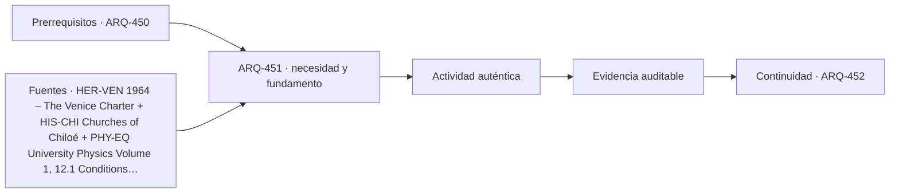

# ARQ-451 · Reconocer valor y daño antes de intervenir

**Parte 46 · Clase redactada, primera edición de estudio.**

El material es educativo: no constituye un proyecto construible, cálculo firmado, informe pericial ni habilitación profesional. Los casos y cifras son sintéticos salvo indicación explícita. La revisión externa por especialistas está pendiente.

## Pregunta central

Antes de reparar una grieta o sustituir un material antiguo, ¿qué necesitas comprender? La apariencia visible puede ser una manifestación de distintos mecanismos, y la intervención puede afectar valores que no se reconocen a primera vista. Esta clase une dos lecturas que no deben separarse: significación del edificio y diagnóstico de su condición.

## Resultado y límites

Elaborarás un dossier inicial que distinga observaciones, hipótesis, información faltante y decisiones suspendidas. No entrarás a edificios dañados, no retirarás elementos ni realizarás ensayos destructivos. No se enseña a declarar estabilidad ni a elegir refuerzos sin evaluación especializada. La actividad utiliza un caso ficticio y documentación no invasiva.

## Valor y daño son preguntas diferentes

Preguntar por valor significa investigar qué relaciones materiales, espaciales, culturales o de uso hacen significativa una obra para distintas personas. Preguntar por daño significa examinar alteraciones y sus consecuencias. Un material deteriorado puede seguir conteniendo evidencia importante; un acabado aparentemente nuevo puede ocultar un problema o una pérdida de información.

ICOMOS sitúa la Carta de Venecia dentro de la historia de los principios de conservación [[HER-VEN]](#FUENTE-HER-VEN). En esta clase no se extraen reglas de artículos no consultados. Se trabaja una precaución metodológica: comprender y documentar antes de intervenir. La declaración patrimonial de las iglesias de Chiloé permite reconocer, como caso de estudio, relaciones entre construcción, comunidad y continuidad cultural [[HIS-CHI]](#FUENTE-HIS-CHI). No se aplica su situación jurídica a un edificio ficticio.

## Observar no equivale a diagnosticar

«Se ve una mancha oscura cerca de una base de muro» es una observación. «Hay humedad ascendente» es una hipótesis causal que necesita comprobación. Podrían existir otras explicaciones, y varias causas podrían interactuar. Un diagnóstico responsable no se obtiene escogiendo la primera palabra que parece ajustarse a una fotografía.

Lo mismo ocurre con una fisura. Su posición y apariencia son datos iniciales, pero no permiten por sí solos afirmar si es activa, cuál es su causa ni qué consecuencias tiene. El contexto, la estructura, las cargas, el terreno y la historia de cambios pueden ser relevantes. Los principios de equilibrio ayudan a comprender preguntas estructurales, pero no convierten una inspección visual informal en un análisis competente [[PHY-EQ]](#FUENTE-PHY-EQ).

## Caso trabajado: antigua sala comunitaria ficticia

La organización desea transformar una sala en espacio de lectura. Se observan manchas en un muro, algunas fisuras y un revestimiento reciente. Hay fotografías antiguas, pero no un levantamiento actualizado ni antecedentes suficientes de las intervenciones. El edificio no tiene en este ejercicio una declaración patrimonial conocida; esa condición no debe inventarse.

**Primero registramos lo conocido.** Identificamos documentos, fechas, autores y diferencias entre estados. Una fotografía tomada antes de una reparación no representa necesariamente la condición actual. El expediente conserva ambas sin mezclarlas. Las observaciones se ubican en un plano preliminar y se aclara su precisión.

**Después planteamos hipótesis alternativas.** Para la mancha podrían investigarse ingreso de agua desde el exterior, problemas de instalaciones u otros mecanismos pertinentes. No asignamos una causa definitiva. Para las fisuras se solicita evaluación por profesionales según la condición y el riesgo, sin proponer que una aplicación de pintura resolverá el asunto.

**Luego preguntamos por el uso propuesto.** Un cambio a biblioteca puede introducir nuevas cargas, condiciones de acceso, iluminación, conservación de libros y operación. No basta con añadir estanterías al plano existente. El proyecto debe revisar requisitos y compatibilidad con el edificio, incluido el marco local de autorizaciones [[CL-OGUC]](#FUENTE-CL-OGUC).

**Finalmente delimitamos qué no hacer.** No se retiran componentes para «ver qué hay» sin evaluación y autorización; no se entra en espacios restringidos ni se cubren evidencias antes de documentarlas. Cuando existen dudas de seguridad, se siguen indicaciones de autoridades y profesionales competentes.

## Matriz de diagnóstico inicial

<table>
<thead>
<tr>
  <th>Observación</th>
  <th>Hipótesis por investigar</th>
  <th>Evidencia adicional</th>
  <th>Decisión suspendida</th>
</tr>
</thead>
<tbody>
<tr>
  <td>Mancha en base de muro</td>
  <td>Distintas rutas de humedad posibles</td>
  <td>Inspección competente y antecedentes</td>
  <td>Elegir revestimiento definitivo</td>
</tr>
<tr>
  <td>Fisura visible</td>
  <td>Mecanismo no determinado</td>
  <td>Evaluación técnica según condición</td>
  <td>Declarar estabilidad o diseñar refuerzo</td>
</tr>
<tr>
  <td>Revestimiento reciente</td>
  <td>Reparación o modificación desconocida</td>
  <td>Registros, testimonios y documentación</td>
  <td>Retirarlo o reproducirlo</td>
</tr>
<tr>
  <td>Nuevo uso de lectura</td>
  <td>Cambios de carga y operación</td>
  <td>Programa, revisión técnica y normativa</td>
  <td>Instalar equipamiento pesado</td>
</tr>
</tbody>
</table>

El valor de la matriz está en que impide usar una hipótesis como instrucción de obra. Una casilla «pendiente» no es una falla administrativa cuando realmente falta evidencia; es información esencial para no tomar una decisión prematura.

## Comparar intervenir y no intervenir

Toda opción tiene consecuencias. No actuar puede permitir continuidad del deterioro; intervenir sin diagnóstico puede ocultarlo o crear incompatibilidades. Una propuesta debe describir el problema que pretende resolver, la evidencia que la sostiene, los efectos posibles y cómo se comprobará el resultado.

Para comparar alternativas, considera compatibilidad material, impacto sobre información histórica, seguridad, uso, posibilidad de mantenimiento y reversibilidad o desmontabilidad cuando sea pertinente. No todos estos criterios tienen la misma importancia en todos los casos. Tampoco se utiliza «reversible» como una promesa absoluta cuando una intervención tiene efectos físicos permanentes.

## Rehabilitar no es solo mejorar una cifra

Una mejora térmica puede alterar condiciones de humedad o encuentros. Una modificación de acceso puede afectar estructura o valores culturales. Una adecuación de instalaciones puede exigir pasos por elementos sensibles. Por eso la rehabilitación necesita coordinación entre disciplinas y no una suma de soluciones independientes.

Después de un desastre, la idea de reconstruir mejor incorpora reducción del riesgo [[RISK-BBB]](#FUENTE-RISK-BBB). No equivale a reproducir lo perdido sin revisar causas de vulnerabilidad. En patrimonio, esa discusión añade preguntas sobre significado, documentación y continuidad comunitaria, que deben tratarse con actores y especialistas pertinentes.

## Práctica y solución orientativa

Redacta dos páginas sobre el caso ficticio: una de observaciones y otra de hipótesis y decisiones pendientes. Incluye un índice de documentos que solicitarías y una pregunta a los usuarios que ayude a comprender el valor del lugar. No asignes una causa única a la humedad ni una solución de refuerzo.

Una respuesta adecuada distinguirá el dato visible de su interpretación, reconocerá el cambio de uso como fuente de nuevas preguntas y pedirá revisión competente. Una respuesta insuficiente recomendará sellar todas las fisuras, impermeabilizar cualquier superficie o sustituir todo el material antiguo sin explicar el mecanismo ni las consecuencias.

## Evaluación

La rúbrica propuesta asigna 30 % a documentación y procedencia, 30 % a diagnóstico diferencial, 20 % a comprensión de valores y 20 % a límites y coordinación. Son errores críticos deducir seguridad de una foto, intervenir sin autorización y confundir apariencia restaurada con problema resuelto. La capacidad central es saber qué evidencia debe existir antes de proponer una transformación.

<!-- pedagogia-2026:inicio -->
## Decisión pedagógica y posición curricular

### Por qué existe

Esta clase existe para resolver una necesidad concreta del recorrido: Antes de reparar una grieta o sustituir un material antiguo, ¿qué necesitas comprender? La apariencia visible puede ser una manifestación de distintos mecanismos, y la intervención puede afectar valores que no se reconocen a primera vista.

### Por qué está exactamente aquí

Abre la Parte 46 porque plantea primero el problema «Antes de reparar una grieta o sustituir un material antiguo, ¿qué necesitas comprender? La apariencia visible puede ser una manifestación de distintos mecanismos, y la intervención puede afectar valores que no se reconocen a primera vista.». La transición desde ARQ-450 · Balance ambiental y social sin afirmaciones absolutas conserva métodos de evidencia y límites, pero no traslada parámetros del bloque anterior. Establece la pregunta y el producto base que ARQ-452 · Levantamiento histórico y material desarrollará a continuación.

- **Prerrequisitos:** `ARQ-450`
- **Capacidad que introduce:** Elaborarás un dossier inicial que distinga observaciones, hipótesis, información faltante y decisiones suspendidas. No entrarás a edificios dañados, no retirarás elementos ni realizarás ensayos destructivos. No se enseña a declarar estabilidad ni a elegir refuerzos sin evaluación especializada.
- **Clases o experiencias que dependen de ella:** `ARQ-452`

El diagrama permite comprobar una relación que el texto lineal oculta con facilidad: esta clase recibe capacidades previas, toma decisiones apoyadas por fuentes, exige una experiencia y produce evidencia que habilita trabajo posterior. No representa un procedimiento de obra.

## Resultado observable, evidencia y evaluación

1. Identificar y delimitar las condiciones necesarias para responder la pregunta central de reconocer valor y daño antes de intervenir.
2. Producir y comprobar la evidencia declarada por la clase: Elaborarás un dossier inicial que distinga observaciones, hipótesis, información faltante y decisiones suspendidas. No entrarás a edificios dañados, no retirarás elementos ni realizarás ensayos destructivos. No se enseña a declarar estabilidad ni a elegir refuerzos sin evaluación especializada.
3. Justificar una decisión de reconocer valor y daño antes de intervenir mediante fuentes, supuestos, alternativas y límites explícitos.

## Actividad, evidencia y criterio de aceptación

**Actividad:** Redacta dos páginas sobre el caso ficticio: una de observaciones y otra de hipótesis y decisiones pendientes. Incluye un índice de documentos que solicitarías y una pregunta a los usuarios que ayude a comprender el valor del lugar. No asignes una causa única a la humedad ni una solución de refuerzo.

**Evidencia mínima:** Elaborarás un dossier inicial que distinga observaciones, hipótesis, información faltante y decisiones suspendidas. No entrarás a edificios dañados, no retirarás elementos ni realizarás ensayos destructivos. No se enseña a declarar estabilidad ni a elegir refuerzos sin evaluación especializada.

**Archivo sugerido:** `evidence/ARQ-451/evidencia.md`.

**Criterio de aceptación:** la entrega se acepta cuando:

- La entrega responde explícitamente a la pregunta: Antes de reparar una grieta o sustituir un material antiguo, ¿qué necesitas comprender? La apariencia visible puede ser una manifestación de distintos mecanismos, y la intervención puede afectar valores que no se reconocen a primera vista.
- La actividad conserva las fronteras del caso y permite reconstruir el procedimiento: Redacta dos páginas sobre el caso ficticio: una de observaciones y otra de hipótesis y decisiones pendientes. Incluye un índice de documentos que solicitarías y una pregunta a los usuarios que ayude a comprender el valor del lugar. No asignes una causa única a la humedad ni una solución de refuerzo.
- Cada afirmación externa puede seguirse hasta una fuente, su alcance consultado y su límite.
- La evidencia deja disponible una entrada comprobable para ARQ-452.
- Redacta dos páginas sobre el caso ficticio: una de observaciones y otra de hipótesis y decisiones pendientes. Incluye un índice de documentos que solicitarías y una pregunta a los usuarios que ayude a comprender el valor del lugar.

La [rúbrica común](../../docs/RUBRICA_COMUN.md) complementa estos criterios; no los reemplaza. Una entrega puede superar un promedio y continuar pendiente si oculta una condición crítica.

## Trazabilidad de las decisiones

| # | Decisión o fundamento | Fuente utilizada | Aplicación y límite en esta clase |
|---:|---|---|---|
| 1 | Existencia y contexto de la Carta de Venecia. | [HER-VEN 1964 – The Venice Charter](https://landscapes.icomos.org/the-venice-charter-1964/) | Consulta: Página institucional de contexto. Límite: No se atribuyen artículos concretos sin consultar el texto de la carta. Conservación local requiere normativa y especialistas. |
| 2 | Tradición de carpintería, cruces culturales, paisaje, comunidad y conservación. | [HIS-CHI Churches of Chiloé](https://whc.unesco.org/en/list/971/) | Consulta: Ficha patrimonial y declaración de valor universal. Límite: No sustituye levantamiento ni diagnóstico de una iglesia concreta. No se reproducen imágenes de terceros. |
| 3 | Equilibrio de fuerzas y momentos; diagramas de cuerpo libre. | [PHY-EQ University Physics Volume 1, 12.1 Conditions for Static…](https://openstax.org/books/university-physics-volume-1/pages/12-1-conditions-for-static-equilibrium) | Consulta: Capítulo abierto. Límite: Modelo de física introductoria, no reglas de dimensionamiento de edificios. |
| 4 | Reconstrucción que integra reducción del riesgo. | [Organismo o autor: UNDRR. Consulta registrada: 2026-09-20.](https://www.undrr.org/terminology/build-back-better) | Consulta: Definición institucional. Límite: No autoriza reconstruir en un lugar expuesto ni sustituye evaluación de alternativas. |

La tabla permite auditar las relaciones; la explicación, el caso y la práctica de la clase siguen siendo la documentación principal.

## Autoevaluación, recuperación y continuidad

### Errores diagnósticos

Antes de avanzar, comprueba si puedes reconstruir cada resultado sin mirar la solución, señalar qué evidencia lo sostiene y nombrar una condición que obligaría a revisar tu decisión. Conserva la primera versión, la objeción recibida y la revisión.

**Conexión siguiente:** La continuidad inmediata es ARQ-452 · Levantamiento histórico y material; conserva el método y vuelve a verificar datos y límites.
<!-- pedagogia-2026:fin -->

## Fuentes y alcance de uso

- **[[HER-VEN]](#FUENTE-HER-VEN) 1964 – The Venice Charter** — ICOMOS, Comité Científico Internacional de Paisajes Culturales. [https://landscapes.icomos.org/the-venice-charter-1964/](https://landscapes.icomos.org/the-venice-charter-1964/)
Uso: Existencia y contexto de la Carta de Venecia. Alcance de consulta: Página institucional de contexto. Límite: No se atribuyen artículos concretos sin consultar el texto de la carta. Conservación local requiere normativa y especialistas.

- **[[HIS-CHI]](#FUENTE-HIS-CHI) Churches of Chiloé** — UNESCO World Heritage Centre. [https://whc.unesco.org/en/list/971/](https://whc.unesco.org/en/list/971/)
Uso: Tradición de carpintería, cruces culturales, paisaje, comunidad y conservación. Alcance de consulta: Ficha patrimonial y declaración de valor universal. Límite: No sustituye levantamiento ni diagnóstico de una iglesia concreta. No se reproducen imágenes de terceros.

- **[[PHY-EQ]](#FUENTE-PHY-EQ) University Physics Volume 1, 12.1 Conditions for Static Equilibrium** — OpenStax / Rice University. [https://openstax.org/books/university-physics-volume-1/pages/12-1-conditions-for-static-equilibrium](https://openstax.org/books/university-physics-volume-1/pages/12-1-conditions-for-static-equilibrium)
Uso: Equilibrio de fuerzas y momentos; diagramas de cuerpo libre. Alcance de consulta: Capítulo abierto. Límite: Modelo de física introductoria, no reglas de dimensionamiento de edificios.

- **[[RISK-BBB]](#FUENTE-RISK-BBB) Build back better: terminology** — UNDRR. [https://www.undrr.org/terminology/build-back-better](https://www.undrr.org/terminology/build-back-better)
Uso: Reconstrucción que integra reducción del riesgo. Alcance de consulta: Definición institucional. Límite: No autoriza reconstruir en un lugar expuesto ni sustituye evaluación de alternativas.

- **[[CL-OGUC]](#FUENTE-CL-OGUC) Decreto 47: Ordenanza General de Urbanismo y Construcciones** — BCN / LeyChile. [https://www.bcn.cl/leychile/navegar?idNorma=8201](https://www.bcn.cl/leychile/navegar?idNorma=8201)
Uso: Localizador principal para verificar requisitos urbanísticos y de edificación. Alcance de consulta: Texto consolidado disponible; revisión de marco, no de cada disposición. Límite: Una ficha educativa no reemplaza lectura del artículo vigente, sus modificaciones, transitorios y antecedentes del proyecto.

Consulta de referencias: **20 de septiembre de 2026**. Los razonamientos, datos de ejercicio y soluciones son elaboración didáctica original; no se atribuyen a las fuentes como estudios de casos reales.
